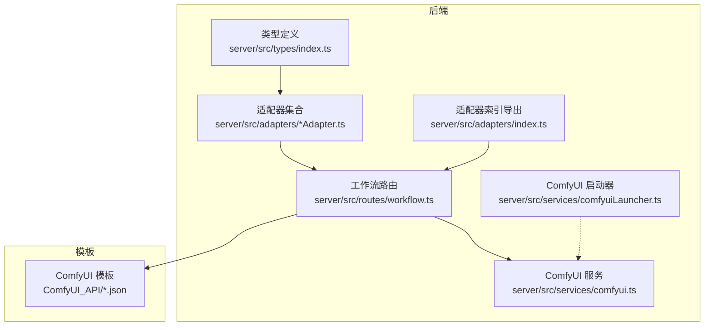
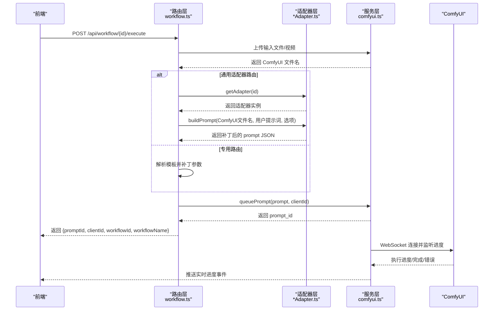
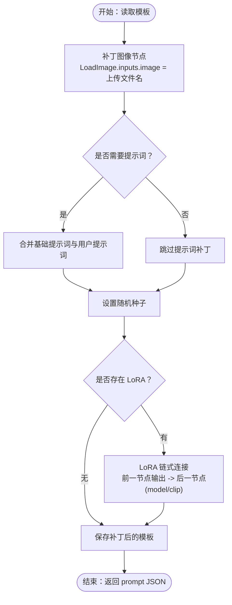
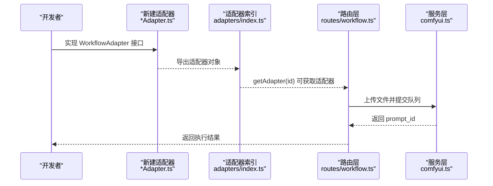
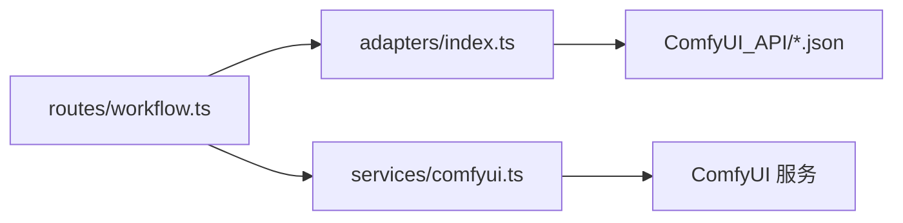

# 工作流扩展开发

<cite>
**本文引用的文件**
- [server/src/types/index.ts](file://server/src/types/index.ts)
- [server/src/adapters/BaseAdapter.ts](file://server/src/adapters/BaseAdapter.ts)
- [server/src/adapters/index.ts](file://server/src/adapters/index.ts)
- [server/src/adapters/Workflow0Adapter.ts](file://server/src/adapters/Workflow0Adapter.ts)
- [server/src/adapters/Workflow2Adapter.ts](file://server/src/adapters/Workflow2Adapter.ts)
- [server/src/adapters/Workflow5Adapter.ts](file://server/src/adapters/Workflow5Adapter.ts)
- [server/src/adapters/Workflow10Adapter.ts](file://server/src/adapters/Workflow10Adapter.ts)
- [server/src/routes/workflow.ts](file://server/src/routes/workflow.ts)
- [server/src/services/comfyui.ts](file://server/src/services/comfyui.ts)
- [server/src/services/comfyuiLauncher.ts](file://server/src/services/comfyuiLauncher.ts)
- [ComfyUI_API/👻二次元转真人(NoUnload).json](file://ComfyUI_API/👻二次元转真人(NoUnload).json)
- [ComfyUI_API/2-Pix2Real-精修放大.json](file://ComfyUI_API/2-Pix2Real-精修放大.json)
- [ComfyUI_API/Pix2Real-解除装备Fixed.json](file://ComfyUI_API/Pix2Real-解除装备Fixed.json)
- [README.md](file://README.md)
</cite>

## 目录
1. [简介](#简介)
2. [项目结构](#项目结构)
3. [核心组件](#核心组件)
4. [架构总览](#架构总览)
5. [详细组件分析](#详细组件分析)
6. [依赖分析](#依赖分析)
7. [性能考虑](#性能考虑)
8. [故障排查指南](#故障排查指南)
9. [结论](#结论)
10. [附录](#附录)

## 简介
本指南面向希望为 CorineKit Pix2Real 扩展新的工作流适配器的开发者。内容涵盖：
- WorkflowAdapter 接口的职责与生命周期管理
- 适配器实现模式（继承抽象基类、必需方法、生命周期钩子）
- ComfyUI 工作流模板的创建与参数映射（节点配置、参数映射、连接关系）
- 新工作流适配器开发步骤（类继承、方法重写、错误处理）
- 工作流注册机制（适配器注册、路由映射、状态管理集成）
- 从简单到复杂的扩展示例（图像处理到多步骤工作流）

## 项目结构
后端采用 Express + TypeScript，核心模块如下：
- 类型定义：WorkflowAdapter 接口与事件类型
- 适配器层：每个工作流一个适配器，负责加载模板并构建 prompt
- 路由层：暴露工作流执行接口，处理文件上传、模板补丁、队列提交
- 服务层：封装 ComfyUI 的 HTTP/WS 交互、队列与进度追踪
- 模板层：ComfyUI_API 下的 JSON 模板文件

图表来源
- [server/src/types/index.ts:1-52](file://server/src/types/index.ts#L1-L52)
- [server/src/adapters/index.ts:1-33](file://server/src/adapters/index.ts#L1-L33)
- [server/src/routes/workflow.ts:1-800](file://server/src/routes/workflow.ts#L1-L800)
- [server/src/services/comfyui.ts:1-472](file://server/src/services/comfyui.ts#L1-L472)
- [server/src/services/comfyuiLauncher.ts:1-131](file://server/src/services/comfyuiLauncher.ts#L1-L131)

章节来源
- [README.md:41-79](file://README.md#L41-L79)

## 核心组件
- WorkflowAdapter 接口：定义工作流标识、名称、是否需要提示词、基础提示词、输出目录以及构建 prompt 的方法
- 适配器集合：集中导出所有适配器，并提供按 ID 获取适配器的工具函数
- 路由层：根据工作流 ID 或专用路由，加载模板、补丁参数、上传文件、提交队列
- 服务层：封装 ComfyUI 的上传、队列、历史查询、WebSocket 进度回调等

章节来源
- [server/src/types/index.ts:1-52](file://server/src/types/index.ts#L1-L52)
- [server/src/adapters/index.ts:1-33](file://server/src/adapters/index.ts#L1-L33)
- [server/src/routes/workflow.ts:1-800](file://server/src/routes/workflow.ts#L1-L800)
- [server/src/services/comfyui.ts:1-472](file://server/src/services/comfyui.ts#L1-L472)

## 架构总览
下图展示了从前端调用到 ComfyUI 执行的完整链路，以及适配器与路由的协作方式。

图表来源
- [server/src/routes/workflow.ts:152-799](file://server/src/routes/workflow.ts#L152-L799)
- [server/src/services/comfyui.ts:168-196](file://server/src/services/comfyui.ts#L168-L196)
- [server/src/adapters/index.ts:28-30](file://server/src/adapters/index.ts#L28-L30)

## 详细组件分析

### WorkflowAdapter 接口与生命周期
- 接口职责
  - id/name/basePrompt/needsPrompt/outputDir：描述工作流元数据
  - buildPrompt(imageName, userPrompt?, options?)：构建可提交给 ComfyUI 的 prompt 对象
- 生命周期管理
  - 适配器实例在应用启动时被集中导出，路由层通过 ID 获取并调用其 buildPrompt
  - 适配器不负责网络通信或状态持久化，仅负责模板补丁与参数映射
- 实现要点
  - 严格区分“模板补丁”与“运行时参数”，模板只改必要节点
  - 对于需要随机性的节点（如采样器），在适配器内设置随机种子
  - 对于需要用户输入的提示词，遵循 needsPrompt 与 basePrompt 的约定

章节来源
- [server/src/types/index.ts:1-8](file://server/src/types/index.ts#L1-L8)
- [server/src/adapters/index.ts:14-30](file://server/src/adapters/index.ts#L14-L30)

### 适配器实现模式与最佳实践
- 继承与导出
  - 适配器以对象形式导出，包含 id、name、needsPrompt、basePrompt、outputDir 与 buildPrompt
  - 在 adapters/index.ts 中集中导出并建立 id 到适配器的映射
- 模板加载与补丁
  - 适配器在 buildPrompt 中读取 JSON 模板，仅修改需要的节点 inputs
  - 通过节点 ID 精确映射，避免全量替换
- 参数映射规则
  - 图像输入：将上传到 ComfyUI 的文件名写入 LoadImage 节点
  - 提示词：根据 needsPrompt 与 basePrompt 规则拼接或覆盖
  - 随机性：为采样器等节点设置随机种子
- 错误处理
  - 适配器内部不捕获网络异常；路由层统一捕获并转换为用户友好错误

章节来源
- [server/src/adapters/Workflow0Adapter.ts:1-35](file://server/src/adapters/Workflow0Adapter.ts#L1-L35)
- [server/src/adapters/Workflow2Adapter.ts:1-28](file://server/src/adapters/Workflow2Adapter.ts#L1-L28)
- [server/src/adapters/Workflow5Adapter.ts:1-15](file://server/src/adapters/Workflow5Adapter.ts#L1-L15)
- [server/src/adapters/Workflow10Adapter.ts:1-15](file://server/src/adapters/Workflow10Adapter.ts#L1-L15)
- [server/src/adapters/index.ts:1-33](file://server/src/adapters/index.ts#L1-L33)

### ComfyUI 工作流模板创建与参数映射
- 模板结构
  - 每个工作流对应一个 JSON 文件，键为节点 ID，值包含 class_type、_meta（标题）、inputs（参数）
- 节点配置要点
  - 模型加载节点：ckpt_name、unet_name、lora_name 等
  - 图像处理节点：LoadImage、SaveImage、VAE 编解码、Upscale 等
  - 采样器节点：sampler_name、scheduler、steps、cfg、seed 等
- 参数映射
  - 适配器通过读取模板，将上传文件名写入 LoadImage.inputs.image
  - 将提示词写入 CLIPTextEncode 或相应节点
  - 为采样器设置随机种子
- 连接关系设计
  - 通过 inputs 中的 [sourceNodeId, slotIndex] 建立节点间连接
  - LoRA 链式连接：前一节点的输出连接到后一节点的 model/clip 输入
  - 条件分支：通过布尔节点控制不同分支的连接

图表来源
- [server/src/adapters/Workflow0Adapter.ts:16-33](file://server/src/adapters/Workflow0Adapter.ts#L16-L33)
- [server/src/adapters/Workflow2Adapter.ts:16-26](file://server/src/adapters/Workflow2Adapter.ts#L16-L26)
- [ComfyUI_API/👻二次元转真人(NoUnload).json:176-200](file://ComfyUI_API/👻二次元转真人(NoUnload).json#L176-L200)
- [ComfyUI_API/2-Pix2Real-精修放大.json:57-146](file://ComfyUI_API/2-Pix2Real-精修放大.json#L57-L146)

章节来源
- [ComfyUI_API/👻二次元转真人(NoUnload).json:1-215](file://ComfyUI_API/👻二次元转真人(NoUnload).json#L1-L215)
- [ComfyUI_API/2-Pix2Real-精修放大.json:1-146](file://ComfyUI_API/2-Pix2Real-精修放大.json#L1-L146)

### 新工作流适配器开发步骤
- 步骤一：创建适配器文件
  - 在 server/src/adapters 下新增适配器文件，导出一个实现 WorkflowAdapter 接口的对象
  - 设置 id、name、needsPrompt、basePrompt、outputDir
- 步骤二：准备模板
  - 在 ComfyUI_API 下创建或复用 JSON 模板，确保包含必要的节点（如 LoadImage、SaveImage、采样器等）
- 步骤三：实现 buildPrompt
  - 读取模板，补丁图像文件名、提示词、随机种子等
  - 如需 LoRA，按模板中的节点 ID 进行链式连接
- 步骤四：注册适配器
  - 在 adapters/index.ts 中导出并加入映射表
- 步骤五：编写路由（如需专用路由）
  - 在 routes/workflow.ts 中添加 POST /api/workflow/{id}/execute 或专用路由
  - 解析请求参数，上传文件，补丁模板，提交队列
- 步骤六：错误处理
  - 路由层统一捕获异常并转换为用户友好提示
  - 适配器不处理网络错误

图表来源
- [server/src/adapters/index.ts:14-30](file://server/src/adapters/index.ts#L14-L30)
- [server/src/routes/workflow.ts:750-799](file://server/src/routes/workflow.ts#L750-L799)
- [server/src/services/comfyui.ts:168-196](file://server/src/services/comfyui.ts#L168-L196)

章节来源
- [server/src/adapters/Workflow0Adapter.ts:1-35](file://server/src/adapters/Workflow0Adapter.ts#L1-L35)
- [server/src/adapters/Workflow2Adapter.ts:1-28](file://server/src/adapters/Workflow2Adapter.ts#L1-L28)
- [server/src/adapters/index.ts:1-33](file://server/src/adapters/index.ts#L1-L33)
- [server/src/routes/workflow.ts:750-799](file://server/src/routes/workflow.ts#L750-L799)

### 工作流注册机制与状态管理集成
- 适配器注册
  - adapters/index.ts 导出 adapters 映射与 getAdapter 工具函数
  - 路由层通过 getAdapter(id) 获取适配器实例
- 路由映射
  - 通用路由：/api/workflow/{id}/execute，适用于大多数工作流
  - 专用路由：/api/workflow/5/execute、/api/workflow/10/execute 等，针对特殊输入（如图像+蒙版）
- 状态管理集成
  - 服务层通过 WebSocket 与 ComfyUI 通信，上报进度、完成与错误事件
  - 前端通过 hooks 使用 WebSocket，实现全局进度追踪与 UI 更新

章节来源
- [server/src/adapters/index.ts:14-30](file://server/src/adapters/index.ts#L14-L30)
- [server/src/routes/workflow.ts:152-799](file://server/src/routes/workflow.ts#L152-L799)
- [server/src/services/comfyui.ts:265-375](file://server/src/services/comfyui.ts#L265-L375)

### 扩展示例

#### 示例一：简单图像处理工作流（文本到图像）
- 适用场景：快速出图、无需用户输入图像
- 关键点
  - 适配器：读取模板，设置模型、尺寸、采样器参数、提示词、随机种子
  - 路由：/api/workflow/7/execute（通用路由），支持 LoRA 链式连接
- 参考文件
  - 适配器模板：[server/src/adapters/Workflow2Adapter.ts:1-28](file://server/src/adapters/Workflow2Adapter.ts#L1-L28)
  - 模板文件：[ComfyUI_API/2-Pix2Real-精修放大.json:1-146](file://ComfyUI_API/2-Pix2Real-精修放大.json#L1-L146)
  - 路由实现：[server/src/routes/workflow.ts:269-405](file://server/src/routes/workflow.ts#L269-L405)

章节来源
- [server/src/adapters/Workflow2Adapter.ts:1-28](file://server/src/adapters/Workflow2Adapter.ts#L1-L28)
- [server/src/routes/workflow.ts:269-405](file://server/src/routes/workflow.ts#L269-L405)
- [ComfyUI_API/2-Pix2Real-精修放大.json:1-146](file://ComfyUI_API/2-Pix2Real-精修放大.json#L1-L146)

#### 示例二：复杂多步骤工作流（解除装备）
- 适用场景：需要图像+蒙版的区域编辑
- 关键点
  - 专用路由：/api/workflow/5/execute，解析 image 与 mask，补丁模板节点
  - 模板连接：LoadImage 与蒙版节点连接，KSampler 采样
- 参考文件
  - 专用路由：[server/src/routes/workflow.ts:163-215](file://server/src/routes/workflow.ts#L163-L215)
  - 模板文件：[ComfyUI_API/Pix2Real-解除装备Fixed.json:1-200](file://ComfyUI_API/Pix2Real-解除装备Fixed.json#L1-L200)

章节来源
- [server/src/routes/workflow.ts:163-215](file://server/src/routes/workflow.ts#L163-L215)
- [ComfyUI_API/Pix2Real-解除装备Fixed.json:1-200](file://ComfyUI_API/Pix2Real-解除装备Fixed.json#L1-L200)

#### 示例三：LoRA 链式连接与动态重连
- 适用场景：多个 LoRA 按启用状态串联
- 关键点
  - 路由层提供 applyLoraChain 函数，按启用状态动态重连
  - 未启用 LoRA 时直连到模型源，启用时链式连接
- 参考文件
  - LoRA 应用逻辑：[server/src/routes/workflow.ts:40-86](file://server/src/routes/workflow.ts#L40-L86)

章节来源
- [server/src/routes/workflow.ts:40-86](file://server/src/routes/workflow.ts#L40-L86)

## 依赖分析
- 组件耦合
  - 路由层依赖适配器集合与服务层
  - 适配器层依赖模板文件与路径解析
  - 服务层依赖 ComfyUI 的 HTTP/WS 接口
- 外部依赖
  - ComfyUI 进程与端口（默认 8188）
  - WebSocket 客户端用于进度推送
- 潜在循环依赖
  - 适配器与路由之间通过接口契约解耦，无直接循环导入

图表来源
- [server/src/routes/workflow.ts:1-16](file://server/src/routes/workflow.ts#L1-L16)
- [server/src/adapters/index.ts:1-3](file://server/src/adapters/index.ts#L1-L3)
- [server/src/services/comfyui.ts:1-8](file://server/src/services/comfyui.ts#L1-L8)

章节来源
- [server/src/routes/workflow.ts:1-16](file://server/src/routes/workflow.ts#L1-L16)
- [server/src/adapters/index.ts:1-3](file://server/src/adapters/index.ts#L1-L3)
- [server/src/services/comfyui.ts:1-8](file://server/src/services/comfyui.ts#L1-L8)

## 性能考虑
- 模板补丁最小化：仅修改必要节点，减少 JSON 深拷贝与序列化成本
- LoRA 链式连接：启用状态变化时动态重连，避免无效连接
- 进度权重估算：服务层基于节点类型与采样步数估算权重，提升进度条准确性
- WebSocket 去抖与去重：服务层对执行开始、节点执行、缓存跳过、完成事件进行去重与顺序保证

章节来源
- [server/src/services/comfyui.ts:58-144](file://server/src/services/comfyui.ts#L58-L144)
- [server/src/services/comfyui.ts:265-375](file://server/src/services/comfyui.ts#L265-L375)

## 故障排查指南
- 常见错误与用户友好提示
  - 模型文件缺失：CKPT/LoRA/UNET/VAE/ControlNet 未找到时，路由层将错误映射为中文提示
  - 队列提交失败：提示检查 ComfyUI 是否正常运行
- 日志与定位
  - 路由层在执行异常时记录错误日志，便于定位问题
  - 服务层 WebSocket 错误回调可用于诊断连接与执行问题
- 自动启动与健康检查
  - 服务层提供 ensureComfyUI 与 isComfyUIRunning，可在启动时自动检测并启动 ComfyUI

章节来源
- [server/src/routes/workflow.ts:126-150](file://server/src/routes/workflow.ts#L126-L150)
- [server/src/routes/workflow.ts:795-798](file://server/src/routes/workflow.ts#L795-L798)
- [server/src/services/comfyui.ts:370-375](file://server/src/services/comfyui.ts#L370-L375)
- [server/src/services/comfyuiLauncher.ts:24-53](file://server/src/services/comfyuiLauncher.ts#L24-L53)
- [server/src/services/comfyuiLauncher.ts:101-130](file://server/src/services/comfyuiLauncher.ts#L101-L130)

## 结论
通过适配器模式与模板补丁机制，Pix2Real 能够以最小改动扩展新的工作流。开发者只需关注模板节点配置与参数映射，配合路由层的统一错误处理与服务层的进度推送，即可快速实现从简单到复杂的多步骤工作流。

## 附录
- 术语
  - 适配器：实现 WorkflowAdapter 接口的对象，负责模板补丁与 prompt 构建
  - 模板：ComfyUI 的 JSON 工作流定义，包含节点、参数与连接关系
  - prompt：提交给 ComfyUI 的最终工作流对象
- 参考文件
  - 接口定义：[server/src/types/index.ts:1-8](file://server/src/types/index.ts#L1-L8)
  - 适配器示例：[server/src/adapters/Workflow0Adapter.ts:1-35](file://server/src/adapters/Workflow0Adapter.ts#L1-L35)，[server/src/adapters/Workflow2Adapter.ts:1-28](file://server/src/adapters/Workflow2Adapter.ts#L1-L28)
  - 路由示例：[server/src/routes/workflow.ts:163-215](file://server/src/routes/workflow.ts#L163-L215)，[server/src/routes/workflow.ts:269-405](file://server/src/routes/workflow.ts#L269-L405)
  - 模板示例：[ComfyUI_API/👻二次元转真人(NoUnload).json:1-215](file://ComfyUI_API/👻二次元转真人(NoUnload).json#L1-L215)，[ComfyUI_API/2-Pix2Real-精修放大.json:1-146](file://ComfyUI_API/2-Pix2Real-精修放大.json#L1-L146)，[ComfyUI_API/Pix2Real-解除装备Fixed.json:1-200](file://ComfyUI_API/Pix2Real-解除装备Fixed.json#L1-L200)