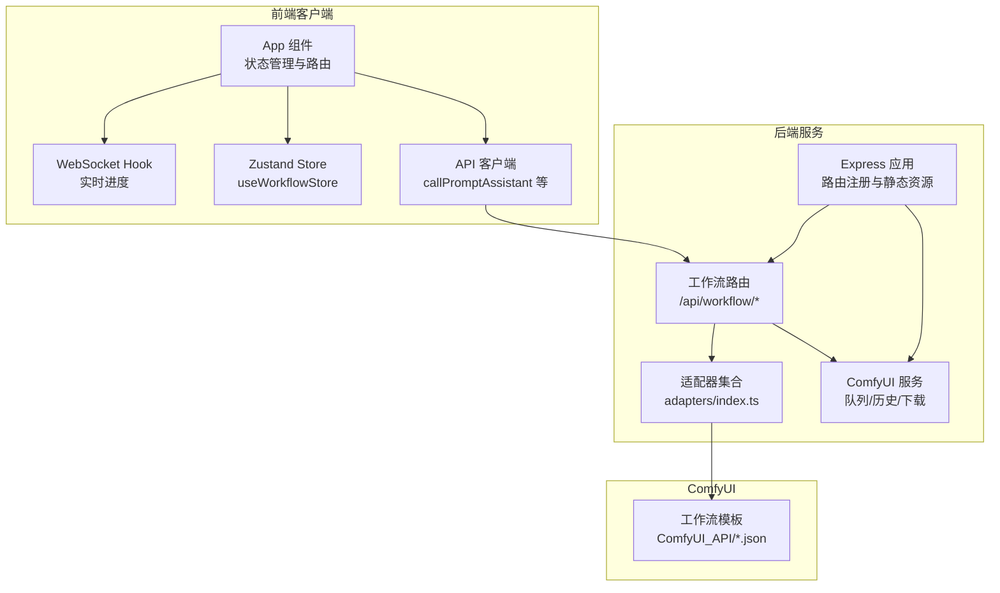
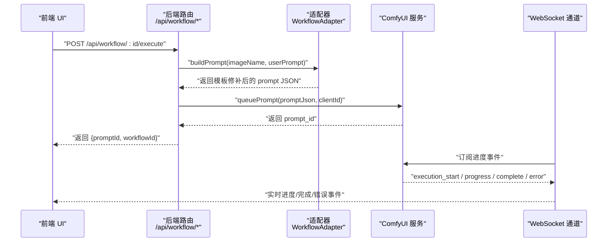
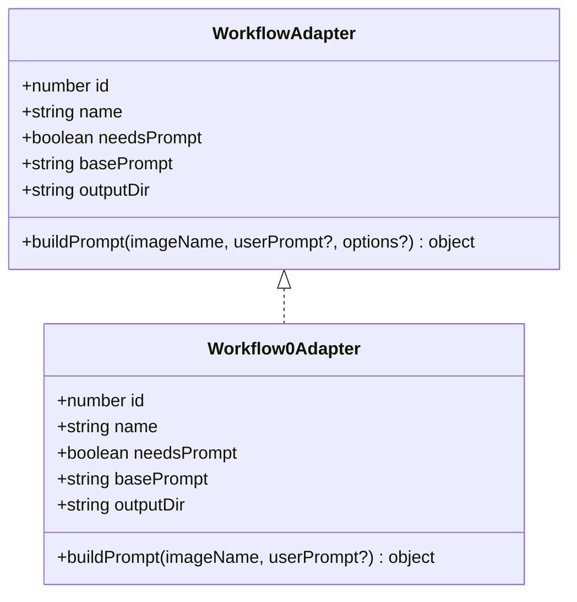
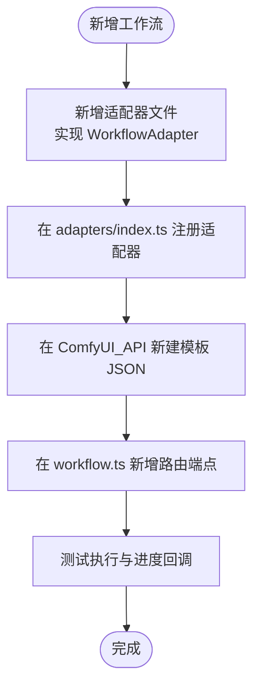
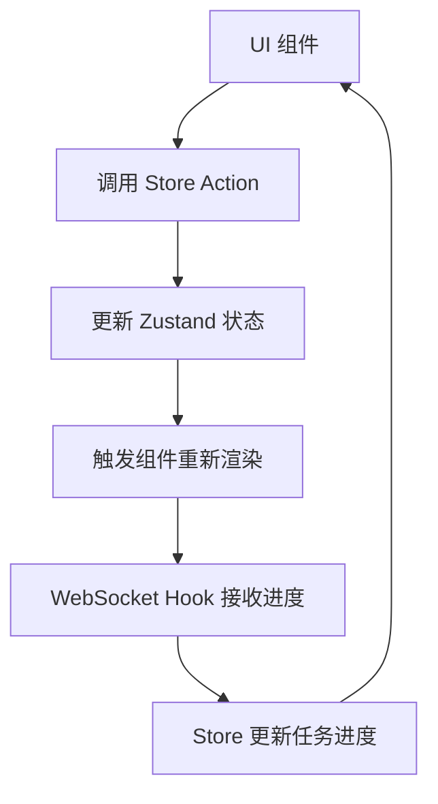
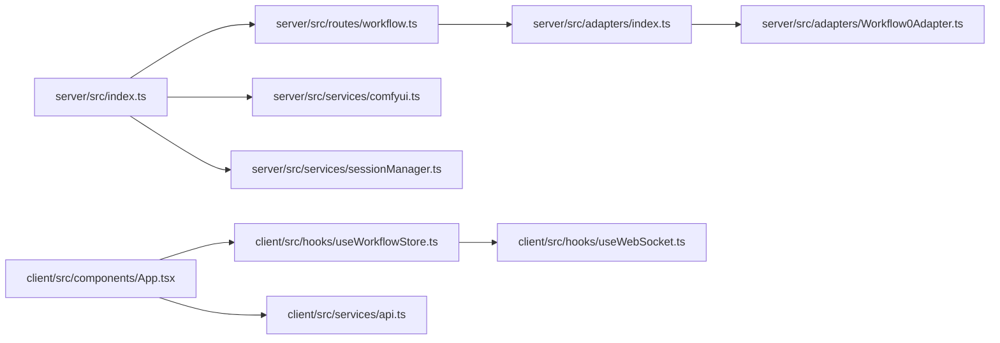

# 扩展开发指导

<cite>
**本文档引用的文件**
- [README.md](file://README.md)
- [server/src/index.ts](file://server/src/index.ts)
- [server/src/adapters/BaseAdapter.ts](file://server/src/adapters/BaseAdapter.ts)
- [server/src/adapters/Workflow0Adapter.ts](file://server/src/adapters/Workflow0Adapter.ts)
- [server/src/adapters/index.ts](file://server/src/adapters/index.ts)
- [server/src/types/index.ts](file://server/src/types/index.ts)
- [server/src/routes/workflow.ts](file://server/src/routes/workflow.ts)
- [client/src/main.tsx](file://client/src/main.tsx)
- [client/src/components/App.tsx](file://client/src/components/App.tsx)
- [client/src/hooks/useWorkflowStore.ts](file://client/src/hooks/useWorkflowStore.ts)
- [client/src/services/api.ts](file://client/src/services/api.ts)
- [client/src/data/sidebarGroups.ts](file://client/src/data/sidebarGroups.ts)
- [client/src/styles/variables.css](file://client/src/styles/variables.css)
</cite>

## 目录
1. [简介](#简介)
2. [项目结构](#项目结构)
3. [核心组件](#核心组件)
4. [架构总览](#架构总览)
5. [详细组件分析](#详细组件分析)
6. [依赖关系分析](#依赖关系分析)
7. [性能考虑](#性能考虑)
8. [故障排除指南](#故障排除指南)
9. [结论](#结论)
10. [附录](#附录)

## 简介
本指导面向希望为 CorineKit Pix2Real 添加新功能的开发者，涵盖以下扩展方向：
- 新工作流添加：实现 WorkflowAdapter、编写 ComfyUI 工作流模板、配置后端路由
- UI 组件开发：组件设计原则、状态管理集成、样式规范
- 后端服务扩展：新增 API 路由、服务层扩展、数据库/文件系统集成
- 配置系统扩展：新增设置项、配置文件管理、默认值设置
- 第三方集成：新 AI 模型接入、外部 API 调用、插件系统开发
- 实战示例与最佳实践：帮助快速上手

## 项目结构
项目采用前后端分离架构：
- 前端（client）：Vite + React + TypeScript，使用 Zustand 管理状态，通过 WebSocket 与后端通信
- 后端（server）：Express + TypeScript，提供 REST API、WebSocket 进度推送、ComfyUI 交互
- 适配器模式：每个工作流对应一个适配器，负责加载模板并按需修补参数
- ComfyUI 模板：位于 ComfyUI_API 目录，JSON 模板文件作为工作流基线

**图表来源**
- [client/src/components/App.tsx:61-422](file://client/src/components/App.tsx#L61-L422)
- [client/src/hooks/useWorkflowStore.ts:191-923](file://client/src/hooks/useWorkflowStore.ts#L191-L923)
- [client/src/services/api.ts:1-42](file://client/src/services/api.ts#L1-L42)
- [server/src/index.ts:118-146](file://server/src/index.ts#L118-L146)
- [server/src/routes/workflow.ts:1-800](file://server/src/routes/workflow.ts#L1-L800)
- [server/src/adapters/index.ts:1-33](file://server/src/adapters/index.ts#L1-L33)

**章节来源**
- [README.md:41-79](file://README.md#L41-L79)
- [server/src/index.ts:118-146](file://server/src/index.ts#L118-L146)

## 核心组件
- 适配器接口与实现：WorkflowAdapter 定义了工作流的标识、名称、是否需要提示词、基础提示词、输出目录以及构建提示词的方法
- 路由层：/api/workflow 下挂载多个工作流执行端点，支持通用执行与特定工作流专用端点
- 状态管理：Zustand Store 统一管理图片列表、任务状态、提示词、选择状态等
- WebSocket：后端连接 ComfyUI WebSocket，向前端广播进度、完成与错误事件
- 前端 API 客户端：封装对后端 API 的调用，便于 UI 组件复用

**章节来源**
- [server/src/types/index.ts:1-52](file://server/src/types/index.ts#L1-L52)
- [server/src/adapters/Workflow0Adapter.ts:1-35](file://server/src/adapters/Workflow0Adapter.ts#L1-L35)
- [server/src/adapters/index.ts:1-33](file://server/src/adapters/index.ts#L1-L33)
- [server/src/routes/workflow.ts:152-800](file://server/src/routes/workflow.ts#L152-L800)
- [client/src/hooks/useWorkflowStore.ts:71-183](file://client/src/hooks/useWorkflowStore.ts#L71-L183)
- [client/src/services/api.ts:1-42](file://client/src/services/api.ts#L1-L42)

## 架构总览
下图展示了从前端发起工作流执行到 ComfyUI 处理并返回结果的完整流程。

**图表来源**
- [server/src/routes/workflow.ts:750-800](file://server/src/routes/workflow.ts#L750-L800)
- [server/src/adapters/Workflow0Adapter.ts:16-34](file://server/src/adapters/Workflow0Adapter.ts#L16-L34)
- [server/src/index.ts:272-464](file://server/src/index.ts#L272-L464)

## 详细组件分析

### 新工作流添加指南

#### 1) 实现 WorkflowAdapter
- 在 server/src/adapters 下新增适配器文件，导出实现 WorkflowAdapter 接口的对象
- 模板路径建议放置于 ComfyUI_API 目录，并在适配器中读取
- buildPrompt 方法负责：
  - 读取模板 JSON
  - 设置输入图像名（LoadImage 节点）
  - 设置提示词（必要时拼接基础提示词）
  - 设置随机种子等参数
- 在 server/src/adapters/index.ts 中注册新适配器

**图表来源**
- [server/src/types/index.ts:1-8](file://server/src/types/index.ts#L1-L8)
- [server/src/adapters/Workflow0Adapter.ts:9-34](file://server/src/adapters/Workflow0Adapter.ts#L9-L34)

**章节来源**
- [server/src/adapters/BaseAdapter.ts:1-4](file://server/src/adapters/BaseAdapter.ts#L1-L4)
- [server/src/adapters/Workflow0Adapter.ts:1-35](file://server/src/adapters/Workflow0Adapter.ts#L1-L35)
- [server/src/adapters/index.ts:1-33](file://server/src/adapters/index.ts#L1-L33)

#### 2) 编写 ComfyUI 工作流模板
- 在 ComfyUI_API 目录新增 JSON 模板文件
- 使用节点 ID 明确标注需要被修补的节点（如输入图像、提示词、采样器参数等）
- 保持节点命名与 ComfyUI 中一致，以便后端进行进度阶段映射

**章节来源**
- [server/src/adapters/Workflow0Adapter.ts:7-20](file://server/src/adapters/Workflow0Adapter.ts#L7-L20)

#### 3) 配置后端路由
- 在 server/src/routes/workflow.ts 中：
  - 导入新适配器
  - 注册通用执行端点 /api/workflow/:id/execute
  - 如有特殊需求，可新增专用端点（参考现有工作流的实现）
- 在 server/src/index.ts 中确保路由中间件与静态资源已正确挂载

**图表来源**
- [server/src/routes/workflow.ts:750-800](file://server/src/routes/workflow.ts#L750-L800)
- [server/src/adapters/index.ts:14-30](file://server/src/adapters/index.ts#L14-L30)

**章节来源**
- [server/src/routes/workflow.ts:152-800](file://server/src/routes/workflow.ts#L152-L800)
- [server/src/index.ts:129-146](file://server/src/index.ts#L129-L146)

### UI 组件开发指南

#### 设计原则
- 单一职责：每个组件只负责一个功能点，便于复用与测试
- 可组合性：通过 props 传递行为与数据，避免硬编码
- 主题一致性：使用 CSS 变量 --color-* 与 --spacing-*，支持明暗主题

#### 状态管理集成
- 使用 Zustand Store（useWorkflowStore）集中管理：
  - 图片列表与缩略图生成
  - 任务状态（排队/处理/完成/错误）、进度与阶段
  - 提示词、选择状态、配置缓存
- 在组件中通过 selector 读取状态，避免不必要的重渲染

**图表来源**
- [client/src/hooks/useWorkflowStore.ts:560-680](file://client/src/hooks/useWorkflowStore.ts#L560-L680)
- [client/src/components/App.tsx:61-136](file://client/src/components/App.tsx#L61-L136)

**章节来源**
- [client/src/hooks/useWorkflowStore.ts:191-923](file://client/src/hooks/useWorkflowStore.ts#L191-L923)
- [client/src/styles/variables.css:1-31](file://client/src/styles/variables.css#L1-L31)

#### 样式规范
- 使用 CSS 变量控制颜色与间距，支持 data-theme="dark"
- 组件样式局部化，避免全局污染
- 响应式布局与可调整侧栏宽度（参考现有实现）

**章节来源**
- [client/src/styles/variables.css:1-31](file://client/src/styles/variables.css#L1-L31)
- [client/src/components/App.tsx:90-125](file://client/src/components/App.tsx#L90-L125)

### 后端服务扩展方法

#### 新增 API 路由
- 在 server/src/routes 下新增路由模块，遵循 express.Router 模式
- 在 server/src/index.ts 中挂载路由中间件
- 对外暴露 REST 接口，内部调用服务层（services）

**章节来源**
- [server/src/index.ts:129-146](file://server/src/index.ts#L129-L146)
- [server/src/routes/workflow.ts:1-30](file://server/src/routes/workflow.ts#L1-L30)

#### 服务层扩展
- 在 server/src/services 下新增服务模块，封装业务逻辑
- 与 ComfyUI 交互时，遵循现有模式（上传文件、队列提示、获取历史、下载输出）
- 对外提供稳定接口，供路由层调用

**章节来源**
- [server/src/index.ts:15-18](file://server/src/index.ts#L15-L18)
- [server/src/routes/workflow.ts:10-14](file://server/src/routes/workflow.ts#L10-L14)

#### 数据库/文件系统集成
- 会话与输出文件：后端通过 sessionManager 与文件系统交互，输出目录在 server/src/index.ts 中初始化
- 配置持久化：通过 loadConfigFromDisk 读取运行时配置，支持 sessionsBase 动态路径
- 扩展时遵循现有路径约定，避免破坏既有输出结构

**章节来源**
- [server/src/index.ts:102-116](file://server/src/index.ts#L102-L116)
- [server/src/index.ts:134-140](file://server/src/index.ts#L134-L140)

### 配置系统扩展

#### 新增设置项
- 前端设置项：在 useSettingsStore 中新增字段，配合 SettingsModal 展示与保存
- 后端配置：通过 config/paths.ts 读取持久化配置，支持运行时切换 sessionsBase 等
- 默认值：在初始化时设置默认值，避免空值导致异常

**章节来源**
- [client/src/services/api.ts:3-21](file://client/src/services/api.ts#L3-L21)
- [server/src/index.ts:102-109](file://server/src/index.ts#L102-L109)

### 第三方集成指导

#### 新 AI 模型集成
- 在 ComfyUI 中安装并注册模型，后端通过 /api/workflow/models/* 列表接口获取可用模型
- 在适配器中根据模型类型选择不同模板或参数
- 对于外部 LLM：通过 /api/workflow/smart-lora、/api/workflow/smart-trigger-insert 等接口调用

**章节来源**
- [server/src/routes/workflow.ts:407-435](file://server/src/routes/workflow.ts#L407-L435)
- [server/src/routes/workflow.ts:23-54](file://server/src/routes/workflow.ts#L23-L54)

#### 外部 API 调用
- 使用 node-fetch 发起 HTTP 请求，注意错误处理与超时控制
- 对外友好错误映射：将 ComfyUI 的错误信息转换为用户可理解的提示

**章节来源**
- [server/src/routes/workflow.ts:126-150](file://server/src/routes/workflow.ts#L126-L150)

#### 插件系统开发
- 建议以适配器与路由扩展为核心，保持插件边界清晰
- 插件可通过新增适配器与路由模块实现，避免侵入核心代码

**章节来源**
- [server/src/adapters/index.ts:1-33](file://server/src/adapters/index.ts#L1-L33)
- [server/src/routes/workflow.ts:1-30](file://server/src/routes/workflow.ts#L1-L30)

## 依赖关系分析

**图表来源**
- [server/src/index.ts:8-18](file://server/src/index.ts#L8-L18)
- [server/src/routes/workflow.ts:9-14](file://server/src/routes/workflow.ts#L9-L14)
- [server/src/adapters/index.ts:1-12](file://server/src/adapters/index.ts#L1-L12)
- [client/src/components/App.tsx:1-422](file://client/src/components/App.tsx#L1-L422)
- [client/src/hooks/useWorkflowStore.ts:1-923](file://client/src/hooks/useWorkflowStore.ts#L1-L923)
- [client/src/services/api.ts:1-42](file://client/src/services/api.ts#L1-L42)

**章节来源**
- [server/src/index.ts:1-516](file://server/src/index.ts#L1-L516)
- [server/src/routes/workflow.ts:1-1422](file://server/src/routes/workflow.ts#L1-L1422)

## 性能考虑
- WebSocket 进度聚合：后端按 promptId 聚合进度，避免重复计算；前端按需渲染
- 输出下载：完成后批量下载并保存至会话目录，减少前端负担
- 图像预览：视频首帧提取为缩略图，避免全片解码带来的开销
- 模板复用：适配器只修补必要节点，降低 JSON 处理成本

[本节为通用性能建议，无需特定文件引用]

## 故障排除指南
- ComfyUI 未运行：后端提供 /api/comfyui/status 检测，若失败请先启动 ComfyUI
- 提交失败：检查模型/LoRA 文件是否存在，后端会将 value_not_in_list 映射为中文提示
- 进度卡住：确认 WebSocket 连接正常，后端会在客户端注册前缓冲事件
- 输出为空：等待历史记录完成提交，后端有重试机制

**章节来源**
- [server/src/index.ts:147-155](file://server/src/index.ts#L147-L155)
- [server/src/routes/workflow.ts:126-150](file://server/src/routes/workflow.ts#L126-L150)
- [server/src/index.ts:350-371](file://server/src/index.ts#L350-L371)

## 结论
通过适配器模式与清晰的前后端分层，Pix2Real 提供了良好的扩展性。新增工作流只需实现适配器、编写模板与路由即可快速上线；UI 扩展可复用现有状态管理与样式体系；后端服务层与配置系统为第三方集成提供了稳定接口。建议在扩展过程中遵循本文档的最佳实践，确保功能可维护、可测试与高性能。

[本节为总结，无需特定文件引用]

## 附录

### 扩展示例清单
- 新增工作流：实现 WorkflowAdapter → 注册适配器 → 新建模板 → 新增路由 → 测试执行
- 新增 UI 组件：设计单一职责组件 → 使用 useWorkflowStore 管理状态 → 使用 CSS 变量适配主题
- 新增后端 API：新建路由模块 → 实现服务层 → 在 index.ts 挂载 → 编写单元测试
- 新增设置项：前端 useSettingsStore → 后端 config/paths.ts → 默认值初始化
- 第三方集成：在 ComfyUI 安装模型 → 通过 /api/workflow/models/* 获取 → 适配器中选择 → 外部 API 调用

[本节为概览，无需特定文件引用]