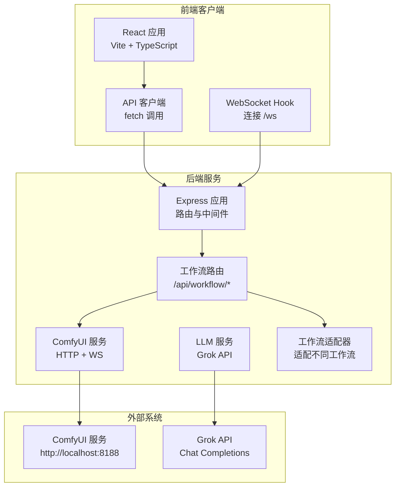
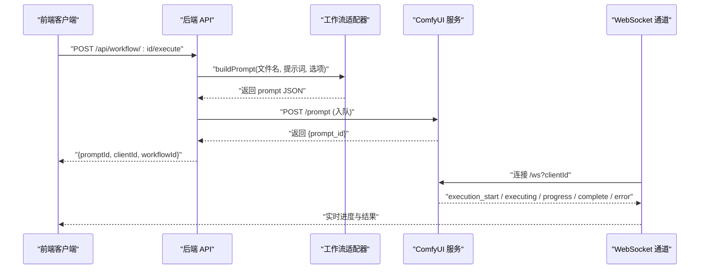
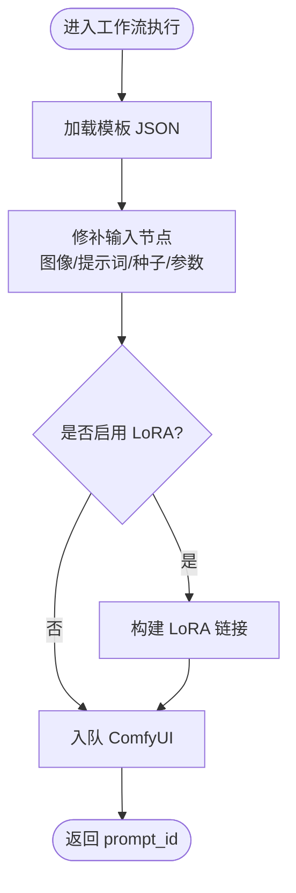
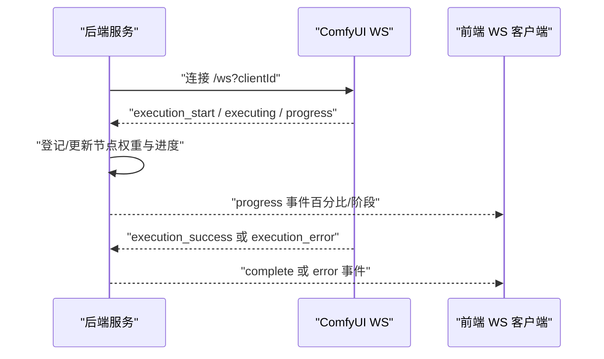
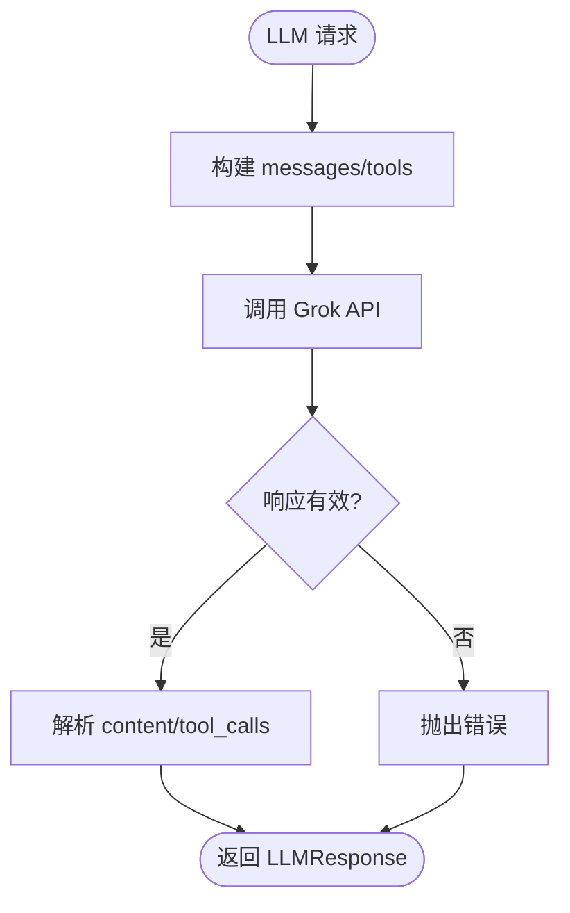
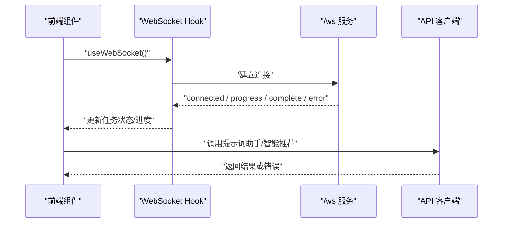
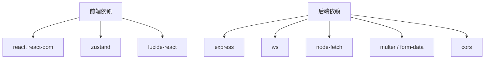

# 第三方集成开发

<cite>
**本文档引用的文件**
- [README.md](file://README.md)
- [package.json](file://package.json)
- [server/package.json](file://server/package.json)
- [client/package.json](file://client/package.json)
- [server/src/index.ts](file://server/src/index.ts)
- [server/src/services/comfyui.ts](file://server/src/services/comfyui.ts)
- [server/src/routes/workflow.ts](file://server/src/routes/workflow.ts)
- [server/src/adapters/index.ts](file://server/src/adapters/index.ts)
- [server/src/services/llmService.ts](file://server/src/services/llmService.ts)
- [client/src/services/api.ts](file://client/src/services/api.ts)
- [client/src/hooks/useWebSocket.ts](file://client/src/hooks/useWebSocket.ts)
- [docs/SystemPrompt.txt](file://docs/SystemPrompt.txt)
- [docs/提示词助理开发需求/Pix2Real-提示词助手.json](file://docs/提示词助理开发需求/Pix2Real-提示词助手.json)
</cite>

## 目录
1. [简介](#简介)
2. [项目结构](#项目结构)
3. [核心组件](#核心组件)
4. [架构总览](#架构总览)
5. [详细组件分析](#详细组件分析)
6. [依赖关系分析](#依赖关系分析)
7. [性能考量](#性能考量)
8. [故障排查指南](#故障排查指南)
9. [结论](#结论)
10. [附录](#附录)

## 简介
本指南面向希望在 CorineKit Pix2Real 中集成第三方 AI 模型与外部服务的开发者，提供从模型加载、推理接口、性能优化，到外部 API 调用、认证机制、错误处理，再到插件系统设计、LLM 服务集成、提示词工程、数据格式转换与交付示例的完整开发流程与安全最佳实践。项目采用前后端分离架构：前端使用 React + TypeScript，后端使用 Express + TypeScript，通过 WebSocket 实时同步 ComfyUI 的执行进度，并提供多工作流适配器与 LLM 提示词工程能力。

## 项目结构
- 前端（client）：React + Vite + TypeScript，负责 UI、WebSocket 连接、调用后端 API、桌面通知等。
- 后端（server）：Express + TypeScript，负责路由、工作流适配器、ComfyUI 通信、LLM 服务集成、会话与输出管理。
- ComfyUI 工作流模板：位于 ComfyUI_API 目录，按工作流 ID 存放 JSON 模板，后端通过适配器加载并动态修补节点参数。
- 文档与提示词：docs 目录包含系统提示词与提示词助理工作流模板，支撑 LLM 提示词工程与智能推荐。

图表来源
- [server/src/index.ts:118-146](file://server/src/index.ts#L118-L146)
- [server/src/routes/workflow.ts:1-29](file://server/src/routes/workflow.ts#L1-L29)
- [server/src/services/comfyui.ts:6-7](file://server/src/services/comfyui.ts#L6-L7)
- [server/src/services/llmService.ts:49-51](file://server/src/services/llmService.ts#L49-L51)

章节来源
- [README.md:41-79](file://README.md#L41-L79)
- [package.json:4-10](file://package.json#L4-L10)
- [server/package.json:6-10](file://server/package.json#L6-L10)
- [client/package.json:6-10](file://client/package.json#L6-L10)

## 核心组件
- 适配器模式（Workflow Adapters）：每个工作流一个适配器，负责加载模板、修补节点参数（如模型、提示词、种子等），并生成 ComfyUI 可执行的 prompt JSON。
- ComfyUI 服务：封装上传文件、入队、进度监听、历史查询、输出下载等能力，提供 WebSocket 事件中继与进度权重化计算。
- LLM 服务：封装 Grok Chat Completions API 调用，支持工具调用（Function Calling），并提供提示词工程与智能 LoRA 推荐。
- 前端 API 客户端：封装提示词助手、智能 LoRA 推荐、触发词插入等调用，统一错误处理。
- WebSocket Hook：全局单例连接 /ws，订阅进度、完成与错误事件，驱动 UI 状态与桌面通知。

章节来源
- [server/src/adapters/index.ts:14-30](file://server/src/adapters/index.ts#L14-L30)
- [server/src/services/comfyui.ts:168-196](file://server/src/services/comfyui.ts#L168-L196)
- [server/src/services/llmService.ts:55-114](file://server/src/services/llmService.ts#L55-L114)
- [client/src/services/api.ts:3-41](file://client/src/services/api.ts#L3-L41)
- [client/src/hooks/useWebSocket.ts:29-277](file://client/src/hooks/useWebSocket.ts#L29-L277)

## 架构总览
系统通过适配器将前端请求映射为 ComfyUI 工作流模板，后端负责上传资源、入队执行、实时进度转发与结果下载。LLM 服务用于提示词工程与智能推荐，前端通过 API 客户端与 WebSocket Hook 与后端交互。

图表来源
- [server/src/routes/workflow.ts:750-799](file://server/src/routes/workflow.ts#L750-L799)
- [server/src/services/comfyui.ts:168-196](file://server/src/services/comfyui.ts#L168-L196)
- [server/src/index.ts:272-464](file://server/src/index.ts#L272-L464)

章节来源
- [README.md:74-79](file://README.md#L74-L79)
- [server/src/index.ts:157-159](file://server/src/index.ts#L157-L159)

## 详细组件分析

### 组件A：工作流适配器与模板修补
- 设计要点
  - 每个工作流一个适配器，集中管理模板加载与节点修补。
  - 修补内容包括：输入图像/视频名、提示词、种子、采样参数、LoRA 链接等。
  - 支持多模型分支（如二次元转真人支持 qwen/klein）。
- 数据结构与复杂度
  - 模板 JSON 读取与节点遍历：O(N)（N 为节点数量）。
  - LoRA 链接动态重连：O(L)（L 为启用的 LoRA 数量）。
- 依赖链
  - 适配器依赖模板文件路径与 ComfyUI 节点类型映射。
  - 入队前进行节点权重登记，用于进度权重化。
- 优化建议
  - 缓存模板解析结果，减少重复读取。
  - LoRA 链接采用一次性构建图，避免多次遍历。
- 错误处理
  - 适配器内部捕获异常并转换为用户友好错误消息。

图表来源
- [server/src/routes/workflow.ts:644-687](file://server/src/routes/workflow.ts#L644-L687)
- [server/src/routes/workflow.ts:689-748](file://server/src/routes/workflow.ts#L689-L748)
- [server/src/routes/workflow.ts:40-86](file://server/src/routes/workflow.ts#L40-L86)

章节来源
- [server/src/adapters/index.ts:14-30](file://server/src/adapters/index.ts#L14-L30)
- [server/src/routes/workflow.ts:40-86](file://server/src/routes/workflow.ts#L40-L86)

### 组件B：ComfyUI 服务与进度权重化
- 设计要点
  - 上传图像/视频、入队、查询历史、下载输出、获取系统统计、队列管理。
  - WebSocket 事件中继：execution_start、executing、progress、execution_success、execution_error。
  - 进度权重化：基于节点类型与采样步数估算权重，支持 tiled 采样器与多轮节点。
- 数据结构与复杂度
  - 节点权重登记：O(N)。
  - 进度计算：O(1) 每节点事件。
- 依赖链
  - 依赖 ComfyUI HTTP API 与 WebSocket。
  - 与后端 WebSocket 中继器协作，维护 prompt -> workflow 映射。
- 优化建议
  - 对历史查询增加指数退避重试，避免磁盘写入延迟导致的空历史。
  - 对 tiled 采样器使用估计 tile 数，避免高估权重。
- 错误处理
  - 对 API 失败抛出明确错误，WebSocket 错误记录并清理状态。

图表来源
- [server/src/services/comfyui.ts:265-375](file://server/src/services/comfyui.ts#L265-L375)
- [server/src/index.ts:272-464](file://server/src/index.ts#L272-L464)

章节来源
- [server/src/services/comfyui.ts:47-166](file://server/src/services/comfyui.ts#L47-L166)
- [server/src/index.ts:187-271](file://server/src/index.ts#L187-L271)

### 组件C：LLM 服务与提示词工程
- 设计要点
  - 调用 Grok Chat Completions API，支持工具调用（Function Calling）。
  - 提供智能 LoRA 推荐与触发词插入提示词构建。
  - 构建系统提示词，融合用户偏好画像与模型/LoRA 列表。
- 数据结构与复杂度
  - 工具定义与参数校验：O(T)（T 为工具数量）。
  - 提示词构建：O(M)（M 为模型/LoRA 条目数量）。
- 依赖链
  - 依赖 model_meta/metadata.json 与用户偏好配置。
  - 与工作流路由协作，提供智能提示词与 LoRA 推荐。
- 优化建议
  - 对 API 调用增加超时与重试策略。
  - 对提示词构建结果进行缓存，避免重复生成。
- 错误处理
  - API 错误统一转换为可读错误信息。

图表来源
- [server/src/services/llmService.ts:55-114](file://server/src/services/llmService.ts#L55-L114)
- [server/src/services/llmService.ts:118-173](file://server/src/services/llmService.ts#L118-L173)
- [server/src/services/llmService.ts:175-188](file://server/src/services/llmService.ts#L175-L188)

章节来源
- [server/src/services/llmService.ts:49-51](file://server/src/services/llmService.ts#L49-L51)
- [docs/SystemPrompt.txt:1-146](file://docs/SystemPrompt.txt#L1-L146)

### 组件D：前端 API 客户端与 WebSocket Hook
- 设计要点
  - API 客户端封装提示词助手、智能 LoRA 推荐、触发词插入等调用。
  - WebSocket Hook 管理全局单例连接，订阅进度、完成与错误事件，驱动 UI 与桌面通知。
- 数据结构与复杂度
  - 消息派发：O(1)。
  - 状态更新：O(1)。
- 依赖链
  - 依赖后端 /ws 与 /api/* 接口。
  - 与 Zustand 状态管理协作。
- 优化建议
  - 对连接断线进行指数退避重连。
  - 对批量生成任务合并输出 URL，减少渲染抖动。
- 错误处理
  - 统一错误提示，避免泄露内部错误细节。

图表来源
- [client/src/hooks/useWebSocket.ts:29-277](file://client/src/hooks/useWebSocket.ts#L29-L277)
- [client/src/services/api.ts:3-41](file://client/src/services/api.ts#L3-L41)

章节来源
- [client/src/hooks/useWebSocket.ts:9-27](file://client/src/hooks/useWebSocket.ts#L9-L27)
- [client/src/services/api.ts:3-41](file://client/src/services/api.ts#L3-L41)

## 依赖关系分析
- 前端依赖
  - React、Zustand（状态管理）、lucide-react（图标）、@vitejs/plugin-react（构建）。
- 后端依赖
  - Express、ws（WebSocket）、node-fetch（HTTP）、multer/form-data（文件上传）、cors（跨域）。
- 项目脚本
  - 并发启动前后端开发服务器，统一构建与安装命令。

图表来源
- [client/package.json:11-17](file://client/package.json#L11-L17)
- [server/package.json:11-18](file://server/package.json#L11-L18)
- [package.json:4-10](file://package.json#L4-L10)

章节来源
- [client/package.json:11-25](file://client/package.json#L11-L25)
- [server/package.json:11-27](file://server/package.json#L11-L27)
- [package.json:4-14](file://package.json#L4-L14)

## 性能考量
- 进度权重化
  - 依据节点类型与采样步数估算权重，对 tiled 采样器使用估计 tile 数，避免过度膨胀权重。
- 历史查询重试
  - 对 ComfyUI 历史查询增加重试与等待，确保 completion 时输出已落盘。
- 文件上传与下载
  - 使用 multipart/form-data 上传图像/视频，下载输出时按会话目录保存，避免重复网络传输。
- WebSocket 单例
  - 前端 Hook 使用模块级全局变量保证单实例连接，减少资源消耗与连接竞争。
- API 超时与重试
  - LLM 服务调用增加超时与重试策略，提升稳定性。

章节来源
- [server/src/services/comfyui.ts:128-144](file://server/src/services/comfyui.ts#L128-L144)
- [server/src/index.ts:350-371](file://server/src/index.ts#L350-L371)
- [client/src/hooks/useWebSocket.ts:9-27](file://client/src/hooks/useWebSocket.ts#L9-L27)
- [server/src/services/llmService.ts:55-114](file://server/src/services/llmService.ts#L55-L114)

## 故障排查指南
- ComfyUI 未运行
  - 现象：后端启动时自动尝试启动失败，/api/comfyui/status 返回 false。
  - 处理：手动启动 ComfyUI 至 http://localhost:8188 后重试。
- 队列提交失败
  - 现象：工作流执行报错“Queue prompt failed”。
  - 处理：检查 ComfyUI 是否正常运行、模板节点是否正确、模型/LoRA 是否存在。
- 模型/LoRA 未找到
  - 现象：错误包含 value_not_in_list 且包含 ckpt/lora/unet 等字段。
  - 处理：确认模型/LoRA 文件已安装并存在于 ComfyUI 对应列表。
- WebSocket 断连
  - 现象：进度停止、任务卡住。
  - 处理：前端 Hook 自动重连；检查网络与防火墙设置。
- LLM API 错误
  - 现象：提示词助手或智能推荐失败。
  - 处理：检查 API Key 与网络连通性，查看后端日志。

章节来源
- [server/src/index.ts:499-512](file://server/src/index.ts#L499-L512)
- [server/src/routes/workflow.ts:129-150](file://server/src/routes/workflow.ts#L129-L150)
- [client/src/hooks/useWebSocket.ts:232-244](file://client/src/hooks/useWebSocket.ts#L232-L244)
- [server/src/services/llmService.ts:77-81](file://server/src/services/llmService.ts#L77-L81)

## 结论
本指南提供了在 CorineKit Pix2Real 中集成第三方 AI 模型与外部服务的系统化方法：通过适配器模式加载与修补模板、利用 ComfyUI 服务完成推理与进度中继、借助 LLM 服务实现提示词工程与智能推荐，并通过前端 API 客户端与 WebSocket Hook 提供流畅的用户体验。遵循本文档的安全与性能最佳实践，可高效、稳定地扩展系统能力。

## 附录

### A. 新 AI 模型集成步骤
- 准备模型与节点
  - 在 ComfyUI 中注册模型节点（如 CheckpointLoaderSimple、UNETLoader 等），确保节点类型与权重映射一致。
- 扩展适配器
  - 在适配器中添加模型分支逻辑，修补对应节点参数（如 ckpt_name、unet_name）。
  - 若涉及 LoRA，参考 applyLoraChain 的实现进行链式连接与动态重连。
- 注册路由
  - 在 workflow 路由中添加新工作流的执行入口，处理文件上传与参数校验。
- 测试与验证
  - 使用前端界面或测试脚本发起请求，观察进度与输出是否符合预期。

章节来源
- [server/src/routes/workflow.ts:644-687](file://server/src/routes/workflow.ts#L644-L687)
- [server/src/routes/workflow.ts:40-86](file://server/src/routes/workflow.ts#L40-L86)

### B. 外部 API 调用开发指南
- HTTP 客户端配置
  - 使用 node-fetch 或 axios，设置合理的超时与重试策略。
  - 对于文件上传，使用 multipart/form-data，确保后端 multer 配置正确。
- 认证机制
  - 对需要密钥的外部服务，在环境变量中管理密钥，避免硬编码。
  - 在请求头中携带 Authorization，遵循服务方规范。
- 错误处理
  - 捕获网络错误与 HTTP 状态码，统一转换为用户可读错误信息。
  - 对临时性错误（如 5xx）进行指数退避重试。

章节来源
- [server/src/services/llmService.ts:68-81](file://server/src/services/llmService.ts#L68-L81)
- [client/src/services/api.ts:9-18](file://client/src/services/api.ts#L9-L18)

### C. 插件系统开发指导
- 架构设计
  - 插件应遵循统一接口，暴露生命周期钩子（初始化、执行、清理）。
  - 插件间通过事件总线或中间件机制解耦。
- 生命周期管理
  - 初始化：加载配置、注册路由或适配器。
  - 执行：拦截/增强请求，调用外部服务或模型。
  - 清理：释放资源、注销事件。
- 安全考虑
  - 限制插件权限，避免直接访问系统敏感资源。
  - 对插件输入进行严格校验与沙箱隔离。
  - 审计插件行为，记录关键操作日志。

[本节为概念性指导，不直接分析具体文件]

### D. LLM 服务集成与提示词工程
- 提示词工程
  - 使用 docs/SystemPrompt.txt 中的系统提示词模板，结合用户偏好画像与模型/LoRA 列表生成高质量提示。
  - 对触发词进行原子化管理，避免重复与冲突。
- 模型调用
  - 通过 callLLM 发起请求，支持工具调用（Function Calling）以实现多步骤推理。
- 响应处理
  - 解析 content 与 tool_calls，按需构造后续提示或调用下游服务。

章节来源
- [docs/SystemPrompt.txt:1-146](file://docs/SystemPrompt.txt#L1-L146)
- [server/src/services/llmService.ts:55-114](file://server/src/services/llmService.ts#L55-L114)

### E. 数据格式转换与兼容性
- 输入输出标准化
  - 统一文件名与子文件夹命名规则，避免特殊字符导致的路径冲突。
  - 对输出文件进行会话目录归档，便于前端访问与下载。
- 数据验证
  - 对用户输入进行类型与范围校验，必要时提供默认值。
  - 对外部服务响应进行结构化校验，确保后续处理安全。
- 兼容性处理
  - 对不同工作流的节点类型与权重进行映射，保证进度计算一致性。
  - 对 tiled 采样器与多轮节点采用估计权重，避免精度偏差。

章节来源
- [server/src/routes/workflow.ts:322-326](file://server/src/routes/workflow.ts#L322-L326)
- [server/src/services/comfyui.ts:128-144](file://server/src/services/comfyui.ts#L128-L144)

### F. 集成交付示例
- 示例一：提示词助手（Grok）
  - 前端调用 /api/workflow/prompt-assistant 或 /api/workflow/prompt-assistant-grok。
  - 后端根据设置选择模型，调用 Grok API，返回处理后的文本。
- 示例二：智能 LoRA 推荐
  - 前端调用 /api/workflow/smart-lora，后端读取 model_meta/metadata.json，生成推荐与修改后的提示词。
- 示例三：触发词智能插入
  - 前端调用 /api/workflow/smart-trigger-insert，后端构建提示词插入规则，返回修改后的提示词。
- 示例四：工作流执行（文本到图像）
  - 前端上传图像或 JSON 参数，后端适配器修补模板，ComfyUI 入队执行，WebSocket 实时反馈进度与结果。

章节来源
- [client/src/services/api.ts:3-41](file://client/src/services/api.ts#L3-L41)
- [server/src/services/llmService.ts:118-188](file://server/src/services/llmService.ts#L118-L188)
- [server/src/routes/workflow.ts:269-405](file://server/src/routes/workflow.ts#L269-L405)
- [docs/提示词助理开发需求/Pix2Real-提示词助手.json:1-106](file://docs/提示词助理开发需求/Pix2Real-提示词助手.json#L1-L106)