# 配置系统扩展开发

<cite>
**本文档引用的文件**
- [useSettingsStore.ts](file://client/src/hooks/useSettingsStore.ts)
- [SettingsModal.tsx](file://client/src/components/SettingsModal.tsx)
- [settings.ts](file://server/src/routes/settings.ts)
- [paths.ts](file://server/src/config/paths.ts)
- [sessionManager.ts](file://server/src/services/sessionManager.ts)
- [segmentedControl.tsx](file://client/src/components/SegmentedControl.tsx)
- [settings-panel.md](file://docs/settings-panel.md)
- [tagData.json](file://client/src/data/tagData.json)
- [MyProfileSection.tsx](file://client/src/components/MyProfileSection.tsx)
</cite>

## 目录
1. [简介](#简介)
2. [项目结构](#项目结构)
3. [核心组件](#核心组件)
4. [架构概览](#架构概览)
5. [详细组件分析](#详细组件分析)
6. [依赖关系分析](#依赖关系分析)
7. [性能考虑](#性能考虑)
8. [故障排除指南](#故障排除指南)
9. [结论](#结论)
10. [附录](#附录)

## 简介

CorineKit Pix2Real 的配置系统是一个完整的前端状态管理和后端配置持久化解决方案。该系统支持多种配置类型，从简单的布尔选项到复杂的对象配置，为用户提供灵活的个性化设置体验。

配置系统的核心特点包括：
- **双层状态管理**：前端使用 Zustand 进行本地状态管理，后端使用 JSON 文件进行持久化
- **类型安全**：完整的 TypeScript 类型定义确保配置的正确性和安全性
- **实时同步**：配置变更即时反映在用户界面中
- **跨平台兼容**：支持桌面应用和 Web 应用的不同部署场景

## 项目结构

配置系统主要分布在以下目录结构中：

```mermaid
graph TB
subgraph "客户端 (Client)"
A[useSettingsStore.ts<br/>状态管理]
B[SettingsModal.tsx<br/>设置界面]
C[SegmentedControl.tsx<br/>控件组件]
D[tagData.json<br/>标签数据]
E[MyProfileSection.tsx<br/>个人资料]
end
subgraph "服务端 (Server)"
F[settings.ts<br/>设置路由]
G[paths.ts<br/>路径配置]
H[sessionManager.ts<br/>会话管理]
end
subgraph "文档 (Docs)"
I[settings-panel.md<br/>开发者指南]
end
A --> B
B --> C
A --> F
F --> G
G --> H
A --> D
B --> E
```

**图表来源**
- [useSettingsStore.ts:1-177](file://client/src/hooks/useSettingsStore.ts#L1-L177)
- [SettingsModal.tsx:1-756](file://client/src/components/SettingsModal.tsx#L1-L756)
- [settings.ts:1-106](file://server/src/routes/settings.ts#L1-L106)

**章节来源**
- [useSettingsStore.ts:1-177](file://client/src/hooks/useSettingsStore.ts#L1-L177)
- [SettingsModal.tsx:1-756](file://client/src/components/SettingsModal.tsx#L1-L756)
- [settings.ts:1-106](file://server/src/routes/settings.ts#L1-L106)

## 核心组件

### 状态管理器 (useSettingsStore)

状态管理器是整个配置系统的核心，负责管理所有用户设置的状态和持久化逻辑。

**主要功能特性：**
- **类型安全的状态管理**：使用 TypeScript 枚举确保配置值的有效性
- **本地存储集成**：所有配置变更自动保存到 localStorage
- **默认值处理**：为每个配置项提供合理的默认值
- **异步配置管理**：支持服务端配置的异步加载和更新

**配置项类型定义：**
系统支持多种配置类型，包括枚举类型、布尔类型和字符串类型：

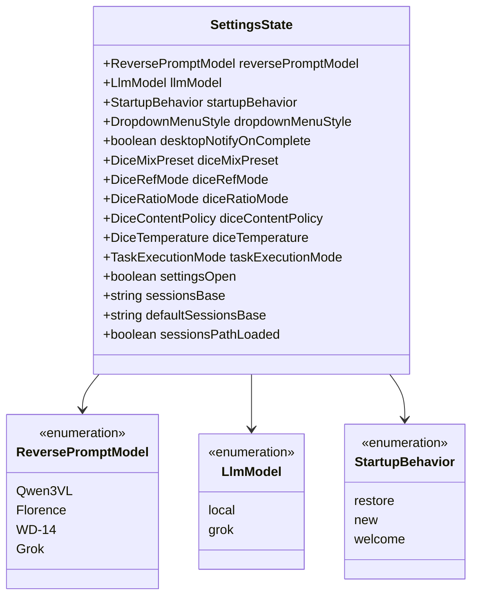

**图表来源**
- [useSettingsStore.ts:19-52](file://client/src/hooks/useSettingsStore.ts#L19-L52)

**章节来源**
- [useSettingsStore.ts:1-177](file://client/src/hooks/useSettingsStore.ts#L1-L177)

### 设置界面 (SettingsModal)

设置界面采用响应式布局设计，提供直观的配置管理体验。

**界面设计特点：**
- **左侧导航 + 右侧滚动内容**：使用 IntersectionObserver 实现导航同步
- **分段控制**：统一的 SegmentedControl 组件提供一致的交互体验
- **分类组织**：设置项按功能分类，便于查找和管理
- **实时预览**：配置变更即时反映在界面中

**界面组件结构：**
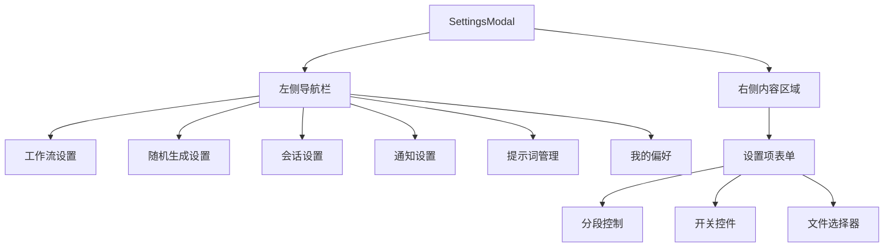

**图表来源**
- [SettingsModal.tsx:59-66](file://client/src/components/SettingsModal.tsx#L59-L66)

**章节来源**
- [SettingsModal.tsx:1-756](file://client/src/components/SettingsModal.tsx#L1-L756)

### 路由处理器 (settings.ts)

服务端路由处理器负责处理配置相关的 HTTP 请求。

**路由功能：**
- **GET /api/settings**：获取当前配置状态
- **PUT /api/settings**：更新配置设置
- **POST /api/settings/browse-folder**：弹出文件夹选择对话框

**配置验证机制：**
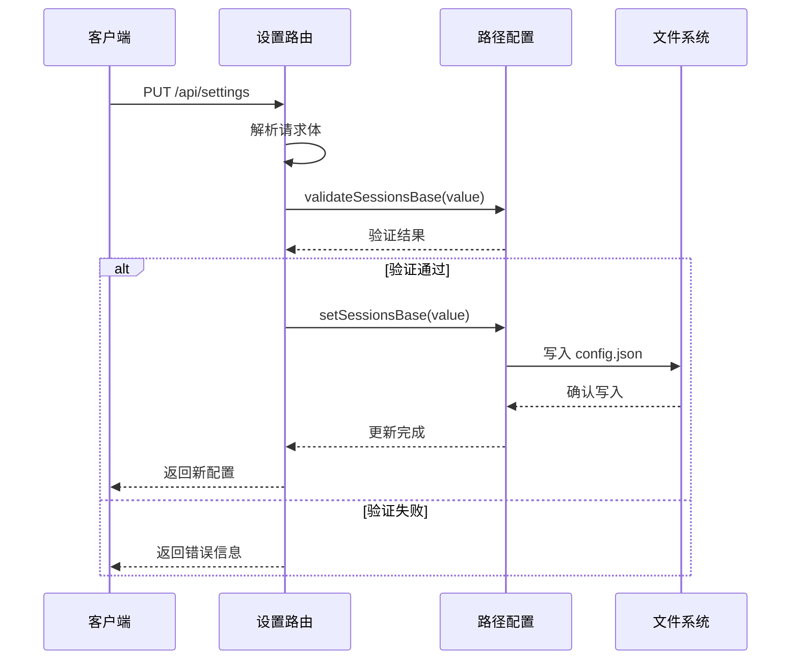

**图表来源**
- [settings.ts:21-67](file://server/src/routes/settings.ts#L21-L67)
- [paths.ts:102-137](file://server/src/config/paths.ts#L102-L137)

**章节来源**
- [settings.ts:1-106](file://server/src/routes/settings.ts#L1-L106)

## 架构概览

配置系统采用分层架构设计，确保各层职责清晰分离：

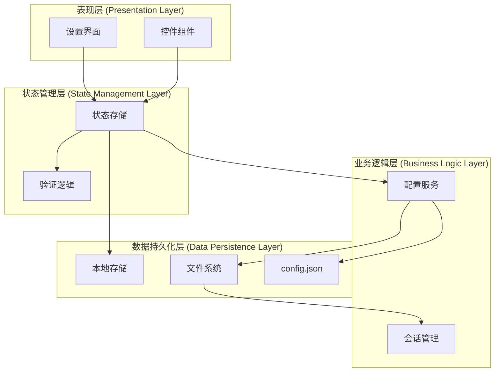

**图表来源**
- [useSettingsStore.ts:54-176](file://client/src/hooks/useSettingsStore.ts#L54-L176)
- [settings.ts:21-67](file://server/src/routes/settings.ts#L21-L67)
- [paths.ts:35-100](file://server/src/config/paths.ts#L35-L100)

## 详细组件分析

### 状态管理组件分析

#### 状态存储结构
状态管理器使用 Zustand 创建全局状态存储，支持原子化状态更新：

**状态初始化流程：**
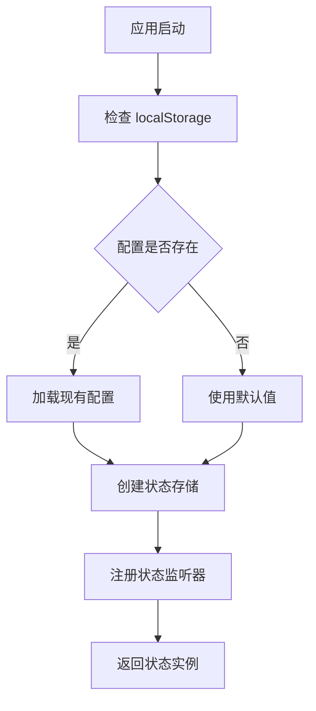

**图表来源**
- [useSettingsStore.ts:54-83](file://client/src/hooks/useSettingsStore.ts#L54-L83)

#### 配置更新机制
配置更新采用原子化操作，确保状态一致性：

**更新流程：**
1. **前端更新**：调用对应的 setter 函数
2. **本地存储**：同步更新 localStorage
3. **状态更新**：触发 Zustand 状态更新
4. **UI 刷新**：自动重新渲染相关组件

**章节来源**
- [useSettingsStore.ts:88-131](file://client/src/hooks/useSettingsStore.ts#L88-L131)

### 设置界面组件分析

#### 导航系统
设置界面采用响应式导航设计，支持左侧固定导航栏和右侧滚动内容区域：

**导航实现：**
- **IntersectionObserver**：监听内容区域滚动，自动更新导航高亮
- **scrollIntoView**：点击导航项时平滑滚动到对应区域
- **activeSection**：维护当前激活的导航项状态

**导航同步流程：**
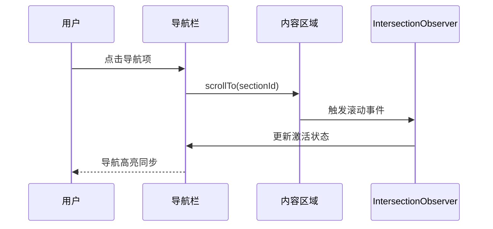

**图表来源**
- [SettingsModal.tsx:154-166](file://client/src/components/SettingsModal.tsx#L154-L166)

**章节来源**
- [SettingsModal.tsx:284-321](file://client/src/components/SettingsModal.tsx#L284-L321)

#### 表单控件系统
设置界面使用统一的控件组件库，确保一致的用户体验：

**控件类型：**
- **分段控制 (SegmentedControl)**：用于枚举类型的配置项
- **开关控件**：用于布尔类型的配置项
- **文件选择器**：用于路径选择的配置项

**控件实现：**
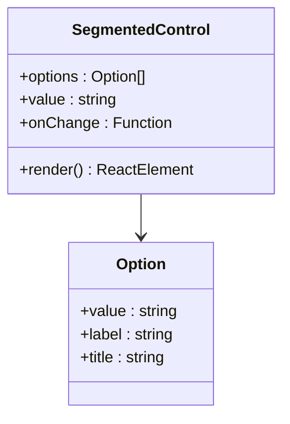

**图表来源**
- [segmentedControl.tsx:1-50](file://client/src/components/SegmentedControl.tsx#L1-L50)

**章节来源**
- [segmentedControl.tsx:1-50](file://client/src/components/SegmentedControl.tsx#L1-L50)

### 服务端配置管理分析

#### 路径配置系统
服务端使用集中化的路径配置管理系统，支持运行时切换：

**配置文件结构：**
```mermaid
graph LR
A[config.json] --> B[sessionsBase]
B --> C[绝对路径]
C --> D[会话存储目录]
E[默认路径] --> F[项目根目录/sessions]
G[覆盖路径] --> H[config.json 中的 sessionsBase]
F --> I[运行时解析]
H --> I
I --> J[getSessionsBase()]
```

**图表来源**
- [paths.ts:24-26](file://server/src/config/paths.ts#L24-L26)
- [paths.ts:70-76](file://server/src/config/paths.ts#L70-L76)

**配置验证流程：**
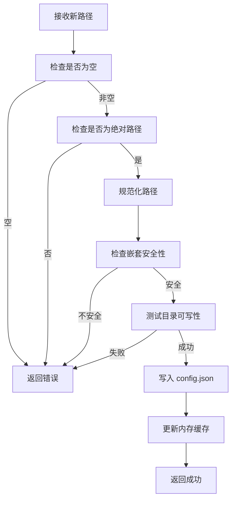

**图表来源**
- [paths.ts:102-137](file://server/src/config/paths.ts#L102-L137)

**章节来源**
- [paths.ts:1-156](file://server/src/config/paths.ts#L1-L156)

### 数据持久化分析

#### 本地存储策略
客户端使用 localStorage 进行配置持久化，确保配置在页面刷新后保持不变：

**存储键命名规范：**
- **前缀**：`settings_`
- **后缀**：配置项的驼峰命名
- **示例**：`settings_reversePromptModel`

**存储实现：**
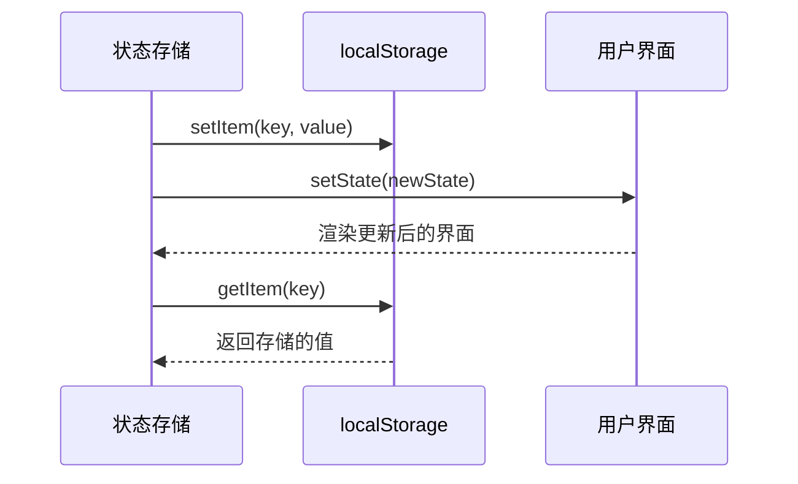

**图表来源**
- [useSettingsStore.ts:88-91](file://client/src/hooks/useSettingsStore.ts#L88-L91)

**章节来源**
- [useSettingsStore.ts:54-83](file://client/src/hooks/useSettingsStore.ts#L54-L83)

#### 文件系统持久化
服务端使用 JSON 文件进行配置持久化，支持复杂的数据结构：

**文件格式：**
```json
{
  "sessionsBase": "/absolute/path/to/sessions",
  "otherConfig": "value"
}
```

**文件操作流程：**
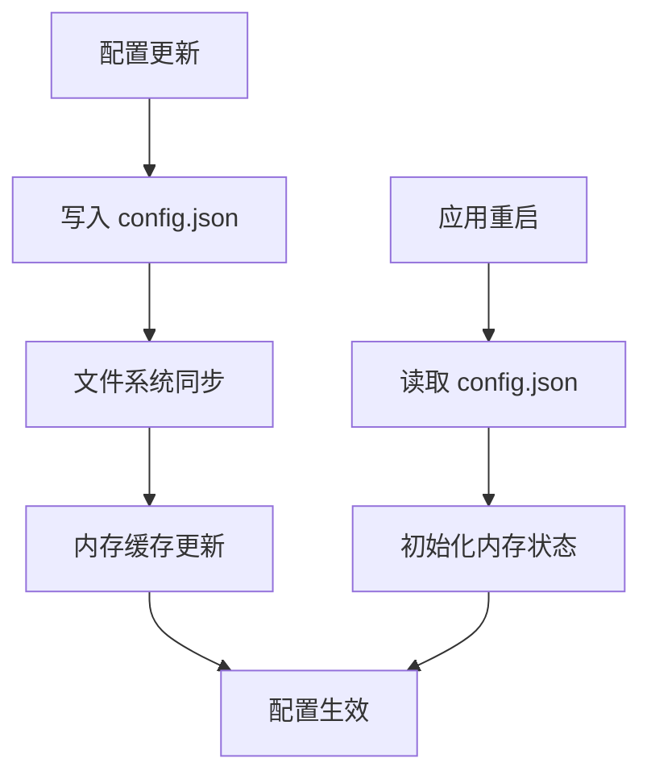

**图表来源**
- [paths.ts:58-66](file://server/src/config/paths.ts#L58-L66)

**章节来源**
- [paths.ts:35-66](file://server/src/config/paths.ts#L35-L66)

## 依赖关系分析

配置系统的依赖关系呈现清晰的层次结构：

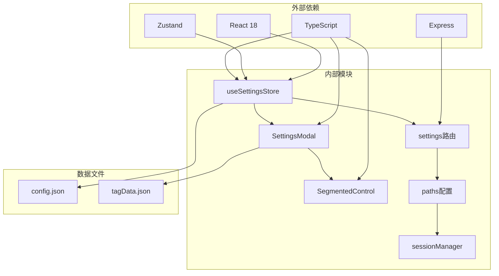

**图表来源**
- [useSettingsStore.ts:1-1](file://client/src/hooks/useSettingsStore.ts#L1-L1)
- [settings.ts:4-13](file://server/src/routes/settings.ts#L4-L13)

**依赖耦合分析：**
- **低耦合设计**：各模块职责明确，相互依赖最小化
- **接口隔离**：通过清晰的接口定义实现模块间通信
- **数据流向**：配置数据从服务端流向客户端，形成单向依赖

**章节来源**
- [useSettingsStore.ts:1-177](file://client/src/hooks/useSettingsStore.ts#L1-L177)
- [settings.ts:1-106](file://server/src/routes/settings.ts#L1-L106)

## 性能考虑

### 状态更新优化
配置系统采用多种优化策略确保高性能：

**原子化更新：**
- 使用 Zustand 的原子化状态更新减少不必要的重渲染
- 批量更新配置项时避免重复的 UI 刷新

**懒加载策略：**
- 服务端配置仅在需要时加载
- 大型配置文件采用延迟解析机制

**内存管理：**
- 及时清理不再使用的状态引用
- 避免内存泄漏的配置项

### 网络优化
服务端配置管理采用高效的网络通信策略：

**请求合并：**
- 批量处理多个配置更新请求
- 减少网络往返次数

**缓存机制：**
- 服务端缓存最近的配置状态
- 客户端使用智能缓存策略

## 故障排除指南

### 常见问题诊断

#### 配置不生效
**可能原因：**
1. 浏览器禁用了 localStorage
2. 配置键名拼写错误
3. 类型转换失败

**解决步骤：**
1. 检查浏览器控制台是否有存储权限错误
2. 验证配置键名是否符合约定
3. 确认配置值类型与定义匹配

#### 服务端配置更新失败
**可能原因：**
1. 路径权限不足
2. 目标目录不可写
3. 路径嵌套安全检查失败

**解决步骤：**
1. 检查目标目录的读写权限
2. 验证路径是否指向会话目录的安全位置
3. 确认磁盘空间充足

#### 界面显示异常
**可能原因：**
1. IntersectionObserver 不支持
2. CSS 变量未正确加载
3. 组件渲染顺序问题

**解决步骤：**
1. 检查浏览器对 IntersectionObserver 的支持
2. 验证 CSS 变量定义是否正确
3. 确认组件挂载顺序

**章节来源**
- [settings-panel.md:1-116](file://docs/settings-panel.md#L1-L116)

## 结论

CorineKit Pix2Real 的配置系统展现了现代前端应用配置管理的最佳实践。通过精心设计的架构和实现，系统实现了以下目标：

**技术优势：**
- **类型安全**：完整的 TypeScript 类型系统确保配置的正确性
- **用户体验**：直观的界面设计和实时反馈提升用户满意度
- **可扩展性**：模块化设计支持新配置项的快速添加
- **可靠性**：完善的错误处理和回滚机制确保系统稳定性

**开发效率：**
- **标准化流程**：清晰的配置添加流程减少开发成本
- **文档完善**：详细的开发者文档支持团队协作
- **测试友好**：模块化设计便于单元测试和集成测试

**未来发展方向：**
- **配置版本管理**：支持配置的版本控制和差异比较
- **远程配置同步**：支持多设备间的配置同步
- **配置模板系统**：提供配置模板和预设方案
- **配置导入导出**：支持配置的批量导入导出功能

该配置系统为 CorineKit Pix2Real 提供了坚实的技术基础，支持应用的持续发展和功能扩展。

## 附录

### 配置扩展示例

#### 简单布尔配置添加流程

**步骤1：定义类型**
```typescript
// 在 SettingsState 接口中添加新的布尔配置
export interface SettingsState {
  // ... 现有配置
  enableExperimentalFeatures: boolean;
}
```

**步骤2：添加状态初始化**
```typescript
// 在 create() 函数中初始化默认值
enableExperimentalFeatures: localStorage.getItem('settings_enableExperimentalFeatures') !== '0',
```

**步骤3：添加 setter 方法**
```typescript
// 添加对应的 setter 方法
setEnableExperimentalFeatures: (enabled) => {
  localStorage.setItem('settings_enableExperimentalFeatures', enabled ? '1' : '0');
  set({ enableExperimentalFeatures: enabled });
},
```

**步骤4：在界面中添加控件**
```typescript
// 在 SettingsModal.tsx 中添加对应的 UI
<div style={settingRowStyle}>
  <div style={{ marginRight: 24 }}>
    <div style={settingLabelStyle}>启用实验功能</div>
    <div style={settingDescStyle}>启用实验性的新功能</div>
  </div>
  <SegmentedControl
    options={TOGGLE_OPTIONS}
    value={enableExperimentalFeatures ? 'on' : 'off'}
    onChange={(v) => setEnableExperimentalFeatures(v === 'on')}
  />
</div>
```

#### 复杂对象配置添加流程

**步骤1：定义数据结构**
```typescript
interface NotificationPreferences {
  desktop: boolean;
  email: boolean;
  push: boolean;
  frequency: 'immediate' | 'daily' | 'weekly';
}

interface AdvancedSettings {
  notificationPreferences: NotificationPreferences;
  apiEndpoints: Record<string, string>;
  themeSettings: {
    primaryColor: string;
    fontSize: 'small' | 'medium' | 'large';
  };
}
```

**步骤2：扩展 SettingsState**
```typescript
export interface SettingsState {
  advancedSettings: AdvancedSettings;
  // ... 其他配置
}
```

**步骤3：实现配置管理**
```typescript
// 初始化复杂配置
advancedSettings: {
  notificationPreferences: {
    desktop: true,
    email: false,
    push: true,
    frequency: 'daily'
  },
  apiEndpoints: {},
  themeSettings: {
    primaryColor: '#007bff',
    fontSize: 'medium'
  }
},

// 处理复杂配置更新
setAdvancedSettings: (settings) => {
  const updated = { ...get().advancedSettings, ...settings };
  localStorage.setItem('settings_advancedSettings', JSON.stringify(updated));
  set({ advancedSettings: updated });
}
```

**步骤4：创建配置界面**
```typescript
// 在 SettingsModal.tsx 中添加复杂配置界面
<div style={settingRowStyle}>
  <div style={{ marginRight: 24, flex: 1 }}>
    <div style={settingLabelStyle}>通知偏好</div>
    <div style={{ display: 'flex', gap: 12, marginTop: 12 }}>
      <div style={{ flex: 1 }}>
        <div style={{ fontSize: 12, color: 'var(--color-text-secondary)', marginBottom: 4 }}>桌面通知</div>
        <SegmentedControl
          options={TOGGLE_OPTIONS}
          value={advancedSettings.notificationPreferences.desktop ? 'on' : 'off'}
          onChange={(v) => {
            const prefs = get().advancedSettings.notificationPreferences;
            get().setAdvancedSettings({
              notificationPreferences: { ...prefs, desktop: v === 'on' }
            });
          }}
        />
      </div>
      <div style={{ flex: 1 }}>
        <div style={{ fontSize: 12, color: 'var(--color-text-secondary)', marginBottom: 4 }}>邮件通知</div>
        <SegmentedControl
          options={TOGGLE_OPTIONS}
          value={advancedSettings.notificationPreferences.email ? 'on' : 'off'}
          onChange={(v) => {
            const prefs = get().advancedSettings.notificationPreferences;
            get().setAdvancedSettings({
              notificationPreferences: { ...prefs, email: v === 'on' }
            });
          }}
        />
      </div>
    </div>
  </div>
</div>
```

#### 配置迁移和版本管理

**版本升级流程：**
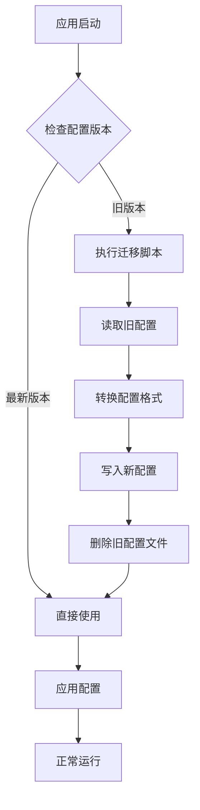

**配置回滚机制：**
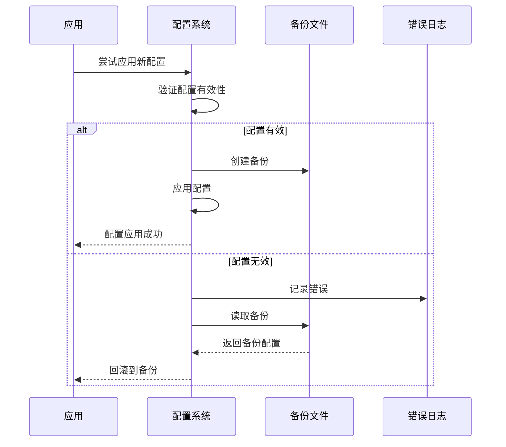

**章节来源**
- [settings-panel.md:13-71](file://docs/settings-panel.md#L13-L71)