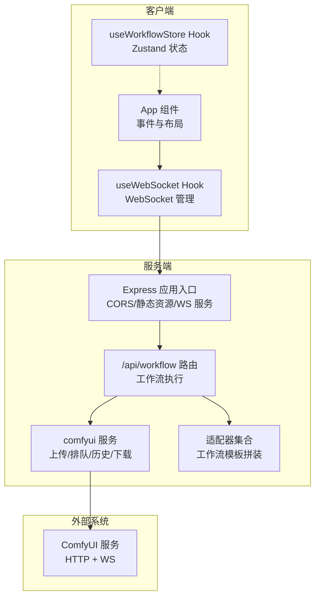
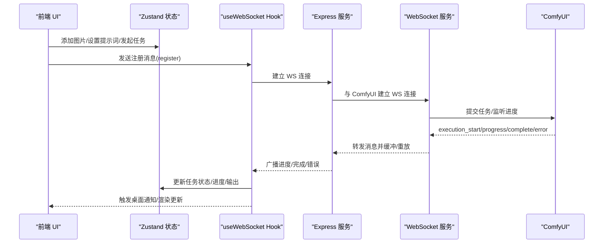
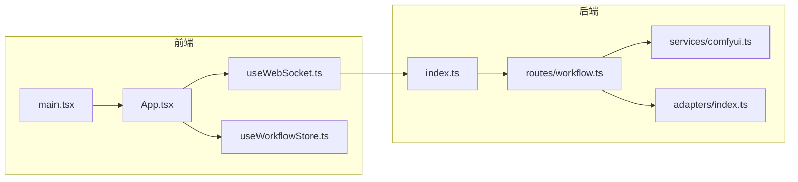

# 测试策略与方法

<cite>
**本文引用的文件**
- [README.md](file://README.md)
- [package.json](file://package.json)
- [client/package.json](file://client/package.json)
- [server/package.json](file://server/package.json)
- [client/src/main.tsx](file://client/src/main.tsx)
- [client/src/components/App.tsx](file://client/src/components/App.tsx)
- [client/src/hooks/useWorkflowStore.ts](file://client/src/hooks/useWorkflowStore.ts)
- [client/src/hooks/useWebSocket.ts](file://client/src/hooks/useWebSocket.ts)
- [client/src/types/index.ts](file://client/src/types/index.ts)
- [server/src/index.ts](file://server/src/index.ts)
- [server/src/services/comfyui.ts](file://server/src/services/comfyui.ts)
- [server/src/routes/workflow.ts](file://server/src/routes/workflow.ts)
- [server/src/adapters/index.ts](file://server/src/adapters/index.ts)
</cite>

## 目录
1. [引言](#引言)
2. [项目结构](#项目结构)
3. [核心组件](#核心组件)
4. [架构总览](#架构总览)
5. [详细组件分析](#详细组件分析)
6. [依赖关系分析](#依赖关系分析)
7. [性能考量](#性能考量)
8. [故障排查指南](#故障排查指南)
9. [结论](#结论)
10. [附录](#附录)

## 引言
本测试策略与方法文档面向 CorineKit Pix2Real 项目，目标是建立一套系统化的测试体系，覆盖前端组件测试、状态管理测试、后端服务测试、集成测试（API、WebSocket、文件处理）、端到端测试（用户工作流、会话恢复、多标签页状态同步），并明确测试环境搭建、Mock 服务配置、测试工具选择、测试覆盖率与质量标准。本文档同时给出可视化图表与可操作的测试建议，帮助开发者与测试工程师高效落地。

## 项目结构
Pix2Real 采用前后端分离架构：
- 前端（client）：React + TypeScript，使用 Zustand 管理状态，WebSocket 与后端实时通信。
- 后端（server）：Express + TypeScript，负责路由、适配器、与 ComfyUI 的交互、WebSocket 中继。
- 适配器（adapters）：针对不同工作流的模板与参数拼装逻辑。
- ComfyUI_API：工作流模板 JSON 文件集合。

**图表来源**
- [client/src/components/App.tsx:61-422](file://client/src/components/App.tsx#L61-L422)
- [client/src/hooks/useWebSocket.ts:29-278](file://client/src/hooks/useWebSocket.ts#L29-L278)
- [client/src/hooks/useWorkflowStore.ts:191-923](file://client/src/hooks/useWorkflowStore.ts#L191-L923)
- [server/src/index.ts:118-494](file://server/src/index.ts#L118-L494)
- [server/src/routes/workflow.ts:1-800](file://server/src/routes/workflow.ts#L1-L800)
- [server/src/services/comfyui.ts:168-472](file://server/src/services/comfyui.ts#L168-L472)
- [server/src/adapters/index.ts:14-33](file://server/src/adapters/index.ts#L14-L33)

**章节来源**
- [README.md:41-79](file://README.md#L41-L79)
- [package.json:4-10](file://package.json#L4-L10)
- [client/package.json:6-10](file://client/package.json#L6-L10)
- [server/package.json:6-10](file://server/package.json#L6-L10)

## 核心组件
- 前端状态与视图
  - App 组件：页面布局、拖拽导入、侧栏与主内容区、欢迎页与状态栏等。
  - useWorkflowStore：图像列表、任务状态、提示词、输出索引、跨标签数据隔离、任务生命周期管理。
  - useWebSocket：单例 WebSocket 连接、消息解析、进度/完成/错误分发、桌面通知、Agent 执行同步。
- 后端服务与路由
  - Express 入口：CORS、静态资源、路由挂载、WebSocket 服务、ComfyUI 状态查询。
  - /api/workflow 路由：工作流执行、LoRA 链式连接、文件上传、尺寸解析、错误友好化。
  - comfyui 服务：上传图片/视频、排队、历史查询、输出下载、系统统计、队列优先级调整。
  - 适配器：按工作流 ID 加载模板并注入输入参数，构建 prompt JSON。

**章节来源**
- [client/src/components/App.tsx:61-422](file://client/src/components/App.tsx#L61-L422)
- [client/src/hooks/useWorkflowStore.ts:101-923](file://client/src/hooks/useWorkflowStore.ts#L101-L923)
- [client/src/hooks/useWebSocket.ts:29-278](file://client/src/hooks/useWebSocket.ts#L29-L278)
- [server/src/index.ts:118-494](file://server/src/index.ts#L118-L494)
- [server/src/routes/workflow.ts:152-800](file://server/src/routes/workflow.ts#L152-L800)
- [server/src/services/comfyui.ts:168-472](file://server/src/services/comfyui.ts#L168-L472)
- [server/src/adapters/index.ts:14-33](file://server/src/adapters/index.ts#L14-L33)

## 架构总览
下图展示了从前端到后端再到 ComfyUI 的完整链路，以及 WebSocket 实时进度中继的关键节点。

**图表来源**
- [client/src/hooks/useWebSocket.ts:45-163](file://client/src/hooks/useWebSocket.ts#L45-L163)
- [server/src/index.ts:168-494](file://server/src/index.ts#L168-L494)
- [server/src/services/comfyui.ts:304-375](file://server/src/services/comfyui.ts#L304-L375)

## 详细组件分析

### 前端组件测试策略
- 组件职责拆分
  - App 组件：布局、拖拽、欢迎页、侧栏宽度、主题切换、Agent 悬浮按钮等。建议拆分为更小的纯函数组件进行单元测试。
  - PhotoWall/FaceSwapPhotoWall 等：渲染列表、缩略图、选中状态、右键菜单等。
  - Sidebar/Settings 等：参数输入、校验、联动更新。
- 测试要点
  - 渲染与交互：点击、拖拽、键盘快捷键、多标签页切换。
  - 状态一致性：任务状态机（idle/uploading/queued/processing/done/error）与进度百分比、阶段名称。
  - 边界条件：空列表、大量图片、视频首帧提取失败、重复文件名冲突。
  - 会话恢复：localStorage 与 sessionStorage 的读写、序列化/反序列化。
- 推荐工具
  - React Testing Library + Jest（或 Vitest）+ jsdom。
  - 使用 MemoryRouter、Wrapper Provider（Zustand Store）模拟路由与状态。
  - 对 Drag/Drop、文件读取等异步行为使用 Mock 与延迟控制。

**章节来源**
- [client/src/components/App.tsx:61-422](file://client/src/components/App.tsx#L61-L422)
- [client/src/hooks/useWorkflowStore.ts:297-455](file://client/src/hooks/useWorkflowStore.ts#L297-L455)
- [client/src/hooks/useWebSocket.ts:29-278](file://client/src/hooks/useWebSocket.ts#L29-L278)

### 状态管理测试策略（Zustand）
- 关注点
  - 图像增删改、提示词设置、任务生命周期（start/mark/update/complete/fail/reset）。
  - 跨标签数据隔离与迁移（tabData）。
  - 任务与 promptId 的映射、输出合并与索引切换。
  - 代理提示词编辑的闪烁信号与来源标记（imageSourceMap）。
- 测试建议
  - 单元测试：针对每个 action 的输入输出，验证状态变更与副作用。
  - 集成测试：组合多个 action，验证复杂流程（如批量生成、重命名卡片、移除输出）。
  - Mock 依赖：对文件上传、WebSocket、桌面通知等外部依赖进行隔离。

**章节来源**
- [client/src/hooks/useWorkflowStore.ts:101-923](file://client/src/hooks/useWorkflowStore.ts#L101-L923)
- [client/src/types/index.ts:1-76](file://client/src/types/index.ts#L1-L76)

### WebSocket 通信测试策略
- 关注点
  - 单例连接管理、自动重连、消息缓冲与重放。
  - 客户端注册（register）与服务端映射（promptWorkflowMap）。
  - 进度/完成/错误消息的解析与分发。
  - Agent 执行进度同步与批量完成聚合。
- 测试建议
  - 单元测试：模拟 WS 事件流，验证状态更新与回调触发。
  - 集成测试：结合后端 WebSocket 服务，验证消息转发、缓冲与重放。
  - Mock：使用 WebSocket Mock（如 jest-websocket-mock）或无头浏览器测试。

**章节来源**
- [client/src/hooks/useWebSocket.ts:29-278](file://client/src/hooks/useWebSocket.ts#L29-L278)
- [server/src/index.ts:168-494](file://server/src/index.ts#L168-L494)

### 后端服务测试策略
- 适配器与模板拼装
  - 验证按 workflowId 加载模板、注入输入参数、构建 prompt JSON。
  - 特殊分支：PRO 工作流、LoRA 链式连接、尺寸与文件名处理。
- 文件上传与工作流执行
  - 上传图片/视频、尺寸解析、错误友好化（toFriendlyComfyError）。
  - /execute 接口的参数校验、clientId 必填、promptId 返回。
- ComfyUI 交互
  - 队列提交、历史查询、输出下载、系统统计、队列优先级调整。
- 测试建议
  - 单元测试：适配器 buildPrompt、LoRA 链式连接逻辑。
  - 集成测试：路由层 + 服务层 + Mock ComfyUI HTTP/WS。
  - 质量保障：边界条件（空输入、非法文件、缺失模型）、异常路径（网络错误、超时）。

**章节来源**
- [server/src/routes/workflow.ts:152-800](file://server/src/routes/workflow.ts#L152-L800)
- [server/src/services/comfyui.ts:168-472](file://server/src/services/comfyui.ts#L168-L472)
- [server/src/adapters/index.ts:14-33](file://server/src/adapters/index.ts#L14-L33)

### API 接口测试策略
- 路由清单与关键接口
  - GET /api/workflows：列出工作流。
  - POST /api/workflow/:id/execute：通用工作流执行（含图片上传）。
  - POST /api/workflow/7/execute：快速出图（JSON 参数，无文件上传）。
  - POST /api/workflow/9/execute：ZIT 快出（UNet + LoRA）。
  - POST /api/workflow/5/execute：解除装备（双文件上传）。
  - POST /api/workflow/8/execute：黑兽换脸（双文件上传）。
  - GET /api/workflow/models/*：模型列表。
  - GET /api/comfyui/status：ComfyUI 运行状态。
- 测试建议
  - 行为驱动：针对每个接口的请求体/查询参数、响应结构、状态码。
  - 边界与异常：缺失参数、非法文件类型、ComfyUI 不可用、队列失败。
  - 并发与幂等：重复提交、队列优先级调整、删除队列项。

**章节来源**
- [server/src/routes/workflow.ts:152-800](file://server/src/routes/workflow.ts#L152-L800)
- [server/src/index.ts:147-155](file://server/src/index.ts#L147-L155)

### WebSocket 通信测试策略
- 关键流程
  - 客户端连接、注册（register）、进度缓冲与重放、完成/错误处理。
  - 与 ComfyUI 的双向中继：execution_start/progress/complete/error。
- 测试建议
  - 单元：消息解析、状态机推进、重连与关闭。
  - 集成：与 /ws 路由联调，验证消息转发、历史等待、输出下载。
  - 场景：断线重连、并发任务、批量生成、Agent 执行。

**章节来源**
- [server/src/index.ts:168-494](file://server/src/index.ts#L168-L494)
- [server/src/services/comfyui.ts:304-375](file://server/src/services/comfyui.ts#L304-L375)

### 文件处理测试策略
- 上传与存储
  - 图片/视频上传、尺寸解析、临时文件与持久化。
  - 参考图管理（上传/访问/删除）。
- 输出下载与会话
  - ComfyUI 输出下载、保存到会话目录、URL 生成。
- 测试建议
  - 单元：尺寸解析算法、文件名规范化、路径拼接。
  - 集成：上传 + 队列 + 下载 + 会话落盘。
  - 边界：超大文件、损坏文件、权限问题、磁盘空间不足。

**章节来源**
- [server/src/routes/workflow.ts:437-484](file://server/src/routes/workflow.ts#L437-L484)
- [server/src/services/comfyui.ts:9-45](file://server/src/services/comfyui.ts#L9-L45)
- [server/src/index.ts:373-420](file://server/src/index.ts#L373-L420)

### 端到端测试策略
- 用户工作流
  - 通用工作流：拖拽图片 → 设置提示词 → 发起任务 → 实时进度 → 查看输出。
  - 文生图类：快速出图、ZIT 快出 → 参数配置 → 生成 → 日志记录。
  - 特殊工作流：解除装备、黑兽换脸 → 双文件上传 → 生成 → 输出。
- 会话恢复测试
  - 新建会话 → 导入图片 → 设置提示词 → 生成部分任务 → 关闭页面 → 重新打开 → 恢复状态。
- 多标签页状态同步测试
  - 同一任务在多个标签页显示一致的进度与输出。
- 测试建议
  - 工具：Playwright/Cypress（推荐 Playwright，支持多标签页与截图）。
  - Mock：ComfyUI HTTP/WS、文件系统、桌面通知。
  - 覆盖：成功路径、失败路径、网络抖动、断电/崩溃恢复。

**章节来源**
- [client/src/components/App.tsx:61-422](file://client/src/components/App.tsx#L61-L422)
- [client/src/hooks/useWorkflowStore.ts:181-183](file://client/src/hooks/useWorkflowStore.ts#L181-L183)
- [server/src/index.ts:168-494](file://server/src/index.ts#L168-L494)

## 依赖关系分析

**图表来源**
- [client/src/main.tsx:1-11](file://client/src/main.tsx#L1-L11)
- [client/src/components/App.tsx:61-422](file://client/src/components/App.tsx#L61-L422)
- [client/src/hooks/useWebSocket.ts:29-278](file://client/src/hooks/useWebSocket.ts#L29-L278)
- [client/src/hooks/useWorkflowStore.ts:191-923](file://client/src/hooks/useWorkflowStore.ts#L191-L923)
- [server/src/index.ts:118-494](file://server/src/index.ts#L118-L494)
- [server/src/routes/workflow.ts:1-800](file://server/src/routes/workflow.ts#L1-L800)
- [server/src/services/comfyui.ts:168-472](file://server/src/services/comfyui.ts#L168-L472)
- [server/src/adapters/index.ts:14-33](file://server/src/adapters/index.ts#L14-L33)

**章节来源**
- [client/src/main.tsx:1-11](file://client/src/main.tsx#L1-L11)
- [server/src/index.ts:118-146](file://server/src/index.ts#L118-L146)

## 性能考量
- WebSocket 连接池与单例
  - useWebSocket 通过模块级全局变量确保单实例连接，减少资源消耗与重复握手。
- 进度计算与缓冲
  - 服务端对 execution_start/progress 进行缓冲并在注册后重放，避免首卡漏消息。
  - 服务端对 complete 前的 history 做重试，降低“完成但空输出”的概率。
- 队列优先级与重排
  - 通过删除并重入队列的方式提升目标任务优先级，减少等待时间。
- 建议
  - 前端：对高频状态更新做节流/防抖；对图片预览 URL 做及时 revoke。
  - 后端：对 ComfyUI 请求做超时与重试；对磁盘写入做异步批处理。

**章节来源**
- [client/src/hooks/useWebSocket.ts:9-278](file://client/src/hooks/useWebSocket.ts#L9-L278)
- [server/src/index.ts:175-185](file://server/src/index.ts#L175-L185)
- [server/src/index.ts:335-448](file://server/src/index.ts#L335-L448)
- [server/src/services/comfyui.ts:442-472](file://server/src/services/comfyui.ts#L442-L472)

## 故障排查指南
- WebSocket 无法连接
  - 检查 /ws 路由是否启动、CORS 配置、客户端协议（ws/wss）与主机地址。
  - 关注 onclose/onerror 回调与自动重连逻辑。
- 任务进度停滞
  - 确认 ComfyUI 正常运行、队列中有任务、execution_start/progress 是否到达服务端。
  - 检查服务端对 history 的等待与重试逻辑。
- 输出为空或缺失
  - 确认输出下载流程（getImageBuffer/saveOutputFile）是否被触发与成功。
  - 检查 promptWorkflowMap 注册是否早于 complete 到达。
- 文件上传失败
  - 检查 multer 配置、文件大小限制、ComfyUI 上传接口返回。
- 模型/LoRA 未找到
  - 使用 toFriendlyComfyError 将错误映射为用户可理解的消息。

**章节来源**
- [server/src/index.ts:168-494](file://server/src/index.ts#L168-L494)
- [server/src/services/comfyui.ts:198-237](file://server/src/services/comfyui.ts#L198-L237)
- [server/src/routes/workflow.ts:126-150](file://server/src/routes/workflow.ts#L126-L150)

## 结论
本测试策略围绕前端组件、状态管理、后端服务、集成与端到端测试进行了系统化设计，并结合项目实际的 Adapter 模式、WebSocket 实时中继、ComfyUI 交互与会话持久化等特性，给出了可操作的测试方法与质量标准。建议在 CI 中引入单元测试、集成测试与端到端测试，配合覆盖率报告与质量门禁，持续保障系统稳定性与用户体验。

## 附录

### 测试环境搭建与工具选择
- 前端
  - 测试框架：Jest/Vitest + React Testing Library
  - Mock：jest-websocket-mock、fetch-mock、file mock
  - 端到端：Playwright（多标签页、截图、视频录制）
- 后端
  - 测试框架：Jest + Supertest（HTTP）+ ws（WebSocket）
  - Mock：nock（HTTP）、自定义 WS Mock
  - 数据库/文件：内存数据库 + 临时目录
- 通用
  - 覆盖率：Istanbul/Jest 覆盖率 + 质量门禁
  - CI：GitHub Actions（并行执行单元/集成/端到端）

### 测试覆盖率与质量标准
- 覆盖率目标
  - 单元测试：状态管理与工具函数 ≥ 85%
  - 路由与服务：≥ 80%
  - 端到端：关键用户路径 ≥ 70%
- 质量门禁
  - 关键路径：所有工作流执行、WebSocket 进度、输出下载、会话恢复
  - 边界条件：空输入、重复文件名、网络异常、ComfyUI 不可用
  - 回归测试：新增/修改适配器、路由参数变化、UI 交互变更