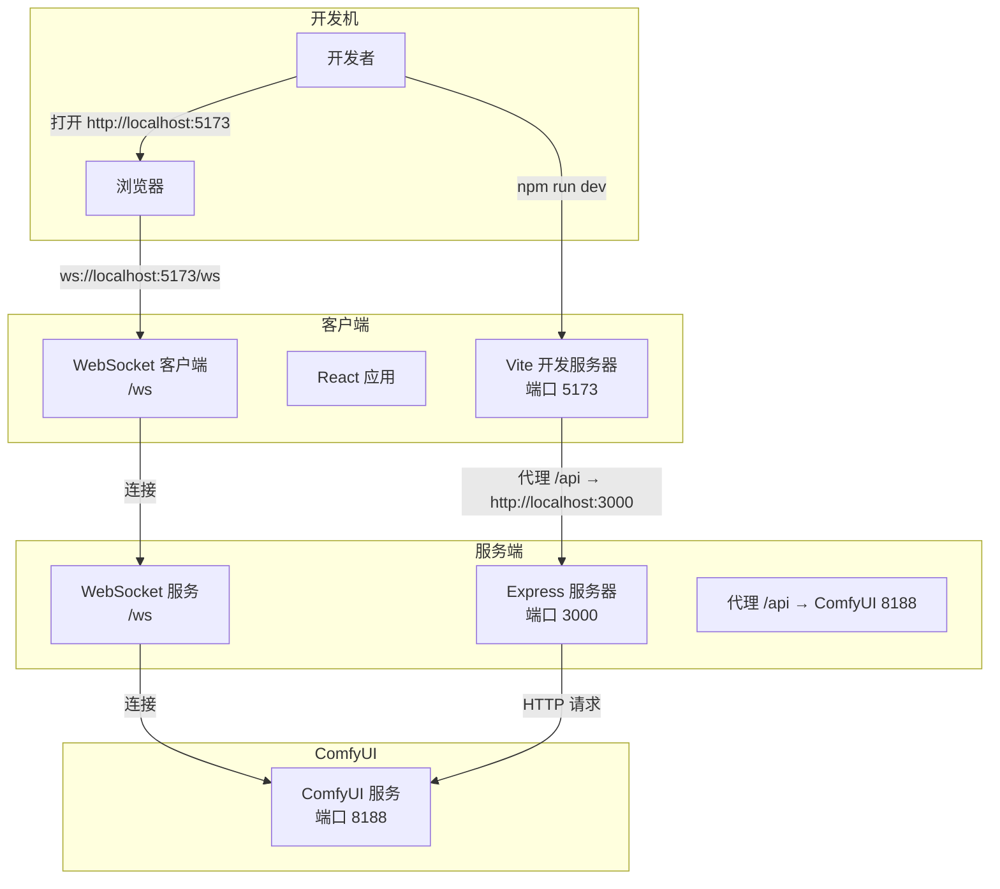
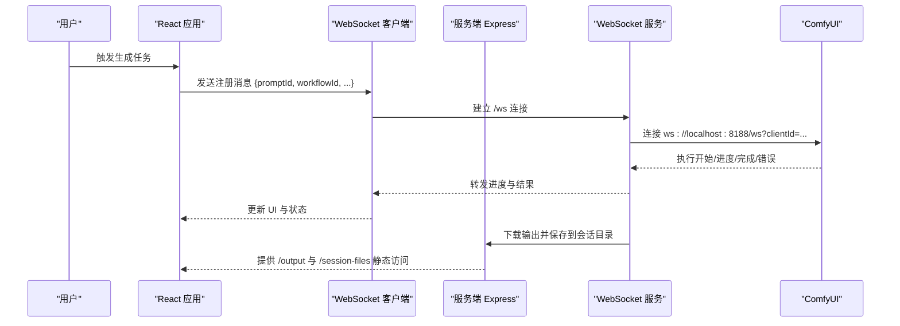
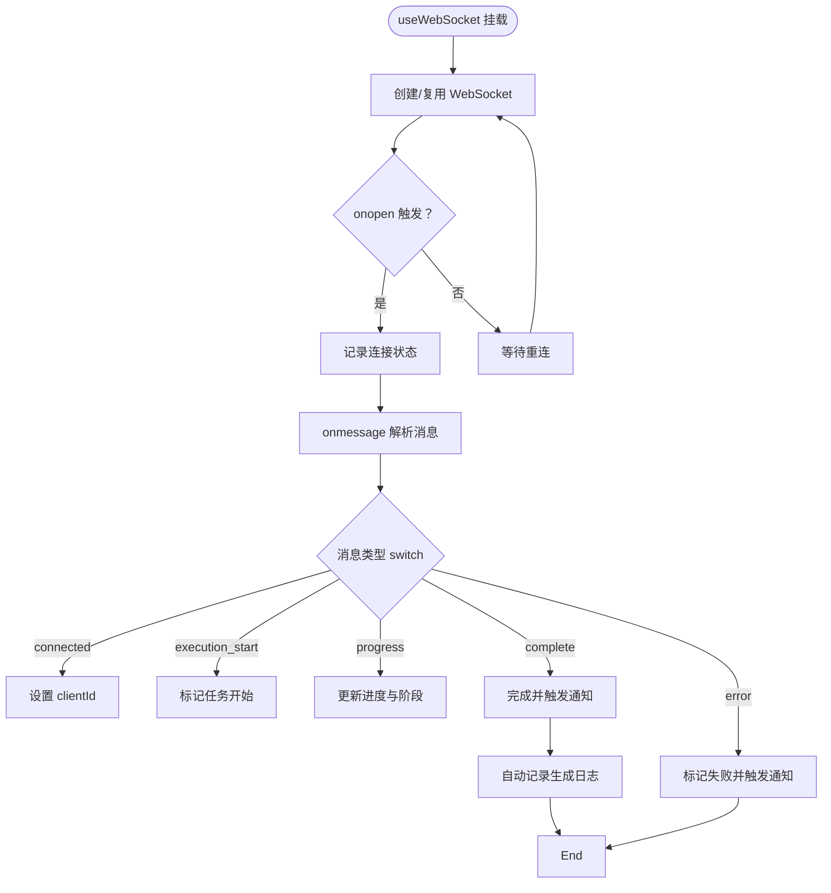
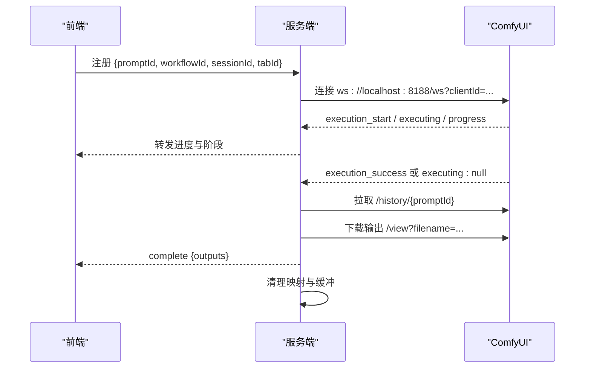
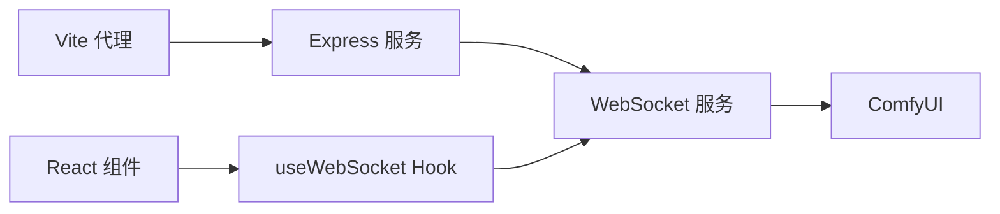

# 调试技巧与工具

<cite>
**本文引用的文件**
- [package.json](file://package.json)
- [start.bat](file://start.bat)
- [debug.bat](file://debug.bat)
- [stop.bat](file://stop.bat)
- [client/package.json](file://client/package.json)
- [client/vite.config.ts](file://client/vite.config.ts)
- [client/src/main.tsx](file://client/src/main.tsx)
- [client/src/hooks/useWebSocket.ts](file://client/src/hooks/useWebSocket.ts)
- [client/src/services/api.ts](file://client/src/services/api.ts)
- [client/src/types/index.ts](file://client/src/types/index.ts)
- [server/package.json](file://server/package.json)
- [server/src/index.ts](file://server/src/index.ts)
- [server/src/services/comfyui.ts](file://server/src/services/comfyui.ts)
- [server/src/services/comfyuiLauncher.ts](file://server/src/services/comfyuiLauncher.ts)
</cite>

## 目录
1. [简介](#简介)
2. [项目结构](#项目结构)
3. [核心组件](#核心组件)
4. [架构总览](#架构总览)
5. [详细组件分析](#详细组件分析)
6. [依赖关系分析](#依赖关系分析)
7. [性能考量](#性能考量)
8. [故障排查指南](#故障排查指南)
9. [结论](#结论)
10. [附录](#附录)

## 简介
本指南面向 CorineKit Pix2Real 的开发者与高级用户，提供从开发环境配置到断点调试、性能分析与日志记录的全流程调试方法。内容覆盖：
- VS Code 调试配置建议
- Chrome DevTools 使用技巧
- React Developer Tools 安装与配置
- 前端组件调试、后端服务调试与 WebSocket 通信调试
- 性能分析工具使用（React Profiler、Chrome Performance 面板、内存泄漏检测）
- 日志记录策略（前端日志系统、后端日志配置、错误追踪机制）
- 常见问题诊断与解决方案（ComfyUI 连接问题、文件处理异常、网络通信故障）

## 项目结构
该项目采用前后端分离架构，包含客户端（React + Vite）、服务端（Express + WebSocket）、以及 ComfyUI 工作流引擎。开发脚本通过 npm 并发启动前后端，并提供 Windows 批处理脚本辅助启动与停止。

图表来源
- [client/vite.config.ts:1-28](file://client/vite.config.ts#L1-L28)
- [server/src/index.ts:118-146](file://server/src/index.ts#L118-L146)
- [server/src/services/comfyui.ts:6-7](file://server/src/services/comfyui.ts#L6-L7)

章节来源
- [package.json:1-15](file://package.json#L1-L15)
- [client/vite.config.ts:1-28](file://client/vite.config.ts#L1-L28)
- [server/src/index.ts:118-146](file://server/src/index.ts#L118-L146)

## 核心组件
- 客户端应用入口与路由
  - React 应用入口负责挂载根组件，配合 Vite 开发服务器进行热更新与代理。
  - 关键文件：[client/src/main.tsx:1-11](file://client/src/main.tsx#L1-L11)
- WebSocket 客户端钩子
  - 统一管理 WebSocket 连接、消息解析与状态更新；支持自动重连与批量任务进度聚合。
  - 关键文件：[client/src/hooks/useWebSocket.ts:1-278](file://client/src/hooks/useWebSocket.ts#L1-L278)
- API 服务封装
  - 封装前端与后端交互接口，统一错误处理与响应格式。
  - 关键文件：[client/src/services/api.ts:1-42](file://client/src/services/api.ts#L1-L42)
- 类型定义
  - 定义 WebSocket 消息类型、任务状态与数据结构，便于前后端契约约束。
  - 关键文件：[client/src/types/index.ts:1-76](file://client/src/types/index.ts#L1-L76)
- 服务端入口与路由
  - Express 服务提供 REST API 与静态资源；WebSocket 服务桥接 ComfyUI。
  - 关键文件：[server/src/index.ts:1-516](file://server/src/index.ts#L1-L516)
- ComfyUI 适配层
  - 负责上传文件、排队工作流、拉取历史与输出、系统状态查询等。
  - 关键文件：[server/src/services/comfyui.ts:1-472](file://server/src/services/comfyui.ts#L1-L472)
- ComfyUI 启动器
  - 自动检测与启动 ComfyUI，支持环境变量覆盖安装路径。
  - 关键文件：[server/src/services/comfyuiLauncher.ts:1-131](file://server/src/services/comfyuiLauncher.ts#L1-L131)

章节来源
- [client/src/main.tsx:1-11](file://client/src/main.tsx#L1-L11)
- [client/src/hooks/useWebSocket.ts:1-278](file://client/src/hooks/useWebSocket.ts#L1-L278)
- [client/src/services/api.ts:1-42](file://client/src/services/api.ts#L1-L42)
- [client/src/types/index.ts:1-76](file://client/src/types/index.ts#L1-L76)
- [server/src/index.ts:1-516](file://server/src/index.ts#L1-L516)
- [server/src/services/comfyui.ts:1-472](file://server/src/services/comfyui.ts#L1-L472)
- [server/src/services/comfyuiLauncher.ts:1-131](file://server/src/services/comfyuiLauncher.ts#L1-L131)

## 架构总览
下图展示了从浏览器到 ComfyUI 的完整调用链路，包括 WebSocket 进度事件与 HTTP 文件下载流程。

图表来源
- [client/src/hooks/useWebSocket.ts:29-252](file://client/src/hooks/useWebSocket.ts#L29-L252)
- [server/src/index.ts:157-494](file://server/src/index.ts#L157-L494)
- [server/src/services/comfyui.ts:265-375](file://server/src/services/comfyui.ts#L265-L375)

## 详细组件分析

### 组件一：WebSocket 客户端（前端）
- 职责
  - 单例连接管理、自动重连、消息分发与桌面通知集成。
  - 对 Agent 执行进度进行批量聚合与最终汇总。
- 关键行为
  - 连接建立后接收“已连接”消息并设置 clientId。
  - 接收“执行开始/进度/完成/错误”消息，驱动工作流卡片状态更新。
  - 对特定工作流（Tab 7/9）自动记录生成日志并通过 /api/agent/log-generation 上报。
- 断点调试建议
  - 在消息分发 switch 之前设置断点，观察消息类型与负载。
  - 在连接建立与关闭回调处设置断点，验证重连逻辑。
  - 在自动记录日志的 fetch 调用前后设置断点，检查请求与错误。
- 性能关注
  - 大批量任务时注意避免频繁状态更新导致的渲染抖动，必要时合并更新。

图表来源
- [client/src/hooks/useWebSocket.ts:29-252](file://client/src/hooks/useWebSocket.ts#L29-L252)
- [client/src/hooks/useWebSocket.ts:50-159](file://client/src/hooks/useWebSocket.ts#L50-L159)

章节来源
- [client/src/hooks/useWebSocket.ts:1-278](file://client/src/hooks/useWebSocket.ts#L1-L278)
- [client/src/types/index.ts:39-76](file://client/src/types/index.ts#L39-L76)

### 组件二：服务端 WebSocket 与 ComfyUI 适配
- 职责
  - 作为中间层桥接前端与 ComfyUI，转发进度事件并下载输出文件。
  - 维护 promptId → workflow/session 映射，缓冲早期事件，处理完成/错误清理。
- 关键行为
  - 连接建立后向前端发送 clientId，并订阅 ComfyUI 的执行事件。
  - 计算权重化全局进度，支持多轮与 tiled 采样器场景。
  - 完成后异步拉取 ComfyUI 历史与输出，写入会话目录并通知前端。
- 断点调试建议
  - 在连接回调与消息分发处设置断点，观察事件顺序与去重逻辑。
  - 在完成回调中设置断点，检查历史拉取重试与输出下载流程。
  - 在错误回调中设置断点，验证清理与回退逻辑。

图表来源
- [server/src/index.ts:168-494](file://server/src/index.ts#L168-L494)
- [server/src/services/comfyui.ts:265-375](file://server/src/services/comfyui.ts#L265-L375)

章节来源
- [server/src/index.ts:157-494](file://server/src/index.ts#L157-L494)
- [server/src/services/comfyui.ts:168-237](file://server/src/services/comfyui.ts#L168-L237)

### 组件三：ComfyUI 启动器
- 职责
  - 检测 ComfyUI 是否运行，若未运行则自动启动并轮询等待就绪。
- 断点调试建议
  - 在 isComfyUIRunning 与 launchComfyUI 之间设置断点，验证路径与进程启动。
  - 在 ensureComfyUI 的等待循环中设置断点，观察超时与重试逻辑。

章节来源
- [server/src/services/comfyuiLauncher.ts:101-131](file://server/src/services/comfyuiLauncher.ts#L101-L131)

## 依赖关系分析
- 前端
  - Vite 代理将 /api、/ws、/model_meta、/favorites 等请求转发至服务端。
  - React 应用通过自定义 Hook 管理 WebSocket，通过 API 封装调用后端接口。
- 后端
  - Express 提供 REST API 与静态资源；WebSocket 服务桥接 ComfyUI。
  - 通过 HTTP 代理访问 ComfyUI 的上传、历史与视图接口。

图表来源
- [client/vite.config.ts:8-26](file://client/vite.config.ts#L8-L26)
- [server/src/index.ts:129-146](file://server/src/index.ts#L129-L146)

章节来源
- [client/vite.config.ts:1-28](file://client/vite.config.ts#L1-L28)
- [server/src/index.ts:118-146](file://server/src/index.ts#L118-L146)

## 性能考量
- React Profiler
  - 使用 React Developer Tools 的 Profiler 录制组件渲染，定位长任务与重复渲染热点。
  - 关注工作流卡片、进度条与输出列表的渲染频率，必要时引入 memo 与 key 优化。
- Chrome Performance 面板
  - 录制页面交互，观察主线程占用、布局与绘制开销，识别卡顿原因。
  - 关注 WebSocket 消息处理是否集中在主线程造成阻塞，必要时拆分任务。
- 内存泄漏检测
  - 使用 Memory 面板定期快照，对比断开连接后的残留对象。
  - 关注 WebSocket 实例、定时器与事件监听器是否正确清理。

## 故障排查指南
- ComfyUI 连接问题
  - 症状：服务端日志显示 ComfyUI 启动超时或无法访问。
  - 排查步骤：
    - 确认 ComfyUI 安装路径与 Python 可执行文件是否存在。
    - 检查端口 8188 是否被占用，必要时修改默认路径或端口。
    - 使用批处理脚本停止并重新启动服务，确保端口释放。
  - 相关文件：
    - [server/src/services/comfyuiLauncher.ts:16-18](file://server/src/services/comfyuiLauncher.ts#L16-L18)
    - [server/src/services/comfyuiLauncher.ts:58-88](file://server/src/services/comfyuiLauncher.ts#L58-L88)
    - [server/src/services/comfyuiLauncher.ts:101-131](file://server/src/services/comfyuiLauncher.ts#L101-L131)
- 文件处理异常
  - 症状：输出为空或“完成但无文件”。
  - 排查步骤：
    - 检查服务端对 /history/{promptId} 的重试逻辑是否生效。
    - 确认输出下载与保存到会话目录的流程未被提前中断。
  - 相关文件：
    - [server/src/index.ts:350-420](file://server/src/index.ts#L350-L420)
    - [server/src/services/comfyui.ts:198-207](file://server/src/services/comfyui.ts#L198-L207)
- 网络通信故障
  - 症状：WebSocket 断连、代理失败或跨域问题。
  - 排查步骤：
    - 检查 Vite 代理配置是否正确转发 /ws 与 /api。
    - 确认服务端 CORS 配置允许前端地址。
    - 使用浏览器 Network 面板查看请求与响应状态。
  - 相关文件：
    - [client/vite.config.ts:8-26](file://client/vite.config.ts#L8-L26)
    - [server/src/index.ts:122-125](file://server/src/index.ts#L122-L125)

章节来源
- [server/src/services/comfyuiLauncher.ts:16-18](file://server/src/services/comfyuiLauncher.ts#L16-L18)
- [server/src/services/comfyuiLauncher.ts:58-88](file://server/src/services/comfyuiLauncher.ts#L58-L88)
- [server/src/services/comfyuiLauncher.ts:101-131](file://server/src/services/comfyuiLauncher.ts#L101-L131)
- [server/src/index.ts:350-420](file://server/src/index.ts#L350-L420)
- [server/src/services/comfyui.ts:198-207](file://server/src/services/comfyui.ts#L198-L207)
- [client/vite.config.ts:8-26](file://client/vite.config.ts#L8-L26)
- [server/src/index.ts:122-125](file://server/src/index.ts#L122-L125)

## 结论
通过合理的开发环境配置、完善的断点调试策略、性能分析工具与日志记录体系，可以高效定位并解决 Pix2Real 在本地开发过程中的各类问题。建议在日常开发中结合本文提供的方法，逐步建立标准化的调试流程，提升问题定位与修复效率。

## 附录

### VS Code 调试配置建议
- 启动参数
  - 前端：使用 Vite 开发服务器，端口 5173。
  - 后端：使用 tsx watch 监听 TypeScript 源码变更，端口 3000。
- 断点位置
  - 前端：在 useWebSocket 的消息分发 switch、连接与关闭回调处设置断点。
  - 后端：在 WebSocket 事件回调、队列与历史拉取处设置断点。
- 环境变量
  - 可通过 .env 或启动脚本注入 COMFYUI_PATH 等环境变量。

章节来源
- [client/vite.config.ts:6-8](file://client/vite.config.ts#L6-L8)
- [server/package.json:7](file://server/package.json#L7)

### Chrome DevTools 使用技巧
- Elements：检查 DOM 结构与样式，定位布局问题。
- Console：打印关键变量与状态，验证消息类型与负载。
- Network：监控 /ws、/api 与 /view 请求，确认代理与跨域。
- Performance：录制交互，识别主线程瓶颈。
- Memory：定期快照，排查连接断开后的残留对象。

### React Developer Tools 安装与配置
- 安装
  - 在 Chrome 扩展商店搜索并安装 React Developer Tools。
- 配置
  - 在“Profiler”中选择组件树，录制渲染性能，关注高频更新区域。
  - 在“Components”中查看组件 props 与 state，验证 WebSocket 数据流。

### 日志记录策略
- 前端日志系统
  - 在 useWebSocket 的连接、消息与错误分支添加日志，便于追踪事件顺序。
  - 在自动记录生成日志的 fetch 调用前后添加日志，验证请求与错误。
- 后端日志配置
  - 在服务端入口与 WebSocket 事件回调中输出关键信息，如连接、进度、完成与错误。
  - 在 ComfyUI 启动器中输出路径、进程 PID 与等待状态。
- 错误追踪机制
  - 前端：在消息解析与 fetch 请求中捕获异常并上报。
  - 后端：在完成与错误回调中清理映射与缓冲，确保资源回收。

章节来源
- [client/src/hooks/useWebSocket.ts:41-43](file://client/src/hooks/useWebSocket.ts#L41-L43)
- [client/src/hooks/useWebSocket.ts:160-162](file://client/src/hooks/useWebSocket.ts#L160-L162)
- [server/src/index.ts:508-512](file://server/src/index.ts#L508-L512)
- [server/src/services/comfyuiLauncher.ts:101-131](file://server/src/services/comfyuiLauncher.ts#L101-L131)