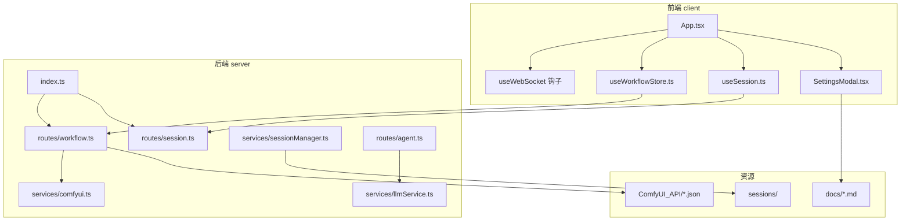
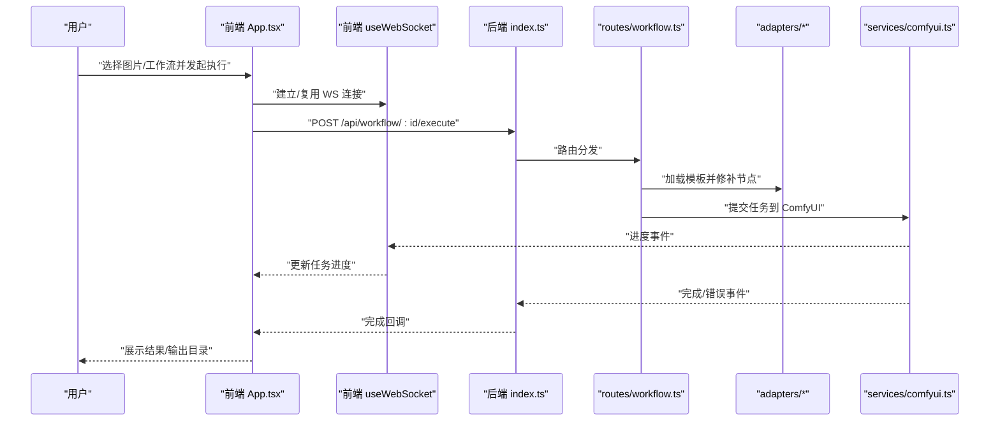
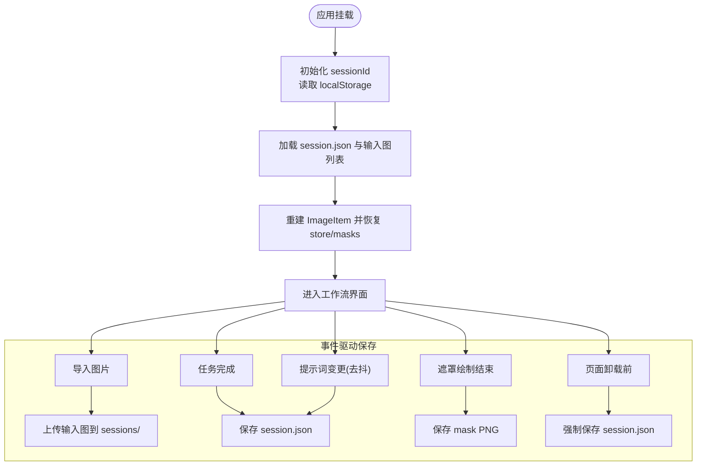
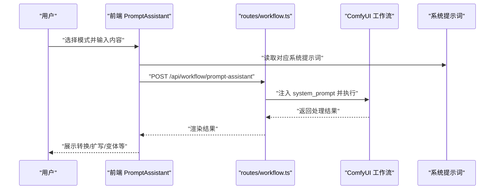
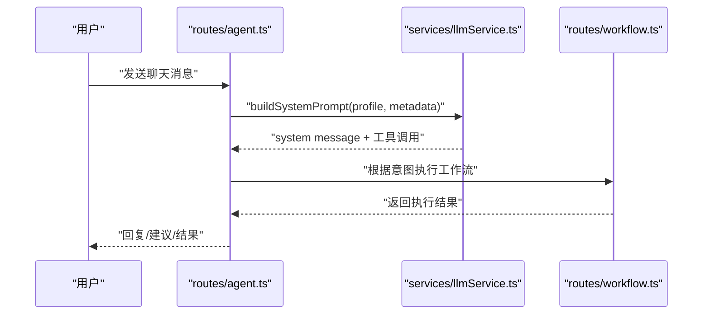
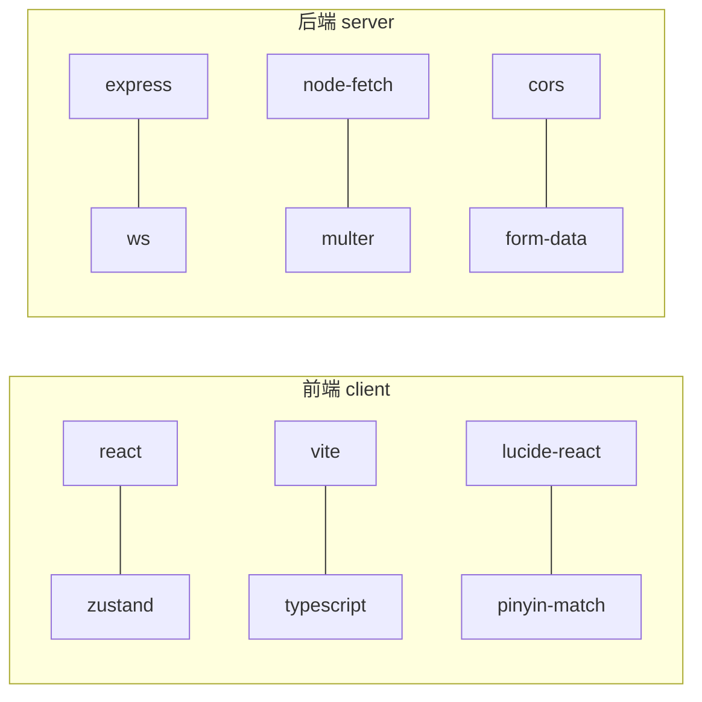

# 贡献指南

<cite>
**本文引用的文件**
- [README.md](file://README.md)
- [CLAUDE.md](file://CLAUDE.md)
- [package.json](file://package.json)
- [client/package.json](file://client/package.json)
- [server/package.json](file://server/package.json)
- [TODO-session-persistence.md](file://TODO-session-persistence.md)
- [TODO-ui-improvements.md](file://TODO-ui-improvements.md)
- [docs/settings-panel.md](file://docs/settings-panel.md)
- [docs/LLM系统提示词汇总.md](file://docs/LLM系统提示词汇总.md)
- [.claude/settings.local.json](file://.claude/settings.local.json)
- [client/src/hooks/useWorkflowStore.ts](file://client/src/hooks/useWorkflowStore.ts)
- [client/src/hooks/useImageImporter.ts](file://client/src/hooks/useImageImporter.ts)
- [client/src/components/App.tsx](file://client/src/components/App.tsx)
- [server/src/services/sessionManager.ts](file://server/src/services/sessionManager.ts)
- [server/src/routes/session.ts](file://server/src/routes/session.ts)
- [server/src/index.ts](file://server/src/index.ts)
- [server/src/routes/workflow.ts](file://server/src/routes/workflow.ts)
- [server/src/routes/agent.ts](file://server/src/routes/agent.ts)
- [server/src/services/llmService.ts](file://server/src/services/llmService.ts)
- [client/src/components/prompt-assistant/systemPrompts.ts](file://client/src/components/prompt-assistant/systemPrompts.ts)
</cite>

## 目录
1. [简介](#简介)
2. [项目结构](#项目结构)
3. [核心组件](#核心组件)
4. [架构总览](#架构总览)
5. [详细组件分析](#详细组件分析)
6. [依赖关系分析](#依赖关系分析)
7. [性能考虑](#性能考虑)
8. [故障排查指南](#故障排查指南)
9. [结论](#结论)
10. [附录](#附录)

## 简介
本指南面向希望为 CorineKit Pix2Real 贡献代码与文档的开发者，涵盖代码提交规范、分支管理、Pull Request 流程、新功能开发流程、问题报告与功能请求、社区参与方式以及项目路线图与未来规划。目标是帮助贡献者以一致、高效的方式参与项目演进。

## 项目结构
项目采用前后端分离的双包结构（monorepo）：
- 前端 client：Vite + React + TypeScript，负责 UI、状态管理、WebSocket 连接与会话持久化。
- 后端 server：Express + TypeScript，负责路由、适配器（Workflow Adapters）、ComfyUI 通信、会话管理与 LLM 服务集成。
- ComfyUI_API：工作流 JSON 模板集合，前端通过适配器加载并按需修补节点。
- 文档 docs：包含设计文档、系统提示词汇总与设置面板参考。
- 会话 sessions：本地会话持久化目录，支持输入图片、遮罩与状态快照的自动保存与恢复。

**图表来源**
- [client/src/components/App.tsx:358-393](file://client/src/components/App.tsx#L358-L393)
- [client/src/hooks/useWorkflowStore.ts:223-652](file://client/src/hooks/useWorkflowStore.ts#L223-L652)
- [server/src/index.ts](file://server/src/index.ts)
- [server/src/routes/workflow.ts](file://server/src/routes/workflow.ts)
- [server/src/routes/session.ts](file://server/src/routes/session.ts)
- [server/src/services/sessionManager.ts](file://server/src/services/sessionManager.ts)
- [docs/settings-panel.md:1-116](file://docs/settings-panel.md#L1-L116)

**章节来源**
- [README.md:41-79](file://README.md#L41-L79)
- [CLAUDE.md:3-24](file://CLAUDE.md#L3-L24)

## 核心组件
- 前端状态与会话
  - useWorkflowStore：管理图像、任务、进度、遮罩与会话状态，支持跨标签页隔离与多输出管理。
  - useSession：负责会话初始化、加载、保存与清理，支持自动保存与页面卸载前刷新。
  - useImageImporter：导入图片时检测重复文件名并提供覆盖/保留策略。
- 后端路由与服务
  - workflow 路由：执行工作流、批量处理、释放显存、打开输出目录、自动识别遮罩等。
  - session 路由与 sessionManager：会话的创建、读取、更新、删除与裁剪。
  - comfyui 服务：与 ComfyUI 的 HTTP/WS 通信，转发进度事件。
  - agent/llm 服务：AI Agent 对话、意图解析、提示词建议与系统提示词构建。
- 文档与设计
  - settings-panel.md：设置面板架构与新增设置流程。
  - LLM系统提示词汇总.md：集中管理所有系统提示词与调用场景。

**章节来源**
- [client/src/hooks/useWorkflowStore.ts:223-652](file://client/src/hooks/useWorkflowStore.ts#L223-L652)
- [client/src/hooks/useSession.ts](file://client/src/hooks/useSession.ts)
- [client/src/hooks/useImageImporter.ts:1-47](file://client/src/hooks/useImageImporter.ts#L1-L47)
- [server/src/routes/workflow.ts](file://server/src/routes/workflow.ts)
- [server/src/routes/session.ts](file://server/src/routes/session.ts)
- [server/src/services/sessionManager.ts](file://server/src/services/sessionManager.ts)
- [server/src/services/comfyui.ts](file://server/src/services/comfyui.ts)
- [server/src/routes/agent.ts](file://server/src/routes/agent.ts)
- [server/src/services/llmService.ts](file://server/src/services/llmService.ts)
- [docs/settings-panel.md:1-116](file://docs/settings-panel.md#L1-L116)
- [docs/LLM系统提示词汇总.md:1-435](file://docs/LLM系统提示词汇总.md#L1-L435)

## 架构总览
- 适配器模式：每个工作流对应一个适配器，加载 ComfyUI_API 中的 JSON 模板并修补节点（图像名、提示词、种子等）。
- WebSocket：后端为每个客户端建立到 ComfyUI 的 WS 连接，并将进度/完成/错误事件实时转发至前端。
- 单例 WS：前端通过模块级全局确保仅有一个 WS 连接，避免连接风暴。
- 输出与会话：任务完成后文件保存至 output/<workflow>/，会话状态保存在 sessions/ 并通过 API 暴露。

**图表来源**
- [client/src/components/App.tsx:358-393](file://client/src/components/App.tsx#L358-L393)
- [server/src/index.ts](file://server/src/index.ts)
- [server/src/routes/workflow.ts](file://server/src/routes/workflow.ts)
- [server/src/services/comfyui.ts](file://server/src/services/comfyui.ts)

**章节来源**
- [CLAUDE.md:17-24](file://CLAUDE.md#L17-L24)

## 详细组件分析

### 会话持久化组件分析
- 设计要点
  - 事件驱动静默自动保存：导入图片、任务完成、遮罩绘制结束、提示词变更、页面卸载前均触发保存。
  - 目录结构：sessions/<sessionId>/<tab>/input/ 与 masks/，session.json 记录状态快照。
  - 前后端协作：后端提供 session 路由与静态文件服务，前端通过 useSession 与 sessionService 封装 API。
- 关键流程
  - 初始化：从 localStorage 获取 sessionId，不存在则生成 UUID。
  - 恢复：拉取 session.json 与输入图列表，重建 ImageItem 并恢复 store 与遮罩。
  - 保存：序列化 store 状态，去抖动保存，页面卸载前强制刷新。

**图表来源**
- [TODO-session-persistence.md:6-27](file://TODO-session-persistence.md#L6-L27)
- [TODO-session-persistence.md:52-56](file://TODO-session-persistence.md#L52-L56)
- [client/src/hooks/useSession.ts](file://client/src/hooks/useSession.ts)
- [client/src/services/sessionService.ts](file://client/src/services/sessionService.ts)
- [server/src/routes/session.ts](file://server/src/routes/session.ts)
- [server/src/services/sessionManager.ts](file://server/src/services/sessionManager.ts)

**章节来源**
- [TODO-session-persistence.md:1-120](file://TODO-session-persistence.md#L1-L120)
- [server/src/routes/session.ts](file://server/src/routes/session.ts)
- [server/src/services/sessionManager.ts](file://server/src/services/sessionManager.ts)
- [client/src/hooks/useSession.ts](file://client/src/hooks/useSession.ts)

### 提示词助手组件分析
- 功能范围
  - 自然语言转标签、标签转自然语言、创建变体、按需扩写、脑补后续、剧本生成等模式。
  - 系统提示词集中管理，前端通过 /api/workflow/prompt-assistant 调用 ComfyUI 工作流节点。
- 数据流
  - 前端收集用户输入与模式，构造系统提示词，发送至后端路由，再由工作流执行并返回结果。

**图表来源**
- [docs/LLM系统提示词汇总.md:228-428](file://docs/LLM系统提示词汇总.md#L228-L428)
- [client/src/components/prompt-assistant/systemPrompts.ts](file://client/src/components/prompt-assistant/systemPrompts.ts)
- [server/src/routes/workflow.ts](file://server/src/routes/workflow.ts)

**章节来源**
- [docs/LLM系统提示词汇总.md:1-435](file://docs/LLM系统提示词汇总.md#L1-L435)
- [client/src/components/prompt-assistant/systemPrompts.ts](file://client/src/components/prompt-assistant/systemPrompts.ts)

### AI Agent 与 LLM 集成分析
- 系统提示词构建：根据用户画像与模型元数据动态拼接，包含工具选择、图片处理规则、批量变体生成、角色 LoRA 外貌约束等。
- 路由与服务：agent 路由提供聊天接口与暖场/后续建议生成，llmService 负责构建 system prompt 并调用 LLM。
- 与工作流联动：支持意图解析后调用相应工作流执行生成或处理任务。

**图表来源**
- [docs/LLM系统提示词汇总.md:7-112](file://docs/LLM系统提示词汇总.md#L7-L112)
- [server/src/routes/agent.ts](file://server/src/routes/agent.ts)
- [server/src/services/llmService.ts](file://server/src/services/llmService.ts)
- [server/src/routes/workflow.ts](file://server/src/routes/workflow.ts)

**章节来源**
- [docs/LLM系统提示词汇总.md:1-435](file://docs/LLM系统提示词汇总.md#L1-L435)
- [server/src/routes/agent.ts](file://server/src/routes/agent.ts)
- [server/src/services/llmService.ts](file://server/src/services/llmService.ts)

## 依赖关系分析
- 前端依赖
  - React、Zustand（状态管理）、lucide-react（图标）、Vite/TypeScript（构建与类型检查）。
- 后端依赖
  - Express、ws（WebSocket）、node-fetch、multer、cors 等。
- 开发脚本
  - 一键启动前后端、分别启动、构建与安装命令，便于本地开发与调试。

**图表来源**
- [client/package.json:11-25](file://client/package.json#L11-L25)
- [server/package.json:11-27](file://server/package.json#L11-L27)

**章节来源**
- [package.json:4-10](file://package.json#L4-L10)
- [client/package.json:11-25](file://client/package.json#L11-L25)
- [server/package.json:11-27](file://server/package.json#L11-L27)

## 性能考虑
- WebSocket 单例：避免重复连接导致的资源浪费与压力。
- 前端状态去抖保存：提示词变更等高频操作采用去抖策略，减少网络请求与磁盘 IO。
- 会话裁剪：后端支持按需裁剪旧会话，避免 sessions 目录无限增长。
- 批量处理：工作流支持批量执行，减少重复初始化成本。

**章节来源**
- [CLAUDE.md:17-24](file://CLAUDE.md#L17-L24)
- [TODO-session-persistence.md:42-42](file://TODO-session-persistence.md#L42-L42)
- [client/src/hooks/useSession.ts](file://client/src/hooks/useSession.ts)

## 故障排查指南
- 无法连接 ComfyUI
  - 检查后端与 ComfyUI 的 WS/HTTP 连接是否建立，确认 WebSocket 事件是否正常转发。
- 进度不更新
  - 确认前端 useWebSocket 是否为单例连接，后端是否为每个客户端建立独立连接。
- 会话恢复失败
  - 检查 sessions/<sessionId>/ 目录是否存在，session.json 是否可读，输入图 URL 是否有效。
- 提示词助手异常
  - 确认系统提示词是否正确注入，工作流节点是否启用，输出格式是否符合预期。
- AI Agent 无响应
  - 检查 llmService 的 system prompt 构建逻辑与 LLM 调用链路，确认工具调用是否正确返回。

**章节来源**
- [CLAUDE.md:17-24](file://CLAUDE.md#L17-L24)
- [server/src/services/comfyui.ts](file://server/src/services/comfyui.ts)
- [server/src/routes/workflow.ts](file://server/src/routes/workflow.ts)
- [server/src/services/llmService.ts](file://server/src/services/llmService.ts)
- [TODO-session-persistence.md:13-27](file://TODO-session-persistence.md#L13-L27)

## 结论
本指南提供了从提交规范、PR 流程到新功能开发、问题报告与社区参与的完整路径。遵循本文档可显著提升协作效率与代码质量，推动项目稳定演进。

## 附录

### 代码提交规范
- Git 提交消息格式
  - 类型: 简要描述（不超过 50 字）
  - 正文: 说明动机与影响，必要时列出变更点
  - 例如：feat(client): 新增遮罩绘制拖拽删除功能
- 分支命名规则
  - feat/功能名称
  - fix/问题定位
  - docs/文档更新
  - refactor/重构
  - chore/日常维护
- 代码审查流程
  - 提交 PR 前确保通过本地构建与测试
  - 在 PR 描述中说明变更目的、影响范围与测试验证情况
  - 至少一名维护者审查并批准后方可合并

**章节来源**
- [package.json:4-10](file://package.json#L4-L10)

### Pull Request 流程
- PR 模板使用
  - 标题：类型/模块: 简要描述
  - 描述：变更动机、具体改动、测试方法、风险与回滚方案
- 代码审查标准
  - 代码风格与可读性
  - 边界条件与错误处理
  - 性能与安全性
  - 文档与注释完整性
- 合并策略
  - 通过 CI 与审查后合并，优先使用 Squash 合并以保持提交历史整洁

**章节来源**
- [package.json:4-10](file://package.json#L4-L10)

### 新功能开发流程
- 需求分析
  - 明确用户场景、收益与约束
  - 参考设计文档与现有实现模式
- 设计讨论
  - 在 Issue 或设计文档中沉淀方案与接口定义
- 实现步骤
  - 前端：新增组件/钩子/状态，完善类型与样式
  - 后端：新增路由/服务，对接 ComfyUI 或 LLM
  - 文档：更新设计文档与设置面板说明
- 测试验证
  - 单元/集成测试，端到端验证工作流与 UI 交互
  - 性能基准与回归测试

**章节来源**
- [docs/settings-panel.md:13-44](file://docs/settings-panel.md#L13-L44)
- [docs/LLM系统提示词汇总.md:228-428](file://docs/LLM系统提示词汇总.md#L228-L428)

### 问题报告与功能请求
- Issue 模板使用
  - Bug 报告：环境信息、复现步骤、期望与实际结果、日志与截图
  - 功能请求：场景描述、收益分析、可行性建议
- 优先级评估
  - 影响范围、紧急程度与资源投入综合评估
  - 通过社区投票与维护者讨论确定排期

**章节来源**
- [TODO-session-persistence.md:1-120](file://TODO-session-persistence.md#L1-L120)
- [docs/LLM系统提示词汇总.md:1-435](file://docs/LLM系统提示词汇总.md#L1-L435)

### 社区参与指南
- 讨论参与
  - 在 Issue/PR 评论中积极反馈与协作
- 文档贡献
  - 更新设计文档、系统提示词汇总与设置面板说明
- 翻译支持
  - 优先保证中文文档一致性，必要时补充英文对照

**章节来源**
- [docs/settings-panel.md:1-116](file://docs/settings-panel.md#L1-L116)
- [docs/LLM系统提示词汇总.md:1-435](file://docs/LLM系统提示词汇总.md#L1-L435)

### 项目路线图与未来规划
- 已实现
  - 会话持久化：事件驱动自动保存、遮罩与提示词恢复、会话裁剪
  - UI 改进：拖拽删除、Toast 动画、缩略图分隔、会话重命名与新建
- 进行中
  - 提示词助手：多模式转换与扩写、与工作流深度集成
  - AI Agent：个性化建议、意图解析与工具调用
- 未来规划
  - 扩展工作流适配器与模板体系
  - 优化性能与稳定性，增强错误恢复与可观测性
  - 完善国际化与无障碍支持

**章节来源**
- [TODO-session-persistence.md:103-120](file://TODO-session-persistence.md#L103-L120)
- [TODO-ui-improvements.md:1-28](file://TODO-ui-improvements.md#L1-L28)
- [docs/LLM系统提示词汇总.md:1-435](file://docs/LLM系统提示词汇总.md#L1-L435)