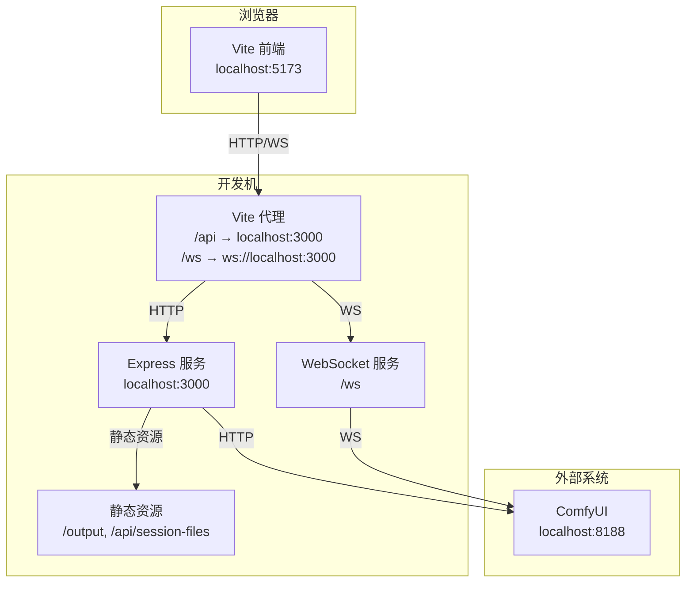
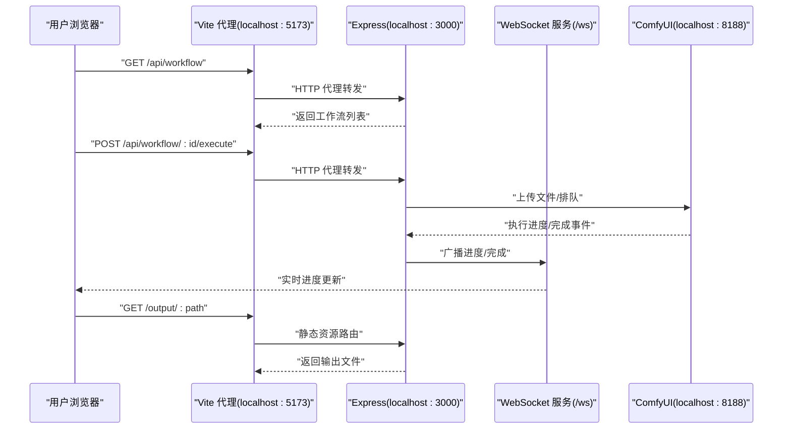
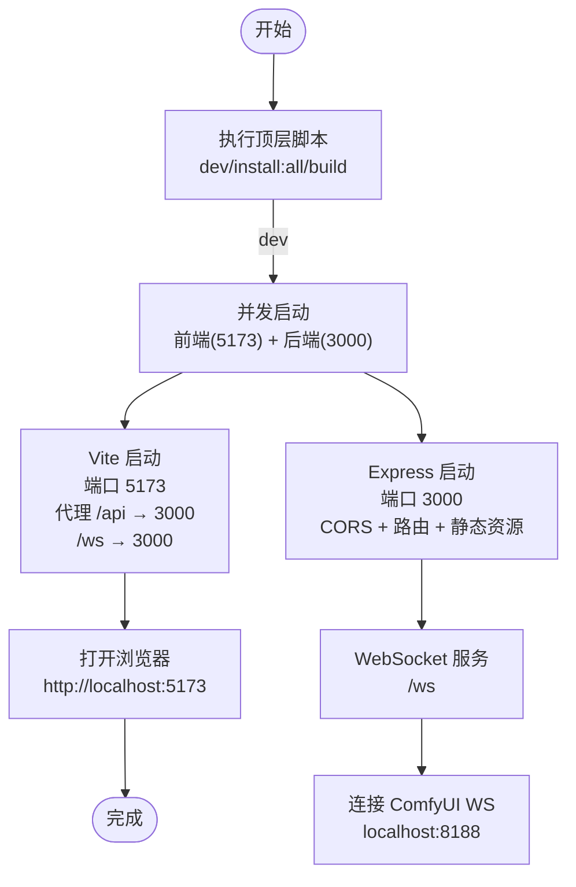
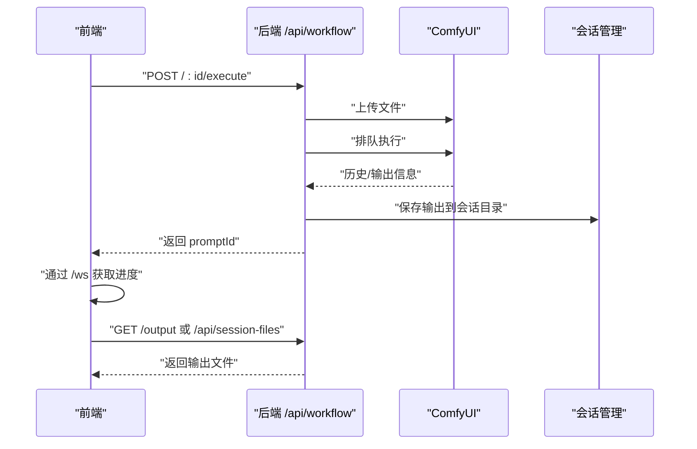
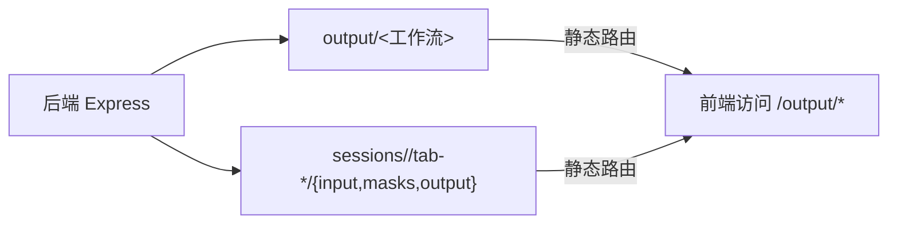
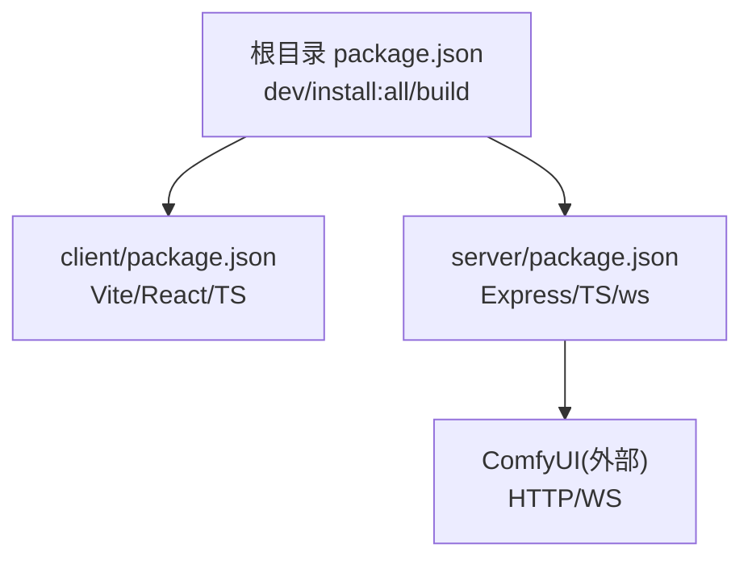

# 快速开始

<cite>
**本文引用的文件**
- [README.md](file://README.md)
- [package.json](file://package.json)
- [client/vite.config.ts](file://client/vite.config.ts)
- [client/package.json](file://client/package.json)
- [server/package.json](file://server/package.json)
- [server/src/index.ts](file://server/src/index.ts)
- [server/src/services/comfyui.ts](file://server/src/services/comfyui.ts)
- [server/src/routes/workflow.ts](file://server/src/routes/workflow.ts)
- [server/src/services/sessionManager.ts](file://server/src/services/sessionManager.ts)
- [start.bat](file://start.bat)
- [debug.bat](file://debug.bat)
- [stop.bat](file://stop.bat)
- [client/src/main.tsx](file://client/src/main.tsx)
- [client/src/components/App.tsx](file://client/src/components/App.tsx)
</cite>

## 目录
1. [简介](#简介)
2. [项目结构](#项目结构)
3. [核心组件](#核心组件)
4. [架构总览](#架构总览)
5. [详细组件分析](#详细组件分析)
6. [依赖分析](#依赖分析)
7. [性能考虑](#性能考虑)
8. [故障排除指南](#故障排除指南)
9. [结论](#结论)

## 简介
本指南面向新开发者，帮助你在本地快速搭建并运行 CorineKit Pix2Real 开发环境。你将学会：
- 环境要求与前置条件
- 安装与初始化命令
- 同时启动前端 Vite 与后端 Express 的开发流程
- 常见问题排查与解决方案

## 项目结构
该项目采用前后端分离架构：
- 前端：Vite + React + TypeScript，运行于本地 5173 端口
- 后端：Express + TypeScript，运行于本地 3000 端口
- 代理：Vite 代理将 /api 请求转发到后端，WebSocket /ws 也通过代理连接后端
- ComfyUI：作为图像/视频处理引擎，需本地运行于默认端口

图表来源
- [client/vite.config.ts:6-18](file://client/vite.config.ts#L6-L18)
- [server/src/index.ts:42-61](file://server/src/index.ts#L42-L61)
- [server/src/index.ts:63-219](file://server/src/index.ts#L63-L219)
- [server/src/services/comfyui.ts:6-7](file://server/src/services/comfyui.ts#L6-L7)

章节来源
- [README.md:41-62](file://README.md#L41-L62)
- [client/vite.config.ts:1-20](file://client/vite.config.ts#L1-L20)
- [server/src/index.ts:14-61](file://server/src/index.ts#L14-L61)

## 核心组件
- 前端 Vite 应用
  - 入口文件负责渲染根组件
  - 配置了本地开发服务器端口与代理规则
- 后端 Express 应用
  - 提供 REST API 与 WebSocket 服务
  - 统一输出目录与会话目录的静态访问
  - 与 ComfyUI 通过 HTTP/WS 协同工作
- ComfyUI 引擎
  - 本地运行，提供队列、历史、模型列表等能力
  - 后端通过上传文件、排队、拉取输出等方式驱动 ComfyUI

章节来源
- [client/src/main.tsx:1-11](file://client/src/main.tsx#L1-L11)
- [client/vite.config.ts:6-18](file://client/vite.config.ts#L6-L18)
- [server/src/index.ts:42-61](file://server/src/index.ts#L42-L61)
- [server/src/services/comfyui.ts:6-7](file://server/src/services/comfyui.ts#L6-L7)

## 架构总览
下图展示了从浏览器发起请求到 ComfyUI 执行再到回传输出的关键路径。

图表来源
- [client/vite.config.ts:6-18](file://client/vite.config.ts#L6-L18)
- [server/src/index.ts:54-61](file://server/src/index.ts#L54-L61)
- [server/src/services/comfyui.ts:47-60](file://server/src/services/comfyui.ts#L47-L60)
- [server/src/index.ts:73-219](file://server/src/index.ts#L73-L219)

## 详细组件分析

### 启动流程与开发服务器
- 顶层脚本
  - 使用并发工具同时启动前端与后端
- 前端
  - Vite 在 5173 端口启动，代理 /api 到后端 3000 端口，/ws 也走相同目标
- 后端
  - Express 在 3000 端口启动，启用 CORS 并挂载路由
  - 创建 WebSocket 服务，将浏览器客户端与 ComfyUI 的 WS 连接打通
  - 初始化输出目录与会话目录

图表来源
- [package.json:4-9](file://package.json#L4-L9)
- [client/vite.config.ts:6-18](file://client/vite.config.ts#L6-L18)
- [server/src/index.ts:42-61](file://server/src/index.ts#L42-L61)
- [server/src/index.ts:63-219](file://server/src/index.ts#L63-L219)

章节来源
- [package.json:4-9](file://package.json#L4-L9)
- [client/vite.config.ts:1-20](file://client/vite.config.ts#L1-L20)
- [server/src/index.ts:221-228](file://server/src/index.ts#L221-L228)

### API 工作流执行流程
- 前端通过 /api/workflow/:id/execute 提交任务
- 后端上传文件至 ComfyUI，排队执行
- WebSocket 实时推送进度，完成后下载输出并保存到会话目录
- 前端通过 /output 或 /api/session-files 访问输出

图表来源
- [server/src/routes/workflow.ts:408-455](file://server/src/routes/workflow.ts#L408-L455)
- [server/src/services/comfyui.ts:9-25](file://server/src/services/comfyui.ts#L9-L25)
- [server/src/services/comfyui.ts:47-60](file://server/src/services/comfyui.ts#L47-L60)
- [server/src/index.ts:112-164](file://server/src/index.ts#L112-L164)
- [server/src/services/sessionManager.ts:34-44](file://server/src/services/sessionManager.ts#L34-L44)

章节来源
- [server/src/routes/workflow.ts:408-455](file://server/src/routes/workflow.ts#L408-L455)
- [server/src/services/comfyui.ts:9-25](file://server/src/services/comfyui.ts#L9-L25)
- [server/src/services/comfyui.ts:47-60](file://server/src/services/comfyui.ts#L47-L60)
- [server/src/index.ts:112-164](file://server/src/index.ts#L112-L164)
- [server/src/services/sessionManager.ts:34-44](file://server/src/services/sessionManager.ts#L34-L44)

### 会话与输出目录
- 输出目录：固定在仓库根目录下的 output，按工作流分类
- 会话目录：固定在 sessions，每个会话包含 input/masks/output 三类子目录
- 后端提供静态路由访问 output 与会话文件

图表来源
- [server/src/index.ts:18-35](file://server/src/index.ts#L18-L35)
- [server/src/index.ts:58-61](file://server/src/index.ts#L58-L61)
- [server/src/services/sessionManager.ts:6](file://server/src/services/sessionManager.ts#L6)

章节来源
- [server/src/index.ts:18-35](file://server/src/index.ts#L18-L35)
- [server/src/index.ts:58-61](file://server/src/index.ts#L58-L61)
- [server/src/services/sessionManager.ts:6](file://server/src/services/sessionManager.ts#L6)

## 依赖分析
- 顶层脚本
  - 使用并发工具同时启动前端与后端
- 前端
  - Vite、React、TypeScript、插件生态
- 后端
  - Express、CORS、Multer、node-fetch、ws、tsx
- ComfyUI
  - 作为外部服务，通过 HTTP/WS 与后端交互

图表来源
- [package.json:4-9](file://package.json#L4-L9)
- [client/package.json:6-10](file://client/package.json#L6-L10)
- [server/package.json:6-10](file://server/package.json#L6-L10)
- [server/src/services/comfyui.ts:6-7](file://server/src/services/comfyui.ts#L6-L7)

章节来源
- [package.json:4-9](file://package.json#L4-L9)
- [client/package.json:6-23](file://client/package.json#L6-L23)
- [server/package.json:6-26](file://server/package.json#L6-L26)
- [server/src/services/comfyui.ts:6-7](file://server/src/services/comfyui.ts#L6-L7)

## 性能考虑
- 大文件上传
  - 后端对 JSON 请求体设置了较大上限，适合批量任务
- WebSocket 事件缓冲
  - 后端为每个 promptId 缓存最近的执行与进度事件，避免客户端错过首包
- 输出下载
  - 完成后端会将 ComfyUI 的输出写入会话目录，便于前端直接访问

章节来源
- [server/src/index.ts:51](file://server/src/index.ts#L51)
- [server/src/index.ts:84-90](file://server/src/index.ts#L84-L90)
- [server/src/index.ts:112-164](file://server/src/index.ts#L112-L164)

## 故障排除指南
- 端口占用
  - 启动前检查 3000 与 5173 是否被占用；脚本会尝试释放
  - 若仍失败，手动结束对应进程或更换端口
- ComfyUI 未运行
  - 后端默认连接本地 8188 端口；请先启动 ComfyUI
- CORS 错误
  - 后端仅允许来自前端地址的跨域请求；确认前端端口为 5173
- 代理不生效
  - 确认 Vite 代理配置正确，/api 指向 3000，/ws 指向 ws://localhost:3000
- 输出无法访问
  - 确认输出目录与会话目录存在；后端会在首次访问时创建
- 停止服务
  - 使用提供的批处理脚本停止相关进程

章节来源
- [start.bat:10-32](file://start.bat#L10-L32)
- [stop.bat:12-27](file://stop.bat#L12-L27)
- [server/src/index.ts:46-49](file://server/src/index.ts#L46-L49)
- [client/vite.config.ts:8-16](file://client/vite.config.ts#L8-L16)
- [server/src/index.ts:18-40](file://server/src/index.ts#L18-L40)

## 结论
按照本指南，你可以：
- 安装所有依赖并启动开发环境
- 理解前端与后端的协作方式以及与 ComfyUI 的集成
- 在遇到常见问题时快速定位与解决

祝你开发顺利！