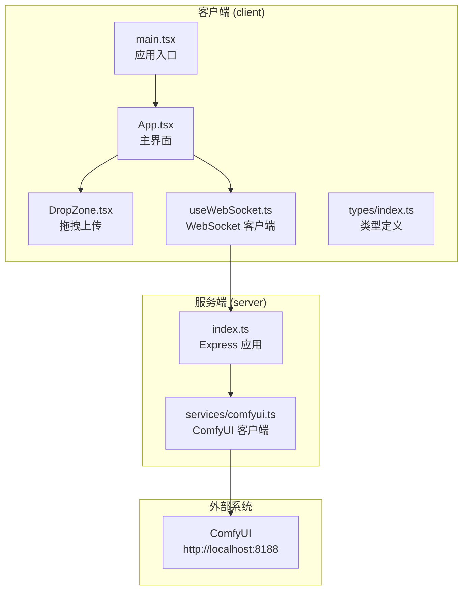
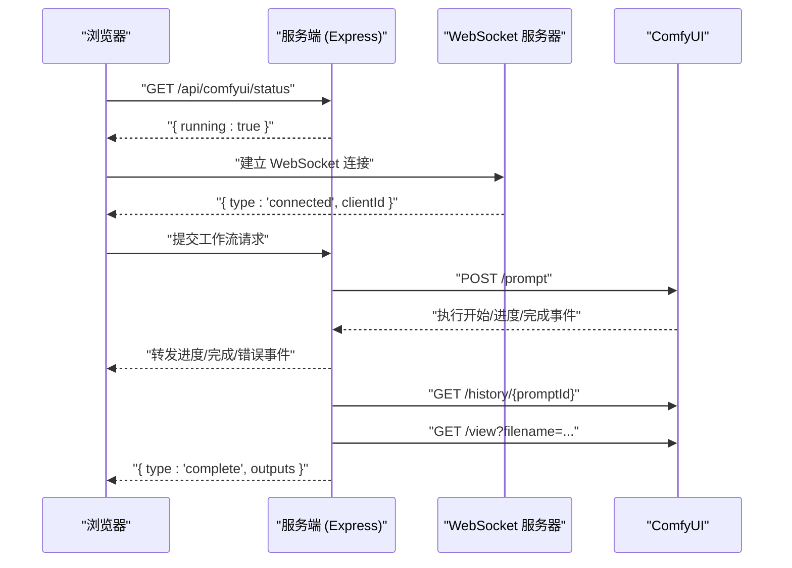
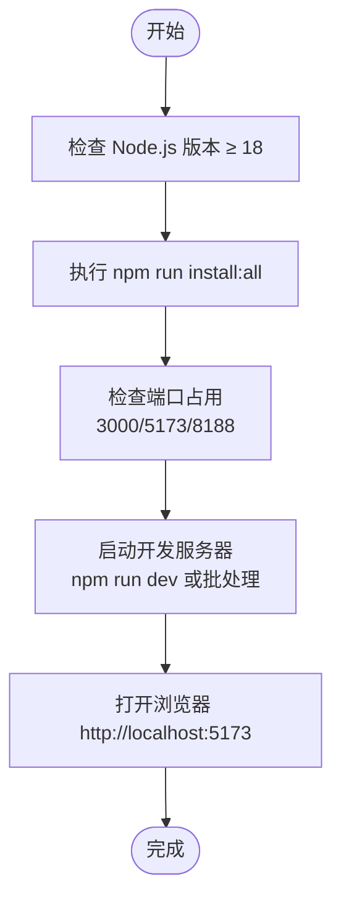
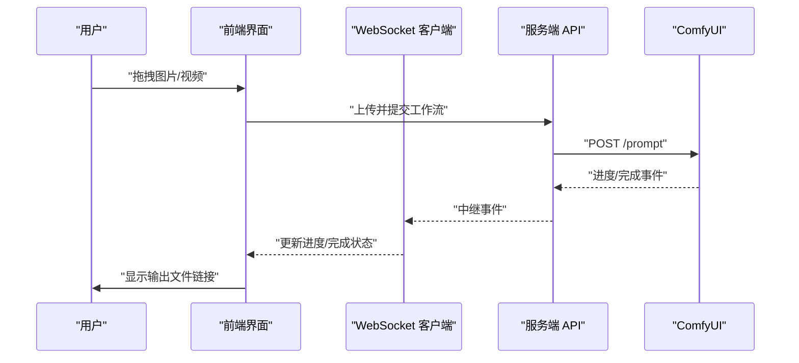
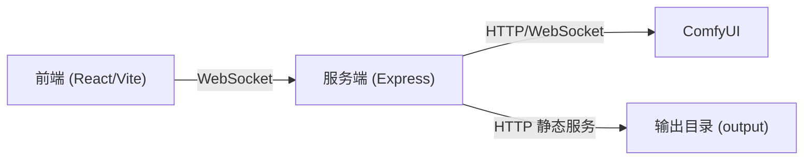

# 快速开始

<cite>
**本文引用的文件**
- [README.md](file://README.md)
- [package.json](file://package.json)
- [client/package.json](file://client/package.json)
- [server/package.json](file://server/package.json)
- [start.bat](file://start.bat)
- [debug.bat](file://debug.bat)
- [stop.bat](file://stop.bat)
- [server/src/index.ts](file://server/src/index.ts)
- [server/src/services/comfyui.ts](file://server/src/services/comfyui.ts)
- [client/src/main.tsx](file://client/src/main.tsx)
- [client/src/hooks/useWebSocket.ts](file://client/src/hooks/useWebSocket.ts)
- [client/src/types/index.ts](file://client/src/types/index.ts)
- [client/src/components/DropZone.tsx](file://client/src/components/DropZone.tsx)
- [client/src/components/App.tsx](file://client/src/components/App.tsx)
- [ComfyUI_API/0-Pix2Real-二次元转真人.json](file://ComfyUI_API/0-Pix2Real-二次元转真人.json)
</cite>

## 目录
1. [简介](#简介)
2. [项目结构](#项目结构)
3. [核心组件](#核心组件)
4. [架构总览](#架构总览)
5. [详细组件分析](#详细组件分析)
6. [依赖关系分析](#依赖关系分析)
7. [性能考虑](#性能考虑)
8. [故障排除指南](#故障排除指南)
9. [结论](#结论)
10. [附录](#附录)

## 简介
CorineKit Pix2Real 是一个基于本地 Web UI 的批量图像/视频处理工具，通过 ComfyUI 实现工作流编排。你只需将图像拖入界面，选择对应工作流，即可获得实时进度反馈，并一键打开输出目录。

- 支持功能：5 个工作流（二次元转真人、真人精修、精修放大、图生视频、视频放大）、批量处理、实时进度、每标签页隔离的图像列表、一键打开输出文件夹、VRAM 释放、深色/浅色主题。
- 前置条件：本地运行的 ComfyUI（默认地址 http://localhost:8188），Node.js 18+。
- 开发命令：统一安装脚本与开发服务器启动方式。

**章节来源**
- [README.md:1-79](file://README.md#L1-L79)

## 项目结构
项目采用前后端分离架构，客户端使用 Vite + React + TypeScript，服务端使用 Express + TypeScript，二者通过 WebSocket 实时通信，服务端负责与 ComfyUI 交互并转发进度事件。

**图表来源**
- [client/src/main.tsx:1-11](file://client/src/main.tsx#L1-L11)
- [client/src/components/App.tsx:1-200](file://client/src/components/App.tsx#L1-L200)
- [client/src/components/DropZone.tsx:1-181](file://client/src/components/DropZone.tsx#L1-L181)
- [client/src/hooks/useWebSocket.ts:1-278](file://client/src/hooks/useWebSocket.ts#L1-L278)
- [client/src/types/index.ts:1-76](file://client/src/types/index.ts#L1-L76)
- [server/src/index.ts:1-516](file://server/src/index.ts#L1-L516)
- [server/src/services/comfyui.ts:1-472](file://server/src/services/comfyui.ts#L1-L472)

**章节来源**
- [README.md:41-79](file://README.md#L41-L79)
- [package.json:1-15](file://package.json#L1-L15)
- [client/package.json:1-26](file://client/package.json#L1-L26)
- [server/package.json:1-28](file://server/package.json#L1-L28)

## 核心组件
- 客户端入口与路由：应用入口负责渲染根组件；主界面负责组织侧边栏、照片墙、状态栏等；拖拽区域负责接收文件并过滤类型；WebSocket 钩子负责连接后端并处理进度/完成/错误事件。
- 服务端应用：启动 Express 服务与 WebSocket 服务器，注册路由，连接 ComfyUI 并中继进度事件。
- ComfyUI 客户端：封装上传、排队、历史查询、进度中继、系统状态查询等接口。

**章节来源**
- [client/src/main.tsx:1-11](file://client/src/main.tsx#L1-L11)
- [client/src/components/App.tsx:1-200](file://client/src/components/App.tsx#L1-L200)
- [client/src/components/DropZone.tsx:1-181](file://client/src/components/DropZone.tsx#L1-L181)
- [client/src/hooks/useWebSocket.ts:1-278](file://client/src/hooks/useWebSocket.ts#L1-L278)
- [server/src/index.ts:1-516](file://server/src/index.ts#L1-L516)
- [server/src/services/comfyui.ts:1-472](file://server/src/services/comfyui.ts#L1-L472)

## 架构总览
整体流程：浏览器通过 WebSocket 连接服务端，服务端再连接 ComfyUI 的 WebSocket；当工作流执行时，ComfyUI 的进度事件被服务端中继到浏览器，同时服务端从 ComfyUI 下载输出并保存到本地会话目录。

**图表来源**
- [server/src/index.ts:147-155](file://server/src/index.ts#L147-L155)
- [server/src/index.ts:157-494](file://server/src/index.ts#L157-L494)
- [server/src/services/comfyui.ts:168-196](file://server/src/services/comfyui.ts#L168-L196)
- [server/src/services/comfyui.ts:198-207](file://server/src/services/comfyui.ts#L198-L207)
- [server/src/services/comfyui.ts:209-219](file://server/src/services/comfyui.ts#L209-L219)

## 详细组件分析

### 安装与开发环境搭建
- 系统前置条件
  - ComfyUI 运行于 http://localhost:8188
  - Node.js 版本要求：18+
- 统一安装
  - 使用统一脚本一次性安装前后端依赖
  - 前端：client 目录下安装依赖
  - 后端：server 目录下安装依赖
- 开发服务器启动
  - 方式一：npm run dev（并行启动前后端）
  - 方式二：双窗口分别进入 client/server 目录执行各自 dev 脚本
  - Windows 批处理：start.bat 与 debug.bat 提供一键启动与调试窗口

**图表来源**
- [README.md:16-33](file://README.md#L16-L33)
- [package.json:4-9](file://package.json#L4-L9)
- [start.bat:10-48](file://start.bat#L10-L48)
- [debug.bat:10-48](file://debug.bat#L10-L48)

**章节来源**
- [README.md:16-33](file://README.md#L16-L33)
- [package.json:4-9](file://package.json#L4-L9)
- [start.bat:1-57](file://start.bat#L1-L57)
- [debug.bat:1-57](file://debug.bat#L1-L57)

### 基本使用示例
- 拖拽图像文件
  - 在空白区域或侧边栏拖拽图片/视频，系统会自动过滤支持的类型
  - 不同工作流对输入类型有限制（例如视频补帧仅接受视频，图生视频仅接受图片）
- 选择工作流
  - 在侧边栏选择目标工作流（如“二次元转真人”、“真人精修”等）
- 执行处理任务
  - 点击开始按钮，任务进入队列并开始执行
  - 浏览器实时显示进度与当前阶段
- 查看输出结果
  - 点击“打开输出文件夹”按钮，直接定位到对应工作流的输出目录
  - 输出文件保存在本地 output 目录下对应工作流的子文件夹中

**图表来源**
- [client/src/components/DropZone.tsx:50-82](file://client/src/components/DropZone.tsx#L50-L82)
- [client/src/components/App.tsx:157-197](file://client/src/components/App.tsx#L157-L197)
- [client/src/hooks/useWebSocket.ts:45-159](file://client/src/hooks/useWebSocket.ts#L45-L159)
- [server/src/services/comfyui.ts:168-196](file://server/src/services/comfyui.ts#L168-L196)

**章节来源**
- [client/src/components/DropZone.tsx:1-181](file://client/src/components/DropZone.tsx#L1-L181)
- [client/src/components/App.tsx:138-197](file://client/src/components/App.tsx#L138-L197)
- [client/src/hooks/useWebSocket.ts:1-278](file://client/src/hooks/useWebSocket.ts#L1-L278)
- [server/src/services/comfyui.ts:1-472](file://server/src/services/comfyui.ts#L1-L472)

### 工作流模板与适配
- 工作流模板位于 ComfyUI_API 目录，每个 JSON 文件代表一个工作流
- 服务端通过适配器模式加载模板并动态替换节点参数（如图像路径、提示词、种子等）
- 项目内置多个工作流，覆盖动漫转写实、人物精修、放大、视频生成与放大等场景

**章节来源**
- [ComfyUI_API/0-Pix2Real-二次元转真人.json:1-200](file://ComfyUI_API/0-Pix2Real-二次元转真人.json#L1-L200)
- [README.md:64-72](file://README.md#L64-L72)

## 依赖关系分析
- 前端依赖
  - React 生态、Zustand 状态管理、Vite 构建工具、TypeScript 类型系统
- 后端依赖
  - Express Web 服务、ws WebSocket 服务器、node-fetch HTTP 客户端、Multer 文件上传、CORS 支持
- 关键依赖链
  - 客户端通过 WebSocket 与服务端通信
  - 服务端通过 HTTP/WebSocket 与 ComfyUI 通信
  - 服务端负责下载 ComfyUI 输出并保存到本地会话目录

**图表来源**
- [client/package.json:11-24](file://client/package.json#L11-L24)
- [server/package.json:11-26](file://server/package.json#L11-L26)
- [server/src/index.ts:134-145](file://server/src/index.ts#L134-L145)
- [server/src/services/comfyui.ts:6-7](file://server/src/services/comfyui.ts#L6-L7)

**章节来源**
- [client/package.json:1-26](file://client/package.json#L1-L26)
- [server/package.json:1-28](file://server/package.json#L1-L28)
- [server/src/index.ts:118-145](file://server/src/index.ts#L118-L145)
- [server/src/services/comfyui.ts:1-472](file://server/src/services/comfyui.ts#L1-L472)

## 性能考虑
- 进度权重化：服务端根据节点类型与采样步数计算权重，生成更准确的全局进度
- 多轮节点处理：对 tiled 采样器等多轮节点采用 tick 计数，避免进度回退
- 历史延迟补偿：等待 ComfyUI 历史写入完成后再发送完成事件，避免“完成但空”的异常情况
- 资源释放：提供 VRAM 释放与显存清理节点，减少显存压力

**章节来源**
- [server/src/index.ts:188-271](file://server/src/index.ts#L188-L271)
- [server/src/index.ts:335-448](file://server/src/index.ts#L335-L448)
- [server/src/services/comfyui.ts:58-144](file://server/src/services/comfyui.ts#L58-L144)

## 故障排除指南
- 无法连接 ComfyUI
  - 确认 ComfyUI 在 http://localhost:8188 正常运行
  - 服务端会在启动时尝试自动启动 ComfyUI，若失败请手动启动
- 端口冲突
  - 3000（服务端）、5173（前端）、8188（ComfyUI）可能被占用
  - 使用提供的批处理脚本释放占用进程或手动结束相关进程
- WebSocket 连接失败
  - 检查浏览器控制台是否有跨域或连接错误
  - 确保服务端 WebSocket 路径 /ws 可访问
- 进度显示异常
  - 多轮节点或多阶段工作流可能导致进度波动，属正常现象
  - 若出现“完成但空”，等待片刻后刷新页面，或检查 ComfyUI 输出目录
- Node.js 版本过低
  - 请升级至 Node.js 18+

**章节来源**
- [server/src/index.ts:499-515](file://server/src/index.ts#L499-L515)
- [start.bat:10-32](file://start.bat#L10-L32)
- [debug.bat:10-32](file://debug.bat#L10-L32)
- [stop.bat:12-36](file://stop.bat#L12-L36)
- [client/src/hooks/useWebSocket.ts:232-244](file://client/src/hooks/useWebSocket.ts#L232-L244)

## 结论
通过统一安装脚本与开发命令，结合批处理脚本的一键启动能力，你可以快速搭建并运行 CorineKit Pix2Real。配合工作流模板与实时进度反馈，即可高效完成批量图像/视频处理任务。遇到问题时，优先检查 ComfyUI 运行状态、端口占用与 Node.js 版本，通常可快速定位并解决。

## 附录

### 验证安装成功的方法
- 启动服务端与前端后，浏览器访问 http://localhost:5173
- 页面显示欢迎页与工作流列表，无报错
- 点击任意工作流并拖入测试图片，任务进入队列并显示进度
- 输出文件出现在对应工作流的 output 子目录中

**章节来源**
- [README.md:21-33](file://README.md#L21-L33)
- [start.bat:47-53](file://start.bat#L47-L53)
- [server/src/index.ts:147-155](file://server/src/index.ts#L147-L155)