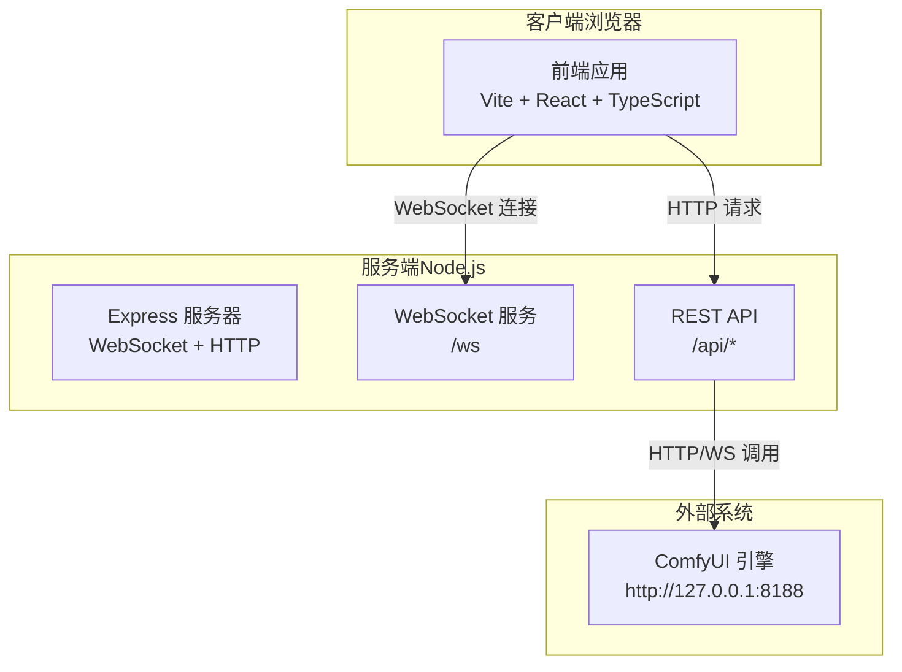
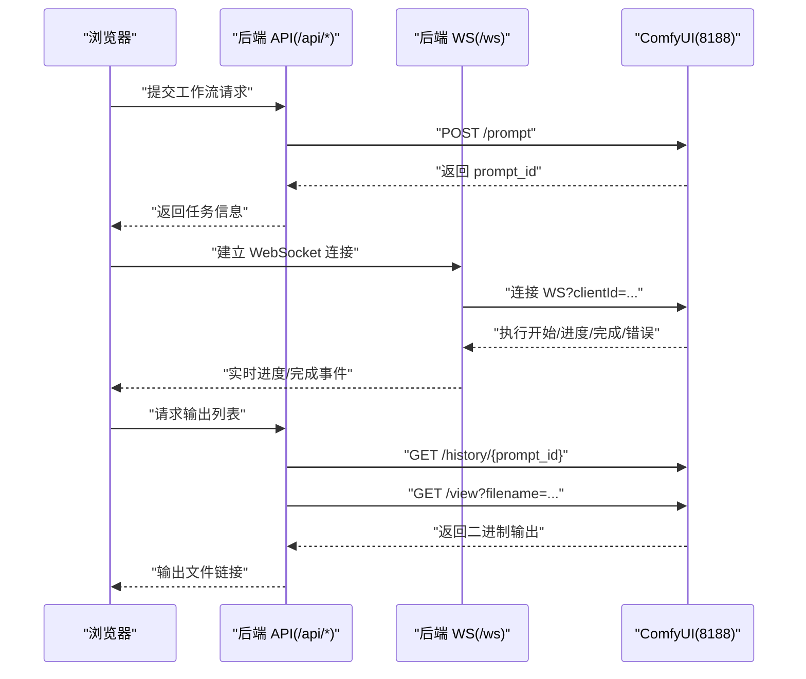
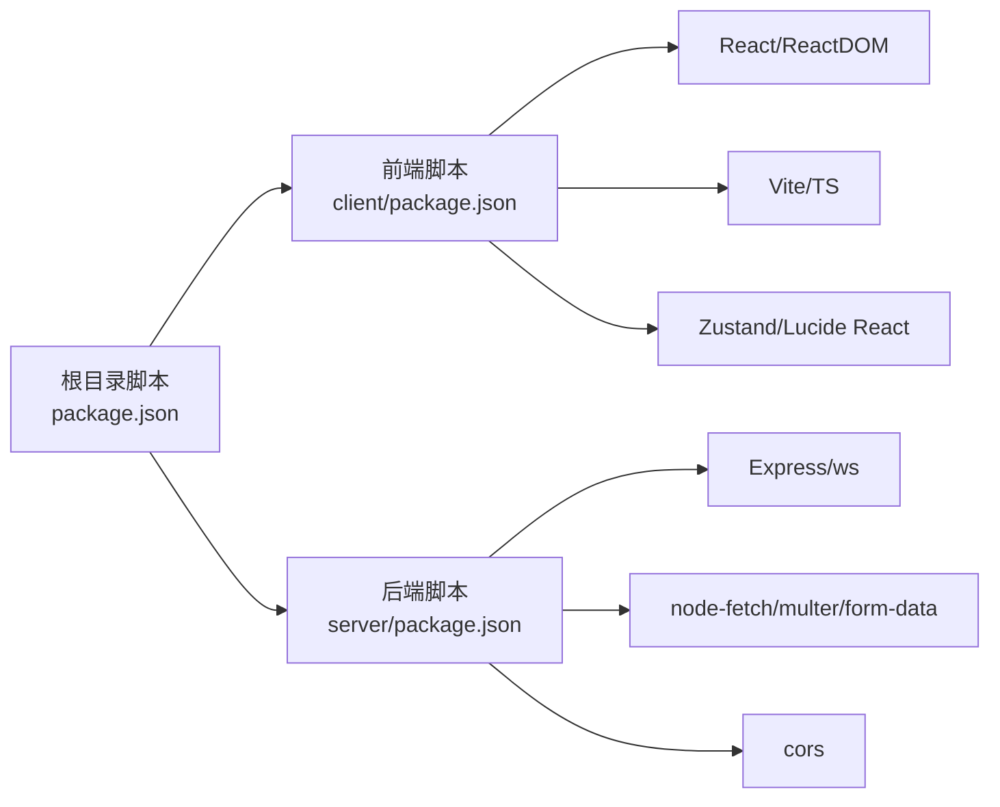

# 安装与环境问题

<cite>
**本文引用的文件**
- [README.md](file://README.md)
- [package.json](file://package.json)
- [client/package.json](file://client/package.json)
- [server/package.json](file://server/package.json)
- [start.bat](file://start.bat)
- [stop.bat](file://stop.bat)
- [debug.bat](file://debug.bat)
- [server/src/index.ts](file://server/src/index.ts)
- [server/src/services/comfyui.ts](file://server/src/services/comfyui.ts)
</cite>

## 目录
1. [简介](#简介)
2. [项目结构](#项目结构)
3. [核心组件](#核心组件)
4. [架构总览](#架构总览)
5. [详细组件分析](#详细组件分析)
6. [依赖关系分析](#依赖关系分析)
7. [性能考虑](#性能考虑)
8. [故障排除指南](#故障排除指南)
9. [结论](#结论)
10. [附录](#附录)

## 简介
本文件面向首次安装与运行 CorineKit Pix2Real 的用户，聚焦于安装与环境配置中的常见问题，尤其是 Node.js 版本要求、npm 依赖安装失败、Python 环境（ComfyUI）配置、以及前端/后端服务启动与端口占用等。文档提供可操作的诊断步骤、错误解读与解决方案，并补充 Windows 环境下的特殊注意事项（PowerShell 权限、防火墙、杀毒软件拦截等），帮助快速定位并解决问题。

## 项目结构
该项目采用前后端分离架构：前端为 Vite + React + TypeScript 应用；后端为 Express + TypeScript 应用；二者通过本地 WebSocket 和 HTTP 接口协同工作；ComfyUI 作为图像/视频处理引擎运行在本地 8188 端口。

图表来源
- [server/src/index.ts:42-63](file://server/src/index.ts#L42-L63)
- [server/src/services/comfyui.ts:6-7](file://server/src/services/comfyui.ts#L6-L7)

章节来源
- [README.md:41-62](file://README.md#L41-L62)
- [package.json:4-9](file://package.json#L4-L9)

## 核心组件
- 前端（client）
  - 使用 Vite 构建与热更新，开发时监听 5173 端口，生产构建产物输出至 dist。
  - 依赖 React、TypeScript、Vite 等。
- 后端（server）
  - 使用 Express 提供 REST API，WebSocket 提供进度推送。
  - 默认监听 3000 端口，静态资源指向 output 与 sessions 目录。
  - 通过 HTTP/WS 与 ComfyUI 通信，负责队列、历史、输出下载与会话管理。
- ComfyUI
  - 本地运行于 8188 端口，提供上传、排队、历史查询、视图预览等接口。
  - 项目要求 ComfyUI 在本地 8188 可访问。

章节来源
- [client/package.json:6-10](file://client/package.json#L6-L10)
- [server/package.json:6-10](file://server/package.json#L6-L10)
- [server/src/index.ts:221-227](file://server/src/index.ts#L221-L227)
- [server/src/services/comfyui.ts:6-7](file://server/src/services/comfyui.ts#L6-L7)
- [README.md:16-19](file://README.md#L16-L19)

## 架构总览
下图展示从浏览器到 ComfyUI 的完整调用链路，包括 WebSocket 进度事件与 HTTP 输出下载流程。

图表来源
- [server/src/index.ts:93-189](file://server/src/index.ts#L93-L189)
- [server/src/services/comfyui.ts:47-71](file://server/src/services/comfyui.ts#L47-L71)
- [server/src/services/comfyui.ts:127-188](file://server/src/services/comfyui.ts#L127-L188)

## 详细组件分析

### 端口与进程管理（Windows 批处理）
- 端口占用检测与释放
  - 自动检测 3000（后端）、5173（前端）端口是否被占用，若占用则尝试终止对应进程。
- 启动顺序
  - 先启动后端（server），再启动前端（client），最后打开浏览器。
- 调试模式
  - 以“保留窗口”的方式启动后端与前端，便于查看日志。

章节来源
- [start.bat:10-32](file://start.bat#L10-L32)
- [start.bat:35-48](file://start.bat#L35-L48)
- [debug.bat:10-32](file://debug.bat#L10-L32)
- [debug.bat:35-48](file://debug.bat#L35-L48)
- [stop.bat:12-27](file://stop.bat#L12-L27)

### 后端服务（Express + WebSocket）
- CORS 配置
  - 仅允许来自 http://localhost:5173 或 http://127.0.0.1:5173 的跨域请求。
- 静态资源
  - 对外暴露 output 与 sessions 目录，便于直接访问生成结果与会话数据。
- WebSocket 事件
  - 将 ComfyUI 的进度、执行开始、完成、错误事件转发给前端。
  - 支持事件缓冲与重放，避免客户端注册过晚导致丢失事件。

章节来源
- [server/src/index.ts:45-50](file://server/src/index.ts#L45-L50)
- [server/src/index.ts:58-61](file://server/src/index.ts#L58-L61)
- [server/src/index.ts:73-219](file://server/src/index.ts#L73-L219)

### ComfyUI 通信模块
- 本地地址常量
  - 默认使用 http://127.0.0.1:8188 访问 ComfyUI。
- 关键接口
  - 上传图片/视频、入队、取历史、取输出、系统统计、队列优先级调整等。
- WebSocket 事件解析
  - 解析 progress/executing/execution_success/execution_error 等消息类型，过滤非 JSON 与二进制帧。

章节来源
- [server/src/services/comfyui.ts:6-7](file://server/src/services/comfyui.ts#L6-L7)
- [server/src/services/comfyui.ts:47-71](file://server/src/services/comfyui.ts#L47-L71)
- [server/src/services/comfyui.ts:127-188](file://server/src/services/comfyui.ts#L127-L188)

## 依赖关系分析
- 顶层脚本
  - 提供统一的开发、构建、安装入口，分别进入 client/server 子目录执行对应命令。
- 前端依赖
  - React、TypeScript、Vite、React-DOM、Zustand、Lucide React 等。
- 后端依赖
  - Express、ws、node-fetch、multer、form-data、cors 等。

图表来源
- [package.json:4-9](file://package.json#L4-L9)
- [client/package.json:11-23](file://client/package.json#L11-L23)
- [server/package.json:11-17](file://server/package.json#L11-L17)

章节来源
- [package.json:4-9](file://package.json#L4-L9)
- [client/package.json:11-23](file://client/package.json#L11-L23)
- [server/package.json:11-17](file://server/package.json#L11-L17)

## 性能考虑
- 大体积输出
  - 后端对 JSON 体大小限制为 50MB，避免异常请求导致内存压力。
- 输出下载
  - 通过 /view 接口拉取二进制输出，建议在前端按需加载，避免一次性渲染过多大图。
- WebSocket 事件缓冲
  - 防止客户端注册过晚导致进度丢失，但需注意内存占用，建议在长时间批量任务中关注事件缓冲上限。

章节来源
- [server/src/index.ts:51](file://server/src/index.ts#L51)
- [server/src/index.ts:83-90](file://server/src/index.ts#L83-L90)

## 故障排除指南

### 一、Node.js 版本兼容性问题（重点：Node.js 18+）
- 症状
  - 安装或运行时报错，提示版本过低或语法不支持。
- 原因
  - 项目明确要求 Node.js 18+；部分依赖（如 Vite 6、TypeScript 5.7、ws 等）对较新特性有依赖。
- 解决方案
  - 升级到 Node.js 18 或更高版本（推荐 LTS）。
  - 清理缓存后重新安装依赖：删除 node_modules 与 lock 文件，重新执行安装。
- 验证方法
  - 在终端执行 node -v，确认版本满足要求。

章节来源
- [README.md:18-19](file://README.md#L18-L19)
- [client/package.json:21-22](file://client/package.json#L21-L22)
- [server/package.json:24-25](file://server/package.json#L24-L25)

### 二、npm 依赖安装失败
- 常见原因
  - 网络不稳定、npm 缓存损坏、权限不足、Node 版本不匹配。
- 诊断步骤
  - 切换到 client/server 目录，单独执行 npm install，观察具体报错。
  - 清理缓存：npm cache clean --force；删除 node_modules 与 package-lock.json 后重试。
  - 使用稳定网络或更换镜像源（如 cnpm/淘宝镜像）。
- Windows 特别注意
  - 以管理员身份运行终端，确保对用户目录写权限。
  - 若使用 WSL，确保路径映射正确且权限正常。
- 相关脚本
  - 顶层脚本提供了统一安装入口，可先在根目录执行安装后再逐子目录验证。

章节来源
- [package.json:9](file://package.json#L9)
- [client/package.json:6-10](file://client/package.json#L6-L10)
- [server/package.json:6-10](file://server/package.json#L6-L10)

### 三、Python 环境配置问题（ComfyUI）
- 症状
  - 启动后端或前端时报 127.0.0.1:8188 连接失败、超时或拒绝连接。
- 原因
  - ComfyUI 未安装、未启动、或 Python 环境未正确配置。
- 解决方案
  - 按官方说明安装并启动 ComfyUI，确保其监听在 127.0.0.1:8188。
  - 在项目同机环境下，确认防火墙/安全软件未拦截该端口。
  - 如使用虚拟环境，请在启动 ComfyUI 前激活对应环境。
- 验证方法
  - 在浏览器访问 http://127.0.0.1:8188，应看到 ComfyUI 页面。
  - 后端日志中若出现连接错误，通常来自此处。

章节来源
- [README.md:18-19](file://README.md#L18-L19)
- [server/src/services/comfyui.ts:6-7](file://server/src/services/comfyui.ts#L6-L7)

### 四、端口占用（8188、3000、5173）
- 症状
  - 启动后端/前端失败，提示端口已被占用。
- 诊断与解决
  - 使用批处理脚本自动检测并释放端口：start.bat、debug.bat 会在启动前扫描 3000/5173 并尝试终止占用进程。
  - 若仍失败，手动查找并结束对应 PID 的进程。
  - 注意：ComfyUI 默认也使用 8188，若被占用请先释放。
- Windows 特别注意
  - 防火墙/杀软可能阻止端口监听，临时关闭或添加白名单后重试。
  - PowerShell 执行策略可能影响脚本运行，必要时以管理员身份运行并调整执行策略。

章节来源
- [start.bat:10-32](file://start.bat#L10-L32)
- [debug.bat:10-32](file://debug.bat#L10-L32)
- [server/src/index.ts:221-227](file://server/src/index.ts#L221-L227)

### 五、权限不足与路径问题（Windows）
- 症状
  - 创建/写入 output/sessions 目录失败，或无法访问生成文件。
- 原因
  - 当前用户对项目目录无写权限，或路径包含特殊字符。
- 解决方案
  - 将项目克隆到用户目录（如 Desktop），以当前用户拥有者运行。
  - 确保路径不含空格或特殊字符，避免命令行参数解析问题。
  - 以管理员身份运行终端，确保对输出目录的读写权限。

章节来源
- [server/src/index.ts:17-40](file://server/src/index.ts#L17-L40)

### 六、ComfyUI 服务启动问题
- 症状
  - 后端 WebSocket 连接失败、无进度事件、或队列接口返回错误。
- 诊断
  - 确认 ComfyUI 已完全启动并监听 8188。
  - 查看后端日志中的 HTTP/WS 错误信息，定位是上传失败还是历史查询失败。
- 解决
  - 重启 ComfyUI；检查模型/扩展是否齐全；确认网络回环地址可达。

章节来源
- [server/src/services/comfyui.ts:47-71](file://server/src/services/comfyui.ts#L47-L71)
- [server/src/services/comfyui.ts:127-188](file://server/src/services/comfyui.ts#L127-L188)

### 七、浏览器跨域与端口不一致
- 症状
  - 前端开发时 5173 访问 3000 出现跨域错误。
- 原因
  - 后端仅允许特定来源（localhost:5173/127.0.0.1:5173）。
- 解决
  - 使用默认开发端口组合（5173 访问 3000），避免跨域问题。
  - 如需自定义，请同步修改后端 CORS 白名单。

章节来源
- [server/src/index.ts:45-49](file://server/src/index.ts#L45-L49)

### 八、Windows 环境特殊注意事项
- PowerShell 权限
  - 以管理员身份运行 PowerShell，避免脚本执行受限。
- 防火墙与杀软
  - 临时关闭或添加白名单，允许 3000、5173、8188 通过。
- 杀毒软件拦截
  - 某些安全软件会拦截新进程或端口，将其加入信任列表。
- 字符集与编码
  - 批处理脚本已设置 UTF-8，避免中文显示乱码。

章节来源
- [start.bat:1-57](file://start.bat#L1-L57)
- [debug.bat:1-57](file://debug.bat#L1-L57)
- [stop.bat:1-37](file://stop.bat#L1-L37)

## 结论
安装与运行 CorineKit Pix2Real 的关键在于：满足 Node.js 18+ 要求、正确安装前后端依赖、确保 ComfyUI 在 8188 正常运行、释放端口占用并授予足够权限。按照本文提供的分步诊断与修复建议，大多数安装问题均可快速解决。若仍遇困难，建议结合各组件日志进行交叉排查。

## 附录

### 环境检查清单（安装后验证）
- Node.js 版本
  - 执行 node -v，确认为 18+。
- 依赖安装
  - 在 client/server 目录分别执行 npm install，无报错。
- ComfyUI
  - 浏览器访问 http://127.0.0.1:8188，页面可用。
- 端口状态
  - 3000、5173、8188 均未被占用，或已被脚本释放。
- 权限与输出目录
  - output 与 sessions 目录存在且可写。
- 开发启动
  - 执行 npm run dev，前端在 http://localhost:5173 可用，后端日志无连接错误。

章节来源
- [README.md:18-19](file://README.md#L18-L19)
- [package.json:4-9](file://package.json#L4-L9)
- [server/src/index.ts:17-40](file://server/src/index.ts#L17-L40)