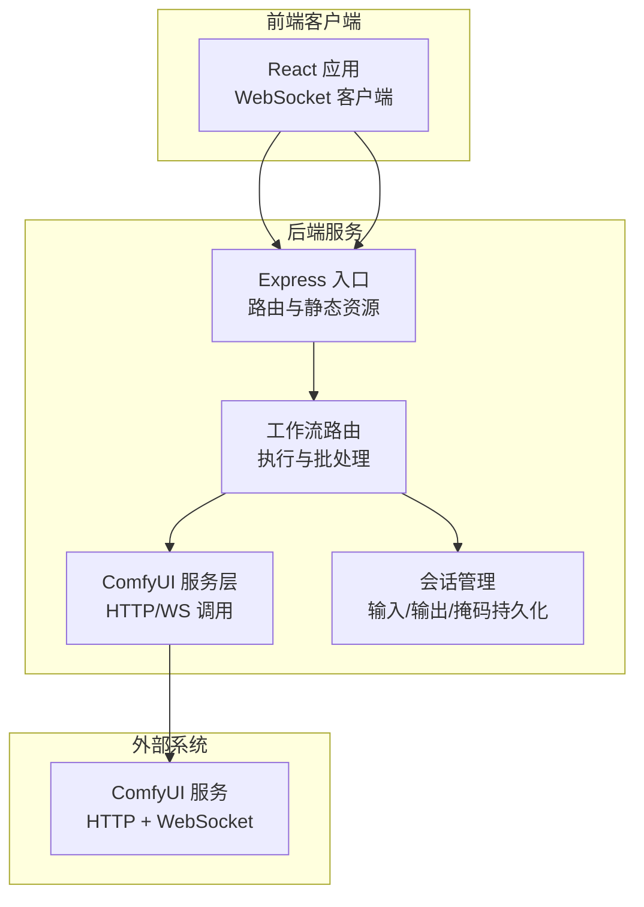
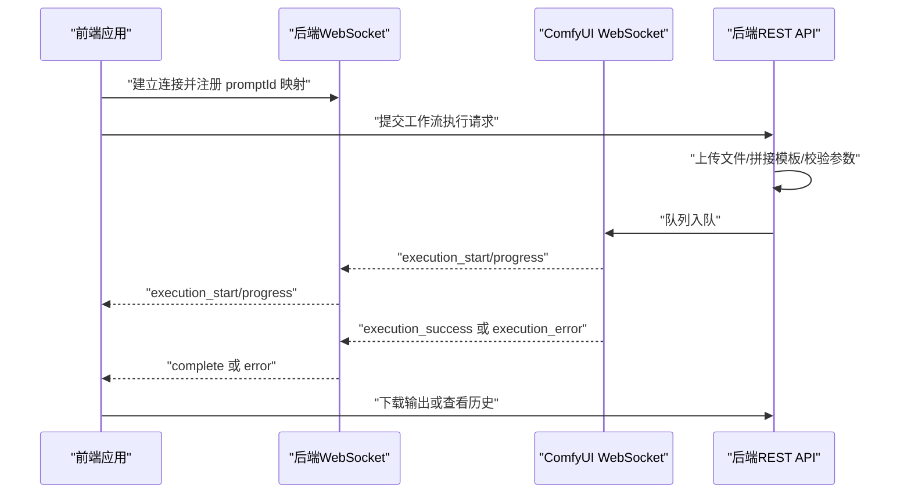
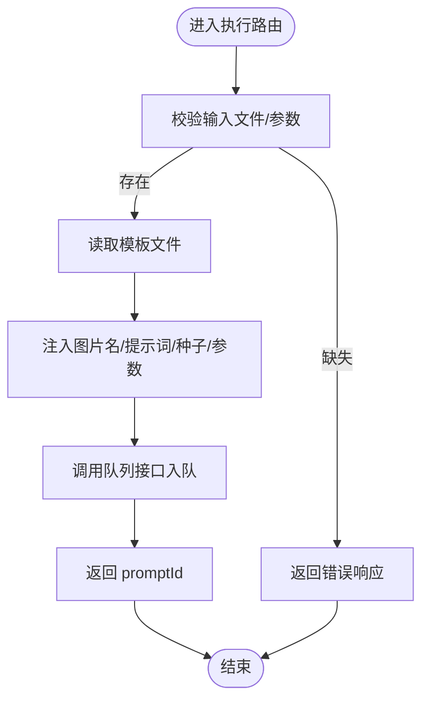
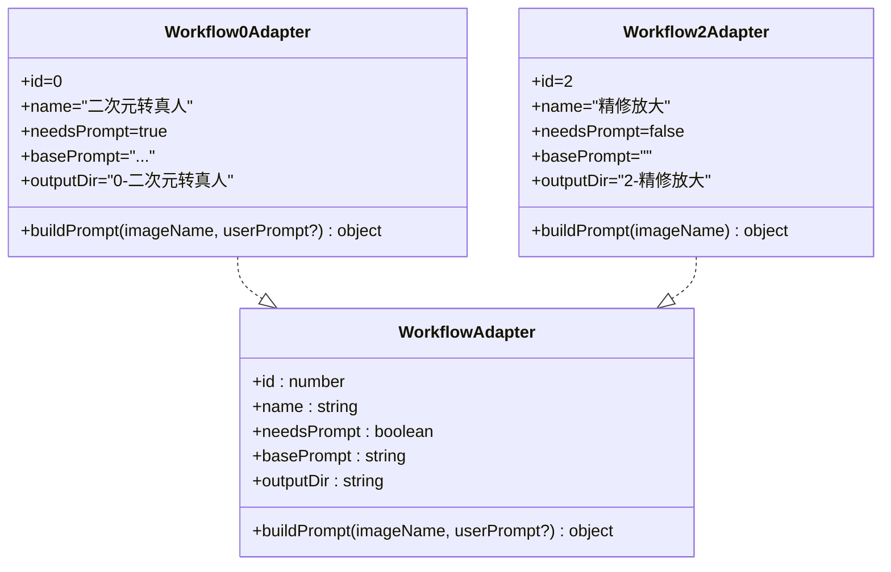
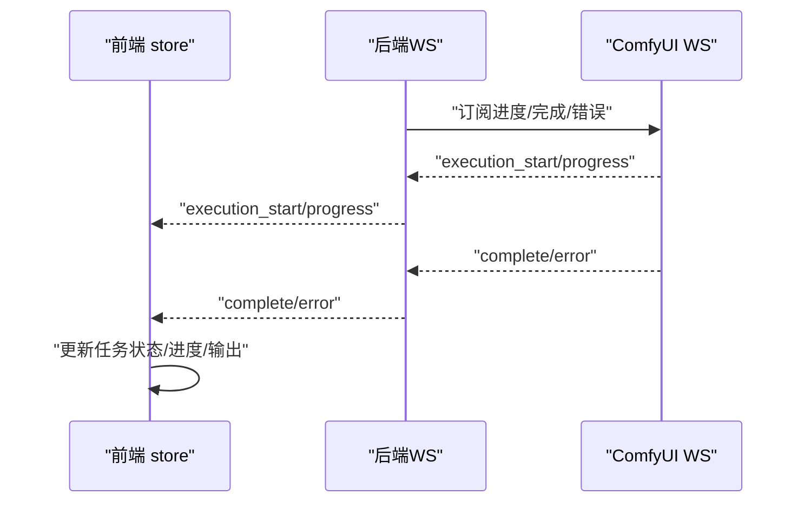
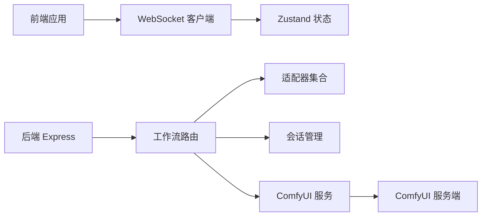

# 工作流处理问题

<cite>
**本文引用的文件**
- [README.md](file://README.md)
- [server/src/index.ts](file://server/src/index.ts)
- [server/src/services/comfyui.ts](file://server/src/services/comfyui.ts)
- [server/src/routes/workflow.ts](file://server/src/routes/workflow.ts)
- [server/src/adapters/index.ts](file://server/src/adapters/index.ts)
- [server/src/adapters/Workflow0Adapter.ts](file://server/src/adapters/Workflow0Adapter.ts)
- [server/src/adapters/Workflow2Adapter.ts](file://server/src/adapters/Workflow2Adapter.ts)
- [server/src/services/sessionManager.ts](file://server/src/services/sessionManager.ts)
- [client/src/hooks/useWebSocket.ts](file://client/src/hooks/useWebSocket.ts)
- [client/src/hooks/useWorkflowStore.ts](file://client/src/hooks/useWorkflowStore.ts)
- [client/src/types/index.ts](file://client/src/types/index.ts)
- [server/package.json](file://server/package.json)
- [client/package.json](file://client/package.json)
- [package.json](file://package.json)
</cite>

## 目录
1. [简介](#简介)
2. [项目结构](#项目结构)
3. [核心组件](#核心组件)
4. [架构总览](#架构总览)
5. [详细组件分析](#详细组件分析)
6. [依赖关系分析](#依赖关系分析)
7. [性能考量](#性能考量)
8. [故障排查指南](#故障排查指南)
9. [结论](#结论)
10. [附录](#附录)

## 简介
本文件面向在本地使用 ComfyUI 的批量图像/视频处理工作流，聚焦于工作流执行过程中的问题诊断与解决。内容覆盖：
- 工作流模板加载失败、参数配置错误、节点连接异常的排查步骤
- 不同类型工作流（图像处理、视频处理、专业功能）的常见执行错误与处理
- 执行中断、任务卡死、输出文件损坏等异常的应对策略
- 错误日志分析方法、调试模式启用、临时文件清理等技术手段
- 针对特定工作流的优化建议与最佳实践

## 项目结构
该工程采用前后端分离架构：前端为 React + TypeScript，后端为 Express + TypeScript；通过 WebSocket 实时转发 ComfyUI 的进度事件；后端负责上传文件、拼接工作流模板、调用 ComfyUI 接口，并将输出保存到会话目录。

**图表来源**
- [server/src/index.ts:42-61](file://server/src/index.ts#L42-L61)
- [server/src/routes/workflow.ts:22-38](file://server/src/routes/workflow.ts#L22-L38)
- [server/src/services/comfyui.ts:47-60](file://server/src/services/comfyui.ts#L47-L60)
- [server/src/services/sessionManager.ts:34-44](file://server/src/services/sessionManager.ts#L34-L44)

**章节来源**
- [README.md:41-79](file://README.md#L41-L79)
- [server/src/index.ts:42-61](file://server/src/index.ts#L42-L61)

## 核心组件
- 后端入口与 WebSocket 中继：负责启动 HTTP 服务器、静态资源托管、WebSocket 连接与事件中继。
- 工作流路由：根据工作流 ID 加载模板、注入输入（图片/视频/参数）、调用队列接口、回传输出下载链接。
- 适配器模式：每个工作流一个适配器，统一构建 prompt JSON，仅修改必要节点。
- 会话管理：将每张图片的输入、输出、掩码按会话与标签页隔离存储。
- 前端 WebSocket 客户端与状态管理：单例连接、接收进度/完成/错误事件、更新 UI。

**章节来源**
- [server/src/index.ts:73-219](file://server/src/index.ts#L73-L219)
- [server/src/routes/workflow.ts:407-455](file://server/src/routes/workflow.ts#L407-L455)
- [server/src/adapters/index.ts:13-28](file://server/src/adapters/index.ts#L13-L28)
- [server/src/services/sessionManager.ts:10-57](file://server/src/services/sessionManager.ts#L10-L57)
- [client/src/hooks/useWebSocket.ts:10-73](file://client/src/hooks/useWebSocket.ts#L10-L73)
- [client/src/hooks/useWorkflowStore.ts:35-88](file://client/src/hooks/useWorkflowStore.ts#L35-L88)

## 架构总览
后端通过 WebSocket 与 ComfyUI 建立连接，实时转发进度、完成与错误事件；同时提供 REST API 执行工作流、查询队列、释放显存等能力。前端通过单例 WebSocket 获取进度并更新状态。

**图表来源**
- [server/src/index.ts:92-189](file://server/src/index.ts#L92-L189)
- [server/src/services/comfyui.ts:127-188](file://server/src/services/comfyui.ts#L127-L188)
- [server/src/routes/workflow.ts:407-455](file://server/src/routes/workflow.ts#L407-L455)

## 详细组件分析

### 组件A：工作流路由与模板加载
- 路由职责：提供工作流列表、执行单图/批处理、取消队列、释放显存、打开输出目录、导出混合结果、反向提示词、提示词助理等接口。
- 模板加载：从 ComfyUI_API 目录读取 JSON 模板，按需修改节点（如图片名、提示词、种子、采样器参数等）。
- 参数校验：对必需字段（如 clientId、文件、模型名称）进行检查，错误时返回 4xx/5xx。
- 输出下载：完成后从 ComfyUI 下载输出并保存到会话目录，返回可访问 URL。

**图表来源**
- [server/src/routes/workflow.ts:407-455](file://server/src/routes/workflow.ts#L407-L455)
- [server/src/routes/workflow.ts:457-520](file://server/src/routes/workflow.ts#L457-L520)
- [server/src/routes/workflow.ts:542-559](file://server/src/routes/workflow.ts#L542-L559)

**章节来源**
- [server/src/routes/workflow.ts:29-38](file://server/src/routes/workflow.ts#L29-L38)
- [server/src/routes/workflow.ts:407-520](file://server/src/routes/workflow.ts#L407-L520)
- [server/src/routes/workflow.ts:542-559](file://server/src/routes/workflow.ts#L542-L559)

### 组件B：适配器与模板补丁
- 适配器接口：统一的 buildPrompt 方法，负责读取模板、设置输入节点、随机种子等。
- 典型场景：
  - 工作流0（二次元转真人）：合并基础提示词与用户提示词，注入图片名与随机种子。
  - 工作流2（精修放大）：设置输入图片与随机种子，无用户提示词需求。
- 优点：模板集中管理，仅变更必要节点，降低耦合。

**图表来源**
- [server/src/adapters/Workflow0Adapter.ts:9-34](file://server/src/adapters/Workflow0Adapter.ts#L9-L34)
- [server/src/adapters/Workflow2Adapter.ts:9-27](file://server/src/adapters/Workflow2Adapter.ts#L9-L27)
- [server/src/types/index.ts:1-8](file://server/src/types/index.ts#L1-L8)

**章节来源**
- [server/src/adapters/Workflow0Adapter.ts:16-33](file://server/src/adapters/Workflow0Adapter.ts#L16-L33)
- [server/src/adapters/Workflow2Adapter.ts:16-26](file://server/src/adapters/Workflow2Adapter.ts#L16-L26)

### 组件C：WebSocket 事件中继与前端状态
- 后端 WebSocket：连接 ComfyUI，缓冲并重放 execution_start/progress，完成时下载输出并清理映射。
- 前端 WebSocket：单例连接，解析消息类型，更新 store 中的任务状态、进度与输出。
- 事件类型：connected、execution_start、progress、complete、error。

**图表来源**
- [client/src/hooks/useWebSocket.ts:26-51](file://client/src/hooks/useWebSocket.ts#L26-L51)
- [client/src/hooks/useWorkflowStore.ts:398-499](file://client/src/hooks/useWorkflowStore.ts#L398-L499)
- [server/src/index.ts:92-189](file://server/src/index.ts#L92-L189)

**章节来源**
- [client/src/hooks/useWebSocket.ts:10-73](file://client/src/hooks/useWebSocket.ts#L10-L73)
- [client/src/hooks/useWorkflowStore.ts:35-88](file://client/src/hooks/useWorkflowStore.ts#L35-L88)
- [server/src/index.ts:73-219](file://server/src/index.ts#L73-L219)

## 依赖关系分析
- 后端依赖：Express、ws、node-fetch、multer、form-data。
- 前端依赖：React、Zustand、lucide-react。
- 关键耦合点：路由依赖适配器与 ComfyUI 服务；WebSocket 事件依赖 ComfyUI 的消息协议；会话管理依赖文件系统。

**图表来源**
- [server/src/routes/workflow.ts:7-10](file://server/src/routes/workflow.ts#L7-L10)
- [server/src/adapters/index.ts:13-28](file://server/src/adapters/index.ts#L13-L28)
- [server/src/services/comfyui.ts:47-60](file://server/src/services/comfyui.ts#L47-L60)
- [server/src/services/sessionManager.ts:34-44](file://server/src/services/sessionManager.ts#L34-L44)

**章节来源**
- [server/package.json:11-17](file://server/package.json#L11-L17)
- [client/package.json:11-15](file://client/package.json#L11-L15)
- [package.json:4-9](file://package.json#L4-L9)

## 性能考量
- 大文件上传：后端使用内存存储，注意限制并发与文件大小，避免 OOM。
- 批处理：路由支持最多 50 张图片，建议分批提交以控制队列压力。
- 队列优先级：提供将指定任务置顶的接口，适合紧急任务。
- 显存/内存：提供释放显存的工作流，配合系统统计接口监控资源使用。

**章节来源**
- [server/src/routes/workflow.ts:23-27](file://server/src/routes/workflow.ts#L23-L27)
- [server/src/routes/workflow.ts:457-520](file://server/src/routes/workflow.ts#L457-L520)
- [server/src/routes/workflow.ts:571-579](file://server/src/routes/workflow.ts#L571-L579)
- [server/src/routes/workflow.ts:542-559](file://server/src/routes/workflow.ts#L542-L559)
- [server/src/routes/workflow.ts:532-540](file://server/src/routes/workflow.ts#L532-L540)

## 故障排查指南

### 一、工作流模板加载失败
- 症状：执行时报错“未知工作流”或模板读取失败。
- 排查要点：
  - 确认工作流 ID 在适配器集合中存在。
  - 确认 ComfyUI_API 目录下对应 JSON 文件存在且可读。
  - 检查模板节点 ID 是否与代码中使用的 ID 一致。
- 处理建议：
  - 重新安装或恢复模板文件。
  - 更新适配器中的模板路径与节点 ID。
  - 使用最小化模板验证基本连通性。

**章节来源**
- [server/src/adapters/index.ts:13-28](file://server/src/adapters/index.ts#L13-L28)
- [server/src/routes/workflow.ts:407-455](file://server/src/routes/workflow.ts#L407-L455)

### 二、参数配置错误
- 症状：提示词为空、模型名称不匹配、尺寸/步数/CFG 等参数越界。
- 排查要点：
  - 文本到图像类工作流需提供模型、尺寸、采样器、调度器等参数。
  - 反向提示词与提示词助理需要正确的模板与保存路径。
- 处理建议：
  - 通过模型列表接口确认可用模型名称。
  - 对齐模板中的节点 ID 与实际 JSON 结构。
  - 使用默认值兜底，逐步调整参数。

**章节来源**
- [server/src/routes/workflow.ts:94-149](file://server/src/routes/workflow.ts#L94-L149)
- [server/src/routes/workflow.ts:181-261](file://server/src/routes/workflow.ts#L181-L261)
- [server/src/routes/workflow.ts:674-744](file://server/src/routes/workflow.ts#L674-L744)

### 三、节点连接异常
- 症状：执行报错“execution_error”，或进度停滞。
- 排查要点：
  - 检查模板中节点之间的连接是否完整（如模型/CLIP/采样链路）。
  - 专业功能（如 ZIT 快出）可能需要根据开关重连链路。
- 处理建议：
  - 使用 ComfyUI 原生界面验证模板连通性。
  - 按适配器逻辑逐段注释/启用连接，定位断点。
  - 重启 ComfyUI 服务并清空队列。

**章节来源**
- [server/src/services/comfyui.ts:175-177](file://server/src/services/comfyui.ts#L175-L177)
- [server/src/routes/workflow.ts:227-243](file://server/src/routes/workflow.ts#L227-L243)

### 四、输入格式不正确
- 图像/视频：
  - 确保上传的是有效图片或视频，大小与格式符合 ComfyUI 支持范围。
  - 视频工作流需走视频上传接口。
- 掩码/目标图：
  - 解除装备与换脸工作流需同时提供图像与掩码/目标图。

**章节来源**
- [server/src/routes/workflow.ts:41-92](file://server/src/routes/workflow.ts#L41-L92)
- [server/src/routes/workflow.ts:267-310](file://server/src/routes/workflow.ts#L267-L310)
- [server/src/services/comfyui.ts:27-45](file://server/src/services/comfyui.ts#L27-L45)

### 五、提示词格式问题
- 反向提示词与提示词助理：
  - 模板中保存文本节点需指向有效路径，确保 rp_temp/pa_temp 存在且可写。
  - 若超时或未返回文本，检查 ComfyUI 日志与 LLM/标签器可用性。

**章节来源**
- [server/src/routes/workflow.ts:657-744](file://server/src/routes/workflow.ts#L657-L744)

### 六、模型文件缺失
- 症状：提示找不到模型名称或对象信息接口失败。
- 排查要点：
  - 通过模型列表接口确认可用模型。
  - 检查 ComfyUI 模型目录与文件完整性。
- 处理建议：
  - 重新下载/放置模型文件。
  - 刷新对象信息缓存或重启 ComfyUI。

**章节来源**
- [server/src/routes/workflow.ts:151-179](file://server/src/routes/workflow.ts#L151-L179)
- [server/src/services/comfyui.ts:228-253](file://server/src/services/comfyui.ts#L228-L253)

### 七、工作流执行中断/卡死
- 症状：进度长时间不变、ComfyUI 报错、前端无响应。
- 排查要点：
  - 查看后端与前端 WebSocket 是否正常连接。
  - 检查队列状态与目标任务是否被删除/优先级调整。
  - 监控系统资源（VRAM/内存），必要时释放显存。
- 处理建议：
  - 使用“取消队列”或“置顶优先级”接口调整任务顺序。
  - 执行释放显存工作流，清理缓存。
  - 重启 ComfyUI 并重试。

**章节来源**
- [server/src/routes/workflow.ts:522-530](file://server/src/routes/workflow.ts#L522-L530)
- [server/src/routes/workflow.ts:571-579](file://server/src/routes/workflow.ts#L571-L579)
- [server/src/routes/workflow.ts:542-559](file://server/src/routes/workflow.ts#L542-L559)
- [server/src/routes/workflow.ts:532-540](file://server/src/routes/workflow.ts#L532-L540)

### 八、输出文件损坏/无法下载
- 症状：下载链接无效、文件为空或损坏。
- 排查要点：
  - 确认 ComfyUI view 接口可正常返回数据。
  - 检查会话输出目录权限与磁盘空间。
- 处理建议：
  - 重新执行工作流并等待完成。
  - 手动从 ComfyUI 输出目录复制文件。
  - 清理会话输出目录后重试。

**章节来源**
- [server/src/index.ts:113-160](file://server/src/index.ts#L113-L160)
- [server/src/services/sessionManager.ts:34-44](file://server/src/services/sessionManager.ts#L34-L44)

### 九、错误日志分析与调试
- 后端日志：
  - WebSocket 连接、事件缓冲与完成回调均有日志输出，便于定位卡顿与错误。
  - 队列操作与对象信息接口失败会抛出错误并记录堆栈。
- 前端日志：
  - 单例 WebSocket 连接状态与消息解析日志，便于判断 UI 无响应原因。
- 调试建议：
  - 开启浏览器开发者工具 Network/WS 面板，观察消息类型与频率。
  - 在 ComfyUI 界面查看对应节点的运行状态与报错信息。

**章节来源**
- [server/src/index.ts:92-189](file://server/src/index.ts#L92-L189)
- [server/src/services/comfyui.ts:143-181](file://server/src/services/comfyui.ts#L143-L181)
- [client/src/hooks/useWebSocket.ts:22-51](file://client/src/hooks/useWebSocket.ts#L22-L51)

### 十、临时文件清理
- 反向提示词与提示词助理使用临时目录（rp_temp、pa_temp），完成后会删除中间文件。
- 建议定期清理这些目录，避免磁盘占用。

**章节来源**
- [server/src/routes/workflow.ts:698-704](file://server/src/routes/workflow.ts#L698-L704)
- [server/src/routes/workflow.ts:764-770](file://server/src/routes/workflow.ts#L764-L770)

### 十一、特定工作流优化建议与最佳实践
- 工作流0（二次元转真人）：
  - 建议先用 Qwen 模型快速验证，再切换 Klein 模型精细调整。
  - 合理拼接提示词，避免过长导致截断。
- 工作流2（精修放大）：
  - 选择合适的放大模型与种子，避免重复结果。
  - 控制批量大小，避免显存不足。
- 专业功能（ZIT 快出、提示词助理、反向提示词）：
  - 使用模型列表接口预检可用模型。
  - 为 LLM/标签器推理预留足够时间，避免超时。
- 通用建议：
  - 使用“置顶优先级”接口将紧急任务前置。
  - 定期释放显存，保持 ComfyUI 稳定运行。
  - 分批提交大任务，避免队列拥堵。

**章节来源**
- [server/src/routes/workflow.ts:312-355](file://server/src/routes/workflow.ts#L312-L355)
- [server/src/routes/workflow.ts:357-405](file://server/src/routes/workflow.ts#L357-L405)
- [server/src/routes/workflow.ts:181-261](file://server/src/routes/workflow.ts#L181-L261)
- [server/src/routes/workflow.ts:674-744](file://server/src/routes/workflow.ts#L674-L744)
- [server/src/routes/workflow.ts:571-579](file://server/src/routes/workflow.ts#L571-L579)
- [server/src/routes/workflow.ts:542-559](file://server/src/routes/workflow.ts#L542-L559)

## 结论
本项目通过适配器模式与模板化工作流，实现了对多种图像/视频处理场景的统一接入。执行过程中的问题多源于模板节点、参数配置与外部依赖（ComfyUI）。建议以“模板校验—参数核对—资源监控—事件追踪—输出验证”的流程进行系统化排查，并结合释放显存、置顶优先级等运维手段提升稳定性与效率。

## 附录
- 端口与路径参考：
  - 后端服务：HTTP 3000，WebSocket /ws
  - ComfyUI 服务：HTTP 8188，WebSocket ws://localhost:8188/ws?clientId=...
  - 输出目录：后端输出目录与会话目录
- 常用接口：
  - GET /api/workflow：列出工作流
  - POST /api/workflow/:id/execute：单图执行
  - POST /api/workflow/:id/batch：批处理
  - POST /api/workflow/release-memory：释放显存
  - GET /api/workflow/system-stats：系统统计
  - POST /api/workflow/queue/prioritize/:promptId：置顶优先级
  - POST /api/workflow/cancel-queue/:promptId：取消队列项

**章节来源**
- [server/src/index.ts:221-227](file://server/src/index.ts#L221-L227)
- [server/src/routes/workflow.ts:29-38](file://server/src/routes/workflow.ts#L29-L38)
- [server/src/routes/workflow.ts:542-559](file://server/src/routes/workflow.ts#L542-L559)
- [server/src/routes/workflow.ts:532-540](file://server/src/routes/workflow.ts#L532-L540)
- [server/src/routes/workflow.ts:571-579](file://server/src/routes/workflow.ts#L571-L579)
- [server/src/routes/workflow.ts:522-530](file://server/src/routes/workflow.ts#L522-L530)