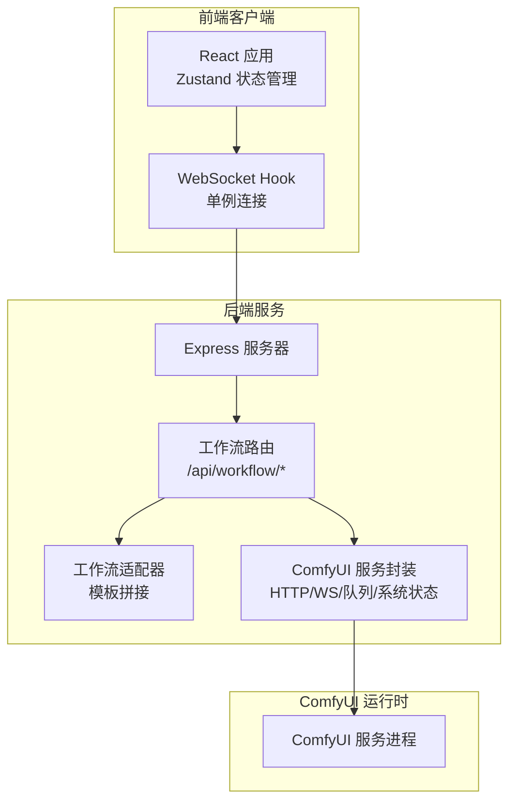
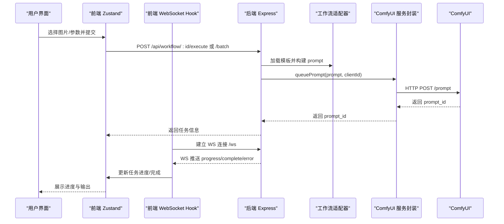
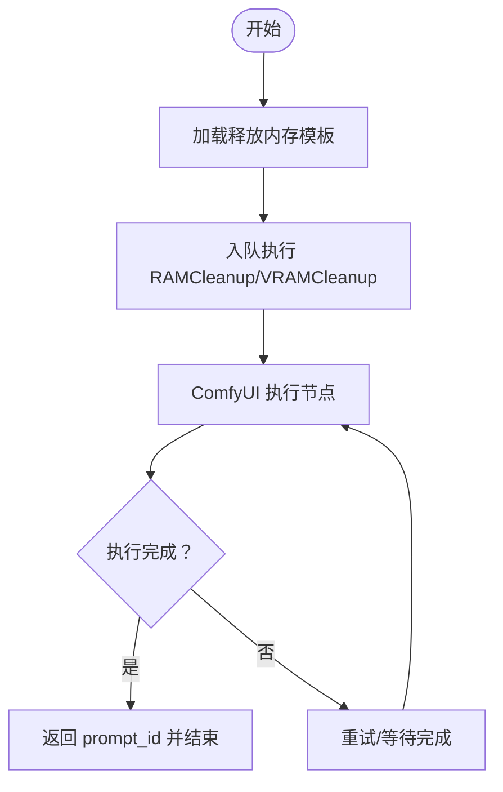
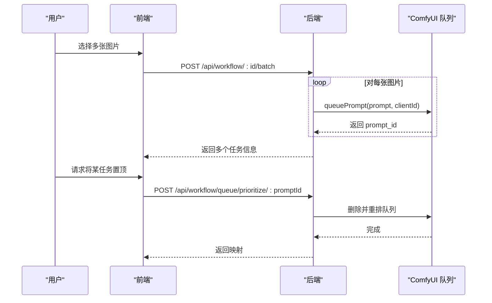
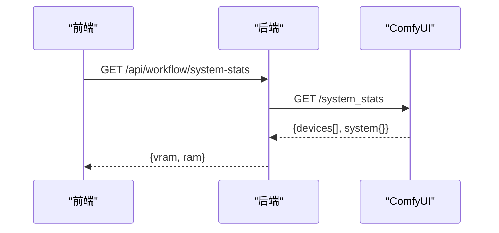
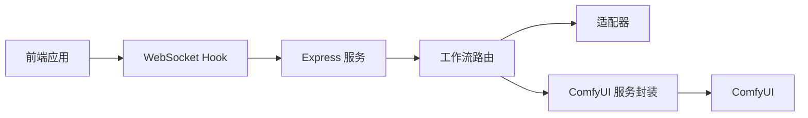

# 性能与资源问题

<cite>
**本文引用的文件**
- [README.md](file://README.md)
- [package.json](file://package.json)
- [server/package.json](file://server/package.json)
- [client/package.json](file://client/package.json)
- [ComfyUI_API/Pix2Real-释放内存.json](file://ComfyUI_API/Pix2Real-释放内存.json)
- [ComfyUI_API/Pix2Real-快速生成视频RAM.json](file://ComfyUI_API/Pix2Real-快速生成视频RAM.json)
- [server/src/services/comfyui.ts](file://server/src/services/comfyui.ts)
- [server/src/routers/workflow.ts](file://server/src/routers/workflow.ts)
- [server/src/adapters/Workflow0Adapter.ts](file://server/src/adapters/Workflow0Adapter.ts)
- [server/src/adapters/Workflow2Adapter.ts](file://server/src/adapters/Workflow2Adapter.ts)
- [client/src/hooks/useWorkflowStore.ts](file://client/src/hooks/useWorkflowStore.ts)
- [client/src/hooks/useWebSocket.ts](file://client/src/hooks/useWebSocket.ts)
- [server/src/types/index.ts](file://server/src/types/index.ts)
- [client/src/types/index.ts](file://client/src/types/index.ts)
</cite>

## 目录
1. [简介](#简介)
2. [项目结构](#项目结构)
3. [核心组件](#核心组件)
4. [架构总览](#架构总览)
5. [详细组件分析](#详细组件分析)
6. [依赖关系分析](#依赖关系分析)
7. [性能考量](#性能考量)
8. [故障排除指南](#故障排除指南)
9. [结论](#结论)
10. [附录](#附录)

## 简介
本文件聚焦于本项目的性能优化与资源管理问题，特别是 VRAM 内存不足导致的处理失败、批量处理优化策略、图像尺寸调整建议、处理速度慢的诊断方法（GPU 利用率、CPU 资源竞争、I/O 瓶颈）、工作流配置优化（节点优化、缓存策略、并行处理），以及系统资源监控工具与性能指标解读，并提供针对不同硬件配置的最佳实践建议。

## 项目结构
项目采用前后端分离架构：前端使用 Vite + React + TypeScript，后端使用 Express + TypeScript，二者通过 WebSocket 实时通信，后端负责与 ComfyUI 的 HTTP/WebSocket 交互，并提供工作流执行、队列管理、系统状态查询等功能。

图表来源
- [README.md:41-79](file://README.md#L41-L79)
- [server/src/routers/workflow.ts:1-800](file://server/src/routers/workflow.ts#L1-L800)
- [client/src/hooks/useWebSocket.ts:1-99](file://client/src/hooks/useWebSocket.ts#L1-L99)

章节来源
- [README.md:41-79](file://README.md#L41-L79)
- [package.json:1-15](file://package.json#L1-L15)
- [server/package.json:1-28](file://server/package.json#L1-L28)
- [client/package.json:1-25](file://client/package.json#L1-L25)

## 核心组件
- 前端状态与 WebSocket
  - Zustand 工作流状态存储，统一管理任务队列、进度、输出等。
  - 单例 WebSocket Hook，确保每个浏览器会话仅建立一次 WS 连接，实时转发进度与完成事件。
- 后端服务
  - Express 路由层：提供工作流执行、批量执行、队列优先级调整、内存释放、系统状态查询等接口。
  - 适配器模式：按工作流 ID 加载对应 JSON 模板，仅修改必要节点（如图像名、提示词、种子等）。
  - ComfyUI 服务封装：统一封装上传、入队、历史查询、系统统计、WS 连接、队列操作等。
- ComfyUI 工作流模板
  - 包含内存清理（RAMCleanup + VRAMCleanup）与资源敏感型工作流（如快速生成视频 RAM 版本）。

章节来源
- [client/src/hooks/useWorkflowStore.ts:1-645](file://client/src/hooks/useWorkflowStore.ts#L1-L645)
- [client/src/hooks/useWebSocket.ts:1-99](file://client/src/hooks/useWebSocket.ts#L1-L99)
- [server/src/routers/workflow.ts:1-800](file://server/src/routers/workflow.ts#L1-L800)
- [server/src/services/comfyui.ts:1-285](file://server/src/services/comfyui.ts#L1-L285)
- [server/src/adapters/Workflow0Adapter.ts:1-35](file://server/src/adapters/Workflow0Adapter.ts#L1-L35)
- [server/src/adapters/Workflow2Adapter.ts:1-28](file://server/src/adapters/Workflow2Adapter.ts#L1-L28)
- [ComfyUI_API/Pix2Real-释放内存.json:1-39](file://ComfyUI_API/Pix2Real-释放内存.json#L1-L39)
- [ComfyUI_API/Pix2Real-快速生成视频RAM.json:1-448](file://ComfyUI_API/Pix2Real-快速生成视频RAM.json#L1-L448)

## 架构总览
下图展示从用户触发到 ComfyUI 执行再到前端进度反馈的完整链路，以及内存清理与系统状态查询的关键节点。

图表来源
- [server/src/routers/workflow.ts:407-455](file://server/src/routers/workflow.ts#L407-L455)
- [server/src/services/comfyui.ts:47-60](file://server/src/services/comfyui.ts#L47-L60)
- [client/src/hooks/useWebSocket.ts:10-73](file://client/src/hooks/useWebSocket.ts#L10-L73)
- [client/src/hooks/useWorkflowStore.ts:377-499](file://client/src/hooks/useWorkflowStore.ts#L377-L499)

## 详细组件分析

### 组件A：内存清理与 VRAM 释放
- 目标：在处理失败或长时间运行后主动释放 GPU 显存与系统内存，避免后续任务因显存不足而失败。
- 关键点：
  - 释放内存工作流模板包含 RAMCleanup 与 VRAMCleanup 节点，支持清理文件缓存、进程、DLL，以及可选的模型/缓存卸载。
  - 后端提供 /api/workflow/release-memory 接口，调用 queuePrompt 执行该模板。
  - 前端可通过按钮触发该接口，适合在批量任务之间或失败后手动干预。

图表来源
- [server/src/routers/workflow.ts:542-559](file://server/src/routers/workflow.ts#L542-L559)
- [ComfyUI_API/Pix2Real-释放内存.json:1-39](file://ComfyUI_API/Pix2Real-释放内存.json#L1-L39)

章节来源
- [server/src/routers/workflow.ts:542-559](file://server/src/routers/workflow.ts#L542-L559)
- [ComfyUI_API/Pix2Real-释放内存.json:1-39](file://ComfyUI_API/Pix2Real-释放内存.json#L1-L39)

### 组件B：批量处理与队列优先级
- 目标：提升吞吐量与公平性，减少长任务阻塞。
- 关键点：
  - /api/workflow/:id/batch 支持一次性提交多张图片，逐个入队。
  - /api/workflow/queue/prioritize/:promptId 可将指定任务重新入队并置于队首，配合现有队列 API 使用。
  - 前端状态管理支持跨标签页的任务映射与进度更新，保证多任务并发场景下的 UI 一致性。

图表来源
- [server/src/routers/workflow.ts:457-520](file://server/src/routers/workflow.ts#L457-L520)
- [server/src/routers/workflow.ts:571-579](file://server/src/routers/workflow.ts#L571-L579)
- [server/src/services/comfyui.ts:255-284](file://server/src/services/comfyui.ts#L255-L284)

章节来源
- [server/src/routers/workflow.ts:457-520](file://server/src/routers/workflow.ts#L457-L520)
- [server/src/routers/workflow.ts:571-579](file://server/src/routers/workflow.ts#L571-L579)
- [server/src/services/comfyui.ts:255-284](file://server/src/services/comfyui.ts#L255-L284)

### 组件C：系统资源监控与状态查询
- 目标：在前端侧直观展示当前 ComfyUI 的 VRAM 与 RAM 使用情况，辅助判断是否需要释放内存或降低负载。
- 关键点：
  - /api/workflow/system-stats 调用 ComfyUI 的 system_stats 接口，返回设备 VRAM 使用百分比与系统 RAM 使用百分比。
  - 前端可周期性轮询该接口，结合任务进度与输出，定位瓶颈。

图表来源
- [server/src/routers/workflow.ts:532-540](file://server/src/routers/workflow.ts#L532-L540)
- [server/src/services/comfyui.ts:106-125](file://server/src/services/comfyui.ts#L106-L125)

章节来源
- [server/src/routers/workflow.ts:532-540](file://server/src/routers/workflow.ts#L532-L540)
- [server/src/services/comfyui.ts:106-125](file://server/src/services/comfyui.ts#L106-L125)

### 组件D：资源敏感型工作流（以“快速生成视频 RAM”为例）
- 目标：在显存受限环境下仍可运行的轻量化流程，通过节点级优化降低峰值显存占用。
- 关键点：
  - 该模板包含注意力/算子设置、VAE/模型加载、采样器参数、视频合成等节点，适合在较小分辨率与较低步数下运行。
  - 建议在显存紧张时优先使用该版本工作流进行测试与迭代。

章节来源
- [ComfyUI_API/Pix2Real-快速生成视频RAM.json:1-448](file://ComfyUI_API/Pix2Real-快速生成视频RAM.json#L1-L448)

## 依赖关系分析
- 前端依赖
  - React/Zustand：状态管理与组件化 UI。
  - WebSocket：与后端建立持久连接，接收进度与完成事件。
- 后端依赖
  - Express：路由与中间件。
  - node-fetch + ws：与 ComfyUI 通信与 WS 事件订阅。
  - multer：文件上传（图片/视频）。
- 适配器与模板
  - 适配器按工作流 ID 读取 JSON 模板并动态拼接参数，降低重复代码与维护成本。

图表来源
- [client/src/hooks/useWebSocket.ts:1-99](file://client/src/hooks/useWebSocket.ts#L1-L99)
- [server/src/routers/workflow.ts:1-800](file://server/src/routers/workflow.ts#L1-L800)
- [server/src/services/comfyui.ts:1-285](file://server/src/services/comfyui.ts#L1-L285)

章节来源
- [client/src/hooks/useWebSocket.ts:1-99](file://client/src/hooks/useWebSocket.ts#L1-L99)
- [server/src/routers/workflow.ts:1-800](file://server/src/routers/workflow.ts#L1-L800)
- [server/src/services/comfyui.ts:1-285](file://server/src/services/comfyui.ts#L1-L285)

## 性能考量
- VRAM 内存不足的常见症状
  - 入队后卡住、执行报错、ComfyUI 返回 OOM 或 CUDA out of memory。
  - 系统资源监控显示 VRAM 使用接近上限。
- 优化策略
  - 在批处理之间与失败后主动调用释放内存接口，避免累积显存碎片。
  - 使用资源敏感型工作流（如“快速生成视频 RAM”）进行小分辨率测试，逐步提升分辨率与步数。
  - 控制批量大小，避免一次性提交过多任务导致队列堆积与显存抖动。
  - 合理设置采样步数、分辨率与模型加载策略，必要时启用模型/缓存卸载。
- 处理速度慢的诊断
  - GPU 利用率：通过系统监控工具查看 GPU 利用率与显存占用，若利用率低则可能受 CPU/I/O 瓶颈限制。
  - CPU 资源竞争：检查 CPU 占用与线程数，适当降低并发或关闭其他占用 CPU 的程序。
  - I/O 瓶颈：关注磁盘写入延迟与带宽，尽量将输入/输出目录放置在高性能磁盘上。
- 工作流配置优化
  - 节点优化：减少不必要的中间节点、合并相似操作、使用更高效的算子设置。
  - 缓存策略：利用 ComfyUI 内置缓存与模板复用，避免重复加载相同模型。
  - 并行处理：合理安排任务优先级与队列顺序，避免长任务阻塞短任务；在前端层面控制并发数量。

[本节为通用性能指导，无需特定文件引用]

## 故障排除指南

### VRAM 不足导致的处理失败
- 症状
  - 任务长时间无响应或直接失败。
  - 系统资源监控显示 VRAM 使用接近 100%。
- 诊断步骤
  - 调用 /api/workflow/system-stats 查看 VRAM 使用率。
  - 检查是否存在长时间未释放的模型/缓存。
- 处理方案
  - 手动触发释放内存：调用 /api/workflow/release-memory。
  - 切换到资源敏感型工作流（如“快速生成视频 RAM”）进行验证。
  - 降低分辨率、步数或关闭非必要节点，减少峰值显存占用。
  - 分批执行，避免一次性提交过多任务。

章节来源
- [server/src/routers/workflow.ts:532-540](file://server/src/routers/workflow.ts#L532-L540)
- [server/src/routers/workflow.ts:542-559](file://server/src/routers/workflow.ts#L542-L559)
- [ComfyUI_API/Pix2Real-释放内存.json:1-39](file://ComfyUI_API/Pix2Real-释放内存.json#L1-L39)
- [ComfyUI_API/Pix2Real-快速生成视频RAM.json:1-448](file://ComfyUI_API/Pix2Real-快速生成视频RAM.json#L1-L448)

### 处理速度慢的诊断
- GPU 利用率低
  - 使用系统监控工具（如 nvidia-smi、Windows 任务管理器）观察 GPU 利用率与显存占用。
  - 若 CPU 占用高而 GPU 低，可能是 CPU/I/O 成为瓶颈。
- CPU 资源竞争
  - 关闭其他占用 CPU 的程序，适当降低并发。
- I/O 瓶颈
  - 将输入/输出目录迁移到 SSD 或高性能磁盘，减少磁盘写入延迟。
- 队列与网络
  - 检查后端与 ComfyUI 的网络延迟，必要时在同一主机部署以减少网络开销。
  - 使用队列优先级接口将关键任务置顶，缩短等待时间。

章节来源
- [server/src/routers/workflow.ts:561-579](file://server/src/routers/workflow.ts#L561-L579)
- [server/src/services/comfyui.ts:127-188](file://server/src/services/comfyui.ts#L127-L188)

### 批量处理优化
- 控制批量大小：根据显存与 CPU 能力调整每次提交的图片数量。
- 任务优先级：对紧急任务使用优先级接口置顶，减少等待时间。
- 任务映射：当队列重排后，后端会返回 promptId 映射，前端需同步更新状态，避免进度错位。

章节来源
- [server/src/routers/workflow.ts:457-520](file://server/src/routers/workflow.ts#L457-L520)
- [server/src/routers/workflow.ts:571-579](file://server/src/routers/workflow.ts#L571-L579)
- [client/src/hooks/useWorkflowStore.ts:166-195](file://client/src/hooks/useWorkflowStore.ts#L166-L195)

### 图像尺寸调整建议
- 以“快速生成视频 RAM”工作流为例，模板中包含图像缩放节点，建议先在较小分辨率下验证效果，再逐步提升至目标尺寸。
- 注意缩放比例与 divisible_by 参数，避免引入额外的计算负担。

章节来源
- [ComfyUI_API/Pix2Real-快速生成视频RAM.json:262-281](file://ComfyUI_API/Pix2Real-快速生成视频RAM.json#L262-L281)

### 系统资源监控工具与指标解读
- 工具
  - nvidia-smi：查看 GPU 利用率、显存使用、温度等。
  - Windows 任务管理器/性能监视器：查看 CPU、内存、磁盘 IO。
  - 浏览器开发者工具：观察 WebSocket 延迟与消息频率。
- 指标
  - VRAM 使用率：持续接近上限时应考虑释放内存或降负载。
  - RAM 使用率：过高可能导致系统换页，影响 I/O。
  - GPU 利用率：长期低于 30% 可能存在 CPU/I/O 瓶颈。
  - 队列长度：pending 数量过大表示上游压力或下游处理能力不足。

章节来源
- [server/src/services/comfyui.ts:101-125](file://server/src/services/comfyui.ts#L101-L125)
- [server/src/routers/workflow.ts:532-540](file://server/src/routers/workflow.ts#L532-L540)

### 不同硬件配置的最佳实践
- 高端显卡（12GB+）
  - 可以在较高分辨率与步数下运行，但仍需注意批处理大小与队列长度。
  - 建议开启模型/缓存卸载以进一步降低峰值显存。
- 中端显卡（6–12GB）
  - 优先使用资源敏感型工作流进行测试，逐步提升参数。
  - 控制批量大小，避免队列堆积。
- 低端显卡（6GB以下）
  - 严格控制分辨率与步数，必要时分多次小批量执行。
  - 频繁触发释放内存接口，保持显存可用。

[本节为通用最佳实践建议，无需特定文件引用]

## 结论
通过系统化的内存清理、队列优先级、资源监控与工作流参数优化，可以显著缓解 VRAM 不足与处理缓慢的问题。建议在实际使用中结合系统监控工具与工作流模板，按硬件能力制定合理的批处理策略与参数配置，并在关键节点（如批量前后、失败后）主动释放内存，以维持稳定的处理性能。

[本节为总结性内容，无需特定文件引用]

## 附录

### 关键接口与职责对照
- /api/workflow/:id/execute：单图执行，适配器拼接模板并入队。
- /api/workflow/:id/batch：批量执行，逐个入队并返回任务列表。
- /api/workflow/release-memory：执行释放内存工作流。
- /api/workflow/system-stats：查询系统 VRAM/内存使用。
- /api/workflow/queue/prioritize/:promptId：将指定任务置顶。

章节来源
- [server/src/routers/workflow.ts:407-455](file://server/src/routers/workflow.ts#L407-L455)
- [server/src/routers/workflow.ts:457-520](file://server/src/routers/workflow.ts#L457-L520)
- [server/src/routers/workflow.ts:542-559](file://server/src/routers/workflow.ts#L542-L559)
- [server/src/routers/workflow.ts:532-540](file://server/src/routers/workflow.ts#L532-L540)
- [server/src/routers/workflow.ts:571-579](file://server/src/routers/workflow.ts#L571-L579)