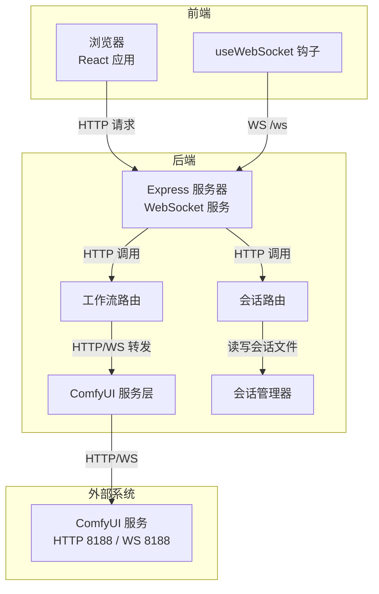
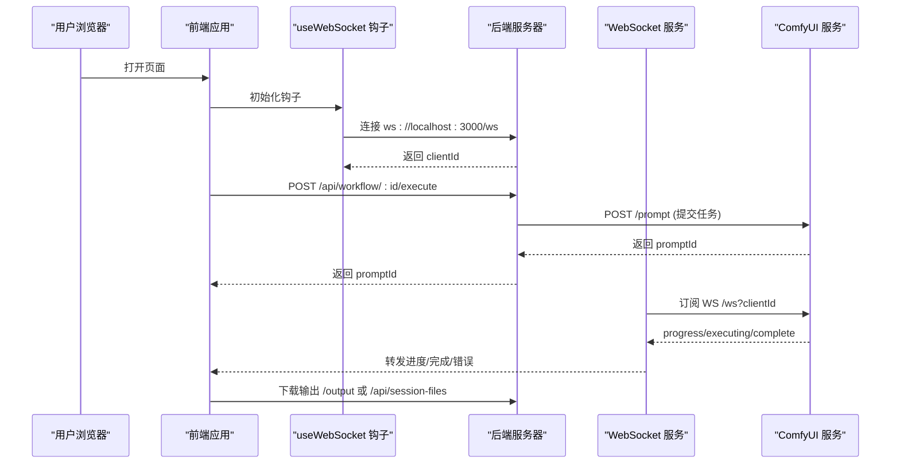
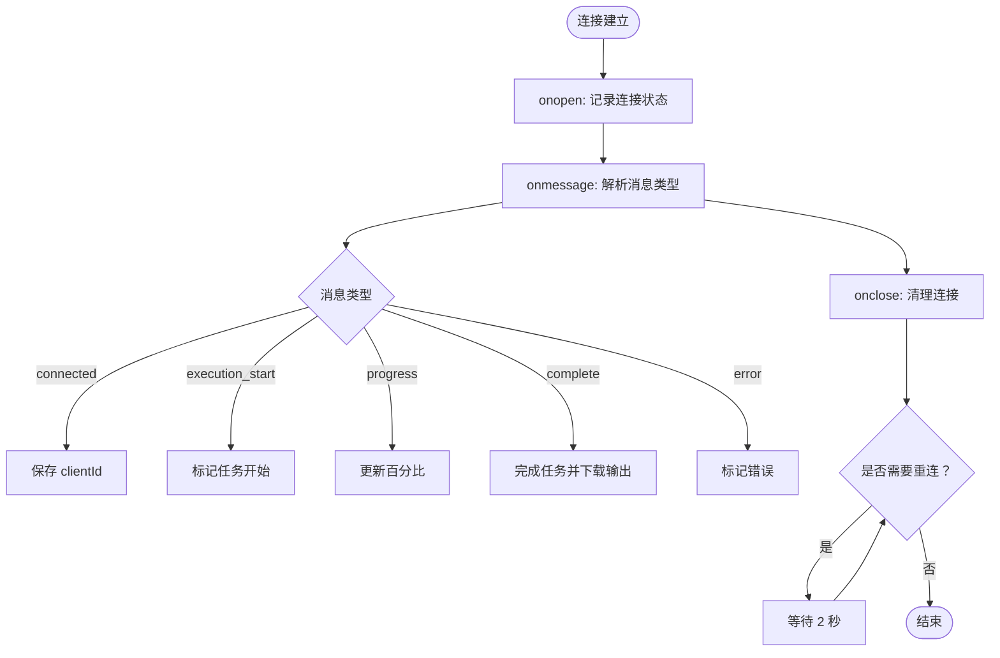
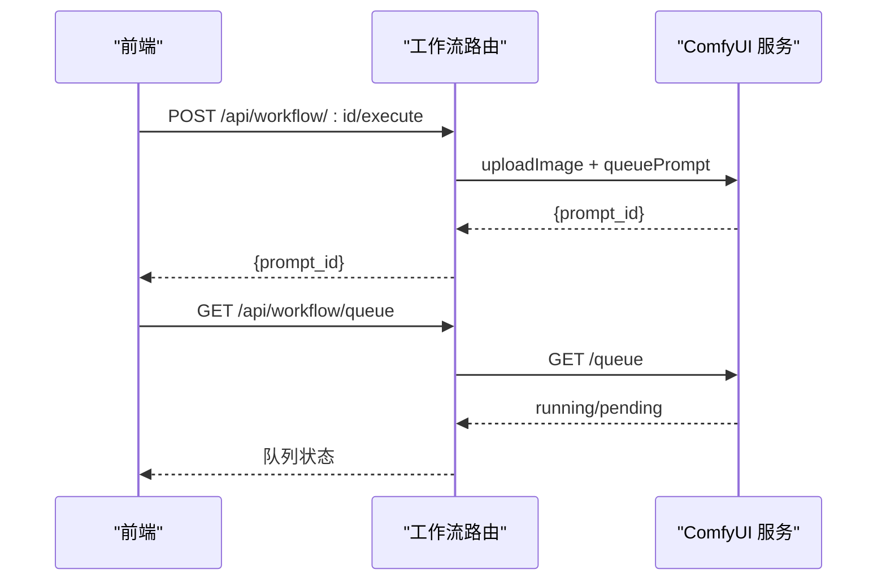
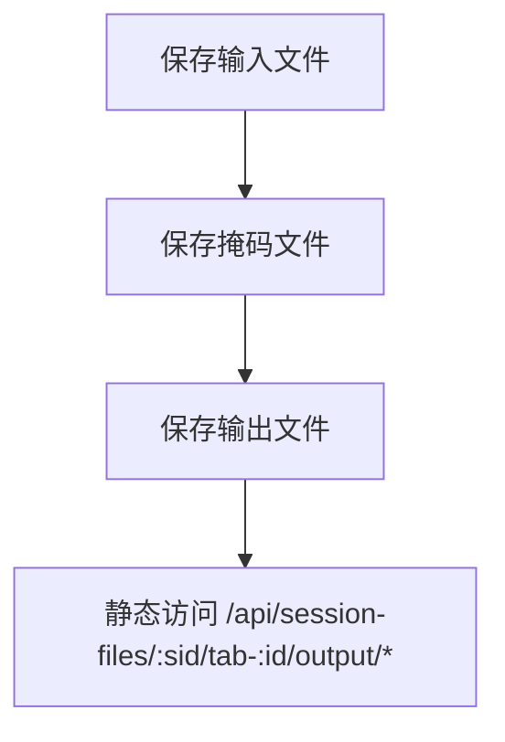
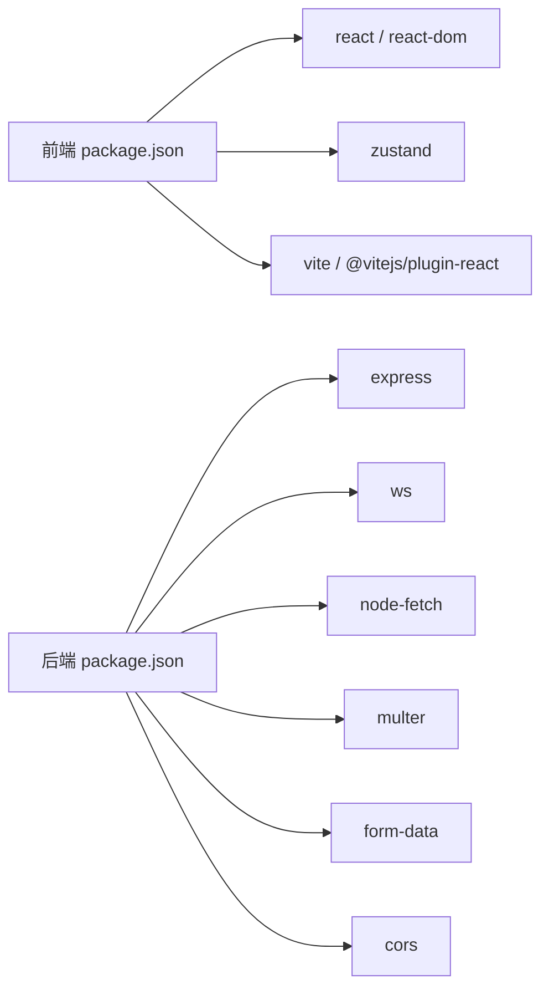

# 故障排除与常见问题

<cite>
**本文引用的文件**
- [README.md](file://README.md)
- [package.json](file://package.json)
- [server/package.json](file://server/package.json)
- [client/package.json](file://client/package.json)
- [start.bat](file://start.bat)
- [debug.bat](file://debug.bat)
- [stop.bat](file://stop.bat)
- [server/src/index.ts](file://server/src/index.ts)
- [server/src/services/comfyui.ts](file://server/src/services/comfyui.ts)
- [client/src/hooks/useWebSocket.ts](file://client/src/hooks/useWebSocket.ts)
- [server/src/routes/workflow.ts](file://server/src/routes/workflow.ts)
- [server/src/routes/session.ts](file://server/src/routes/session.ts)
- [server/src/services/sessionManager.ts](file://server/src/services/sessionManager.ts)
- [server/src/types/index.ts](file://server/src/types/index.ts)
</cite>

## 目录
1. [简介](#简介)
2. [项目结构](#项目结构)
3. [核心组件](#核心组件)
4. [架构总览](#架构总览)
5. [详细组件分析](#详细组件分析)
6. [依赖关系分析](#依赖关系分析)
7. [性能考虑](#性能考虑)
8. [故障排除指南](#故障排除指南)
9. [结论](#结论)
10. [附录](#附录)

## 简介
本指南面向 CorineKit Pix2Real 的使用者与维护者，聚焦于安装与运行期常见问题的诊断与解决，涵盖以下主题：
- 安装与环境问题：依赖冲突、端口占用、权限问题
- ComfyUI 连接问题：网络配置、防火墙、服务状态检查
- WebSocket 连接失败：超时、协议不匹配、代理配置
- 内存不足与资源管理：VRAM 释放、批量处理优化、资源回收
- 性能优化：处理速度、内存使用、并发与队列优先级
- 错误信息解读与解决步骤

## 项目结构
项目采用前后端分离架构：
- 前端（Vite + React + TypeScript）位于 client/，通过本地代理访问后端
- 后端（Express + TypeScript）位于 server/，负责路由、会话管理、与 ComfyUI 的 HTTP/WebSocket 交互
- ComfyUI 工作流模板位于 ComfyUI_API/，由后端按需加载与补丁
- 输出目录 output/ 与会话目录 sessions/ 由后端管理

图表来源
- [server/src/index.ts:42-63](file://server/src/index.ts#L42-L63)
- [server/src/routes/workflow.ts:1-40](file://server/src/routes/workflow.ts#L1-L40)
- [server/src/routes/session.ts:1-20](file://server/src/routes/session.ts#L1-L20)
- [server/src/services/comfyui.ts:6-8](file://server/src/services/comfyui.ts#L6-L8)
- [client/src/hooks/useWebSocket.ts:18-20](file://client/src/hooks/useWebSocket.ts#L18-L20)

章节来源
- [README.md: 41-62:41-62](file://README.md#L41-L62)
- [package.json: 4-10:4-10](file://package.json#L4-L10)

## 核心组件
- 后端主进程：启动 Express 与 WebSocket 服务，初始化输出目录与会话目录，注册路由与静态资源
- ComfyUI 服务层：封装上传、入队、历史查询、图像下载、系统统计、队列操作等
- WebSocket 层：在后端为每个浏览器客户端建立到 ComfyUI 的 WS 连接，并将进度事件转发给前端
- 前端 WebSocket 钩子：单例连接管理，自动重连，消息分发至工作流状态存储
- 会话管理：保存输入/掩码/输出文件与会话状态 JSON，支持跨标签页隔离

章节来源
- [server/src/index.ts: 42-63:42-63](file://server/src/index.ts#L42-L63)
- [server/src/services/comfyui.ts: 6-L8:6-8](file://server/src/services/comfyui.ts#L6-L8)
- [client/src/hooks/useWebSocket.ts: 10-73:10-73](file://client/src/hooks/useWebSocket.ts#L10-L73)
- [server/src/services/sessionManager.ts: 10-L16:10-16](file://server/src/services/sessionManager.ts#L10-L16)

## 架构总览
后端作为中转层，负责：
- 将前端请求映射为 ComfyUI 的工作流模板与参数
- 上传媒体文件并提交任务到 ComfyUI 队列
- 通过 WebSocket 实时转发进度与完成事件
- 下载输出并保存到会话目录或全局输出目录
- 提供会话持久化与文件访问接口

图表来源
- [server/src/index.ts: 73-219:73-219](file://server/src/index.ts#L73-L219)
- [server/src/services/comfyui.ts: 127-188:127-188](file://server/src/services/comfyui.ts#L127-L188)
- [client/src/hooks/useWebSocket.ts: 22-51:22-51](file://client/src/hooks/useWebSocket.ts#L22-L51)

## 详细组件分析

### 组件一：WebSocket 连接与事件转发
- 单例连接：前端 useWebSocket 使用模块级变量确保全局唯一连接，避免重复连接与资源浪费
- 自动重连：断开后 2 秒重连，仅当存在订阅者时重连
- 事件类型：execution_start、progress、complete、error
- 后端缓冲：对每个 promptId 缓存最近事件，客户端注册后可回放

图表来源
- [client/src/hooks/useWebSocket.ts: 22-65:22-65](file://client/src/hooks/useWebSocket.ts#L22-L65)
- [server/src/index.ts: 92-189:92-189](file://server/src/index.ts#L92-L189)

章节来源
- [client/src/hooks/useWebSocket.ts: 10-99:10-99](file://client/src/hooks/useWebSocket.ts#L10-L99)
- [server/src/index.ts: 73-219:73-219](file://server/src/index.ts#L73-L219)

### 组件二：工作流执行与队列管理
- 多工作流适配：根据 workflowId 加载对应模板，替换节点参数（如图像名、提示词、种子）
- 批量执行：支持一次提交多张图片，逐个入队并返回 promptId 列表
- 队列操作：支持取消队列项、查询队列、将某任务置顶（重新排队并记录 remap）

图表来源
- [server/src/routes/workflow.ts: 408-L455:408-455](file://server/src/routes/workflow.ts#L408-L455)
- [server/src/routes/workflow.ts: 522-L579:522-579](file://server/src/routes/workflow.ts#L522-L579)
- [server/src/services/comfyui.ts: 47-L60:47-60](file://server/src/services/comfyui.ts#L47-L60)

章节来源
- [server/src/routes/workflow.ts: 408-L520:408-520](file://server/src/routes/workflow.ts#L408-L520)
- [server/src/services/comfyui.ts: 202-L221:202-221](file://server/src/services/comfyui.ts#L202-L221)

### 组件三：会话与输出管理
- 输入/掩码/输出文件：按 sessionId/tab-id 分目录保存，支持跨标签页隔离
- 输出下载：后端从 ComfyUI 下载输出并保存到会话目录，同时提供静态访问
- 文件名安全：Windows 不允许冒号等字符，掩码键名替换为下划线

图表来源
- [server/src/services/sessionManager.ts: 20-L57:20-57](file://server/src/services/sessionManager.ts#L20-L57)
- [server/src/routes/session.ts: 18-L49:18-49](file://server/src/routes/session.ts#L18-L49)

章节来源
- [server/src/services/sessionManager.ts: 10-L16:10-16](file://server/src/services/sessionManager.ts#L10-L16)
- [server/src/routes/session.ts: 18-L49:18-49](file://server/src/routes/session.ts#L18-L49)

## 依赖关系分析
- 后端依赖：Express、CORS、ws、node-fetch、multer、form-data
- 前端依赖：React、Zustand、lucide-react、Vite、TypeScript
- 开发工具：tsx、concurrently、@vitejs/plugin-react

图表来源
- [client/package.json: 11-L23:11-23](file://client/package.json#L11-L23)
- [server/package.json: 11-L26:11-26](file://server/package.json#L11-L26)

章节来源
- [package.json: 4-L10:4-10](file://package.json#L4-L10)
- [client/package.json: 11-L23:11-23](file://client/package.json#L11-L23)
- [server/package.json: 11-L26:11-26](file://server/package.json#L11-L26)

## 性能考虑
- 处理速度优化
  - 合理设置采样步数、CFG、分辨率等参数，避免过度计算
  - 使用队列置顶功能将紧急任务前置，减少等待时间
  - 对长耗时任务（如提示词反推）设置合理超时与轮询间隔
- 内存使用优化
  - 定期调用“释放内存”工作流，触发 ComfyUI 清理缓存
  - 控制批量大小，避免一次性提交过多任务导致内存峰值过高
  - 合理关闭浏览器标签页，前端钩子会在无订阅者时主动断开连接，释放资源
- 并发与队列
  - 后端为每个客户端维持一个 ComfyUI WS 连接，避免重复连接
  - 队列查询与优先级调整由后端统一协调，避免前端并发竞争

章节来源
- [server/src/routes/workflow.ts: 542-L559:542-559](file://server/src/routes/workflow.ts#L542-L559)
- [server/src/routes/workflow.ts: 571-L579:571-579](file://server/src/routes/workflow.ts#L571-L579)
- [client/src/hooks/useWebSocket.ts: 75-L99:75-99](file://client/src/hooks/useWebSocket.ts#L75-L99)

## 故障排除指南

### 一、安装与环境问题

1) 依赖安装失败或版本冲突
- 现象：npm install 报错、模块缺失、TypeScript 编译失败
- 排查步骤：
  - 确认 Node.js 版本满足要求（见 README）
  - 清理缓存后重装依赖：删除 node_modules 与 lock 文件，重新安装
  - 检查 package.json 中脚本与依赖版本是否一致
- 参考路径
  - [README.md: 16-L20:16-20](file://README.md#L16-L20)
  - [package.json: 4-L10:4-10](file://package.json#L4-L10)
  - [client/package.json: 11-L23:11-23](file://client/package.json#L11-L23)
  - [server/package.json: 11-L26:11-26](file://server/package.json#L11-L26)

2) 端口占用与启动失败
- 现象：启动脚本报错，端口 3000/5173 被占用
- 排查步骤：
  - 使用提供的批处理脚本自动释放端口并启动服务
  - 手动检查 netstat，确认端口状态并终止占用进程
- 参考路径
  - [start.bat: 10-L32:10-32](file://start.bat#L10-L32)
  - [debug.bat: 10-L32:10-32](file://debug.bat#L10-L32)
  - [stop.bat: 12-L28:12-28](file://stop.bat#L12-L28)

3) 权限问题（Windows）
- 现象：无法创建/写入 sessions/output 目录，或无法打开文件夹
- 排查步骤：
  - 以管理员身份运行命令行或 IDE
  - 确保当前用户对项目目录具有完全控制权
  - 检查防病毒软件或安全软件是否阻止写入

章节来源
- [start.bat: 10-L32:10-32](file://start.bat#L10-L32)
- [debug.bat: 10-L32:10-32](file://debug.bat#L10-L32)
- [stop.bat: 12-L28:12-28](file://stop.bat#L12-L28)
- [server/src/services/sessionManager.ts: 54-L57:54-57](file://server/src/services/sessionManager.ts#L54-L57)

### 二、ComfyUI 连接问题

1) ComfyUI 未运行或地址不可达
- 现象：后端日志出现连接失败、HTTP 5xx、WS 连接异常
- 排查步骤：
  - 确认 ComfyUI 在 http://127.0.0.1:8188 正常运行
  - 检查防火墙/杀软是否拦截 8188 端口
  - 浏览器直接访问 http://127.0.0.1:8188 验证可用性
- 参考路径
  - [server/src/services/comfyui.ts: 6-L8:6-8](file://server/src/services/comfyui.ts#L6-L8)
  - [server/src/index.ts: 46-L49:46-49](file://server/src/index.ts#L46-L49)

2) CORS 与跨域问题
- 现象：前端请求被浏览器拒绝，控制台出现 CORS 错误
- 排查步骤：
  - 后端已允许 http://localhost:5173 与 http://127.0.0.1:5173
  - 若使用自定义域名或 HTTPS，请在后端 CORS 配置中添加相应来源
- 参考路径
  - [server/src/index.ts: 46-L49:46-49](file://server/src/index.ts#L46-L49)

3) 服务状态检查清单
- 后端：确认监听端口 3000，WebSocket 路径 /ws
- 前端：确认代理指向后端（开发模式），端口 5173
- ComfyUI：确认 HTTP 8188 与 WS 8188 可用
- 参考路径
  - [server/src/index.ts: 221-L227:221-227](file://server/src/index.ts#L221-L227)
  - [README.md: 33](file://README.md#L33)

章节来源
- [server/src/services/comfyui.ts: 6-L8:6-8](file://server/src/services/comfyui.ts#L6-L8)
- [server/src/index.ts: 46-L49:46-49](file://server/src/index.ts#L46-L49)
- [server/src/index.ts: 221-L227:221-227](file://server/src/index.ts#L221-L227)
- [README.md: 33](file://README.md#L33)

### 三、WebSocket 连接失败

1) 协议不匹配（HTTP/HTTPS）
- 现象：WS 连接失败，浏览器控制台提示混合内容或协议不匹配
- 排查步骤：
  - 前端根据页面协议自动选择 ws:// 或 wss://
  - 若部署在 HTTPS，请确保后端与反向代理正确配置 TLS
- 参考路径
  - [client/src/hooks/useWebSocket.ts: 18-L20:18-20](file://client/src/hooks/useWebSocket.ts#L18-L20)

2) 连接超时与断开
- 现象：连接成功但很快断开；进度不更新
- 排查步骤：
  - 检查后端日志是否有 onclose/onerror
  - 确认 ComfyUI WS 地址与 clientId 参数正确
  - 前端钩子会在断开后自动重连，若无重连迹象，检查网络与代理
- 参考路径
  - [client/src/hooks/useWebSocket.ts: 53-L65:53-65](file://client/src/hooks/useWebSocket.ts#L53-L65)
  - [server/src/services/comfyui.ts: 183-L185:183-185](file://server/src/services/comfyui.ts#L183-L185)

3) 代理与反向代理配置
- 现象：通过 Nginx/Traefik 等代理后，WS 无法升级
- 排查步骤：
  - 确保代理配置启用 WebSocket 升级
  - 代理上游指向后端 3000 端口，路径 /ws
- 参考路径
  - [client/src/hooks/useWebSocket.ts: 18-L20:18-20](file://client/src/hooks/useWebSocket.ts#L18-L20)
  - [server/src/index.ts: 63](file://server/src/index.ts#L63)

章节来源
- [client/src/hooks/useWebSocket.ts: 18-L20:18-20](file://client/src/hooks/useWebSocket.ts#L18-L20)
- [client/src/hooks/useWebSocket.ts: 53-L65:53-65](file://client/src/hooks/useWebSocket.ts#L53-L65)
- [server/src/services/comfyui.ts: 183-L185:183-185](file://server/src/services/comfyui.ts#L183-L185)

### 四、内存不足与资源管理

1) VRAM/显存不足
- 现象：ComfyUI 报告显存不足，任务卡住或报错
- 排查步骤：
  - 在前端触发“释放内存”工作流，清理缓存
  - 降低分辨率、采样步数或关闭不必要的模型加载
  - 分批执行，避免同时运行多个大模型任务
- 参考路径
  - [server/src/routes/workflow.ts: 542-L559:542-559](file://server/src/routes/workflow.ts#L542-L559)
  - [server/src/services/comfyui.ts: 106-L125:106-125](file://server/src/services/comfyui.ts#L106-L125)

2) RAM 不足
- 现象：系统内存紧张，任务失败或系统卡顿
- 排查步骤：
  - 减少批量大小，合并多次小批量执行
  - 关闭其他占用内存的应用
  - 使用更高容量内存或分阶段处理

3) 资源回收与文件清理
- 现象：output/sessions 目录过大，磁盘空间不足
- 排查步骤：
  - 定期清理旧会话，保留最近若干份
  - 检查 rp_temp/pa_temp 是否有残留文件，及时清理
- 参考路径
  - [server/src/services/sessionManager.ts: 157-L163:157-163](file://server/src/services/sessionManager.ts#L157-L163)

章节来源
- [server/src/routes/workflow.ts: 542-L559:542-559](file://server/src/routes/workflow.ts#L542-L559)
- [server/src/services/comfyui.ts: 106-L125:106-125](file://server/src/services/comfyui.ts#L106-L125)
- [server/src/services/sessionManager.ts: 157-L163:157-163](file://server/src/services/sessionManager.ts#L157-L163)

### 五、性能优化建议

1) 处理速度优化
- 合理设置采样器、步数、CFG、分辨率
- 使用队列置顶功能，将紧急任务前置
- 参考路径
  - [server/src/routes/workflow.ts: 571-L579:571-579](file://server/src/routes/workflow.ts#L571-L579)

2) 内存使用优化
- 定期释放内存，避免模型缓存累积
- 控制批量大小，避免峰值过高
- 参考路径
  - [server/src/routes/workflow.ts: 542-L559:542-559](file://server/src/routes/workflow.ts#L542-L559)

3) 并发与队列优化
- 后端为每个客户端维护单一 WS 连接，避免重复连接
- 前端无订阅者时主动断开，释放资源
- 参考路径
  - [client/src/hooks/useWebSocket.ts: 75-L99:75-99](file://client/src/hooks/useWebSocket.ts#L75-L99)

### 六、错误信息解读与解决步骤

1) 常见后端错误
- “Queue prompt failed”：ComfyUI 入队失败，检查模板与参数
- “Get history failed”：历史查询失败，检查 promptId 与 ComfyUI 状态
- “system_stats failed”：系统统计接口不可用，检查 ComfyUI 服务
- “Get queue failed”：队列查询失败，检查网络与权限
- 参考路径
  - [server/src/services/comfyui.ts: 47-L60:47-60](file://server/src/services/comfyui.ts#L47-L60)
  - [server/src/services/comfyui.ts: 62-L71:62-71](file://server/src/services/comfyui.ts#L62-L71)
  - [server/src/services/comfyui.ts: 106-L125:106-125](file://server/src/services/comfyui.ts#L106-L125)
  - [server/src/services/comfyui.ts: 202-L221:202-221](file://server/src/services/comfyui.ts#L202-L221)

2) 前端错误
- “Disconnected”：WebSocket 断开，检查网络与代理
- “Reconnecting in 2s...”：自动重连中，等待恢复
- 参考路径
  - [client/src/hooks/useWebSocket.ts: 53-L65:53-65](file://client/src/hooks/useWebSocket.ts#L53-L65)

3) 会话与文件错误
- “No image/mask file provided”：缺少上传文件
- “sessionId and tabId are required”：会话数据不完整
- “file not found”：临时文件未生成，检查模板与保存节点
- 参考路径
  - [server/src/routes/workflow.ts: 41-L92:41-92](file://server/src/routes/workflow.ts#L41-L92)
  - [server/src/routes/session.ts: 18-L49:18-49](file://server/src/routes/session.ts#L18-L49)
  - [server/src/routes/workflow.ts: 698-L744:698-744](file://server/src/routes/workflow.ts#L698-L744)

## 结论
本指南围绕安装、连接、WebSocket、内存与性能等维度提供了系统化的排障思路与解决步骤。建议在日常使用中：
- 保持 ComfyUI 服务稳定运行
- 合理设置参数与批量大小
- 定期释放内存与清理临时文件
- 通过队列优先级与单例 WS 连接提升稳定性与效率

## 附录

### A. 端口与服务对照
- 后端 HTTP：localhost:3000
- 后端 WebSocket：ws://localhost:3000/ws
- ComfyUI HTTP/WS：http://127.0.0.1:8188
- 前端开发：localhost:5173（通过代理）

章节来源
- [server/src/index.ts: 221-L227:221-227](file://server/src/index.ts#L221-L227)
- [README.md: 33](file://README.md#L33)