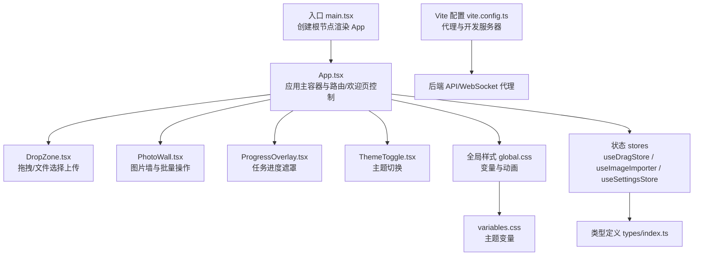
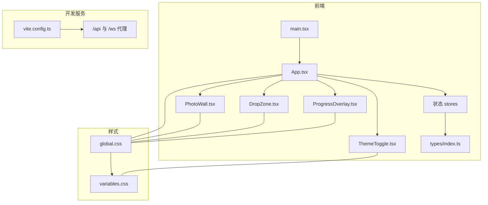
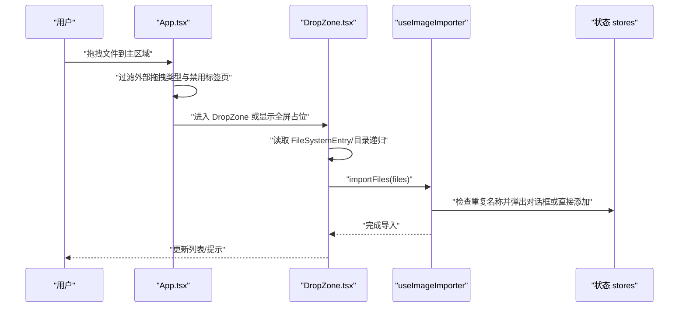
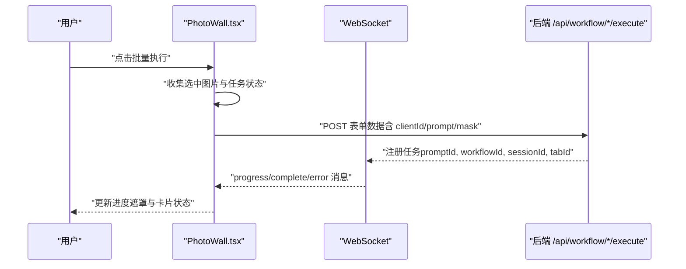
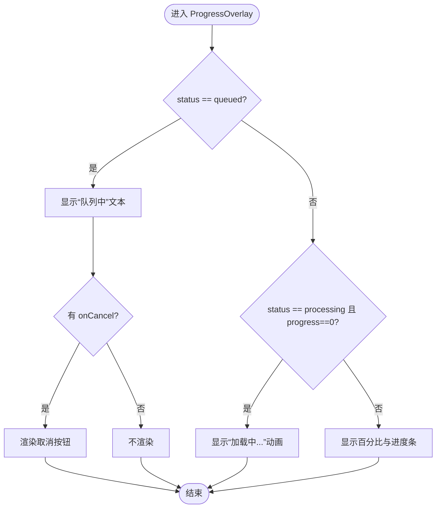
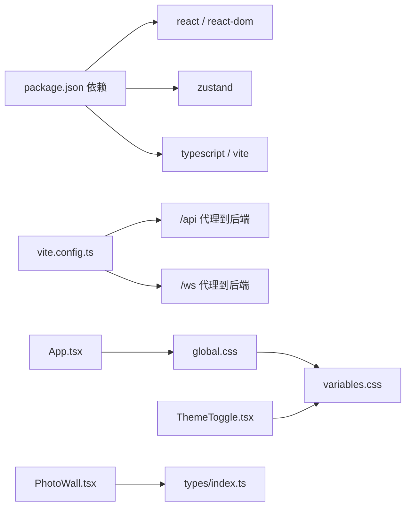

# 界面与交互问题

<cite>
**本文引用的文件**
- [client/src/main.tsx](file://client/src/main.tsx)
- [client/src/components/App.tsx](file://client/src/components/App.tsx)
- [client/src/components/DropZone.tsx](file://client/src/components/DropZone.tsx)
- [client/src/components/PhotoWall.tsx](file://client/src/components/PhotoWall.tsx)
- [client/src/components/ProgressOverlay.tsx](file://client/src/components/ProgressOverlay.tsx)
- [client/src/components/ThemeToggle.tsx](file://client/src/components/ThemeToggle.tsx)
- [client/src/styles/global.css](file://client/src/styles/global.css)
- [client/src/styles/variables.css](file://client/src/styles/variables.css)
- [client/vite.config.ts](file://client/vite.config.ts)
- [client/package.json](file://client/package.json)
- [client/src/hooks/useDragStore.ts](file://client/src/hooks/useDragStore.ts)
- [client/src/hooks/useImageImporter.ts](file://client/src/hooks/useImageImporter.ts)
- [client/src/hooks/useSettingsStore.ts](file://client/src/hooks/useSettingsStore.ts)
- [client/src/types/index.ts](file://client/src/types/index.ts)
</cite>

## 目录
1. [简介](#简介)
2. [项目结构](#项目结构)
3. [核心组件](#核心组件)
4. [架构总览](#架构总览)
5. [详细组件分析](#详细组件分析)
6. [依赖关系分析](#依赖关系分析)
7. [性能考量](#性能考量)
8. [故障排除指南](#故障排除指南)
9. [结论](#结论)
10. [附录](#附录)

## 简介
本指南聚焦于前端界面与交互问题的诊断与修复，覆盖以下方面：
- 前端组件加载失败、样式显示异常、响应式布局问题
- 文件拖拽上传失败、批量操作异常、进度显示错误
- 主题切换失效、浏览器兼容性差异、移动端适配与触摸事件
- 开发者工具使用与界面调试技巧

目标是帮助开发者快速定位问题根因，并提供可操作的修复建议。

## 项目结构
客户端采用 React + TypeScript + Vite 构建，样式通过 CSS 变量与全局样式统一管理；核心交互由 Zustand 状态管理驱动，WebSocket 实时通信用于进度反馈。

图表来源
- [client/src/main.tsx:1-11](file://client/src/main.tsx#L1-L11)
- [client/src/components/App.tsx:54-335](file://client/src/components/App.tsx#L54-L335)
- [client/src/components/DropZone.tsx:39-171](file://client/src/components/DropZone.tsx#L39-L171)
- [client/src/components/PhotoWall.tsx:103-578](file://client/src/components/PhotoWall.tsx#L103-L578)
- [client/src/components/ProgressOverlay.tsx:9-101](file://client/src/components/ProgressOverlay.tsx#L9-L101)
- [client/src/components/ThemeToggle.tsx:4-39](file://client/src/components/ThemeToggle.tsx#L4-L39)
- [client/src/styles/global.css:1-224](file://client/src/styles/global.css#L1-L224)
- [client/src/styles/variables.css:1-31](file://client/src/styles/variables.css#L1-L31)
- [client/vite.config.ts:1-20](file://client/vite.config.ts#L1-L20)
- [client/src/hooks/useDragStore.ts:1-17](file://client/src/hooks/useDragStore.ts#L1-L17)
- [client/src/hooks/useImageImporter.ts:9-48](file://client/src/hooks/useImageImporter.ts#L9-L48)
- [client/src/hooks/useSettingsStore.ts:1-31](file://client/src/hooks/useSettingsStore.ts#L1-L31)
- [client/src/types/index.ts:1-58](file://client/src/types/index.ts#L1-L58)

章节来源
- [client/src/main.tsx:1-11](file://client/src/main.tsx#L1-L11)
- [client/src/components/App.tsx:54-335](file://client/src/components/App.tsx#L54-L335)
- [client/vite.config.ts:1-20](file://client/vite.config.ts#L1-L20)

## 核心组件
- 应用入口与主容器：负责渲染根节点、主题初始化、欢迎页与主界面切换、全局拖拽处理、状态栏与对话框等。
- 拖拽上传区：支持文件/文件夹拖拽、本地文件选择、目录递归读取、类型过滤与去重确认。
- 图片墙与批量操作：多选、批量替换提示词、批量删除、批量执行、拖拽删除区域、懒加载卡片。
- 进度遮罩：队列中、加载中、百分比进度与取消。
- 主题切换：本地存储持久化、根元素属性切换。
- 样式系统：CSS 变量、暗/亮主题、动画与滚动条样式、骨架屏与过渡效果。
- 状态管理：拖拽状态、图片导入去重对话框、设置项持久化。
- 类型系统：任务状态、WebSocket 消息类型。

章节来源
- [client/src/components/App.tsx:54-335](file://client/src/components/App.tsx#L54-L335)
- [client/src/components/DropZone.tsx:39-171](file://client/src/components/DropZone.tsx#L39-L171)
- [client/src/components/PhotoWall.tsx:103-578](file://client/src/components/PhotoWall.tsx#L103-L578)
- [client/src/components/ProgressOverlay.tsx:9-101](file://client/src/components/ProgressOverlay.tsx#L9-L101)
- [client/src/components/ThemeToggle.tsx:4-39](file://client/src/components/ThemeToggle.tsx#L4-L39)
- [client/src/styles/global.css:1-224](file://client/src/styles/global.css#L1-L224)
- [client/src/styles/variables.css:1-31](file://client/src/styles/variables.css#L1-L31)
- [client/src/hooks/useDragStore.ts:1-17](file://client/src/hooks/useDragStore.ts#L1-L17)
- [client/src/hooks/useImageImporter.ts:9-48](file://client/src/hooks/useImageImporter.ts#L9-L48)
- [client/src/hooks/useSettingsStore.ts:1-31](file://client/src/hooks/useSettingsStore.ts#L1-L31)
- [client/src/types/index.ts:1-58](file://client/src/types/index.ts#L1-L58)

## 架构总览
前端采用“容器组件 + 展示组件 + 状态管理”的分层设计，WebSocket 与后端进行进度同步，Vite 提供开发代理与构建能力。

图表来源
- [client/src/main.tsx:1-11](file://client/src/main.tsx#L1-L11)
- [client/src/components/App.tsx:54-335](file://client/src/components/App.tsx#L54-L335)
- [client/src/components/DropZone.tsx:39-171](file://client/src/components/DropZone.tsx#L39-L171)
- [client/src/components/PhotoWall.tsx:103-578](file://client/src/components/PhotoWall.tsx#L103-L578)
- [client/src/components/ProgressOverlay.tsx:9-101](file://client/src/components/ProgressOverlay.tsx#L9-L101)
- [client/src/components/ThemeToggle.tsx:4-39](file://client/src/components/ThemeToggle.tsx#L4-L39)
- [client/src/styles/global.css:1-224](file://client/src/styles/global.css#L1-L224)
- [client/src/styles/variables.css:1-31](file://client/src/styles/variables.css#L1-L31)
- [client/vite.config.ts:1-20](file://client/vite.config.ts#L1-L20)
- [client/src/types/index.ts:1-58](file://client/src/types/index.ts#L1-L58)

## 详细组件分析

### 组件类图（代码级）

```mermaid
classDiagram
class App {
+状态 : viewSize, isDragOver, showWelcome
+方法 : handleMainDragOver(), handleMainDragLeave(), handleMainDrop()
}
class DropZone {
+props : fullscreen, importFiles, onDropHandled
+状态 : isDragOver
+方法 : handleDrop(), handleDragOver(), handleDragLeave(), handleFileInput()
}
class PhotoWall {
+props : viewSize
+状态 : selectedImageIds, isOverDeleteZone, deleteZoneDragCount
+方法 : handleBatchExecute(), handleBatchDelete(), handleBulkReplacePrompts(), handleBatchDeleteMasks()
}
class ProgressOverlay {
+props : status, progress, onCancel
}
class ThemeToggle {
+状态 : dark
+方法 : 切换主题
}
class useDragStore {
+状态 : dragging
+方法 : setDragging()
}
class useImageImporter {
+状态 : dialog
+方法 : importFiles(), overwrite(), keepBoth(), cancel()
}
class useSettingsStore {
+状态 : settingsOpen, reversePromptModel, startupBehavior
+方法 : openSettings(), closeSettings(), setReversePromptModel(), setStartupBehavior()
}
App --> DropZone : "调用 importFiles"
App --> PhotoWall : "渲染"
App --> ProgressOverlay : "渲染"
App --> ThemeToggle : "渲染"
App --> useDragStore : "读取/写入"
App --> useImageImporter : "导入/去重对话框"
App --> useSettingsStore : "打开设置"
```

图表来源
- [client/src/components/App.tsx:54-335](file://client/src/components/App.tsx#L54-L335)
- [client/src/components/DropZone.tsx:39-171](file://client/src/components/DropZone.tsx#L39-L171)
- [client/src/components/PhotoWall.tsx:103-578](file://client/src/components/PhotoWall.tsx#L103-L578)
- [client/src/components/ProgressOverlay.tsx:9-101](file://client/src/components/ProgressOverlay.tsx#L9-L101)
- [client/src/components/ThemeToggle.tsx:4-39](file://client/src/components/ThemeToggle.tsx#L4-L39)
- [client/src/hooks/useDragStore.ts:1-17](file://client/src/hooks/useDragStore.ts#L1-L17)
- [client/src/hooks/useImageImporter.ts:9-48](file://client/src/hooks/useImageImporter.ts#L9-L48)
- [client/src/hooks/useSettingsStore.ts:1-31](file://client/src/hooks/useSettingsStore.ts#L1-L31)

章节来源
- [client/src/components/App.tsx:54-335](file://client/src/components/App.tsx#L54-L335)
- [client/src/components/DropZone.tsx:39-171](file://client/src/components/DropZone.tsx#L39-L171)
- [client/src/components/PhotoWall.tsx:103-578](file://client/src/components/PhotoWall.tsx#L103-L578)
- [client/src/components/ProgressOverlay.tsx:9-101](file://client/src/components/ProgressOverlay.tsx#L9-L101)
- [client/src/components/ThemeToggle.tsx:4-39](file://client/src/components/ThemeToggle.tsx#L4-L39)
- [client/src/hooks/useDragStore.ts:1-17](file://client/src/hooks/useDragStore.ts#L1-L17)
- [client/src/hooks/useImageImporter.ts:9-48](file://client/src/hooks/useImageImporter.ts#L9-L48)
- [client/src/hooks/useSettingsStore.ts:1-31](file://client/src/hooks/useSettingsStore.ts#L1-L31)

### 拖拽上传流程（序列图）

图表来源
- [client/src/components/App.tsx:84-134](file://client/src/components/App.tsx#L84-L134)
- [client/src/components/DropZone.tsx:42-91](file://client/src/components/DropZone.tsx#L42-L91)
- [client/src/hooks/useImageImporter.ts:15-28](file://client/src/hooks/useImageImporter.ts#L15-L28)

章节来源
- [client/src/components/App.tsx:84-134](file://client/src/components/App.tsx#L84-L134)
- [client/src/components/DropZone.tsx:42-91](file://client/src/components/DropZone.tsx#L42-L91)
- [client/src/hooks/useImageImporter.ts:15-28](file://client/src/hooks/useImageImporter.ts#L15-L28)

### 批量执行与进度显示（序列图）

图表来源
- [client/src/components/PhotoWall.tsx:181-240](file://client/src/components/PhotoWall.tsx#L181-L240)
- [client/src/types/index.ts:27-57](file://client/src/types/index.ts#L27-L57)

章节来源
- [client/src/components/PhotoWall.tsx:181-240](file://client/src/components/PhotoWall.tsx#L181-L240)
- [client/src/types/index.ts:27-57](file://client/src/types/index.ts#L27-L57)

### 进度遮罩算法（流程图）

图表来源
- [client/src/components/ProgressOverlay.tsx:9-101](file://client/src/components/ProgressOverlay.tsx#L9-L101)

章节来源
- [client/src/components/ProgressOverlay.tsx:9-101](file://client/src/components/ProgressOverlay.tsx#L9-L101)

## 依赖关系分析
- 构建与运行：Vite 插件、开发服务器端口与代理配置；React 19、TypeScript、Zustand。
- 样式：全局样式与变量，暗/亮主题切换通过根元素属性与 CSS 变量联动。
- 状态：useDragStore 管理拖拽状态；useImageImporter 处理重复文件对话框；useSettingsStore 管理设置面板开关与偏好。
- 类型：统一的任务状态与 WebSocket 消息类型，便于前后端一致性。

图表来源
- [client/package.json:1-25](file://client/package.json#L1-L25)
- [client/vite.config.ts:1-20](file://client/vite.config.ts#L1-L20)
- [client/src/styles/global.css:1-224](file://client/src/styles/global.css#L1-L224)
- [client/src/styles/variables.css:1-31](file://client/src/styles/variables.css#L1-L31)
- [client/src/components/App.tsx:54-335](file://client/src/components/App.tsx#L54-L335)
- [client/src/components/ThemeToggle.tsx:4-39](file://client/src/components/ThemeToggle.tsx#L4-L39)
- [client/src/components/PhotoWall.tsx:103-578](file://client/src/components/PhotoWall.tsx#L103-L578)
- [client/src/types/index.ts:1-58](file://client/src/types/index.ts#L1-L58)

章节来源
- [client/package.json:1-25](file://client/package.json#L1-L25)
- [client/vite.config.ts:1-20](file://client/vite.config.ts#L1-L20)
- [client/src/styles/global.css:1-224](file://client/src/styles/global.css#L1-L224)
- [client/src/styles/variables.css:1-31](file://client/src/styles/variables.css#L1-L31)
- [client/src/components/App.tsx:54-335](file://client/src/components/App.tsx#L54-L335)
- [client/src/components/ThemeToggle.tsx:4-39](file://client/src/components/ThemeToggle.tsx#L4-L39)
- [client/src/components/PhotoWall.tsx:103-578](file://client/src/components/PhotoWall.tsx#L103-L578)
- [client/src/types/index.ts:1-58](file://client/src/types/index.ts#L1-L58)

## 性能考量
- 图片墙懒加载：IntersectionObserver 控制占位与真实内容切换，减少首屏压力；异步 rootMargin 优化滚动体验。
- 卡片高度补偿：占位转真实时检测并补偿 scrollTop，避免滚动位置跳变。
- 动画与滚动：大量使用 GPU 加速动画（outline、transform、opacity），避免昂贵的盒阴影动画。
- 进度遮罩：仅在处理阶段显示，避免不必要的 DOM 更新。

章节来源
- [client/src/components/PhotoWall.tsx:18-97](file://client/src/components/PhotoWall.tsx#L18-L97)
- [client/src/styles/global.css:102-123](file://client/src/styles/global.css#L102-L123)

## 故障排除指南

### 一、前端组件加载失败
常见症状
- 页面空白、白屏、组件未渲染
可能原因
- 根节点挂载失败或未找到
- 样式未正确引入导致布局异常
- 主题初始化逻辑未生效
排查步骤
- 确认入口是否正确挂载到 id 为 root 的 DOM 节点
- 检查全局样式是否加载（字体、变量、滚动条）
- 检查主题初始化是否在页面可见前执行
修复建议
- 确保 HTML 中存在对应根节点
- 确认样式文件路径与导入顺序
- 在应用启动早期设置主题属性

章节来源
- [client/src/main.tsx:6-10](file://client/src/main.tsx#L6-L10)
- [client/src/styles/global.css:11-22](file://client/src/styles/global.css#L11-L22)
- [client/src/components/App.tsx:76-81](file://client/src/components/App.tsx#L76-L81)

### 二、样式显示异常
常见症状
- 文字颜色/背景色不随主题变化
- 滚动条样式缺失或不一致
- 卡片闪烁或布局错位
可能原因
- CSS 变量未正确设置或覆盖
- 暗色主题未通过根元素属性启用
- 动画与 GPU 加速导致的视觉抖动
排查步骤
- 检查根元素是否存在 data-theme 属性
- 检查 variables.css 是否被 global.css 正确导入
- 使用浏览器开发者工具查看 computed 样式
修复建议
- 在主题切换时确保设置/移除 data-theme
- 使用 CSS 自定义属性而非硬编码颜色值
- 对复杂动画使用 transform/opacity

章节来源
- [client/src/styles/variables.css:1-31](file://client/src/styles/variables.css#L1-L31)
- [client/src/styles/global.css:1-224](file://client/src/styles/global.css#L1-L224)
- [client/src/components/ThemeToggle.tsx:9-17](file://client/src/components/ThemeToggle.tsx#L9-L17)

### 三、响应式布局问题
常见症状
- 图片墙列数不正确、卡片被截断
- 滚动条遮挡内容或出现双滚动
可能原因
- CSS 多列布局未按预期计算宽度
- 滚动容器未正确设置尺寸
- 暗色主题下背景对比度影响可读性
排查步骤
- 检查视图大小与列宽映射
- 确认滚动容器的绝对定位与尺寸
- 在不同主题下测试可读性
修复建议
- 使用固定列宽与 gap，避免百分比导致的舍入误差
- 为滚动容器设置 overflow-anchor 保持滚动位置
- 为暗色模式提供合适的背景色

章节来源
- [client/src/components/PhotoWall.tsx:12-16](file://client/src/components/PhotoWall.tsx#L12-L16)
- [client/src/components/PhotoWall.tsx:486-491](file://client/src/components/PhotoWall.tsx#L486-L491)
- [client/src/styles/global.css:153-158](file://client/src/styles/global.css#L153-L158)

### 四、文件拖拽上传失败
常见症状
- 拖拽无反应、无法读取文件夹
- 重复文件名未弹出确认对话框
- 上传后列表未更新
可能原因
- 事件类型判断错误（外部拖拽类型过滤）
- FileSystemEntry 读取失败或未过滤媒体类型
- 重复文件名逻辑未触发
排查步骤
- 检查 App.tsx 中对 dataTransfer.types 的判断
- 检查 DropZone.tsx 的目录递归读取与类型过滤
- 检查 useImageImporter 的重复名称检测与对话框状态
修复建议
- 明确区分外部拖拽与内部卡片拖拽
- 确保目录递归读取返回媒体文件
- 保证对话框状态在覆盖/保留/取消后正确关闭

章节来源
- [client/src/components/App.tsx:84-134](file://client/src/components/App.tsx#L84-L134)
- [client/src/components/DropZone.tsx:14-37](file://client/src/components/DropZone.tsx#L14-L37)
- [client/src/hooks/useImageImporter.ts:15-46](file://client/src/hooks/useImageImporter.ts#L15-L46)

### 五、批量操作异常
常见症状
- 批量执行按钮不可用或无响应
- 批量删除未清空蒙版
- 批量替换提示词无效
可能原因
- 未满足执行条件（clientId、任务状态）
- 未正确收集选中项或过滤条件
- 状态更新未触发重新渲染
排查步骤
- 检查批量执行前的 clientId 与任务状态校验
- 检查 selectedImageIds 与 allSelected/someSelected 的计算
- 检查 setPrompts 的批量更新逻辑
修复建议
- 在执行前确保 clientId 存在且任务处于 idle
- 使用稳定的选择状态与全选逻辑
- 确保批量更新后触发状态变更

章节来源
- [client/src/components/PhotoWall.tsx:165-171](file://client/src/components/PhotoWall.tsx#L165-L171)
- [client/src/components/PhotoWall.tsx:181-240](file://client/src/components/PhotoWall.tsx#L181-L240)
- [client/src/components/PhotoWall.tsx:247-256](file://client/src/components/PhotoWall.tsx#L247-L256)

### 六、进度显示错误
常见症状
- 进度遮罩不显示或显示异常
- 百分比不更新或卡在 0%
- “加载中”动画不出现
可能原因
- WebSocket 消息未到达或类型不匹配
- 状态机未正确处理 queued/loading/progress
- 进度遮罩未根据状态切换
排查步骤
- 检查 WebSocket 注册与消息类型
- 检查 ProgressOverlay 的状态分支
- 检查后端返回的 progress/max/percentage
修复建议
- 确保注册消息包含 promptId、workflowId、sessionId、tabId
- 在收到 progress 时更新遮罩状态
- 对于首次进度为 0 的场景显示“加载中”动画

章节来源
- [client/src/components/PhotoWall.tsx:214-215](file://client/src/components/PhotoWall.tsx#L214-L215)
- [client/src/components/ProgressOverlay.tsx:9-101](file://client/src/components/ProgressOverlay.tsx#L9-L101)
- [client/src/types/index.ts:32-38](file://client/src/types/index.ts#L32-L38)

### 七、主题切换失效
常见症状
- 点击切换图标无效果
- 切换后刷新仍回到默认主题
可能原因
- 未正确设置/移除 data-theme 属性
- 本地存储未保存或读取失败
排查步骤
- 检查 ThemeToggle 的状态与副作用
- 检查 localStorage 的键值
- 检查 App.tsx 初始化时的主题读取
修复建议
- 在切换时同时更新根元素属性与本地存储
- 在应用启动时读取本地存储并设置主题

章节来源
- [client/src/components/ThemeToggle.tsx:4-39](file://client/src/components/ThemeToggle.tsx#L4-L39)
- [client/src/components/App.tsx:76-81](file://client/src/components/App.tsx#L76-L81)

### 八、浏览器兼容性问题
常见症状
- 某些浏览器不支持特定 CSS 属性或动画
- 拖拽 API 在部分浏览器不可用
- 滚动行为与 Safari 差异
可能原因
- 使用了非标准或实验性特性
- 未提供回退方案
排查步骤
- 使用 Can I Use 检查 CSS 属性与 API 支持情况
- 为关键特性提供降级实现
- 在不同浏览器中验证滚动与拖拽行为
修复建议
- 对 CSS 自定义属性与 @property 进行兼容性检查
- 为 FileSystem API 提供后备方案（如仅文件）
- 使用标准滚动 API 并测试跨浏览器表现

章节来源
- [client/src/styles/global.css:66-73](file://client/src/styles/global.css#L66-L73)
- [client/src/components/DropZone.tsx:14-37](file://client/src/components/DropZone.tsx#L14-L37)

### 九、移动端适配与触摸事件
常见症状
- 触摸滚动卡顿、点击无反馈
- 拖拽在移动端表现异常
- 屏幕旋转后布局错乱
可能原因
- 缺少触摸友好的交互设计
- 未考虑移动端输入延迟与精度
排查步骤
- 测试触摸滚动与点击反馈
- 检查是否有针对移动端的样式或脚本
- 验证视口设置与媒体查询
修复建议
- 为触摸设备提供更明显的 hover/激活态
- 优化滚动容器的 touch-action
- 使用相对单位与媒体查询适配不同屏幕

章节来源
- [client/src/styles/global.css:173-182](file://client/src/styles/global.css#L173-L182)
- [client/src/styles/global.css:184-208](file://client/src/styles/global.css#L184-L208)

### 十、开发者工具与界面调试技巧
- 使用 React DevTools 检查组件树与状态
- 使用网络面板观察拖拽上传与批量执行请求
- 使用性能面板分析滚动与动画性能
- 使用应用面板检查 localStorage 与主题状态
- 使用元素面板检查 data-theme 属性与 CSS 变量

章节来源
- [client/src/components/ThemeToggle.tsx:9-17](file://client/src/components/ThemeToggle.tsx#L9-L17)
- [client/src/hooks/useSettingsStore.ts:16-30](file://client/src/hooks/useSettingsStore.ts#L16-L30)

## 结论
本指南围绕前端界面与交互问题提供了系统化的诊断思路与修复建议。通过理解组件职责、状态流转与样式体系，结合开发者工具与兼容性策略，可以高效定位并解决大多数界面与交互故障。建议在后续迭代中持续完善错误边界、日志记录与可访问性支持，以提升用户体验与稳定性。

## 附录
- 开发与构建
  - 启动命令：dev/build/preview
  - 开发服务器端口：5173
  - 代理规则：/api -> http://localhost:3000，/ws -> ws://localhost:3000
- 关键状态与本地存储
  - theme: light/dark
  - viewSize: small/medium/large
  - settings_*: 设置项持久化键
- WebSocket 消息类型
  - connected、progress、complete、error、execution_start

章节来源
- [client/package.json:6-10](file://client/package.json#L6-L10)
- [client/vite.config.ts:6-18](file://client/vite.config.ts#L6-L18)
- [client/src/components/ThemeToggle.tsx:5-7](file://client/src/components/ThemeToggle.tsx#L5-L7)
- [client/src/components/App.tsx:61-73](file://client/src/components/App.tsx#L61-L73)
- [client/src/hooks/useSettingsStore.ts:17-26](file://client/src/hooks/useSettingsStore.ts#L17-L26)
- [client/src/types/index.ts:27-57](file://client/src/types/index.ts#L27-L57)