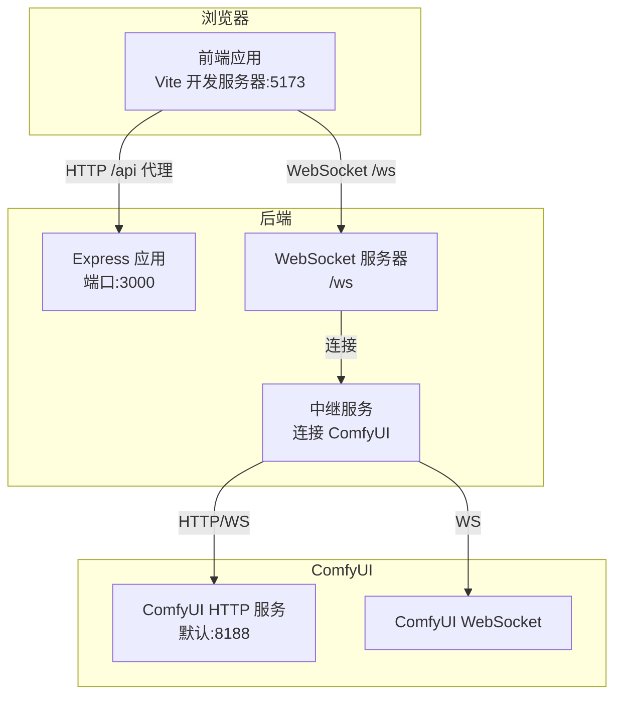
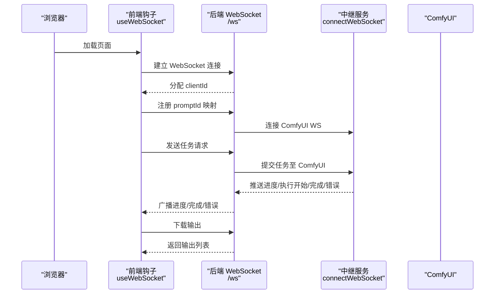
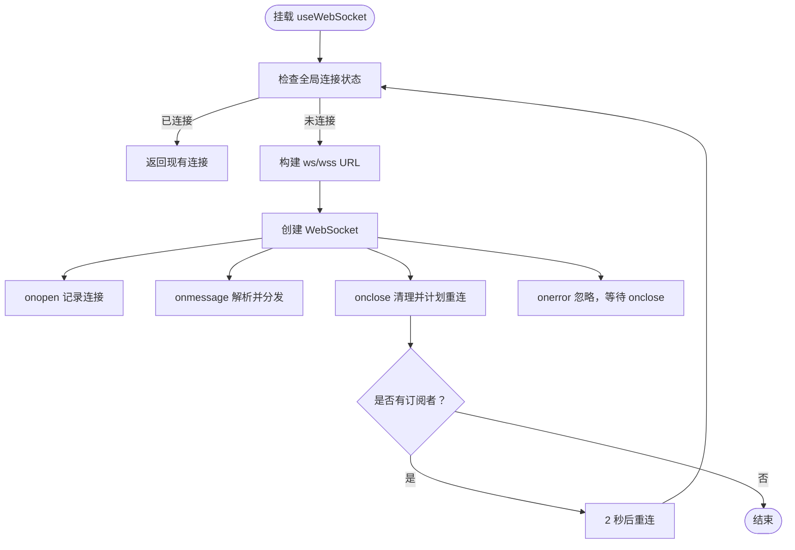
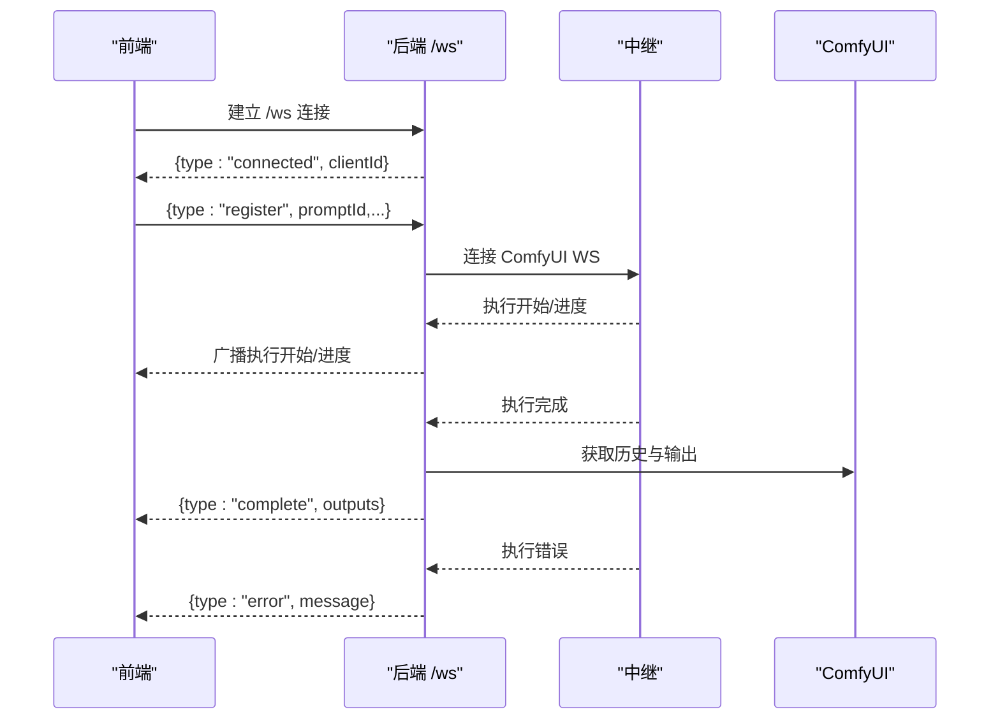
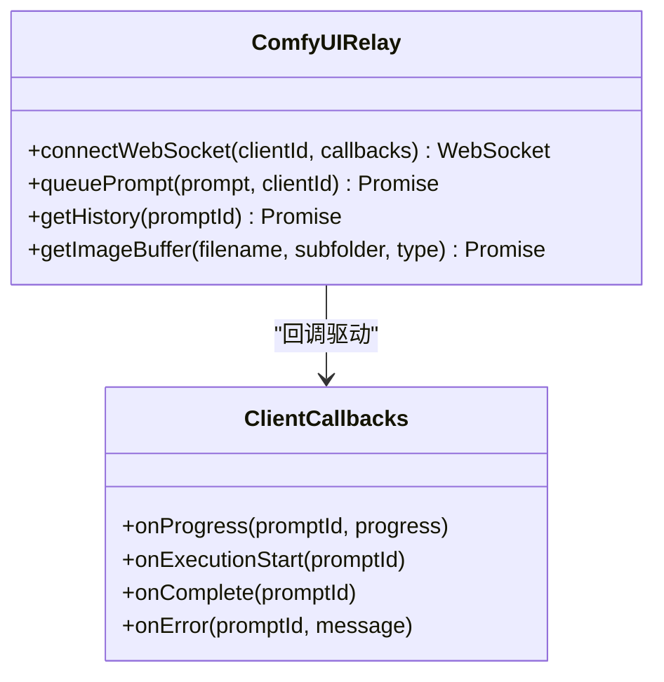
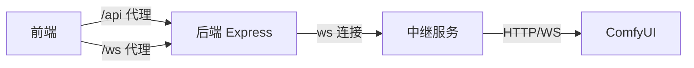

# 连接与通信问题

<cite>
**本文引用的文件**
- [useWebSocket.ts](file://client/src/hooks/useWebSocket.ts)
- [index.ts](file://server/src/index.ts)
- [comfyui.ts](file://server/src/services/comfyui.ts)
- [vite.config.ts](file://client/vite.config.ts)
- [index.ts（类型定义）](file://client/src/types/index.ts)
- [App.tsx](file://client/src/components/App.tsx)
- [session.ts](file://server/src/routes/session.ts)
- [sessionManager.ts](file://server/src/services/sessionManager.ts)
- [start.bat](file://start.bat)
- [debug.bat](file://debug.bat)
- [stop.bat](file://stop.bat)
</cite>

## 目录
1. [简介](#简介)
2. [项目结构](#项目结构)
3. [核心组件](#核心组件)
4. [架构总览](#架构总览)
5. [详细组件分析](#详细组件分析)
6. [依赖关系分析](#依赖关系分析)
7. [性能考量](#性能考量)
8. [故障排除指南](#故障排除指南)
9. [结论](#结论)
10. [附录](#附录)

## 简介
本指南聚焦于 ComfyUI 相关前端与后端之间的连接与 WebSocket 通信问题，覆盖服务连接失败、网络与防火墙、服务未启动、IP 绑定、WebSocket 超时与协议不匹配、代理配置、跨域与 SSL 证书、心跳与重连机制等常见问题，并提供可操作的诊断步骤、错误解读与修复建议。

## 项目结构
该项目采用前后端分离架构：
- 前端使用 React + Vite，通过本地代理将 /api 请求转发到后端，WebSocket 通过 /ws 路径建立连接。
- 后端基于 Express + ws，提供 REST API 与 WebSocket 服务，同时作为中继连接 ComfyUI 的 HTTP 与 WebSocket。

图表来源
- [index.ts:42-63](file://server/src/index.ts#L42-L63)
- [vite.config.ts:6-18](file://client/vite.config.ts#L6-L18)
- [comfyui.ts:6-7](file://server/src/services/comfyui.ts#L6-L7)

章节来源
- [index.ts:42-63](file://server/src/index.ts#L42-L63)
- [vite.config.ts:6-19](file://client/vite.config.ts#L6-L19)

## 核心组件
- 前端 WebSocket 钩子：负责单例连接、自动重连、消息分发与发送。
- 后端 WebSocket 服务器：分配 clientId、向客户端广播进度/完成/错误事件、下载输出并持久化。
- 中继服务：连接 ComfyUI 的 HTTP 与 WebSocket，桥接进度与结果。
- Vite 代理：将 /api 与 /ws 代理到后端，便于开发环境跨域与协议适配。
- 类型系统：统一前后端 WebSocket 消息格式，确保解析与处理一致性。

章节来源
- [useWebSocket.ts:1-98](file://client/src/hooks/useWebSocket.ts#L1-L98)
- [index.ts:73-219](file://server/src/index.ts#L73-L219)
- [comfyui.ts:127-188](file://server/src/services/comfyui.ts#L127-L188)
- [vite.config.ts:6-19](file://client/vite.config.ts#L6-L19)
- [index.ts（类型定义）:27-57](file://client/src/types/index.ts#L27-L57)

## 架构总览
下图展示从浏览器到后端再到 ComfyUI 的完整链路，以及消息流转与错误传播路径。

图表来源
- [useWebSocket.ts:18-73](file://client/src/hooks/useWebSocket.ts#L18-L73)
- [index.ts:73-219](file://server/src/index.ts#L73-L219)
- [comfyui.ts:127-188](file://server/src/services/comfyui.ts#L127-L188)

## 详细组件分析

### 前端 WebSocket 钩子（useWebSocket）
- 单例连接：全局维护一个 WebSocket 实例，避免重复连接；根据当前协议自动选择 ws/wss。
- 自动重连：断开后延迟重连，仅当存在订阅者时触发。
- 消息分发：解析 JSON 消息，按类型更新工作区状态（连接、执行开始、进度、完成、错误）。
- 发送封装：仅在连接打开时发送消息。

图表来源
- [useWebSocket.ts:10-73](file://client/src/hooks/useWebSocket.ts#L10-L73)

章节来源
- [useWebSocket.ts:1-98](file://client/src/hooks/useWebSocket.ts#L1-L98)
- [index.ts（类型定义）:27-57](file://client/src/types/index.ts#L27-L57)

### 后端 WebSocket 服务器（/ws）
- 分配 clientId：为每个新连接生成唯一标识并立即通知前端。
- 事件缓冲与重放：对每个 promptId 缓存最近事件，若客户端注册较晚可重放。
- 完成处理：拉取 ComfyUI 历史与输出，保存到会话目录，回传输出列表。
- 错误处理：捕获执行错误并向前端广播。
- 关闭清理：客户端断开时关闭对应 ComfyUI 连接。

图表来源
- [index.ts:73-219](file://server/src/index.ts#L73-L219)
- [comfyui.ts:127-188](file://server/src/services/comfyui.ts#L127-L188)

章节来源
- [index.ts:73-219](file://server/src/index.ts#L73-L219)

### 中继服务（连接 ComfyUI）
- HTTP 与 WebSocket：通过固定地址连接 ComfyUI 的 HTTP 与 WebSocket。
- 事件映射：将 ComfyUI 的 progress/executing 等事件转换为前端可用的消息格式。
- 错误上报：将执行错误透传给前端。

图表来源
- [comfyui.ts:127-188](file://server/src/services/comfyui.ts#L127-L188)

章节来源
- [comfyui.ts:6-285](file://server/src/services/comfyui.ts#L6-L285)

### Vite 代理与跨域
- /api 代理到后端 HTTP 服务，支持跨域与变更源。
- /ws 代理到后端 WebSocket 服务，允许 WebSocket 代理。
- 本地开发默认使用 http://localhost:5173，代理目标为 http://localhost:3000。

章节来源
- [vite.config.ts:6-19](file://client/vite.config.ts#L6-L19)

### 类型系统（WebSocket 消息）
- 统一定义了连接、执行开始、进度、完成、错误等消息类型，确保前后端一致解析。

章节来源
- [index.ts（类型定义）:27-57](file://client/src/types/index.ts#L27-L57)

## 依赖关系分析
- 前端依赖：React、Zustand（状态）、ws（WebSocket）。
- 后端依赖：Express、ws、cors、multer、node-fetch。
- 代理依赖：Vite dev server 代理 /api 与 /ws。

图表来源
- [vite.config.ts:6-19](file://client/vite.config.ts#L6-L19)
- [index.ts:42-63](file://server/src/index.ts#L42-L63)
- [comfyui.ts:6-7](file://server/src/services/comfyui.ts#L6-L7)

章节来源
- [package.json（前端）:11-23](file://client/package.json#L11-L23)
- [package.json（后端）:11-26](file://server/package.json#L11-L26)

## 性能考量
- 事件缓冲：后端对每个 promptId 缓存最近事件，减少客户端丢失，但需控制缓冲大小以避免内存膨胀。
- 进度计算：后端将 ComfyUI 的数值进度转换为百分比，前端仅渲染百分比，降低数据体积。
- 输出下载：完成后异步下载并保存到会话目录，避免阻塞主流程。
- 重连策略：前端断线重连间隔固定，可考虑指数退避以减轻服务压力。

[本节为通用指导，无需列出具体文件来源]

## 故障排除指南

### 一、服务连接失败
常见症状
- 页面无法加载或白屏
- 控制台出现网络错误或跨域错误
- WebSocket 连接立即断开

排查步骤
1. 确认后端服务已启动且监听端口
   - 默认端口：3000
   - 启动脚本参考：[start.bat:35-42](file://start.bat#L35-L42)，[debug.bat:35-42](file://debug.bat#L35-L42)
2. 检查端口占用与释放
   - 使用脚本释放端口：[start.bat:10-20](file://start.bat#L10-L20)，[stop.bat:12-27](file://stop.bat#L12-L27)
3. 检查防火墙/安全软件是否拦截 3000/5173
4. 浏览器访问后端健康端点验证
   - 示例：GET http://localhost:3000/api/workflow/system-stats（如接口存在）

修复建议
- 若端口被占用，先释放再重启服务
- 防火墙放行 3000/5173
- 使用脚本一键启动：[start.bat:35-42](file://start.bat#L35-L42)

章节来源
- [start.bat:10-20](file://start.bat#L10-L20)
- [debug.bat:10-20](file://debug.bat#L10-L20)
- [stop.bat:12-27](file://stop.bat#L12-L27)

### 二、WebSocket 连接失败与超时
常见症状
- 控制台打印“Disconnected”
- 连续重连但始终无法建立连接
- 页面无进度更新

排查步骤
1. 确认前端 WebSocket URL 与协议
   - 前端自动根据当前协议选择 ws/wss，并指向 /ws
   - 参考：[useWebSocket.ts:18-19](file://client/src/hooks/useWebSocket.ts#L18-L19)
2. 检查代理配置
   - Vite 代理 /ws 到 ws://localhost:3000
   - 参考：[vite.config.ts:13-16](file://client/vite.config.ts#L13-L16)
3. 检查后端 /ws 路径与端口
   - 后端监听 /ws，端口 3000
   - 参考：[index.ts](file://server/src/index.ts#L63)
4. 查看后端日志中的连接与断开信息
   - 参考：[index.ts:75-78](file://server/src/index.ts#L75-L78)

修复建议
- 如使用 HTTPS，请确保代理与后端均支持 wss
- 确保代理 /ws 正确启用 ws: true
- 避免在同一页面多实例重复连接（单例已内置）

章节来源
- [useWebSocket.ts:18-19](file://client/src/hooks/useWebSocket.ts#L18-L19)
- [vite.config.ts:13-16](file://client/vite.config.ts#L13-L16)
- [index.ts](file://server/src/index.ts#L63)

### 三、协议不匹配与代理配置错误
常见症状
- WebSocket 握手失败
- 代理报错或无法升级到 WebSocket

排查步骤
1. 确认浏览器协议与代理配置一致
   - https 页面应使用 wss，http 页面使用 ws
   - 参考：[useWebSocket.ts](file://client/src/hooks/useWebSocket.ts#L18)
2. 检查 Vite 代理是否启用 ws
   - 参考：[vite.config.ts:13-16](file://client/vite.config.ts#L13-L16)
3. 检查后端 ws 服务器是否正确监听
   - 参考：[index.ts](file://server/src/index.ts#L63)

修复建议
- 在代理中明确开启 ws: true
- 如需反向代理（Nginx/Apache），确保升级头与路径配置正确

章节来源
- [useWebSocket.ts](file://client/src/hooks/useWebSocket.ts#L18)
- [vite.config.ts:13-16](file://client/vite.config.ts#L13-L16)
- [index.ts](file://server/src/index.ts#L63)

### 四、跨域与 SSL 证书问题
常见症状
- CORS 报错
- Mixed Content 或证书不受信任

排查步骤
1. 检查后端 CORS 配置
   - 允许的源包含 http://localhost:5173
   - 参考：[index.ts:46-49](file://server/src/index.ts#L46-L49)
2. 检查前端代理是否启用 changeOrigin
   - 参考：[vite.config.ts](file://client/vite.config.ts#L11)
3. HTTPS 环境下的 wss 与证书
   - 确保代理与后端均支持 wss
   - 证书需受浏览器信任

修复建议
- 将实际域名加入 CORS 白名单
- 使用受信证书或自签证书并正确安装
- 保持 ws 与 wss 协议一致性

章节来源
- [index.ts:46-49](file://server/src/index.ts#L46-L49)
- [vite.config.ts](file://client/vite.config.ts#L11)

### 五、连接状态检查、心跳与重连机制
- 连接状态检查
  - 前端通过 readyState 判断连接状态
  - 参考：[useWebSocket.ts:92-94](file://client/src/hooks/useWebSocket.ts#L92-L94)
- 心跳检测
  - 当前实现未内置心跳；可在业务层增加 ping/pong 或利用底层 TCP 心跳
- 重连机制
  - 断开后 2 秒重连，仅当存在订阅者时触发
  - 参考：[useWebSocket.ts:58-64](file://client/src/hooks/useWebSocket.ts#L58-L64)

建议
- 增加心跳：每 30 秒发送 ping，超时则主动断开并触发重连
- 指数退避：重连间隔逐步增大，避免雪崩

章节来源
- [useWebSocket.ts:58-64](file://client/src/hooks/useWebSocket.ts#L58-L64)
- [useWebSocket.ts:92-94](file://client/src/hooks/useWebSocket.ts#L92-L94)

### 六、ComfyUI 服务未启动或地址错误
常见症状
- 后端连接 ComfyUI 失败
- 任务提交/进度/输出获取异常

排查步骤
1. 确认 ComfyUI 已启动并监听默认端口（8188）
   - 后端默认连接地址：http://127.0.0.1:8188 与 ws://127.0.0.1:8188
   - 参考：[comfyui.ts:6-7](file://server/src/services/comfyui.ts#L6-L7)
2. 检查防火墙与网络策略
3. 替换为实际运行地址（如容器/远程）

修复建议
- 修改后端连接地址常量或通过环境变量注入
- 使用 Docker/Compose 时确保端口映射与网络可达

章节来源
- [comfyui.ts:6-7](file://server/src/services/comfyui.ts#L6-L7)

### 七、IP 地址绑定问题
常见症状
- 本地可访问，局域网/外网不可达
- 代理或反向代理无法转发

排查步骤
1. 检查后端监听地址
   - 默认监听 localhost，可能限制外网访问
   - 可通过环境变量或修改监听地址
2. 检查代理与反向代理配置
   - 确保路径与主机头正确

修复建议
- 将监听地址改为 0.0.0.0 或指定内网 IP
- 在反向代理中保留 Host 头并正确转发

章节来源
- [index.ts:221-227](file://server/src/index.ts#L221-L227)

### 八、错误代码与消息解读
- 前端 WebSocket
  - 断开：控制台打印“Disconnected”，随后尝试重连
  - 参考：[useWebSocket.ts:53-65](file://client/src/hooks/useWebSocket.ts#L53-L65)
- 后端 WebSocket
  - 客户端连接/断开日志：分配 clientId、记录断开
  - 参考：[index.ts:75-78](file://server/src/index.ts#L75-L78)
- ComfyUI 中继
  - 执行错误：透传 exception_message 或“未知错误”
  - 参考：[comfyui.ts:175-177](file://server/src/services/comfyui.ts#L175-L177)

修复建议
- 根据错误类型定位：网络/权限/模型/资源不足
- 在前端显示用户可读的错误摘要

章节来源
- [useWebSocket.ts:53-65](file://client/src/hooks/useWebSocket.ts#L53-L65)
- [index.ts:75-78](file://server/src/index.ts#L75-L78)
- [comfyui.ts:175-177](file://server/src/services/comfyui.ts#L175-L177)

### 九、输出下载与会话存储
- 完成事件后，后端会拉取 ComfyUI 输出并保存到会话目录
- 前端通过 /api/session-files 访问
- 参考：
  - [index.ts:112-152](file://server/src/index.ts#L112-L152)
  - [sessionManager.ts:34-44](file://server/src/services/sessionManager.ts#L34-L44)
  - [session.ts:18-33](file://server/src/routes/session.ts#L18-L33)

章节来源
- [index.ts:112-152](file://server/src/index.ts#L112-L152)
- [sessionManager.ts:34-44](file://server/src/services/sessionManager.ts#L34-L44)
- [session.ts:18-33](file://server/src/routes/session.ts#L18-L33)

## 结论
本指南从架构与实现角度梳理了连接与通信的关键点，围绕前端单例连接、后端 /ws 事件中继、代理与跨域、ComfyUI 连接等维度提供了系统化的诊断与修复路径。建议在生产环境中补充心跳、指数退避重连、CORS 白名单与证书管理，并结合日志与监控持续优化稳定性。

[本节为总结性内容，无需列出具体文件来源]

## 附录

### A. 常见启动与停止脚本
- 启动：先启动后端，再启动前端，最后打开浏览器
  - 参考：[start.bat:35-48](file://start.bat#L35-L48)
- 调试：自动释放端口并启动
  - 参考：[debug.bat:35-48](file://debug.bat#L35-L48)
- 停止：释放端口
  - 参考：[stop.bat:12-27](file://stop.bat#L12-L27)

章节来源
- [start.bat:35-48](file://start.bat#L35-L48)
- [debug.bat:35-48](file://debug.bat#L35-L48)
- [stop.bat:12-27](file://stop.bat#L12-L27)