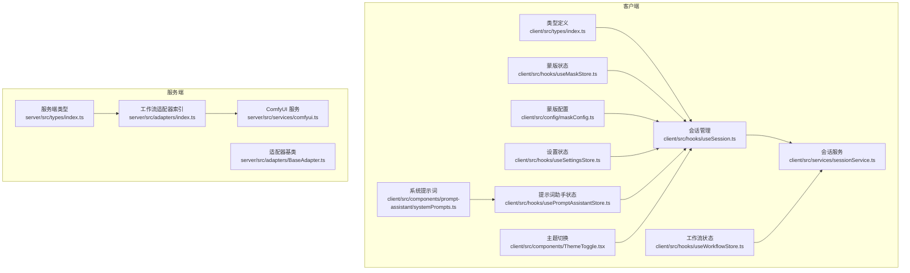
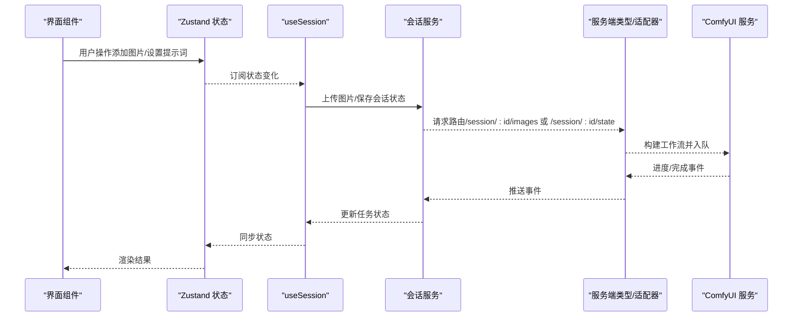
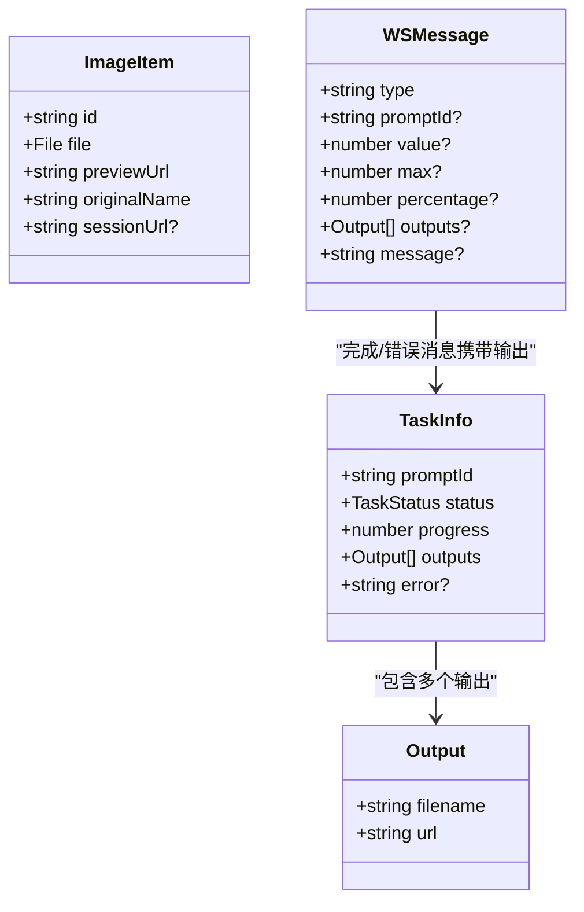
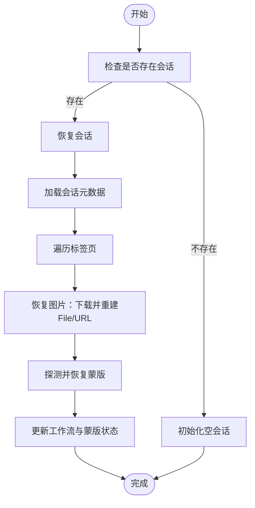
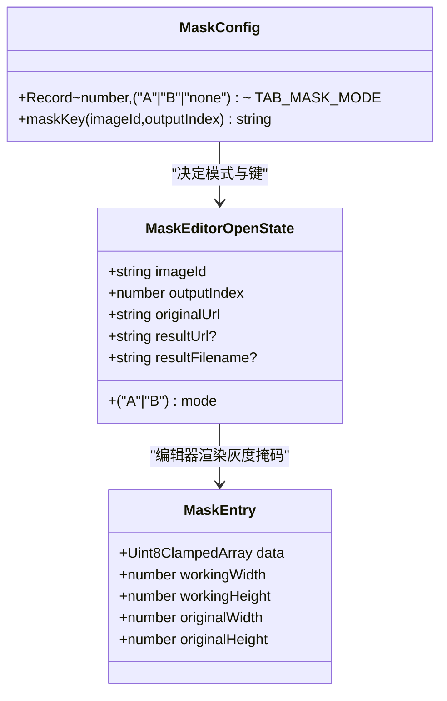
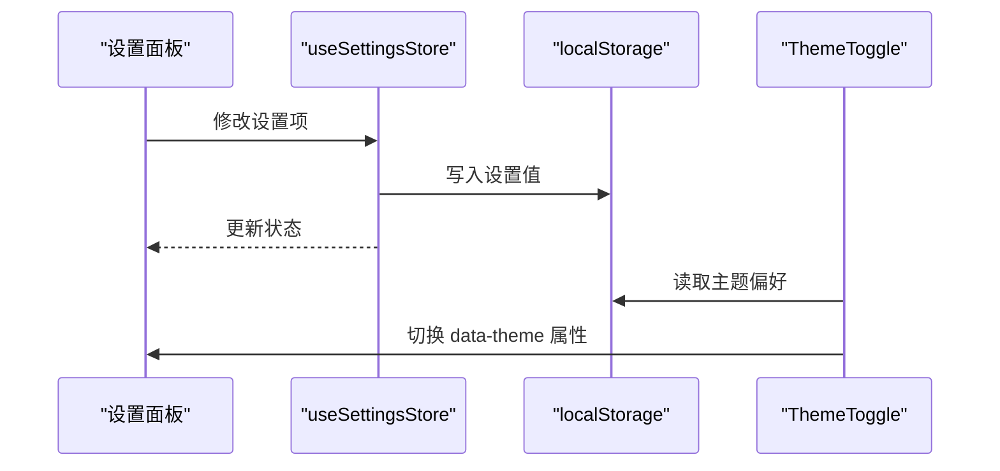
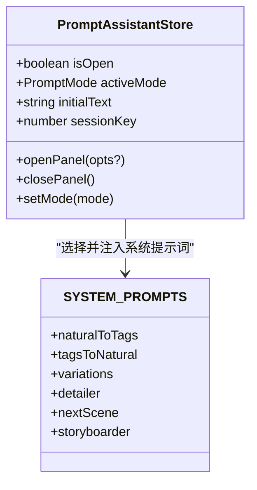
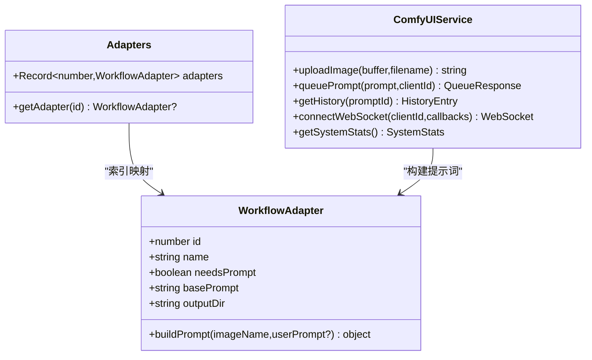
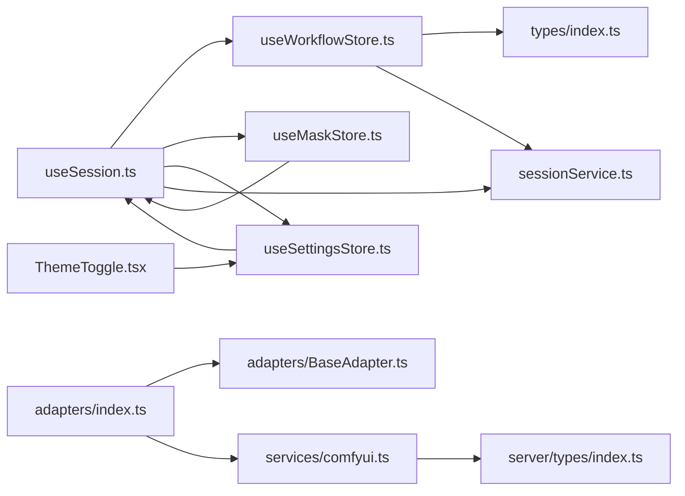

# 数据模型与类型定义

<cite>
**本文引用的文件**
- [client/src/types/index.ts](file://client/src/types/index.ts)
- [server/src/types/index.ts](file://server/src/types/index.ts)
- [client/src/hooks/useSession.ts](file://client/src/hooks/useSession.ts)
- [client/src/hooks/useWorkflowStore.ts](file://client/src/hooks/useWorkflowStore.ts)
- [client/src/hooks/useMaskStore.ts](file://client/src/hooks/useMaskStore.ts)
- [client/src/services/sessionService.ts](file://client/src/services/sessionService.ts)
- [client/src/config/maskConfig.ts](file://client/src/config/maskConfig.ts)
- [client/src/hooks/useSettingsStore.ts](file://client/src/hooks/useSettingsStore.ts)
- [client/src/hooks/usePromptAssistantStore.ts](file://client/src/hooks/usePromptAssistantStore.ts)
- [client/src/components/prompt-assistant/systemPrompts.ts](file://client/src/components/prompt-assistant/systemPrompts.ts)
- [client/src/components/ThemeToggle.tsx](file://client/src/components/ThemeToggle.tsx)
- [server/src/adapters/index.ts](file://server/src/adapters/index.ts)
- [server/src/adapters/BaseAdapter.ts](file://server/src/adapters/BaseAdapter.ts)
- [server/src/services/comfyui.ts](file://server/src/services/comfyui.ts)
</cite>

## 目录
1. [简介](#简介)
2. [项目结构](#项目结构)
3. [核心组件](#核心组件)
4. [架构总览](#架构总览)
5. [详细组件分析](#详细组件分析)
6. [依赖分析](#依赖分析)
7. [性能考量](#性能考量)
8. [故障排查指南](#故障排查指南)
9. [结论](#结论)
10. [附录](#附录)

## 简介
本文件面向 CorineKit Pix2Real 的前端与服务端，系统性梳理数据模型与类型定义，涵盖：
- 图像项模型、任务信息模型、会话状态模型等核心实体及其关系
- TypeScript 类型系统应用：接口、联合类型、字面量类型、泛型与工具类型
- 配置与设置系统：蒙版配置、系统设置、主题配置
- 数据验证与业务规则：数据访问模式、缓存策略、性能优化建议
- 类型使用示例与最佳实践

## 项目结构
本项目采用前后端分离架构，前端使用 React + Zustand 状态管理，服务端基于 Node.js 与 ComfyUI 工作流引擎。数据模型主要分布在客户端类型与服务端类型文件中，并通过会话服务进行持久化与恢复。

图表来源
- [client/src/types/index.ts:1-58](file://client/src/types/index.ts#L1-L58)
- [client/src/hooks/useSession.ts:1-422](file://client/src/hooks/useSession.ts#L1-L422)
- [client/src/hooks/useWorkflowStore.ts:1-645](file://client/src/hooks/useWorkflowStore.ts#L1-L645)
- [client/src/hooks/useMaskStore.ts:1-51](file://client/src/hooks/useMaskStore.ts#L1-L51)
- [client/src/services/sessionService.ts:1-134](file://client/src/services/sessionService.ts#L1-L134)
- [client/src/config/maskConfig.ts:1-20](file://client/src/config/maskConfig.ts#L1-L20)
- [client/src/hooks/useSettingsStore.ts:1-31](file://client/src/hooks/useSettingsStore.ts#L1-L31)
- [client/src/hooks/usePromptAssistantStore.ts:1-33](file://client/src/hooks/usePromptAssistantStore.ts#L1-L33)
- [client/src/components/prompt-assistant/systemPrompts.ts:1-145](file://client/src/components/prompt-assistant/systemPrompts.ts#L1-L145)
- [client/src/components/ThemeToggle.tsx:1-38](file://client/src/components/ThemeToggle.tsx#L1-L38)
- [server/src/types/index.ts:1-52](file://server/src/types/index.ts#L1-L52)
- [server/src/adapters/index.ts:1-31](file://server/src/adapters/index.ts#L1-L31)
- [server/src/adapters/BaseAdapter.ts:1-4](file://server/src/adapters/BaseAdapter.ts#L1-L4)
- [server/src/services/comfyui.ts:1-285](file://server/src/services/comfyui.ts#L1-L285)

章节来源
- [client/src/types/index.ts:1-58](file://client/src/types/index.ts#L1-L58)
- [server/src/types/index.ts:1-52](file://server/src/types/index.ts#L1-L52)

## 核心组件
本节从类型层面解析核心数据模型与状态结构。

- 图像项模型（ImageItem）
  - 字段：标识、原始文件、预览 URL、原始名称、会话存储 URL（可选）
  - 用途：承载单张输入图片的元数据与生命周期状态
  - 关联：会话恢复时重建 File 对象与预览 URL；上传成功后回填 sessionUrl

- 任务信息模型（TaskInfo）
  - 字段：promptId、状态（枚举）、进度百分比、输出列表、错误信息（可选）
  - 状态机：idle → uploading → queued → processing → done/error
  - 用途：跟踪每张图片的生成任务生命周期

- 会话状态模型（SessionData）
  - 字段：sessionId、创建时间、更新时间、当前标签页、各标签页序列化数据
  - 序列化：仅保存可序列化字段，避免 File 对象进入持久化

- 蒙版模型（MaskEntry）
  - 字段：原始 RGBA 像素数组、工作分辨率、原图分辨率
  - 用途：在编辑器中以灰度掩码形式存储与传输

- 设置模型（SettingsState）
  - 字段：反向提示词模型、启动行为、设置面板开关
  - 存储：本地持久化（localStorage），状态同步

- 工作流适配器接口（WorkflowAdapter）
  - 字段：id、name、是否需要提示词、基础提示词、输出目录、构建提示词方法
  - 用途：统一不同工作流的参数与提示词构建逻辑

章节来源
- [client/src/types/index.ts:1-58](file://client/src/types/index.ts#L1-L58)
- [client/src/services/sessionService.ts:61-67](file://client/src/services/sessionService.ts#L61-L67)
- [client/src/hooks/useMaskStore.ts:4-10](file://client/src/hooks/useMaskStore.ts#L4-L10)
- [client/src/hooks/useSettingsStore.ts:6-14](file://client/src/hooks/useSettingsStore.ts#L6-L14)
- [server/src/types/index.ts:1-8](file://server/src/types/index.ts#L1-L8)

## 架构总览
下图展示客户端与服务端之间的数据流与类型映射关系。

图表来源
- [client/src/hooks/useSession.ts:164-175](file://client/src/hooks/useSession.ts#L164-L175)
- [client/src/services/sessionService.ts:71-85](file://client/src/services/sessionService.ts#L71-L85)
- [client/src/services/sessionService.ts:103-113](file://client/src/services/sessionService.ts#L103-L113)
- [server/src/services/comfyui.ts:47-60](file://server/src/services/comfyui.ts#L47-L60)
- [server/src/types/index.ts:10-30](file://server/src/types/index.ts#L10-L30)

## 详细组件分析

### 图像项与任务模型
- 设计要点
  - 使用字面量联合类型限定任务状态，确保状态转换的确定性
  - 输出列表采用泛型数组结构，便于扩展不同类型的输出（如图片、GIF）
  - 会话 URL 在上传成功后回填，用于后续恢复与下载

图表来源
- [client/src/types/index.ts:1-58](file://client/src/types/index.ts#L1-L58)

章节来源
- [client/src/types/index.ts:1-58](file://client/src/types/index.ts#L1-L58)

### 会话状态与序列化
- 设计要点
  - 会话状态按标签页维度序列化，避免存储不可序列化对象（如 File）
  - 支持增量保存与防抖，减少网络请求频率
  - 恢复流程：先拉取会话元数据，再逐标签页恢复图片与蒙版

图表来源
- [client/src/hooks/useSession.ts:305-387](file://client/src/hooks/useSession.ts#L305-L387)
- [client/src/services/sessionService.ts:116-121](file://client/src/services/sessionService.ts#L116-L121)

章节来源
- [client/src/hooks/useSession.ts:137-181](file://client/src/hooks/useSession.ts#L137-L181)
- [client/src/hooks/useSession.ts:305-387](file://client/src/hooks/useSession.ts#L305-L387)
- [client/src/services/sessionService.ts:116-121](file://client/src/services/sessionService.ts#L116-L121)

### 蒙版配置与编辑器状态
- 设计要点
  - 蒙版模式字典：根据工作流编号映射到 A/B 模式或无模式
  - 蒙版键生成：imageId 与输出索引组合，保证唯一性
  - 编辑器状态：区分 A 模式（覆盖）与 B 模式（实时混合），记录结果 URL 与默认导出名

图表来源
- [client/src/hooks/useMaskStore.ts:4-19](file://client/src/hooks/useMaskStore.ts#L4-L19)
- [client/src/config/maskConfig.ts:3-19](file://client/src/config/maskConfig.ts#L3-L19)

章节来源
- [client/src/hooks/useMaskStore.ts:1-51](file://client/src/hooks/useMaskStore.ts#L1-L51)
- [client/src/config/maskConfig.ts:1-20](file://client/src/config/maskConfig.ts#L1-L20)

### 设置系统与主题配置
- 设计要点
  - 设置项：反向提示词模型、启动行为、设置面板开关
  - 本地持久化：localStorage 读写，Zustand 状态同步
  - 主题切换：通过 data-theme 属性切换明暗主题，持久化到 localStorage

图表来源
- [client/src/hooks/useSettingsStore.ts:16-30](file://client/src/hooks/useSettingsStore.ts#L16-L30)
- [client/src/components/ThemeToggle.tsx:5-17](file://client/src/components/ThemeToggle.tsx#L5-L17)

章节来源
- [client/src/hooks/useSettingsStore.ts:1-31](file://client/src/hooks/useSettingsStore.ts#L1-L31)
- [client/src/components/ThemeToggle.tsx:1-38](file://client/src/components/ThemeToggle.tsx#L1-L38)

### 提示词助手与系统提示词
- 设计要点
  - 提示词助手状态：面板开关、活动模式、初始文本、会话键
  - 模式枚举：转换、变体、细节、后续场景、分镜、标签组装
  - 系统提示词：针对不同模式的严格指令模板，确保输出质量与一致性

图表来源
- [client/src/hooks/usePromptAssistantStore.ts:5-13](file://client/src/hooks/usePromptAssistantStore.ts#L5-L13)
- [client/src/components/prompt-assistant/systemPrompts.ts:4-144](file://client/src/components/prompt-assistant/systemPrompts.ts#L4-L144)

章节来源
- [client/src/hooks/usePromptAssistantStore.ts:1-33](file://client/src/hooks/usePromptAssistantStore.ts#L1-L33)
- [client/src/components/prompt-assistant/systemPrompts.ts:1-145](file://client/src/components/prompt-assistant/systemPrompts.ts#L1-L145)

### 工作流适配器与 ComfyUI 集成
- 设计要点
  - 适配器接口：统一工作流参数与提示词构建
  - 适配器索引：按工作流编号映射具体适配器
  - ComfyUI 服务：封装上传、入队、历史查询、WebSocket 事件订阅、系统统计等

图表来源
- [server/src/types/index.ts:1-8](file://server/src/types/index.ts#L1-L8)
- [server/src/adapters/index.ts:13-28](file://server/src/adapters/index.ts#L13-L28)
- [server/src/services/comfyui.ts:47-60](file://server/src/services/comfyui.ts#L47-L60)

章节来源
- [server/src/adapters/index.ts:1-31](file://server/src/adapters/index.ts#L1-L31)
- [server/src/adapters/BaseAdapter.ts:1-4](file://server/src/adapters/BaseAdapter.ts#L1-L4)
- [server/src/services/comfyui.ts:1-285](file://server/src/services/comfyui.ts#L1-L285)

## 依赖分析
- 客户端内部依赖
  - useSession 依赖 useWorkflowStore、useMaskStore、useSettingsStore、sessionService
  - useWorkflowStore 依赖 types 与 sessionService 的序列化类型
  - useMaskStore 依赖 useSession 的蒙版上传与恢复
  - useSettingsStore 与 ThemeToggle 共同影响 UI 主题与启动行为
  - usePromptAssistantStore 依赖 systemPrompts

- 服务端依赖
  - adapters/index 统一导出适配器集合与工厂函数
  - services/comfyui 与 types/index 协作，处理 WebSocket 事件与输出文件结构

图表来源
- [client/src/hooks/useSession.ts:4-16](file://client/src/hooks/useSession.ts#L4-L16)
- [client/src/hooks/useWorkflowStore.ts:1-4](file://client/src/hooks/useWorkflowStore.ts#L1-L4)
- [client/src/hooks/useMaskStore.ts:1-2](file://client/src/hooks/useMaskStore.ts#L1-L2)
- [client/src/hooks/useSettingsStore.ts:1](file://client/src/hooks/useSettingsStore.ts#L1)
- [client/src/components/ThemeToggle.tsx:1](file://client/src/components/ThemeToggle.tsx#L1)
- [server/src/adapters/index.ts:1-2](file://server/src/adapters/index.ts#L1-L2)
- [server/src/adapters/BaseAdapter.ts:1](file://server/src/adapters/BaseAdapter.ts#L1)
- [server/src/services/comfyui.ts:1-4](file://server/src/services/comfyui.ts#L1-L4)
- [server/src/types/index.ts:1](file://server/src/types/index.ts#L1)

章节来源
- [client/src/hooks/useSession.ts:4-16](file://client/src/hooks/useSession.ts#L4-L16)
- [server/src/adapters/index.ts:1-31](file://server/src/adapters/index.ts#L1-L31)

## 性能考量
- 序列化与持久化
  - 仅序列化必要字段，避免 File 对象进入 JSON，降低体积与序列化开销
  - 防抖保存：500ms 冷却窗口，合并频繁变更
- 图片与蒙版处理
  - 图片上传采用 FormData，避免大对象直接序列化
  - 蒙版以灰度 PNG 二进制形式传输，减少冗余
- WebSocket 事件
  - 连接复用，去重执行开始与完成事件，避免重复处理
  - 系统统计定期轮询，避免阻塞主线程

[本节为通用性能建议，不直接分析特定文件]

## 故障排查指南
- 会话恢复失败
  - 检查 sessionService 的 getSession 返回值与状态码
  - 确认图片与蒙版路径拼接正确，HEAD 请求探测可用性
- 任务状态异常
  - 核对 WebSocket 事件类型与 promptId 映射
  - 检查任务状态机转换逻辑，确保错误状态不会被覆盖
- 蒙版上传失败
  - 确认 maskKey 生成规则与上传接口参数一致
  - 检查 Blob 转换与 FormData 构造过程
- 设置与主题问题
  - localStorage 中的设置项与 data-theme 属性是否同步
  - ThemeToggle 是否在挂载时读取并写入 localStorage

章节来源
- [client/src/services/sessionService.ts:116-121](file://client/src/services/sessionService.ts#L116-L121)
- [client/src/hooks/useSession.ts:350-360](file://client/src/hooks/useSession.ts#L350-L360)
- [server/src/services/comfyui.ts:143-181](file://server/src/services/comfyui.ts#L143-L181)
- [client/src/components/ThemeToggle.tsx:5-17](file://client/src/components/ThemeToggle.tsx#L5-L17)

## 结论
本项目通过严格的 TypeScript 类型体系与模块化的状态管理，实现了清晰的数据模型与可靠的运行时行为。核心设计包括：
- 以字面量联合类型约束状态与事件，提升安全性
- 将会话状态按标签页序列化，结合防抖与增量保存，平衡性能与一致性
- 通过适配器抽象工作流差异，配合 ComfyUI 事件驱动，实现可扩展的生成管线
- 设置与主题系统解耦于业务逻辑，便于维护与扩展

[本节为总结性内容，不直接分析特定文件]

## 附录
- 类型使用示例与最佳实践
  - 使用字面量联合类型定义状态机，避免魔法字符串
  - 对外暴露只读接口，内部通过状态函数修改，保持不可变性
  - 对于复杂对象（如蒙版像素），优先使用二进制格式传输
  - 本地持久化采用 localStorage + Zustand，注意键名一致性与默认值处理
  - WebSocket 事件处理应去重与容错，避免重复触发

[本节为通用指导，不直接分析特定文件]