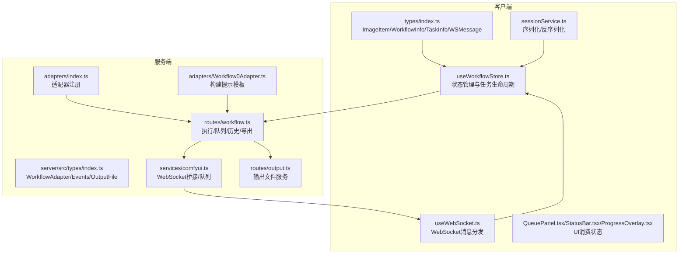
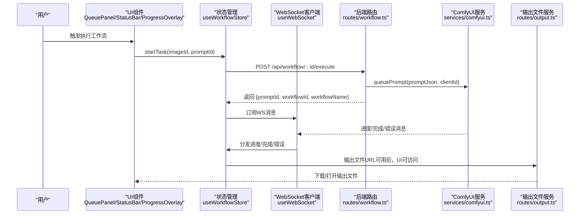
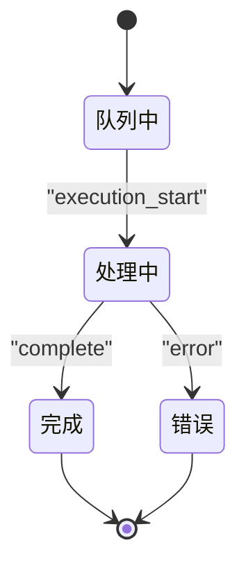
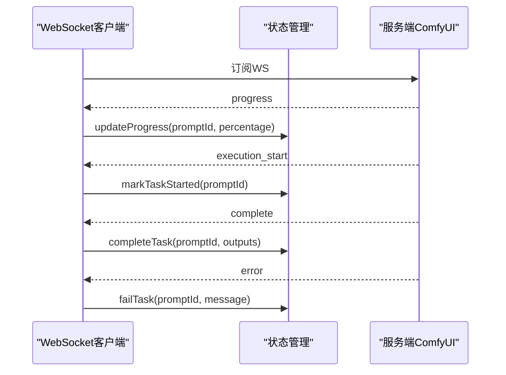
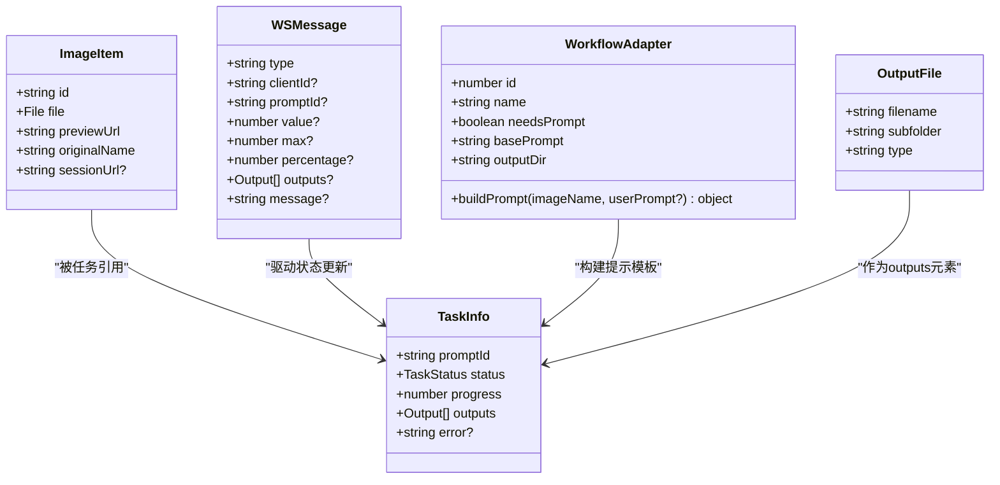

# 核心数据模型

<cite>
**本文引用的文件列表**
- [client/src/types/index.ts](file://client/src/types/index.ts)
- [server/src/types/index.ts](file://server/src/types/index.ts)
- [client/src/hooks/useWorkflowStore.ts](file://client/src/hooks/useWorkflowStore.ts)
- [client/src/hooks/useWebSocket.ts](file://client/src/hooks/useWebSocket.ts)
- [client/src/components/QueuePanel.tsx](file://client/src/components/QueuePanel.tsx)
- [client/src/components/StatusBar.tsx](file://client/src/components/StatusBar.tsx)
- [client/src/components/ProgressOverlay.tsx](file://client/src/components/ProgressOverlay.tsx)
- [client/src/services/sessionService.ts](file://client/src/services/sessionService.ts)
- [server/src/adapters/Workflow0Adapter.ts](file://server/src/adapters/Workflow0Adapter.ts)
- [server/src/adapters/index.ts](file://server/src/adapters/index.ts)
- [server/src/routes/workflow.ts](file://server/src/routes/workflow.ts)
- [server/src/services/comfyui.ts](file://server/src/services/comfyui.ts)
- [server/src/routes/output.ts](file://server/src/routes/output.ts)
</cite>

## 目录
1. [简介](#简介)
2. [项目结构与数据模型定位](#项目结构与数据模型定位)
3. [核心数据模型总览](#核心数据模型总览)
4. [架构概览](#架构概览)
5. [详细组件分析](#详细组件分析)
6. [依赖关系分析](#依赖关系分析)
7. [性能与可扩展性考量](#性能与可扩展性考量)
8. [故障排查指南](#故障排查指南)
9. [结论](#结论)
10. [附录：类型使用示例与最佳实践](#附录类型使用示例与最佳实践)

## 简介
本文件聚焦于 CorineKit Pix2Real 的核心数据模型，系统性阐述以下关键类型：
- ImageItem 图像项模型：文件属性、预览 URL、会话 URL 等字段的作用与使用场景
- WorkflowInfo 工作流信息模型：工作流 ID、名称、提示词需求等属性
- TaskInfo 任务信息模型：状态管理、进度跟踪、输出文件处理等
- WebSocket 消息类型：连接消息、进度消息、完成消息、错误消息等不同类型的格式与用途

同时给出类型使用示例、数据验证规则与最佳实践，帮助开发者在前端与后端之间建立一致的数据契约，并确保状态流转与 UI 呈现的正确性。

## 项目结构与数据模型定位
- 客户端类型定义位于 [client/src/types/index.ts](file://client/src/types/index.ts)，包含图像项、工作流信息、任务信息以及 WebSocket 消息类型。
- 服务端类型定义位于 [server/src/types/index.ts](file://server/src/types/index.ts)，包含工作流适配器接口、进度事件、完成事件、错误事件、输出文件结构等。
- 客户端状态管理与 UI 使用位于 [client/src/hooks/useWorkflowStore.ts](file://client/src/hooks/useWorkflowStore.ts)、[client/src/hooks/useWebSocket.ts](file://client/src/hooks/useWebSocket.ts)、[client/src/components/QueuePanel.tsx](file://client/src/components/QueuePanel.tsx)、[client/src/components/StatusBar.tsx](file://client/src/components/StatusBar.tsx)、[client/src/components/ProgressOverlay.tsx](file://client/src/components/ProgressOverlay.tsx)、[client/src/services/sessionService.ts](file://client/src/services/sessionService.ts)。
- 服务端工作流适配器与路由位于 [server/src/adapters/Workflow0Adapter.ts](file://server/src/adapters/Workflow0Adapter.ts)、[server/src/adapters/index.ts](file://server/src/adapters/index.ts)、[server/src/routes/workflow.ts](file://server/src/routes/workflow.ts)、[server/src/services/comfyui.ts](file://server/src/services/comfyui.ts)、[server/src/routes/output.ts](file://server/src/routes/output.ts)。

图表来源
- [client/src/types/index.ts:1-58](file://client/src/types/index.ts#L1-L58)
- [client/src/hooks/useWorkflowStore.ts:1-645](file://client/src/hooks/useWorkflowStore.ts#L1-L645)
- [client/src/hooks/useWebSocket.ts:1-78](file://client/src/hooks/useWebSocket.ts#L1-L78)
- [client/src/components/QueuePanel.tsx:99-135](file://client/src/components/QueuePanel.tsx#L99-L135)
- [client/src/components/StatusBar.tsx:44-72](file://client/src/components/StatusBar.tsx#L44-L72)
- [client/src/components/ProgressOverlay.tsx:1-53](file://client/src/components/ProgressOverlay.tsx#L1-L53)
- [client/src/services/sessionService.ts:1-60](file://client/src/services/sessionService.ts#L1-L60)
- [server/src/types/index.ts:1-52](file://server/src/types/index.ts#L1-L52)
- [server/src/adapters/index.ts:1-30](file://server/src/adapters/index.ts#L1-L30)
- [server/src/adapters/Workflow0Adapter.ts:1-35](file://server/src/adapters/Workflow0Adapter.ts#L1-L35)
- [server/src/routes/workflow.ts:1-862](file://server/src/routes/workflow.ts#L1-L862)
- [server/src/services/comfyui.ts:124-153](file://server/src/services/comfyui.ts#L124-L153)
- [server/src/routes/output.ts:46-88](file://server/src/routes/output.ts#L46-L88)

章节来源
- [client/src/types/index.ts:1-58](file://client/src/types/index.ts#L1-L58)
- [server/src/types/index.ts:1-52](file://server/src/types/index.ts#L1-L52)

## 核心数据模型总览
本节对三个核心模型进行概述，后续章节将逐项展开。

- ImageItem（图像项）
  - 字段：id、file、previewUrl、originalName、sessionUrl?
  - 作用：描述单张输入图像的状态与资源；用于 UI 预览、上传、会话持久化与恢复。
- WorkflowInfo（工作流信息）
  - 字段：id、name、needsPrompt、basePrompt
  - 作用：描述工作流的元信息，决定是否需要用户提示词以及默认提示词。
- TaskInfo（任务信息）
  - 字段：promptId、status、progress、outputs、error?
  - 作用：描述一次任务的生命周期状态、进度百分比、输出文件集合与错误信息。

章节来源
- [client/src/types/index.ts:1-25](file://client/src/types/index.ts#L1-L25)
- [server/src/types/index.ts:1-52](file://server/src/types/index.ts#L1-L52)

## 架构概览
下图展示从用户操作到 WebSocket 推送再到 UI 更新的完整流程，以及服务端工作流适配器如何参与提示模板构建与队列执行。

图表来源
- [client/src/hooks/useWorkflowStore.ts:377-499](file://client/src/hooks/useWorkflowStore.ts#L377-L499)
- [client/src/hooks/useWebSocket.ts:26-51](file://client/src/hooks/useWebSocket.ts#L26-L51)
- [server/src/routes/workflow.ts:407-455](file://server/src/routes/workflow.ts#L407-L455)
- [server/src/services/comfyui.ts:124-153](file://server/src/services/comfyui.ts#L124-L153)
- [server/src/routes/output.ts:46-88](file://server/src/routes/output.ts#L46-L88)

## 详细组件分析

### ImageItem 图像项模型
- 字段说明
  - id: 前端生成的唯一标识，用于关联任务与 UI 卡片
  - file: 原始 File 对象，用于上传与预览
  - previewUrl: 本地 Blob URL，用于图片预览
  - originalName: 原始文件名，便于 UI 展示与会话持久化
  - sessionUrl?: 会话持久化后的稳定 URL（仅在保存/恢复后存在），用于跨会话访问同一图像
- 使用场景
  - 添加图片：生成 id 与 previewUrl，保存到当前标签页的 images 列表
  - 上传：通过路由上传至 ComfyUI，得到 Comfy 文件名
  - 会话恢复：根据 sessionUrl 恢复文件对象与预览
  - 删除：撤销 previewUrl 的对象 URL 以释放内存
- 数据验证与约束
  - id 必须唯一且稳定（在当前会话内）
  - previewUrl 必须由 URL.createObjectURL(file) 生成
  - sessionUrl 在恢复后才存在，否则可为空
- 最佳实践
  - 在删除或切换标签页时及时 revokeObjectURL，避免内存泄漏
  - 会话恢复时优先使用 sessionUrl，回退到本地 file
  - UI 展示时使用 originalName，但实际下载/打开使用稳定的 sessionUrl 或后端输出 URL

章节来源
- [client/src/types/index.ts:1-8](file://client/src/types/index.ts#L1-L8)
- [client/src/hooks/useWorkflowStore.ts:197-252](file://client/src/hooks/useWorkflowStore.ts#L197-L252)
- [client/src/hooks/useSession.ts:320-344](file://client/src/hooks/useSession.ts#L320-L344)
- [client/src/components/ProgressOverlay.tsx:1-53](file://client/src/components/ProgressOverlay.tsx#L1-L53)

### WorkflowInfo 工作流信息模型
- 字段说明
  - id: 数字型工作流编号，与适配器注册表对应
  - name: 工作流显示名称
  - needsPrompt: 是否需要用户提供自定义提示词
  - basePrompt: 默认提示词（当用户未提供时使用）
- 使用场景
  - UI 侧根据 needsPrompt 决定是否显示提示词输入框
  - 服务端适配器 buildPrompt 时合并 basePrompt 与用户输入
  - 路由层返回工作流列表供前端选择
- 数据验证与约束
  - id 必须存在于适配器注册表
  - needsPrompt 与 basePrompt 应与模板节点配置一致
- 最佳实践
  - 保持 name 与模板一致，便于用户理解
  - basePrompt 应尽量简洁明确，避免与用户输入冲突

章节来源
- [client/src/types/index.ts:10-15](file://client/src/types/index.ts#L10-L15)
- [server/src/types/index.ts:1-8](file://server/src/types/index.ts#L1-L8)
- [server/src/adapters/Workflow0Adapter.ts:9-14](file://server/src/adapters/Workflow0Adapter.ts#L9-L14)
- [server/src/adapters/index.ts:13-24](file://server/src/adapters/index.ts#L13-L24)
- [server/src/routes/workflow.ts:29-38](file://server/src/routes/workflow.ts#L29-L38)

### TaskInfo 任务信息模型
- 字段说明
  - promptId: 任务在 ComfyUI 中的唯一标识
  - status: 任务状态枚举，支持 idle/uploading/queued/processing/done/error
  - progress: 百分比进度值
  - outputs: 输出文件数组，包含 filename 与 url
  - error?: 错误信息（出现错误时存在）
- 生命周期与状态机
  - startTask: 初始化为 queued，progress=0
  - execution_start: 找到对应 promptId，将状态从 queued 变为 processing
  - progress: 更新 progress 百分比
  - complete: 状态置为 done，progress=100，追加 outputs
  - error: 状态置为 error，记录错误信息
  - reset/remove: 清理任务与映射
- 输出文件处理
  - outputs 为数组，支持多批次追加
  - 对视频类工作流（如 3/4）默认选中“插帧”输出
  - 支持移除单个输出并同步选中索引
- 最佳实践
  - UI 依据 status 与 progress 动态渲染进度条与状态点
  - complete 后默认选中首个新输出，或按工作流特性选择特定输出
  - error 时向用户展示错误信息并允许重试

图表来源
- [client/src/hooks/useWorkflowStore.ts:377-499](file://client/src/hooks/useWorkflowStore.ts#L377-L499)

章节来源
- [client/src/types/index.ts:17-25](file://client/src/types/index.ts#L17-L25)
- [client/src/hooks/useWorkflowStore.ts:377-499](file://client/src/hooks/useWorkflowStore.ts#L377-L499)
- [client/src/components/QueuePanel.tsx:203-238](file://client/src/components/QueuePanel.tsx#L203-L238)
- [client/src/components/StatusBar.tsx:44-72](file://client/src/components/StatusBar.tsx#L44-L72)
- [client/src/components/ProgressOverlay.tsx:1-53](file://client/src/components/ProgressOverlay.tsx#L1-L53)

### WebSocket 消息类型
- 类型定义
  - connected: 建立连接后返回 clientId
  - execution_start: 任务开始执行
  - progress: 进度更新，包含 promptId、value、max、percentage
  - complete: 任务完成，包含 promptId 与 outputs
  - error: 任务失败，包含 promptId 与 message
- 客户端处理逻辑
  - connected: 设置 store.clientId
  - execution_start: 将对应 promptId 的任务从 queued 转为 processing
  - progress: 更新任务进度百分比
  - complete: 标记完成并追加 outputs，设置默认选中输出
  - error: 标记错误并记录 message
- 服务端桥接
  - 服务端通过 WebSocket 连接 ComfyUI，解析消息并转换为客户端消息类型
- 最佳实践
  - UI 根据消息类型分别更新状态与进度
  - 对重复消息进行去重（例如 completion 的多次到达）

图表来源
- [client/src/hooks/useWebSocket.ts:26-51](file://client/src/hooks/useWebSocket.ts#L26-L51)
- [client/src/hooks/useWorkflowStore.ts:398-499](file://client/src/hooks/useWorkflowStore.ts#L398-L499)
- [server/src/services/comfyui.ts:124-153](file://server/src/services/comfyui.ts#L124-L153)

章节来源
- [client/src/types/index.ts:27-57](file://client/src/types/index.ts#L27-L57)
- [server/src/types/index.ts:10-30](file://server/src/types/index.ts#L10-L30)
- [client/src/hooks/useWebSocket.ts:26-51](file://client/src/hooks/useWebSocket.ts#L26-L51)
- [client/src/hooks/useWorkflowStore.ts:398-499](file://client/src/hooks/useWorkflowStore.ts#L398-L499)
- [server/src/services/comfyui.ts:124-153](file://server/src/services/comfyui.ts#L124-L153)

## 依赖关系分析
- 客户端类型与服务端类型
  - ImageItem 与 TaskInfo 在客户端与服务端的结构基本一致，保证前后端数据契约一致
  - WebSocket 消息类型在客户端与服务端略有差异（服务端事件与客户端消息），通过桥接转换
- 工作流适配器
  - 适配器注册表统一管理各工作流的元信息与模板构建
  - 路由层根据工作流 id 获取适配器并调用 buildPrompt
- 输出文件服务
  - 服务端输出文件路由提供统一的文件访问入口，客户端通过 URL 访问

图表来源
- [client/src/types/index.ts:1-25](file://client/src/types/index.ts#L1-L25)
- [server/src/types/index.ts:1-36](file://server/src/types/index.ts#L1-L36)
- [server/src/adapters/Workflow0Adapter.ts:9-33](file://server/src/adapters/Workflow0Adapter.ts#L9-L33)

章节来源
- [client/src/types/index.ts:1-25](file://client/src/types/index.ts#L1-L25)
- [server/src/types/index.ts:1-36](file://server/src/types/index.ts#L1-L36)
- [server/src/adapters/Workflow0Adapter.ts:9-33](file://server/src/adapters/Workflow0Adapter.ts#L9-L33)

## 性能与可扩展性考量
- 内存管理
  - 预览 URL 使用 URL.createObjectURL，务必在删除或切换标签页时调用 revokeObjectURL，避免内存泄漏
- 并发与队列
  - 服务端支持批量执行与队列优先级调整，客户端通过队列面板展示运行状态
- 输出文件访问
  - 输出文件通过统一路由访问，支持打开系统默认应用，减少跨域与权限问题
- 可扩展性
  - 新增工作流只需新增适配器并注册，路由层自动发现
  - WebSocket 消息类型扩展需保持向后兼容

[本节为通用建议，不直接分析具体文件]

## 故障排查指南
- WebSocket 连接断开
  - 客户端会在有订阅者时自动重连，检查 onclose/onerror 回调日志
- 任务状态异常
  - 检查 execution_start 是否到达，确认 promptId 映射是否正确
  - 若多次收到 complete，注意服务端去重逻辑
- 输出文件无法访问
  - 确认输出路由路径与文件是否存在
  - 检查 session 会话目录权限与路径拼接
- 会话恢复失败
  - 确认 sessionUrl 是否存在，尝试回退到本地 file
  - 检查文件名编码与路径安全字符

章节来源
- [client/src/hooks/useWebSocket.ts:53-73](file://client/src/hooks/useWebSocket.ts#L53-L73)
- [client/src/hooks/useWorkflowStore.ts:445-499](file://client/src/hooks/useWorkflowStore.ts#L445-L499)
- [server/src/routes/output.ts:46-88](file://server/src/routes/output.ts#L46-L88)
- [client/src/hooks/useSession.ts:320-344](file://client/src/hooks/useSession.ts#L320-L344)

## 结论
本文档系统梳理了 ImageItem、WorkflowInfo、TaskInfo 与 WebSocket 消息类型在 CorineKit Pix2Real 中的设计与使用方式，明确了字段职责、状态流转、UI 表现与服务端适配器协作机制。遵循本文的最佳实践与验证规则，可有效提升系统的稳定性与可维护性。

[本节为总结，不直接分析具体文件]

## 附录：类型使用示例与最佳实践

- ImageItem 使用示例
  - 添加图片：生成 id 与 previewUrl，保存到当前标签页 images
  - 上传：调用路由上传至 ComfyUI，得到 Comfy 文件名
  - 会话恢复：根据 sessionUrl 恢复文件对象与预览
  - 删除：撤销 previewUrl 的对象 URL
  - 参考路径
    - [添加图片与预览:197-252](file://client/src/hooks/useWorkflowStore.ts#L197-L252)
    - [会话恢复:320-344](file://client/src/hooks/useSession.ts#L320-L344)
    - [删除与清理:254-329](file://client/src/hooks/useWorkflowStore.ts#L254-L329)

- WorkflowInfo 使用示例
  - 列表展示：路由返回工作流列表，包含 id、name、needsPrompt、basePrompt
  - 适配器构建：根据 needsPrompt 决定是否合并用户提示词
  - 参考路径
    - [工作流列表:29-38](file://server/src/routes/workflow.ts#L29-L38)
    - [适配器构建:16-33](file://server/src/adapters/Workflow0Adapter.ts#L16-L33)

- TaskInfo 使用示例
  - 初始化：startTask 设置为 queued
  - 进度：updateProgress 更新百分比
  - 完成：completeTask 追加 outputs 并设置默认选中
  - 错误：failTask 记录错误信息
  - 参考路径
    - [状态管理:377-499](file://client/src/hooks/useWorkflowStore.ts#L377-L499)
    - [UI 状态呈现:203-238](file://client/src/components/QueuePanel.tsx#L203-L238)

- WebSocket 消息类型使用示例
  - 客户端解析消息并分发到状态管理
  - 服务端桥接 ComfyUI 消息并转换为客户端消息
  - 参考路径
    - [消息分发:26-51](file://client/src/hooks/useWebSocket.ts#L26-L51)
    - [服务端桥接:124-153](file://server/src/services/comfyui.ts#L124-L153)

- 数据验证规则与最佳实践
  - ImageItem
    - id 唯一性与稳定性
    - previewUrl 来源于本地 Blob
    - sessionUrl 仅在恢复后存在
  - TaskInfo
    - status 严格遵循状态机
    - progress 0-100，complete 时为 100
    - outputs 追加时保持顺序与去重
  - WebSocket
    - promptId 一致性校验
    - 去重与幂等处理
  - 参考路径
    - [类型定义:1-57](file://client/src/types/index.ts#L1-L57)
    - [服务端事件:10-30](file://server/src/types/index.ts#L10-L30)