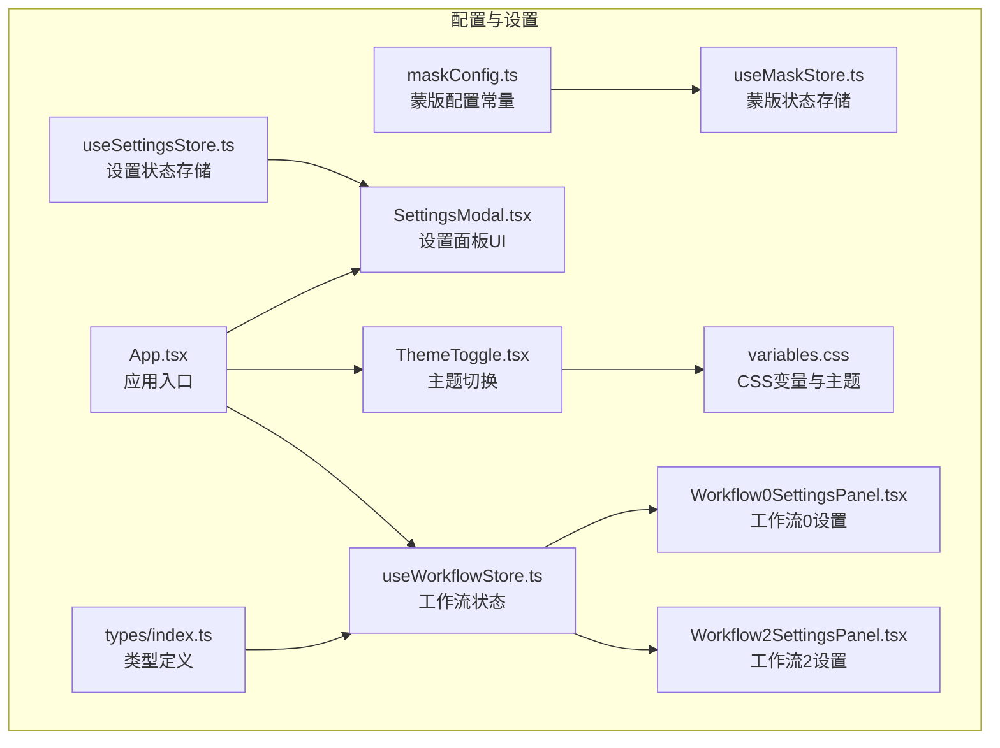
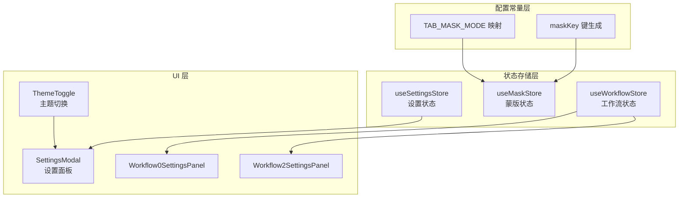
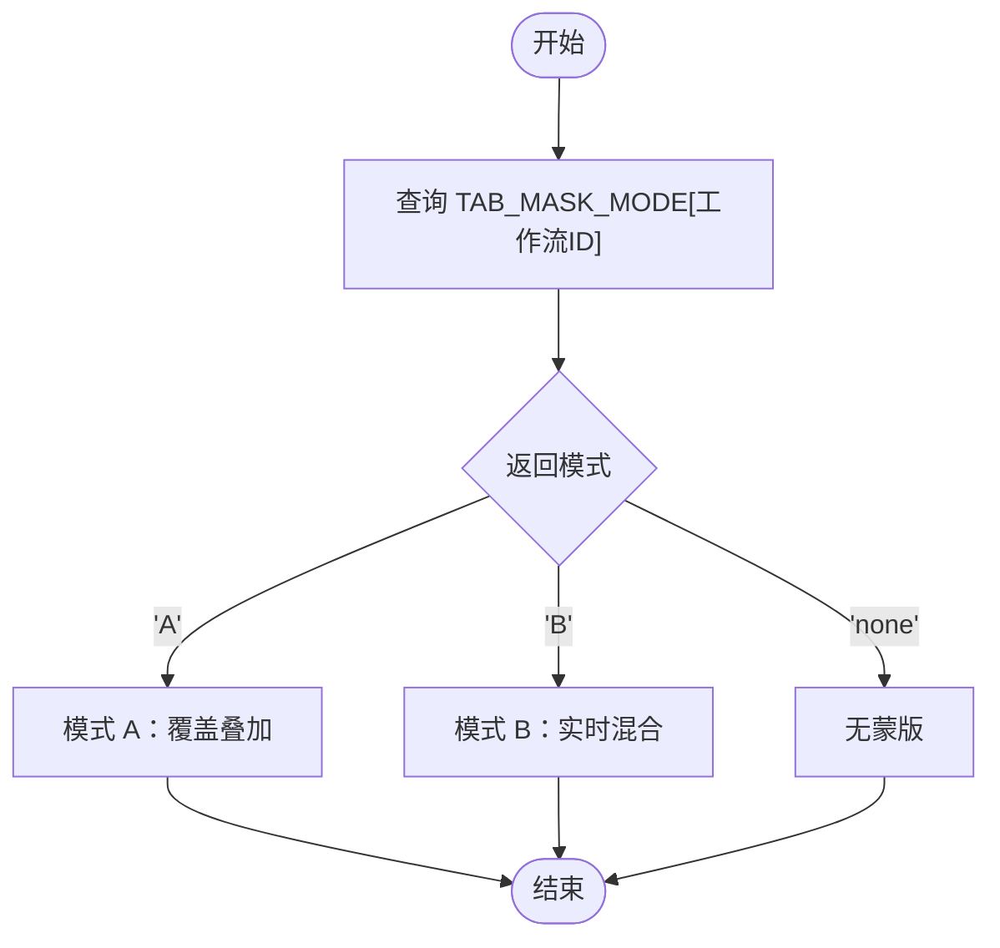
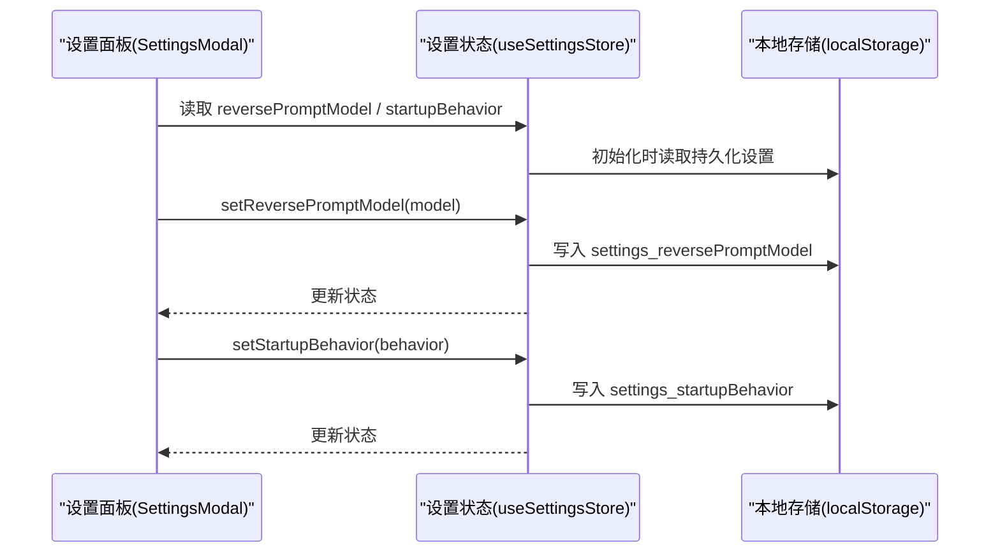
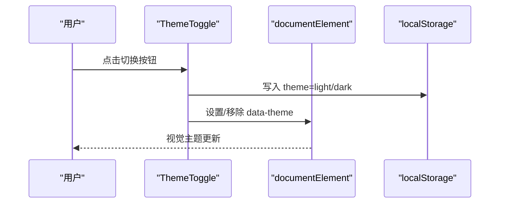
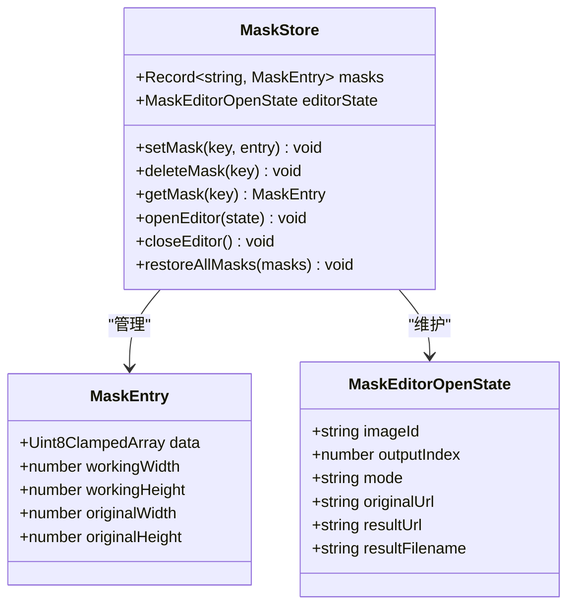
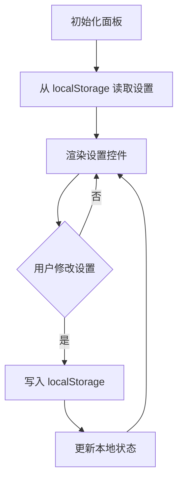
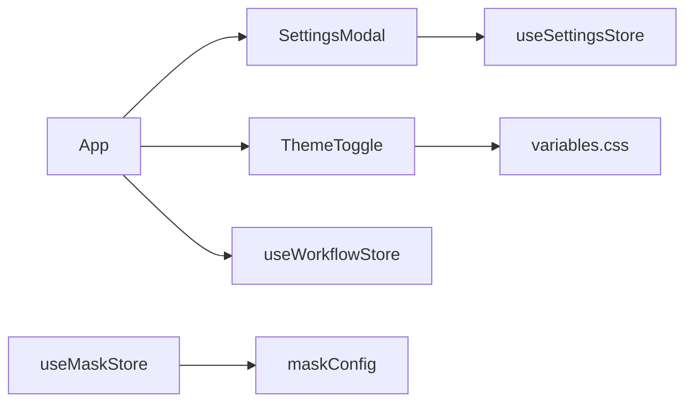

# 配置与设置系统

<cite>
**本文档引用的文件**
- [maskConfig.ts](file://client/src/config/maskConfig.ts)
- [useSettingsStore.ts](file://client/src/hooks/useSettingsStore.ts)
- [SettingsModal.tsx](file://client/src/components/SettingsModal.tsx)
- [ThemeToggle.tsx](file://client/src/components/ThemeToggle.tsx)
- [variables.css](file://client/src/styles/variables.css)
- [useMaskStore.ts](file://client/src/hooks/useMaskStore.ts)
- [Workflow0SettingsPanel.tsx](file://client/src/components/Workflow0SettingsPanel.tsx)
- [Workflow2SettingsPanel.tsx](file://client/src/components/Workflow2SettingsPanel.tsx)
- [useWorkflowStore.ts](file://client/src/hooks/useWorkflowStore.ts)
- [App.tsx](file://client/src/components/App.tsx)
- [index.ts](file://client/src/types/index.ts)
</cite>

## 目录
1. [简介](#简介)
2. [项目结构](#项目结构)
3. [核心组件](#核心组件)
4. [架构总览](#架构总览)
5. [详细组件分析](#详细组件分析)
6. [依赖关系分析](#依赖关系分析)
7. [性能考虑](#性能考虑)
8. [故障排除指南](#故障排除指南)
9. [结论](#结论)
10. [附录](#附录)

## 简介
本文件面向 CorineKit Pix2Real 的配置与设置系统，重点覆盖以下方面：
- 蒙版配置管理系统：maskConfig.ts 中的配置选项、默认值策略、键生成逻辑等
- 系统设置存储机制：useSettingsStore Hook 的状态管理、设置项的持久化存储、主题切换等
- 配置项数据结构设计：配置分类、默认值策略、用户自定义选项等
- 扩展指南：新增配置项的方法、配置验证规则、配置迁移策略等
- 使用示例与故障排除指导

## 项目结构
配置与设置系统主要分布在前端客户端（client）中，涉及配置常量、状态存储、UI 设置面板与样式变量等模块。

**图表来源**
- [maskConfig.ts:1-20](file://client/src/config/maskConfig.ts#L1-L20)
- [useSettingsStore.ts:1-31](file://client/src/hooks/useSettingsStore.ts#L1-L31)
- [SettingsModal.tsx:1-238](file://client/src/components/SettingsModal.tsx#L1-L238)
- [ThemeToggle.tsx:1-39](file://client/src/components/ThemeToggle.tsx#L1-L39)
- [variables.css:1-31](file://client/src/styles/variables.css#L1-L31)
- [useMaskStore.ts:1-51](file://client/src/hooks/useMaskStore.ts#L1-L51)
- [Workflow0SettingsPanel.tsx:1-58](file://client/src/components/Workflow0SettingsPanel.tsx#L1-L58)
- [Workflow2SettingsPanel.tsx:1-59](file://client/src/components/Workflow2SettingsPanel.tsx#L1-L59)
- [useWorkflowStore.ts:1-645](file://client/src/hooks/useWorkflowStore.ts#L1-L645)
- [App.tsx:1-335](file://client/src/components/App.tsx#L1-L335)
- [index.ts:1-58](file://client/src/types/index.ts#L1-L58)

**章节来源**
- [maskConfig.ts:1-20](file://client/src/config/maskConfig.ts#L1-L20)
- [useSettingsStore.ts:1-31](file://client/src/hooks/useSettingsStore.ts#L1-L31)
- [SettingsModal.tsx:1-238](file://client/src/components/SettingsModal.tsx#L1-L238)
- [ThemeToggle.tsx:1-39](file://client/src/components/ThemeToggle.tsx#L1-L39)
- [variables.css:1-31](file://client/src/styles/variables.css#L1-L31)
- [useMaskStore.ts:1-51](file://client/src/hooks/useMaskStore.ts#L1-L51)
- [Workflow0SettingsPanel.tsx:1-58](file://client/src/components/Workflow0SettingsPanel.tsx#L1-L58)
- [Workflow2SettingsPanel.tsx:1-59](file://client/src/components/Workflow2SettingsPanel.tsx#L1-L59)
- [useWorkflowStore.ts:1-645](file://client/src/hooks/useWorkflowStore.ts#L1-L645)
- [App.tsx:1-335](file://client/src/components/App.tsx#L1-L335)
- [index.ts:1-58](file://client/src/types/index.ts#L1-L58)

## 核心组件
- 蒙版配置常量：提供工作流到蒙版模式的映射以及蒙版键生成函数
- 设置状态存储：集中管理用户设置项并持久化到本地存储
- 设置面板UI：提供可交互的设置界面，支持分组导航与实时更新
- 主题切换：基于 CSS 变量的主题切换与持久化
- 蒙版状态存储：管理蒙版数据与编辑器状态
- 工作流设置面板：针对特定工作流的配置项持久化
- 工作流状态存储：承载全局工作流与任务状态
- 应用入口：整合设置面板、主题切换与工作流状态

**章节来源**
- [maskConfig.ts:1-20](file://client/src/config/maskConfig.ts#L1-L20)
- [useSettingsStore.ts:1-31](file://client/src/hooks/useSettingsStore.ts#L1-L31)
- [SettingsModal.tsx:1-238](file://client/src/components/SettingsModal.tsx#L1-L238)
- [ThemeToggle.tsx:1-39](file://client/src/components/ThemeToggle.tsx#L1-L39)
- [useMaskStore.ts:1-51](file://client/src/hooks/useMaskStore.ts#L1-L51)
- [Workflow0SettingsPanel.tsx:1-58](file://client/src/components/Workflow0SettingsPanel.tsx#L1-L58)
- [Workflow2SettingsPanel.tsx:1-59](file://client/src/components/Workflow2SettingsPanel.tsx#L1-L59)
- [useWorkflowStore.ts:1-645](file://client/src/hooks/useWorkflowStore.ts#L1-L645)
- [App.tsx:1-335](file://client/src/components/App.tsx#L1-L335)

## 架构总览
配置与设置系统采用“配置常量 + 状态存储 + UI 组件”的分层架构：
- 配置常量层：提供静态配置与键生成工具
- 状态存储层：以 Zustand 为核心的状态管理，结合 localStorage 实现持久化
- UI 层：设置面板与主题切换组件，响应状态变化并触发更新
- 类型层：统一的数据结构定义，确保跨模块一致性

**图表来源**
- [maskConfig.ts:3-20](file://client/src/config/maskConfig.ts#L3-L20)
- [useSettingsStore.ts:6-31](file://client/src/hooks/useSettingsStore.ts#L6-L31)
- [useMaskStore.ts:21-51](file://client/src/hooks/useMaskStore.ts#L21-L51)
- [useWorkflowStore.ts:35-88](file://client/src/hooks/useWorkflowStore.ts#L35-L88)
- [SettingsModal.tsx:23-30](file://client/src/components/SettingsModal.tsx#L23-L30)
- [ThemeToggle.tsx:4-17](file://client/src/components/ThemeToggle.tsx#L4-L17)
- [Workflow0SettingsPanel.tsx:3-14](file://client/src/components/Workflow0SettingsPanel.tsx#L3-L14)
- [Workflow2SettingsPanel.tsx:3-14](file://client/src/components/Workflow2SettingsPanel.tsx#L3-L14)

## 详细组件分析

### 蒙版配置管理系统
- 功能概述
  - 提供工作流 ID 到蒙版模式的映射表，决定每个工作流是否启用蒙版以及使用哪种模式
  - 提供蒙版键生成函数，用于唯一标识某张输入图与其输出索引的组合
- 数据结构与默认值
  - 映射表以数字工作流 ID 为键，值为 'A' | 'B' | 'none'
  - 默认值策略：未在映射表中显式声明的工作流默认不启用蒙版
- 使用场景
  - 在蒙版编辑器打开时根据工作流 ID 查询对应模式
  - 在导出或缓存蒙版时使用生成的键进行存储与检索

**图表来源**
- [maskConfig.ts:5-16](file://client/src/config/maskConfig.ts#L5-L16)

**章节来源**
- [maskConfig.ts:1-20](file://client/src/config/maskConfig.ts#L1-L20)

### 系统设置存储机制
- 状态存储
  - 使用 Zustand 创建设置状态，包含反推模型、启动行为与设置面板开关
  - 初始化时从 localStorage 读取持久化设置，若不存在则使用默认值
- 持久化策略
  - 修改设置后立即写入 localStorage，保证刷新后仍保持最新设置
- UI 集成
  - SettingsModal 通过 useSettingsStore 订阅状态并提供交互控件
  - 支持分组导航与滚动高亮，提升设置面板可用性

**图表来源**
- [useSettingsStore.ts:16-30](file://client/src/hooks/useSettingsStore.ts#L16-L30)
- [SettingsModal.tsx:26-29](file://client/src/components/SettingsModal.tsx#L26-L29)

**章节来源**
- [useSettingsStore.ts:1-31](file://client/src/hooks/useSettingsStore.ts#L1-L31)
- [SettingsModal.tsx:1-238](file://client/src/components/SettingsModal.tsx#L1-L238)

### 主题切换与样式变量
- 主题切换
  - ThemeToggle 组件在暗/亮主题之间切换，并持久化到 localStorage
  - 应用入口在初始化时根据 localStorage 恢复主题状态
- 样式变量
  - variables.css 定义了明/暗两套 CSS 变量，ThemeToggle 通过 data-theme 属性切换主题
- 集成点
  - App.tsx 引入 ThemeToggle 并在 header 中展示
  - 设置面板中可增加主题选择项以统一主题控制

**图表来源**
- [ThemeToggle.tsx:4-17](file://client/src/components/ThemeToggle.tsx#L4-L17)
- [variables.css:1-31](file://client/src/styles/variables.css#L1-L31)
- [App.tsx:76-81](file://client/src/components/App.tsx#L76-L81)

**章节来源**
- [ThemeToggle.tsx:1-39](file://client/src/components/ThemeToggle.tsx#L1-L39)
- [variables.css:1-31](file://client/src/styles/variables.css#L1-L31)
- [App.tsx:1-335](file://client/src/components/App.tsx#L1-L335)

### 蒙版状态存储与编辑器集成
- 数据结构
  - MaskEntry：保存蒙版像素数据与尺寸信息
  - MaskEditorOpenState：记录当前编辑器状态（图像、输出索引、模式等）
- 存储与操作
  - useMaskStore 提供 setMask、deleteMask、getMask、openEditor、closeEditor、restoreAllMasks 等方法
  - 通过键生成函数与 maskKey 结合，实现按图像与输出索引的精确存储
- 与工作流的协作
  - 根据 maskConfig.ts 的映射决定是否启用编辑器与编辑模式

**图表来源**
- [useMaskStore.ts:4-30](file://client/src/hooks/useMaskStore.ts#L4-L30)

**章节来源**
- [useMaskStore.ts:1-51](file://client/src/hooks/useMaskStore.ts#L1-L51)
- [maskConfig.ts:18-20](file://client/src/config/maskConfig.ts#L18-L20)

### 工作流设置面板
- 设计目标
  - 针对不同工作流提供专用设置面板，使用 localStorage 进行持久化
- 实现要点
  - Workflow0SettingsPanel：绘制模型选择（如 Qwen/Klein）
  - Workflow2SettingsPanel：放大模型选择（如 SeedVR2/Klein/SD）
  - 读取与写入：初始化时从 localStorage 读取，变更时写回
- 与工作流状态的关系
  - useWorkflowStore 管理全局工作流与任务状态，设置面板仅负责其专属配置

**图表来源**
- [Workflow0SettingsPanel.tsx:5-14](file://client/src/components/Workflow0SettingsPanel.tsx#L5-L14)
- [Workflow2SettingsPanel.tsx:5-14](file://client/src/components/Workflow2SettingsPanel.tsx#L5-L14)

**章节来源**
- [Workflow0SettingsPanel.tsx:1-58](file://client/src/components/Workflow0SettingsPanel.tsx#L1-L58)
- [Workflow2SettingsPanel.tsx:1-59](file://client/src/components/Workflow2SettingsPanel.tsx#L1-L59)
- [useWorkflowStore.ts:1-645](file://client/src/hooks/useWorkflowStore.ts#L1-L645)

### 配置项的数据结构设计
- 配置分类
  - 用户偏好类：反推模型、启动行为、视图大小、主题
  - 工作流专属类：绘制模型、放大模型等
  - 蒙版类：蒙版模式映射、蒙版键生成
- 默认值策略
  - 用户偏好类：优先从 localStorage 恢复，失败则使用代码中的默认值
  - 工作流专属类：面板初始化时从 localStorage 恢复，缺失则使用组件内默认值
  - 蒙版类：未声明的工作流默认不启用蒙版
- 用户自定义选项
  - 通过设置面板与工作流面板提供交互控件，实时更新并持久化

**章节来源**
- [useSettingsStore.ts:17-18](file://client/src/hooks/useSettingsStore.ts#L17-L18)
- [Workflow0SettingsPanel.tsx:10](file://client/src/components/Workflow0SettingsPanel.tsx#L10)
- [Workflow2SettingsPanel.tsx:10](file://client/src/components/Workflow2SettingsPanel.tsx#L10)
- [maskConfig.ts:5-16](file://client/src/config/maskConfig.ts#L5-L16)

## 依赖关系分析
- 组件耦合
  - SettingsModal 依赖 useSettingsStore；ThemeToggle 与 variables.css 共同实现主题切换
  - useMaskStore 依赖 maskConfig.ts 的键生成与模式映射
  - App.tsx 整合设置面板、主题切换与工作流状态
- 外部依赖
  - Zustand 作为状态管理库
  - localStorage 作为持久化存储
  - CSS 变量与 data-theme 属性实现主题切换

**图表来源**
- [SettingsModal.tsx:3](file://client/src/components/SettingsModal.tsx#L3)
- [useSettingsStore.ts:1](file://client/src/hooks/useSettingsStore.ts#L1)
- [ThemeToggle.tsx:1](file://client/src/components/ThemeToggle.tsx#L1)
- [variables.css:1](file://client/src/styles/variables.css#L1)
- [App.tsx:23](file://client/src/components/App.tsx#L23)
- [useWorkflowStore.ts:1](file://client/src/hooks/useWorkflowStore.ts#L1)
- [useMaskStore.ts:2](file://client/src/hooks/useMaskStore.ts#L2)
- [maskConfig.ts:1](file://client/src/config/maskConfig.ts#L1)

**章节来源**
- [SettingsModal.tsx:1-238](file://client/src/components/SettingsModal.tsx#L1-L238)
- [useSettingsStore.ts:1-31](file://client/src/hooks/useSettingsStore.ts#L1-L31)
- [ThemeToggle.tsx:1-39](file://client/src/components/ThemeToggle.tsx#L1-L39)
- [variables.css:1-31](file://client/src/styles/variables.css#L1-L31)
- [App.tsx:1-335](file://client/src/components/App.tsx#L1-L335)
- [useWorkflowStore.ts:1-645](file://client/src/hooks/useWorkflowStore.ts#L1-L645)
- [useMaskStore.ts:1-51](file://client/src/hooks/useMaskStore.ts#L1-L51)
- [maskConfig.ts:1-20](file://client/src/config/maskConfig.ts#L1-L20)

## 性能考虑
- 状态粒度
  - 将设置与蒙版状态拆分为独立 store，避免无关状态导致的重渲染
- 持久化策略
  - 对频繁变更的设置采用节流/防抖写入 localStorage，减少 I/O 压力
- 渲染优化
  - 设置面板使用分组导航与 IntersectionObserver 高亮，降低滚动监听成本
- 图像与蒙版
  - 蒙版数据以像素数组形式存储，注意内存占用；在不需要时及时清理

## 故障排除指南
- 设置未生效
  - 检查 localStorage 中对应键是否存在且格式正确
  - 确认 useSettingsStore 初始化逻辑是否覆盖了默认值
- 主题切换无效
  - 确认 ThemeToggle 是否正确写入 localStorage 与设置 data-theme
  - 检查 variables.css 中的暗色主题选择器是否匹配 data-theme
- 蒙版编辑器无法打开
  - 核对 maskConfig.ts 中工作流 ID 对应的模式是否为 'A' 或 'B'
  - 确认 useMaskStore 的 openEditor 参数是否完整（imageId、outputIndex、mode 等）
- 工作流设置丢失
  - 检查面板组件是否正确读取与写入 localStorage
  - 确保键名一致且 JSON 序列化/反序列化无异常

**章节来源**
- [useSettingsStore.ts:16-30](file://client/src/hooks/useSettingsStore.ts#L16-L30)
- [ThemeToggle.tsx:4-17](file://client/src/components/ThemeToggle.tsx#L4-L17)
- [variables.css:21-30](file://client/src/styles/variables.css#L21-L30)
- [maskConfig.ts:5-16](file://client/src/config/maskConfig.ts#L5-L16)
- [useMaskStore.ts:47-48](file://client/src/hooks/useMaskStore.ts#L47-L48)
- [Workflow0SettingsPanel.tsx:5-14](file://client/src/components/Workflow0SettingsPanel.tsx#L5-L14)
- [Workflow2SettingsPanel.tsx:5-14](file://client/src/components/Workflow2SettingsPanel.tsx#L5-L14)

## 结论
本配置与设置系统通过清晰的分层设计实现了配置常量、状态存储与 UI 组件的解耦。蒙版配置与设置存储分别满足了工作流模式控制与用户偏好的需求，同时通过 localStorage 保障了跨会话的一致性。建议在后续迭代中进一步完善配置验证与迁移策略，以增强系统的健壮性与可维护性。

## 附录
- 新增配置项步骤
  - 在对应的 store 或面板中添加新的键与默认值
  - 在 UI 中提供控件绑定到该键
  - 确保初始化时从 localStorage 读取，变更时写回
- 配置验证规则
  - 对枚举型配置（如反推模型、启动行为）进行类型校验
  - 对数值型配置设置合理范围与步长
- 配置迁移策略
  - 版本升级时检查旧键名并迁移至新键名
  - 对缺失的配置项提供安全的默认值回退