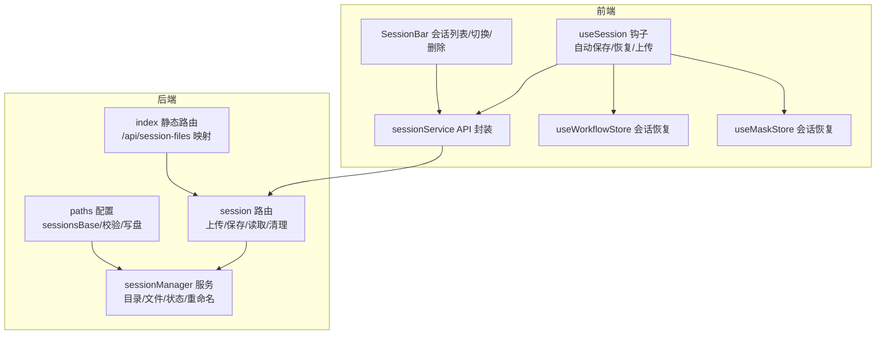
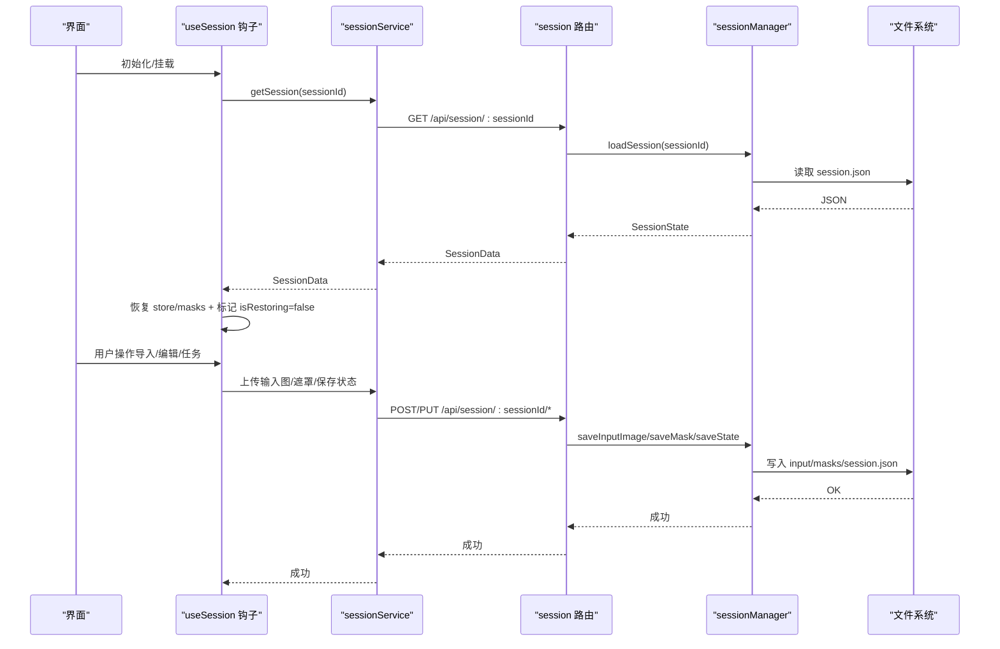
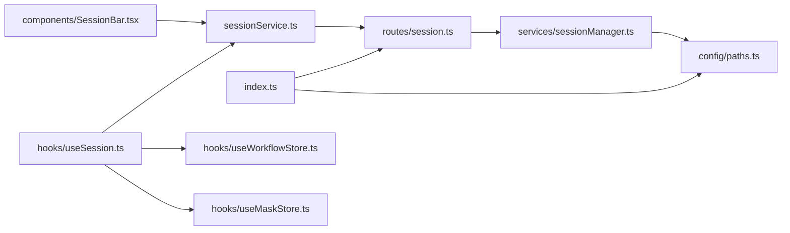

# 会话管理

<cite>
**本文引用的文件**
- [server/src/services/sessionManager.ts](file://server/src/services/sessionManager.ts)
- [server/src/routes/session.ts](file://server/src/routes/session.ts)
- [server/src/config/paths.ts](file://server/src/config/paths.ts)
- [server/src/index.ts](file://server/src/index.ts)
- [client/src/hooks/useSession.ts](file://client/src/hooks/useSession.ts)
- [client/src/services/sessionService.ts](file://client/src/services/sessionService.ts)
- [client/src/components/SessionBar.tsx](file://client/src/components/SessionBar.tsx)
- [TODO-session-persistence.md](file://TODO-session-persistence.md)
- [client/src/hooks/useWorkflowStore.ts](file://client/src/hooks/useWorkflowStore.ts)
- [client/src/hooks/useMaskStore.ts](file://client/src/hooks/useMaskStore.ts)
- [server/src/routes/settings.ts](file://server/src/routes/settings.ts)
</cite>

## 目录
1. [简介](#简介)
2. [项目结构](#项目结构)
3. [核心组件](#核心组件)
4. [架构总览](#架构总览)
5. [详细组件分析](#详细组件分析)
6. [依赖关系分析](#依赖关系分析)
7. [性能考量](#性能考量)
8. [故障排查指南](#故障排查指南)
9. [结论](#结论)
10. [附录](#附录)

## 简介
本文件面向“会话管理系统”的技术文档，围绕会话文件夹组织结构、sessionsBase 目录的配置与管理机制，以及会话创建、保存、恢复与清理的完整流程进行系统化说明。文档还解释了会话状态的数据结构与持久化策略、会话元数据的存储格式与版本管理、会话路径验证与安全检查、会话管理 API 的使用示例，以及多标签页会话隔离与状态同步机制。

## 项目结构
会话管理涉及前后端协作：
- 前端负责会话生命周期管理、状态序列化与自动保存、资源上传与恢复、UI 展示与交互。
- 后端负责会话目录结构维护、文件上传与下载、会话状态 JSON 的读写、会话列表与清理、路径配置与校验。

图表来源
- [client/src/hooks/useSession.ts:118-434](file://client/src/hooks/useSession.ts#L118-L434)
- [client/src/services/sessionService.ts:88-231](file://client/src/services/sessionService.ts#L88-L231)
- [server/src/routes/session.ts:21-162](file://server/src/routes/session.ts#L21-L162)
- [server/src/services/sessionManager.ts:11-539](file://server/src/services/sessionManager.ts#L11-L539)
- [server/src/config/paths.ts:74-137](file://server/src/config/paths.ts#L74-L137)
- [server/src/index.ts:134-139](file://server/src/index.ts#L134-L139)

章节来源
- [TODO-session-persistence.md:13-26](file://TODO-session-persistence.md#L13-L26)
- [server/src/config/paths.ts:74-137](file://server/src/config/paths.ts#L74-L137)
- [server/src/index.ts:134-139](file://server/src/index.ts#L134-L139)

## 核心组件
- 会话状态数据结构
  - 顶层字段：sessionId、createdAt、updatedAt、activeTab、tabData、可选封面标志与扩展名。
  - tabData：按标签页索引组织，包含 images、prompts、tasks、selectedOutputIndex、backPoseToggles 等。
  - images：包含 id、originalName、ext、label、inputFilename 等。
  - tasks：按 imageId 组织，包含 promptId、status、progress、outputs（含 filename/url）、可选 error。
- 会话文件夹组织
  - sessionsBase/<sessionId>/session.json：会话状态 JSON。
  - sessionsBase/<sessionId>/tab-<n>/input/：输入图像。
  - sessionsBase/<sessionId>/tab-<n>/masks/：遮罩 PNG（maskKey 替换冒号为下划线）。
  - sessionsBase/<sessionId>/tab-<n>/output/：输出文件（由后端下载并保存，URL 写入 session.json）。
  - sessionsBase/<sessionId>/cover.*：封面文件（可选，手动设置时生成）。
- 路径配置与校验
  - sessionsBase 默认位于项目根下的 sessions 目录。
  - 支持通过设置接口切换为绝对路径，或恢复默认；写入 config.json 并即时生效。
  - 校验规则：必须为绝对路径、不可嵌套在当前 sessionsBase 的 tab 子目录内、具备写权限。
- 会话 API
  - 上传输入图、上传遮罩、保存/读取会话状态、列出会话、删除会话、设置封面、重命名卡片资产、批量重命名。

章节来源
- [server/src/services/sessionManager.ts:66-133](file://server/src/services/sessionManager.ts#L66-L133)
- [server/src/services/sessionManager.ts:11-18](file://server/src/services/sessionManager.ts#L11-L18)
- [server/src/config/paths.ts:74-137](file://server/src/config/paths.ts#L74-L137)
- [client/src/services/sessionService.ts:88-231](file://client/src/services/sessionService.ts#L88-L231)

## 架构总览
会话管理采用“事件驱动静默自动保存”策略：导入图片、任务完成、遮罩绘制结束、提示词变更、页面关闭前均触发保存；同时支持手动新建会话与会话列表切换。

图表来源
- [client/src/hooks/useSession.ts:294-400](file://client/src/hooks/useSession.ts#L294-L400)
- [client/src/services/sessionService.ts:88-147](file://client/src/services/sessionService.ts#L88-L147)
- [server/src/routes/session.ts:21-82](file://server/src/routes/session.ts#L21-L82)
- [server/src/services/sessionManager.ts:22-133](file://server/src/services/sessionManager.ts#L22-L133)

## 详细组件分析

### 会话状态数据结构与持久化策略
- 数据结构
  - SessionState：包含 sessionId、createdAt、updatedAt、activeTab、tabData、可选封面标志与扩展名。
  - SerializedTabData：images、prompts、tasks、selectedOutputIndex、backPoseToggles 等。
  - SerializedImage：id、originalName、ext、label、inputFilename。
  - SerializedTask：promptId、status、progress、outputs（数组，含 filename/url）、可选 error。
- 持久化策略
  - 状态 JSON：每次保存时更新 updatedAt，首次保存时记录 createdAt；若已有文件则保留原 createdAt。
  - 输出文件：不复制到 sessionsBase，仅在 session.json 中记录输出文件名与 URL。
  - 封面：通过设置封面接口复制指定输入/输出文件为 cover.*，并在 session.json 中标记 manualCover 与 coverExt。
- 版本管理
  - 采用 JSON 文件形式，未见显式版本字段；建议通过字段存在性或迁移脚本实现向后兼容。

章节来源
- [server/src/services/sessionManager.ts:66-133](file://server/src/services/sessionManager.ts#L66-L133)
- [server/src/services/sessionManager.ts:178-218](file://server/src/services/sessionManager.ts#L178-L218)

### sessionsBase 目录的配置与管理机制
- 获取与切换
  - getSessionsBase()：运行时动态获取，支持设置面板切换后即时生效。
  - setSessionsBase(absOrNull)：写入 config.json 并立即创建目录。
- 路径校验
  - validateSessionsBase()：检查非空、绝对路径、不可嵌套在 tab-* 子目录、可写。
- 静态映射
  - /api/session-files 动态指向当前 sessionsBase，无需重启即可生效。

章节来源
- [server/src/config/paths.ts:74-137](file://server/src/config/paths.ts#L74-L137)
- [server/src/index.ts:134-139](file://server/src/index.ts#L134-L139)

### 会话创建、保存、恢复与清理流程
- 创建
  - 前端：生成 UUID 并写入 localStorage；首次挂载时尝试恢复，若不存在则根据启动行为决定欢迎页或新建。
- 保存
  - 事件驱动：导入图片、遮罩保存、提示词变更（带防抖）、页面关闭前（beforeunload）。
  - 后端：ensureSessionDirs + saveState，写入 session.json。
- 恢复
  - 前端：GET /api/session/:sessionId，重建 ImageItem（通过 /api/session-files 下载），恢复 store 与 masks。
- 清理
  - 删除单个会话：DELETE /api/session/:sessionId。
  - 清理旧会话：listSessions 后删除超出保留数量的部分。

章节来源
- [client/src/hooks/useSession.ts:272-292](file://client/src/hooks/useSession.ts#L272-L292)
- [client/src/hooks/useSession.ts:168-179](file://client/src/hooks/useSession.ts#L168-L179)
- [client/src/hooks/useSession.ts:410-431](file://client/src/hooks/useSession.ts#L410-L431)
- [server/src/routes/session.ts:54-71](file://server/src/routes/session.ts#L54-L71)
- [server/src/services/sessionManager.ts:145-172](file://server/src/services/sessionManager.ts#L145-L172)

### 会话路径验证与安全检查
- 路径合法性
  - 必须为绝对路径；禁止嵌套在当前 sessionsBase 的 tab-* 子目录内；允许指向同名目录。
- 写权限探测
  - 创建临时文件探测写入能力；失败则拒绝。
- 文件名安全
  - 遮罩键替换冒号为下划线；标签重命名时对标签进行跨平台安全字符清洗。
- 资源访问
  - /api/session-files 动态映射 sessionsBase，避免硬编码路径。

章节来源
- [server/src/config/paths.ts:106-137](file://server/src/config/paths.ts#L106-L137)
- [server/src/services/sessionManager.ts:50-62](file://server/src/services/sessionManager.ts#L50-L62)
- [server/src/services/sessionManager.ts:241-246](file://server/src/services/sessionManager.ts#L241-L246)

### 会话管理 API 使用示例
- 创建新会话
  - 前端：newSession(name?) 生成新 sessionId，清空上传与遮罩集合，重置 store。
  - 后端：无专门创建接口，首次保存时自动建立目录与 session.json。
- 获取会话列表
  - GET /api/session → 返回最近会话元数据（最多 5 个，按 updatedAt 倒序）。
- 恢复会话状态
  - GET /api/session/:sessionId → 返回 SessionData；前端据此重建 ImageItem 与遮罩。
- 上传输入图
  - POST /api/session/:sessionId/images → multipart/form-data，返回持久化 URL。
- 上传遮罩
  - POST /api/session/:sessionId/masks → multipart/form-data，保存 PNG。
- 保存会话状态
  - PUT /api/session/:sessionId/state 或 POST /api/session/:sessionId/state（sendBeacon）。
- 设置封面
  - POST /api/session/:sessionId/cover → 复制指定文件为 cover.*，并标记 manualCover。
- 重命名卡片资产
  - POST /api/session/:sessionId/rename-card → 输入文件重命名为 {label}_raw{ext}，输出文件重命名为 {label}_1{ext}、{label}_2{ext}...
  - POST /api/session/:sessionId/rename-cards-batch → 批量事务性重命名，全通过或全不改。
- 删除会话
  - DELETE /api/session/:sessionId → 删除整个会话目录。

章节来源
- [client/src/services/sessionService.ts:88-231](file://client/src/services/sessionService.ts#L88-L231)
- [server/src/routes/session.ts:21-162](file://server/src/routes/session.ts#L21-L162)

### 多标签页会话隔离与状态同步机制
- 隔离
  - 每个 sessionId 对应独立目录树，各标签页数据按 tab-<n> 子目录隔离。
- 状态同步
  - 前端 store 与 session.json 保持双向同步：store 变更触发自动保存；恢复时将 session.json 的状态应用到 store。
  - 遮罩恢复：按 maskKey 探测已存在的遮罩文件并重建。
- 任务输出
  - 任务完成后，后端将 ComfyUI 输出下载至 sessionsBase/<sessionId>/tab-<n>/output/，并将文件名与 URL 写入 session.json。

章节来源
- [client/src/hooks/useSession.ts:320-374](file://client/src/hooks/useSession.ts#L320-L374)
- [server/src/services/sessionManager.ts:37-48](file://server/src/services/sessionManager.ts#L37-L48)
- [server/src/index.ts:373-419](file://server/src/index.ts#L373-L419)

## 依赖关系分析

图表来源
- [client/src/services/sessionService.ts:88-231](file://client/src/services/sessionService.ts#L88-L231)
- [server/src/routes/session.ts:21-162](file://server/src/routes/session.ts#L21-L162)
- [server/src/services/sessionManager.ts:11-539](file://server/src/services/sessionManager.ts#L11-L539)
- [server/src/config/paths.ts:74-137](file://server/src/config/paths.ts#L74-L137)
- [server/src/index.ts:132-139](file://server/src/index.ts#L132-L139)
- [client/src/hooks/useSession.ts:118-434](file://client/src/hooks/useSession.ts#L118-L434)
- [client/src/components/SessionBar.tsx:53-129](file://client/src/components/SessionBar.tsx#L53-L129)

章节来源
- [client/src/hooks/useWorkflowStore.ts:181-183](file://client/src/hooks/useWorkflowStore.ts#L181-L183)
- [client/src/hooks/useMaskStore.ts:29](file://client/src/hooks/useMaskStore.ts#L29)

## 性能考量
- 事件驱动保存
  - 导入图片、遮罩保存、提示词变更均触发保存，建议在高频变更场景下使用防抖（前端已实现）。
- 上传与下载
  - 图像与遮罩采用 multipart 上传，输出文件通过后端下载并保存，避免前端缓存膨胀。
- 目录与文件命名
  - 严格的安全字符清洗与文件名冲突检测，减少异常与重试成本。
- 路径切换
  - sessionsBase 切换即时生效，无需重启，降低运维成本。

## 故障排查指南
- 会话无法恢复
  - 检查 session.json 是否存在且可解析；确认 /api/session-files 能正确访问 sessionsBase。
- 上传失败
  - 检查 multipart 字段是否齐全（image/tabId/imageId 或 mask/tabId/maskKey）。
- 路径不可写
  - 使用 validateSessionsBase 校验路径；确保目标目录具备写权限。
- 重命名失败
  - 检查是否存在进行中的任务；确认目标文件名未与其他文件冲突。
- 封面设置失败
  - 确认 sourceUrl 指向 /api/session-files 下的有效文件；检查 session.json 是否被正确更新。

章节来源
- [server/src/routes/session.ts:28-31](file://server/src/routes/session.ts#L28-L31)
- [server/src/routes/session.ts:45-48](file://server/src/routes/session.ts#L45-L48)
- [server/src/services/sessionManager.ts:276-281](file://server/src/services/sessionManager.ts#L276-L281)
- [server/src/services/sessionManager.ts:183-190](file://server/src/services/sessionManager.ts#L183-L190)

## 结论
会话管理系统以清晰的目录结构与严格的路径校验为基础，结合事件驱动的自动保存策略，实现了可靠的会话持久化与恢复能力。前后端通过标准化 API 协作，既满足多标签页隔离，又保证状态一致性与可维护性。建议在生产环境中配合定期清理与备份策略，进一步提升稳定性与用户体验。

## 附录
- 会话文件夹组织结构（示例）
  - sessionsBase/<sessionId>/session.json
  - sessionsBase/<sessionId>/tab-0/input/<imageId>.<ext>
  - sessionsBase/<sessionId>/tab-0/masks/<maskKey>.png
  - sessionsBase/<sessionId>/tab-0/output/<filename>
  - sessionsBase/<sessionId>/cover.<ext>

章节来源
- [TODO-session-persistence.md:13-26](file://TODO-session-persistence.md#L13-L26)