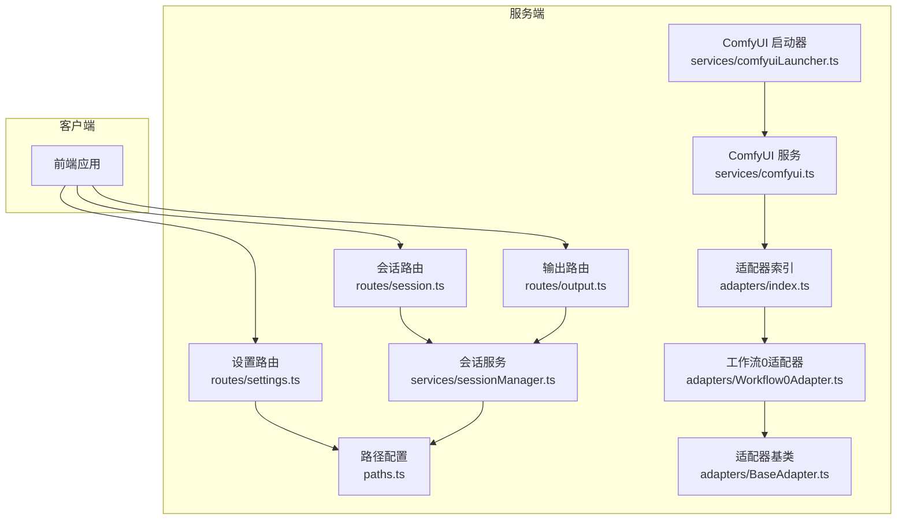
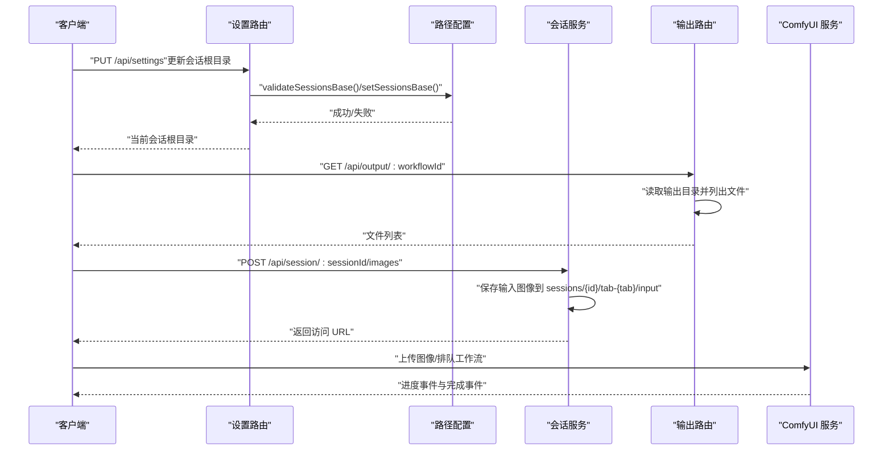
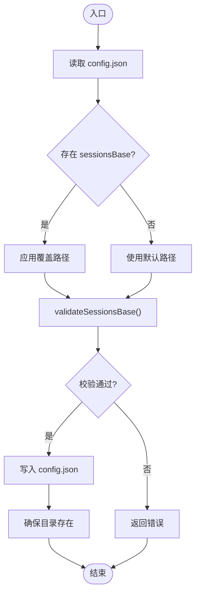
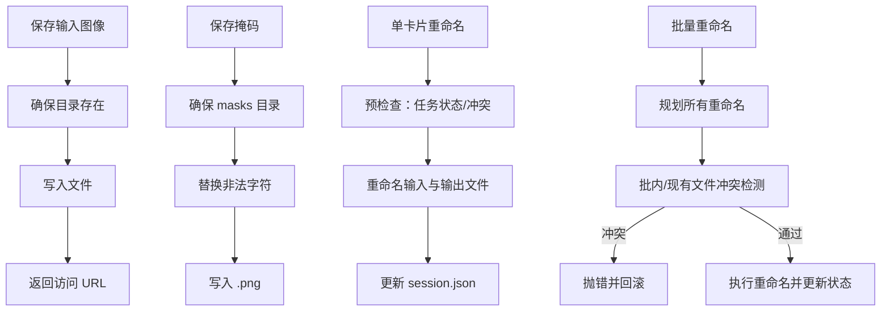
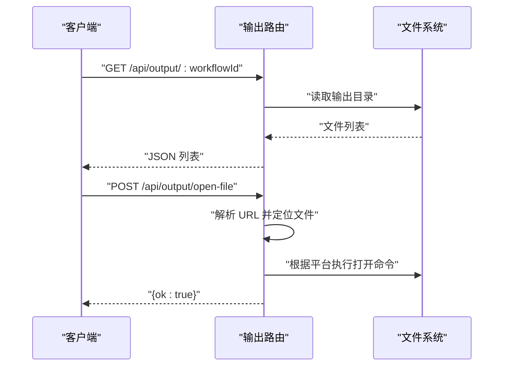
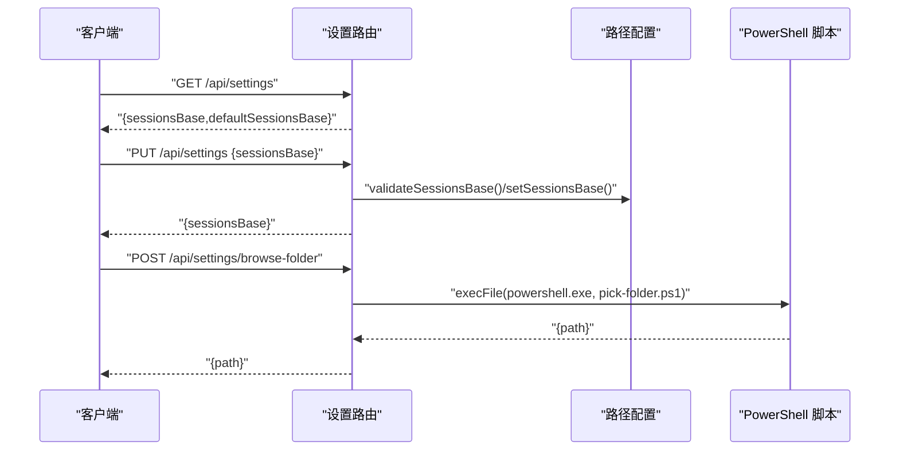
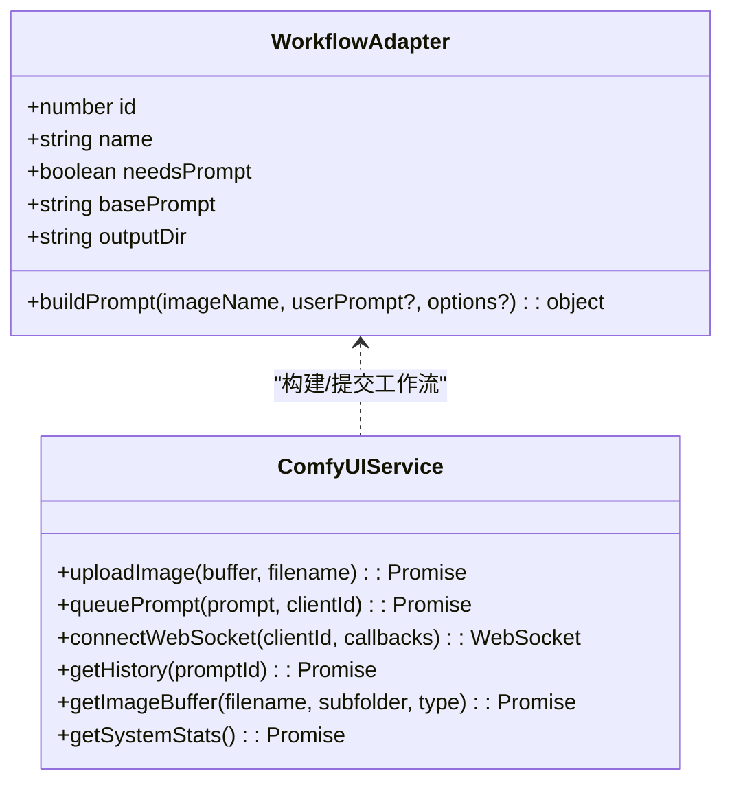
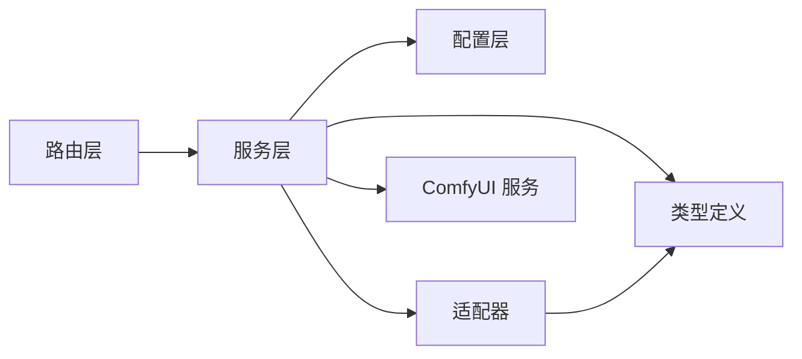

# 存储优化

<cite>
**本文引用的文件**
- [server/src/config/paths.ts](file://server/src/config/paths.ts)
- [server/src/services/sessionManager.ts](file://server/src/services/sessionManager.ts)
- [server/src/routes/session.ts](file://server/src/routes/session.ts)
- [server/src/routes/output.ts](file://server/src/routes/output.ts)
- [server/src/routes/settings.ts](file://server/src/routes/settings.ts)
- [server/src/services/comfyui.ts](file://server/src/services/comfyui.ts)
- [server/src/services/comfyuiLauncher.ts](file://server/src/services/comfyuiLauncher.ts)
- [server/src/adapters/index.ts](file://server/src/adapters/index.ts)
- [server/src/adapters/BaseAdapter.ts](file://server/src/adapters/BaseAdapter.ts)
- [server/src/adapters/Workflow0Adapter.ts](file://server/src/adapters/Workflow0Adapter.ts)
- [server/src/types/index.ts](file://server/src/types/index.ts)
- [server/scripts/pick-folder.ps1](file://server/scripts/pick-folder.ps1)
- [package.json](file://package.json)
</cite>

## 目录
1. [简介](#简介)
2. [项目结构](#项目结构)
3. [核心组件](#核心组件)
4. [架构总览](#架构总览)
5. [详细组件分析](#详细组件分析)
6. [依赖关系分析](#依赖关系分析)
7. [性能考虑](#性能考虑)
8. [故障排查指南](#故障排查指南)
9. [结论](#结论)
10. [附录](#附录)

## 简介
本技术文档围绕“存储优化系统”展开，聚焦于以下方面：
- 文件压缩策略：图像格式转换、无损与有损压缩的选择标准与实现路径
- 增量更新机制：文件变更检测、差异计算与增量备份思路
- 存储空间监控与告警：磁盘使用率统计、空间不足预警与自动清理策略
- 跨平台文件系统兼容：路径分隔符转换、权限继承与特殊字符处理
- 存储性能优化：文件系统选择、磁盘阵列配置与网络存储集成建议

本系统以会话为中心组织数据，采用集中式路径配置与会话目录结构，结合 ComfyUI 工作流引擎进行图像生成与输出管理。前端通过 API 与后端交互，后端负责路径解析、文件落盘、会话持久化与资源清理。

## 项目结构
后端采用 Node.js + Express 架构，核心模块包括：
- 配置层：集中管理项目根、会话根目录与持久化配置
- 服务层：会话管理、ComfyUI 通信、工作流适配器
- 路由层：对外暴露会话、输出、设置等 API
- 脚本层：Windows 资源管理器风格的目录选择脚本

图表来源
- [server/src/config/paths.ts:1-156](file://server/src/config/paths.ts#L1-L156)
- [server/src/routes/session.ts:1-163](file://server/src/routes/session.ts#L1-L163)
- [server/src/routes/output.ts:1-139](file://server/src/routes/output.ts#L1-L139)
- [server/src/routes/settings.ts:1-106](file://server/src/routes/settings.ts#L1-L106)
- [server/src/services/sessionManager.ts:1-539](file://server/src/services/sessionManager.ts#L1-L539)
- [server/src/services/comfyui.ts:1-472](file://server/src/services/comfyui.ts#L1-L472)
- [server/src/services/comfyuiLauncher.ts:1-131](file://server/src/services/comfyuiLauncher.ts#L1-L131)
- [server/src/adapters/index.ts:1-33](file://server/src/adapters/index.ts#L1-L33)
- [server/src/adapters/BaseAdapter.ts:1-4](file://server/src/adapters/BaseAdapter.ts#L1-L4)
- [server/src/adapters/Workflow0Adapter.ts:1-35](file://server/src/adapters/Workflow0Adapter.ts#L1-L35)

章节来源
- [server/src/config/paths.ts:1-156](file://server/src/config/paths.ts#L1-L156)
- [server/src/routes/session.ts:1-163](file://server/src/routes/session.ts#L1-L163)
- [server/src/routes/output.ts:1-139](file://server/src/routes/output.ts#L1-L139)
- [server/src/routes/settings.ts:1-106](file://server/src/routes/settings.ts#L1-L106)
- [server/src/services/sessionManager.ts:1-539](file://server/src/services/sessionManager.ts#L1-L539)
- [server/src/services/comfyui.ts:1-472](file://server/src/services/comfyui.ts#L1-L472)
- [server/src/services/comfyuiLauncher.ts:1-131](file://server/src/services/comfyuiLauncher.ts#L1-L131)
- [server/src/adapters/index.ts:1-33](file://server/src/adapters/index.ts#L1-L33)
- [server/src/adapters/BaseAdapter.ts:1-4](file://server/src/adapters/BaseAdapter.ts#L1-L4)
- [server/src/adapters/Workflow0Adapter.ts:1-35](file://server/src/adapters/Workflow0Adapter.ts#L1-L35)

## 核心组件
- 路径配置与会话根目录
  - 通过集中式配置管理项目根与会话根目录，支持运行时切换与持久化
  - 提供路径合法性校验、写权限探测与目录创建
- 会话管理
  - 会话目录结构标准化（输入/掩码/输出/封面/状态文件）
  - 输入输出文件保存、封面生成、会话列表与删除、旧会话裁剪
  - 卡片资产批量重命名与冲突检测，确保事务性一致性
- 输出与文件打开
  - 输出目录按工作流分类管理，提供文件列表与下载
  - 跨平台打开文件（Windows/macOS/Linux）
- 设置与路径选择
  - 读取/更新会话根目录，Windows 原生目录选择对话框
- ComfyUI 集成
  - 上传图像/视频、排队工作流、WebSocket 进度回调、历史查询
  - 节点权重估计与阶段化进度展示，系统资源统计
- 工作流适配器
  - 基于模板的工作流构建，注入图像名称、提示词与随机种子

章节来源
- [server/src/config/paths.ts:22-137](file://server/src/config/paths.ts#L22-L137)
- [server/src/services/sessionManager.ts:11-539](file://server/src/services/sessionManager.ts#L11-L539)
- [server/src/routes/output.ts:27-136](file://server/src/routes/output.ts#L27-L136)
- [server/src/routes/settings.ts:21-103](file://server/src/routes/settings.ts#L21-L103)
- [server/src/services/comfyui.ts:9-472](file://server/src/services/comfyui.ts#L9-L472)
- [server/src/adapters/index.ts:14-32](file://server/src/adapters/index.ts#L14-L32)
- [server/src/adapters/Workflow0Adapter.ts:9-34](file://server/src/adapters/Workflow0Adapter.ts#L9-L34)

## 架构总览
系统采用“配置中心 + 会话服务 + 工作流引擎”的三层架构：
- 配置中心：集中管理路径与持久化配置
- 会话服务：负责文件落盘、会话状态与资源管理
- 工作流引擎：与 ComfyUI 交互，完成图像生成与输出

图表来源
- [server/src/routes/settings.ts:29-67](file://server/src/routes/settings.ts#L29-L67)
- [server/src/config/paths.ts:78-100](file://server/src/config/paths.ts#L78-L100)
- [server/src/routes/output.ts:27-58](file://server/src/routes/output.ts#L27-L58)
- [server/src/services/sessionManager.ts:22-48](file://server/src/services/sessionManager.ts#L22-L48)
- [server/src/services/comfyui.ts:168-196](file://server/src/services/comfyui.ts#L168-L196)

## 详细组件分析

### 路径配置与会话根目录
- 功能要点
  - 默认会话根目录位于项目根的 sessions 子目录
  - 支持通过环境变量覆盖数据根目录（Electron 场景）
  - 运行时可切换会话根目录并持久化到 config.json
  - 路径合法性校验：非空、绝对路径、不可嵌套在当前 sessions/tab-* 下、可写性探测
- 关键流程
  - 读取 config.json 并解析 sessionsBase
  - setSessionsBase 写入 config.json 并确保目录存在
  - validateSessionsBase 执行创建与写入探测

图表来源
- [server/src/config/paths.ts:35-100](file://server/src/config/paths.ts#L35-L100)
- [server/src/config/paths.ts:106-137](file://server/src/config/paths.ts#L106-L137)

章节来源
- [server/src/config/paths.ts:22-137](file://server/src/config/paths.ts#L22-L137)

### 会话管理与文件存储
- 目录结构
  - sessions/{sessionId}/tab-{0..5}/input、masks、output
  - sessions/{sessionId}/session.json（会话状态）
  - sessions/{sessionId}/cover{ext}（封面）
- 关键能力
  - 保存输入图像、输出文件、掩码
  - 保存封面（复制源文件并标记手动封面）
  - 会话列表、删除、旧会话裁剪
  - 单卡片与批量卡片资产重命名（含冲突检测与事务性）
- 特殊字符处理
  - 掩码键替换冒号为下划线
  - 标签前缀安全化（替换非法字符、去除首尾空白与点）

图表来源
- [server/src/services/sessionManager.ts:11-62](file://server/src/services/sessionManager.ts#L11-L62)
- [server/src/services/sessionManager.ts:256-360](file://server/src/services/sessionManager.ts#L256-L360)
- [server/src/services/sessionManager.ts:381-538](file://server/src/services/sessionManager.ts#L381-L538)

章节来源
- [server/src/services/sessionManager.ts:11-539](file://server/src/services/sessionManager.ts#L11-L539)

### 输出管理与跨平台打开
- 输出目录
  - output/{工作流目录}/（按工作流编号映射）
  - 列表接口返回文件名、大小、创建时间与访问 URL
- 打开文件
  - 支持 /api/session-files/、/output/、/api/output/ 三种 URL 形态
  - 跨平台命令：Windows 使用 start，macOS 使用 open，Linux 使用 xdg-open

图表来源
- [server/src/routes/output.ts:27-78](file://server/src/routes/output.ts#L27-L78)
- [server/src/routes/output.ts:80-136](file://server/src/routes/output.ts#L80-L136)

章节来源
- [server/src/routes/output.ts:1-139](file://server/src/routes/output.ts#L1-L139)

### 设置与路径选择（Windows）
- 读取当前会话根目录与默认目录
- 更新会话根目录：支持 null（恢复默认）、绝对路径（校验后切换）
- Windows 原生目录选择：通过 PowerShell 调用 COM IFileOpenDialog，返回 UTF-8 编码路径

图表来源
- [server/src/routes/settings.ts:21-67](file://server/src/routes/settings.ts#L21-L67)
- [server/src/routes/settings.ts:69-103](file://server/src/routes/settings.ts#L69-L103)
- [server/scripts/pick-folder.ps1:91-111](file://server/scripts/pick-folder.ps1#L91-L111)

章节来源
- [server/src/routes/settings.ts:1-106](file://server/src/routes/settings.ts#L1-L106)
- [server/scripts/pick-folder.ps1:1-111](file://server/scripts/pick-folder.ps1#L1-L111)

### ComfyUI 集成与工作流适配器
- ComfyUI 服务
  - 上传图像/视频、排队工作流、获取历史、查看图像缓冲、系统资源统计
  - WebSocket 进度回调：节点级进度、执行开始/完成、缓存跳过节点
- 工作流适配器
  - 基于模板构建工作流，注入图像名称、提示词与随机种子
  - 适配器注册与按 ID 获取

图表来源
- [server/src/types/index.ts:1-52](file://server/src/types/index.ts#L1-L52)
- [server/src/services/comfyui.ts:9-472](file://server/src/services/comfyui.ts#L9-L472)
- [server/src/adapters/index.ts:14-32](file://server/src/adapters/index.ts#L14-L32)
- [server/src/adapters/Workflow0Adapter.ts:9-34](file://server/src/adapters/Workflow0Adapter.ts#L9-L34)

章节来源
- [server/src/services/comfyui.ts:1-472](file://server/src/services/comfyui.ts#L1-L472)
- [server/src/adapters/index.ts:1-33](file://server/src/adapters/index.ts#L1-L33)
- [server/src/adapters/Workflow0Adapter.ts:1-35](file://server/src/adapters/Workflow0Adapter.ts#L1-L35)

## 依赖关系分析
- 组件耦合
  - 路由层依赖服务层；服务层依赖配置层；工作流适配器与类型定义相互独立但被服务层使用
- 外部依赖
  - ComfyUI 本地服务（HTTP/WebSocket）
  - Windows COM 对话框（PowerShell 调用）
- 潜在循环依赖
  - 当前模块间为单向依赖，未见循环

图表来源
- [server/src/routes/session.ts:1-163](file://server/src/routes/session.ts#L1-L163)
- [server/src/services/sessionManager.ts:1-539](file://server/src/services/sessionManager.ts#L1-L539)
- [server/src/config/paths.ts:1-156](file://server/src/config/paths.ts#L1-L156)
- [server/src/types/index.ts:1-52](file://server/src/types/index.ts#L1-L52)
- [server/src/adapters/index.ts:1-33](file://server/src/adapters/index.ts#L1-L33)
- [server/src/services/comfyui.ts:1-472](file://server/src/services/comfyui.ts#L1-L472)

章节来源
- [server/src/routes/session.ts:1-163](file://server/src/routes/session.ts#L1-L163)
- [server/src/services/sessionManager.ts:1-539](file://server/src/services/sessionManager.ts#L1-L539)
- [server/src/config/paths.ts:1-156](file://server/src/config/paths.ts#L1-L156)
- [server/src/types/index.ts:1-52](file://server/src/types/index.ts#L1-L52)
- [server/src/adapters/index.ts:1-33](file://server/src/adapters/index.ts#L1-L33)
- [server/src/services/comfyui.ts:1-472](file://server/src/services/comfyui.ts#L1-L472)

## 性能考虑
- 文件系统选择
  - 优先使用 NTFS（Windows）或 ext4/XFS（Linux）以获得更好的大文件与并发写入性能
  - 避免在网络共享盘上频繁写入，建议本地 SSD 或高性能机械盘
- 磁盘阵列配置
  - 采用 RAID 1/10 提升可靠性与读取性能；写入密集场景建议 NVMe RAID
  - 分离日志与数据目录，减少写放大
- 网络存储集成
  - 仅用于备份与归档，不直接承载高并发写入
  - 使用缓存层（如 Redis/MemoryFS）降低后端压力
- 会话与输出分离
  - 将 sessions 与 output 指向不同磁盘分区，避免互相影响
- 压缩与格式
  - 生成中间结果建议使用无损 PNG/JPEG2000，最终交付可按需有损压缩
  - 批量导出时启用多线程压缩，避免阻塞主线程
- 进度与并发
  - WebSocket 进度回调与历史查询配合，避免轮询带来的额外负载
  - 控制队列长度与并发度，防止磁盘饱和

## 故障排查指南
- 路径切换失败
  - 检查路径是否为绝对路径、是否存在、是否可写
  - 查看 config.json 是否正确写入
- 文件打开失败
  - 确认 URL 形态是否受支持（/api/session-files/、/output/、/api/output/）
  - 检查目标文件是否存在
- Windows 目录选择无响应
  - 确认 powershell.exe 可执行且脚本 UTF-8 输出编码设置正确
- ComfyUI 未就绪
  - 使用 ensureComfyUI 检测并自动启动，关注超时日志
- 会话状态异常
  - 检查 session.json 是否损坏，必要时重建或删除会话

章节来源
- [server/src/config/paths.ts:106-137](file://server/src/config/paths.ts#L106-L137)
- [server/src/routes/output.ts:80-136](file://server/src/routes/output.ts#L80-L136)
- [server/scripts/pick-folder.ps1:11-15](file://server/scripts/pick-folder.ps1#L11-L15)
- [server/src/services/comfyuiLauncher.ts:101-130](file://server/src/services/comfyuiLauncher.ts#L101-L130)
- [server/src/services/sessionManager.ts:102-133](file://server/src/services/sessionManager.ts#L102-L133)

## 结论
本系统通过集中式路径配置与标准化的会话目录结构，实现了灵活的存储布局与良好的跨平台兼容性。结合 ComfyUI 工作流引擎，能够高效完成图像生成与输出管理。建议在生产环境中：
- 明确压缩策略与格式选择，平衡质量与体积
- 实施增量备份与版本控制，保障数据可恢复性
- 建立磁盘使用率监控与自动清理策略，防止空间耗尽
- 优化文件系统与存储阵列配置，满足高并发写入需求

## 附录
- 开发与构建
  - 使用 package.json 中的脚本进行前后端并行开发与构建
- 路径配置持久化
  - config.json 保存 sessionsBase 覆盖项，重启后生效

章节来源
- [package.json:4-9](file://package.json#L4-L9)
- [server/src/config/paths.ts:28-66](file://server/src/config/paths.ts#L28-L66)