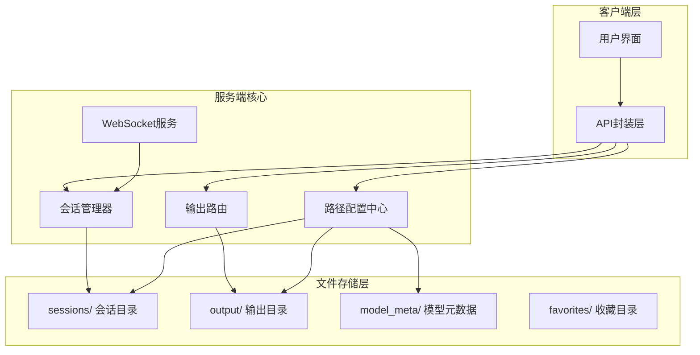
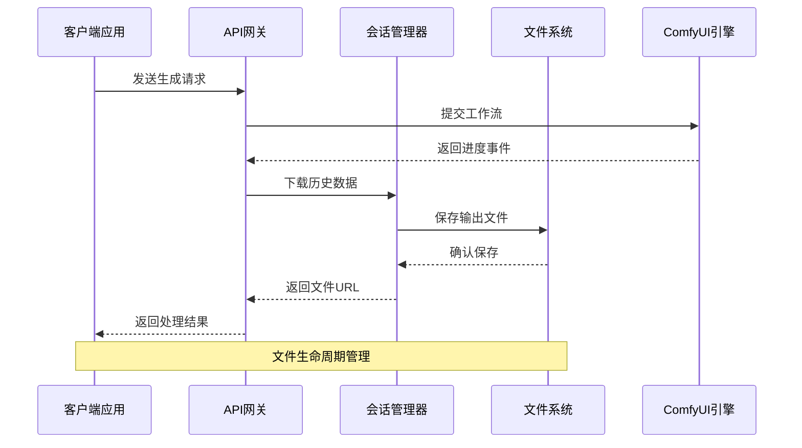
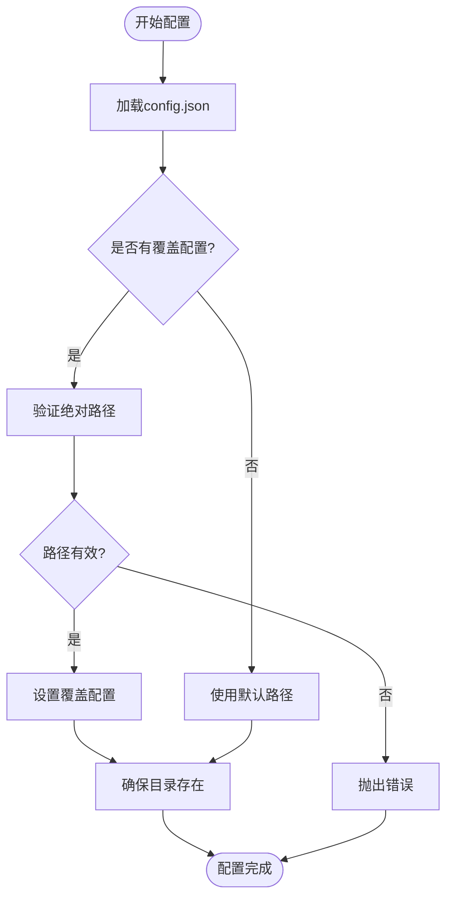
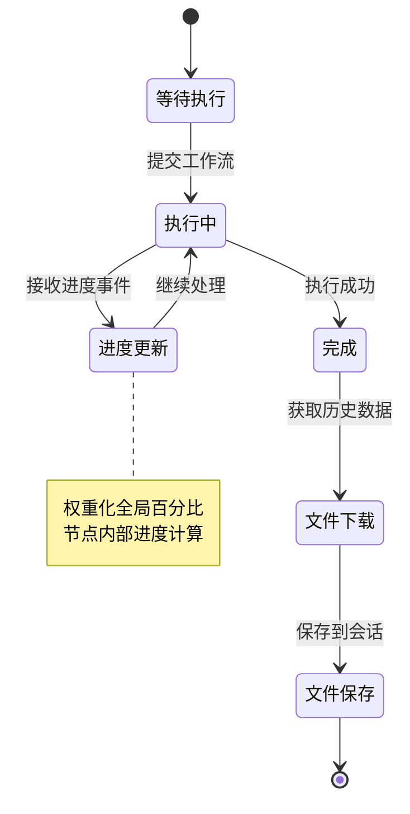
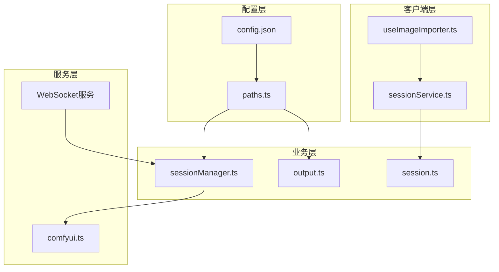

# 文件系统管理

<cite>
**本文档引用的文件**
- [paths.ts](file://server/src/config/paths.ts)
- [output.ts](file://server/src/routes/output.ts)
- [sessionManager.ts](file://server/src/services/sessionManager.ts)
- [index.ts](file://server/src/index.ts)
- [session.ts](file://server/src/routes/session.ts)
- [comfyui.ts](file://server/src/services/comfyui.ts)
- [sessionService.ts](file://client/src/services/sessionService.ts)
- [autoFillMetadata.ts](file://server/src/scripts/autoFillMetadata.ts)
- [useImageImporter.ts](file://client/src/hooks/useImageImporter.ts)
</cite>

## 目录
1. [简介](#简介)
2. [项目结构](#项目结构)
3. [核心组件](#核心组件)
4. [架构概览](#架构概览)
5. [详细组件分析](#详细组件分析)
6. [依赖关系分析](#依赖关系分析)
7. [性能考虑](#性能考虑)
8. [故障排除指南](#故障排除指南)
9. [结论](#结论)
10. [附录](#附录)

## 简介
本文件系统管理文档全面阐述了项目的文件组织结构、输出文件处理流程、缓存策略设计以及跨平台兼容性处理。系统采用会话驱动的文件管理模式，将用户的工作成果以会话为单位进行隔离存储，并通过统一的路径配置中心实现灵活的目录管理。输出文件采用工作流分类存储，结合实时进度追踪和历史数据下载机制，实现了完整的AI生成工作流文件生命周期管理。

## 项目结构
项目采用前后端分离的架构设计，文件系统管理主要集中在服务端，客户端通过API进行交互。



**图表来源**
- [index.ts:82-100](file://server/src/index.ts#L82-L100)
- [paths.ts:68-100](file://server/src/config/paths.ts#L68-L100)

**章节来源**
- [index.ts:118-146](file://server/src/index.ts#L118-L146)
- [paths.ts:139-156](file://server/src/config/paths.ts#L139-L156)

## 核心组件
文件系统管理由四个核心组件构成：路径配置中心、会话管理器、输出路由和WebSocket服务。

### 路径配置中心
路径配置中心负责集中管理所有文件系统的根目录和子目录，支持运行时动态切换和持久化配置。

### 会话管理器
会话管理器以会话为单位组织文件，每个会话包含五个标签页，每个标签页下有input、masks、output三个子目录，形成完整的文件层次结构。

### 输出路由
输出路由提供标准化的文件访问接口，支持文件列表查询、单文件下载和跨平台文件打开功能。

### WebSocket服务
WebSocket服务连接到ComfyUI，实时接收进度事件并处理完成后的历史数据下载。

**章节来源**
- [paths.ts:24-100](file://server/src/config/paths.ts#L24-L100)
- [sessionManager.ts:11-18](file://server/src/services/sessionManager.ts#L11-L18)
- [output.ts:13-25](file://server/src/routes/output.ts#L13-L25)
- [index.ts:158-494](file://server/src/index.ts#L158-L494)

## 架构概览
系统采用分层架构设计，通过中间件和路由层实现文件系统的统一访问。



**图表来源**
- [index.ts:373-420](file://server/src/index.ts#L373-L420)
- [sessionManager.ts:37-48](file://server/src/services/sessionManager.ts#L37-L48)

## 详细组件分析

### 路径配置管理
路径配置中心提供了灵活的目录管理机制，支持以下特性：

#### 配置文件管理
- `config.json`持久化存储sessionsBase覆盖配置
- 支持Electron打包场景下的数据根目录覆盖
- 运行时动态加载和写入配置

#### 目录验证机制
- 绝对路径检查和规范化
- 目录存在性和写权限验证
- 防止嵌套在session子目录下的递归问题



**图表来源**
- [paths.ts:35-100](file://server/src/config/paths.ts#L35-L100)

**章节来源**
- [paths.ts:28-66](file://server/src/config/paths.ts#L28-L66)
- [paths.ts:106-137](file://server/src/config/paths.ts#L106-L137)

### 会话文件组织结构
每个会话目录包含固定的子目录结构，确保文件的有序存储和管理。

#### 目录层次结构
```
sessions/
├── {sessionId}/
│   ├── tab-0/
│   │   ├── input/     # 输入图像
│   │   ├── masks/     # 掩码文件
│   │   └── output/    # 输出结果
│   ├── tab-1/
│   ├── tab-2/
│   ├── tab-3/
│   ├── tab-4/
│   ├── tab-5/
│   └── session.json   # 会话状态文件
```

#### 文件命名规范
- 输入文件：`{imageId}{ext}`
- 输出文件：按生成顺序编号
- 掩码文件：替换特殊字符后的安全名称

**章节来源**
- [sessionManager.ts:11-18](file://server/src/services/sessionManager.ts#L11-L18)
- [sessionManager.ts:22-62](file://server/src/services/sessionManager.ts#L22-L62)

### 输出文件处理流程
系统实现了完整的输出文件处理链路，从生成到存储的全流程管理。

#### 实时进度追踪
WebSocket服务连接到ComfyUI，实时接收进度事件并进行权重化计算。

#### 历史数据下载
完成后通过历史接口获取输出文件信息，批量下载并保存到会话目录。



**图表来源**
- [index.ts:273-448](file://server/src/index.ts#L273-L448)

**章节来源**
- [index.ts:373-420](file://server/src/index.ts#L373-L420)
- [comfyui.ts:265-375](file://server/src/services/comfyui.ts#L265-L375)

### 文件访问接口
系统提供了多种文件访问方式，满足不同场景的需求。

#### 静态文件服务
- `/api/session-files/` 动态指向会话目录
- `/output/` 静态输出目录
- `/model_meta/` 模型元数据目录

#### 动态文件操作
- 文件列表查询和排序
- 单文件下载和预览
- 跨平台文件打开功能

**章节来源**
- [index.ts:134-145](file://server/src/index.ts#L134-L145)
- [output.ts:27-78](file://server/src/routes/output.ts#L27-L78)

### 缓存策略设计
系统采用了多层次的缓存策略来优化性能和资源使用。

#### 内存缓存
- WebSocket事件缓冲：避免客户端连接延迟导致的事件丢失
- 节点信息缓存：权重计算和进度追踪的中间状态
- 会话状态缓存：最近使用的会话数据

#### 磁盘缓存
- 临时文件管理：生成过程中的中间产物
- 预览缓存：用户预览的缩略图
- 历史记录缓存：已完成任务的结果

#### 内存优化
- 流式处理：大文件的分块传输
- 按需加载：只在需要时读取文件内容
- 对象池：复用频繁创建的对象实例

**章节来源**
- [index.ts:178-185](file://server/src/index.ts#L178-L185)
- [comfyui.ts:146-166](file://server/src/services/comfyui.ts#L146-L166)

### 跨平台兼容性处理
系统针对不同操作系统进行了专门的兼容性处理。

#### 路径分隔符处理
- 统一使用POSIX风格的路径分隔符
- 自动处理不同平台的路径差异
- URL编码和解码确保路径安全性

#### 权限管理
- 掩码文件特殊字符处理：Windows不支持冒号字符
- 文件名安全化：移除或替换不安全字符
- 目录权限验证：确保写入权限

#### 特殊字符处理
- 文件名字符集限制：避免在不同系统上的兼容性问题
- 路径转义：防止特殊字符造成的安全问题
- 编码统一：UTF-8编码确保国际化支持

**章节来源**
- [sessionManager.ts:59-61](file://server/src/services/sessionManager.ts#L59-L61)
- [sessionManager.ts:241-246](file://server/src/services/sessionManager.ts#L241-L246)

## 依赖关系分析



**图表来源**
- [index.ts:15-18](file://server/src/index.ts#L15-L18)
- [session.ts:4-16](file://server/src/routes/session.ts#L4-L16)

**章节来源**
- [index.ts:15-18](file://server/src/index.ts#L15-L18)
- [session.ts:4-16](file://server/src/routes/session.ts#L4-L16)

## 性能考虑
文件系统管理在性能方面采用了多项优化措施：

### I/O优化
- 批量文件操作：减少系统调用次数
- 异步文件处理：非阻塞I/O操作
- 缓冲区管理：合理的内存分配策略

### 网络优化
- 流式传输：大文件的分块下载
- 压缩传输：启用Gzip压缩
- 连接复用：WebSocket长连接

### 内存管理
- 对象池：复用Buffer对象
- 垃圾回收：及时释放不再使用的资源
- 内存监控：防止内存泄漏

## 故障排除指南

### 常见问题诊断
1. **文件路径错误**
   - 检查路径配置是否正确
   - 验证目录是否存在和可访问
   - 确认文件权限设置

2. **会话数据丢失**
   - 检查session.json文件完整性
   - 验证会话目录结构
   - 确认文件命名冲突

3. **文件下载失败**
   - 检查ComfyUI连接状态
   - 验证输出文件存在性
   - 确认WebSocket连接正常

**章节来源**
- [paths.ts:51-55](file://server/src/config/paths.ts#L51-L55)
- [sessionManager.ts:124-133](file://server/src/services/sessionManager.ts#L124-L133)

## 结论
本文件系统管理方案通过会话驱动的组织结构、完善的路径配置管理和高效的缓存策略，实现了AI生成工作流的完整文件生命周期管理。系统具备良好的跨平台兼容性、可扩展性和性能表现，能够满足复杂应用场景下的文件管理需求。通过持续的优化和改进，系统将继续提升用户体验和系统稳定性。

## 附录

### API使用示例
客户端通过sessionService.ts提供的API进行文件操作：

```typescript
// 上传输入图像
const imageUrl = await uploadSessionImage(sessionId, tabId, imageId, file);

// 上传掩码文件
await uploadSessionMask(sessionId, tabId, maskKey, blob);

// 重命名卡片资产
const result = await renameCard(sessionId, tabId, imageId, newLabel);

// 批量重命名
const results = await renameCardsBatch(sessionId, tabId, items);
```

### 最佳实践指南
1. **文件命名规范**
   - 使用有意义的标签名
   - 避免特殊字符和保留字
   - 保持文件名简洁明了

2. **目录组织原则**
   - 按工作流类型分类存储
   - 保持目录层级扁平化
   - 定期清理临时文件

3. **性能优化建议**
   - 合理设置缓冲区大小
   - 使用流式处理大文件
   - 实施适当的缓存策略

4. **安全注意事项**
   - 验证文件类型和大小
   - 清理用户输入的路径
   - 实施访问权限控制

**章节来源**
- [sessionService.ts:90-231](file://client/src/services/sessionService.ts#L90-L231)
- [autoFillMetadata.ts:201-257](file://server/src/scripts/autoFillMetadata.ts#L201-L257)