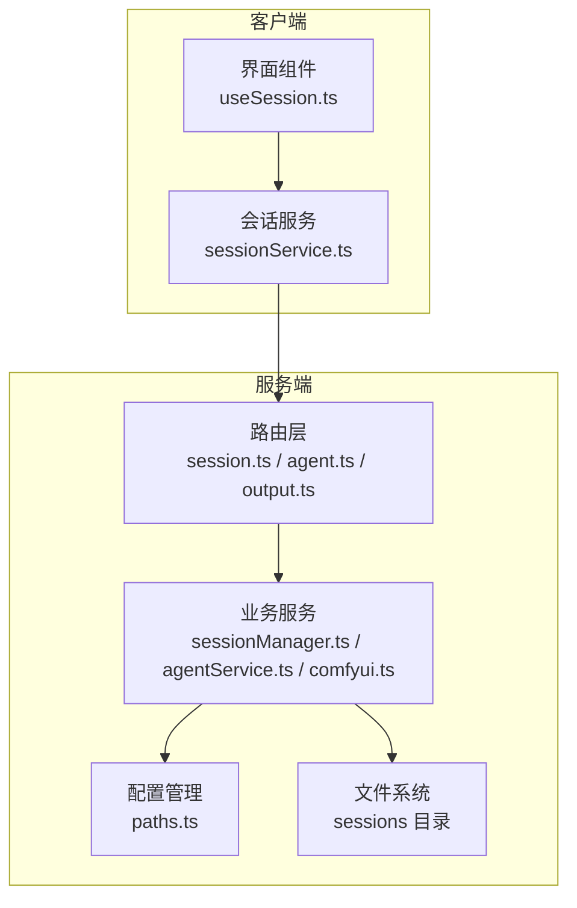
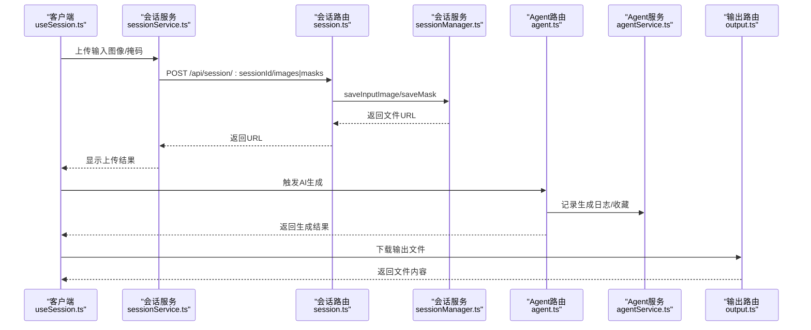
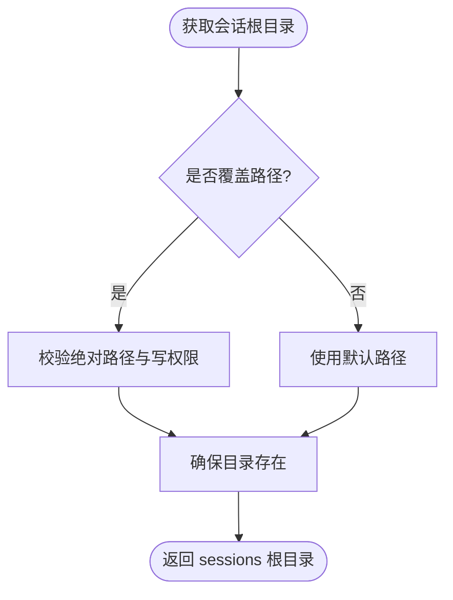
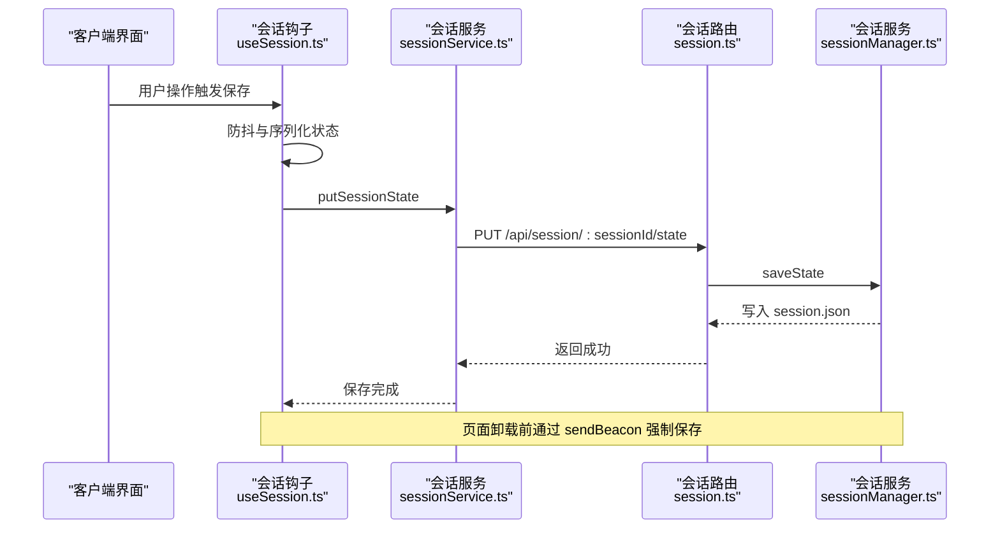
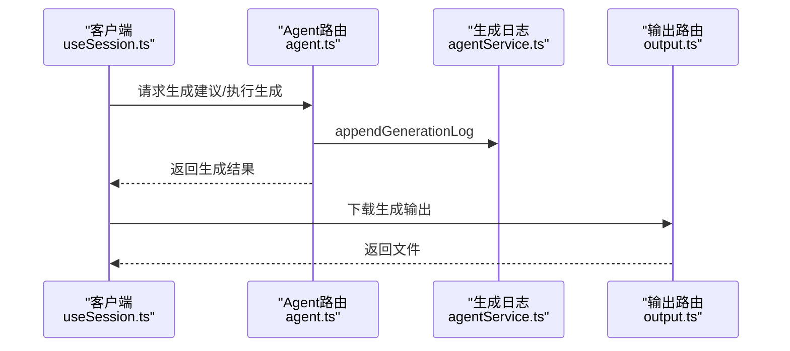
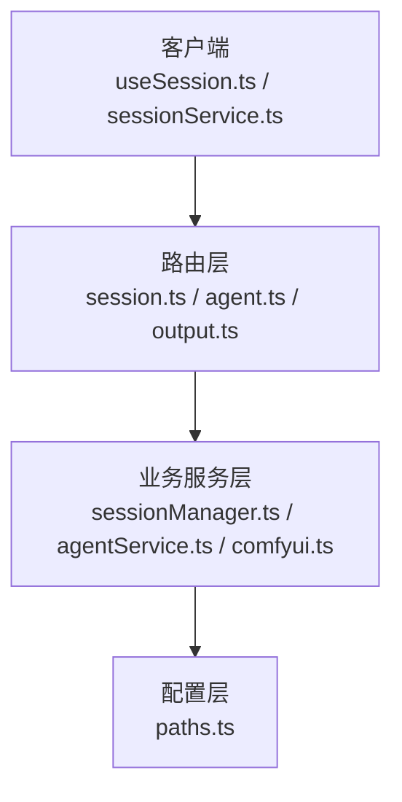

# 临时文件管理

<cite>
**本文引用的文件**
- [paths.ts](file://server/src/config/paths.ts)
- [sessionManager.ts](file://server/src/services/sessionManager.ts)
- [session.ts](file://server/src/routes/session.ts)
- [sessionService.ts](file://client/src/services/sessionService.ts)
- [useSession.ts](file://client/src/hooks/useSession.ts)
- [agent.ts](file://server/src/routes/agent.ts)
- [agentService.ts](file://server/src/services/agentService.ts)
- [output.ts](file://server/src/routes/output.ts)
- [comfyui.ts](file://server/src/services/comfyui.ts)
</cite>

## 目录
1. [简介](#简介)
2. [项目结构](#项目结构)
3. [核心组件](#核心组件)
4. [架构概览](#架构概览)
5. [详细组件分析](#详细组件分析)
6. [依赖关系分析](#依赖关系分析)
7. [性能考量](#性能考量)
8. [故障排除指南](#故障排除指南)
9. [结论](#结论)
10. [附录](#附录)

## 简介
本文件面向临时文件管理系统，重点解释 pa_temp 与 rp_temp 目录的设计目的与用途，以及提示词助手与 AI Agent 的临时文件管理机制。文档涵盖临时文件的生命周期（创建、使用、清理与销毁）、命名规则与组织结构（时间戳、会话ID、任务ID的使用策略）、安全性考虑（访问权限与敏感数据保护）、清理策略（自动清理、手动清理与磁盘空间监控）。

## 项目结构
本项目采用前后端分离架构，临时文件主要存储在服务端的 sessions 目录中，客户端通过 API 上传与下载临时文件。提示词助手与 AI Agent 的临时文件通过会话状态与生成日志进行管理。

图表来源
- [session.ts:1-163](file://server/src/routes/session.ts#L1-L163)
- [agent.ts:1-800](file://server/src/routes/agent.ts#L1-L800)
- [output.ts:1-139](file://server/src/routes/output.ts#L1-L139)
- [sessionManager.ts:1-539](file://server/src/services/sessionManager.ts#L1-L539)
- [agentService.ts:1-126](file://server/src/services/agentService.ts#L1-L126)
- [paths.ts:1-156](file://server/src/config/paths.ts#L1-L156)

章节来源
- [paths.ts:1-156](file://server/src/config/paths.ts#L1-L156)
- [session.ts:1-163](file://server/src/routes/session.ts#L1-L163)
- [sessionManager.ts:1-539](file://server/src/services/sessionManager.ts#L1-L539)
- [sessionService.ts:1-232](file://client/src/services/sessionService.ts#L1-L232)
- [useSession.ts:1-435](file://client/src/hooks/useSession.ts#L1-L435)
- [agent.ts:1-800](file://server/src/routes/agent.ts#L1-L800)
- [agentService.ts:1-126](file://server/src/services/agentService.ts#L1-L126)
- [output.ts:1-139](file://server/src/routes/output.ts#L1-L139)

## 核心组件
- 会话路径管理：集中管理 sessions 根目录，支持运行时切换与校验。
- 会话文件服务：负责输入图像、掩码、输出文件的保存与读取，维护会话状态。
- 会话生命周期：提供会话列表、删除、封面设置与旧会话清理。
- 生成日志与收藏：记录 AI Agent 的生成行为，支持收藏与偏好画像。
- 输出文件路由：提供工作流输出文件的列举与下载。
- 客户端会话钩子：负责会话初始化、状态持久化、资源上传与恢复。

章节来源
- [paths.ts:68-137](file://server/src/config/paths.ts#L68-L137)
- [sessionManager.ts:11-172](file://server/src/services/sessionManager.ts#L11-L172)
- [session.ts:21-160](file://server/src/routes/session.ts#L21-L160)
- [agentService.ts:48-125](file://server/src/services/agentService.ts#L48-L125)
- [output.ts:13-78](file://server/src/routes/output.ts#L13-L78)
- [useSession.ts:118-435](file://client/src/hooks/useSession.ts#L118-L435)

## 架构概览
临时文件管理贯穿“客户端上传 → 服务端存储 → 会话状态维护 → AI Agent 生成 → 输出文件管理”的全链路。客户端通过会话服务上传输入图像与掩码，服务端将其保存至 sessions 目录对应会话与标签页下；AI Agent 执行生成后，输出文件由输出路由提供访问；会话状态与生成日志用于生命周期管理与清理策略。

图表来源
- [useSession.ts:168-227](file://client/src/hooks/useSession.ts#L168-L227)
- [sessionService.ts:90-119](file://client/src/services/sessionService.ts#L90-L119)
- [session.ts:21-52](file://server/src/routes/session.ts#L21-L52)
- [sessionManager.ts:22-62](file://server/src/services/sessionManager.ts#L22-L62)
- [agent.ts:1-800](file://server/src/routes/agent.ts#L1-L800)
- [agentService.ts:63-72](file://server/src/services/agentService.ts#L63-L72)
- [output.ts:60-78](file://server/src/routes/output.ts#L60-L78)

## 详细组件分析

### 会话路径与目录结构
- sessions 根目录可通过设置接口动态切换，支持绝对路径校验与写权限探测。
- 每个会话包含多个标签页（tab-0 到 tab-5），每个标签页下包含 input、masks、output 三个子目录。
- 会话状态文件 session.json 记录会话元数据与更新时间，用于排序与清理。

图表来源
- [paths.ts:74-100](file://server/src/config/paths.ts#L74-L100)
- [sessionManager.ts:11-18](file://server/src/services/sessionManager.ts#L11-L18)

章节来源
- [paths.ts:68-137](file://server/src/config/paths.ts#L68-L137)
- [sessionManager.ts:11-18](file://server/src/services/sessionManager.ts#L11-L18)

### 会话文件管理与生命周期
- 输入图像与掩码上传：客户端上传后，服务端保存至对应会话与标签页的 input 或 masks 目录，并返回可访问的 URL。
- 输出文件保存：工作流生成完成后，服务端将输出文件写入 output 目录，客户端通过输出路由下载。
- 会话状态持久化：客户端变更触发自动保存，服务端写入 session.json；页面卸载时通过 sendBeacon 强制保存。
- 会话清理：支持删除单个会话与按时间顺序保留最近若干会话。

图表来源
- [useSession.ts:168-185](file://client/src/hooks/useSession.ts#L168-L185)
- [sessionService.ts:121-132](file://client/src/services/sessionService.ts#L121-L132)
- [session.ts:54-71](file://server/src/routes/session.ts#L54-L71)
- [sessionManager.ts:102-122](file://server/src/services/sessionManager.ts#L102-L122)

章节来源
- [session.ts:21-82](file://server/src/routes/session.ts#L21-L82)
- [sessionManager.ts:22-62](file://server/src/services/sessionManager.ts#L22-L62)
- [sessionManager.ts:102-133](file://server/src/services/sessionManager.ts#L102-L133)
- [useSession.ts:168-185](file://client/src/hooks/useSession.ts#L168-L185)
- [useSession.ts:410-431](file://client/src/hooks/useSession.ts#L410-L431)

### 提示词助手与 AI Agent 的临时文件管理
- 提示词助手：通过会话状态管理输入图像与生成过程中的中间结果，输出文件保存在 output 目录，客户端通过输出路由访问。
- AI Agent：执行生成时记录生成日志与收藏信息，支持按会话维度进行偏好画像与后续建议生成；生成结果同样保存在 output 目录。

图表来源
- [agent.ts:1-800](file://server/src/routes/agent.ts#L1-L800)
- [agentService.ts:63-72](file://server/src/services/agentService.ts#L63-L72)
- [output.ts:60-78](file://server/src/routes/output.ts#L60-L78)

章节来源
- [agent.ts:1-800](file://server/src/routes/agent.ts#L1-L800)
- [agentService.ts:48-125](file://server/src/services/agentService.ts#L48-L125)
- [output.ts:13-78](file://server/src/routes/output.ts#L13-L78)

### 临时文件命名规则与组织结构
- 会话ID：每个会话拥有唯一标识符，作为目录层级的一部分。
- 标签页ID：0 到 5，对应不同的工作流或功能模块。
- 输入文件：以图像ID加扩展名命名，掩码文件以掩码键替换非法字符后加 .png 扩展名。
- 输出文件：按任务顺序命名，如 {label}_1{ext}、{label}_2{ext} 等，便于与会话状态关联。
- 会话封面：复制选定文件为 cover{ext}，并标记为手动封面。

章节来源
- [sessionManager.ts:22-62](file://server/src/services/sessionManager.ts#L22-L62)
- [sessionManager.ts:50-62](file://server/src/services/sessionManager.ts#L50-L62)
- [sessionManager.ts:256-360](file://server/src/services/sessionManager.ts#L256-L360)
- [sessionManager.ts:178-218](file://server/src/services/sessionManager.ts#L178-L218)

### 安全性考虑
- 路径校验：设置接口对 sessions 根目录进行绝对路径与写权限校验，防止非法路径与权限问题。
- URL 解码与路径解析：输出路由对 URL 进行解码并解析为物理路径，避免路径穿越攻击。
- 敏感数据保护：会话状态与生成日志包含用户生成内容，需确保仅通过受控接口访问；客户端与服务端均需验证 URL 与文件存在性。

章节来源
- [paths.ts:106-137](file://server/src/config/paths.ts#L106-L137)
- [output.ts:80-136](file://server/src/routes/output.ts#L80-L136)

### 清理策略
- 自动清理：按时间顺序保留最近若干会话，超出数量的会话将被删除。
- 手动清理：用户可通过设置接口切换 sessions 根目录，或删除特定会话。
- 磁盘空间监控：建议定期检查 sessions 目录大小，必要时通过自动清理策略释放空间。

章节来源
- [sessionManager.ts:220-226](file://server/src/services/sessionManager.ts#L220-L226)
- [sessionManager.ts:166-172](file://server/src/services/sessionManager.ts#L166-L172)
- [session.ts:108-113](file://server/src/routes/session.ts#L108-L113)

## 依赖关系分析
- 路由层依赖业务服务层，业务服务层依赖配置管理与文件系统。
- 客户端通过会话服务与路由交互，间接依赖会话状态与生成日志。
- 输出路由依赖输出目录与会话文件路径解析。

图表来源
- [session.ts:1-163](file://server/src/routes/session.ts#L1-L163)
- [agent.ts:1-800](file://server/src/routes/agent.ts#L1-L800)
- [output.ts:1-139](file://server/src/routes/output.ts#L1-L139)
- [sessionManager.ts:1-539](file://server/src/services/sessionManager.ts#L1-L539)
- [agentService.ts:1-126](file://server/src/services/agentService.ts#L1-L126)
- [paths.ts:1-156](file://server/src/config/paths.ts#L1-L156)
- [useSession.ts:1-435](file://client/src/hooks/useSession.ts#L1-L435)
- [sessionService.ts:1-232](file://client/src/services/sessionService.ts#L1-L232)

章节来源
- [session.ts:1-163](file://server/src/routes/session.ts#L1-L163)
- [agent.ts:1-800](file://server/src/routes/agent.ts#L1-L800)
- [output.ts:1-139](file://server/src/routes/output.ts#L1-L139)
- [sessionManager.ts:1-539](file://server/src/services/sessionManager.ts#L1-L539)
- [agentService.ts:1-126](file://server/src/services/agentService.ts#L1-L126)
- [paths.ts:1-156](file://server/src/config/paths.ts#L1-L156)
- [useSession.ts:1-435](file://client/src/hooks/useSession.ts#L1-L435)
- [sessionService.ts:1-232](file://client/src/services/sessionService.ts#L1-L232)

## 性能考量
- 文件上传与下载：使用内存存储与流式传输相结合的方式，减少内存峰值；建议对大文件进行分块处理。
- 会话状态写入：采用防抖与批量保存策略，降低频繁写入对磁盘的影响。
- 生成日志与收藏：仅在必要时写入，避免频繁 I/O 操作。
- 输出文件访问：通过路由直接读取文件系统，减少不必要的中间层处理。

## 故障排除指南
- 会话路径不可写：检查路径是否存在、是否有写权限；必要时重新设置 sessions 根目录。
- 文件上传失败：确认客户端网络连接与服务端路由状态；检查文件大小与类型限制。
- 会话状态丢失：检查 beforeunload 保存逻辑与 sendBeacon 请求；确认浏览器支持 keepalive 与 sendBeacon。
- 输出文件无法访问：确认输出路由 URL 正确且文件存在；检查路径解析与 URL 解码。

章节来源
- [paths.ts:123-136](file://server/src/config/paths.ts#L123-L136)
- [session.ts:21-52](file://server/src/routes/session.ts#L21-L52)
- [useSession.ts:410-431](file://client/src/hooks/useSession.ts#L410-L431)
- [output.ts:60-78](file://server/src/routes/output.ts#L60-L78)

## 结论
本系统通过集中化的会话路径管理与严格的文件命名规范，实现了提示词助手与 AI Agent 的临时文件高效管理。结合自动清理与手动清理策略，能够在保证用户体验的同时有效控制磁盘占用。建议持续监控 sessions 目录大小，并根据实际需求调整清理阈值与保留策略。

## 附录
- 会话目录结构示例：sessions/{sessionId}/tab-{tabId}/{input|masks|output}
- 生成日志与收藏：sessions/{sessionId}/generation-log.json、sessions/{sessionId}/favorites.json
- 输出文件目录：output/{workflowDir}/{filename}