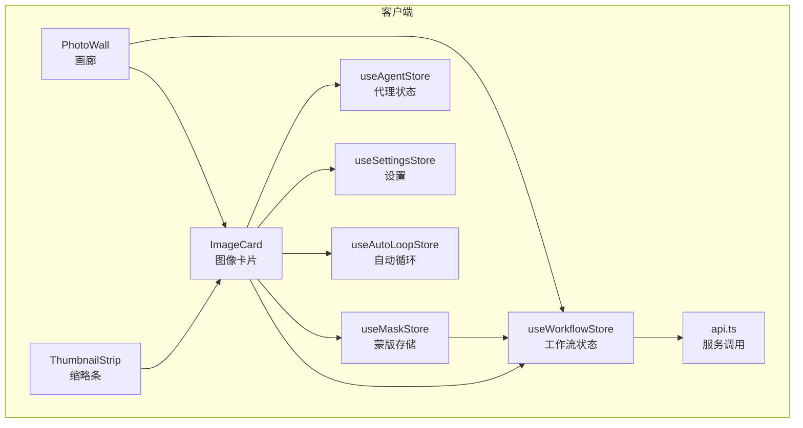
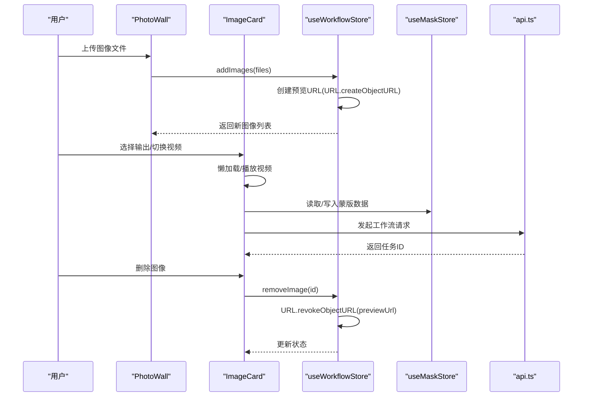
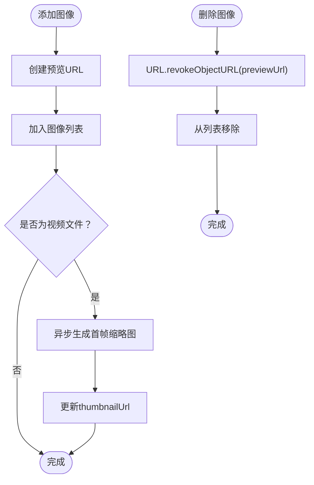
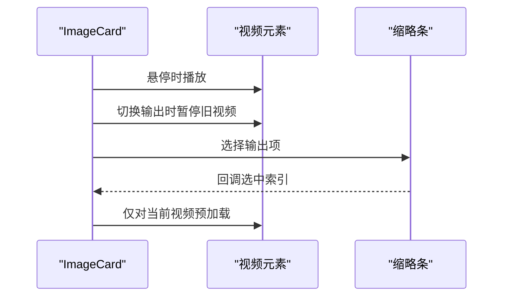
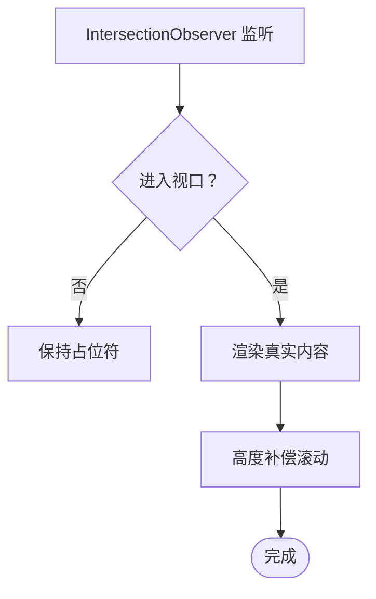
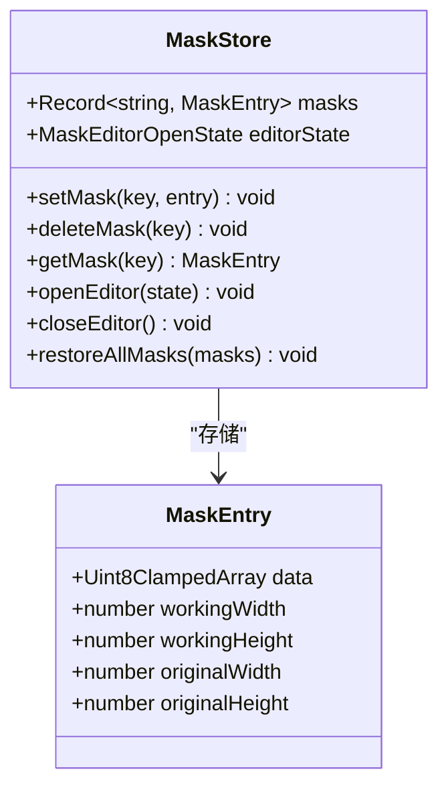
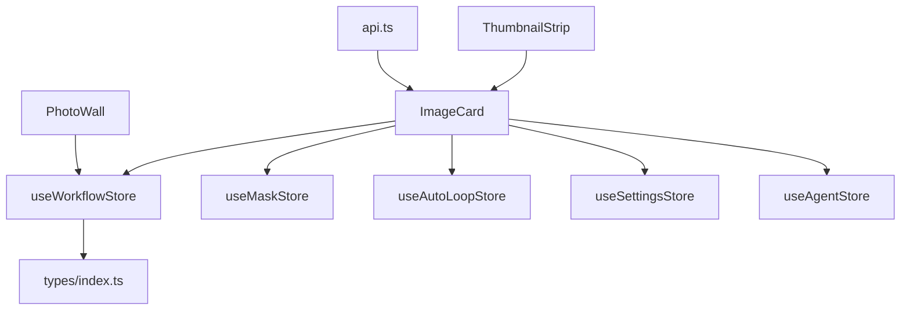

# 内存优化策略

<cite>
**本文档引用的文件**
- [useWorkflowStore.ts](file://client/src/hooks/useWorkflowStore.ts)
- [ImageCard.tsx](file://client/src/components/ImageCard.tsx)
- [PhotoWall.tsx](file://client/src/components/PhotoWall.tsx)
- [ThumbnailStrip.tsx](file://client/src/components/ThumbnailStrip.tsx)
- [useMaskStore.ts](file://client/src/hooks/useMaskStore.ts)
- [useAgentStore.ts](file://client/src/hooks/useAgentStore.ts)
- [useSettingsStore.ts](file://client/src/hooks/useSettingsStore.ts)
- [useAutoLoopStore.ts](file://client/src/hooks/useAutoLoopStore.ts)
- [index.ts](file://client/src/types/index.ts)
- [api.ts](file://client/src/services/api.ts)
</cite>

## 目录
1. [引言](#引言)
2. [项目结构](#项目结构)
3. [核心组件](#核心组件)
4. [架构概览](#架构概览)
5. [详细组件分析](#详细组件分析)
6. [依赖关系分析](#依赖关系分析)
7. [性能考虑](#性能考虑)
8. [故障排除指南](#故障排除指南)
9. [结论](#结论)

## 引言

本文件针对 CorineKit_Pix2Real 项目中的内存优化策略进行全面技术分析。重点涵盖以下方面：

- 大图像文件的内存管理机制：包括图像数据的流式处理、URL 对象生命周期管理、视频首帧缩略图生成与清理。
- 状态管理的内存优化：基于 Zustand store 的内存回收与状态清理策略，避免无界增长。
- 图像缓存的内存控制：缩略图缓存、预览图管理与内存阈值控制。
- 垃圾回收优化：及时释放不再使用的资源、避免循环引用。
- 内存泄漏检测与预防：内存使用监控与异常处理机制。
- 性能调优建议：内存使用最佳实践与优化技巧。

## 项目结构

该项目采用前端单页应用架构，核心逻辑集中在客户端的 Hooks 和组件中，配合服务端 API 完成工作流执行与资源管理。内存优化主要体现在以下模块：

- 工作流状态管理：统一管理图像、任务、提示词等状态，并负责 URL 对象的创建与撤销。
- 图像卡片与画廊：负责图像的展示、切换与交互，采用懒加载与虚拟化减少内存占用。
- 蒙版存储：管理蒙版数据，避免重复分配与泄漏。
- 设置与代理：通过设置项控制行为，间接影响内存使用策略。

**图表来源**
- [useWorkflowStore.ts:191-923](file://client/src/hooks/useWorkflowStore.ts#L191-L923)
- [ImageCard.tsx:51-1715](file://client/src/components/ImageCard.tsx#L51-L1715)
- [PhotoWall.tsx:103-781](file://client/src/components/PhotoWall.tsx#L103-L781)
- [ThumbnailStrip.tsx:35-240](file://client/src/components/ThumbnailStrip.tsx#L35-L240)
- [useMaskStore.ts:32-51](file://client/src/hooks/useMaskStore.ts#L32-L51)
- [useAgentStore.ts:198-337](file://client/src/hooks/useAgentStore.ts#L198-L337)
- [useSettingsStore.ts:54-177](file://client/src/hooks/useSettingsStore.ts#L54-L177)
- [useAutoLoopStore.ts:35-97](file://client/src/hooks/useAutoLoopStore.ts#L35-L97)
- [api.ts:3-42](file://client/src/services/api.ts#L3-L42)

**章节来源**
- [useWorkflowStore.ts:1-923](file://client/src/hooks/useWorkflowStore.ts#L1-L923)
- [PhotoWall.tsx:1-781](file://client/src/components/PhotoWall.tsx#L1-L781)

## 核心组件

本节聚焦于与内存优化直接相关的组件与状态管理模块。

- 工作流状态管理（useWorkflowStore）
  - 负责图像列表、任务状态、提示词、输出索引等的集中管理。
  - 关键内存优化点：创建与撤销预览 URL、异步生成视频缩略图、批量移除图像时统一清理 URL。
- 图像卡片（ImageCard）
  - 负责单个图像卡片的渲染与交互，包含进度覆盖层、输出切换、拖拽导出等功能。
  - 内存优化点：懒加载、视频元素的播放与暂停控制、输出切换时的旧视频暂停。
- 画廊（PhotoWall）
  - 负责大量图像卡片的渲染与滚动，采用 IntersectionObserver 实现懒加载。
  - 内存优化点：占位符与真实内容的平滑过渡，减少滚动过程中的高度抖动。
- 缩略条（ThumbnailStrip）
  - 负责输出图像的缩略图切换，支持拖拽导出。
  - 内存优化点：视频预加载策略与拖拽时的媒体元素复用。
- 蒙版存储（useMaskStore）
  - 存储蒙版的原始像素数据，避免重复分配。
  - 内存优化点：按键删除、恢复时的批量清理。
- 代理状态（useAgentStore）
  - 管理聊天消息、上传图片、执行状态等，避免无界增长。
  - 内存优化点：清理上传图片、执行状态与消息列表。
- 设置（useSettingsStore）
  - 控制行为选项，间接影响内存使用（如通知开关、随机生成模式等）。
- 自动循环（useAutoLoopStore）
  - 控制跨标签打断请求，避免长时间运行导致的状态膨胀。

**章节来源**
- [useWorkflowStore.ts:191-923](file://client/src/hooks/useWorkflowStore.ts#L191-L923)
- [ImageCard.tsx:51-1715](file://client/src/components/ImageCard.tsx#L51-L1715)
- [PhotoWall.tsx:21-97](file://client/src/components/PhotoWall.tsx#L21-L97)
- [ThumbnailStrip.tsx:35-240](file://client/src/components/ThumbnailStrip.tsx#L35-L240)
- [useMaskStore.ts:32-51](file://client/src/hooks/useMaskStore.ts#L32-L51)
- [useAgentStore.ts:198-337](file://client/src/hooks/useAgentStore.ts#L198-L337)
- [useSettingsStore.ts:54-177](file://client/src/hooks/useSettingsStore.ts#L54-L177)
- [useAutoLoopStore.ts:35-97](file://client/src/hooks/useAutoLoopStore.ts#L35-L97)

## 架构概览

下图展示了内存优化相关的组件交互流程，特别是图像数据的生命周期与状态管理的关系。

**图表来源**
- [PhotoWall.tsx:103-781](file://client/src/components/PhotoWall.tsx#L103-L781)
- [ImageCard.tsx:51-1715](file://client/src/components/ImageCard.tsx#L51-L1715)
- [useWorkflowStore.ts:297-470](file://client/src/hooks/useWorkflowStore.ts#L297-L470)
- [useMaskStore.ts:32-51](file://client/src/hooks/useMaskStore.ts#L32-L51)
- [api.ts:3-42](file://client/src/services/api.ts#L3-L42)

## 详细组件分析

### 工作流状态管理（useWorkflowStore）

- 图像预览 URL 生命周期
  - 创建：添加图像时，使用 URL.createObjectURL 生成预览 URL 并存储在 ImageItem.previewUrl。
  - 清理：删除图像、批量删除或清空当前标签图像时，统一调用 URL.revokeObjectURL 清理。
- 视频缩略图生成
  - 异步生成：对视频文件，使用 video 元素提取首帧作为缩略图，完成后更新到 thumbnailUrl。
  - 资源清理：生成完成后清理 video 元素事件监听、设置 src 为空并撤销 URL。
- 任务状态与输出管理
  - 任务状态推进时，确保从 queued 自动推进为 processing，避免状态停滞导致的内存占用。
  - 输出数组合并与默认索引选择，减少不必要的状态重建。

**图表来源**
- [useWorkflowStore.ts:8-69](file://client/src/hooks/useWorkflowStore.ts#L8-L69)
- [useWorkflowStore.ts:297-470](file://client/src/hooks/useWorkflowStore.ts#L297-L470)

**章节来源**
- [useWorkflowStore.ts:8-69](file://client/src/hooks/useWorkflowStore.ts#L8-L69)
- [useWorkflowStore.ts:297-470](file://client/src/hooks/useWorkflowStore.ts#L297-L470)
- [useWorkflowStore.ts:457-470](file://client/src/hooks/useWorkflowStore.ts#L457-L470)

### 图像卡片（ImageCard）

- 懒加载与视频播放控制
  - 使用 IntersectionObserver 与懒加载容器，减少初始渲染的内存压力。
  - 视频工作流中，切换输出时暂停旧视频并仅对当前显示的视频进行预加载。
- 输出切换与覆盖层
  - 进度覆盖层在任务进行时显示，完成后自动移除，避免长期挂载。
- 拖拽导出
  - 支持外部拖拽导出，使用 DownloadURL 方案，避免额外的内存拷贝。

**图表来源**
- [ImageCard.tsx:291-304](file://client/src/components/ImageCard.tsx#L291-L304)
- [ImageCard.tsx:676-736](file://client/src/components/ImageCard.tsx#L676-L736)
- [ThumbnailStrip.tsx:136-213](file://client/src/components/ThumbnailStrip.tsx#L136-L213)

**章节来源**
- [ImageCard.tsx:291-304](file://client/src/components/ImageCard.tsx#L291-L304)
- [ImageCard.tsx:676-736](file://client/src/components/ImageCard.tsx#L676-L736)
- [ThumbnailStrip.tsx:136-213](file://client/src/components/ThumbnailStrip.tsx#L136-L213)

### 画廊（PhotoWall）

- 懒加载策略
  - 使用 IntersectionObserver 在进入视口时才渲染真实内容，减少初始内存占用。
  - 占位符高度补偿：从占位符切换到真实内容时，计算高度差并补偿滚动位置，避免滚动跳变。
- 批量操作
  - 支持批量执行、批量删除、批量重命名等操作，减少多次状态更新带来的内存抖动。

**图表来源**
- [PhotoWall.tsx:21-97](file://client/src/components/PhotoWall.tsx#L21-L97)

**章节来源**
- [PhotoWall.tsx:21-97](file://client/src/components/PhotoWall.tsx#L21-L97)

### 蒙版存储（useMaskStore）

- 数据结构
  - 使用 Uint8ClampedArray 存储蒙版像素数据，避免频繁分配与 GC 压力。
- 键空间管理
  - 通过键空间（imageId + outputIndex）组织蒙版，便于按需删除与恢复。
- 清理策略
  - 删除单个键或批量删除，确保不再使用的蒙版数据被及时释放。

**图表来源**
- [useMaskStore.ts:32-51](file://client/src/hooks/useMaskStore.ts#L32-L51)

**章节来源**
- [useMaskStore.ts:32-51](file://client/src/hooks/useMaskStore.ts#L32-L51)

### 代理状态（useAgentStore）

- 状态清理
  - 提供 clearUploadedImages、clearMessages、clearAgentExecution 等清理方法，避免无界增长。
- 上传图片管理
  - 上传图片列表在任务完成后及时清理，释放内存。
- 执行状态
  - 执行完成后重置 agentExecution，避免长期持有中间状态。

**章节来源**
- [useAgentStore.ts:263-271](file://client/src/hooks/useAgentStore.ts#L263-L271)
- [useAgentStore.ts:240-255](file://client/src/hooks/useAgentStore.ts#L240-L255)
- [useAgentStore.ts:281-317](file://client/src/hooks/useAgentStore.ts#L281-L317)

### 设置与自动循环

- 设置项
  - 通过本地存储控制行为，避免频繁网络请求造成的内存压力。
- 自动循环
  - 提供跨标签打断机制，避免长时间运行导致的状态膨胀与内存占用。

**章节来源**
- [useSettingsStore.ts:54-177](file://client/src/hooks/useSettingsStore.ts#L54-L177)
- [useAutoLoopStore.ts:35-97](file://client/src/hooks/useAutoLoopStore.ts#L35-L97)

## 依赖关系分析

**图表来源**
- [useWorkflowStore.ts:1-6](file://client/src/hooks/useWorkflowStore.ts#L1-L6)
- [index.ts:1-76](file://client/src/types/index.ts#L1-L76)
- [ImageCard.tsx:1-22](file://client/src/components/ImageCard.tsx#L1-L22)
- [PhotoWall.tsx:1-12](file://client/src/components/PhotoWall.tsx#L1-L12)
- [ThumbnailStrip.tsx:1-22](file://client/src/components/ThumbnailStrip.tsx#L1-L22)
- [api.ts:1-42](file://client/src/services/api.ts#L1-L42)

**章节来源**
- [useWorkflowStore.ts:1-6](file://client/src/hooks/useWorkflowStore.ts#L1-L6)
- [index.ts:1-76](file://client/src/types/index.ts#L1-L76)
- [ImageCard.tsx:1-22](file://client/src/components/ImageCard.tsx#L1-L22)
- [PhotoWall.tsx:1-12](file://client/src/components/PhotoWall.tsx#L1-L12)
- [ThumbnailStrip.tsx:1-22](file://client/src/components/ThumbnailStrip.tsx#L1-L22)
- [api.ts:1-42](file://client/src/services/api.ts#L1-L42)

## 性能考虑

- 流式处理与内存映射
  - 使用 URL.createObjectURL 生成预览 URL，避免将整个文件读入内存；在不需要时及时调用 URL.revokeObjectURL 进行回收。
  - 视频首帧缩略图采用 Canvas 绘制与 toDataURL，生成后立即清理 video 元素与 URL。
- 懒加载与虚拟化
  - 画廊使用 IntersectionObserver 与占位符，减少初始渲染的内存占用。
  - 图像卡片内部对视频元素进行播放/暂停控制，避免同时播放多个视频造成内存与 CPU 压力。
- 状态管理优化
  - 使用 zustand 的浅订阅（useShallow）减少不必要的重渲染与状态拷贝。
  - 提供清理方法（如 clearUploadedImages、clearAgentExecution），避免状态无限增长。
- 缓存控制
  - 蒙版数据使用键空间组织，便于按需删除；支持批量恢复与清理。
  - 视频工作流中仅对当前显示的视频进行预加载，其他视频设置 preload="none"。

[本节为通用指导，无需特定文件分析]

## 故障排除指南

- 预览 URL 未释放
  - 现象：内存持续增长，浏览器开发者工具中 URL 对象数量增加。
  - 处理：确保在删除图像时调用 URL.revokeObjectURL；检查 removeImage、removeImages、clearCurrentImages 的调用路径。
- 视频缩略图生成失败
  - 现象：视频文件无法生成缩略图或报错。
  - 处理：检查 generateVideoThumbnail 的错误分支与超时处理；确保 video 元素事件监听正确清理。
- 任务状态停滞
  - 现象：任务状态长期停留在 queued。
  - 处理：确保 updateProgress 能够将 queued 推进为 processing；检查 WebSocket 或轮询回调。
- 蒙版数据泄漏
  - 现象：蒙版数据持续增长。
  - 处理：定期调用 deleteMask 或 restoreAllMasks 后清理；确保在卡片删除时清理相关蒙版键。

**章节来源**
- [useWorkflowStore.ts:8-69](file://client/src/hooks/useWorkflowStore.ts#L8-L69)
- [useWorkflowStore.ts:392-470](file://client/src/hooks/useWorkflowStore.ts#L392-L470)
- [useAgentStore.ts:263-271](file://client/src/hooks/useAgentStore.ts#L263-L271)

## 结论

本项目在内存优化方面采取了多项有效措施：

- 严格的 URL 对象生命周期管理，确保预览与缩略图在不再需要时及时释放。
- 懒加载与虚拟化渲染，显著降低初始内存占用。
- 基于键空间的蒙版数据管理，便于按需清理与恢复。
- Zustand 状态的浅订阅与清理接口，避免状态无限增长。
- 视频工作流中的播放/暂停与预加载策略，平衡性能与内存使用。

建议在后续迭代中进一步引入内存使用监控与异常告警机制，结合浏览器性能 API 进行更精细化的内存控制与优化。