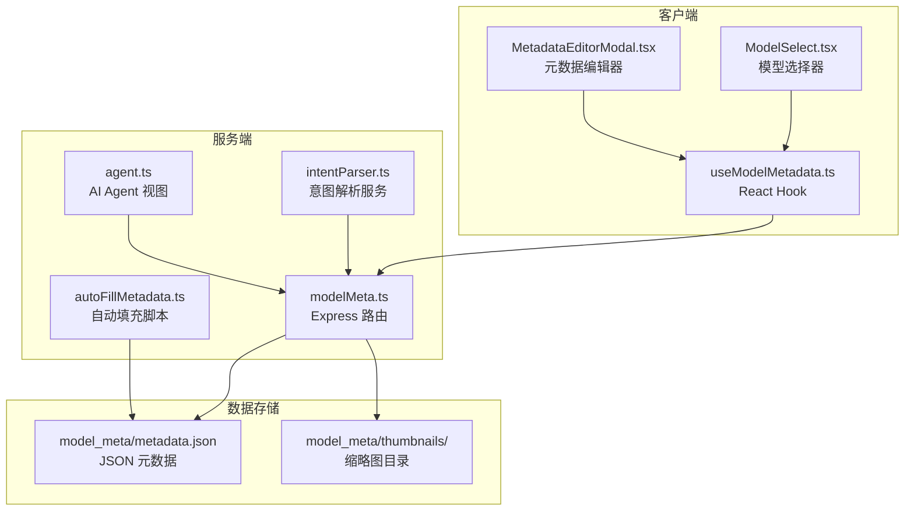
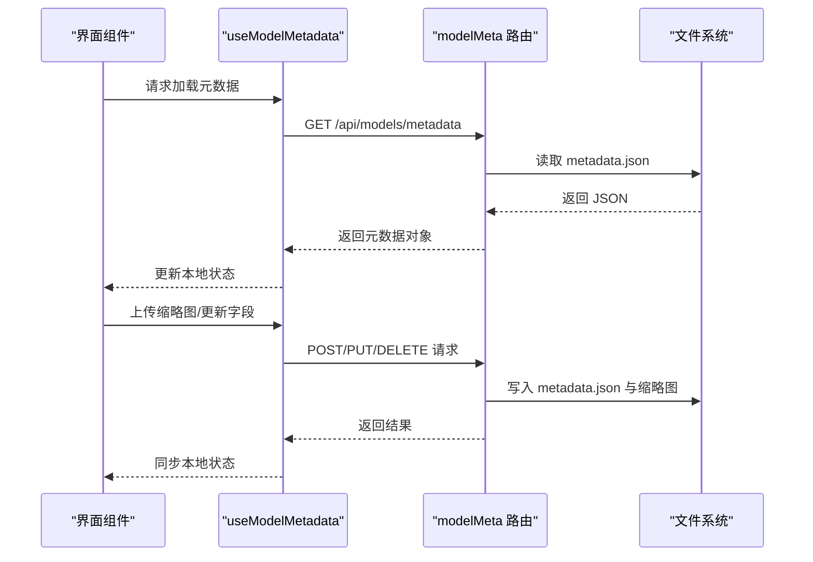
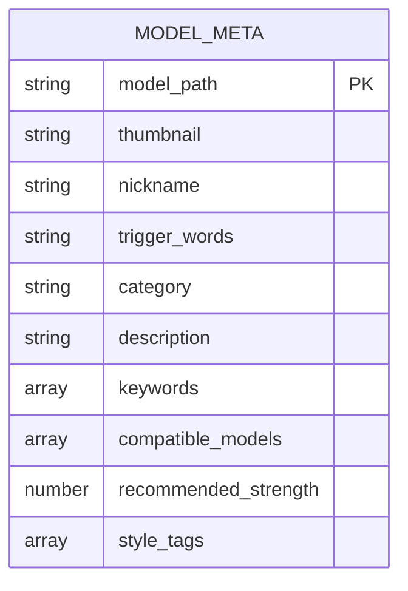
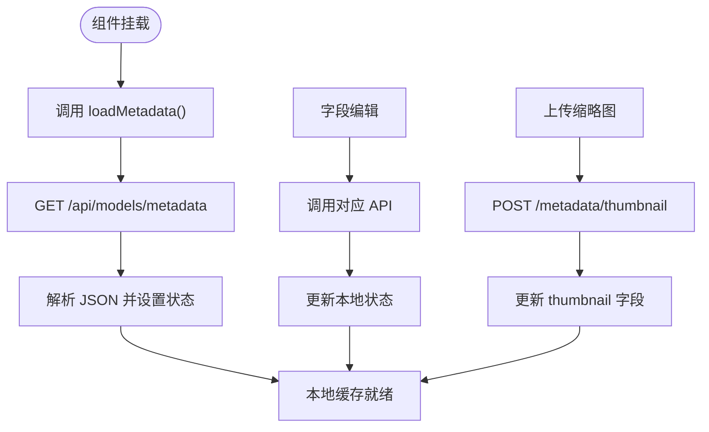
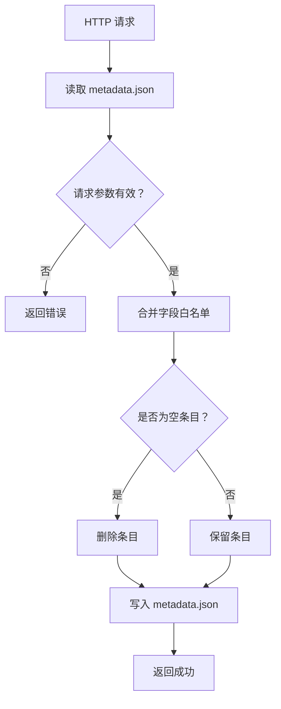
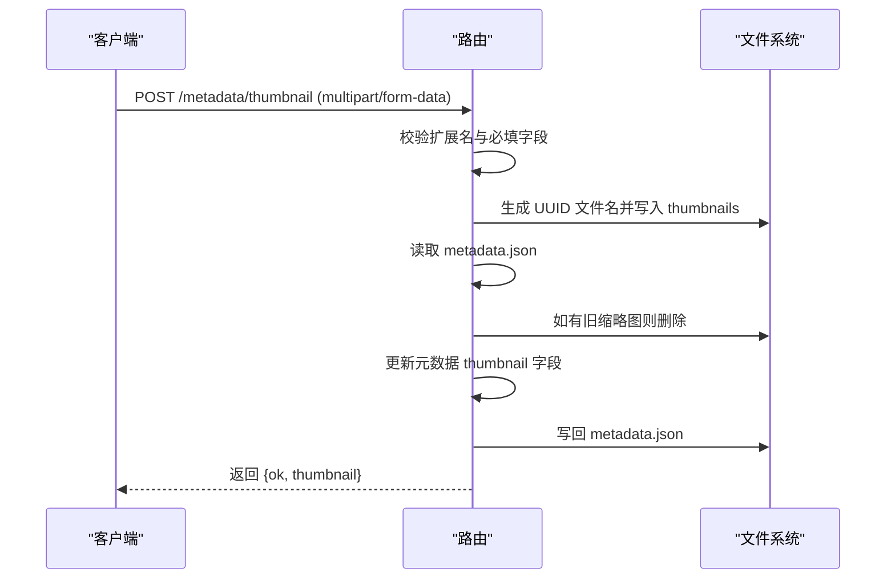
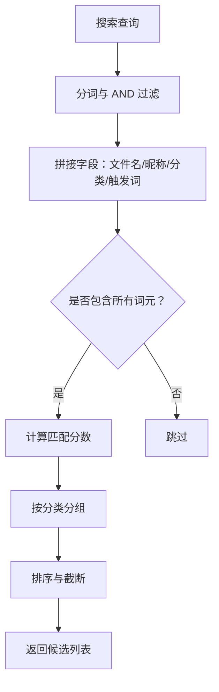
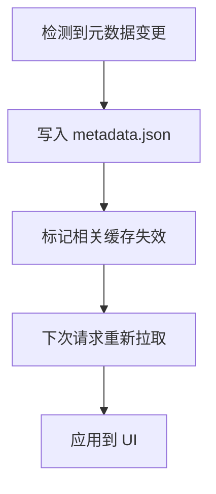
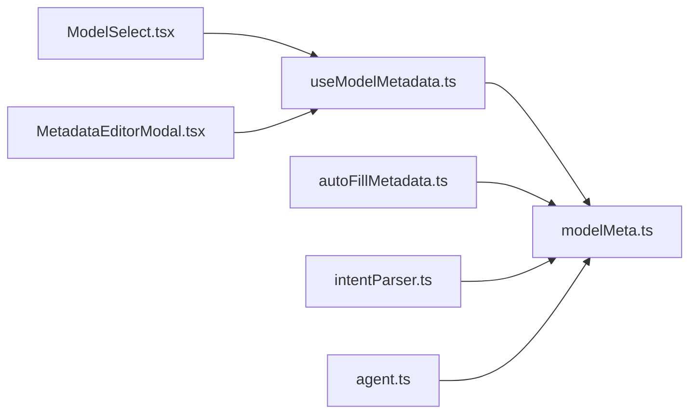

# 模型元数据缓存

<cite>
**本文档引用的文件**
- [metadata.json](file://model_meta/metadata.json)
- [useModelMetadata.ts](file://client/src/hooks/useModelMetadata.ts)
- [modelMeta.ts](file://server/src/routes/modelMeta.ts)
- [autoFillMetadata.ts](file://server/src/scripts/autoFillMetadata.ts)
- [ModelSelect.tsx](file://client/src/components/ModelSelect.tsx)
- [MetadataEditorModal.tsx](file://client/src/components/MetadataEditorModal.tsx)
- [intentParser.ts](file://server/src/services/intentParser.ts)
- [agent.ts](file://server/src/routes/agent.ts)
</cite>

## 目录
1. [简介](#简介)
2. [项目结构](#项目结构)
3. [核心组件](#核心组件)
4. [架构总览](#架构总览)
5. [详细组件分析](#详细组件分析)
6. [依赖分析](#依赖分析)
7. [性能考虑](#性能考虑)
8. [故障排除指南](#故障排除指南)
9. [结论](#结论)

## 简介
本文件为模型元数据缓存系统的详细技术文档，涵盖以下方面：
- 模型元数据的结构与组织方式，重点解析 metadata.json 的字段定义与缩略图管理机制
- 缓存策略：元数据的读取、存储与更新流程
- 索引机制：基于模型名称、版本、类型与依赖关系的索引结构
- 缓存失效与更新策略：模型变更检测与自动刷新机制
- 性能优化：懒加载、预加载与内存映射等技术建议
- 统计与监控：缓存命中率与存储使用情况的分析方法

## 项目结构
模型元数据缓存系统由前端 Hook、服务端路由与脚本三部分组成，配合 model_meta 目录中的 JSON 数据与缩略图资源实现完整的元数据管理。

**图表来源**
- [useModelMetadata.ts](file://client/src/hooks/useModelMetadata.ts)
- [ModelSelect.tsx](file://client/src/components/ModelSelect.tsx)
- [MetadataEditorModal.tsx](file://client/src/components/MetadataEditorModal.tsx)
- [modelMeta.ts](file://server/src/routes/modelMeta.ts)
- [autoFillMetadata.ts](file://server/src/scripts/autoFillMetadata.ts)
- [intentParser.ts](file://server/src/services/intentParser.ts)
- [agent.ts](file://server/src/routes/agent.ts)

**章节来源**
- [useModelMetadata.ts](file://client/src/hooks/useModelMetadata.ts)
- [modelMeta.ts](file://server/src/routes/modelMeta.ts)

## 核心组件
- 客户端 Hook：集中管理元数据的加载、更新与本地状态同步，提供缩略图 URL 生成与字段级更新能力
- 服务端路由：提供元数据的增删改查接口，负责 JSON 文件读写与缩略图文件管理
- 自动填充脚本：扫描并补全元数据字段，提升可用性与一致性
- 意图解析服务：基于关键词与权重进行模型检索与推荐
- Agent 视图：整合用户偏好与模型元数据，输出综合视图

**章节来源**
- [useModelMetadata.ts](file://client/src/hooks/useModelMetadata.ts)
- [modelMeta.ts](file://server/src/routes/modelMeta.ts)
- [autoFillMetadata.ts](file://server/src/scripts/autoFillMetadata.ts)
- [intentParser.ts](file://server/src/services/intentParser.ts)
- [agent.ts](file://server/src/routes/agent.ts)

## 架构总览
系统采用“前端 Hook + 服务端路由 + 文件存储”的轻量架构。前端通过 HTTP 接口访问服务端，服务端直接读写 model_meta 目录下的 JSON 与图片文件，确保简单可靠的数据持久化。

**图表来源**
- [useModelMetadata.ts](file://client/src/hooks/useModelMetadata.ts)
- [modelMeta.ts](file://server/src/routes/modelMeta.ts)

## 详细组件分析

### 元数据结构与组织
- 元数据以键值对形式存储，键为模型文件路径，值为包含多个字段的对象
- 关键字段包括：缩略图文件名、昵称、触发词、分类、描述、关键词、兼容模型、推荐强度、风格标签等
- 缩略图文件统一存放于 thumbnails 目录，通过相对 URL 在前端展示

**图表来源**
- [metadata.json](file://model_meta/metadata.json)

**章节来源**
- [metadata.json](file://model_meta/metadata.json)

### 客户端缓存策略
- 初始化加载：组件挂载时调用 Hook 的加载函数，一次性拉取全部元数据并缓存到本地状态
- 字段更新：支持昵称、触发词、分类、描述、关键词、风格标签、兼容模型与推荐强度等字段的增删改
- 缩略图管理：支持上传新缩略图、删除现有缩略图，并自动刷新本地缓存
- URL 生成：根据模型路径与缩略图文件名生成可访问的静态资源 URL

**图表来源**
- [useModelMetadata.ts](file://client/src/hooks/useModelMetadata.ts)

**章节来源**
- [useModelMetadata.ts](file://client/src/hooks/useModelMetadata.ts)

### 服务端缓存策略
- 读取：读取 metadata.json 并返回给客户端
- 写入：所有字段更新均通过写入 metadata.json 实现，保证持久化
- 缩略图：上传时生成唯一文件名并保存至 thumbnails 目录；删除缩略图时同步清理旧文件
- 白名单：批量更新接口仅允许指定字段写入，避免误操作

**图表来源**
- [modelMeta.ts](file://server/src/routes/modelMeta.ts)

**章节来源**
- [modelMeta.ts](file://server/src/routes/modelMeta.ts)

### 缩略图管理机制
- 上传：接收表单数据，校验扩展名，生成 UUID 文件名，写入 thumbnails 目录
- 替换：若原模型存在旧缩略图，先删除旧文件再写入新文件
- 删除：删除缩略图文件并清理元数据中的 thumbnail 字段
- 访问：前端通过 /model_meta/thumbnails/{filename} 访问

**图表来源**
- [modelMeta.ts](file://server/src/routes/modelMeta.ts)

**章节来源**
- [modelMeta.ts](file://server/src/routes/modelMeta.ts)

### 索引机制
- 名称与路径：搜索时同时覆盖模型文件名、显示名、昵称、分类与触发词
- 关键词与风格标签：用于语义检索与推荐
- 分类索引：按中文分类排序与分组，支持快速筛选
- 依赖关系：兼容模型字段用于 LoRA 与基础模型的关联

**图表来源**
- [ModelSelect.tsx](file://client/src/components/ModelSelect.tsx)
- [intentParser.ts](file://server/src/services/intentParser.ts)

**章节来源**
- [ModelSelect.tsx](file://client/src/components/ModelSelect.tsx)
- [intentParser.ts](file://server/src/services/intentParser.ts)

### 缓存失效与更新策略
- 单点更新：字段更新接口写入 metadata.json 后立即生效
- 批量更新：白名单字段合并，空值或空数组会被清理
- 缩略图替换：原子性地删除旧文件并写入新文件，避免中间态
- 自动填充：脚本扫描并补全缺失字段，减少人工维护成本

**图表来源**
- [modelMeta.ts](file://server/src/routes/modelMeta.ts)
- [autoFillMetadata.ts](file://server/src/scripts/autoFillMetadata.ts)

**章节来源**
- [modelMeta.ts](file://server/src/routes/modelMeta.ts)
- [autoFillMetadata.ts](file://server/src/scripts/autoFillMetadata.ts)

### 性能优化建议
- 懒加载：仅在打开模型选择器或编辑器时加载元数据，避免首屏阻塞
- 预加载：在应用启动阶段并发预取常用模型的元数据，结合本地缓存
- 内存映射：对于超大元数据集，可考虑将 JSON 文件映射到内存并定期刷新
- CDN 缓存：将缩略图托管至 CDN，利用缓存头与版本号控制更新
- 搜索优化：对关键词与风格标签建立倒排索引，降低查询复杂度

[本节为通用性能建议，不直接分析具体文件]

### 统计与监控
- 缓存命中率：可通过埋点统计首次加载与后续请求的比例，评估懒加载效果
- 存储使用：定期统计 thumbnails 目录大小与元数据文件体积，监控增长趋势
- 更新频率：统计每日/每周元数据更新次数，识别活跃度
- 用户行为：记录模型选择与编辑行为，辅助推荐算法优化

[本节为通用监控建议，不直接分析具体文件]

## 依赖分析
- 前端依赖服务端路由提供的 HTTP 接口
- 服务端依赖文件系统读写 model_meta 目录
- 自动填充脚本独立运行，不依赖服务端进程
- 意图解析与 Agent 视图依赖服务端路由提供的元数据

**图表来源**
- [useModelMetadata.ts](file://client/src/hooks/useModelMetadata.ts)
- [modelMeta.ts](file://server/src/routes/modelMeta.ts)
- [autoFillMetadata.ts](file://server/src/scripts/autoFillMetadata.ts)
- [intentParser.ts](file://server/src/services/intentParser.ts)
- [agent.ts](file://server/src/routes/agent.ts)

**章节来源**
- [useModelMetadata.ts](file://client/src/hooks/useModelMetadata.ts)
- [modelMeta.ts](file://server/src/routes/modelMeta.ts)
- [autoFillMetadata.ts](file://server/src/scripts/autoFillMetadata.ts)
- [intentParser.ts](file://server/src/services/intentParser.ts)
- [agent.ts](file://server/src/routes/agent.ts)

## 故障排除指南
- 元数据无法加载：检查服务端路由是否正常响应，确认 metadata.json 是否存在且可读
- 缩略图上传失败：确认文件类型在允许列表内，检查 thumbnails 目录权限
- 字段更新无效：确认请求体包含必要字段，检查批量更新接口的白名单限制
- 自动填充未生效：确认脚本执行环境与路径配置正确

**章节来源**
- [modelMeta.ts](file://server/src/routes/modelMeta.ts)
- [autoFillMetadata.ts](file://server/src/scripts/autoFillMetadata.ts)

## 结论
该模型元数据缓存系统以简洁的文件存储为核心，结合前端 Hook 与服务端路由实现了高效的元数据管理。通过自动填充脚本与完善的索引机制，系统在易用性与可维护性上表现良好。未来可在性能与监控方面进一步优化，以支撑更大规模的模型库与更复杂的检索场景。