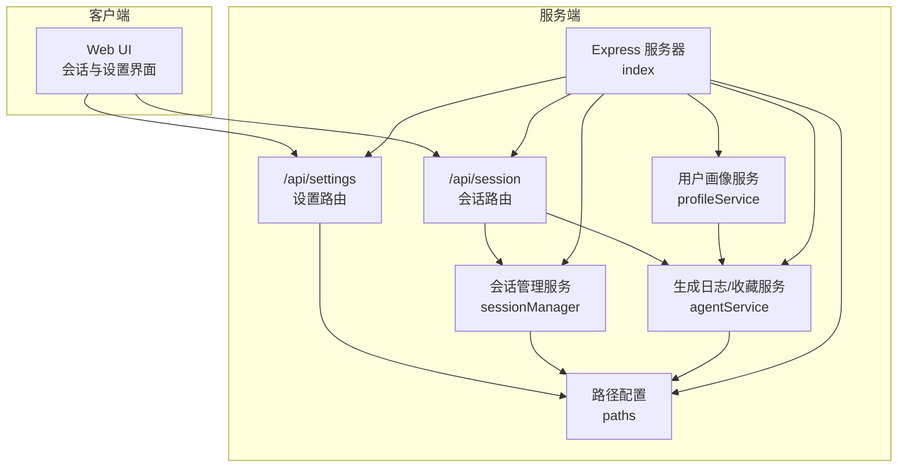
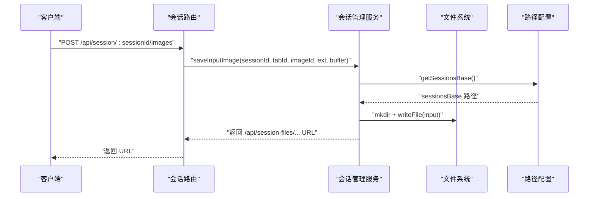
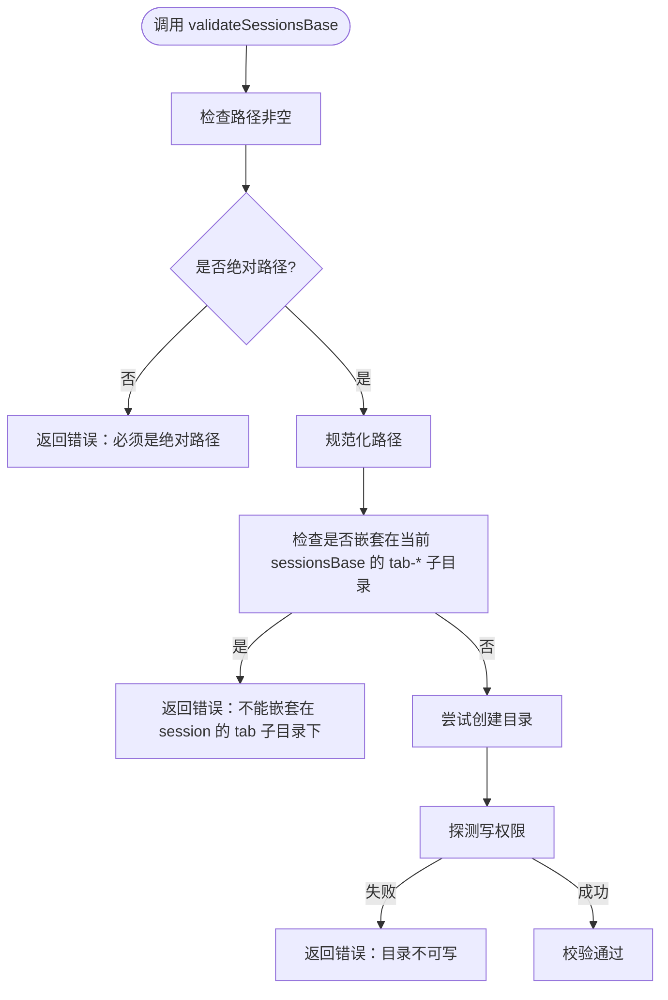
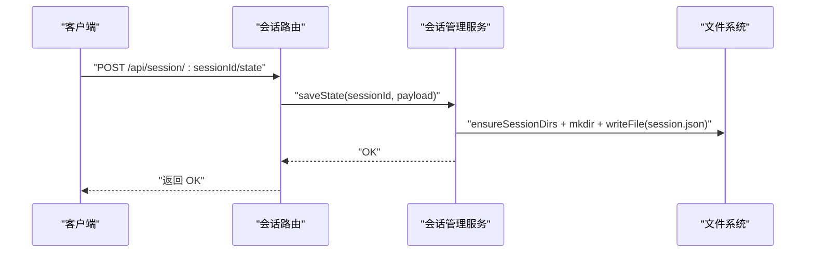
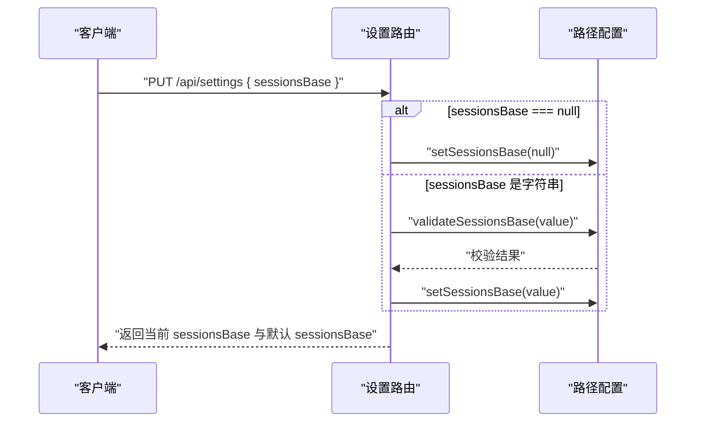
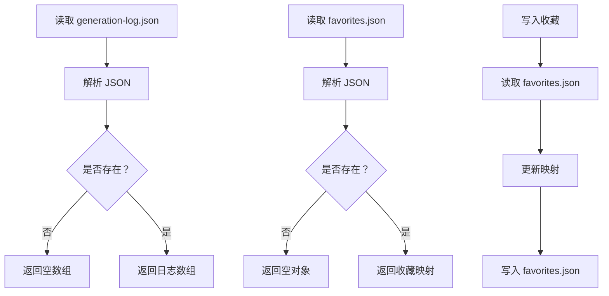
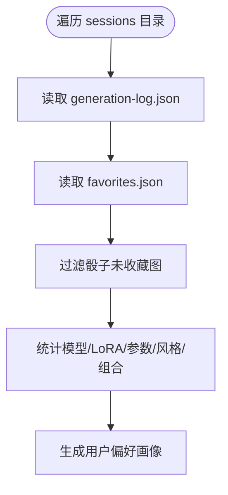
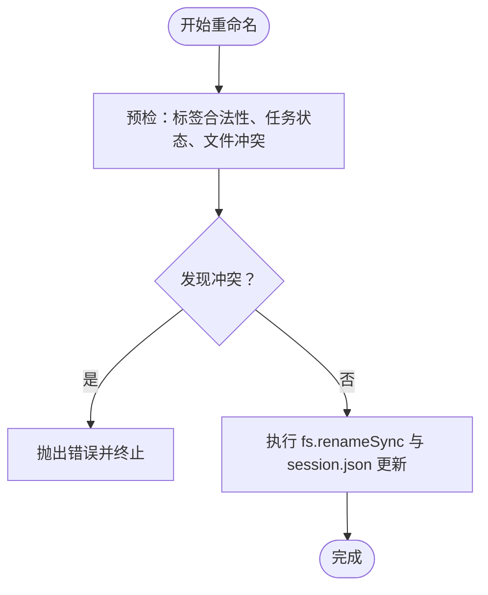
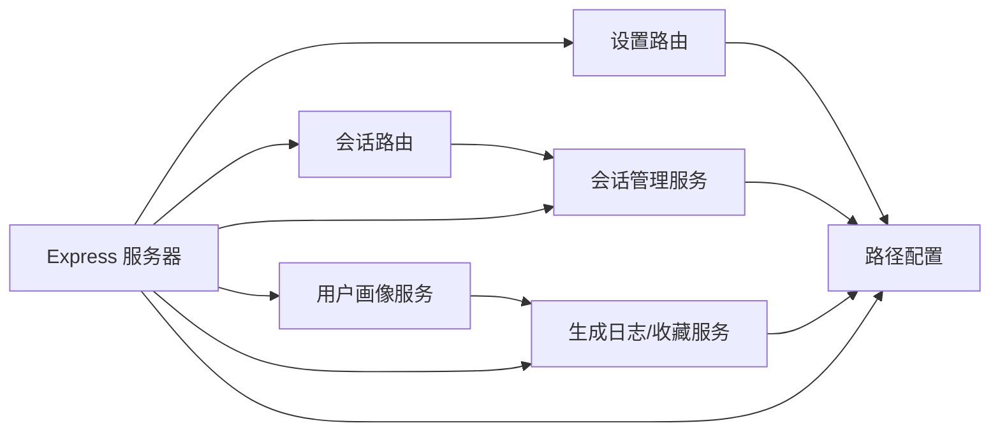

# 磁盘空间控制

<cite>
**本文引用的文件**
- [server/src/config/paths.ts](file://server/src/config/paths.ts)
- [server/src/services/sessionManager.ts](file://server/src/services/sessionManager.ts)
- [server/src/routes/session.ts](file://server/src/routes/session.ts)
- [server/src/routes/settings.ts](file://server/src/routes/settings.ts)
- [server/src/services/agentService.ts](file://server/src/services/agentService.ts)
- [server/src/services/profileService.ts](file://server/src/services/profileService.ts)
- [server/src/index.ts](file://server/src/index.ts)
- [server/src/types/index.ts](file://server/src/types/index.ts)
</cite>

## 目录
1. [简介](#简介)
2. [项目结构](#项目结构)
3. [核心组件](#核心组件)
4. [架构总览](#架构总览)
5. [详细组件分析](#详细组件分析)
6. [依赖关系分析](#依赖关系分析)
7. [性能考量](#性能考量)
8. [故障排查指南](#故障排查指南)
9. [结论](#结论)
10. [附录](#附录)

## 简介
本技术文档聚焦于本项目的磁盘空间控制系统，围绕以下目标展开：
- 磁盘空间监控机制：可用空间检测、使用率统计与告警阈值设置
- 缓存大小限制策略：最大缓存容量设置、自动清理触发条件与清理优先级排序
- 手动清理功能：用户触发的清理操作、批量清理与选择性清理选项
- 会话文件存储优化：文件压缩、重复文件检测与存储空间回收
- 存储策略配置：缓存目录管理、临时文件清理与历史数据归档
- 磁盘空间使用报告与分析：帮助用户了解存储使用情况

当前仓库中与磁盘空间控制直接相关的核心能力集中在会话存储、设置接口与静态资源服务上；关于“可用空间检测”“使用率统计”“告警阈值”“自动清理策略”等尚未在代码中实现，本文将基于现有实现进行架构解读，并提出可落地的扩展建议。

## 项目结构
本项目的服务端采用 Express + WebSocket 架构，磁盘空间控制主要涉及：
- 路由层：会话路由与设置路由
- 服务层：会话管理、生成日志与收藏、用户画像构建
- 配置层：集中化路径管理（sessionsBase 可动态切换）

**图表来源**
- [server/src/index.ts:118-146](file://server/src/index.ts#L118-L146)
- [server/src/routes/session.ts:1-163](file://server/src/routes/session.ts#L1-L163)
- [server/src/routes/settings.ts:1-106](file://server/src/routes/settings.ts#L1-L106)
- [server/src/services/sessionManager.ts:1-539](file://server/src/services/sessionManager.ts#L1-L539)
- [server/src/services/agentService.ts:1-126](file://server/src/services/agentService.ts#L1-L126)
- [server/src/services/profileService.ts:1-251](file://server/src/services/profileService.ts#L1-L251)
- [server/src/config/paths.ts:1-156](file://server/src/config/paths.ts#L1-L156)

**章节来源**
- [server/src/index.ts:118-146](file://server/src/index.ts#L118-L146)
- [server/src/config/paths.ts:1-156](file://server/src/config/paths.ts#L1-L156)

## 核心组件
- 路径配置与会话根目录管理
  - sessionsBase 可通过设置接口动态切换，支持绝对路径校验与写权限探测
  - 默认 sessionsBase 位于项目根下的 sessions 目录
- 会话存储与文件 I/O
  - 输入图、输出图、蒙版、会话状态 JSON 的读写
  - 会话封面生成与重命名（含标签安全化与批量事务性重命名）
- 设置接口
  - 读取/更新 sessionsBase，以及弹出 Windows 文件夹选择对话框
- 生成日志与收藏
  - 记录生成记录与收藏映射，用于画像构建与偏好分析
- 用户画像服务
  - 基于会话数据聚合统计，辅助理解使用模式与偏好

**章节来源**
- [server/src/config/paths.ts:24-137](file://server/src/config/paths.ts#L24-L137)
- [server/src/services/sessionManager.ts:11-539](file://server/src/services/sessionManager.ts#L11-L539)
- [server/src/routes/settings.ts:21-103](file://server/src/routes/settings.ts#L21-L103)
- [server/src/services/agentService.ts:48-125](file://server/src/services/agentService.ts#L48-L125)
- [server/src/services/profileService.ts:77-250](file://server/src/services/profileService.ts#L77-L250)

## 架构总览
服务端通过中间件与静态资源服务将 sessionsBase 动态暴露为 /api/session-files，同时提供设置接口以切换存储根目录。会话路由负责输入图上传、输出图保存、会话状态持久化与封面生成等。

**图表来源**
- [server/src/routes/session.ts:21-36](file://server/src/routes/session.ts#L21-L36)
- [server/src/services/sessionManager.ts:22-35](file://server/src/services/sessionManager.ts#L22-L35)
- [server/src/config/paths.ts:70-76](file://server/src/config/paths.ts#L70-L76)

**章节来源**
- [server/src/index.ts:135-139](file://server/src/index.ts#L135-L139)
- [server/src/routes/session.ts:1-163](file://server/src/routes/session.ts#L1-L163)
- [server/src/services/sessionManager.ts:1-539](file://server/src/services/sessionManager.ts#L1-L539)

## 详细组件分析

### 路径配置与会话根目录管理
- 配置文件 config.json 用于持久化 sessionsBase 覆盖值
- 提供 validateSessionsBase 校验候选路径：非空、绝对路径、不可写、禁止嵌套在当前 sessionsBase 的 tab-* 子目录下
- setSessionsBase 写入配置并确保目录存在
- getSessionsBase 每次请求动态读取，支持运行时切换

**图表来源**
- [server/src/config/paths.ts:106-137](file://server/src/config/paths.ts#L106-L137)

**章节来源**
- [server/src/config/paths.ts:24-137](file://server/src/config/paths.ts#L24-L137)

### 会话存储与文件 I/O
- 输入图保存：确保目录存在，写入 input 目录，返回可访问 URL
- 输出图保存：写入 output 目录，返回可访问 URL
- 蒙版保存：将 maskKey 中的非法字符替换为安全字符，写入 masks 目录
- 会话状态 JSON：首次保存时保留 createdAt，更新时更新 updatedAt
- 会话封面：从 input/output 中复制到 sessions 根目录，覆盖同名扩展
- 会话列表与删除：列出带 session.json 的目录，按 updatedAt 排序，支持删除
- 卡片资产重命名：标签安全化、输入/输出文件重命名、事务性批量重命名
- 会话修剪：保留最近 N 个会话，其余删除

**图表来源**
- [server/src/routes/session.ts:54-71](file://server/src/routes/session.ts#L54-L71)
- [server/src/services/sessionManager.ts:102-122](file://server/src/services/sessionManager.ts#L102-L122)

**章节来源**
- [server/src/services/sessionManager.ts:11-539](file://server/src/services/sessionManager.ts#L11-L539)

### 设置接口与动态路径切换
- 读取当前 sessionsBase 与默认 sessionsBase
- 更新 sessionsBase：null 恢复默认；字符串进行 validateSessionsBase 校验后 setSessionsBase
- Windows 平台提供原生文件夹选择对话框，返回选中路径

**图表来源**
- [server/src/routes/settings.ts:29-67](file://server/src/routes/settings.ts#L29-L67)
- [server/src/config/paths.ts:84-100](file://server/src/config/paths.ts#L84-L100)

**章节来源**
- [server/src/routes/settings.ts:21-103](file://server/src/routes/settings.ts#L21-L103)
- [server/src/config/paths.ts:70-100](file://server/src/config/paths.ts#L70-L100)

### 生成日志与收藏
- generation-log.json：记录每次生成的配置、结果与元数据
- favorites.json：记录收藏映射（imageId -> tabId, favoritedAt）
- 读取/追加日志、写入收藏、更新日志中的收藏标记

**图表来源**
- [server/src/services/agentService.ts:52-104](file://server/src/services/agentService.ts#L52-L104)

**章节来源**
- [server/src/services/agentService.ts:1-126](file://server/src/services/agentService.ts#L1-L126)

### 用户画像与使用统计
- 遍历所有 sessions 目录，聚合 generation-log.json 与 favorites.json
- 过滤骰子批量生成的未收藏图，避免污染偏好画像
- 统计模型偏好、LoRA 偏好、参数偏好、风格特征、使用模式与常用组合

**图表来源**
- [server/src/services/profileService.ts:77-250](file://server/src/services/profileService.ts#L77-L250)

**章节来源**
- [server/src/services/profileService.ts:77-250](file://server/src/services/profileService.ts#L77-L250)

### 会话文件存储优化
- 文件命名安全化：标签替换非法字符，输入图以 {label}_raw{ext} 命名，输出图以 {label}_1{ext} 序列命名
- 批量事务性重命名：预检所有冲突与任务状态，全部通过后一次性提交，失败则回滚
- 封面生成：从 input/output 复制到 sessions 根目录，覆盖同名扩展并标记 manualCover

**图表来源**
- [server/src/services/sessionManager.ts:256-360](file://server/src/services/sessionManager.ts#L256-L360)
- [server/src/services/sessionManager.ts:381-538](file://server/src/services/sessionManager.ts#L381-L538)

**章节来源**
- [server/src/services/sessionManager.ts:220-360](file://server/src/services/sessionManager.ts#L220-L360)

## 依赖关系分析
- 会话路由依赖会话管理服务与设置接口
- 会话管理服务依赖路径配置与文件系统
- 设置路由依赖路径配置
- 用户画像服务依赖生成日志与收藏服务
- 服务器在启动时加载路径配置并确保 sessionsBase 存在

**图表来源**
- [server/src/index.ts:102-109](file://server/src/index.ts#L102-L109)
- [server/src/routes/session.ts:1-16](file://server/src/routes/session.ts#L1-L16)
- [server/src/routes/settings.ts:8-13](file://server/src/routes/settings.ts#L8-L13)
- [server/src/services/sessionManager.ts:1-7](file://server/src/services/sessionManager.ts#L1-L7)
- [server/src/services/agentService.ts:1-3](file://server/src/services/agentService.ts#L1-L3)
- [server/src/services/profileService.ts:1-4](file://server/src/services/profileService.ts#L1-L4)

**章节来源**
- [server/src/index.ts:102-109](file://server/src/index.ts#L102-L109)
- [server/src/routes/session.ts:1-16](file://server/src/routes/session.ts#L1-L16)
- [server/src/routes/settings.ts:8-13](file://server/src/routes/settings.ts#L8-L13)
- [server/src/services/sessionManager.ts:1-7](file://server/src/services/sessionManager.ts#L1-L7)
- [server/src/services/agentService.ts:1-3](file://server/src/services/agentService.ts#L1-L3)
- [server/src/services/profileService.ts:1-4](file://server/src/services/profileService.ts#L1-L4)

## 性能考量
- 会话状态 JSON 读写：频繁更新 updatedAt，建议在高并发场景下考虑写入合并与去抖
- 批量重命名：预检所有冲突与任务状态，避免部分失败导致的不一致
- 静态资源服务：/api/session-files 动态指向 sessionsBase，需确保路径正确与权限充足
- 生成日志与收藏：大规模会话时聚合成本较高，建议在后台任务中异步统计

[本节为通用指导，不直接分析具体文件]

## 故障排查指南
- sessionsBase 切换失败
  - 检查 validateSessionsBase 返回的错误信息（路径非空、绝对路径、不可写、嵌套限制）
  - 确认目录存在且具备写权限
- 会话文件无法访问
  - 确认 /api/session-files 静态服务已正确挂载到 getSessionsBase()
  - 检查文件名是否包含非法字符（maskKey 曾被替换为安全字符）
- 重命名失败
  - 检查任务状态是否处于执行中
  - 检查目标文件名是否与现有文件冲突
- 生成日志为空
  - 确认 generation-log.json 是否存在且可读
  - 检查收藏映射是否正确写入 favorites.json

**章节来源**
- [server/src/config/paths.ts:106-137](file://server/src/config/paths.ts#L106-L137)
- [server/src/services/sessionManager.ts:276-281](file://server/src/services/sessionManager.ts#L276-L281)
- [server/src/services/agentService.ts:52-104](file://server/src/services/agentService.ts#L52-L104)

## 结论
本项目已实现会话存储的集中化路径管理、文件 I/O 与命名规范、封面生成与重命名等基础能力。对于磁盘空间监控与自动清理策略，当前代码未提供“可用空间检测、使用率统计、告警阈值、自动清理触发与优先级排序”的实现。建议在现有路径配置与会话管理基础上，扩展以下能力：
- 磁盘空间监控：定期扫描 sessionsBase 与各子目录，统计总占用与剩余空间
- 使用率统计：结合会话数量、文件数量与体积，计算使用率
- 告警阈值：当使用率超过阈值（如 80%）时触发告警
- 自动清理策略：按会话更新时间排序，优先清理最旧的会话；或按体积排序，优先清理体积最大的会话
- 手动清理功能：提供删除单个会话、批量删除、选择性删除（仅删除输出或仅删除输入）等选项
- 存储优化：引入压缩与去重（如基于内容哈希的重复检测），回收冗余文件
- 报告与分析：生成磁盘使用报告，展示会话分布、增长趋势与清理建议

[本节为总结性内容，不直接分析具体文件]

## 附录
- 类型定义参考：ComfyUI 历史与输出结构、进度事件与队列项等

**章节来源**
- [server/src/types/index.ts:10-52](file://server/src/types/index.ts#L10-L52)