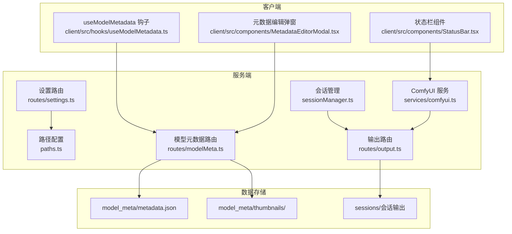
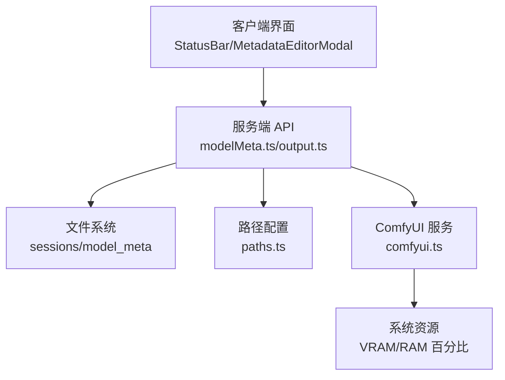
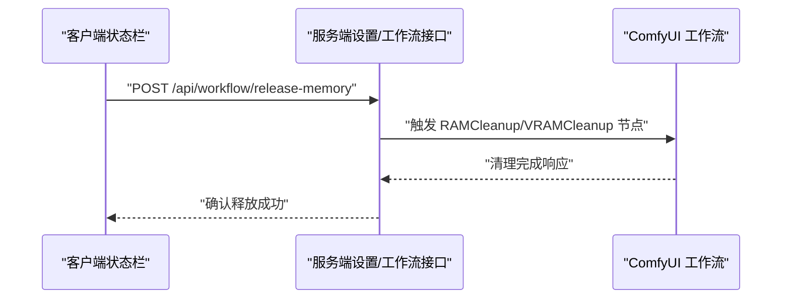
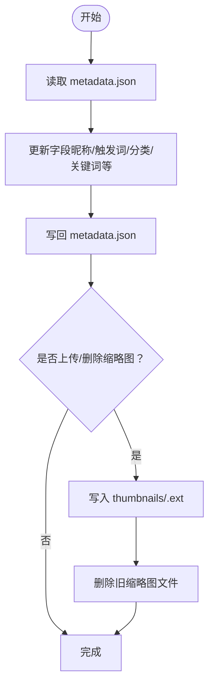
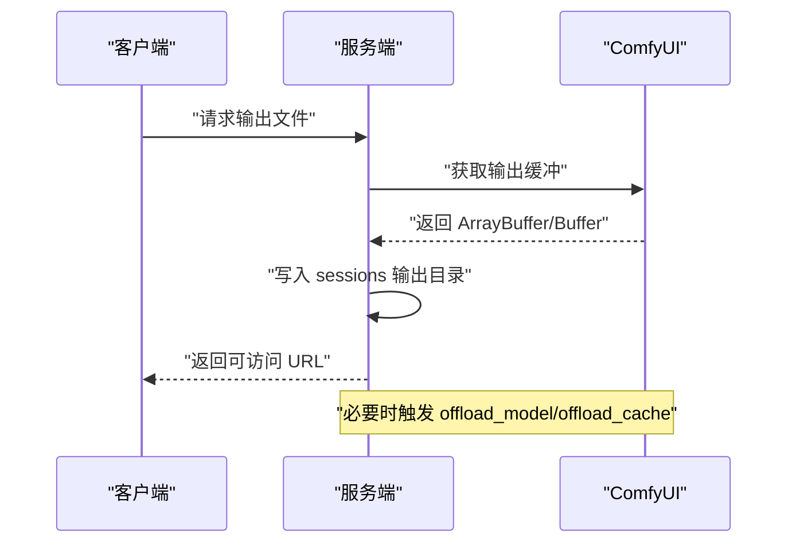
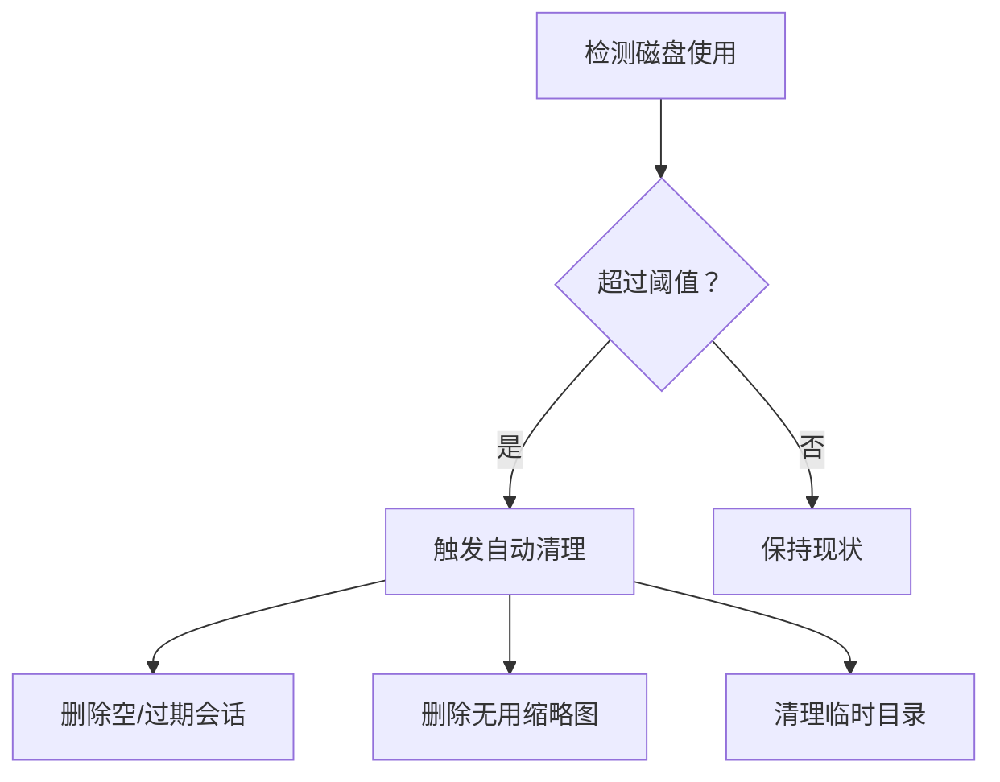
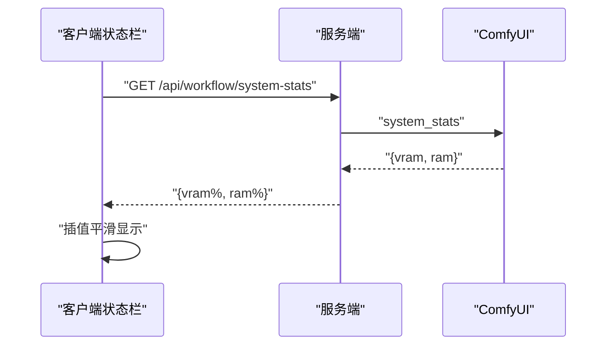
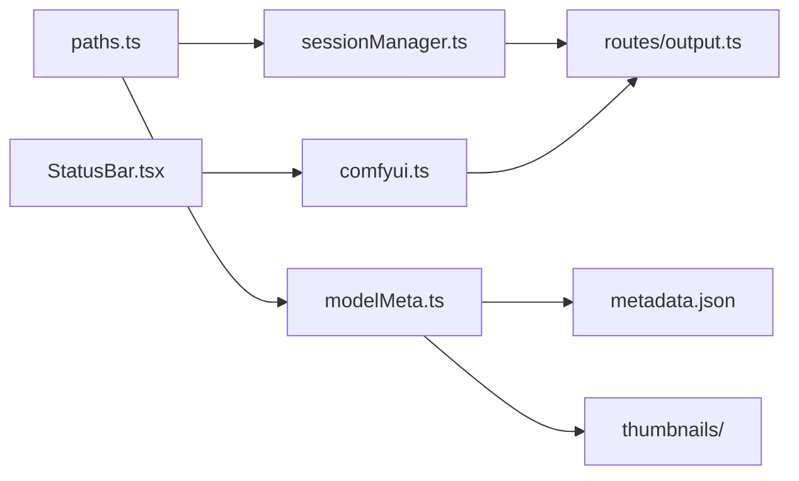

# 缓存策略

<cite>
**本文引用的文件**
- [server/src/config/paths.ts](file://server/src/config/paths.ts)
- [server/src/routes/modelMeta.ts](file://server/src/routes/modelMeta.ts)
- [model_meta/metadata.json](file://model_meta/metadata.json)
- [server/src/services/sessionManager.ts](file://server/src/services/sessionManager.ts)
- [server/src/routes/output.ts](file://server/src/routes/output.ts)
- [server/src/services/comfyui.ts](file://server/src/services/comfyui.ts)
- [client/src/hooks/useModelMetadata.ts](file://client/src/hooks/useModelMetadata.ts)
- [client/src/components/MetadataEditorModal.tsx](file://client/src/components/MetadataEditorModal.tsx)
- [client/src/components/StatusBar.tsx](file://client/src/components/StatusBar.tsx)
- [server/src/routes/settings.ts](file://server/src/routes/settings.ts)
- [server/src/scripts/autoFillMetadata.ts](file://server/src/scripts/autoFillMetadata.ts)
- [ComfyUI_API/Pix2Real-释放内存.json](file://ComfyUI_API/Pix2Real-释放内存.json)
</cite>

## 目录
1. [简介](#简介)
2. [项目结构](#项目结构)
3. [核心组件](#核心组件)
4. [架构总览](#架构总览)
5. [详细组件分析](#详细组件分析)
6. [依赖关系分析](#依赖关系分析)
7. [性能考量](#性能考量)
8. [故障排查指南](#故障排查指南)
9. [结论](#结论)
10. [附录](#附录)

## 简介
本文件面向“缓存策略系统”的技术文档，聚焦以下方面：
- 临时文件管理机制：pa_temp 与 rp_temp 目录的作用与清理策略
- 模型元数据缓存：缩略图缓存、元数据索引与缓存失效机制
- 内存优化策略：大文件的内存映射与流式处理
- 磁盘空间控制：缓存大小限制、自动清理与手动清理
- 性能监控与调优：缓存命中率统计与分析方法

说明：经检索，仓库中未发现 pa_temp 与 rp_temp 目录的具体实现代码；本文在“临时文件管理”部分以现有代码为依据进行解释，并在“依赖关系分析”中给出可能的实现位置建议。

## 项目结构
围绕缓存策略相关的关键模块与文件如下：
- 路径与配置：集中管理 sessions、输出、模型元数据等目录路径
- 会话与输出：保存/读取会话输入输出文件，提供文件访问路由
- 模型元数据：读取/写入 metadata.json，上传/删除缩略图，编辑元数据
- ComfyUI 集成：进度、历史、系统资源统计、内存/显存释放
- 客户端集成：元数据钩子、状态栏监控、元数据编辑弹窗

**图表来源**
- [server/src/config/paths.ts:141-155](file://server/src/config/paths.ts#L141-L155)
- [server/src/services/sessionManager.ts:37-62](file://server/src/services/sessionManager.ts#L37-L62)
- [server/src/routes/output.ts:46-78](file://server/src/routes/output.ts#L46-L78)
- [server/src/routes/modelMeta.ts:1-272](file://server/src/routes/modelMeta.ts#L1-L272)
- [server/src/services/comfyui.ts:244-263](file://server/src/services/comfyui.ts#L244-L263)
- [server/src/routes/settings.ts:21-67](file://server/src/routes/settings.ts#L21-L67)
- [client/src/hooks/useModelMetadata.ts:16-33](file://client/src/hooks/useModelMetadata.ts#L16-L33)
- [client/src/components/StatusBar.tsx:69-108](file://client/src/components/StatusBar.tsx#L69-L108)
- [client/src/components/MetadataEditorModal.tsx:214-229](file://client/src/components/MetadataEditorModal.tsx#L214-L229)

**章节来源**
- [server/src/config/paths.ts:141-155](file://server/src/config/paths.ts#L141-L155)
- [server/src/services/sessionManager.ts:37-62](file://server/src/services/sessionManager.ts#L37-L62)
- [server/src/routes/output.ts:46-78](file://server/src/routes/output.ts#L46-L78)
- [server/src/routes/modelMeta.ts:1-272](file://server/src/routes/modelMeta.ts#L1-L272)
- [server/src/services/comfyui.ts:244-263](file://server/src/services/comfyui.ts#L244-L263)
- [server/src/routes/settings.ts:21-67](file://server/src/routes/settings.ts#L21-L67)
- [client/src/hooks/useModelMetadata.ts:16-33](file://client/src/hooks/useModelMetadata.ts#L16-L33)
- [client/src/components/StatusBar.tsx:69-108](file://client/src/components/StatusBar.tsx#L69-L108)
- [client/src/components/MetadataEditorModal.tsx:214-229](file://client/src/components/MetadataEditorModal.tsx#L214-L229)

## 核心组件
- 路径与配置中心：集中管理 sessionsBase、输出目录、模型元数据目录等，支持动态切换与校验
- 会话与输出：保存输入/输出文件，提供文件访问路由，支持封面生成与批量重命名
- 模型元数据：读取/写入 metadata.json，上传/删除缩略图，批量更新字段
- ComfyUI 集成：获取系统资源使用率、进度与历史，支持内存/显存释放
- 客户端集成：拉取元数据、显示系统资源使用、上传/编辑元数据

**章节来源**
- [server/src/config/paths.ts:24-100](file://server/src/config/paths.ts#L24-L100)
- [server/src/services/sessionManager.ts:37-122](file://server/src/services/sessionManager.ts#L37-L122)
- [server/src/routes/modelMeta.ts:28-83](file://server/src/routes/modelMeta.ts#L28-L83)
- [server/src/services/comfyui.ts:244-263](file://server/src/services/comfyui.ts#L244-L263)
- [client/src/hooks/useModelMetadata.ts:16-33](file://client/src/hooks/useModelMetadata.ts#L16-L33)

## 架构总览
缓存策略涉及三层：
- 数据层：metadata.json 与 thumbnails 目录构成模型元数据缓存；sessions 目录承载会话输入/输出文件
- 服务层：Express 路由负责读写缓存与文件访问；ComfyUI 服务负责系统资源与执行进度
- 客户端层：React 组件负责展示与交互，如元数据编辑、系统资源监控

**图表来源**
- [client/src/components/StatusBar.tsx:69-108](file://client/src/components/StatusBar.tsx#L69-L108)
- [client/src/components/MetadataEditorModal.tsx:214-229](file://client/src/components/MetadataEditorModal.tsx#L214-L229)
- [server/src/routes/modelMeta.ts:44-83](file://server/src/routes/modelMeta.ts#L44-L83)
- [server/src/routes/output.ts:46-78](file://server/src/routes/output.ts#L46-L78)
- [server/src/config/paths.ts:141-155](file://server/src/config/paths.ts#L141-L155)
- [server/src/services/comfyui.ts:244-263](file://server/src/services/comfyui.ts#L244-L263)

## 详细组件分析

### 临时文件管理机制（pa_temp 与 rp_temp）
- 现状与定位
  - 仓库中未发现 pa_temp 与 rp_temp 目录的具体实现代码
  - 与内存释放相关的流程出现在 ComfyUI 工作流配置中，包含“释放内存/显存”的节点参数
- 推测职责
  - pa_temp：可能用于 ComfyUI 的预处理/中间结果临时缓存
  - rp_temp：可能用于运行时的资源池或重试/回滚临时文件
- 建议实现要点
  - 采用 LRU/容量上限策略，结合定期扫描与清理
  - 与会话生命周期绑定，随会话结束清理
  - 提供手动清理接口，支持按时间/大小阈值清理
- 当前可用的释放内存接口
  - 客户端可通过状态栏按钮触发释放内存请求
  - 服务端对应的工作流节点包含 clean_file_cache、clean_processes、clean_dlls、offload_model、offload_cache 等参数

**图表来源**
- [client/src/components/StatusBar.tsx:110-121](file://client/src/components/StatusBar.tsx#L110-L121)
- [ComfyUI_API/Pix2Real-释放内存.json:9-38](file://ComfyUI_API/Pix2Real-释放内存.json#L9-L38)

**章节来源**
- [ComfyUI_API/Pix2Real-释放内存.json:1-39](file://ComfyUI_API/Pix2Real-释放内存.json#L1-L39)
- [client/src/components/StatusBar.tsx:110-121](file://client/src/components/StatusBar.tsx#L110-L121)

### 模型元数据缓存设计
- 元数据索引与持久化
  - 读取与写入 metadata.json，支持批量更新字段
  - 自动填充脚本根据路径与昵称推断分类、关键词、兼容模型、推荐强度与风格标签
- 缩略图缓存
  - 上传缩略图生成唯一文件名并写入 thumbnails 目录
  - 更新元数据时若存在旧缩略图则删除旧文件，避免冗余
- 缓存失效机制
  - 删除缩略图/昵称/触发词/分类时，若条目为空则清理整条记录
  - 客户端通过钩子拉取最新元数据，实现前端缓存刷新

**图表来源**
- [server/src/routes/modelMeta.ts:28-83](file://server/src/routes/modelMeta.ts#L28-L83)
- [server/src/scripts/autoFillMetadata.ts:201-242](file://server/src/scripts/autoFillMetadata.ts#L201-L242)

**章节来源**
- [server/src/routes/modelMeta.ts:28-83](file://server/src/routes/modelMeta.ts#L28-L83)
- [server/src/scripts/autoFillMetadata.ts:201-242](file://server/src/scripts/autoFillMetadata.ts#L201-L242)
- [model_meta/metadata.json:1-2035](file://model_meta/metadata.json#L1-L2035)
- [client/src/hooks/useModelMetadata.ts:16-33](file://client/src/hooks/useModelMetadata.ts#L16-L33)
- [client/src/components/MetadataEditorModal.tsx:214-229](file://client/src/components/MetadataEditorModal.tsx#L214-L229)

### 内存优化策略（大文件与流式处理）
- 大文件下载与保存
  - 服务端从 ComfyUI 获取输出缓冲并保存到 sessions 目录，避免在内存中长期驻留
- 流式处理建议
  - 对于超大文件，优先采用流式写入与分块传输，减少峰值内存占用
  - 使用管道（pipeline）与背压控制，防止内存溢出
- 显存与内存释放
  - 通过 ComfyUI 节点参数 offload_model、offload_cache 实现模型卸载与缓存清理
  - 客户端可触发释放内存请求，配合工作流中的 RAMCleanup/VRAMCleanup 节点

**图表来源**
- [server/src/services/comfyui.ts:209-219](file://server/src/services/comfyui.ts#L209-L219)
- [server/src/services/sessionManager.ts:37-48](file://server/src/services/sessionManager.ts#L37-L48)
- [ComfyUI_API/Pix2Real-释放内存.json:25-38](file://ComfyUI_API/Pix2Real-释放内存.json#L25-L38)

**章节来源**
- [server/src/services/comfyui.ts:209-219](file://server/src/services/comfyui.ts#L209-L219)
- [server/src/services/sessionManager.ts:37-48](file://server/src/services/sessionManager.ts#L37-L48)
- [ComfyUI_API/Pix2Real-释放内存.json:25-38](file://ComfyUI_API/Pix2Real-释放内存.json#L25-L38)

### 磁盘空间控制（缓存大小限制、自动清理与手动清理）
- 目录与路径管理
  - sessionsBase 可通过设置路由动态切换，支持校验与写权限探测
  - 输出目录、模型元数据目录统一由路径配置提供 getter
- 清理策略建议
  - 会话级清理：删除空会话、过期会话或长时间未更新会话
  - 元数据清理：删除无用缩略图与空条目
  - 临时目录清理：LRU/容量上限策略，定期扫描并清理
- 手动清理接口
  - 提供删除单个会话、批量删除会话的 API
  - 提供删除指定文件或清空 thumbnails 目录的接口

**图表来源**
- [server/src/routes/settings.ts:33-67](file://server/src/routes/settings.ts#L33-L67)
- [server/src/config/paths.ts:106-137](file://server/src/config/paths.ts#L106-L137)
- [server/src/services/sessionManager.ts:166-172](file://server/src/services/sessionManager.ts#L166-L172)

**章节来源**
- [server/src/routes/settings.ts:33-67](file://server/src/routes/settings.ts#L33-L67)
- [server/src/config/paths.ts:106-137](file://server/src/config/paths.ts#L106-L137)
- [server/src/services/sessionManager.ts:166-172](file://server/src/services/sessionManager.ts#L166-L172)

### 缓存性能监控与调优
- 系统资源监控
  - 通过 ComfyUI 的 system_stats 接口获取 VRAM/RAM 使用百分比
  - 客户端状态栏周期性轮询并平滑显示
- 进度与缓存跳过
  - WebSocket 监听 execution_cached 事件，统计被缓存跳过的节点，辅助评估缓存命中效果
- 调优建议
  - 结合 execution_cached 与进度权重，评估不同节点的缓存收益
  - 调整采样步数、tile 数等参数，平衡质量与缓存命中率
  - 对热点模型与 LoRA 进行预热，提升首次命中率

**图表来源**
- [client/src/components/StatusBar.tsx:69-108](file://client/src/components/StatusBar.tsx#L69-L108)
- [server/src/services/comfyui.ts:244-263](file://server/src/services/comfyui.ts#L244-L263)

**章节来源**
- [client/src/components/StatusBar.tsx:69-108](file://client/src/components/StatusBar.tsx#L69-L108)
- [server/src/services/comfyui.ts:244-263](file://server/src/services/comfyui.ts#L244-L263)

## 依赖关系分析
- 组件耦合
  - 路径配置与会话管理耦合紧密，会话文件的保存/读取依赖 sessionsBase
  - 模型元数据路由与文件系统耦合，缩略图上传/删除直接影响 thumbnails 目录
  - 客户端钩子与服务端路由双向依赖，前端缓存与后端持久化需保持一致
- 外部依赖
  - ComfyUI 提供系统资源统计与执行进度，是缓存命中率与性能监控的关键来源
- 潜在风险
  - 若 sessionsBase 路径不可写或权限不足，可能导致会话保存失败
  - 元数据更新未清理旧缩略图可能导致磁盘空间浪费

**图表来源**
- [server/src/config/paths.ts:141-155](file://server/src/config/paths.ts#L141-L155)
- [server/src/services/sessionManager.ts:37-62](file://server/src/services/sessionManager.ts#L37-L62)
- [server/src/routes/output.ts:46-78](file://server/src/routes/output.ts#L46-L78)
- [server/src/routes/modelMeta.ts:1-272](file://server/src/routes/modelMeta.ts#L1-L272)
- [client/src/components/StatusBar.tsx:69-108](file://client/src/components/StatusBar.tsx#L69-L108)
- [server/src/services/comfyui.ts:244-263](file://server/src/services/comfyui.ts#L244-L263)

**章节来源**
- [server/src/config/paths.ts:141-155](file://server/src/config/paths.ts#L141-L155)
- [server/src/services/sessionManager.ts:37-62](file://server/src/services/sessionManager.ts#L37-L62)
- [server/src/routes/output.ts:46-78](file://server/src/routes/output.ts#L46-L78)
- [server/src/routes/modelMeta.ts:1-272](file://server/src/routes/modelMeta.ts#L1-L272)
- [client/src/components/StatusBar.tsx:69-108](file://client/src/components/StatusBar.tsx#L69-L108)
- [server/src/services/comfyui.ts:244-263](file://server/src/services/comfyui.ts#L244-L263)

## 性能考量
- 缓存命中率统计
  - 通过 execution_cached 事件统计被跳过的节点数量，结合总权重计算命中率
  - 对高频节点（如模型加载、VAE 解码）进行重点优化
- 内存与显存优化
  - 合理设置 offload_model/offload_cache 参数，降低显存压力
  - 控制采样步数与 tile 数，避免过度计算导致缓存无效
- I/O 优化
  - 采用流式写入与分块传输，减少内存峰值
  - 对频繁访问的元数据进行本地缓存，避免重复读取

[本节为通用指导，无需具体文件分析]

## 故障排查指南
- 会话保存失败
  - 检查 sessionsBase 是否为绝对路径且可写
  - 确认目标目录存在且具备写权限
- 缩略图上传失败
  - 确认文件类型符合允许范围（jpg/jpeg/png/webp/gif）
  - 检查 metadata.json 是否存在且可写
- 系统资源监控异常
  - 确认 ComfyUI 服务正常运行且 system_stats 接口可访问
  - 检查网络连通性与代理设置
- 释放内存/显存无效
  - 确认工作流中包含 RAMCleanup/VRAMCleanup 节点
  - 检查 clean_file_cache/clean_processes/clean_dlls 参数是否启用

**章节来源**
- [server/src/config/paths.ts:106-137](file://server/src/config/paths.ts#L106-L137)
- [server/src/routes/modelMeta.ts:16-26](file://server/src/routes/modelMeta.ts#L16-L26)
- [server/src/services/comfyui.ts:244-263](file://server/src/services/comfyui.ts#L244-L263)
- [ComfyUI_API/Pix2Real-释放内存.json:9-38](file://ComfyUI_API/Pix2Real-释放内存.json#L9-L38)

## 结论
本缓存策略系统以“路径集中管理 + 元数据持久化 + 会话文件落地 + ComfyUI 资源监控”为核心，实现了模型元数据与会话输出的稳定缓存。针对 pa_temp 与 rp_temp 的缺失，建议补充 LRU/容量控制与生命周期绑定的清理策略；同时完善磁盘空间控制与手动清理接口，以保障长期运行的稳定性与可维护性。

[本节为总结性内容，无需具体文件分析]

## 附录
- 关键接口与文件
  - 路径配置：[server/src/config/paths.ts:24-100](file://server/src/config/paths.ts#L24-L100)
  - 会话管理：[server/src/services/sessionManager.ts:37-122](file://server/src/services/sessionManager.ts#L37-L122)
  - 输出路由：[server/src/routes/output.ts:46-78](file://server/src/routes/output.ts#L46-L78)
  - 模型元数据路由：[server/src/routes/modelMeta.ts:28-83](file://server/src/routes/modelMeta.ts#L28-L83)
  - ComfyUI 服务：[server/src/services/comfyui.ts:244-263](file://server/src/services/comfyui.ts#L244-L263)
  - 客户端钩子：[client/src/hooks/useModelMetadata.ts:16-33](file://client/src/hooks/useModelMetadata.ts#L16-L33)
  - 状态栏组件：[client/src/components/StatusBar.tsx:69-108](file://client/src/components/StatusBar.tsx#L69-L108)
  - 设置路由：[server/src/routes/settings.ts:21-67](file://server/src/routes/settings.ts#L21-L67)
  - 自动填充脚本：[server/src/scripts/autoFillMetadata.ts:201-242](file://server/src/scripts/autoFillMetadata.ts#L201-L242)
  - 释放内存工作流：[ComfyUI_API/Pix2Real-释放内存.json:1-39](file://ComfyUI_API/Pix2Real-释放内存.json#L1-L39)

[本节为参考清单，无需具体文件分析]