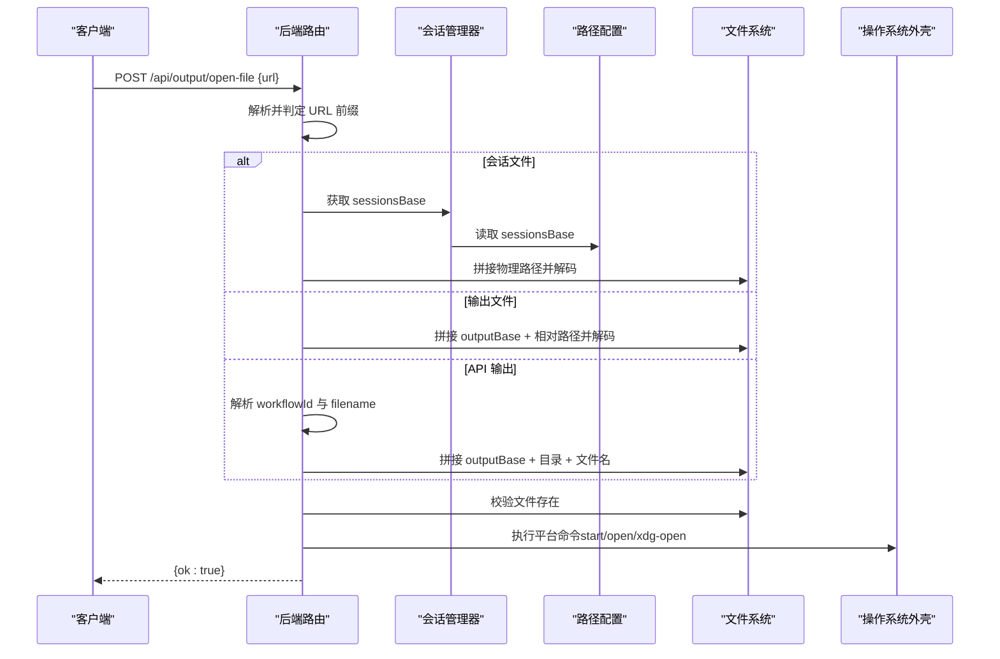
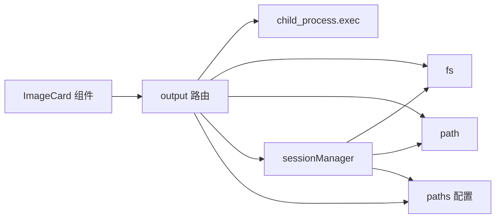

# 外部文件打开

<cite>
**本文引用的文件列表**
- [server/src/routes/output.ts](file://server/src/routes/output.ts)
- [server/src/services/sessionManager.ts](file://server/src/services/sessionManager.ts)
- [server/src/config/paths.ts](file://server/src/config/paths.ts)
- [server/src/routers/workflow.ts](file://server/src/routers/workflow.ts)
- [client/src/components/ImageCard.tsx](file://client/src/components/ImageCard.tsx)
</cite>

## 目录
1. [简介](#简介)
2. [项目结构](#项目结构)
3. [核心组件](#核心组件)
4. [架构总览](#架构总览)
5. [详细组件分析](#详细组件分析)
6. [依赖关系分析](#依赖关系分析)
7. [性能考量](#性能考量)
8. [故障排查指南](#故障排查指南)
9. [结论](#结论)
10. [附录](#附录)

## 简介
本文件面向“外部文件打开”能力的技术文档，聚焦于后端路由 POST /api/output/open-file 的完整实现，涵盖：
- URL 解析与路径转换
- 文件存在性验证
- 跨平台文件打开机制（Windows 的 start 命令、macOS 的 open 命令、Linux 的 xdg-open 命令）
- 支持的 URL 格式（会话文件、输出文件、API 路径）
- 错误处理与日志记录
- 安全考虑（URL 验证与路径规范化）
- 客户端集成示例与最佳实践

## 项目结构
围绕“外部文件打开”的关键文件与职责如下：
- server/src/routes/output.ts：提供 /api/output/* 路由，其中包含 POST /api/output/open-file 的实现
- server/src/services/sessionManager.ts：提供会话文件存储与 URL 生成逻辑，定义会话文件 URL 前缀
- server/src/config/paths.ts：集中管理路径配置，提供 sessionsBase 获取与校验
- server/src/routers/workflow.ts：展示跨平台打开目录的实现，可作为 open-file 的对照参考
- client/src/components/ImageCard.tsx：前端示例，演示如何向后端发起打开请求

```mermaid
graph TB
subgraph "客户端"
UI["ImageCard 组件"]
end
subgraph "服务端"
R["output 路由<br/>POST /api/output/open-file"]
SM["sessionManager 服务<br/>会话文件路径解析"]
CFG["paths 配置<br/>sessionsBase 获取/校验"]
FS["文件系统"]
end
UI --> |"POST /api/output/open-file"<br/>JSON{url}| R
R --> |"解析 URL 并解码"| R
R --> |"根据前缀映射到物理路径"| SM
SM --> |"基于 sessionsBase"| CFG
R --> |"存在性检查"| FS
R --> |"跨平台命令"| OS["操作系统外壳"]
```

图表来源
- [server/src/routes/output.ts:80-136](file://server/src/routes/output.ts#L80-L136)
- [server/src/services/sessionManager.ts:22-48](file://server/src/services/sessionManager.ts#L22-L48)
- [server/src/config/paths.ts:74-100](file://server/src/config/paths.ts#L74-L100)

章节来源
- [server/src/routes/output.ts:1-139](file://server/src/routes/output.ts#L1-L139)
- [server/src/services/sessionManager.ts:1-539](file://server/src/services/sessionManager.ts#L1-L539)
- [server/src/config/paths.ts:1-155](file://server/src/config/paths.ts#L1-L155)
- [client/src/components/ImageCard.tsx:640-655](file://client/src/components/ImageCard.tsx#L640-L655)

## 核心组件
- 输出路由（output.ts）中的 open-file 端点负责接收前端请求，解析 URL，定位物理文件，进行存在性校验，并调用系统默认应用打开文件。
- 会话管理器（sessionManager.ts）负责会话文件的保存与 URL 生成，其生成的 URL 以 /api/session-files/ 开头，供 open-file 使用。
- 路径配置（paths.ts）提供 sessionsBase 的获取与校验，确保会话文件路径的安全与合法性。
- 工作流路由（workflow.ts）展示了跨平台打开目录的实现，可作为 open-file 的对比参考。

章节来源
- [server/src/routes/output.ts:80-136](file://server/src/routes/output.ts#L80-L136)
- [server/src/services/sessionManager.ts:22-48](file://server/src/services/sessionManager.ts#L22-L48)
- [server/src/config/paths.ts:74-100](file://server/src/config/paths.ts#L74-L100)
- [server/src/routers/workflow.ts:949-967](file://server/src/routers/workflow.ts#L949-L967)

## 架构总览
POST /api/output/open-file 的端到端流程如下：
- 前端构造 JSON 请求体，包含 url 字段
- 后端解析 url，按前缀区分三类：
  - 会话文件：/api/session-files/{sessionId}/...
  - 输出文件：/output/{相对路径}
  - API 输出：/api/output/{workflowId}/{filename}
- 对 URL 进行解码与路径拼接，结合 sessionsBase 或 outputBase 得到物理路径
- 校验文件是否存在
- 根据 process.platform 选择对应命令（Windows: start；macOS: open；Linux: xdg-open）
- 异步执行命令，不阻塞响应



图表来源
- [server/src/routes/output.ts:80-136](file://server/src/routes/output.ts#L80-L136)
- [server/src/services/sessionManager.ts:22-48](file://server/src/services/sessionManager.ts#L22-L48)
- [server/src/config/paths.ts:74-100](file://server/src/config/paths.ts#L74-L100)

## 详细组件分析

### 后端路由：POST /api/output/open-file
- 输入参数：JSON 请求体，要求包含 url 字段
- URL 类型支持：
  - 会话文件：/api/session-files/{sessionId}/tab-{tabId}/{input|output|...}/{filename}
  - 输出文件：/output/{相对路径}
  - API 输出：/api/output/{workflowId}/{filename}
- 解析与转换：
  - 对 URL 进行解码，避免路径注入
  - 会话文件：基于 sessionsBase（来自路径配置）拼接
  - 输出文件：基于 outputBase（固定为项目根 output 目录）拼接
  - API 输出：从 workflowId 映射到具体目录，再拼接 filename
- 存在性验证：使用文件系统检测目标路径是否存在
- 跨平台打开：根据 process.platform 选择命令
  - Windows: start ""
  - macOS: open
  - Linux: xdg-open
- 响应：成功返回 {ok:true}，失败返回相应错误码与错误信息

```mermaid
flowchart TD
Start(["进入 /api/output/open-file"]) --> CheckURL["检查 url 是否存在"]
CheckURL --> |缺失| Err400["返回 400: 缺少 url"]
CheckURL --> |存在| ParseURL["解析 URL 前缀"]
ParseURL --> |/api/session-files/| ResolveSession["解码并拼接 sessionsBase"]
ParseURL --> |/output/| ResolveOutput["解码并拼接 outputBase"]
ParseURL --> |/api/output/| ResolveAPI["解析 workflowId 与 filename"]
ResolveSession --> Exists{"文件存在？"}
ResolveOutput --> Exists
ResolveAPI --> Exists
Exists --> |否| Err404["返回 404: 文件不存在"]
Exists --> |是| Platform{"平台判断"}
Platform --> |win32| CmdWin["start \"\" \"filePath\""]
Platform --> |darwin| CmdMac["open \"filePath\""]
Platform --> |其他| CmdLinux["xdg-open \"filePath\""]
CmdWin --> Exec["异步执行命令"]
CmdMac --> Exec
CmdLinux --> Exec
Exec --> Done(["返回 {ok:true}"])
```

图表来源
- [server/src/routes/output.ts:80-136](file://server/src/routes/output.ts#L80-L136)

章节来源
- [server/src/routes/output.ts:80-136](file://server/src/routes/output.ts#L80-L136)

### 会话文件 URL 生成与解析
- 会话文件保存时生成以 /api/session-files/ 开头的 URL，供前端直接使用
- 会话文件路径由 sessionsBase + sessionId + tab-* + 子目录 + 文件名组成
- 会话文件 URL 在 open-file 中被解码并拼接到 sessionsBase，形成最终物理路径

章节来源
- [server/src/services/sessionManager.ts:22-48](file://server/src/services/sessionManager.ts#L22-L48)
- [server/src/routes/output.ts:91-92](file://server/src/routes/output.ts#L91-L92)

### 路径配置与安全校验
- sessionsBase 的获取与校验：
  - 支持绝对路径覆盖与默认路径
  - 校验路径合法性、可写性与嵌套约束
- outputBase 固定为项目根 output 目录，无需额外校验

章节来源
- [server/src/config/paths.ts:74-100](file://server/src/config/paths.ts#L74-L100)
- [server/src/config/paths.ts:106-137](file://server/src/config/paths.ts#L106-L137)

### 跨平台打开机制对照
- 工作流路由展示了打开输出目录的跨平台实现，可作为 open-file 的行为对照：
  - Windows: explorer
  - macOS: open
  - Linux: xdg-open
- open-file 采用相同策略，但针对单个文件执行 open/xdg-open

章节来源
- [server/src/routers/workflow.ts:949-967](file://server/src/routers/workflow.ts#L949-L967)
- [server/src/routes/output.ts:121-129](file://server/src/routes/output.ts#L121-L129)

### 客户端集成示例
- ImageCard 组件在鼠标中键点击时，构造 JSON 请求体并调用 /api/output/open-file
- 优先使用显示输出的 URL，若为 blob 即未保存则提示无法打开
- 请求体包含 { url }，值为上述任一支持的 URL 格式

章节来源
- [client/src/components/ImageCard.tsx:640-655](file://client/src/components/ImageCard.tsx#L640-L655)

## 依赖关系分析
- output 路由依赖：
  - child_process.exec：执行系统命令
  - fs：文件存在性检查
  - path：路径拼接与规范化
  - sessionManager：获取 sessionsBase
  - config/paths：获取 outputBase 与 sessionsBase
- 会话管理器依赖：
  - fs：文件读写
  - path：路径拼接
  - config/paths：sessionsBase 获取
- 客户端依赖：
  - fetch：向后端发起请求



图表来源
- [server/src/routes/output.ts:1-10](file://server/src/routes/output.ts#L1-L10)
- [server/src/services/sessionManager.ts:1-7](file://server/src/services/sessionManager.ts#L1-L7)
- [server/src/config/paths.ts:1-20](file://server/src/config/paths.ts#L1-L20)
- [client/src/components/ImageCard.tsx:640-655](file://client/src/components/ImageCard.tsx#L640-L655)

章节来源
- [server/src/routes/output.ts:1-10](file://server/src/routes/output.ts#L1-L10)
- [server/src/services/sessionManager.ts:1-7](file://server/src/services/sessionManager.ts#L1-L7)
- [server/src/config/paths.ts:1-20](file://server/src/config/paths.ts#L1-L20)
- [client/src/components/ImageCard.tsx:640-655](file://client/src/components/ImageCard.tsx#L640-L655)

## 性能考量
- 异步执行系统命令：exec 为异步，不会阻塞请求线程
- 文件存在性检查：仅进行一次 fs.existsSync，开销极低
- URL 解析与解码：在内存中进行，复杂度与 URL 长度线性相关
- 跨平台命令：系统层调用，性能取决于操作系统外壳实现

## 故障排查指南
- 常见错误与处理
  - 缺少 url 参数：返回 400，日志记录请求体
  - URL 编码错误：返回 400，日志记录错误详情
  - 不支持的 URL 前缀：返回 400
  - 文件不存在：返回 404
  - 打开命令执行失败：记录错误日志，但不影响响应
- 日志记录
  - 控制台输出错误信息，便于定位问题
- 安全建议
  - 严格限制 sessionsBase 的可写性与访问范围
  - 避免将用户输入直接拼接到命令行，当前实现已通过路径拼接与解码降低风险
  - 如需扩展，建议增加白名单与更严格的路径规范化

章节来源
- [server/src/routes/output.ts:80-136](file://server/src/routes/output.ts#L80-L136)

## 结论
POST /api/output/open-file 提供了统一的跨平台文件打开能力，支持会话文件、输出文件与 API 输出三种 URL 格式。其实现简洁可靠，具备良好的错误处理与日志记录，并通过路径配置与会话管理确保安全性与一致性。客户端可通过简单请求即可触发系统默认应用打开文件，提升用户体验。

## 附录

### URL 格式支持一览
- 会话文件：/api/session-files/{sessionId}/tab-{tabId}/{input|output|...}/{filename}
- 输出文件：/output/{相对路径}
- API 输出：/api/output/{workflowId}/{filename}

章节来源
- [server/src/routes/output.ts:91-104](file://server/src/routes/output.ts#L91-L104)
- [server/src/services/sessionManager.ts:22-48](file://server/src/services/sessionManager.ts#L22-L48)

### 客户端最佳实践
- 优先使用后端生成的 /api/session-files/ URL，确保路径正确且安全
- 在鼠标中键点击等场景触发打开，避免误操作
- 对于 blob URL 或未保存资源，应提示用户先保存再打开
- 建议在 UI 上提供“在资源管理器中打开”等快捷入口，增强可用性

章节来源
- [client/src/components/ImageCard.tsx:640-655](file://client/src/components/ImageCard.tsx#L640-L655)