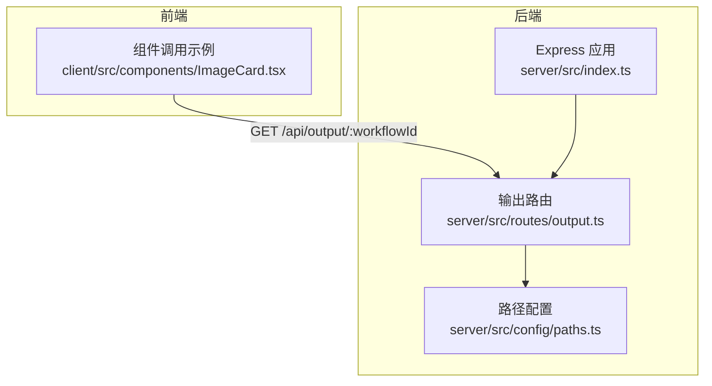
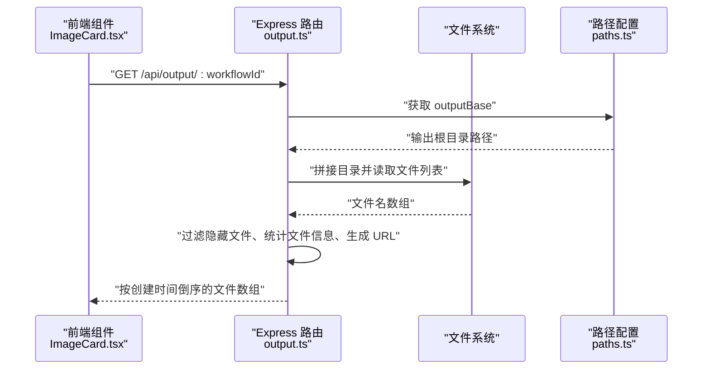
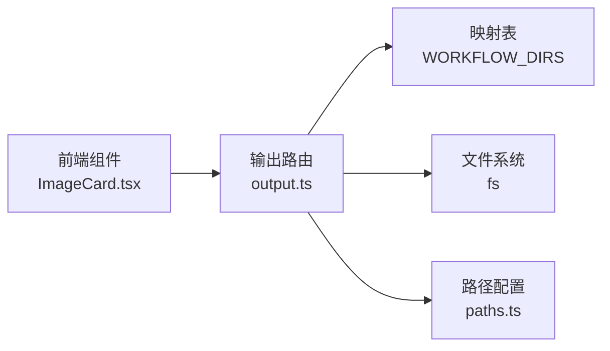

# 文件列表接口

<cite>
**本文引用的文件**
- [server/src/routes/output.ts](file://server/src/routes/output.ts)
- [server/src/index.ts](file://server/src/index.ts)
- [server/src/config/paths.ts](file://server/src/config/paths.ts)
- [client/src/components/ImageCard.tsx](file://client/src/components/ImageCard.tsx)
- [README.md](file://README.md)
</cite>

## 目录
1. [简介](#简介)
2. [项目结构](#项目结构)
3. [核心组件](#核心组件)
4. [架构概览](#架构概览)
5. [详细组件分析](#详细组件分析)
6. [依赖关系分析](#依赖关系分析)
7. [性能考虑](#性能考虑)
8. [故障排查指南](#故障排查指南)
9. [结论](#结论)
10. [附录](#附录)

## 简介
本文档面向文件列表接口，聚焦于 GET /api/output/:workflowId 端点的实现与使用。内容涵盖：
- 工作流 ID 参数校验与映射
- 输出目录存在性检查
- 文件读取与数据结构
- 排序与过滤规则
- 错误处理策略
- 完整请求/响应示例与客户端调用指南

## 项目结构
后端采用 Express + TypeScript，路由集中于 server/src/routes，其中 output.ts 提供输出文件列表与下载能力；前端通过 fetch 调用后端接口。

图表来源
- [server/src/index.ts:129-145](file://server/src/index.ts#L129-L145)
- [server/src/routes/output.ts:1-139](file://server/src/routes/output.ts#L1-L139)
- [server/src/config/paths.ts:141-143](file://server/src/config/paths.ts#L141-L143)

章节来源
- [README.md:41-62](file://README.md#L41-L62)
- [server/src/index.ts:129-145](file://server/src/index.ts#L129-L145)

## 核心组件
- 输出路由：负责解析工作流 ID、构建输出目录路径、枚举文件、过滤隐藏文件、按创建时间倒序排序，并返回标准化的文件元数据数组。
- 路径配置：提供 outputBase 根目录的获取方法，确保输出目录存在。
- 前端调用：通过 fetch 发起请求，解析响应并渲染文件列表。

章节来源
- [server/src/routes/output.ts:27-58](file://server/src/routes/output.ts#L27-L58)
- [server/src/config/paths.ts:141-143](file://server/src/config/paths.ts#L141-L143)
- [client/src/components/ImageCard.tsx:649-655](file://client/src/components/ImageCard.tsx#L649-L655)

## 架构概览
文件列表接口的调用链路如下：

图表来源
- [server/src/routes/output.ts:27-58](file://server/src/routes/output.ts#L27-L58)
- [server/src/config/paths.ts:141-143](file://server/src/config/paths.ts#L141-L143)
- [client/src/components/ImageCard.tsx:649-655](file://client/src/components/ImageCard.tsx#L649-L655)

## 详细组件分析

### 端点定义与参数校验
- 路径：GET /api/output/:workflowId
- 参数：workflowId（数字，映射至固定的工作流目录）
- 映射表：WORKFLOW_DIRS 将数字 ID 映射到具体输出目录名称
- 校验逻辑：
  - 将请求参数解析为十进制整数
  - 查询映射表，若无对应目录名，返回 400 并提示“未知工作流”
  - 若映射存在，拼接 outputBase 与目录名得到最终路径

章节来源
- [server/src/routes/output.ts:13-25](file://server/src/routes/output.ts#L13-L25)
- [server/src/routes/output.ts:28-35](file://server/src/routes/output.ts#L28-L35)

### 目录存在性检查与文件枚举
- 目录存在性：若目标目录不存在，直接返回空数组
- 文件枚举：读取目录下所有文件，过滤掉以点开头的隐藏文件
- 文件信息收集：对每个文件调用 stat 获取大小与创建时间（birthtime）

章节来源
- [server/src/routes/output.ts:37-42](file://server/src/routes/output.ts#L37-L42)
- [server/src/routes/output.ts:44-55](file://server/src/routes/output.ts#L44-L55)

### 数据结构与 URL 生成
返回的每个文件对象包含以下字段：
- filename：文件名（原始文件名）
- size：字节数（来自文件 stat 的 size）
- createdAt：ISO 8601 字符串（来自文件 stat 的 birthtime）
- url：可访问的下载 URL，格式为 /api/output/{workflowId}/{encodedFilename}

注意：
- 文件名在 URL 中进行了编码（encodeURIComponent），以支持包含特殊字符的文件名
- 该 URL 由后端路由 /api/output/:workflowId/:filename 提供下载能力

章节来源
- [server/src/routes/output.ts:46-53](file://server/src/routes/output.ts#L46-L53)
- [server/src/routes/output.ts:60-78](file://server/src/routes/output.ts#L60-L78)

### 排序与过滤规则
- 过滤规则：排除隐藏文件（以点开头的文件名）
- 排序规则：按 createdAt 的时间倒序排列（最新的在前）

章节来源
- [server/src/routes/output.ts:45](file://server/src/routes/output.ts#L45)
- [server/src/routes/output.ts:55](file://server/src/routes/output.ts#L55)

### 错误处理机制
- 未知工作流 ID：当 workflowId 无法在映射表中找到时，返回 400，并携带错误信息
- 目录不存在：当输出目录不存在时，返回空数组，不报错
- 文件下载错误：当 /api/output/:workflowId/:filename 对应文件不存在时，返回 404

章节来源
- [server/src/routes/output.ts:32-41](file://server/src/routes/output.ts#L32-L41)
- [server/src/routes/output.ts:65-75](file://server/src/routes/output.ts#L65-L75)

### 完整请求/响应示例
- 请求
  - 方法：GET
  - 路径：/api/output/0
  - 说明：获取工作流 ID 为 0 的输出文件列表
- 响应
  - 成功：200 OK，返回文件数组
  - 示例字段：filename、size、createdAt、url
  - 未知工作流：400 Bad Request
  - 目录不存在：200 OK，返回 []

章节来源
- [server/src/routes/output.ts:27-58](file://server/src/routes/output.ts#L27-L58)

### 客户端调用指南
- 前端组件通过 fetch 调用 /api/output/:workflowId 获取文件列表
- 组件示例位置：client/src/components/ImageCard.tsx 中的鼠标中键点击事件，会向 /api/output/open-file 发起 POST 请求以打开文件（与文件列表接口同属 /api/output 命名空间）
- 建议流程：
  - 使用 fetch 发起 GET 请求
  - 解析响应为 JSON
  - 遍历数组渲染文件项
  - 点击文件项时，使用返回的 url 字段发起下载或预览

章节来源
- [client/src/components/ImageCard.tsx:649-655](file://client/src/components/ImageCard.tsx#L649-L655)

## 依赖关系分析
- 路由依赖路径配置：output.ts 通过 paths.ts 获取 outputBase，确保输出目录存在
- 路由依赖文件系统：使用 fs.readdirSync 与 fs.statSync 进行文件枚举与元数据读取
- 路由依赖映射表：WORKFLOW_DIRS 将数字 ID 映射到目录名
- 前端依赖后端接口：通过 /api/output/* 下发的 URL 进行文件访问

图表来源
- [server/src/routes/output.ts:13-25](file://server/src/routes/output.ts#L13-L25)
- [server/src/routes/output.ts:44-55](file://server/src/routes/output.ts#L44-L55)
- [server/src/config/paths.ts:141-143](file://server/src/config/paths.ts#L141-L143)
- [client/src/components/ImageCard.tsx:649-655](file://client/src/components/ImageCard.tsx#L649-L655)

章节来源
- [server/src/routes/output.ts:13-25](file://server/src/routes/output.ts#L13-L25)
- [server/src/config/paths.ts:141-143](file://server/src/config/paths.ts#L141-L143)

## 性能考虑
- 文件枚举与 stat：对每个文件执行 stat 操作，O(n) 时间复杂度；在文件数量较多时可能成为瓶颈
- 过滤与排序：过滤隐藏文件与按时间倒序排序均为 O(n) 操作
- 建议优化：
  - 对于大量文件，可考虑分页或增量加载
  - 使用异步读取与流式处理减少阻塞
  - 对频繁访问的目录增加缓存层

## 故障排查指南
- 问题：返回空数组
  - 可能原因：输出目录不存在或目录为空
  - 处理：确认工作流 ID 是否正确，检查 output 目录是否存在
- 问题：返回 400 错误
  - 可能原因：workflowId 不在映射表中
  - 处理：核对映射表与传入 ID
- 问题：前端无法打开文件
  - 可能原因：/api/output/open-file 接口未正确配置或 URL 编码错误
  - 处理：检查前端调用与后端路由注册

章节来源
- [server/src/routes/output.ts:32-41](file://server/src/routes/output.ts#L32-L41)
- [server/src/routes/output.ts:65-75](file://server/src/routes/output.ts#L65-L75)
- [server/src/index.ts:129-145](file://server/src/index.ts#L129-L145)

## 结论
GET /api/output/:workflowId 接口提供了简洁、稳定的输出文件列表能力，具备明确的参数校验、目录存在性检查、隐藏文件过滤与时间倒序排序。结合前端组件的调用方式，可实现直观的文件浏览与下载体验。针对大规模文件场景，建议引入分页与缓存策略以提升性能。

## 附录
- 路由注册：后端在 server/src/index.ts 中注册 /api/output 路由
- 输出目录：后端在启动时确保 output 目录存在
- 前端调用：client/src/components/ImageCard.tsx 展示了如何通过 fetch 调用后端接口

章节来源
- [server/src/index.ts:129-145](file://server/src/index.ts#L129-L145)
- [server/src/index.ts:82-100](file://server/src/index.ts#L82-L100)
- [client/src/components/ImageCard.tsx:649-655](file://client/src/components/ImageCard.tsx#L649-L655)