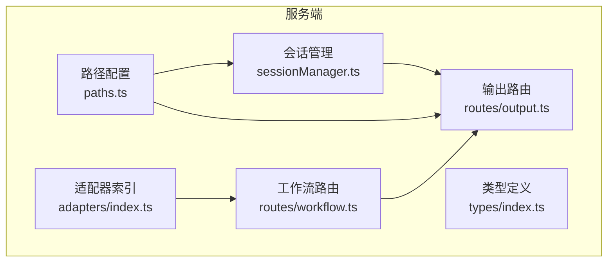
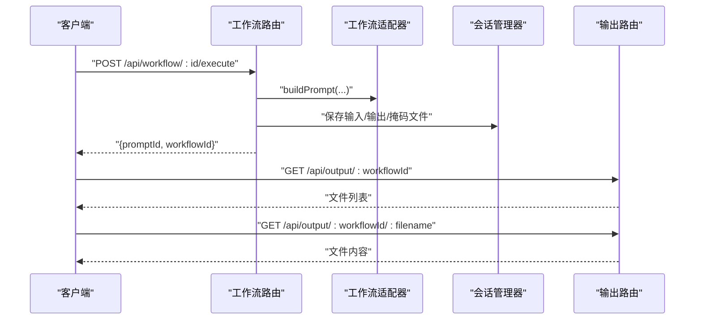
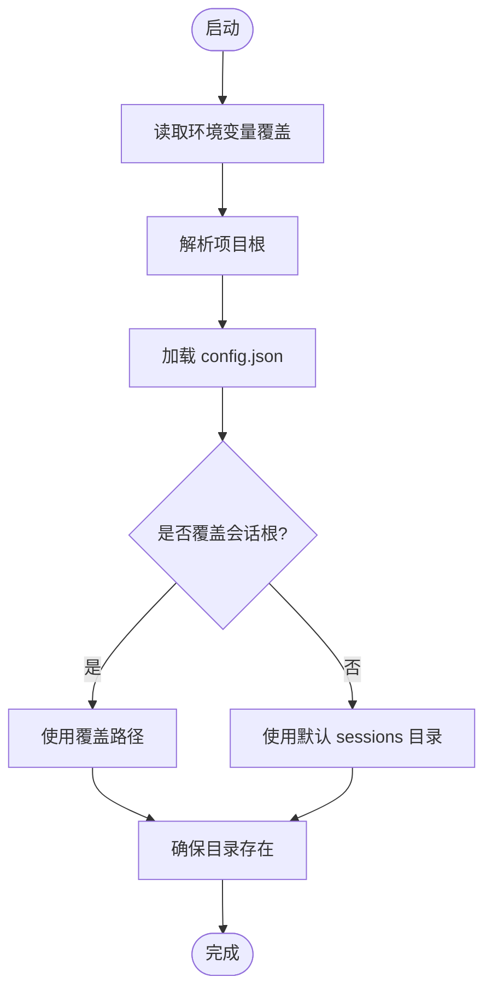
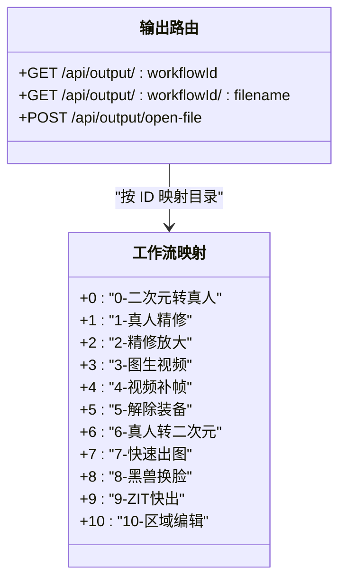
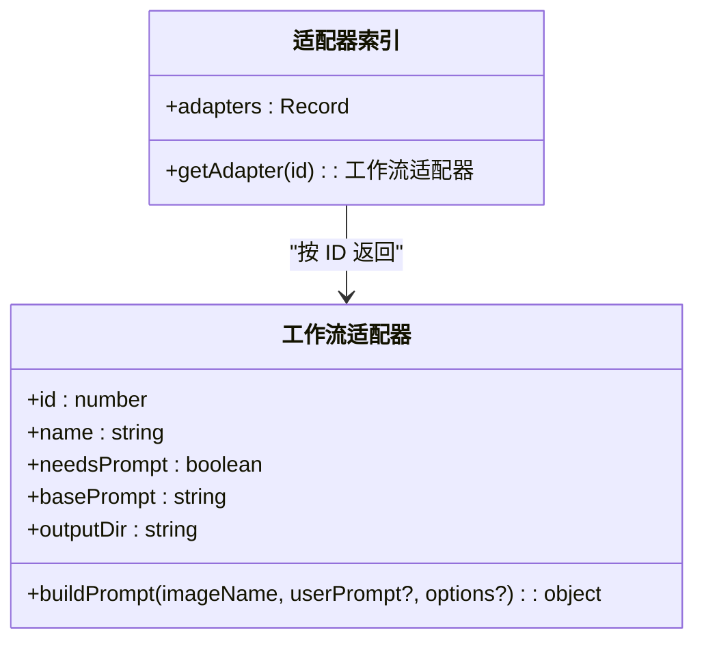
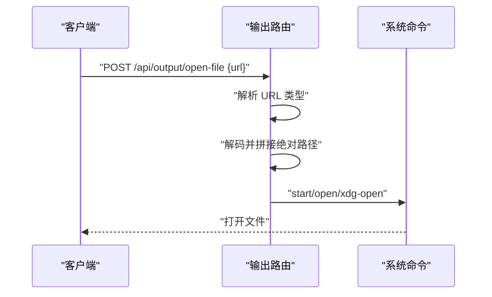
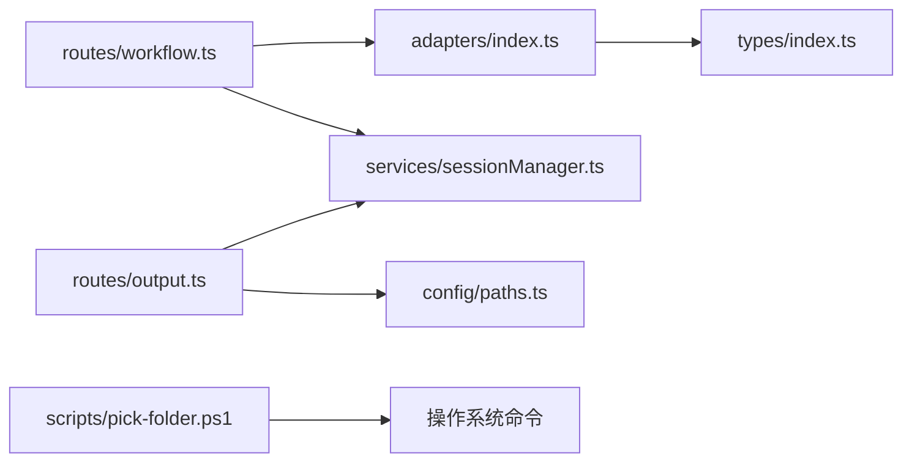

# 文件存储与组织

<cite>
**本文引用的文件**
- [server/src/config/paths.ts](file://server/src/config/paths.ts)
- [server/src/routes/output.ts](file://server/src/routes/output.ts)
- [server/src/services/sessionManager.ts](file://server/src/services/sessionManager.ts)
- [server/src/adapters/index.ts](file://server/src/adapters/index.ts)
- [server/src/types/index.ts](file://server/src/types/index.ts)
- [server/src/adapters/BaseAdapter.ts](file://server/src/adapters/BaseAdapter.ts)
- [server/src/adapters/Workflow0Adapter.ts](file://server/src/adapters/Workflow0Adapter.ts)
- [server/src/adapters/Workflow10Adapter.ts](file://server/src/adapters/Workflow10Adapter.ts)
- [server/src/routes/workflow.ts](file://server/src/routes/workflow.ts)
- [server/scripts/pick-folder.ps1](file://server/scripts/pick-folder.ps1)
- [package.json](file://package.json)
- [server/package.json](file://server/package.json)
</cite>

## 目录
1. [简介](#简介)
2. [项目结构](#项目结构)
3. [核心组件](#核心组件)
4. [架构总览](#架构总览)
5. [详细组件分析](#详细组件分析)
6. [依赖分析](#依赖分析)
7. [性能考量](#性能考量)
8. [故障排查指南](#故障排查指南)
9. [结论](#结论)
10. [附录](#附录)

## 简介
本文件存储与组织系统围绕“会话（sessions）”和“输出（output）”两大目录展开，采用集中式路径配置与工作流适配器模式，实现：
- 输出文件按工作流类型进行目录分类（0-二次元转真人到10-区域编辑）
- 统一的路径解析与相对路径到绝对路径的转换
- 工作流 ID 与输出目录的稳定映射及扩展性设计
- 会话目录的创建、权限校验与清理策略
- 跨平台文件路径处理（Windows、macOS、Linux）

## 项目结构
- 服务端路径配置集中在路径模块，负责项目根、会话根、输出根等目录的统一获取与校验
- 输出路由负责列出与提供输出文件，并支持跨工作流的文件打开
- 会话管理器负责会话目录树的创建与维护，以及会话状态持久化
- 工作流适配器定义了每个工作流的输出目录名，用于构建输出文件的最终落盘位置
- 脚本提供跨平台的文件打开能力

图表来源
- [server/src/config/paths.ts:1-156](file://server/src/config/paths.ts#L1-L156)
- [server/src/services/sessionManager.ts:1-539](file://server/src/services/sessionManager.ts#L1-L539)
- [server/src/routes/output.ts:1-139](file://server/src/routes/output.ts#L1-L139)
- [server/src/routes/workflow.ts:1-800](file://server/src/routes/workflow.ts#L1-L800)
- [server/src/adapters/index.ts:1-33](file://server/src/adapters/index.ts#L1-L33)
- [server/src/types/index.ts:1-52](file://server/src/types/index.ts#L1-L52)

章节来源
- [server/src/config/paths.ts:1-156](file://server/src/config/paths.ts#L1-L156)
- [server/src/routes/output.ts:1-139](file://server/src/routes/output.ts#L1-L139)
- [server/src/services/sessionManager.ts:1-539](file://server/src/services/sessionManager.ts#L1-L539)
- [server/src/adapters/index.ts:1-33](file://server/src/adapters/index.ts#L1-L33)
- [server/src/types/index.ts:1-52](file://server/src/types/index.ts#L1-L52)

## 核心组件
- 路径配置模块：集中管理项目根、会话根、输出根；支持运行时覆盖与校验
- 输出路由：按工作流 ID 映射到对应输出目录，提供文件列表与下载
- 会话管理器：确保会话目录树存在，保存输入/输出/掩码文件，维护会话状态
- 工作流适配器：声明每个工作流的输出目录名，供工作流执行时落盘使用
- 跨平台文件打开：根据操作系统选择合适的命令打开文件

章节来源
- [server/src/config/paths.ts:1-156](file://server/src/config/paths.ts#L1-L156)
- [server/src/routes/output.ts:1-139](file://server/src/routes/output.ts#L1-L139)
- [server/src/services/sessionManager.ts:1-539](file://server/src/services/sessionManager.ts#L1-L539)
- [server/src/adapters/index.ts:1-33](file://server/src/adapters/index.ts#L1-L33)
- [server/src/adapters/Workflow0Adapter.ts:1-35](file://server/src/adapters/Workflow0Adapter.ts#L1-L35)
- [server/src/adapters/Workflow10Adapter.ts:1-15](file://server/src/adapters/Workflow10Adapter.ts#L1-L15)
- [server/src/routes/workflow.ts:1-800](file://server/src/routes/workflow.ts#L1-L800)

## 架构总览
系统通过“路径配置 -> 会话管理 -> 工作流执行 -> 输出路由”的链路，实现文件的组织与访问。

图表来源
- [server/src/routes/workflow.ts:750-799](file://server/src/routes/workflow.ts#L750-L799)
- [server/src/adapters/index.ts:1-33](file://server/src/adapters/index.ts#L1-L33)
- [server/src/services/sessionManager.ts:22-62](file://server/src/services/sessionManager.ts#L22-L62)
- [server/src/routes/output.ts:27-78](file://server/src/routes/output.ts#L27-L78)

## 详细组件分析

### 路径配置与解析机制
- 项目根优先使用环境变量覆盖，否则回退到默认项目根
- 会话根支持运行时切换并通过配置文件持久化
- 输出根固定为项目根下的 output 目录
- 路径解析采用 Node.js path 模块，保证跨平台一致性

图表来源
- [server/src/config/paths.ts:18-100](file://server/src/config/paths.ts#L18-L100)

章节来源
- [server/src/config/paths.ts:1-156](file://server/src/config/paths.ts#L1-L156)

### 输出文件目录结构与工作流映射
- 输出目录以工作流 ID 为键，映射到固定命名的子目录
- 支持的工作流范围从 0 到 10，分别对应不同业务场景
- 输出路由按工作流 ID 查找对应目录，列出文件并提供下载

图表来源
- [server/src/routes/output.ts:13-25](file://server/src/routes/output.ts#L13-L25)

章节来源
- [server/src/routes/output.ts:1-139](file://server/src/routes/output.ts#L1-L139)

### 会话目录结构与文件组织
- 会话目录树包含多个标签页（tab-0 到 tab-5），每个标签页包含 input、masks、output 三个子目录
- 输入/输出/掩码文件均按会话 ID 和标签页组织，便于隔离与清理
- 会话状态以 JSON 文件形式保存，包含创建时间、更新时间、活动标签页等信息

```mermaid
graph TB
Sessions["sessions/"]
subgraph "会话 A"
A_tab0["tab-0/"]
A_tab1["tab-1/"]
A_tab2["tab-2/"]
A_tab3["tab-3/"]
A_tab4["tab-4/"]
A_tab5["tab-5/"]
end
A_tab0 --> A_tab0_input["input/"]
A_tab0 --> A_tab0_masks["masks/"]
A_tab0 --> A_tab0_output["output/"]
A_tab1 --> A_tab1_input["input/"]
A_tab1 --> A_tab1_masks["masks/"]
A_tab1 --> A_tab1_output["output/"]
A_tab2 --> A_tab2_input["input/"]
A_tab2 --> A_tab2_masks["masks/"]
A_tab2 --> A_tab2_output["output/"]
A_tab3 --> A_tab3_input["input/"]
A_tab3 --> A_tab3_masks["masks/"]
A_tab3 --> A_tab3_output["output/"]
A_tab4 --> A_tab4_input["input/"]
A_tab4 --> A_tab4_masks["masks/"]
A_tab4 --> A_tab4_output["output/"]
A_tab5 --> A_tab5_input["input/"]
A_tab5 --> A_tab5_masks["masks/"]
A_tab5 --> A_tab5_output["output/"]
```

图表来源
- [server/src/services/sessionManager.ts:11-18](file://server/src/services/sessionManager.ts#L11-L18)

章节来源
- [server/src/services/sessionManager.ts:1-539](file://server/src/services/sessionManager.ts#L1-L539)

### 工作流适配器与输出目录
- 每个工作流适配器声明其输出目录名，工作流执行时据此确定输出文件的落盘位置
- 适配器索引集中管理所有工作流适配器，便于按 ID 获取
- 类型定义中包含工作流适配器接口，约束输出目录字段

图表来源
- [server/src/types/index.ts:1-8](file://server/src/types/index.ts#L1-L8)
- [server/src/adapters/index.ts:14-30](file://server/src/adapters/index.ts#L14-L30)
- [server/src/adapters/Workflow0Adapter.ts:9-34](file://server/src/adapters/Workflow0Adapter.ts#L9-L34)
- [server/src/adapters/Workflow10Adapter.ts:4-14](file://server/src/adapters/Workflow10Adapter.ts#L4-L14)

章节来源
- [server/src/adapters/index.ts:1-33](file://server/src/adapters/index.ts#L1-L33)
- [server/src/types/index.ts:1-52](file://server/src/types/index.ts#L1-L52)
- [server/src/adapters/Workflow0Adapter.ts:1-35](file://server/src/adapters/Workflow0Adapter.ts#L1-L35)
- [server/src/adapters/Workflow10Adapter.ts:1-15](file://server/src/adapters/Workflow10Adapter.ts#L1-L15)

### 跨平台文件路径处理与打开
- 路径拼接与解析统一使用 Node.js path 模块，保证在 Windows、macOS、Linux 上的一致行为
- 输出路由支持跨工作流的文件打开功能，根据 URL 类型解析到实际文件路径
- 脚本提供 Windows 下的文件打开能力，其他平台使用 open/xdg-open

图表来源
- [server/src/routes/output.ts:80-136](file://server/src/routes/output.ts#L80-L136)
- [server/scripts/pick-folder.ps1:1-126](file://server/scripts/pick-folder.ps1#L1-L126)

章节来源
- [server/src/routes/output.ts:1-139](file://server/src/routes/output.ts#L1-L139)
- [server/scripts/pick-folder.ps1:1-126](file://server/scripts/pick-folder.ps1#L1-L126)

### 文件夹创建、权限设置与清理策略
- 会话根目录在设置覆盖或首次使用时自动创建
- 路径模块提供会话根目录的合法性校验（绝对路径、不可写检测、禁止嵌套在 tab 子目录等）
- 会话管理器提供会话列表、删除与裁剪策略（保留最近 N 个会话）

章节来源
- [server/src/config/paths.ts:106-137](file://server/src/config/paths.ts#L106-L137)
- [server/src/services/sessionManager.ts:145-172](file://server/src/services/sessionManager.ts#L145-L172)
- [server/src/services/sessionManager.ts:220-226](file://server/src/services/sessionManager.ts#L220-L226)

## 依赖分析
- 路由层依赖适配器索引与会话管理器
- 适配器层依赖类型定义
- 输出路由依赖路径配置与会话管理器
- 脚本与系统命令交互，实现跨平台文件打开

图表来源
- [server/src/routes/workflow.ts:1-800](file://server/src/routes/workflow.ts#L1-L800)
- [server/src/adapters/index.ts:1-33](file://server/src/adapters/index.ts#L1-L33)
- [server/src/types/index.ts:1-52](file://server/src/types/index.ts#L1-L52)
- [server/src/services/sessionManager.ts:1-539](file://server/src/services/sessionManager.ts#L1-L539)
- [server/src/routes/output.ts:1-139](file://server/src/routes/output.ts#L1-L139)
- [server/src/config/paths.ts:1-156](file://server/src/config/paths.ts#L1-L156)
- [server/scripts/pick-folder.ps1:1-126](file://server/scripts/pick-folder.ps1#L1-L126)

章节来源
- [server/src/routes/workflow.ts:1-800](file://server/src/routes/workflow.ts#L1-L800)
- [server/src/adapters/index.ts:1-33](file://server/src/adapters/index.ts#L1-L33)
- [server/src/types/index.ts:1-52](file://server/src/types/index.ts#L1-L52)
- [server/src/services/sessionManager.ts:1-539](file://server/src/services/sessionManager.ts#L1-L539)
- [server/src/routes/output.ts:1-139](file://server/src/routes/output.ts#L1-L139)
- [server/src/config/paths.ts:1-156](file://server/src/config/paths.ts#L1-L156)
- [server/scripts/pick-folder.ps1:1-126](file://server/scripts/pick-folder.ps1#L1-L126)

## 性能考量
- 目录读取与文件枚举采用同步 API，建议在高并发场景下引入异步与缓存策略
- 路径解析与权限校验在关键路径上执行，避免重复计算
- 输出路由在生产环境建议结合静态资源服务器或 CDN 提升文件传输效率

## 故障排查指南
- 会话根不可写：检查路径合法性与写权限，确认无嵌套在 tab 子目录
- 文件打开失败：确认 URL 类型与路径解析逻辑，检查操作系统命令可用性
- 输出目录为空：确认工作流执行是否成功，检查输出目录是否存在

章节来源
- [server/src/config/paths.ts:106-137](file://server/src/config/paths.ts#L106-L137)
- [server/src/routes/output.ts:80-136](file://server/src/routes/output.ts#L80-L136)
- [server/src/services/sessionManager.ts:145-172](file://server/src/services/sessionManager.ts#L145-L172)

## 结论
该系统通过集中式路径配置与工作流适配器模式，实现了输出文件的有序组织与跨平台兼容。会话目录树的设计保证了数据隔离与可维护性，路径校验与清理策略提升了系统的健壮性。未来可在高并发场景下引入异步 I/O 与缓存机制，进一步提升性能与稳定性。

## 附录
- 项目与服务端脚本配置文件

章节来源
- [package.json:1-15](file://package.json#L1-L15)
- [server/package.json:1-28](file://server/package.json#L1-L28)