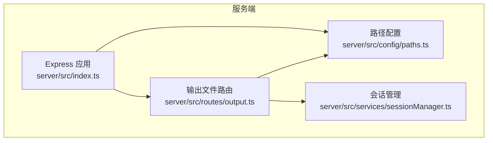
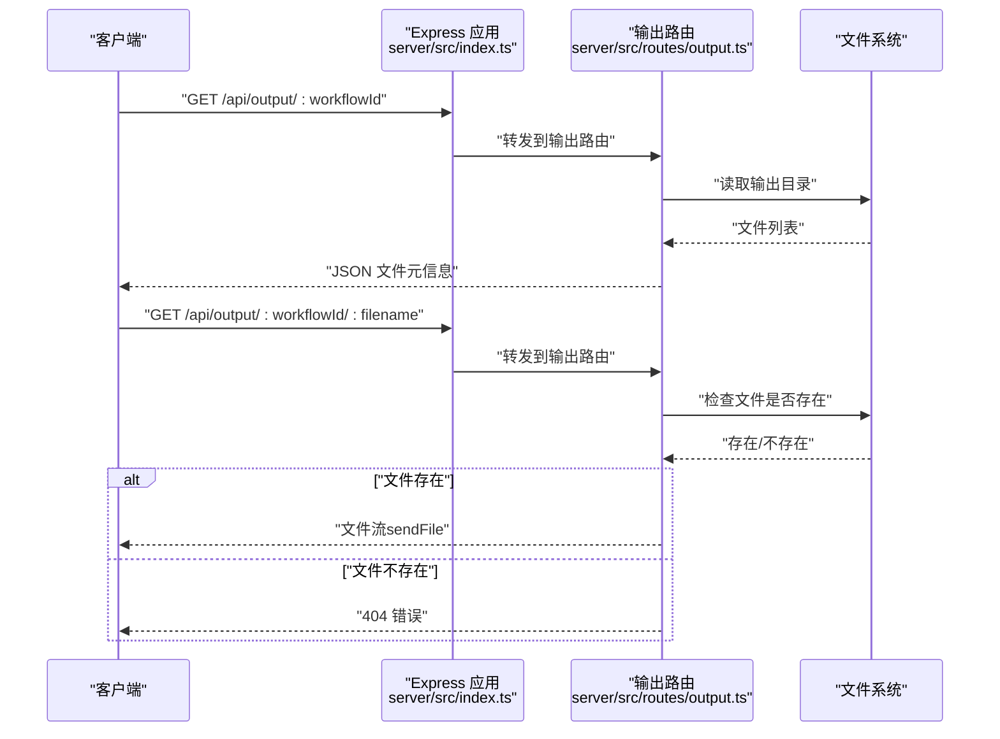
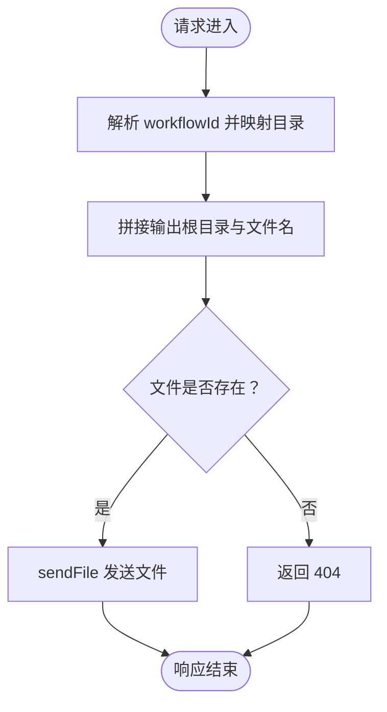
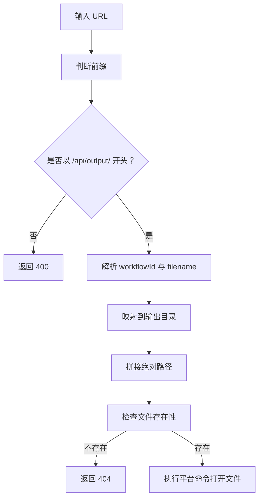
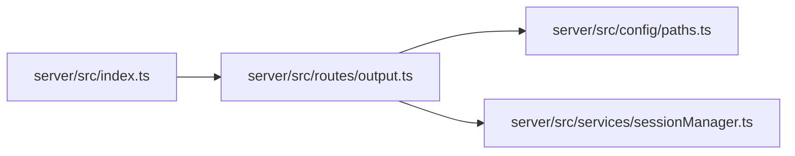

# 文件服务接口

<cite>
**本文引用的文件**
- [server/src/routes/output.ts](file://server/src/routes/output.ts)
- [server/src/index.ts](file://server/src/index.ts)
- [server/src/config/paths.ts](file://server/src/config/paths.ts)
- [server/src/services/sessionManager.ts](file://server/src/services/sessionManager.ts)
- [server/package.json](file://server/package.json)
</cite>

## 目录
1. [简介](#简介)
2. [项目结构](#项目结构)
3. [核心组件](#核心组件)
4. [架构总览](#架构总览)
5. [详细组件分析](#详细组件分析)
6. [依赖关系分析](#依赖关系分析)
7. [性能考虑](#性能考虑)
8. [故障排查指南](#故障排查指南)
9. [结论](#结论)

## 简介
本文档围绕文件服务接口，特别是 GET /api/output/:workflowId/:filename 端点进行深入说明。内容涵盖：
- 文件路径解析与存在性验证
- 安全检查与目录遍历防护
- 文件传输流程（MIME 类型、内容长度、流式传输）
- 下载与预览的使用场景与实现差异
- 文件访问权限控制与安全策略
- 文件缓存策略与性能优化方案

## 项目结构
文件服务位于后端服务的路由层，与静态资源服务、会话管理、路径配置等模块协同工作。关键位置如下：
- 路由定义：server/src/routes/output.ts
- 应用入口与静态资源挂载：server/src/index.ts
- 路径与数据根配置：server/src/config/paths.ts
- 会话文件保存与命名规范：server/src/services/sessionManager.ts
- 依赖与运行时配置：server/package.json

图表来源
- [server/src/index.ts:118-146](file://server/src/index.ts#L118-L146)
- [server/src/routes/output.ts:1-139](file://server/src/routes/output.ts#L1-L139)
- [server/src/config/paths.ts:141-143](file://server/src/config/paths.ts#L141-L143)
- [server/src/services/sessionManager.ts:37-48](file://server/src/services/sessionManager.ts#L37-L48)

章节来源
- [server/src/index.ts:118-146](file://server/src/index.ts#L118-L146)
- [server/src/routes/output.ts:1-139](file://server/src/routes/output.ts#L1-L139)
- [server/src/config/paths.ts:141-143](file://server/src/config/paths.ts#L141-L143)
- [server/src/services/sessionManager.ts:37-48](file://server/src/services/sessionManager.ts#L37-L48)

## 核心组件
- 输出文件路由：负责列出工作流输出目录中的文件以及提供单个文件的下载服务。
- 路径配置：集中管理数据根目录、输出目录、会话目录等，支持运行时覆盖。
- 会话管理：提供保存输出文件到会话目录的能力，并生成对应的访问 URL。
- 应用入口：挂载静态资源与路由，启用 CORS，处理文件下载与打开请求。

章节来源
- [server/src/routes/output.ts:27-78](file://server/src/routes/output.ts#L27-L78)
- [server/src/config/paths.ts:141-143](file://server/src/config/paths.ts#L141-L143)
- [server/src/services/sessionManager.ts:37-48](file://server/src/services/sessionManager.ts#L37-L48)
- [server/src/index.ts:118-146](file://server/src/index.ts#L118-L146)

## 架构总览
文件服务的整体交互流程如下：
- 客户端请求 GET /api/output/:workflowId 或 GET /api/output/:workflowId/:filename
- 服务端根据工作流 ID 映射到输出目录
- 对于列表请求，读取目录并返回文件元信息；对于下载请求，验证文件存在性后进行文件传输
- 应用入口同时挂载 /output 静态目录，允许直接访问输出目录中的文件

图表来源
- [server/src/index.ts:118-146](file://server/src/index.ts#L118-L146)
- [server/src/routes/output.ts:27-78](file://server/src/routes/output.ts#L27-L78)

## 详细组件分析

### GET /api/output/:workflowId
- 功能：列出指定工作流 ID 对应输出目录下的所有文件，返回文件名、大小、创建时间与可访问 URL。
- 路径解析：将工作流 ID 映射到固定命名的输出子目录，拼接至输出根目录。
- 存在性验证：若目录不存在则返回空数组。
- 排序：按创建时间倒序排列。
- URL 生成：为每个文件生成可直接访问的 API URL。

章节来源
- [server/src/routes/output.ts:27-58](file://server/src/routes/output.ts#L27-L58)

### GET /api/output/:workflowId/:filename
- 功能：提供单个文件的下载服务。
- 路径解析：根据工作流 ID 获取对应输出目录，拼接文件名形成完整路径。
- 存在性验证：若文件不存在返回 404。
- 文件传输：使用 Express 的 sendFile 方法进行文件传输。
- 安全检查：通过路径拼接与存在性检查，避免直接暴露任意文件系统路径。

图表来源
- [server/src/routes/output.ts:60-78](file://server/src/routes/output.ts#L60-L78)

章节来源
- [server/src/routes/output.ts:60-78](file://server/src/routes/output.ts#L60-L78)

### 文件传输机制与头部设置
- MIME 类型：Express 的 sendFile 会根据文件扩展名自动设置 Content-Type。
- 内容长度：sendFile 会自动设置 Content-Length。
- 流式传输：sendFile 使用底层的流式传输，适合大文件下载，减少内存占用。
- 预览与下载：浏览器根据 Content-Disposition 控制预览或下载行为；当前路由未显式设置，遵循默认行为。

章节来源
- [server/src/routes/output.ts:76-78](file://server/src/routes/output.ts#L76-L78)

### 安全检查与目录遍历防护
- 路径映射：工作流 ID 仅映射到预定义的输出目录，限制了可访问范围。
- 绝对路径拼接：使用 path.join 与 path.resolve 结合，确保路径在预期根目录内。
- 存在性检查：在发送文件前检查文件是否存在，避免泄露系统中其他文件。
- URL 解码：在 /api/output/open-file 端点中对 URL 进行解码，防止恶意编码绕过。

图表来源
- [server/src/routes/output.ts:80-136](file://server/src/routes/output.ts#L80-L136)

章节来源
- [server/src/routes/output.ts:80-136](file://server/src/routes/output.ts#L80-L136)

### 下载与预览的使用场景与实现差异
- 下载：通过 /api/output/:workflowId/:filename 直接下载文件，适合保存到本地或进一步处理。
- 预览：当前路由未显式设置 Content-Disposition，浏览器通常会尝试预览常见媒体类型（如图片、PDF）。若需强制下载，可在客户端设置响应头或使用自定义下载逻辑。
- 区分策略：若需要更精细的控制（如强制下载、预览），可在应用层增加参数或中间件来设置 Content-Disposition。

章节来源
- [server/src/routes/output.ts:60-78](file://server/src/routes/output.ts#L60-L78)

### 文件访问权限控制机制
- 目录隔离：输出文件仅限于预定义的工作流输出目录，避免跨目录访问。
- 路径规范化：使用 path.resolve 与 path.join，防止相对路径穿越。
- 存在性校验：在传输前检查文件存在性，避免泄露系统中其他文件。
- URL 解码校验：在打开文件的端点中对 URL 进行解码并校验，防止恶意编码。

章节来源
- [server/src/routes/output.ts:60-78](file://server/src/routes/output.ts#L60-L78)
- [server/src/routes/output.ts:80-136](file://server/src/routes/output.ts#L80-L136)

### 与会话文件的关系
- 会话文件保存：通过会话管理服务将 ComfyUI 输出保存到会话目录，并生成可访问 URL。
- 输出目录与会话目录：输出目录用于工作流直接产出，会话目录用于持久化与卡片关联。
- URL 一致性：会话文件 URL 与输出文件 URL 在结构上保持一致，便于统一处理。

章节来源
- [server/src/services/sessionManager.ts:37-48](file://server/src/services/sessionManager.ts#L37-L48)
- [server/src/index.ts:134-139](file://server/src/index.ts#L134-L139)

## 依赖关系分析
- 路由依赖：输出路由依赖路径配置模块以确定输出根目录。
- 应用入口依赖：应用入口挂载输出路由，并挂载 /output 静态目录。
- 会话管理：与输出路由无直接耦合，但共享相同的文件系统访问模式。

图表来源
- [server/src/index.ts:118-146](file://server/src/index.ts#L118-L146)
- [server/src/routes/output.ts:1-139](file://server/src/routes/output.ts#L1-L139)
- [server/src/config/paths.ts:141-143](file://server/src/config/paths.ts#L141-L143)
- [server/src/services/sessionManager.ts:37-48](file://server/src/services/sessionManager.ts#L37-L48)

章节来源
- [server/src/index.ts:118-146](file://server/src/index.ts#L118-L146)
- [server/src/routes/output.ts:1-139](file://server/src/routes/output.ts#L1-L139)
- [server/src/config/paths.ts:141-143](file://server/src/config/paths.ts#L141-L143)
- [server/src/services/sessionManager.ts:37-48](file://server/src/services/sessionManager.ts#L37-L48)

## 性能考虑
- 流式传输：sendFile 使用流式传输，适合大文件下载，降低内存峰值。
- 静态资源：/output 目录通过 express.static 挂载，利用底层优化与浏览器缓存。
- 目录扫描：列表接口读取目录并统计文件信息，建议在高并发场景下考虑缓存最近更新时间与文件列表。
- 路径解析：使用 path.join 与 path.resolve，避免字符串拼接导致的性能问题。
- CORS 与请求体：应用启用了 CORS 与较大的 JSON 请求体限制，确保前端交互顺畅。

章节来源
- [server/src/routes/output.ts:76-78](file://server/src/routes/output.ts#L76-L78)
- [server/src/index.ts:118-146](file://server/src/index.ts#L118-L146)

## 故障排查指南
- 404 文件未找到：确认文件名是否正确、是否存在于对应工作流输出目录。
- 400 未知工作流：确认 workflowId 是否在预定义映射表中。
- 打开文件失败：检查 URL 前缀与解码逻辑，确认文件路径存在且可访问。
- 预览异常：若需强制下载，可在客户端设置响应头或调整 Content-Disposition。

章节来源
- [server/src/routes/output.ts:27-78](file://server/src/routes/output.ts#L27-L78)
- [server/src/routes/output.ts:80-136](file://server/src/routes/output.ts#L80-L136)

## 结论
文件服务接口通过严格的路径映射、存在性验证与安全检查，实现了对工作流输出文件的安全访问。结合流式传输与静态资源挂载，提供了良好的下载与预览体验。未来可在以下方面进一步完善：
- 显式设置 Content-Disposition 以区分下载与预览
- 引入文件列表缓存与目录变更监听
- 增加访问日志与审计功能
- 提供更细粒度的权限控制与鉴权机制