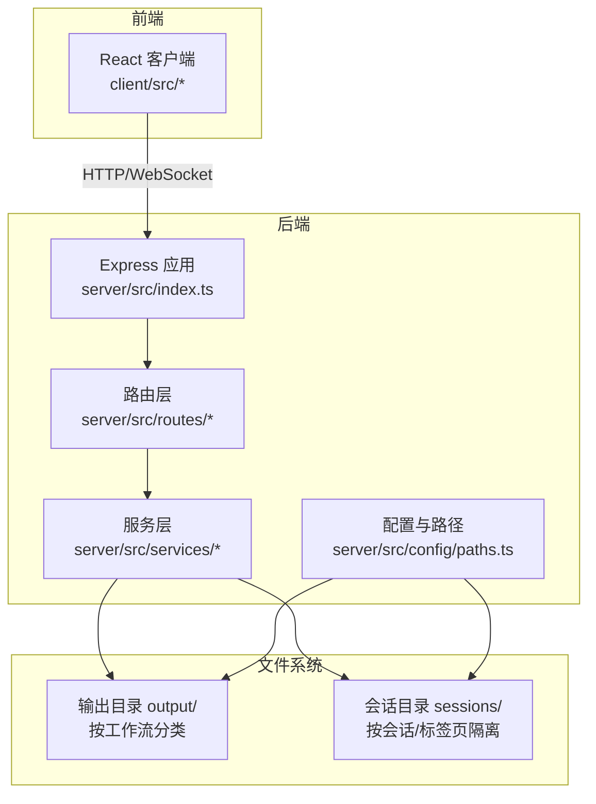
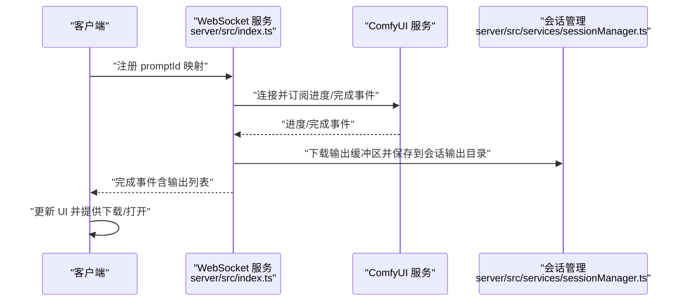
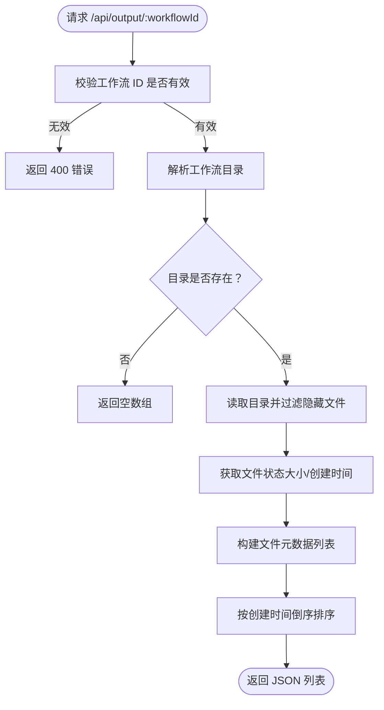
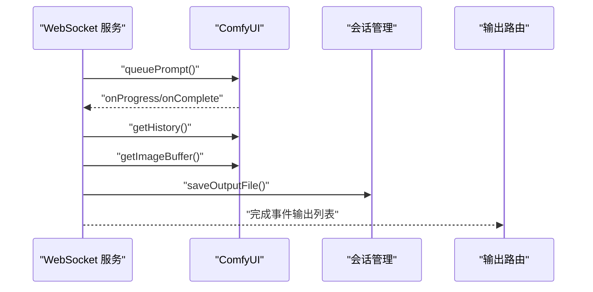
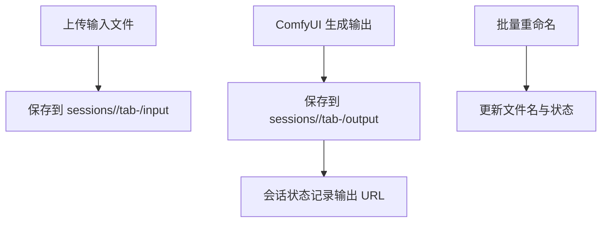
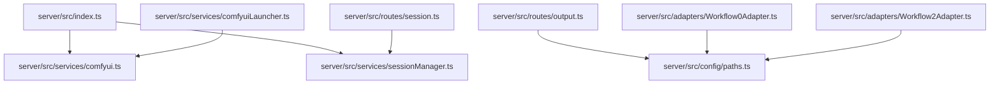

# 输出文件处理

<cite>
**本文引用的文件**
- [server/src/routes/output.ts](file://server/src/routes/output.ts)
- [server/src/services/comfyui.ts](file://server/src/services/comfyui.ts)
- [server/src/config/paths.ts](file://server/src/config/paths.ts)
- [server/src/services/sessionManager.ts](file://server/src/services/sessionManager.ts)
- [server/src/types/index.ts](file://server/src/types/index.ts)
- [server/src/index.ts](file://server/src/index.ts)
- [server/src/adapters/Workflow0Adapter.ts](file://server/src/adapters/Workflow0Adapter.ts)
- [server/src/adapters/Workflow2Adapter.ts](file://server/src/adapters/Workflow2Adapter.ts)
- [server/src/adapters/Workflow10Adapter.ts](file://server/src/adapters/Workflow10Adapter.ts)
- [server/src/services/comfyuiLauncher.ts](file://server/src/services/comfyuiLauncher.ts)
- [server/src/routes/session.ts](file://server/src/routes/session.ts)
- [client/src/hooks/useWorkflowStore.ts](file://client/src/hooks/useWorkflowStore.ts)
- [client/src/services/api.ts](file://client/src/services/api.ts)
- [README.md](file://README.md)
</cite>

## 目录
1. [简介](#简介)
2. [项目结构](#项目结构)
3. [核心组件](#核心组件)
4. [架构总览](#架构总览)
5. [详细组件分析](#详细组件分析)
6. [依赖关系分析](#依赖关系分析)
7. [性能考量](#性能考量)
8. [故障排查指南](#故障排查指南)
9. [结论](#结论)
10. [附录](#附录)

## 简介
本技术文档围绕“输出文件处理系统”展开，聚焦于以下目标：
- 输出文件生成流程：从 ComfyUI 生成的中间文件到最终输出文件的落地与索引。
- 文件命名与目录组织：按工作流类型进行目录分类，以及会话级文件隔离策略。
- 文件完整性验证：文件大小、格式与损坏检测建议。
- 下载、删除与批量操作接口：REST API 与 WebSocket 协同机制。
- 元数据提取与索引：结合会话状态与输出历史记录。
- 访问权限控制：静态资源与动态路由的访问边界。

## 项目结构
后端采用 Express + WebSocket 架构，前端为 React 应用。输出文件目录位于项目根的 output 子目录，按工作流类型划分；同时存在 sessions 目录用于会话级输入/输出与中间状态持久化。

图表来源
- [server/src/index.ts:118-146](file://server/src/index.ts#L118-L146)
- [server/src/config/paths.ts:141-155](file://server/src/config/paths.ts#L141-L155)

章节来源
- [README.md:41-62](file://README.md#L41-L62)
- [server/src/index.ts:82-100](file://server/src/index.ts#L82-L100)
- [server/src/config/paths.ts:141-155](file://server/src/config/paths.ts#L141-L155)

## 核心组件
- 输出路由与文件服务：提供列出、下载与打开文件的接口，支持按工作流类型访问。
- ComfyUI 通信：负责上传输入、排队工作流、接收进度与完成事件、拉取输出缓冲区并保存至会话输出目录。
- 路径与配置：集中管理输出目录与会话目录，支持运行时覆盖与校验。
- 会话管理：保存输入、输出与中间状态，提供批量重命名等操作。
- 类型定义：统一输出文件结构、历史记录与进度事件的契约。

章节来源
- [server/src/routes/output.ts:27-78](file://server/src/routes/output.ts#L27-L78)
- [server/src/services/comfyui.ts:168-196](file://server/src/services/comfyui.ts#L168-L196)
- [server/src/services/comfyui.ts:198-207](file://server/src/services/comfyui.ts#L198-L207)
- [server/src/services/comfyui.ts:209-219](file://server/src/services/comfyui.ts#L209-L219)
- [server/src/config/paths.ts:141-155](file://server/src/config/paths.ts#L141-L155)
- [server/src/services/sessionManager.ts:37-48](file://server/src/services/sessionManager.ts#L37-L48)
- [server/src/types/index.ts:32-51](file://server/src/types/index.ts#L32-L51)

## 架构总览
输出文件处理的关键流程如下：
- 客户端通过 WebSocket 注册 promptId 与其所属工作流/会话映射。
- ComfyUI 完成后，后端拉取历史与输出缓冲区，保存到会话输出目录，并向客户端发送完成事件。
- 前端通过输出路由下载或打开文件；静态路由直接提供 output 目录访问。

图表来源
- [server/src/index.ts:470-488](file://server/src/index.ts#L470-L488)
- [server/src/index.ts:373-429](file://server/src/index.ts#L373-L429)
- [server/src/services/comfyui.ts:198-207](file://server/src/services/comfyui.ts#L198-L207)
- [server/src/services/comfyui.ts:209-219](file://server/src/services/comfyui.ts#L209-L219)
- [server/src/services/sessionManager.ts:37-48](file://server/src/services/sessionManager.ts#L37-L48)

## 详细组件分析

### 输出路由与文件服务
- 列出工作流输出：根据工作流 ID 映射到对应目录，读取文件列表并返回基本信息（名称、大小、创建时间、下载 URL）。
- 下载单个文件：校验路径存在性后直接发送文件。
- 打开文件：解析传入 URL，定位到 output 或 session-files 目录，调用系统默认应用打开。

图表来源
- [server/src/routes/output.ts:27-58](file://server/src/routes/output.ts#L27-L58)

章节来源
- [server/src/routes/output.ts:27-78](file://server/src/routes/output.ts#L27-L78)

### ComfyUI 通信与输出下载
- 队列与历史：提交工作流、获取历史、拉取输出缓冲区。
- WebSocket 进度：按节点权重与步骤计算全局进度，完成时拉取历史并下载输出。
- 输出保存：将 ComfyUI 输出缓冲区保存到会话输出目录，返回可访问 URL。

图表来源
- [server/src/services/comfyui.ts:168-196](file://server/src/services/comfyui.ts#L168-L196)
- [server/src/services/comfyui.ts:198-207](file://server/src/services/comfyui.ts#L198-L207)
- [server/src/services/comfyui.ts:209-219](file://server/src/services/comfyui.ts#L209-L219)
- [server/src/index.ts:373-429](file://server/src/index.ts#L373-L429)
- [server/src/services/sessionManager.ts:37-48](file://server/src/services/sessionManager.ts#L37-L48)

章节来源
- [server/src/services/comfyui.ts:168-219](file://server/src/services/comfyui.ts#L168-L219)
- [server/src/index.ts:373-429](file://server/src/index.ts#L373-L429)

### 路径与目录组织
- 输出目录：固定位于项目根的 output 子目录，按工作流类型建立子目录。
- 会话目录：位于 sessions 子目录，按会话 ID 与标签页划分 input/masks/output。
- 配置覆盖：支持通过配置文件覆盖 sessions 根目录，运行时生效。

```mermaid
graph LR
Root["项目根目录"] --> Out["output/<工作流类型>"]
Root --> Sess["sessions/<sessionId>/tab-<n>/<input|masks|output>"]
Cfg["config.json 覆盖"] --> Sess
```

图表来源
- [server/src/config/paths.ts:141-155](file://server/src/config/paths.ts#L141-L155)
- [server/src/config/paths.ts:74-100](file://server/src/config/paths.ts#L74-L100)
- [server/src/index.ts:82-100](file://server/src/index.ts#L82-L100)

章节来源
- [server/src/config/paths.ts:141-155](file://server/src/config/paths.ts#L141-L155)
- [server/src/index.ts:82-100](file://server/src/index.ts#L82-L100)

### 会话管理与文件命名
- 输入/输出保存：将上传的输入与 ComfyUI 输出保存到会话目录，返回 API 可访问 URL。
- 文件命名：输出文件沿用 ComfyUI 输出文件名；支持批量重命名以规范化标签与序号。
- 会话状态：持久化会话元数据与任务状态，便于恢复与索引。

图表来源
- [server/src/services/sessionManager.ts:22-48](file://server/src/services/sessionManager.ts#L22-L48)
- [server/src/routes/session.ts:115-160](file://server/src/routes/session.ts#L115-L160)

章节来源
- [server/src/services/sessionManager.ts:22-48](file://server/src/services/sessionManager.ts#L22-L48)
- [server/src/routes/session.ts:115-160](file://server/src/routes/session.ts#L115-L160)

### 工作流适配器与模板
- 适配器：每个工作流加载对应的 JSON 模板，注入输入图像名、提示词与随机种子等参数。
- 模板位置：位于 ComfyUI_API 目录，按工作流 ID 命名。

章节来源
- [server/src/adapters/Workflow0Adapter.ts:16-33](file://server/src/adapters/Workflow0Adapter.ts#L16-L33)
- [server/src/adapters/Workflow2Adapter.ts:16-26](file://server/src/adapters/Workflow2Adapter.ts#L16-L26)
- [server/src/adapters/Workflow10Adapter.ts:11-14](file://server/src/adapters/Workflow10Adapter.ts#L11-L14)

### 文件完整性验证机制
- 文件大小：输出路由返回文件大小，可用于前端显示与对比。
- 格式验证：当前实现未内置格式校验逻辑，建议在下载后进行 MIME/魔数校验。
- 损坏检测：当前实现未内置哈希校验，建议在保存后生成摘要并在下载时比对。

章节来源
- [server/src/routes/output.ts:44-55](file://server/src/routes/output.ts#L44-L55)

### 文件下载、删除与批量操作 API
- 下载：通过输出路由按工作流 ID 与文件名下载；也可通过会话文件路由访问会话输出。
- 删除：当前未提供删除输出文件的 API；可通过系统文件管理器或扩展后端路由实现。
- 批量操作：提供批量重命名接口，预检所有冲突后一次性提交，保证原子性。

章节来源
- [server/src/routes/output.ts:60-78](file://server/src/routes/output.ts#L60-L78)
- [server/src/routes/session.ts:115-160](file://server/src/routes/session.ts#L115-L160)

### 元数据提取与索引
- 输出历史：完成事件携带输出文件列表，后端保存到会话状态，前端据此索引与展示。
- 任务状态：包含进度、阶段、步骤索引与输出 URL，便于 UI 交互与回放。

章节来源
- [server/src/types/index.ts:18-31](file://server/src/types/index.ts#L18-L31)
- [server/src/types/index.ts:42-51](file://server/src/types/index.ts#L42-L51)
- [client/src/hooks/useWorkflowStore.ts:649-680](file://client/src/hooks/useWorkflowStore.ts#L649-L680)

### 访问权限控制
- 静态资源：输出目录通过静态中间件暴露，无额外鉴权。
- 动态路由：输出路由与会话文件路由均进行存在性校验，避免越权访问。
- 建议：生产环境可增加认证/授权中间件与最小权限原则。

章节来源
- [server/src/index.ts:134-145](file://server/src/index.ts#L134-L145)
- [server/src/routes/output.ts:70-78](file://server/src/routes/output.ts#L70-L78)
- [server/src/routes/session.ts:21-52](file://server/src/routes/session.ts#L21-L52)

## 依赖关系分析
- WebSocket 服务依赖 ComfyUI 服务与会话管理服务。
- 输出路由依赖路径配置与文件系统。
- 会话路由依赖会话管理服务与 multer。
- 工作流适配器依赖模板文件与路径配置。

图表来源
- [server/src/index.ts:15-18](file://server/src/index.ts#L15-L18)
- [server/src/routes/output.ts:8-9](file://server/src/routes/output.ts#L8-L9)
- [server/src/routes/session.ts:16](file://server/src/routes/session.ts#L16)
- [server/src/adapters/Workflow0Adapter.ts:7](file://server/src/adapters/Workflow0Adapter.ts#L7)
- [server/src/adapters/Workflow2Adapter.ts:7](file://server/src/adapters/Workflow2Adapter.ts#L7)
- [server/src/services/comfyuiLauncher.ts:16-18](file://server/src/services/comfyuiLauncher.ts#L16-L18)

章节来源
- [server/src/index.ts:15-18](file://server/src/index.ts#L15-L18)
- [server/src/routes/output.ts:8-9](file://server/src/routes/output.ts#L8-L9)
- [server/src/routes/session.ts:16](file://server/src/routes/session.ts#L16)
- [server/src/adapters/Workflow0Adapter.ts:7](file://server/src/adapters/Workflow0Adapter.ts#L7)
- [server/src/adapters/Workflow2Adapter.ts:7](file://server/src/adapters/Workflow2Adapter.ts#L7)
- [server/src/services/comfyuiLauncher.ts:16-18](file://server/src/services/comfyuiLauncher.ts#L16-L18)

## 性能考量
- 进度计算：基于节点权重与步骤的全局进度，避免 UI 卡顿与抖动。
- 历史拉取重试：在完成事件后延迟重试获取历史，确保输出已落盘。
- 多轮节点：对 tiled 采样器与多轮节点采用 tick 计数，提升进度稳定性。
- 大文件传输：前端使用 Blob/ArrayBuffer，后端使用流式静态服务，注意内存占用。

章节来源
- [server/src/index.ts:240-271](file://server/src/index.ts#L240-L271)
- [server/src/index.ts:350-368](file://server/src/index.ts#L350-L368)

## 故障排查指南
- ComfyUI 未运行：后端提供状态查询与自动启动功能，若失败需手动启动。
- 输出为空：完成事件可能早于历史落盘，后端已内置重试；若仍为空，检查 ComfyUI 输出目录与权限。
- 文件打开失败：确认 URL 解码正确与文件存在性。
- 会话路径异常：检查配置文件与路径校验结果。

章节来源
- [server/src/index.ts:148-155](file://server/src/index.ts#L148-L155)
- [server/src/services/comfyuiLauncher.ts:24-53](file://server/src/services/comfyuiLauncher.ts#L24-L53)
- [server/src/index.ts:350-368](file://server/src/index.ts#L350-L368)
- [server/src/routes/output.ts:80-136](file://server/src/routes/output.ts#L80-L136)
- [server/src/config/paths.ts:106-137](file://server/src/config/paths.ts#L106-L137)

## 结论
本系统通过 WebSocket 实时同步 ComfyUI 进度，完成后自动下载并保存输出到会话目录，配合输出路由提供便捷的下载与打开能力。路径与会话管理确保了文件组织与状态持久化。建议在生产环境中补充格式与完整性校验、删除接口与鉴权控制，以满足更严格的合规与安全要求。

## 附录
- 工作流类型与输出目录映射：见输出路由中的常量定义。
- 会话文件路由：/api/session-files/{sessionId}/tab-{tabId}/{input|output|masks}/{filename}。
- 输出静态路由：/output/{工作流目录}/{文件名}。

章节来源
- [server/src/routes/output.ts:13-25](file://server/src/routes/output.ts#L13-L25)
- [server/src/routes/output.ts:70-78](file://server/src/routes/output.ts#L70-L78)
- [server/src/services/sessionManager.ts:37-48](file://server/src/services/sessionManager.ts#L37-L48)