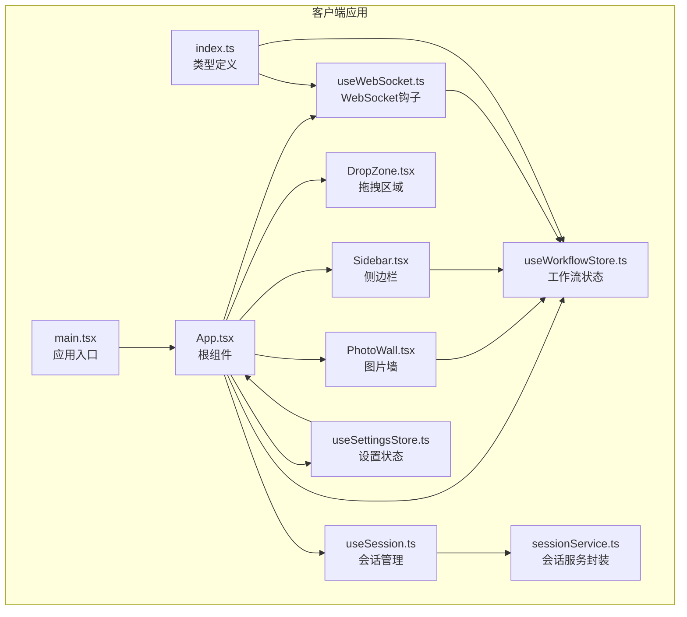
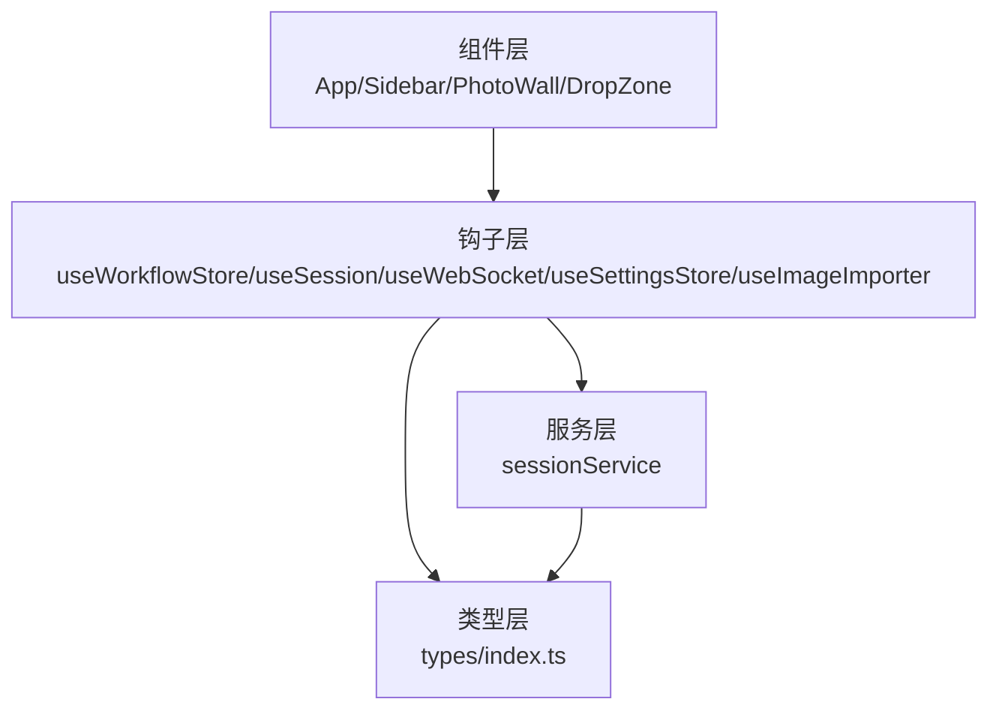
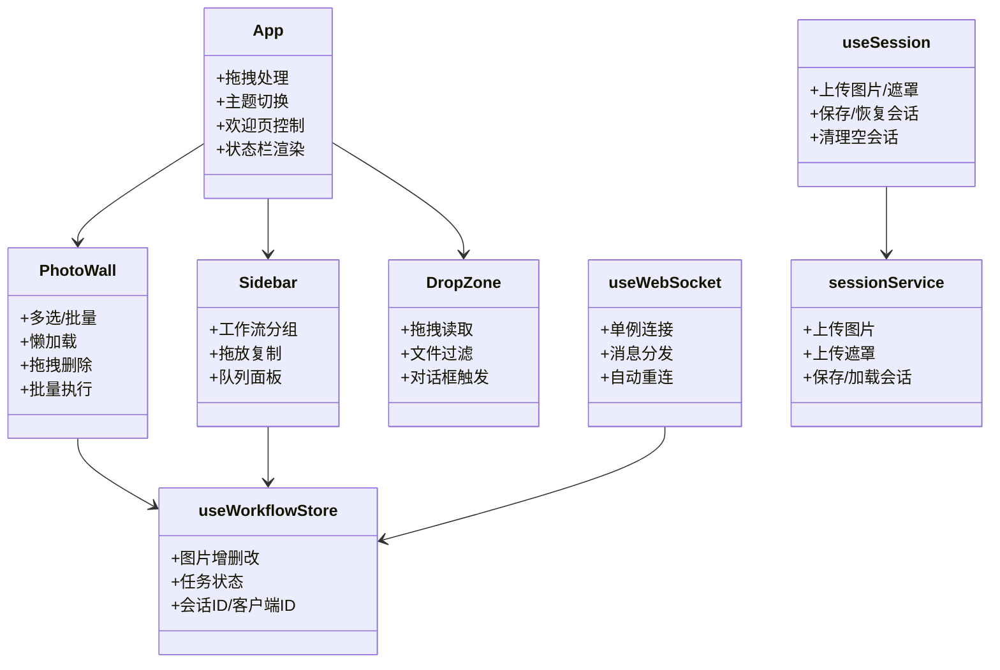
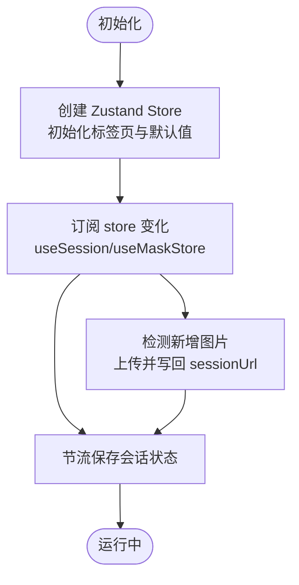
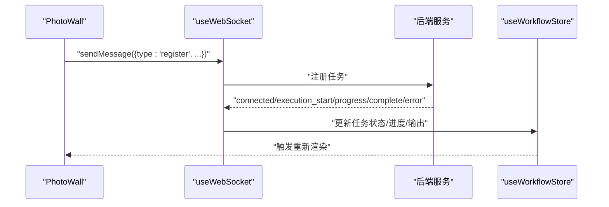
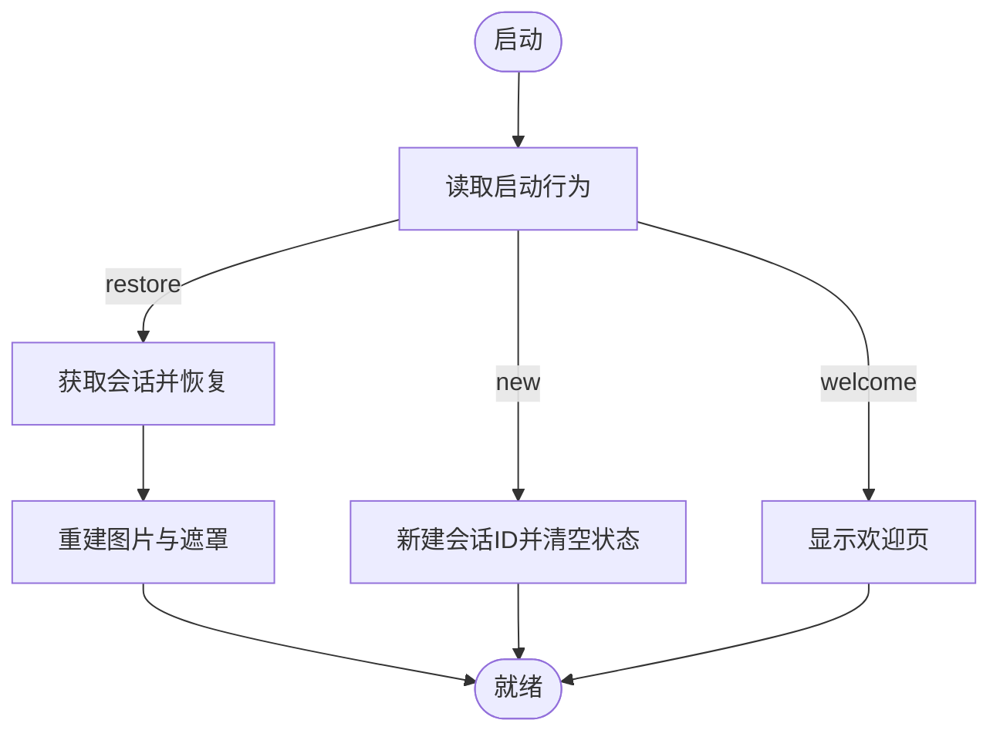
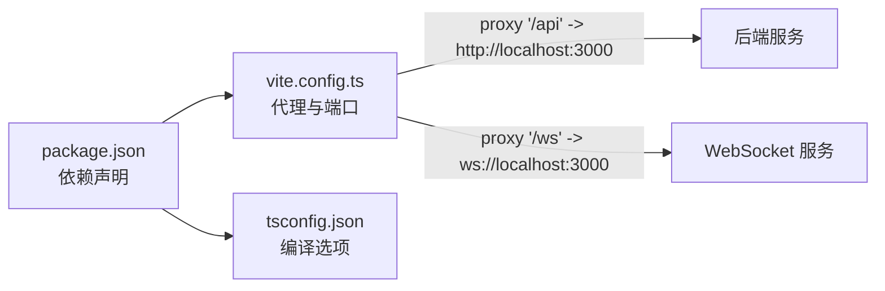

# 前端架构

<cite>
**本文引用的文件**
- [main.tsx](file://client/src/main.tsx)
- [App.tsx](file://client/src/components/App.tsx)
- [Sidebar.tsx](file://client/src/components/Sidebar.tsx)
- [PhotoWall.tsx](file://client/src/components/PhotoWall.tsx)
- [DropZone.tsx](file://client/src/components/DropZone.tsx)
- [useWorkflowStore.ts](file://client/src/hooks/useWorkflowStore.ts)
- [useSession.ts](file://client/src/hooks/useSession.ts)
- [useWebSocket.ts](file://client/src/hooks/useWebSocket.ts)
- [useSettingsStore.ts](file://client/src/hooks/useSettingsStore.ts)
- [sessionService.ts](file://client/src/services/sessionService.ts)
- [index.ts](file://client/src/types/index.ts)
- [vite.config.ts](file://client/vite.config.ts)
- [package.json](file://client/package.json)
- [tsconfig.json](file://client/tsconfig.json)
</cite>

## 目录
1. [简介](#简介)
2. [项目结构](#项目结构)
3. [核心组件](#核心组件)
4. [架构总览](#架构总览)
5. [详细组件分析](#详细组件分析)
6. [依赖分析](#依赖分析)
7. [性能考虑](#性能考虑)
8. [故障排查指南](#故障排查指南)
9. [结论](#结论)
10. [附录](#附录)

## 简介
本文件系统性梳理 CorineKit Pix2Real 前端架构，重点覆盖 React 组件体系、Zustand 状态管理、WebSocket 连接与消息处理、会话持久化与恢复、路由与页面导航、组件生命周期与性能优化策略，并通过多种可视化图表展示组件关系与数据流向，帮助开发者快速理解并扩展前端能力。

## 项目结构
前端采用 Vite + React 19 + TypeScript 构建，使用 Zustand 实现轻量级状态管理，通过 WebSocket 与后端进行实时通信，结合会话服务实现跨页面/重启的持久化与恢复。

**图表来源**
- [main.tsx:1-11](file://client/src/main.tsx#L1-L11)
- [App.tsx:1-335](file://client/src/components/App.tsx#L1-L335)
- [Sidebar.tsx:1-425](file://client/src/components/Sidebar.tsx#L1-L425)
- [PhotoWall.tsx:1-578](file://client/src/components/PhotoWall.tsx#L1-L578)
- [DropZone.tsx:1-171](file://client/src/components/DropZone.tsx#L1-L171)
- [useWorkflowStore.ts:1-645](file://client/src/hooks/useWorkflowStore.ts#L1-L645)
- [useSession.ts:1-422](file://client/src/hooks/useSession.ts#L1-L422)
- [useWebSocket.ts:1-99](file://client/src/hooks/useWebSocket.ts#L1-L99)
- [useSettingsStore.ts:1-31](file://client/src/hooks/useSettingsStore.ts#L1-L31)
- [sessionService.ts:1-134](file://client/src/services/sessionService.ts#L1-L134)
- [index.ts:1-58](file://client/src/types/index.ts#L1-L58)

**章节来源**
- [main.tsx:1-11](file://client/src/main.tsx#L1-L11)
- [vite.config.ts:1-20](file://client/vite.config.ts#L1-L20)
- [package.json:1-25](file://client/package.json#L1-L25)
- [tsconfig.json:1-22](file://client/tsconfig.json#L1-L22)

## 核心组件
- 应用入口与根组件
  - 入口文件负责挂载 React 根节点与全局样式。
  - 根组件负责组织头部、侧边栏、主内容区、状态栏、模态组件等，并统一处理拖拽导入、主题切换、欢迎页等逻辑。
- 侧边栏与工作流导航
  - 提供工作流分组与图标，支持拖放复制图片到目标工作流标签页，显示队列数量与浮动指示器。
- 图片墙与卡片
  - 支持多选、批量操作、懒加载渲染、拖拽删除、蒙版与输出管理。
- 拖拽导入与对话框
  - 处理文件夹与文件的拖拽读取，冲突检测与覆盖/保留策略。
- 状态管理与会话
  - 使用 Zustand 管理工作流、任务、提示词、选中项、会话 ID 等；会话服务负责上传/下载图片与遮罩、保存/恢复会话。
- WebSocket 钩子
  - 单例连接管理，自动重连，消息分发到 Zustand store。
- 设置与主题
  - 本地存储设置项，主题切换持久化。

**章节来源**
- [App.tsx:54-335](file://client/src/components/App.tsx#L54-L335)
- [Sidebar.tsx:30-425](file://client/src/components/Sidebar.tsx#L30-L425)
- [PhotoWall.tsx:103-578](file://client/src/components/PhotoWall.tsx#L103-L578)
- [DropZone.tsx:39-171](file://client/src/components/DropZone.tsx#L39-L171)
- [useWorkflowStore.ts:96-645](file://client/src/hooks/useWorkflowStore.ts#L96-L645)
- [useSession.ts:116-422](file://client/src/hooks/useSession.ts#L116-L422)
- [useWebSocket.ts:75-99](file://client/src/hooks/useWebSocket.ts#L75-L99)
- [useSettingsStore.ts:16-31](file://client/src/hooks/useSettingsStore.ts#L16-L31)

## 架构总览
前端采用“组件 + 钩子 + 服务”的分层设计：
- 组件层：负责 UI 与用户交互（如 App、Sidebar、PhotoWall、DropZone）。
- 钩子层：封装副作用与状态订阅（如 useWorkflowStore、useSession、useWebSocket、useSettingsStore、useImageImporter）。
- 服务层：封装 API 与会话存取（如 sessionService）。
- 类型层：统一前后端数据契约（如 types/index.ts）。

**图表来源**
- [App.tsx:1-335](file://client/src/components/App.tsx#L1-L335)
- [useWorkflowStore.ts:1-645](file://client/src/hooks/useWorkflowStore.ts#L1-L645)
- [useSession.ts:1-422](file://client/src/hooks/useSession.ts#L1-L422)
- [useWebSocket.ts:1-99](file://client/src/hooks/useWebSocket.ts#L1-L99)
- [useSettingsStore.ts:1-31](file://client/src/hooks/useSettingsStore.ts#L1-L31)
- [sessionService.ts:1-134](file://client/src/services/sessionService.ts#L1-L134)
- [index.ts:1-58](file://client/src/types/index.ts#L1-L58)

## 详细组件分析

### 组件层次与通信机制
- 层次关系
  - App 作为根容器，协调 Sidebar、PhotoWall、DropZone、状态栏与模态组件。
  - PhotoWall 内部组合 ImageCard 并通过懒加载提升长列表性能。
  - Sidebar 通过拖放事件与 PhotoWall 交互，实现跨标签页复制图片。
- 通信机制
  - 组件间通过 Zustand 订阅与回调函数传递状态与动作。
  - WebSocket 钩子向后端注册任务，接收进度/完成/错误消息并更新 store。
  - 会话钩子订阅 store 变化，自动上传图片与遮罩，保存会话状态。

**图表来源**
- [App.tsx:54-335](file://client/src/components/App.tsx#L54-L335)
- [Sidebar.tsx:30-425](file://client/src/components/Sidebar.tsx#L30-L425)
- [PhotoWall.tsx:103-578](file://client/src/components/PhotoWall.tsx#L103-L578)
- [DropZone.tsx:39-171](file://client/src/components/DropZone.tsx#L39-L171)
- [useWorkflowStore.ts:96-645](file://client/src/hooks/useWorkflowStore.ts#L96-L645)
- [useSession.ts:116-422](file://client/src/hooks/useSession.ts#L116-L422)
- [useWebSocket.ts:75-99](file://client/src/hooks/useWebSocket.ts#L75-L99)
- [sessionService.ts:69-134](file://client/src/services/sessionService.ts#L69-L134)

**章节来源**
- [App.tsx:54-335](file://client/src/components/App.tsx#L54-L335)
- [Sidebar.tsx:30-425](file://client/src/components/Sidebar.tsx#L30-L425)
- [PhotoWall.tsx:103-578](file://client/src/components/PhotoWall.tsx#L103-L578)
- [DropZone.tsx:39-171](file://client/src/components/DropZone.tsx#L39-L171)

### Zustand 状态管理实现
- 工作流状态（useWorkflowStore）
  - 管理 10 个标签页的数据结构，包含图片、提示词、任务、输出索引、回姿开关、文本生成配置、ZIT 配置、换脸区域等。
  - 提供图片增删、任务生命周期（入队/开始/进度/完成/失败）、批量操作、会话恢复等方法。
  - 通过计算属性判断是否需要提示词、是否正在处理。
- 会话状态（useSession）
  - 维护 sessionId、最后保存时间、欢迎页显示标志。
  - 订阅工作流 store 与遮罩 store 的变化，自动上传新图片与遮罩，序列化并保存会话状态。
  - 支持启动行为（恢复/新建/欢迎页），空会话清理，beforeunload 保底保存。
- 设置状态（useSettingsStore）
  - 维护逆向提示词模型与启动行为，支持打开/关闭设置面板。
- 数据结构与复杂度
  - 每个标签页的图片与任务以对象映射存储，查找/更新平均 O(1)。
  - 任务进度/完成广播需遍历所有标签页的任务集合，最坏 O(T)（T 为标签页数）。

**图表来源**
- [useWorkflowStore.ts:96-645](file://client/src/hooks/useWorkflowStore.ts#L96-L645)
- [useSession.ts:184-233](file://client/src/hooks/useSession.ts#L184-L233)
- [useSession.ts:316-384](file://client/src/hooks/useSession.ts#L316-L384)

**章节来源**
- [useWorkflowStore.ts:96-645](file://client/src/hooks/useWorkflowStore.ts#L96-L645)
- [useSession.ts:116-422](file://client/src/hooks/useSession.ts#L116-L422)
- [useSettingsStore.ts:16-31](file://client/src/hooks/useSettingsStore.ts#L16-L31)

### WebSocket 连接与消息处理
- 单例连接
  - 通过全局变量维护 WebSocket 实例，首次连接时根据协议自动选择 ws/wss。
  - 连接计数用于控制自动重连策略。
- 消息分发
  - onmessage 解析后按类型分派至 store：connected（记录 clientId）、execution_start（标记任务开始）、progress（更新进度）、complete（合并输出）、error（标记失败）。
- 发送消息
  - 提供 sendMessage 方法，仅在 OPEN 状态发送。

**图表来源**
- [PhotoWall.tsx:228-239](file://client/src/components/PhotoWall.tsx#L228-L239)
- [useWebSocket.ts:26-51](file://client/src/hooks/useWebSocket.ts#L26-L51)
- [useWorkflowStore.ts:377-500](file://client/src/hooks/useWorkflowStore.ts#L377-L500)

**章节来源**
- [useWebSocket.ts:75-99](file://client/src/hooks/useWebSocket.ts#L75-L99)
- [PhotoWall.tsx:228-239](file://client/src/components/PhotoWall.tsx#L228-L239)
- [useWorkflowStore.ts:377-500](file://client/src/hooks/useWorkflowStore.ts#L377-L500)

### 会话持久化与恢复
- 保存策略
  - 序列化 store 中的可持久化字段（排除 File 对象），定时节流保存。
  - 新增图片后异步上传并回填 sessionUrl，随后触发保存。
  - 遮罩变更时转换为灰度 PNG 并上传。
- 加载策略
  - 启动时根据设置决定“恢复/新建/欢迎页”，若恢复则拉取会话并重建图片与遮罩。
  - 空会话在返回欢迎页时清理服务器记录。
- beforeunload 保底
  - 在卸载前通过 beacon 发送最终状态，避免长时间无响应导致丢失。

**图表来源**
- [useSession.ts:290-387](file://client/src/hooks/useSession.ts#L290-L387)
- [sessionService.ts:115-134](file://client/src/services/sessionService.ts#L115-L134)

**章节来源**
- [useSession.ts:116-422](file://client/src/hooks/useSession.ts#L116-L422)
- [sessionService.ts:69-134](file://client/src/services/sessionService.ts#L69-L134)

### 组件生命周期与性能优化
- 懒加载卡片
  - 使用 IntersectionObserver 与占位符减少首屏渲染压力，滚动时再渲染真实内容。
  - 首次可见后修正滚动偏移，避免内容高度变化导致的视口跳变。
- 列布局与滚动锚定
  - 使用 CSS 多列布局承载图片卡片，启用 overflow-anchor 保持滚动位置稳定。
- 事件与拖放
  - 侧边栏直接绑定原生 dragover 事件以确保 preventDefault 生效。
  - 删除区使用计数器避免误判 hover 状态。
- 文件导入
  - 支持文件夹递归读取，过滤非图片/视频类型，冲突时弹窗选择覆盖或保留。

**章节来源**
- [PhotoWall.tsx:18-97](file://client/src/components/PhotoWall.tsx#L18-L97)
- [PhotoWall.tsx:458-509](file://client/src/components/PhotoWall.tsx#L458-L509)
- [Sidebar.tsx:50-65](file://client/src/components/Sidebar.tsx#L50-L65)
- [DropZone.tsx:14-37](file://client/src/components/DropZone.tsx#L14-L37)

### 前端路由与页面导航
- 当前实现
  - 未使用集中式路由库，页面切换主要通过状态控制（如欢迎页、侧边栏激活标签、队列面板弹出）。
  - 主体区域根据 activeTab 渲染不同组件（如 PhotoWall、Text2ImgSidebar、ZITSidebar、Workflow0/2 设置面板）。
- 建议
  - 若未来扩展页面（如历史会话、设置页），可引入轻量路由库以获得更清晰的 URL 语义与浏览器前进后退体验。

**章节来源**
- [App.tsx:208-279](file://client/src/components/App.tsx#L208-L279)
- [Sidebar.tsx:268-348](file://client/src/components/Sidebar.tsx#L268-L348)

## 依赖分析
- 外部依赖
  - React 19、Zustand 5、lucide-react。
- 开发依赖
  - Vite、TypeScript、@vitejs/plugin-react。
- 代理与端口
  - Vite 代理 /api 到后端 3000 端口，/ws 到同端口的 WebSocket。

**图表来源**
- [package.json:11-25](file://client/package.json#L11-L25)
- [vite.config.ts:6-18](file://client/vite.config.ts#L6-L18)
- [tsconfig.json:2-19](file://client/tsconfig.json#L2-L19)

**章节来源**
- [package.json:1-25](file://client/package.json#L1-L25)
- [vite.config.ts:1-20](file://client/vite.config.ts#L1-L20)
- [tsconfig.json:1-22](file://client/tsconfig.json#L1-L22)

## 性能考虑
- 渲染层面
  - 大列表懒加载与占位符，减少首屏与滚动抖动。
  - 使用 memo 包装 LazyCard，避免不必要的重渲染。
- 状态层面
  - 将 File 对象排除在序列化之外，降低网络传输与存储体积。
  - 任务状态跨标签页传播，避免重复渲染。
- 网络层面
  - WebSocket 单例连接与自动重连，减少频繁握手成本。
  - beforeunload beacon 保底，避免长时间无响应导致的状态丢失。

[本节为通用指导，无需特定文件引用]

## 故障排查指南
- WebSocket 无法连接
  - 检查代理配置与后端服务是否启动；查看浏览器控制台日志与重连间隔。
- 任务进度不更新
  - 确认后端已正确推送 progress/complete/error 消息；检查 store 中对应 promptId 是否存在。
- 会话恢复失败
  - 查看 getSession 返回状态；确认图片与遮罩路径是否存在；检查 beforeunload 保底保存是否触发。
- 图片导入冲突
  - 使用覆盖/保留策略；确认重复文件名集合与对话框状态。

**章节来源**
- [useWebSocket.ts:53-73](file://client/src/hooks/useWebSocket.ts#L53-L73)
- [useSession.ts:305-384](file://client/src/hooks/useSession.ts#L305-L384)
- [DropZone.tsx:15-47](file://client/src/components/DropZone.tsx#L15-L47)

## 结论
该前端架构以 Zustand 为核心，结合自研钩子与服务层，实现了高效的工作流状态管理、实时的 WebSocket 通信、完善的会话持久化与恢复。组件层通过懒加载与事件优化保证了良好的用户体验。建议后续引入轻量路由以增强页面语义与导航体验，并持续完善错误监控与性能观测。

[本节为总结性内容，无需特定文件引用]

## 附录
- 关键类型定义
  - 图像项、任务状态、WebSocket 消息类型等均在类型文件中统一定义，便于前后端契约一致。

**章节来源**
- [index.ts:1-58](file://client/src/types/index.ts#L1-L58)