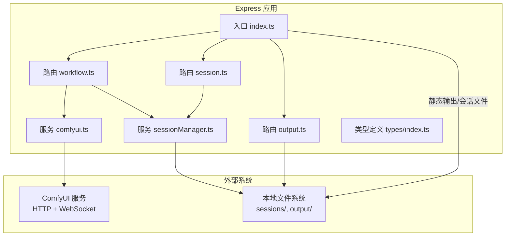
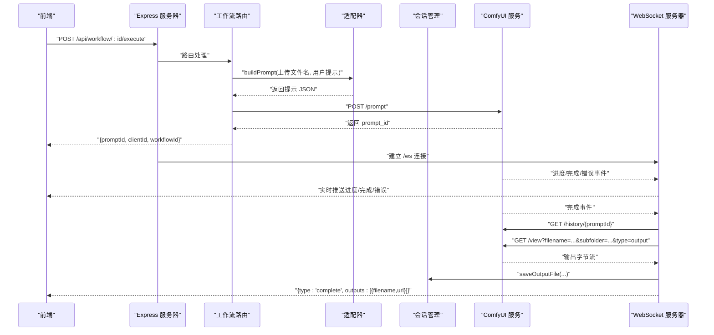
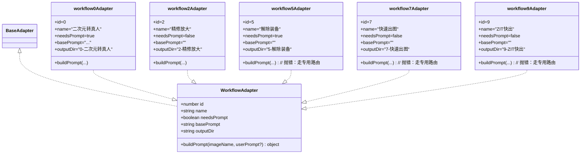
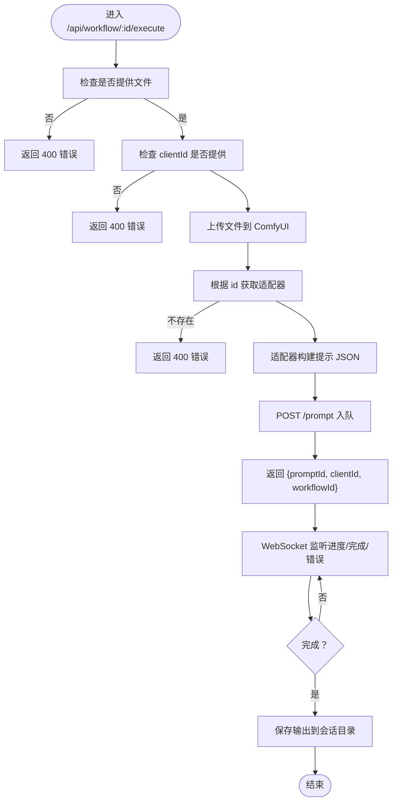
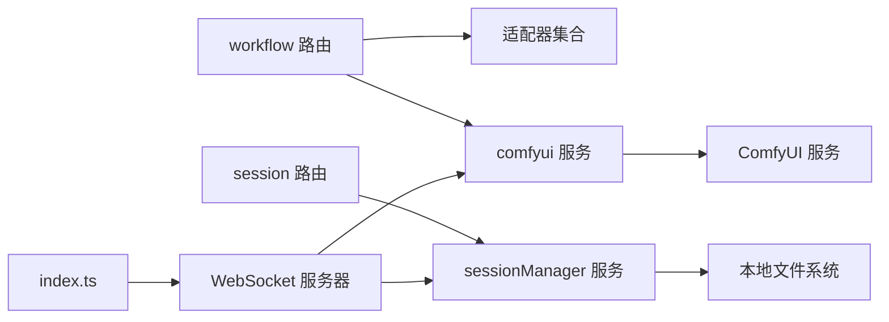

# 后端架构

<cite>
**本文引用的文件**
- [server/src/index.ts](file://server/src/index.ts)
- [server/src/routes/workflow.ts](file://server/src/routes/workflow.ts)
- [server/src/routes/output.ts](file://server/src/routes/output.ts)
- [server/src/routes/session.ts](file://server/src/routes/session.ts)
- [server/src/services/comfyui.ts](file://server/src/services/comfyui.ts)
- [server/src/services/sessionManager.ts](file://server/src/services/sessionManager.ts)
- [server/src/adapters/BaseAdapter.ts](file://server/src/adapters/BaseAdapter.ts)
- [server/src/adapters/index.ts](file://server/src/adapters/index.ts)
- [server/src/adapters/Workflow0Adapter.ts](file://server/src/adapters/Workflow0Adapter.ts)
- [server/src/adapters/Workflow2Adapter.ts](file://server/src/adapters/Workflow2Adapter.ts)
- [server/src/adapters/Workflow5Adapter.ts](file://server/src/adapters/Workflow5Adapter.ts)
- [server/src/adapters/Workflow7Adapter.ts](file://server/src/adapters/Workflow7Adapter.ts)
- [server/src/adapters/Workflow9Adapter.ts](file://server/src/adapters/Workflow9Adapter.ts)
- [server/src/types/index.ts](file://server/src/types/index.ts)
- [package.json](file://package.json)
</cite>

## 目录
1. [简介](#简介)
2. [项目结构](#项目结构)
3. [核心组件](#核心组件)
4. [架构总览](#架构总览)
5. [详细组件分析](#详细组件分析)
6. [依赖分析](#依赖分析)
7. [性能考虑](#性能考虑)
8. [故障排查指南](#故障排查指南)
9. [结论](#结论)
10. [附录](#附录)

## 简介
本文件面向 CorineKit Pix2Real 的后端（Express 服务），系统性梳理其架构设计与实现要点，重点覆盖以下方面：
- Express 服务器：路由组织、中间件配置、静态资源与 WebSocket 集成、输出目录管理与错误处理策略
- 适配器模式：WorkflowAdapter 接口与具体适配器实现，如何通过模板 JSON 与节点参数构建 ComfyUI 提示
- ComfyUI 集成：HTTP API 封装、WebSocket 连接管理、队列与历史查询、系统状态与模型列表获取、文件上传与下载
- 组件关系与请求处理流程：端到端从客户端到 ComfyUI 再回到客户端的完整链路

## 项目结构
后端位于 server/src 目录，采用按职责分层与功能模块划分相结合的方式：
- 入口与服务器：server/src/index.ts
- 路由层：server/src/routes/*
- 服务层：server/src/services/*
- 适配器层：server/src/adapters/*
- 类型定义：server/src/types/index.ts
- 输出与会话数据：sessions/* 与 output/* 目录（由服务层维护）

图表来源
- [server/src/index.ts:1-228](file://server/src/index.ts#L1-L228)
- [server/src/routes/workflow.ts:1-862](file://server/src/routes/workflow.ts#L1-L862)
- [server/src/routes/session.ts:1-95](file://server/src/routes/session.ts#L1-L95)
- [server/src/routes/output.ts](file://server/src/routes/output.ts)
- [server/src/services/comfyui.ts:1-285](file://server/src/services/comfyui.ts#L1-L285)
- [server/src/services/sessionManager.ts:1-164](file://server/src/services/sessionManager.ts#L1-L164)
- [server/src/types/index.ts:1-52](file://server/src/types/index.ts#L1-L52)

章节来源
- [server/src/index.ts:1-228](file://server/src/index.ts#L1-L228)
- [package.json:1-15](file://package.json#L1-L15)

## 核心组件
- Express 应用与中间件
  - CORS 与 JSON 解析中间件配置
  - 静态资源挂载：输出目录与会话文件目录
  - WebSocket 服务器：统一路径 /ws，事件缓冲与回放
- 路由层
  - /api/workflow：工作流执行、批量执行、队列管理、系统信息、提示词反推、提示词助理等
  - /api/session：会话输入图像、蒙版、状态保存与读取、会话列表与删除
  - /api/output：输出文件访问（静态）
- 服务层
  - comfyui.ts：ComfyUI HTTP API 封装、WebSocket 连接、队列与历史查询、系统状态与模型列表
  - sessionManager.ts：会话目录与文件管理、输入/输出/蒙版保存、会话状态持久化
- 适配器层
  - WorkflowAdapter 接口与多个具体适配器：根据模板 JSON 构建提示，注入上传后的文件名、随机种子、用户提示词等

章节来源
- [server/src/index.ts:42-228](file://server/src/index.ts#L42-L228)
- [server/src/routes/workflow.ts:1-862](file://server/src/routes/workflow.ts#L1-L862)
- [server/src/routes/session.ts:1-95](file://server/src/routes/session.ts#L1-L95)
- [server/src/services/comfyui.ts:1-285](file://server/src/services/comfyui.ts#L1-L285)
- [server/src/services/sessionManager.ts:1-164](file://server/src/services/sessionManager.ts#L1-L164)
- [server/src/adapters/BaseAdapter.ts:1-4](file://server/src/adapters/BaseAdapter.ts#L1-L4)
- [server/src/adapters/index.ts:1-31](file://server/src/adapters/index.ts#L1-L31)

## 架构总览
后端作为前端与 ComfyUI 的桥梁，负责：
- 接收前端请求，解析参数与文件
- 通过适配器构建 ComfyUI 提示 JSON
- 上传输入文件至 ComfyUI，入队执行
- 通过 WebSocket 实时推送进度、完成与错误事件
- 完成后将输出文件保存到会话目录，并提供下载链接
- 提供会话与输出的静态访问接口

图表来源
- [server/src/index.ts:73-219](file://server/src/index.ts#L73-L219)
- [server/src/routes/workflow.ts:407-455](file://server/src/routes/workflow.ts#L407-L455)
- [server/src/services/comfyui.ts:47-83](file://server/src/services/comfyui.ts#L47-L83)
- [server/src/services/sessionManager.ts:34-44](file://server/src/services/sessionManager.ts#L34-L44)

## 详细组件分析

### Express 服务器与中间件
- CORS 与 JSON 中间件
  - 仅允许指定前端地址，支持凭据
  - 支持大体积 JSON 与上传（50MB）
- 路由挂载
  - /api/workflow、/api/session、/api/output
- 静态资源
  - /output 指向输出目录
  - /api/session-files 指向会话目录
- WebSocket 服务器
  - /ws，连接时分配唯一 clientId
  - 缓冲最近的 execution_start/progress 事件，用于客户端注册前的事件回放
  - 完成后拉取历史与输出，保存到会话目录，再回传给客户端

章节来源
- [server/src/index.ts:42-228](file://server/src/index.ts#L42-L228)

### 路由层：工作流路由（/api/workflow）
- 列表与通用执行
  - GET /api/workflow：返回所有适配器的基本信息
  - POST /api/workflow/:id/execute：单图执行；根据 workflowId 获取适配器，构建提示 JSON 并入队
  - POST /api/workflow/:id/batch：批量执行，支持每张图独立提示
- 专用工作流
  - /5/execute：解除装备（需要原图+蒙版）
  - /7/execute：快速出图（文本生图，JSON 参数）
  - /8/execute：黑兽换脸（目标图+人脸图）
  - /9/execute：ZIT快出（UNet+LoRA，JSON 参数）
- 队列与系统
  - /cancel-queue/:promptId：取消队列项
  - /queue：查看运行中与待处理队列
  - /queue/prioritize/:promptId：将某任务置顶
  - /system-stats：获取 ComfyUI 系统统计（VRAM/内存）
  - /release-memory：释放显存/内存
- 文件与临时处理
  - /reverse-prompt：基于不同模型进行提示词反推，写入临时目录后读取
  - /prompt-assistant：调用提示词助理工作流，写入临时目录后读取
  - /export-blend：将前端合成的混合图保存到会话输出目录
- 打开输出目录
  - /:id/open-folder：跨平台打开会话输出目录

章节来源
- [server/src/routes/workflow.ts:1-862](file://server/src/routes/workflow.ts#L1-L862)

### 路由层：会话路由（/api/session）
- 图像与蒙版
  - POST /:sessionId/images：保存输入图像
  - POST /:sessionId/masks：保存蒙版
- 状态持久化
  - PUT /:sessionId/state 与 POST /:sessionId/state：保存会话状态（含 activeTab 与各标签页数据）
- 会话管理
  - GET /:sessionId：加载会话
  - GET /：列出会话
  - DELETE /:sessionId：删除会话

章节来源
- [server/src/routes/session.ts:1-95](file://server/src/routes/session.ts#L1-L95)

### 服务层：ComfyUI 集成（comfyui.ts）
- 文件上传
  - uploadImage：上传图片（支持 overwrite）
  - uploadVideo：上传视频（带 subfolder/type）
- 提示入队
  - queuePrompt：POST /prompt，返回 prompt_id
- 历史与输出
  - getHistory：GET /history/{promptId}
  - getImageBuffer：GET /view，返回二进制
- 队列管理
  - getQueue：获取运行中与待处理队列
  - deleteQueueItem：删除队列项
  - prioritizeQueueItem：将目标项置顶（重新排队）
- 系统与模型
  - getSystemStats：系统统计（VRAM/内存）
  - 模型列表：CheckpointLoaderSimple、UNETLoader、LoraLoader 的可用模型
- WebSocket 连接
  - connectWebSocket：订阅 progress/executing 等事件，回调 onProgress/onExecutionStart/onComplete/onError

章节来源
- [server/src/services/comfyui.ts:1-285](file://server/src/services/comfyui.ts#L1-L285)

### 服务层：会话管理（sessionManager.ts）
- 目录结构
  - sessions/<sessionId>/tab-<n>/input、masks、output
- 文件保存
  - saveInputImage：保存输入图像，返回相对 API 路径
  - saveOutputFile：保存输出文件，返回相对 API 路径
  - saveMask：保存蒙版（Windows 不兼容字符替换）
- 状态持久化
  - saveState/loadSession/listSessions/deleteSession/pruneOldSessions

章节来源
- [server/src/services/sessionManager.ts:1-164](file://server/src/services/sessionManager.ts#L1-L164)

### 适配器模式：WorkflowAdapter 与具体实现
- 接口定义
  - id、name、needsPrompt、basePrompt、outputDir、buildPrompt
- 基类
  - BaseAdapter.ts 导出 WorkflowAdapter 类型别名
- 适配器注册
  - adapters/index.ts 汇总全部适配器并导出 getAdapter
- 典型实现
  - Workflow0Adapter：二次元转真人，注入用户提示词与随机种子
  - Workflow2Adapter：精修放大，注入随机种子
  - Workflow5Adapter：解除装备（使用专用路由，不走通用 buildPrompt）
  - Workflow7Adapter：快速出图（专用路由）
  - Workflow9Adapter：ZIT快出（专用路由）

图表来源
- [server/src/types/index.ts:1-8](file://server/src/types/index.ts#L1-L8)
- [server/src/adapters/BaseAdapter.ts:1-4](file://server/src/adapters/BaseAdapter.ts#L1-L4)
- [server/src/adapters/Workflow0Adapter.ts:1-35](file://server/src/adapters/Workflow0Adapter.ts#L1-L35)
- [server/src/adapters/Workflow2Adapter.ts:1-28](file://server/src/adapters/Workflow2Adapter.ts#L1-L28)
- [server/src/adapters/Workflow5Adapter.ts:1-15](file://server/src/adapters/Workflow5Adapter.ts#L1-L15)
- [server/src/adapters/Workflow7Adapter.ts:1-14](file://server/src/adapters/Workflow7Adapter.ts#L1-L14)
- [server/src/adapters/Workflow9Adapter.ts:1-14](file://server/src/adapters/Workflow9Adapter.ts#L1-L14)

章节来源
- [server/src/types/index.ts:1-52](file://server/src/types/index.ts#L1-L52)
- [server/src/adapters/BaseAdapter.ts:1-4](file://server/src/adapters/BaseAdapter.ts#L1-L4)
- [server/src/adapters/index.ts:1-31](file://server/src/adapters/index.ts#L1-L31)
- [server/src/adapters/Workflow0Adapter.ts:1-35](file://server/src/adapters/Workflow0Adapter.ts#L1-L35)
- [server/src/adapters/Workflow2Adapter.ts:1-28](file://server/src/adapters/Workflow2Adapter.ts#L1-L28)
- [server/src/adapters/Workflow5Adapter.ts:1-15](file://server/src/adapters/Workflow5Adapter.ts#L1-L15)
- [server/src/adapters/Workflow7Adapter.ts:1-14](file://server/src/adapters/Workflow7Adapter.ts#L1-L14)
- [server/src/adapters/Workflow9Adapter.ts:1-14](file://server/src/adapters/Workflow9Adapter.ts#L1-L14)

### 请求处理流程（以通用工作流为例）

图表来源
- [server/src/routes/workflow.ts:407-455](file://server/src/routes/workflow.ts#L407-L455)
- [server/src/services/comfyui.ts:47-60](file://server/src/services/comfyui.ts#L47-L60)
- [server/src/services/sessionManager.ts:34-44](file://server/src/services/sessionManager.ts#L34-L44)

## 依赖分析
- 组件耦合
  - 路由层依赖适配器层与服务层
  - 服务层依赖 ComfyUI 外部服务与本地文件系统
  - WebSocket 服务器与服务层共享连接与事件回调
- 关键依赖关系
  - workflow 路由 -> 适配器集合 -> 模板 JSON
  - workflow 路由 -> comfyui 服务 -> ComfyUI
  - websocket 路由 -> comfyui 服务 -> ComfyUI
  - websocket 路由 -> sessionManager 服务 -> 本地文件系统

图表来源
- [server/src/routes/workflow.ts:1-862](file://server/src/routes/workflow.ts#L1-L862)
- [server/src/adapters/index.ts:1-31](file://server/src/adapters/index.ts#L1-L31)
- [server/src/services/comfyui.ts:1-285](file://server/src/services/comfyui.ts#L1-L285)
- [server/src/services/sessionManager.ts:1-164](file://server/src/services/sessionManager.ts#L1-L164)
- [server/src/index.ts:63-219](file://server/src/index.ts#L63-L219)

章节来源
- [server/src/routes/workflow.ts:1-862](file://server/src/routes/workflow.ts#L1-L862)
- [server/src/adapters/index.ts:1-31](file://server/src/adapters/index.ts#L1-L31)
- [server/src/services/comfyui.ts:1-285](file://server/src/services/comfyui.ts#L1-L285)
- [server/src/services/sessionManager.ts:1-164](file://server/src/services/sessionManager.ts#L1-L164)
- [server/src/index.ts:63-219](file://server/src/index.ts#L63-L219)

## 性能考虑
- 文件上传与下载
  - 使用内存存储（multer.memoryStorage）便于直接上传至 ComfyUI，但需注意内存占用与并发限制
  - 大文件建议控制并发与队列长度，必要时引入流式传输或分块上传
- WebSocket 事件缓冲
  - 对于首张批次任务可能先发 execution_start/progress，再注册客户端的情况，事件缓冲可避免丢失
- 队列优先级
  - prioritizeQueueItem 可将目标任务置顶，减少等待时间
- 系统监控
  - 定期查询 system-stats，结合队列长度与内存占用动态调整并发

## 故障排查指南
- 通用错误处理
  - 路由层对异常进行捕获并返回 500 或 400
  - WebSocket 完成回调中对下载失败进行日志记录与容错
- 常见问题定位
  - 无法连接 ComfyUI：检查服务地址与端口、网络连通性
  - 上传失败：确认 /upload/image 接口可用、文件大小与类型限制
  - 输出缺失：确认 history 返回与 /view 接口可用、文件名与子目录正确
  - 会话文件无法访问：确认 sessionsBase 目录权限与静态映射路径
- 日志与调试
  - 服务器启动日志包含端口、WebSocket 路径与输出目录
  - WebSocket 事件与错误均输出到控制台，便于前端调试

章节来源
- [server/src/routes/workflow.ts:88-92](file://server/src/routes/workflow.ts#L88-L92)
- [server/src/routes/workflow.ts:145-149](file://server/src/routes/workflow.ts#L145-L149)
- [server/src/routes/workflow.ts:257-261](file://server/src/routes/workflow.ts#L257-L261)
- [server/src/routes/workflow.ts:306-310](file://server/src/routes/workflow.ts#L306-L310)
- [server/src/routes/workflow.ts:451-455](file://server/src/routes/workflow.ts#L451-L455)
- [server/src/routes/workflow.ts:517-520](file://server/src/routes/workflow.ts#L517-L520)
- [server/src/routes/workflow.ts:576-580](file://server/src/routes/workflow.ts#L576-L580)
- [server/src/routes/workflow.ts:740-744](file://server/src/routes/workflow.ts#L740-L744)
- [server/src/index.ts:165-175](file://server/src/index.ts#L165-L175)

## 结论
该后端以 Express 为核心，结合适配器模式与 ComfyUI 的 HTTP/WebSocket 接口，实现了稳定的工作流编排与实时反馈能力。通过会话管理与输出目录的统一规划，为前端提供了完整的创作与导出闭环。后续可在文件流式处理、队列调度优化与系统监控方面进一步增强。

## 附录
- 开发与构建
  - 前后端并行开发脚本与构建命令
- 目录约定
  - sessions/*：会话输入/蒙版/输出
  - output/*：工作流输出目录（按工作流分类）

章节来源
- [package.json:1-15](file://package.json#L1-L15)