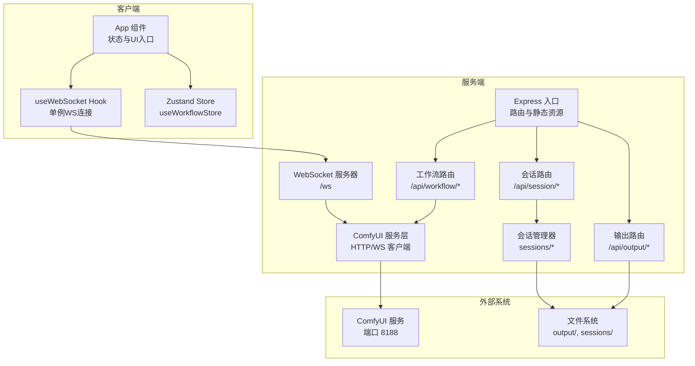
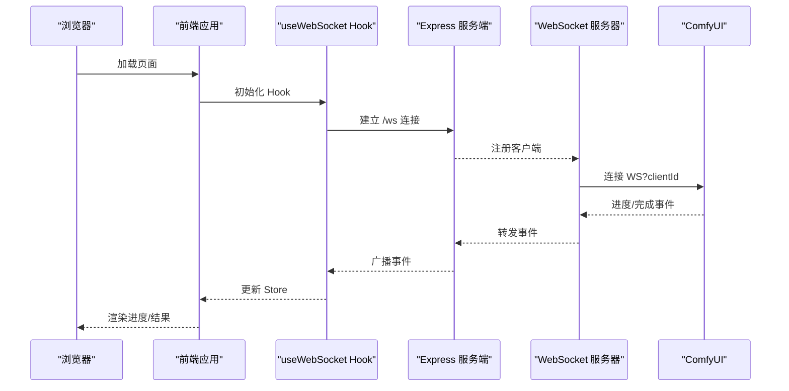
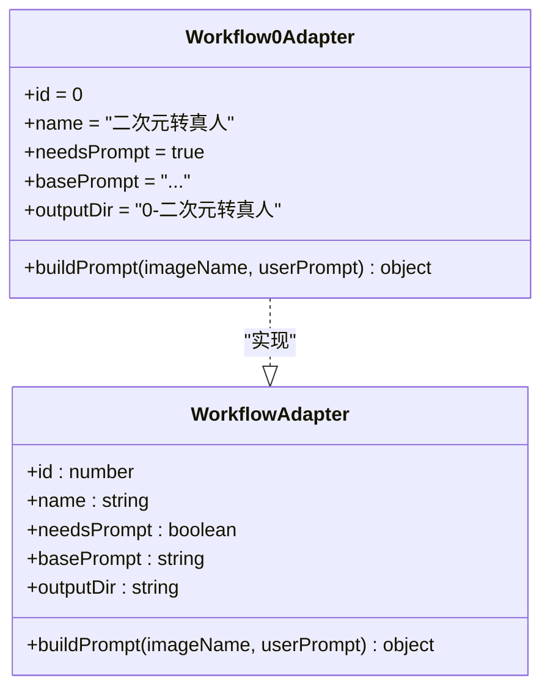
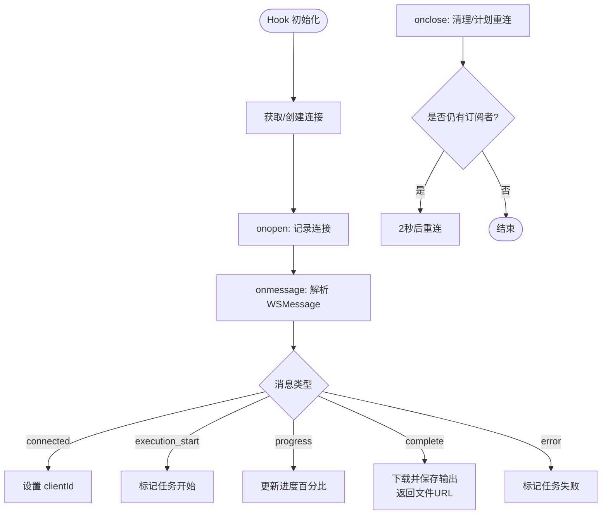
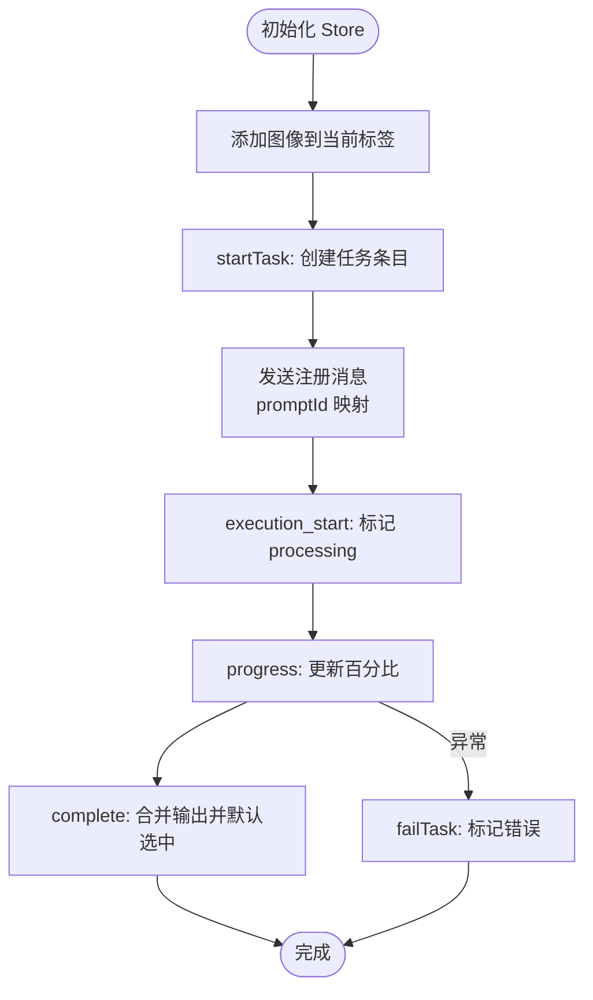
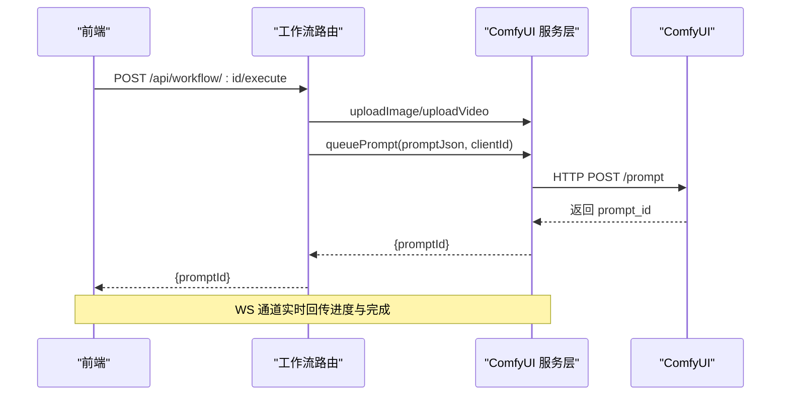
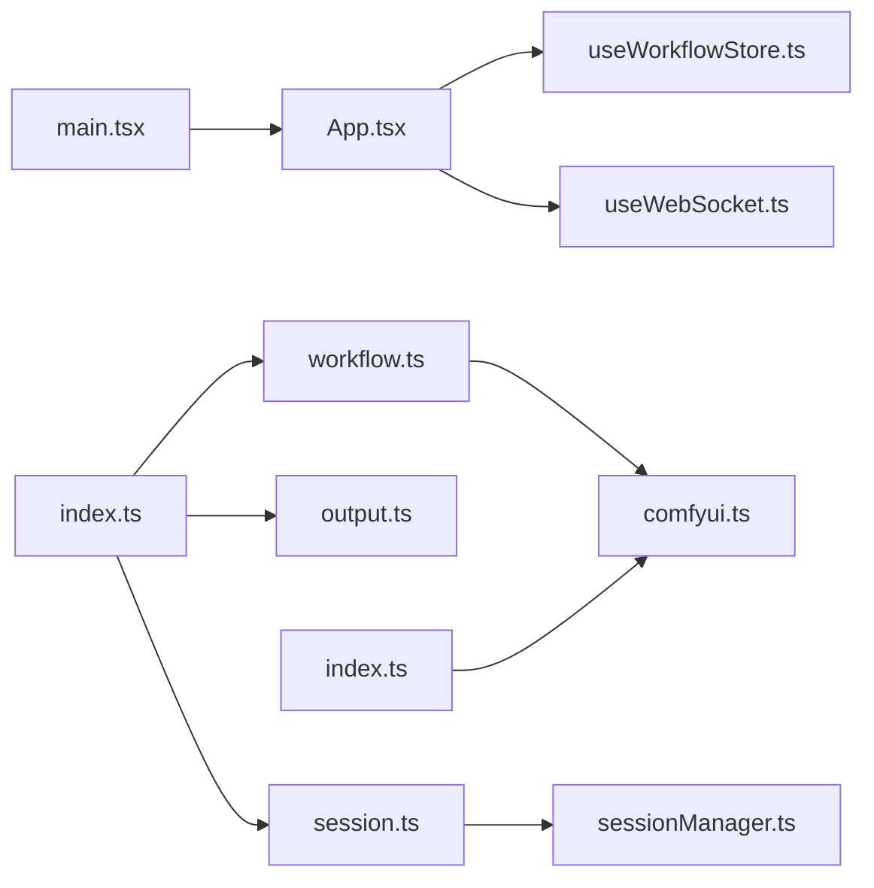
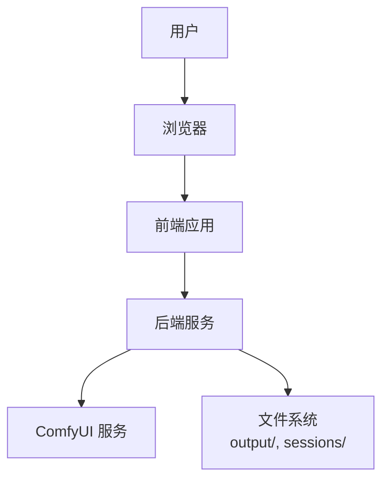
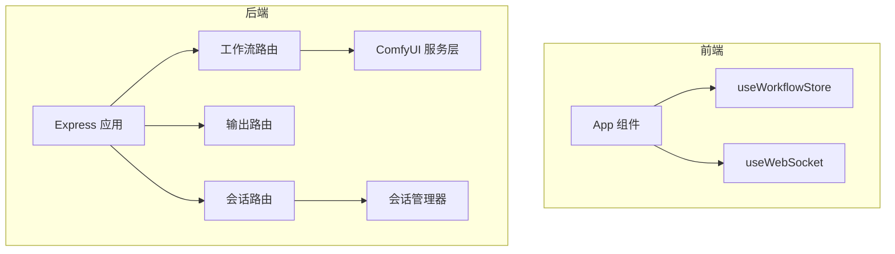

# 架构设计

<cite>
**本文引用的文件**
- [README.md](file://README.md)
- [package.json](file://package.json)
- [client/package.json](file://client/package.json)
- [server/package.json](file://server/package.json)
- [client/src/main.tsx](file://client/src/main.tsx)
- [server/src/index.ts](file://server/src/index.ts)
- [server/src/adapters/BaseAdapter.ts](file://server/src/adapters/BaseAdapter.ts)
- [server/src/adapters/Workflow0Adapter.ts](file://server/src/adapters/Workflow0Adapter.ts)
- [client/src/hooks/useWebSocket.ts](file://client/src/hooks/useWebSocket.ts)
- [client/src/hooks/useWorkflowStore.ts](file://client/src/hooks/useWorkflowStore.ts)
- [client/src/components/App.tsx](file://client/src/components/App.tsx)
- [server/src/services/comfyui.ts](file://server/src/services/comfyui.ts)
- [server/src/routes/workflow.ts](file://server/src/routes/workflow.ts)
- [server/src/routes/output.ts](file://server/src/routes/output.ts)
- [server/src/routes/session.ts](file://server/src/routes/session.ts)
- [server/src/services/sessionManager.ts](file://server/src/services/sessionManager.ts)
- [client/src/types/index.ts](file://client/src/types/index.ts)
- [server/src/types/index.ts](file://server/src/types/index.ts)
</cite>

## 目录
1. [引言](#引言)
2. [项目结构](#项目结构)
3. [核心组件](#核心组件)
4. [架构总览](#架构总览)
5. [详细组件分析](#详细组件分析)
6. [依赖分析](#依赖分析)
7. [性能考量](#性能考量)
8. [故障排查指南](#故障排查指南)
9. [结论](#结论)
10. [附录](#附录)

## 引言
本项目为 CorineKit Pix2Real，提供本地 Web UI，通过 ComfyUI 批量执行图像/视频工作流，并支持实时进度回传与一键打开输出目录。系统采用前后端分离架构：前端使用 Vite + React + TypeScript，后端使用 Express + TypeScript；通过 WebSocket 在浏览器与 ComfyUI 之间建立长连接，实现进度与完成事件的实时推送；状态管理采用轻量级 Zustand；适配器模式用于按工作流加载与修补 ComfyUI JSON 模板。

## 项目结构
- 前端（client）
  - 使用 Vite 构建，React 19 + TypeScript，组件化 UI，Zustand 管理全局状态，自定义 Hook 管理 WebSocket 连接与会话。
- 后端（server）
  - 使用 Express + TypeScript，提供工作流执行、输出文件服务、会话持久化等接口；内部封装 ComfyUI HTTP/WebSocket 客户端；适配器模式按工作流加载模板并修补节点参数。
- 工作流模板（ComfyUI_API）
  - 存放各工作流的 JSON 模板，后端按需读取并修改节点输入（如图像名、提示词、种子等）。
- 输出与会话（output、sessions）
  - 输出文件按工作流分类存放；会话数据以目录结构保存输入、掩码、输出与状态 JSON。

图表来源
- [client/src/components/App.tsx:54-335](file://client/src/components/App.tsx#L54-L335)
- [client/src/hooks/useWebSocket.ts:1-99](file://client/src/hooks/useWebSocket.ts#L1-L99)
- [client/src/hooks/useWorkflowStore.ts:1-645](file://client/src/hooks/useWorkflowStore.ts#L1-L645)
- [server/src/index.ts:42-228](file://server/src/index.ts#L42-L228)
- [server/src/routes/workflow.ts:1-862](file://server/src/routes/workflow.ts#L1-L862)
- [server/src/routes/output.ts:1-134](file://server/src/routes/output.ts#L1-L134)
- [server/src/routes/session.ts:1-95](file://server/src/routes/session.ts#L1-L95)
- [server/src/services/comfyui.ts:1-285](file://server/src/services/comfyui.ts#L1-L285)
- [server/src/services/sessionManager.ts:1-164](file://server/src/services/sessionManager.ts#L1-L164)

章节来源
- [README.md:41-79](file://README.md#L41-L79)
- [package.json:1-15](file://package.json#L1-L15)

## 核心组件
- 适配器模式（Workflow Adapters）
  - 每个工作流一个适配器，负责读取对应 JSON 模板并修补节点输入（图像名、提示词、随机种子等），统一 buildPrompt 接口。
- WebSocket 实时通信
  - 服务端为每个浏览器客户端创建唯一 WS 连接，转发 ComfyUI 的进度与完成事件；前端 Hook 使用模块级全局变量确保单例连接与自动重连。
- Zustand 状态管理
  - 单一 Store 管理活动标签、图像列表、任务队列、提示词、选择状态、会话信息等；提供任务生命周期方法与计算属性。
- ComfyUI 服务层
  - HTTP 上传图像/视频、入队、查询历史、下载输出、系统统计、队列优先级调整等；WS 订阅进度与完成事件。
- 路由与服务
  - 工作流路由：执行单图/批量、释放显存、系统统计、队列操作、导出混合图、反向提示词等。
  - 输出路由：列出与提供输出文件，打开文件。
  - 会话路由：保存/加载输入图像与掩码、保存/加载会话状态、删除会话、清理旧会话。

章节来源
- [server/src/adapters/Workflow0Adapter.ts:1-35](file://server/src/adapters/Workflow0Adapter.ts#L1-L35)
- [server/src/adapters/BaseAdapter.ts:1-4](file://server/src/adapters/BaseAdapter.ts#L1-L4)
- [client/src/hooks/useWebSocket.ts:1-99](file://client/src/hooks/useWebSocket.ts#L1-L99)
- [client/src/hooks/useWorkflowStore.ts:1-645](file://client/src/hooks/useWorkflowStore.ts#L1-L645)
- [server/src/services/comfyui.ts:1-285](file://server/src/services/comfyui.ts#L1-L285)
- [server/src/routes/workflow.ts:1-862](file://server/src/routes/workflow.ts#L1-L862)
- [server/src/routes/output.ts:1-134](file://server/src/routes/output.ts#L1-L134)
- [server/src/routes/session.ts:1-95](file://server/src/routes/session.ts#L1-L95)

## 架构总览
系统采用“前端单页应用 + 后端无状态服务”的前后端分离设计。前端负责用户交互与状态展示，后端负责与 ComfyUI 通信、文件系统交互与会话持久化。WebSocket 作为实时通道，将 ComfyUI 的执行进度与结果回传至前端。

图表来源
- [client/src/hooks/useWebSocket.ts:10-73](file://client/src/hooks/useWebSocket.ts#L10-L73)
- [server/src/index.ts:73-219](file://server/src/index.ts#L73-L219)
- [server/src/services/comfyui.ts:127-188](file://server/src/services/comfyui.ts#L127-L188)

## 详细组件分析

### 适配器模式在工作流处理中的应用
- 设计要点
  - 每个工作流拥有独立适配器，集中管理模板路径与节点修补逻辑，屏蔽不同工作流的差异。
  - 通过 buildPrompt 统一接口，接收上传后的文件名与用户提示词，返回可直接入队的 JSON。
- 关键流程
  - 读取模板文件 → 修补节点输入（图像名、提示词、种子等）→ 返回 JSON。
- 代码映射
  - 适配器基类与具体实现位于 server/src/adapters。
  - 工作流路由根据适配器构建 prompt 并调用队列接口。

图表来源
- [server/src/types/index.ts:1-8](file://server/src/types/index.ts#L1-L8)
- [server/src/adapters/Workflow0Adapter.ts:1-35](file://server/src/adapters/Workflow0Adapter.ts#L1-L35)

章节来源
- [server/src/adapters/BaseAdapter.ts:1-4](file://server/src/adapters/BaseAdapter.ts#L1-L4)
- [server/src/adapters/Workflow0Adapter.ts:1-35](file://server/src/adapters/Workflow0Adapter.ts#L1-L35)
- [server/src/routes/workflow.ts:408-455](file://server/src/routes/workflow.ts#L408-L455)

### WebSocket 实时通信机制
- 单例连接策略
  - Hook 内部使用模块级全局变量维护唯一 WebSocket 实例，挂载时增加计数，卸载时减少计数并在归零时关闭连接与取消重连定时器。
- 事件缓冲与重放
  - 服务端为每个 promptId 维护事件缓冲，在客户端注册前可能错过的时间段内进行重放，保证首次渲染不丢失进度。
- 事件类型
  - connected：下发 clientId。
  - execution_start：标记任务开始。
  - progress：百分比进度。
  - complete：下载并保存输出，返回文件 URL 列表。
  - error：错误消息。

图表来源
- [client/src/hooks/useWebSocket.ts:10-99](file://client/src/hooks/useWebSocket.ts#L10-L99)
- [server/src/index.ts:83-219](file://server/src/index.ts#L83-L219)

章节来源
- [client/src/hooks/useWebSocket.ts:1-99](file://client/src/hooks/useWebSocket.ts#L1-L99)
- [server/src/index.ts:73-219](file://server/src/index.ts#L73-L219)

### Zustand 状态管理的设计思路
- Store 结构
  - activeTab、workflows、tabData（每标签页包含 images、prompts、tasks、imagePromptMap、selectedOutputIndex、backPoseToggles、text2imgConfigs、zitConfigs、faceSwapZones）、clientId、sessionId、selectedImageIds。
- 任务生命周期
  - startTask/markTaskStarted/updateProgress/completeTask/failTask/resetTask/removeOutput/remapTaskPromptIds 等方法统一管理任务状态与输出。
- 会话与视图
  - 支持多标签页隔离、批量导入/删除图像、选择模式切换、主题与视图尺寸持久化。
- 代码映射
  - Store 定义与方法集中在 client/src/hooks/useWorkflowStore.ts。

图表来源
- [client/src/hooks/useWorkflowStore.ts:377-515](file://client/src/hooks/useWorkflowStore.ts#L377-L515)
- [client/src/hooks/useWorkflowStore.ts:595-644](file://client/src/hooks/useWorkflowStore.ts#L595-L644)

章节来源
- [client/src/hooks/useWorkflowStore.ts:1-645](file://client/src/hooks/useWorkflowStore.ts#L1-L645)

### ComfyUI 服务层与路由
- 服务层职责
  - 上传图像/视频、入队、查询历史、下载输出、系统统计、队列优先级调整、WS 连接与事件解析。
- 路由职责
  - 工作流执行（单图/批量）、释放显存、系统统计、队列操作、导出混合图、反向提示词、提示词助理、打开输出目录。
  - 输出路由：列出与提供输出文件、打开文件。
  - 会话路由：保存/加载输入图像/掩码、保存/加载会话状态、删除会话、列出会话、清理旧会话。

图表来源
- [server/src/routes/workflow.ts:408-455](file://server/src/routes/workflow.ts#L408-L455)
- [server/src/services/comfyui.ts:9-60](file://server/src/services/comfyui.ts#L9-L60)

章节来源
- [server/src/services/comfyui.ts:1-285](file://server/src/services/comfyui.ts#L1-L285)
- [server/src/routes/workflow.ts:1-862](file://server/src/routes/workflow.ts#L1-L862)

### 会话持久化与文件系统
- 目录结构
  - sessions/{sessionId}/tab-{0..5}/{input|masks|output}
  - output/{workflows...}
- 功能
  - 输入图像/掩码保存、输出文件保存、会话状态 JSON 保存与加载、列出会话、删除会话、清理旧会话。
- 代码映射
  - 会话管理器与路由分别位于 server/src/services/sessionManager.ts 与 server/src/routes/session.ts。

章节来源
- [server/src/services/sessionManager.ts:1-164](file://server/src/services/sessionManager.ts#L1-L164)
- [server/src/routes/session.ts:1-95](file://server/src/routes/session.ts#L1-L95)

## 依赖分析
- 技术栈与版本
  - 前端：React 19、TypeScript、Vite、Zustand。
  - 后端：Express、TypeScript、ws、node-fetch、multer、cors。
- 模块耦合
  - 前端：App 依赖 Zustand 与 WebSocket Hook；Hook 与 Store 低耦合，便于复用。
  - 后端：路由依赖适配器与服务层；服务层依赖 ComfyUI API；会话管理器独立于路由。
- 外部依赖
  - ComfyUI 服务（HTTP 8188、WS ws://localhost:8188/ws?clientId=...）。
  - 文件系统（output、sessions）。

图表来源
- [client/src/main.tsx:1-11](file://client/src/main.tsx#L1-L11)
- [client/src/components/App.tsx:54-335](file://client/src/components/App.tsx#L54-L335)
- [client/src/hooks/useWorkflowStore.ts:1-645](file://client/src/hooks/useWorkflowStore.ts#L1-L645)
- [client/src/hooks/useWebSocket.ts:1-99](file://client/src/hooks/useWebSocket.ts#L1-L99)
- [server/src/index.ts:1-228](file://server/src/index.ts#L1-L228)
- [server/src/routes/workflow.ts:1-862](file://server/src/routes/workflow.ts#L1-L862)
- [server/src/routes/output.ts:1-134](file://server/src/routes/output.ts#L1-L134)
- [server/src/routes/session.ts:1-95](file://server/src/routes/session.ts#L1-L95)
- [server/src/services/comfyui.ts:1-285](file://server/src/services/comfyui.ts#L1-L285)
- [server/src/services/sessionManager.ts:1-164](file://server/src/services/sessionManager.ts#L1-L164)

章节来源
- [client/package.json:1-25](file://client/package.json#L1-L25)
- [server/package.json:1-28](file://server/package.json#L1-L28)

## 性能考量
- WebSocket 单例与事件缓冲
  - 避免重复连接与丢包，提升首屏进度体验。
- 前端状态局部更新
  - Zustand 仅更新受影响的标签页数据，降低渲染压力。
- 后端批处理与队列优先级
  - 批量执行与队列重排减少等待时间。
- 文件系统 I/O
  - 会话与输出目录结构清晰，避免路径冲突；建议对大文件传输启用压缩或分片（当前未实现）。
- ComfyUI 资源占用
  - 提供释放显存接口，结合系统统计监控 VRAM/内存使用。

## 故障排查指南
- WebSocket 连接问题
  - 检查服务端 /ws 是否可用；确认客户端协议（ws/wss）与主机一致；查看 onclose/onerror 回调日志。
- 进度不显示或延迟
  - 确认事件缓冲与重放逻辑；检查 ComfyUI WS 事件类型（progress/executing/execution_success）。
- 任务完成但无输出
  - 检查服务端下载与保存流程；确认 promptId 映射与输出目录权限。
- 会话无法加载
  - 检查 session.json 格式与字段完整性；确认 sessions 目录存在且可写。
- ComfyUI 不可用
  - 确认 127.0.0.1:8188 可访问；查看服务层错误响应与状态码。

章节来源
- [server/src/index.ts:73-219](file://server/src/index.ts#L73-L219)
- [server/src/services/comfyui.ts:127-188](file://server/src/services/comfyui.ts#L127-L188)
- [server/src/routes/workflow.ts:522-579](file://server/src/routes/workflow.ts#L522-L579)
- [server/src/routes/output.ts:75-131](file://server/src/routes/output.ts#L75-L131)
- [server/src/routes/session.ts:70-95](file://server/src/routes/session.ts#L70-L95)

## 结论
本项目通过适配器模式抽象工作流差异，借助 Zustand 简化前端状态管理，利用 WebSocket 实现实时反馈，并以会话与文件系统保障数据持久化。整体架构清晰、模块边界明确，具备良好的扩展性与可维护性。后续可在监控告警、灾难恢复与安全加固方面进一步完善。

## 附录

### 系统上下文图（概念性）

### 组件分解图（概念性）
