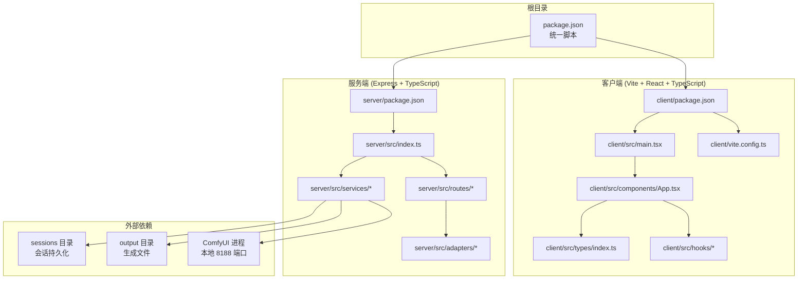
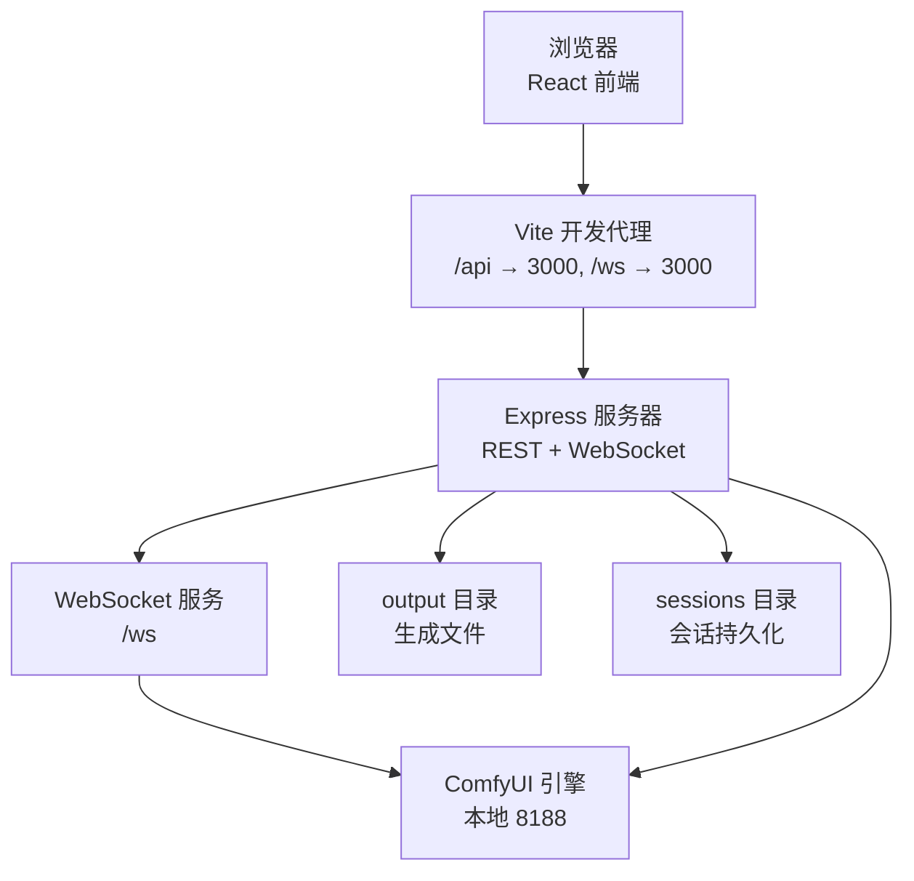
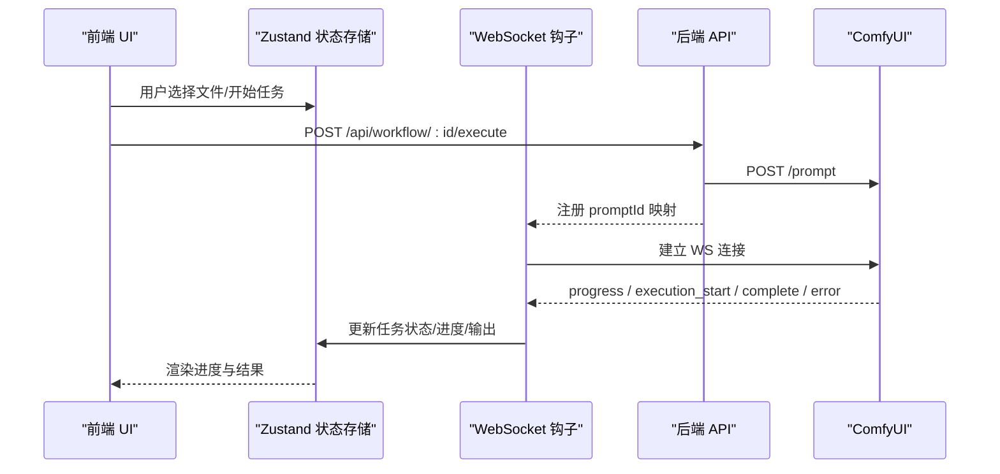
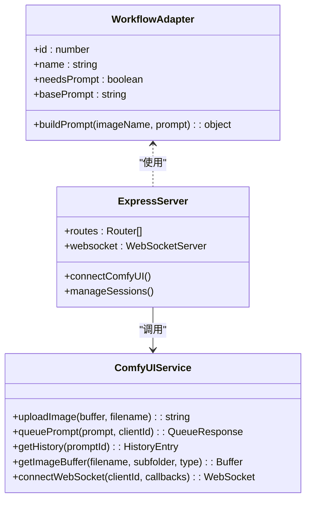
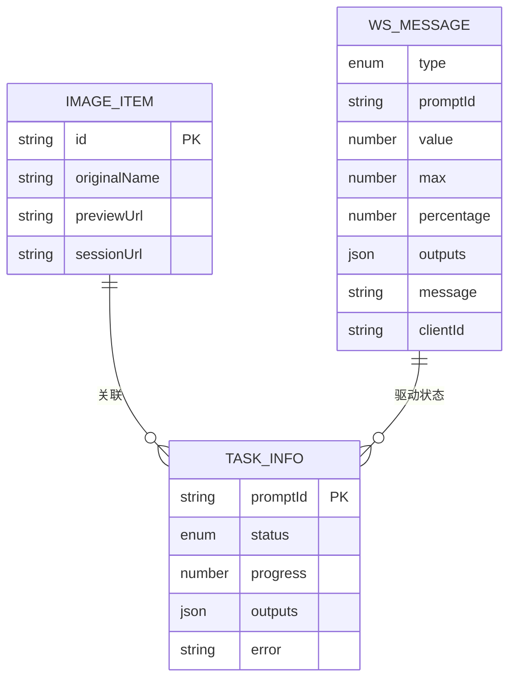
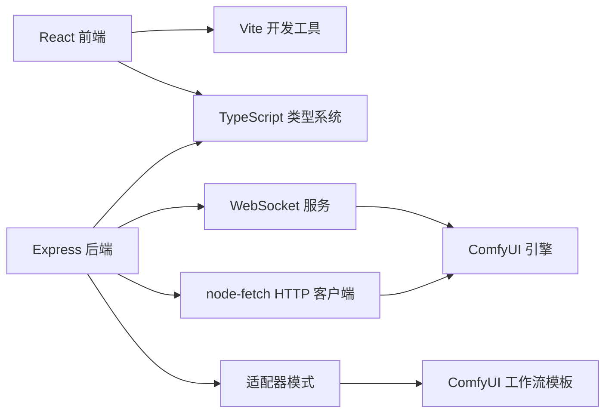
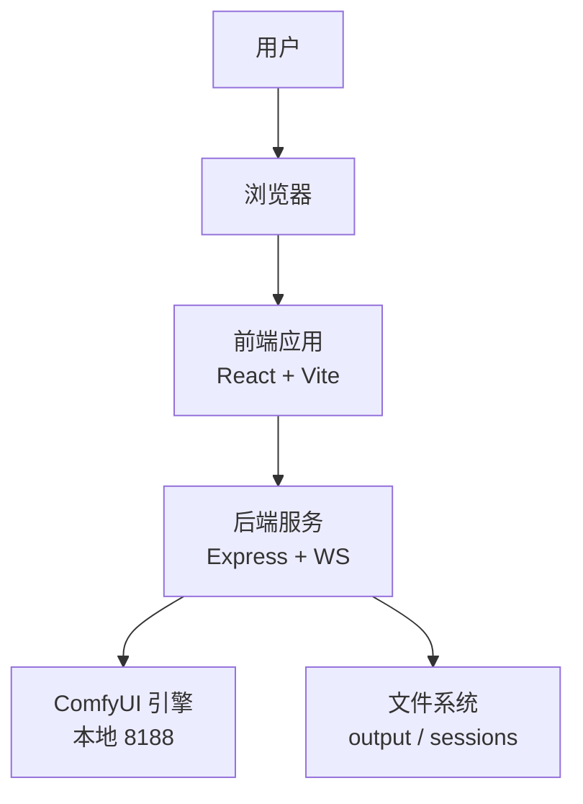
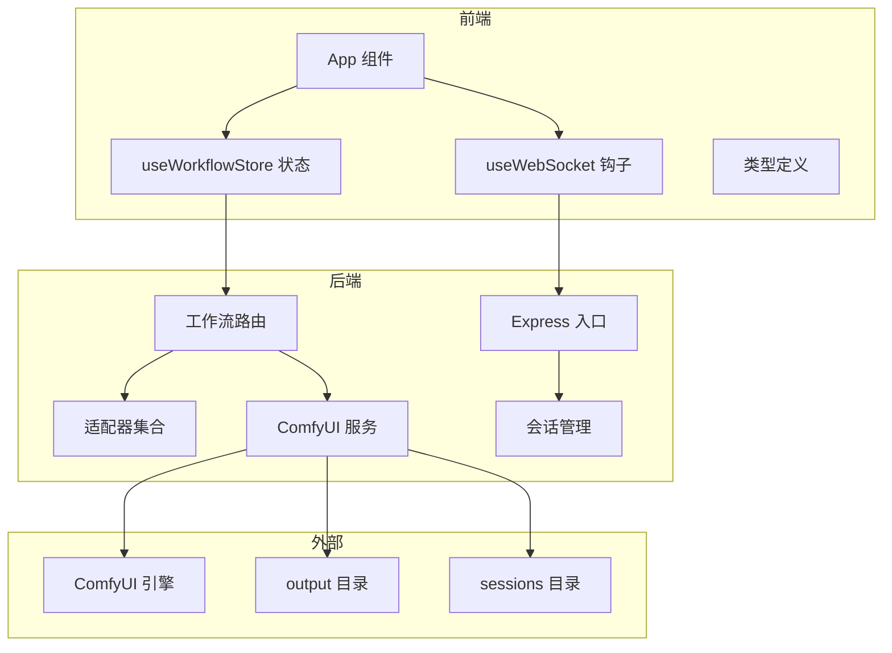

# 系统概览

<cite>
**本文档引用的文件**
- [README.md](file://README.md)
- [package.json](file://package.json)
- [client/package.json](file://client/package.json)
- [server/package.json](file://server/package.json)
- [client/vite.config.ts](file://client/vite.config.ts)
- [client/src/main.tsx](file://client/src/main.tsx)
- [client/src/components/App.tsx](file://client/src/components/App.tsx)
- [client/src/hooks/useWebSocket.ts](file://client/src/hooks/useWebSocket.ts)
- [client/src/hooks/useWorkflowStore.ts](file://client/src/hooks/useWorkflowStore.ts)
- [client/src/types/index.ts](file://client/src/types/index.ts)
- [server/src/index.ts](file://server/src/index.ts)
- [server/src/services/comfyui.ts](file://server/src/services/comfyui.ts)
- [server/src/routes/workflow.ts](file://server/src/routes/workflow.ts)
- [server/src/adapters/index.ts](file://server/src/adapters/index.ts)
- [server/src/services/sessionManager.ts](file://server/src/services/sessionManager.ts)
</cite>

## 目录
1. [简介](#简介)
2. [项目结构](#项目结构)
3. [核心组件](#核心组件)
4. [架构总览](#架构总览)
5. [详细组件分析](#详细组件分析)
6. [依赖关系分析](#依赖关系分析)
7. [性能考量](#性能考量)
8. [故障排除指南](#故障排除指南)
9. [结论](#结论)
10. [附录](#附录)

## 简介
CorineKit Pix2Real 是一个基于本地 Web 的批量图像/视频处理系统，通过 ComfyUI 实现工作流编排与执行。系统采用前后端分离架构：前端使用 React + TypeScript + Vite 构建用户界面，后端使用 Express + TypeScript 提供 API 与 WebSocket 服务，并以适配器模式对接多种工作流模板。系统支持实时进度回传、批处理、会话持久化、多标签页隔离等特性。

- 系统目标：提供易用的本地 Web UI，实现从图像到视频的多种风格转换与增强处理，支持批量任务与实时反馈。
- 核心功能：5 个内置工作流（二次元转真人、真人精修、精修放大、快速生成视频、视频放大）、批处理、实时进度、输出目录一键打开、VRAM 释放、深色/浅色主题。
- 系统边界：前端负责用户交互与状态管理；后端负责与 ComfyUI 的通信、工作流调度、会话存储与静态资源服务；ComfyUI 作为外部推理引擎运行于本地。

**章节来源**
- [README.md:1-79](file://README.md#L1-L79)

## 项目结构
项目采用前后端分离的双包管理方式，根目录提供统一的开发与构建脚本，分别独立开发与运行客户端与服务端。

**图表来源**
- [package.json:1-15](file://package.json#L1-L15)
- [client/package.json:1-25](file://client/package.json#L1-L25)
- [server/package.json:1-28](file://server/package.json#L1-L28)
- [client/vite.config.ts:1-20](file://client/vite.config.ts#L1-L20)
- [client/src/main.tsx:1-11](file://client/src/main.tsx#L1-L11)
- [client/src/components/App.tsx:1-335](file://client/src/components/App.tsx#L1-L335)
- [server/src/index.ts:1-228](file://server/src/index.ts#L1-L228)

**章节来源**
- [README.md:41-62](file://README.md#L41-L62)
- [package.json:4-10](file://package.json#L4-L10)

## 核心组件
- 前端应用入口与路由：React 应用入口负责渲染主界面，包含侧边栏、拖拽区域、相册墙、状态栏等组件。
- WebSocket 单例钩子：全局维护一个 WebSocket 连接，向 ComfyUI 实时转发进度、完成与错误事件。
- 状态管理：基于 Zustand 的工作流状态存储，管理每个标签页的图像列表、任务队列、进度与输出。
- 后端服务：Express 服务器提供 REST API 与 WebSocket，适配器模式加载 ComfyUI 工作流模板并注入参数，连接 ComfyUI 的 HTTP/WebSocket 接口。
- 会话管理：将用户会话的输入、掩码、输出与状态持久化到 sessions 目录，支持跨页面恢复。

**章节来源**
- [client/src/main.tsx:1-11](file://client/src/main.tsx#L1-L11)
- [client/src/components/App.tsx:54-335](file://client/src/components/App.tsx#L54-L335)
- [client/src/hooks/useWebSocket.ts:1-99](file://client/src/hooks/useWebSocket.ts#L1-L99)
- [client/src/hooks/useWorkflowStore.ts:1-645](file://client/src/hooks/useWorkflowStore.ts#L1-L645)
- [server/src/index.ts:42-228](file://server/src/index.ts#L42-L228)
- [server/src/services/sessionManager.ts:1-164](file://server/src/services/sessionManager.ts#L1-L164)

## 架构总览
系统采用“前端单页应用 + 后端 API/WS + 外部 ComfyUI 引擎”的三层架构。前端通过代理访问后端 API 与 WebSocket；后端通过 HTTP 与 WebSocket 与 ComfyUI 通信，同时管理会话与输出目录。

**图表来源**
- [client/vite.config.ts:6-18](file://client/vite.config.ts#L6-L18)
- [server/src/index.ts:54-63](file://server/src/index.ts#L54-L63)
- [server/src/services/comfyui.ts:6-8](file://server/src/services/comfyui.ts#L6-L8)

**章节来源**
- [README.md:74-79](file://README.md#L74-L79)
- [client/vite.config.ts:6-18](file://client/vite.config.ts#L6-L18)
- [server/src/index.ts:42-63](file://server/src/index.ts#L42-L63)

## 详细组件分析

### 前端组件与数据流
- 应用主组件负责布局、欢迎页、拖拽导入、标签页切换与侧边栏展示。
- WebSocket 钩子确保全局仅有一个连接，接收来自后端的进度、完成与错误消息，并更新状态存储。
- 状态存储管理每个标签页的图像、任务、提示词与输出索引，支持批量任务与多选操作。

**图表来源**
- [client/src/components/App.tsx:102-134](file://client/src/components/App.tsx#L102-L134)
- [client/src/hooks/useWebSocket.ts:10-73](file://client/src/hooks/useWebSocket.ts#L10-L73)
- [server/src/routes/workflow.ts:408-455](file://server/src/routes/workflow.ts#L408-L455)
- [server/src/services/comfyui.ts:127-188](file://server/src/services/comfyui.ts#L127-L188)

**章节来源**
- [client/src/components/App.tsx:54-335](file://client/src/components/App.tsx#L54-L335)
- [client/src/hooks/useWorkflowStore.ts:377-500](file://client/src/hooks/useWorkflowStore.ts#L377-L500)
- [client/src/hooks/useWebSocket.ts:1-99](file://client/src/hooks/useWebSocket.ts#L1-L99)

### 后端服务与工作流适配器
- 适配器模式：每个工作流对应一个适配器，负责加载模板并按需替换节点参数（如图像名、提示词、种子）。
- 路由层：提供工作流执行、批处理、队列管理、系统统计、内存释放、输出目录打开等接口。
- 服务层：封装与 ComfyUI 的 HTTP/WebSocket 交互，包括上传文件、入队、历史查询、进度事件与错误处理。

**图表来源**
- [server/src/adapters/index.ts:13-28](file://server/src/adapters/index.ts#L13-L28)
- [server/src/routes/workflow.ts:29-38](file://server/src/routes/workflow.ts#L29-L38)
- [server/src/services/comfyui.ts:9-83](file://server/src/services/comfyui.ts#L9-L83)

**章节来源**
- [server/src/adapters/index.ts:1-31](file://server/src/adapters/index.ts#L1-L31)
- [server/src/routes/workflow.ts:1-800](file://server/src/routes/workflow.ts#L1-L800)
- [server/src/services/comfyui.ts:1-285](file://server/src/services/comfyui.ts#L1-L285)

### 数据模型与消息协议
- 前端类型定义了图像项、任务状态、WebSocket 消息格式等，保证前后端消息契约一致。
- 后端 WebSocket 服务在连接建立时下发 clientId，并缓冲早期事件以便客户端重连后补发。

**图表来源**
- [client/src/types/index.ts:1-58](file://client/src/types/index.ts#L1-L58)
- [server/src/index.ts:73-219](file://server/src/index.ts#L73-L219)

**章节来源**
- [client/src/types/index.ts:1-58](file://client/src/types/index.ts#L1-L58)
- [server/src/index.ts:73-90](file://server/src/index.ts#L73-L90)

## 依赖关系分析
- 技术栈选择与权衡
  - 前端：React + TypeScript + Vite。Vite 提供快速热更新与开发体验；TypeScript 提升类型安全；React 组件化便于状态与 UI 分离。
  - 后端：Express + TypeScript。Express 简洁易用，适合 API 与 WebSocket 场景；TypeScript 提升可维护性。
  - 通信：后端通过 node-fetch 与 ComfyUI HTTP 接口交互，通过 ws 与 ComfyUI WebSocket 交互，实现进度与完成事件的实时回传。
  - 适配器模式：将工作流模板与参数注入解耦，便于扩展新工作流与维护现有模板。
- 外部依赖：ComfyUI 运行于本地 8188 端口，前端通过代理访问后端，后端再访问 ComfyUI。

**图表来源**
- [client/package.json:11-23](file://client/package.json#L11-L23)
- [server/package.json:11-26](file://server/package.json#L11-L26)
- [server/src/services/comfyui.ts:1-8](file://server/src/services/comfyui.ts#L1-L8)
- [server/src/adapters/index.ts:13-24](file://server/src/adapters/index.ts#L13-L24)

**章节来源**
- [client/package.json:11-23](file://client/package.json#L11-L23)
- [server/package.json:11-26](file://server/package.json#L11-L26)
- [README.md:74-79](file://README.md#L74-L79)

## 性能考量
- 批处理优化：后端对多文件上传使用 multer 内存存储，避免磁盘抖动；ComfyUI 队列顺序执行，必要时支持优先级调整。
- WebSocket 缓冲：后端为每个 promptId 维护事件缓冲，客户端重连后可补发早期进度事件，减少感知延迟。
- 图像预览与内存：前端使用 URL.createObjectURL 生成预览，移除时及时 revoke，避免内存泄漏。
- 输出下载：完成后端直接将 ComfyUI 输出写入会话目录，前端通过静态服务访问，减少额外拷贝。

**章节来源**
- [server/src/routes/workflow.ts:23-27](file://server/src/routes/workflow.ts#L23-L27)
- [server/src/index.ts:83-90](file://server/src/index.ts#L83-L90)
- [client/src/hooks/useWorkflowStore.ts:258-260](file://client/src/hooks/useWorkflowStore.ts#L258-L260)
- [server/src/services/comfyui.ts:113-134](file://server/src/services/comfyui.ts#L113-L134)

## 故障排除指南
- ComfyUI 不可用
  - 症状：系统统计接口返回 502，队列查询失败。
  - 处理：确认 ComfyUI 在本地 8188 端口运行；检查网络与防火墙设置。
- WebSocket 断开重连
  - 症状：进度停止或偶发中断。
  - 处理：前端钩子具备自动重连逻辑；若长时间无响应，刷新页面重新建立连接。
- 任务执行错误
  - 症状：任务状态变为 error 并显示异常信息。
  - 处理：查看后端日志中的错误消息；检查工作流模板与参数是否正确；必要时清理 ComfyUI 队列。
- 输出文件缺失
  - 症状：任务完成但前端未显示输出。
  - 处理：确认后端已成功下载并保存至会话 output 目录；检查文件权限与路径编码。

**章节来源**
- [server/src/services/comfyui.ts:175-187](file://server/src/services/comfyui.ts#L175-L187)
- [server/src/index.ts:177-188](file://server/src/index.ts#L177-L188)
- [server/src/routes/workflow.ts:522-530](file://server/src/routes/workflow.ts#L522-L530)

## 结论
Pix2Real 通过清晰的前后端分层与适配器模式，实现了对多种 ComfyUI 工作流的统一接入与管理。前端以 React/Vite 提供流畅的交互体验，后端以 Express/WS 提供稳定的通信与会话能力。该架构易于扩展新的工作流与功能，同时具备良好的可维护性与可移植性。

## 附录

### 系统上下文图

**图表来源**
- [README.md:16-33](file://README.md#L16-L33)
- [client/vite.config.ts:6-18](file://client/vite.config.ts#L6-L18)
- [server/src/index.ts:42-63](file://server/src/index.ts#L42-L63)

### 组件分解图

**图表来源**
- [client/src/components/App.tsx:54-335](file://client/src/components/App.tsx#L54-L335)
- [client/src/hooks/useWebSocket.ts:1-99](file://client/src/hooks/useWebSocket.ts#L1-L99)
- [client/src/hooks/useWorkflowStore.ts:1-645](file://client/src/hooks/useWorkflowStore.ts#L1-L645)
- [server/src/index.ts:42-228](file://server/src/index.ts#L42-L228)
- [server/src/routes/workflow.ts:1-800](file://server/src/routes/workflow.ts#L1-L800)
- [server/src/services/comfyui.ts:1-285](file://server/src/services/comfyui.ts#L1-L285)
- [server/src/services/sessionManager.ts:1-164](file://server/src/services/sessionManager.ts#L1-L164)