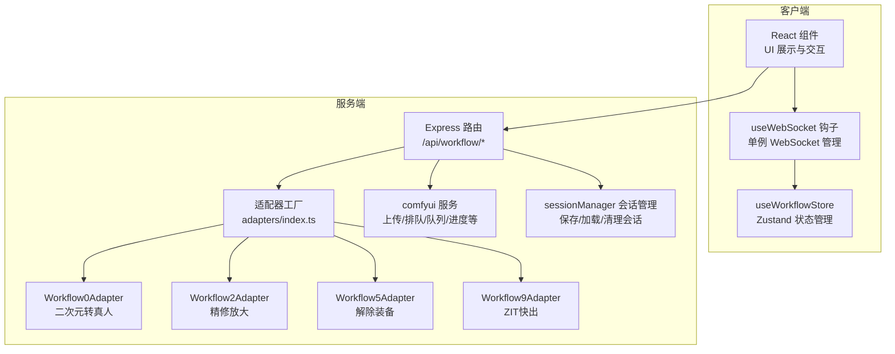
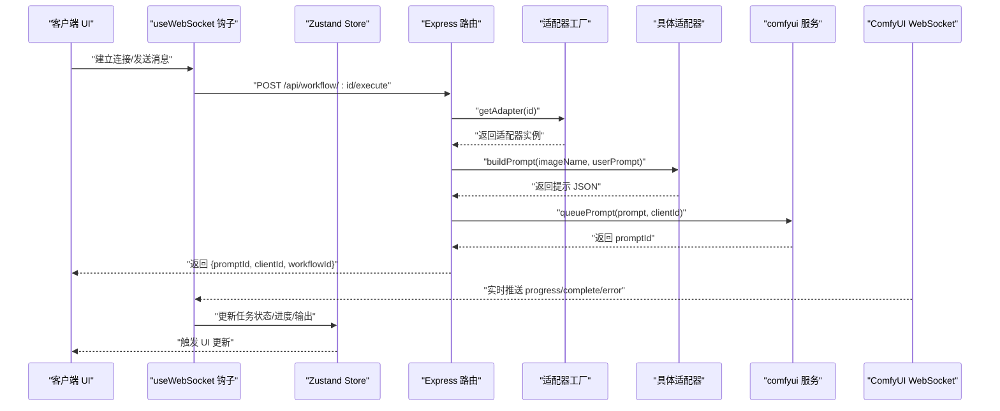
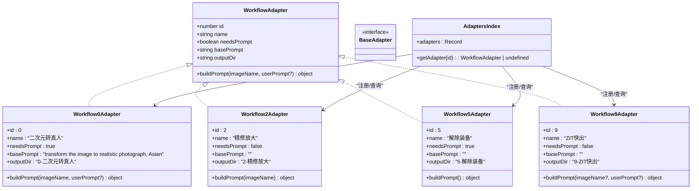
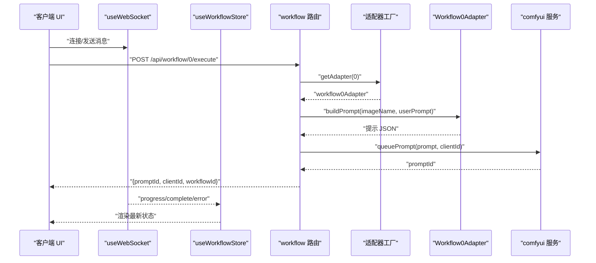
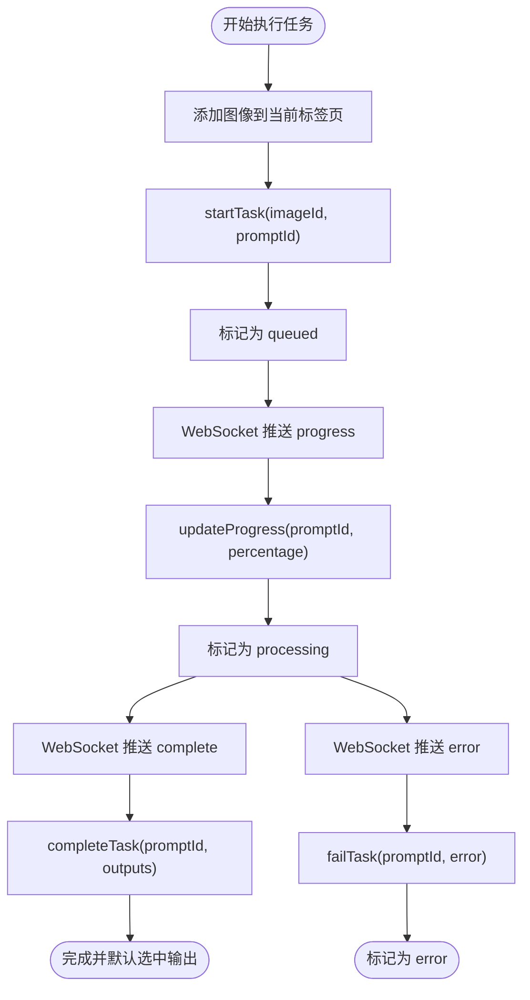
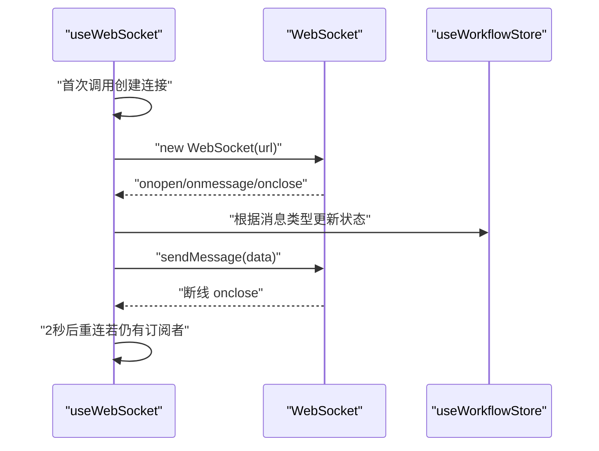
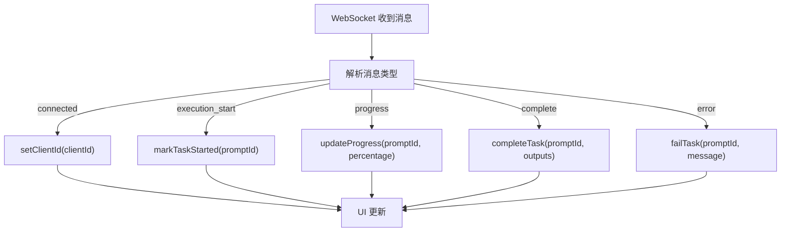
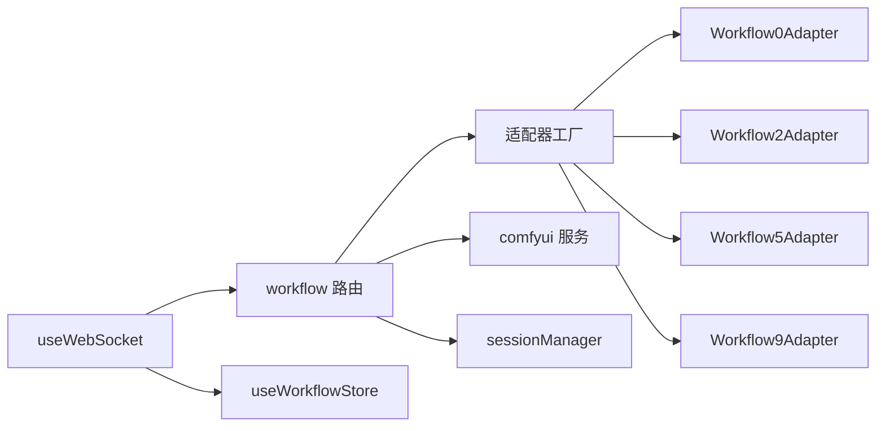

# 设计模式

<cite>
**本文引用的文件**
- [server/src/adapters/BaseAdapter.ts](file://server/src/adapters/BaseAdapter.ts)
- [server/src/adapters/index.ts](file://server/src/adapters/index.ts)
- [server/src/adapters/Workflow0Adapter.ts](file://server/src/adapters/Workflow0Adapter.ts)
- [server/src/adapters/Workflow2Adapter.ts](file://server/src/adapters/Workflow2Adapter.ts)
- [server/src/adapters/Workflow5Adapter.ts](file://server/src/adapters/Workflow5Adapter.ts)
- [server/src/adapters/Workflow9Adapter.ts](file://server/src/adapters/Workflow9Adapter.ts)
- [server/src/routes/workflow.ts](file://server/src/routes/workflow.ts)
- [server/src/services/comfyui.ts](file://server/src/services/comfyui.ts)
- [server/src/services/sessionManager.ts](file://server/src/services/sessionManager.ts)
- [server/src/types/index.ts](file://server/src/types/index.ts)
- [client/src/hooks/useWebSocket.ts](file://client/src/hooks/useWebSocket.ts)
- [client/src/hooks/useWorkflowStore.ts](file://client/src/hooks/useWorkflowStore.ts)
- [client/src/types/index.ts](file://client/src/types/index.ts)
</cite>

## 目录
1. [引言](#引言)
2. [项目结构](#项目结构)
3. [核心组件](#核心组件)
4. [架构总览](#架构总览)
5. [详细组件分析](#详细组件分析)
6. [依赖关系分析](#依赖关系分析)
7. [性能考量](#性能考量)
8. [故障排查指南](#故障排查指南)
9. [结论](#结论)
10. [附录](#附录)

## 引言
本文件系统性梳理 CorineKit Pix2Real 在服务端与客户端中所采用的设计模式，重点聚焦以下方面：
- 适配器模式：在工作流处理中的应用，包括 BaseAdapter 抽象、具体适配器实现与工厂式注册/获取机制
- 工厂模式：通过集中导出映射表与查询函数，按 ID 获取对应适配器实例
- 状态管理模式：前端使用 Zustand 管理复杂 UI 状态与任务生命周期
- 单例模式：后端 WebSocket 连接管理（通过全局连接与计数控制）
- 观察者模式：事件驱动的消息分发（ComfyUI WebSocket 事件到前端 Zustand Store 的订阅）

## 项目结构
项目采用前后端分离架构，服务端负责工作流编排与 ComfyUI 交互，客户端负责状态管理与用户界面。

图表来源
- [server/src/routes/workflow.ts:1-862](file://server/src/routes/workflow.ts#L1-L862)
- [server/src/adapters/index.ts:1-31](file://server/src/adapters/index.ts#L1-L31)
- [server/src/services/comfyui.ts:1-285](file://server/src/services/comfyui.ts#L1-L285)
- [server/src/services/sessionManager.ts:1-164](file://server/src/services/sessionManager.ts#L1-L164)
- [client/src/hooks/useWebSocket.ts:1-99](file://client/src/hooks/useWebSocket.ts#L1-L99)
- [client/src/hooks/useWorkflowStore.ts:1-645](file://client/src/hooks/useWorkflowStore.ts#L1-L645)

章节来源
- [server/src/routes/workflow.ts:1-862](file://server/src/routes/workflow.ts#L1-L862)
- [server/src/adapters/index.ts:1-31](file://server/src/adapters/index.ts#L1-L31)
- [server/src/services/comfyui.ts:1-285](file://server/src/services/comfyui.ts#L1-L285)
- [server/src/services/sessionManager.ts:1-164](file://server/src/services/sessionManager.ts#L1-L164)
- [client/src/hooks/useWebSocket.ts:1-99](file://client/src/hooks/useWebSocket.ts#L1-L99)
- [client/src/hooks/useWorkflowStore.ts:1-645](file://client/src/hooks/useWorkflowStore.ts#L1-L645)

## 核心组件
- 适配器接口与基类
  - 接口定义了工作流的标识、名称、是否需要提示词、基础提示词、输出目录以及构建提示词 JSON 的方法
  - 基类文件导出该接口类型，便于统一引用
- 适配器工厂
  - 以映射表记录各 ID 对应的适配器实例，并提供按 ID 查询的工厂函数
- 具体适配器
  - 每个适配器读取对应的 ComfyUI JSON 模板，注入输入参数（如图像名、提示词、随机种子），并返回可提交给 ComfyUI 的完整提示对象
- 服务层
  - 与 ComfyUI 交互：上传图片/视频、排队、查询历史、获取系统统计、队列优先级调整等
  - 会话管理：确保会话目录结构、保存/加载会话状态、列出/清理会话
- 客户端状态与通信
  - Zustand 管理工作流状态、任务生命周期、选中项、配置等
  - 单例 WebSocket 钩子负责连接建立、消息分发、断线重连与发送消息

章节来源
- [server/src/types/index.ts:1-52](file://server/src/types/index.ts#L1-L52)
- [server/src/adapters/BaseAdapter.ts:1-4](file://server/src/adapters/BaseAdapter.ts#L1-L4)
- [server/src/adapters/index.ts:1-31](file://server/src/adapters/index.ts#L1-L31)
- [server/src/adapters/Workflow0Adapter.ts:1-35](file://server/src/adapters/Workflow0Adapter.ts#L1-L35)
- [server/src/adapters/Workflow2Adapter.ts:1-28](file://server/src/adapters/Workflow2Adapter.ts#L1-L28)
- [server/src/adapters/Workflow5Adapter.ts:1-15](file://server/src/adapters/Workflow5Adapter.ts#L1-L15)
- [server/src/adapters/Workflow9Adapter.ts:1-14](file://server/src/adapters/Workflow9Adapter.ts#L1-L14)
- [server/src/services/comfyui.ts:1-285](file://server/src/services/comfyui.ts#L1-L285)
- [server/src/services/sessionManager.ts:1-164](file://server/src/services/sessionManager.ts#L1-L164)
- [client/src/hooks/useWorkflowStore.ts:1-645](file://client/src/hooks/useWorkflowStore.ts#L1-L645)
- [client/src/hooks/useWebSocket.ts:1-99](file://client/src/hooks/useWebSocket.ts#L1-L99)

## 架构总览
下图展示从客户端发起工作流执行请求，到服务端适配器构建提示、提交队列，再到 WebSocket 实时推送进度与结果的整体流程。

图表来源
- [server/src/routes/workflow.ts:407-455](file://server/src/routes/workflow.ts#L407-L455)
- [server/src/adapters/index.ts:26-28](file://server/src/adapters/index.ts#L26-L28)
- [server/src/adapters/Workflow0Adapter.ts:16-33](file://server/src/adapters/Workflow0Adapter.ts#L16-L33)
- [server/src/services/comfyui.ts:47-60](file://server/src/services/comfyui.ts#L47-L60)
- [client/src/hooks/useWebSocket.ts:26-51](file://client/src/hooks/useWebSocket.ts#L26-L51)
- [client/src/hooks/useWorkflowStore.ts:398-476](file://client/src/hooks/useWorkflowStore.ts#L398-L476)

## 详细组件分析

### 适配器模式：BaseAdapter、具体适配器与工厂
- 抽象与约束
  - 通过接口定义工作流的统一行为契约，确保所有适配器具备一致的属性与方法签名
- 基类设计
  - 基类文件导出接口类型，供具体适配器实现与路由层引用
- 具体适配器实现
  - 每个适配器负责读取固定模板、注入输入参数（如图像名、提示词、随机种子），并返回可提交的提示对象
  - 部分适配器使用专用路由（如 Workflow5、Workflow9），不走通用工厂路径
- 工厂模式
  - 以映射表集中注册各 ID 的适配器实例，并提供按 ID 查询的工厂函数，便于路由层按需获取

图表来源
- [server/src/types/index.ts:1-8](file://server/src/types/index.ts#L1-L8)
- [server/src/adapters/BaseAdapter.ts:1-4](file://server/src/adapters/BaseAdapter.ts#L1-L4)
- [server/src/adapters/Workflow0Adapter.ts:9-34](file://server/src/adapters/Workflow0Adapter.ts#L9-L34)
- [server/src/adapters/Workflow2Adapter.ts:9-27](file://server/src/adapters/Workflow2Adapter.ts#L9-L27)
- [server/src/adapters/Workflow5Adapter.ts:4-14](file://server/src/adapters/Workflow5Adapter.ts#L4-L14)
- [server/src/adapters/Workflow9Adapter.ts:3-13](file://server/src/adapters/Workflow9Adapter.ts#L3-L13)
- [server/src/adapters/index.ts:13-30](file://server/src/adapters/index.ts#L13-L30)

章节来源
- [server/src/types/index.ts:1-52](file://server/src/types/index.ts#L1-L52)
- [server/src/adapters/BaseAdapter.ts:1-4](file://server/src/adapters/BaseAdapter.ts#L1-L4)
- [server/src/adapters/index.ts:1-31](file://server/src/adapters/index.ts#L1-L31)
- [server/src/adapters/Workflow0Adapter.ts:1-35](file://server/src/adapters/Workflow0Adapter.ts#L1-L35)
- [server/src/adapters/Workflow2Adapter.ts:1-28](file://server/src/adapters/Workflow2Adapter.ts#L1-L28)
- [server/src/adapters/Workflow5Adapter.ts:1-15](file://server/src/adapters/Workflow5Adapter.ts#L1-L15)
- [server/src/adapters/Workflow9Adapter.ts:1-14](file://server/src/adapters/Workflow9Adapter.ts#L1-L14)

### 工作流执行序列：适配器与路由协作
- 路由层根据请求参数选择适配器或专用路由
- 适配器构建提示 JSON 并交由服务层排队
- WebSocket 实时推送进度与完成事件，前端 Store 更新 UI

图表来源
- [server/src/routes/workflow.ts:312-355](file://server/src/routes/workflow.ts#L312-L355)
- [server/src/adapters/index.ts:26-28](file://server/src/adapters/index.ts#L26-L28)
- [server/src/adapters/Workflow0Adapter.ts:16-33](file://server/src/adapters/Workflow0Adapter.ts#L16-L33)
- [server/src/services/comfyui.ts:47-60](file://server/src/services/comfyui.ts#L47-L60)
- [client/src/hooks/useWebSocket.ts:26-51](file://client/src/hooks/useWebSocket.ts#L26-L51)
- [client/src/hooks/useWorkflowStore.ts:398-476](file://client/src/hooks/useWorkflowStore.ts#L398-L476)

章节来源
- [server/src/routes/workflow.ts:312-355](file://server/src/routes/workflow.ts#L312-L355)
- [server/src/adapters/index.ts:26-28](file://server/src/adapters/index.ts#L26-L28)
- [server/src/adapters/Workflow0Adapter.ts:16-33](file://server/src/adapters/Workflow0Adapter.ts#L16-L33)
- [server/src/services/comfyui.ts:47-60](file://server/src/services/comfyui.ts#L47-L60)
- [client/src/hooks/useWebSocket.ts:26-51](file://client/src/hooks/useWebSocket.ts#L26-L51)
- [client/src/hooks/useWorkflowStore.ts:398-476](file://client/src/hooks/useWorkflowStore.ts#L398-L476)

### 状态管理模式（Zustand）
- 管理范围
  - 工作流列表、当前标签页、每标签页的图像集合、提示词、任务信息、选中项、配置等
- 关键能力
  - 任务生命周期管理：入队、开始、进度、完成、失败、移除输出
  - 多标签页状态隔离与跨标签页搜索（如进度到达时在任意标签页更新）
  - 会话恢复：序列化/反序列化状态，支持断点续做
- 优势
  - 简洁的状态更新逻辑，避免深层组件传递与重复渲染
  - 易于测试与调试，动作明确

图表来源
- [client/src/hooks/useWorkflowStore.ts:377-500](file://client/src/hooks/useWorkflowStore.ts#L377-L500)
- [client/src/hooks/useWorkflowStore.ts:501-544](file://client/src/hooks/useWorkflowStore.ts#L501-L544)
- [client/src/hooks/useWorkflowStore.ts:545-593](file://client/src/hooks/useWorkflowStore.ts#L545-L593)
- [client/src/hooks/useWorkflowStore.ts:595-644](file://client/src/hooks/useWorkflowStore.ts#L595-L644)

章节来源
- [client/src/hooks/useWorkflowStore.ts:1-645](file://client/src/hooks/useWorkflowStore.ts#L1-L645)

### 单例模式（WebSocket 连接）
- 设计要点
  - 使用全局变量维护唯一 WebSocket 实例，连接计数控制生命周期
  - 断线自动重连，仅当存在订阅者时尝试重连
  - 发送消息前检查 readyState，保证消息可靠投递
- 适用场景
  - 服务端与客户端之间长连接、低延迟事件推送
- 优势
  - 避免重复连接与资源浪费
  - 统一事件入口，简化消息分发

图表来源
- [client/src/hooks/useWebSocket.ts:10-73](file://client/src/hooks/useWebSocket.ts#L10-L73)
- [client/src/hooks/useWebSocket.ts:75-99](file://client/src/hooks/useWebSocket.ts#L75-L99)
- [client/src/types/index.ts:27-57](file://client/src/types/index.ts#L27-L57)

章节来源
- [client/src/hooks/useWebSocket.ts:1-99](file://client/src/hooks/useWebSocket.ts#L1-L99)
- [client/src/types/index.ts:1-58](file://client/src/types/index.ts#L1-L58)

### 观察者模式（事件处理）
- 事件来源
  - ComfyUI 通过 WebSocket 推送进度、执行开始、完成、错误等事件
- 事件分发
  - 客户端钩子解析消息，调用 Store 的相应动作更新状态
- 优点
  - 松耦合：服务端无需关心前端如何处理事件
  - 实时性强：事件到达即更新 UI

图表来源
- [server/src/services/comfyui.ts:143-187](file://server/src/services/comfyui.ts#L143-L187)
- [client/src/hooks/useWebSocket.ts:26-51](file://client/src/hooks/useWebSocket.ts#L26-L51)
- [client/src/hooks/useWorkflowStore.ts:398-476](file://client/src/hooks/useWorkflowStore.ts#L398-L476)

章节来源
- [server/src/services/comfyui.ts:127-188](file://server/src/services/comfyui.ts#L127-L188)
- [client/src/hooks/useWebSocket.ts:1-99](file://client/src/hooks/useWebSocket.ts#L1-L99)
- [client/src/hooks/useWorkflowStore.ts:398-476](file://client/src/hooks/useWorkflowStore.ts#L398-L476)

## 依赖关系分析
- 路由层依赖适配器工厂与服务层
- 适配器工厂集中注册与查询适配器
- 服务层封装 ComfyUI 交互细节
- 客户端通过钩子与 Store 实现事件订阅与状态更新

图表来源
- [server/src/routes/workflow.ts:7-10](file://server/src/routes/workflow.ts#L7-L10)
- [server/src/adapters/index.ts:1-31](file://server/src/adapters/index.ts#L1-L31)
- [server/src/services/comfyui.ts:1-285](file://server/src/services/comfyui.ts#L1-L285)
- [server/src/services/sessionManager.ts:1-164](file://server/src/services/sessionManager.ts#L1-L164)
- [client/src/hooks/useWebSocket.ts:1-99](file://client/src/hooks/useWebSocket.ts#L1-L99)
- [client/src/hooks/useWorkflowStore.ts:1-645](file://client/src/hooks/useWorkflowStore.ts#L1-L645)

章节来源
- [server/src/routes/workflow.ts:1-862](file://server/src/routes/workflow.ts#L1-L862)
- [server/src/adapters/index.ts:1-31](file://server/src/adapters/index.ts#L1-L31)
- [server/src/services/comfyui.ts:1-285](file://server/src/services/comfyui.ts#L1-L285)
- [server/src/services/sessionManager.ts:1-164](file://server/src/services/sessionManager.ts#L1-L164)
- [client/src/hooks/useWebSocket.ts:1-99](file://client/src/hooks/useWebSocket.ts#L1-L99)
- [client/src/hooks/useWorkflowStore.ts:1-645](file://client/src/hooks/useWorkflowStore.ts#L1-L645)

## 性能考量
- 适配器模板复用与参数注入：减少运行时拼装成本，提升构建提示的效率
- 工厂式注册：按需获取适配器，避免无谓实例化
- WebSocket 单例：降低连接与上下文切换开销，提高事件吞吐
- Zustand 动作粒度：细粒度状态更新，减少不必要的渲染
- 会话持久化：避免重复计算与资源浪费，支持断点续做

## 故障排查指南
- WebSocket 连接问题
  - 检查钩子中的断线重连逻辑与 readyState 判断
  - 确认服务端 WebSocket 地址与协议匹配
- 任务状态异常
  - 核对 Store 中任务状态转换逻辑（queued → processing → done/error）
  - 检查 remapTaskPromptIds 是否正确处理队列优先级调整后的 ID 映射
- 适配器构建失败
  - 确认模板路径与节点 ID 正确
  - 校验用户提示词与默认提示词拼接逻辑
- 会话保存/加载
  - 检查 sessions 目录权限与路径
  - 确保序列化字段与 Store 结构一致

章节来源
- [client/src/hooks/useWebSocket.ts:53-65](file://client/src/hooks/useWebSocket.ts#L53-L65)
- [client/src/hooks/useWorkflowStore.ts:166-195](file://client/src/hooks/useWorkflowStore.ts#L166-L195)
- [server/src/adapters/Workflow0Adapter.ts:16-33](file://server/src/adapters/Workflow0Adapter.ts#L16-L33)
- [server/src/services/sessionManager.ts:91-110](file://server/src/services/sessionManager.ts#L91-L110)

## 结论
本项目通过适配器模式与工厂模式实现了工作流的模块化与可扩展性；借助 Zustand 的状态管理与单例 WebSocket 的事件驱动机制，前端实现了高效、实时的用户体验。整体设计在解耦、可维护性与性能之间取得良好平衡，适合进一步扩展新的工作流与功能。

## 附录
- 代码示例路径（用于定位实现）
  - 适配器接口与基类：[server/src/types/index.ts:1-8](file://server/src/types/index.ts#L1-L8), [server/src/adapters/BaseAdapter.ts:1-4](file://server/src/adapters/BaseAdapter.ts#L1-L4)
  - 适配器工厂与注册：[server/src/adapters/index.ts:13-30](file://server/src/adapters/index.ts#L13-L30)
  - 具体适配器实现：[server/src/adapters/Workflow0Adapter.ts:16-33](file://server/src/adapters/Workflow0Adapter.ts#L16-L33), [server/src/adapters/Workflow2Adapter.ts:16-26](file://server/src/adapters/Workflow2Adapter.ts#L16-L26)
  - 路由层工作流执行：[server/src/routes/workflow.ts:407-455](file://server/src/routes/workflow.ts#L407-L455)
  - 服务层 ComfyUI 交互：[server/src/services/comfyui.ts:47-60](file://server/src/services/comfyui.ts#L47-L60)
  - 客户端状态管理：[client/src/hooks/useWorkflowStore.ts:377-476](file://client/src/hooks/useWorkflowStore.ts#L377-L476)
  - 客户端 WebSocket 单例：[client/src/hooks/useWebSocket.ts:10-73](file://client/src/hooks/useWebSocket.ts#L10-L73)