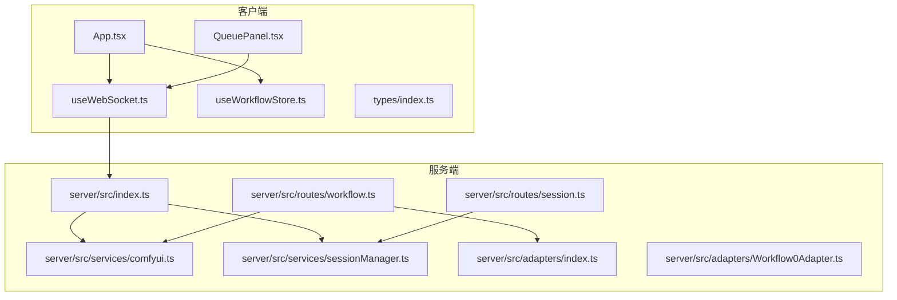
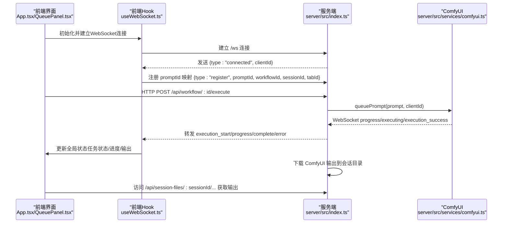
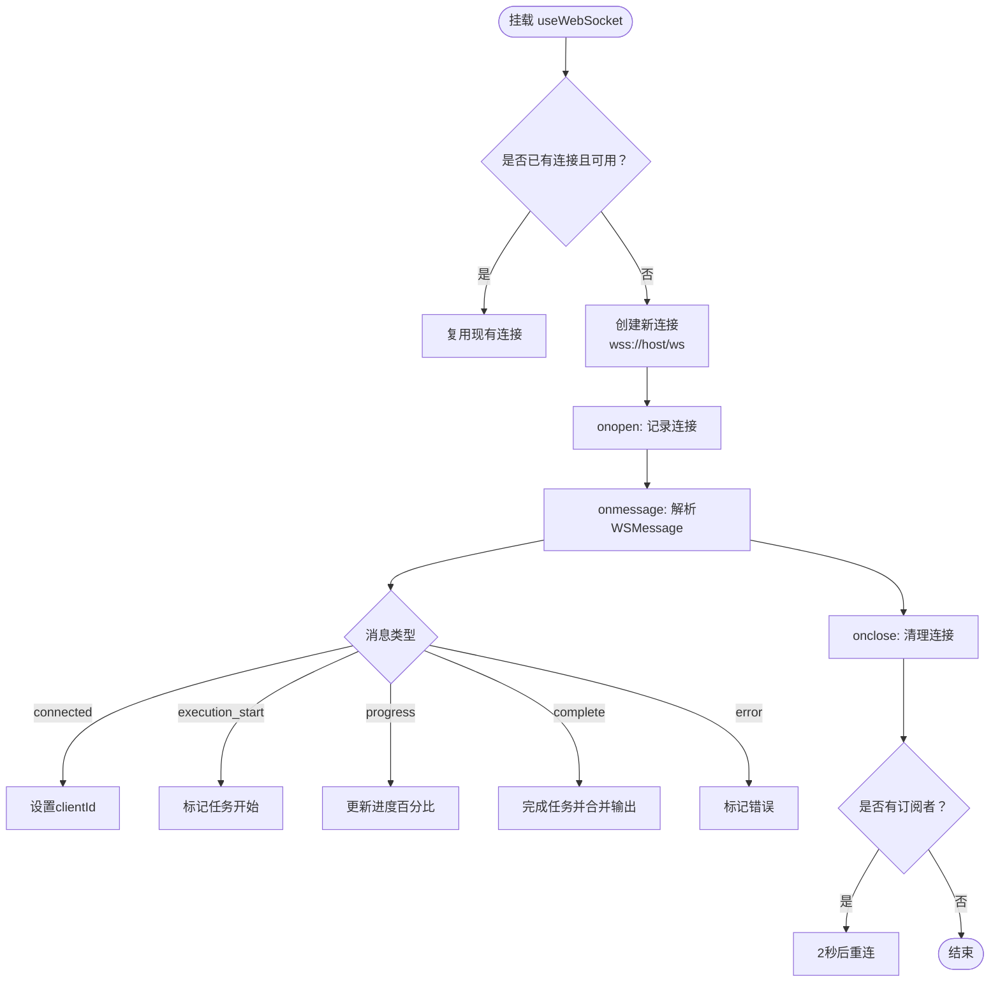
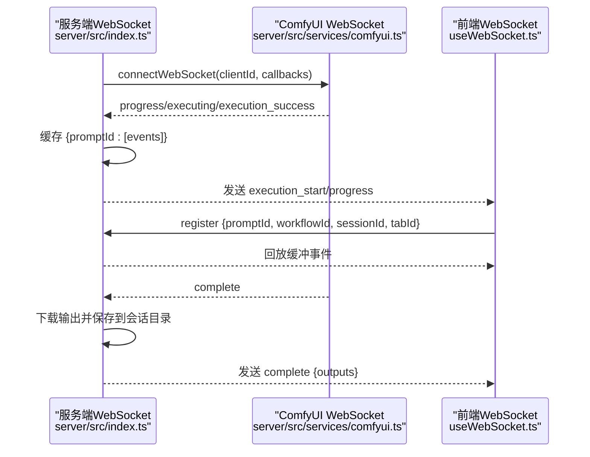
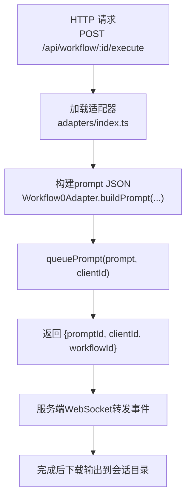
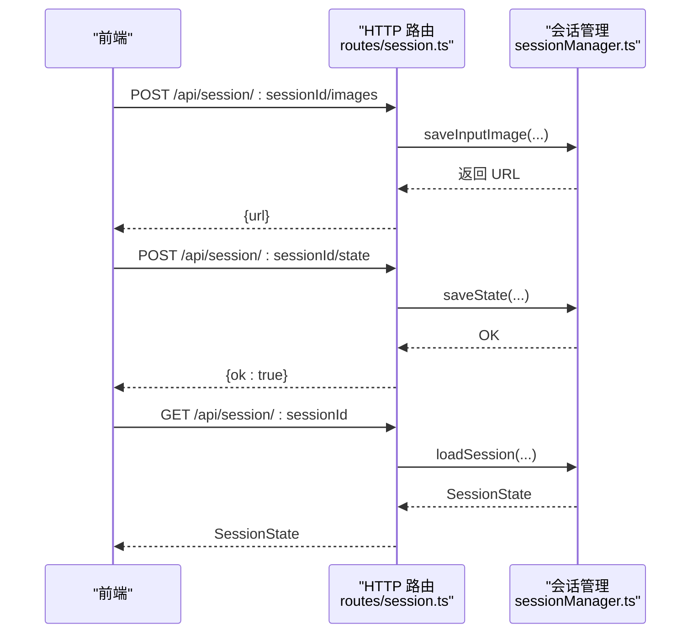
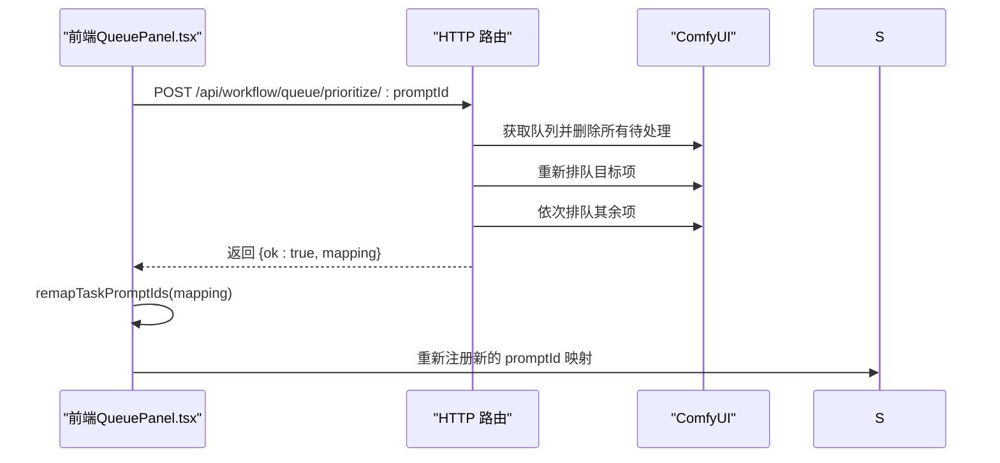
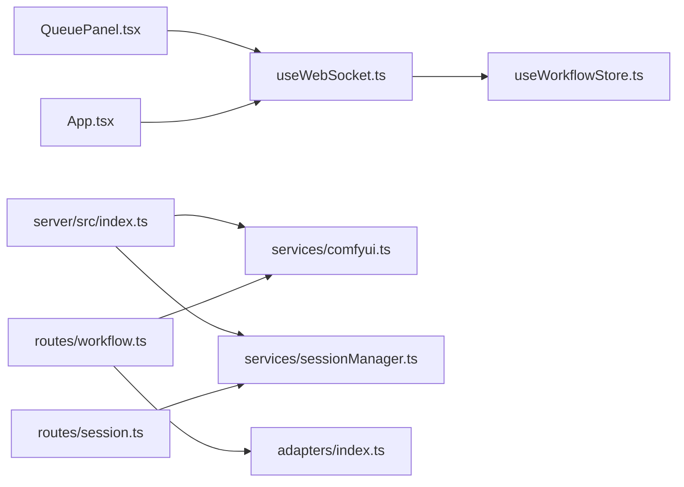

# 通信机制

<cite>
**本文引用的文件**
- [client/src/hooks/useWebSocket.ts](file://client/src/hooks/useWebSocket.ts)
- [client/src/hooks/useWorkflowStore.ts](file://client/src/hooks/useWorkflowStore.ts)
- [client/src/tabs/QueuePanel.tsx](file://client/src/components/QueuePanel.tsx)
- [client/src/components/App.tsx](file://client/src/components/App.tsx)
- [client/src/types/index.ts](file://client/src/types/index.ts)
- [server/src/index.ts](file://server/src/index.ts)
- [server/src/services/comfyui.ts](file://server/src/services/comfyui.ts)
- [server/src/services/sessionManager.ts](file://server/src/services/sessionManager.ts)
- [server/src/routes/workflow.ts](file://server/src/routes/workflow.ts)
- [server/src/routes/session.ts](file://server/src/routes/session.ts)
- [server/src/adapters/index.ts](file://server/src/adapters/index.ts)
- [server/src/adapters/Workflow0Adapter.ts](file://server/src/adapters/Workflow0Adapter.ts)
</cite>

## 目录
1. [简介](#简介)
2. [项目结构](#项目结构)
3. [核心组件](#核心组件)
4. [架构总览](#架构总览)
5. [详细组件分析](#详细组件分析)
6. [依赖关系分析](#依赖关系分析)
7. [性能考量](#性能考量)
8. [故障排查指南](#故障排查指南)
9. [结论](#结论)
10. [附录](#附录)

## 简介
本文档系统性阐述 CorineKit Pix2Real 的通信机制，重点覆盖 WebSocket 实时通信的设计与实现，包括连接管理、消息格式、错误处理与重连策略；同时解释前后端通信协议（HTTP API 与 WebSocket 消息交互模式）、状态同步机制、实时进度更新以及异步处理与并发控制。文档面向不同技术背景读者，既提供高层概览也包含代码级可视化图表与来源标注。

## 项目结构
- 前端（React + TypeScript）通过自定义 Hook 统一管理 WebSocket 连接，并以全局状态存储（Zustand）驱动 UI 与任务生命周期。
- 后端（Node.js + Express + ws）提供 HTTP API 与 WebSocket 服务，桥接 ComfyUI 的队列与实时事件，负责输出下载、会话持久化与资源清理。
- 工作流适配器将业务工作流映射为 ComfyUI 模板，统一构建 prompt JSON 并提交队列。

**图表来源**
- [client/src/components/App.tsx:74-74](file://client/src/components/App.tsx#L74-L74)
- [client/src/hooks/useWebSocket.ts:75-98](file://client/src/hooks/useWebSocket.ts#L75-L98)
- [client/src/hooks/useWorkflowStore.ts:96-644](file://client/src/hooks/useWorkflowStore.ts#L96-L644)
- [client/src/components/QueuePanel.tsx:99-116](file://client/src/components/QueuePanel.tsx#L99-L116)
- [server/src/index.ts:62-219](file://server/src/index.ts#L62-L219)
- [server/src/services/comfyui.ts:127-188](file://server/src/services/comfyui.ts#L127-L188)
- [server/src/services/sessionManager.ts:1-164](file://server/src/services/sessionManager.ts#L1-L164)
- [server/src/routes/workflow.ts:1-800](file://server/src/routes/workflow.ts#L1-L800)
- [server/src/routes/session.ts:1-95](file://server/src/routes/session.ts#L1-L95)
- [server/src/adapters/index.ts:1-31](file://server/src/adapters/index.ts#L1-L31)
- [server/src/adapters/Workflow0Adapter.ts:1-35](file://server/src/adapters/Workflow0Adapter.ts#L1-L35)

**章节来源**
- [client/src/components/App.tsx:54-335](file://client/src/components/App.tsx#L54-L335)
- [server/src/index.ts:42-228](file://server/src/index.ts#L42-L228)

## 核心组件
- 客户端 WebSocket Hook：单例连接、自动重连、消息分发与发送。
- 全局工作流状态 Store：任务状态机、进度聚合、跨标签同步。
- 服务端 WebSocket 服务器：向客户端广播执行开始、进度、完成与错误事件，缓冲并回放历史事件。
- ComfyUI 适配层：将工作流映射为模板 JSON，提交队列并监听进度与完成事件。
- 会话管理：输入/输出文件与状态的持久化与清理。

**章节来源**
- [client/src/hooks/useWebSocket.ts:1-99](file://client/src/hooks/useWebSocket.ts#L1-L99)
- [client/src/hooks/useWorkflowStore.ts:35-644](file://client/src/hooks/useWorkflowStore.ts#L35-L644)
- [server/src/index.ts:73-219](file://server/src/index.ts#L73-L219)
- [server/src/services/comfyui.ts:127-188](file://server/src/services/comfyui.ts#L127-L188)
- [server/src/services/sessionManager.ts:1-164](file://server/src/services/sessionManager.ts#L1-L164)

## 架构总览
Pix2Real 的通信链路由“前端 HTTP API + WebSocket 实时通道”构成。用户通过 HTTP 触发工作流，服务端将任务提交至 ComfyUI 队列；随后通过服务端 WebSocket 将进度与结果事件转发给前端；完成后将 ComfyUI 输出下载并落盘到会话目录，供前端按需访问。

**图表来源**
- [client/src/components/App.tsx:74-74](file://client/src/components/App.tsx#L74-L74)
- [client/src/hooks/useWebSocket.ts:26-51](file://client/src/hooks/useWebSocket.ts#L26-L51)
- [server/src/index.ts:73-219](file://server/src/index.ts#L73-L219)
- [server/src/services/comfyui.ts:127-188](file://server/src/services/comfyui.ts#L127-L188)
- [server/src/routes/workflow.ts:408-455](file://server/src/routes/workflow.ts#L408-L455)

## 详细组件分析

### 客户端 WebSocket 管理（单例、重连与消息分发）
- 单例连接：全局 WebSocket 与计数器确保多处订阅只维持一个连接；断开后按需重连。
- 自动重连：断线检测后延迟重连，避免瞬时抖动；仅当仍有订阅者时重连。
- 消息分发：解析服务端消息，根据类型更新全局状态（任务开始、进度、完成、错误）。
- 发送消息：提供 sendMessage 方法，仅在连接打开时发送。

**图表来源**
- [client/src/hooks/useWebSocket.ts:10-73](file://client/src/hooks/useWebSocket.ts#L10-L73)
- [client/src/hooks/useWebSocket.ts:75-98](file://client/src/hooks/useWebSocket.ts#L75-L98)
- [client/src/hooks/useWorkflowStore.ts:398-499](file://client/src/hooks/useWorkflowStore.ts#L398-L499)
- [client/src/types/index.ts:27-57](file://client/src/types/index.ts#L27-L57)

**章节来源**
- [client/src/hooks/useWebSocket.ts:1-99](file://client/src/hooks/useWebSocket.ts#L1-L99)
- [client/src/hooks/useWorkflowStore.ts:398-499](file://client/src/hooks/useWorkflowStore.ts#L398-L499)
- [client/src/types/index.ts:27-57](file://client/src/types/index.ts#L27-L57)

### 服务端 WebSocket 服务器（事件缓冲与回放）
- 客户端连接：为每个连接生成唯一 clientId 并立即通知客户端。
- 事件缓冲：针对每个 promptId 缓存 execution_start/progress，以便客户端注册前也能收到。
- 回放机制：客户端注册时，若该 prompt 已有缓冲事件，则立即回放。
- 完成处理：从 ComfyUI 历史中拉取输出，下载到会话目录，返回 outputs 给客户端。
- 错误处理：捕获并上报错误，清理 prompt 缓存。

**图表来源**
- [server/src/index.ts:73-219](file://server/src/index.ts#L73-L219)
- [server/src/services/comfyui.ts:127-188](file://server/src/services/comfyui.ts#L127-L188)

**章节来源**
- [server/src/index.ts:73-219](file://server/src/index.ts#L73-L219)
- [server/src/services/comfyui.ts:127-188](file://server/src/services/comfyui.ts#L127-L188)

### HTTP API 与工作流适配（请求-响应与队列）
- HTTP 路由：提供工作流执行、批量执行、取消队列、系统统计、优先级调整等接口。
- 适配器：将工作流 ID 映射到具体模板，注入图像名称与参数，构建 prompt JSON。
- 提交队列：调用 ComfyUI 队列接口，返回 promptId。
- 会话集成：在任务完成后将输出保存到会话目录，供前端静态访问。

**图表来源**
- [server/src/routes/workflow.ts:408-455](file://server/src/routes/workflow.ts#L408-L455)
- [server/src/adapters/index.ts:13-28](file://server/src/adapters/index.ts#L13-L28)
- [server/src/adapters/Workflow0Adapter.ts:16-33](file://server/src/adapters/Workflow0Adapter.ts#L16-L33)
- [server/src/services/comfyui.ts:47-60](file://server/src/services/comfyui.ts#L47-L60)

**章节来源**
- [server/src/routes/workflow.ts:1-800](file://server/src/routes/workflow.ts#L1-L800)
- [server/src/adapters/index.ts:1-31](file://server/src/adapters/index.ts#L1-L31)
- [server/src/adapters/Workflow0Adapter.ts:1-35](file://server/src/adapters/Workflow0Adapter.ts#L1-L35)
- [server/src/services/comfyui.ts:47-60](file://server/src/services/comfyui.ts#L47-L60)

### 会话持久化与输出访问
- 输入/输出文件：支持上传输入图像与掩码，保存到会话目录；输出文件保存到 output 子目录。
- 状态 JSON：序列化当前标签页数据，含任务状态、选中输出索引等。
- 静态访问：通过 /api/session-files 暴露会话文件，前端可直接访问。

**图表来源**
- [server/src/routes/session.ts:18-92](file://server/src/routes/session.ts#L18-L92)
- [server/src/services/sessionManager.ts:20-120](file://server/src/services/sessionManager.ts#L20-L120)

**章节来源**
- [server/src/routes/session.ts:1-95](file://server/src/routes/session.ts#L1-L95)
- [server/src/services/sessionManager.ts:1-164](file://server/src/services/sessionManager.ts#L1-L164)

### 队列与优先级调整（并发与重排）
- 查询队列：获取运行中与待处理项，用于 UI 展示与定位。
- 取消队列：移除待处理项。
- 优先级调整：将目标项置顶，重新排队其余项，返回 promptId 映射以便前端重注册。

**图表来源**
- [client/src/components/QueuePanel.tsx:99-116](file://client/src/components/QueuePanel.tsx#L99-L116)
- [server/src/routes/workflow.ts:571-579](file://server/src/routes/workflow.ts#L571-L579)
- [server/src/services/comfyui.ts:255-284](file://server/src/services/comfyui.ts#L255-L284)

**章节来源**
- [client/src/components/QueuePanel.tsx:99-116](file://client/src/components/QueuePanel.tsx#L99-L116)
- [server/src/routes/workflow.ts:571-579](file://server/src/routes/workflow.ts#L571-L579)
- [server/src/services/comfyui.ts:255-284](file://server/src/services/comfyui.ts#L255-L284)

## 依赖关系分析
- 前端依赖：
  - useWebSocket.ts 依赖 useWorkflowStore.ts 的状态更新方法。
  - QueuePanel.tsx 依赖 useWebSocket.ts 的 sendMessage 与 store 的 remap 逻辑。
  - App.tsx 作为入口，挂载 WebSocket 并渲染主界面。
- 后端依赖：
  - server/src/index.ts 依赖 services/comfyui.ts 与 services/sessionManager.ts。
  - routes/workflow.ts 依赖 adapters/index.ts 与 services/comfyui.ts。
  - routes/session.ts 依赖 services/sessionManager.ts。

**图表来源**
- [client/src/hooks/useWebSocket.ts:1-99](file://client/src/hooks/useWebSocket.ts#L1-L99)
- [client/src/hooks/useWorkflowStore.ts:96-644](file://client/src/hooks/useWorkflowStore.ts#L96-L644)
- [client/src/components/QueuePanel.tsx:99-116](file://client/src/components/QueuePanel.tsx#L99-L116)
- [client/src/components/App.tsx:74-74](file://client/src/components/App.tsx#L74-L74)
- [server/src/index.ts:62-219](file://server/src/index.ts#L62-L219)
- [server/src/services/comfyui.ts:127-188](file://server/src/services/comfyui.ts#L127-L188)
- [server/src/services/sessionManager.ts:1-164](file://server/src/services/sessionManager.ts#L1-L164)
- [server/src/routes/workflow.ts:1-800](file://server/src/routes/workflow.ts#L1-L800)
- [server/src/routes/session.ts:1-95](file://server/src/routes/session.ts#L1-L95)
- [server/src/adapters/index.ts:1-31](file://server/src/adapters/index.ts#L1-L31)

**章节来源**
- [client/src/hooks/useWebSocket.ts:1-99](file://client/src/hooks/useWebSocket.ts#L1-L99)
- [client/src/hooks/useWorkflowStore.ts:96-644](file://client/src/hooks/useWorkflowStore.ts#L96-L644)
- [client/src/components/QueuePanel.tsx:99-116](file://client/src/components/QueuePanel.tsx#L99-L116)
- [client/src/components/App.tsx:74-74](file://client/src/components/App.tsx#L74-L74)
- [server/src/index.ts:62-219](file://server/src/index.ts#L62-L219)
- [server/src/services/comfyui.ts:127-188](file://server/src/services/comfyui.ts#L127-L188)
- [server/src/services/sessionManager.ts:1-164](file://server/src/services/sessionManager.ts#L1-L164)
- [server/src/routes/workflow.ts:1-800](file://server/src/routes/workflow.ts#L1-L800)
- [server/src/routes/session.ts:1-95](file://server/src/routes/session.ts#L1-L95)
- [server/src/adapters/index.ts:1-31](file://server/src/adapters/index.ts#L1-L31)

## 性能考量
- 连接复用与去抖：前端使用单例连接与连接计数，避免重复握手与资源浪费。
- 事件缓冲与回放：服务端按 promptId 缓冲事件，减少客户端注册窗口内的消息丢失。
- 大体积负载：服务端启用较大 JSON 限制，满足 ComfyUI prompt 与输出元数据传输。
- 队列优先级：通过一次性删除与重排队列，降低多次 API 调用带来的延迟。
- 输出下载与落盘：完成后异步下载并保存到会话目录，避免阻塞 WebSocket 事件流。

[本节为通用指导，无需特定文件来源]

## 故障排查指南
- WebSocket 无法连接
  - 检查服务端 WebSocket 端口与路径配置，确认 /ws 是否可达。
  - 查看浏览器控制台与服务端日志中的连接与断开信息。
- 任务无进度或卡住
  - 确认 ComfyUI WebSocket 正常，服务端是否收到 progress/executing 事件。
  - 检查客户端是否正确注册 promptId 映射，避免事件丢失。
- 完成后无输出
  - 确认服务端已完成输出下载并保存到会话目录。
  - 前端通过 /api/session-files 访问输出 URL，检查权限与路径。
- 队列操作无效
  - 确认目标 promptId 仍在待处理队列中，优先级调整仅对非首项有效。
  - 检查 remap 后是否重新注册新的 promptId。

**章节来源**
- [server/src/index.ts:73-219](file://server/src/index.ts#L73-L219)
- [server/src/services/comfyui.ts:127-188](file://server/src/services/comfyui.ts#L127-L188)
- [server/src/routes/workflow.ts:571-579](file://server/src/routes/workflow.ts#L571-L579)
- [server/src/routes/session.ts:18-92](file://server/src/routes/session.ts#L18-L92)

## 结论
Pix2Real 的通信机制以“HTTP API + WebSocket 实时通道”为核心，结合事件缓冲与回放、会话持久化与输出落盘，实现了稳定可靠的任务状态同步与实时进度更新。前端通过单例 WebSocket 与全局状态管理，后端通过适配器与队列调度，形成清晰的职责边界与良好的扩展性。建议在生产环境中关注连接健康监控、队列优先级策略与输出缓存策略，以进一步提升用户体验与系统稳定性。

[本节为总结，无需特定文件来源]

## 附录

### 消息与事件类型定义
- 客户端消息类型（前端到服务端）
  - register：注册 promptId 与其工作流/会话/标签映射
- 服务端消息类型（服务端到前端）
  - connected：连接建立，携带 clientId
  - execution_start：任务开始
  - progress：进度更新（value/max/percentage）
  - complete：任务完成，携带 outputs
  - error：任务错误，携带 message

**章节来源**
- [client/src/types/index.ts:27-57](file://client/src/types/index.ts#L27-L57)
- [server/src/index.ts:73-219](file://server/src/index.ts#L73-L219)
- [server/src/services/comfyui.ts:127-188](file://server/src/services/comfyui.ts#L127-L188)