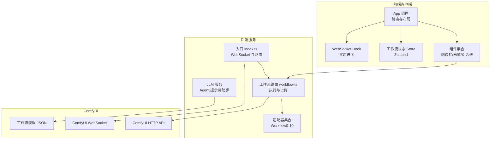
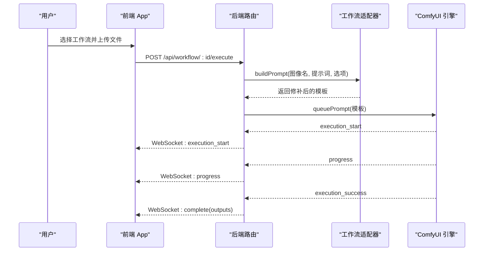
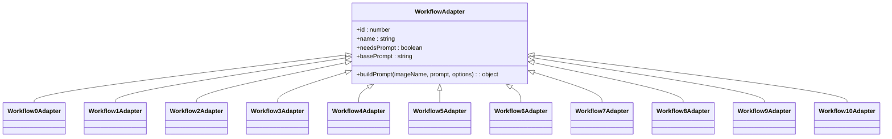
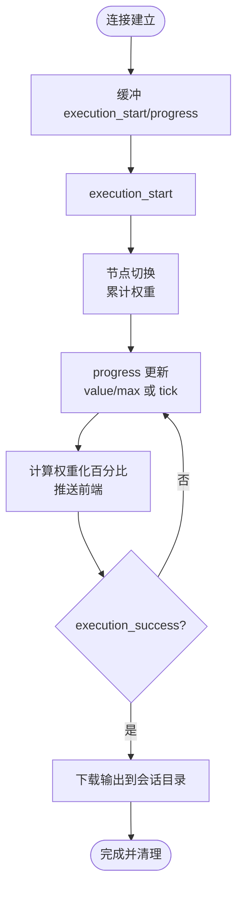
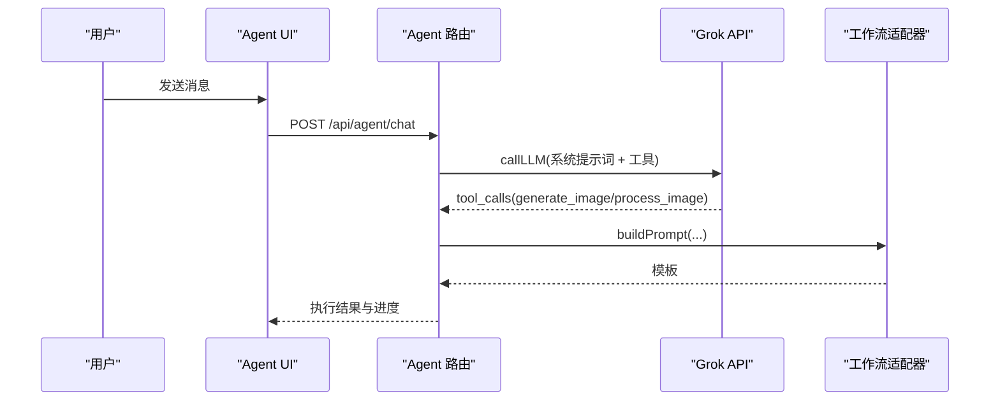
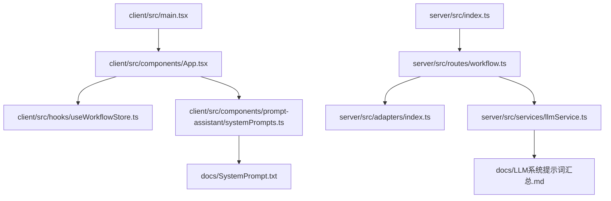

# 核心功能模块

<cite>
**本文档引用的文件**
- [README.md](file://README.md)
- [package.json](file://package.json)
- [server/src/index.ts](file://server/src/index.ts)
- [server/src/adapters/index.ts](file://server/src/adapters/index.ts)
- [server/src/routers/workflow.ts](file://server/src/routes/workflow.ts)
- [client/src/main.tsx](file://client/src/main.tsx)
- [client/src/components/App.tsx](file://client/src/components/App.tsx)
- [client/src/hooks/useWorkflowStore.ts](file://client/src/hooks/useWorkflowStore.ts)
- [docs/SystemPrompt.txt](file://docs/SystemPrompt.txt)
- [docs/LLM系统提示词汇总.md](file://docs/LLM系统提示词汇总.md)
- [server/src/services/llmService.ts](file://server/src/services/llmService.ts)
- [client/src/components/prompt-assistant/systemPrompts.ts](file://client/src/components/prompt-assistant/systemPrompts.ts)
- [docs/提示词助理开发需求/Pix2Real-提示词助手.json](file://docs/提示词助理开发需求/Pix2Real-提示词助手.json)
</cite>

## 目录
1. [简介](#简介)
2. [项目结构](#项目结构)
3. [核心组件](#核心组件)
4. [架构总览](#架构总览)
5. [详细组件分析](#详细组件分析)
6. [依赖关系分析](#依赖关系分析)
7. [性能考虑](#性能考虑)
8. [故障排除指南](#故障排除指南)
9. [结论](#结论)
10. [附录](#附录)

## 简介
CorineKit Pix2Real 是一个基于 ComfyUI 的本地 Web 图像/视频处理界面，提供 11 种 AI 处理工作流，涵盖二次元转真人、真人精修、精修放大、解除装备、真人转二次元、高清重绘、图生视频、视频补帧、SD 放大、快速出图、黑兽换脸等。系统采用前后端分离架构，前端使用 React + TypeScript，后端使用 Node.js + Express，通过 WebSocket 实时推送 ComfyUI 的执行进度，并支持会话持久化、批量处理与一键输出目录访问。

## 项目结构
项目采用典型的前后端分离结构：
- client：Vite + React + TypeScript 前端应用，负责用户界面、拖拽上传、实时进度显示、会话管理与设置面板
- server：Express + TypeScript 后端服务，负责路由、工作流适配器、ComfyUI 通信、LLM 对话与提示词助手
- ComfyUI_API：包含多种工作流的 JSON 模板，后端通过适配器加载并动态修补节点参数
- docs：系统提示词与功能设计文档

**图表来源**
- [client/src/main.tsx:1-11](file://client/src/main.tsx#L1-L11)
- [client/src/components/App.tsx:1-422](file://client/src/components/App.tsx#L1-L422)
- [server/src/index.ts:118-146](file://server/src/index.ts#L118-L146)
- [server/src/routes/workflow.ts:1-800](file://server/src/routes/workflow.ts#L1-L800)

**章节来源**
- [README.md:41-79](file://README.md#L41-L79)
- [package.json:1-15](file://package.json#L1-L15)

## 核心组件
- 工作流适配器（Workflow Adapters）：为每个工作流加载模板并修补节点参数（如图像名、提示词、种子等）
- WebSocket 进度系统：从 ComfyUI 接收执行事件，计算加权进度，向前端推送实时进度
- LLM 对话与提示词助手：集成 Grok API，提供 AI Agent 对话、提示词转换、变体生成、按需扩写等功能
- 会话与持久化：支持会话创建、任务状态管理、输出文件保存与重命名
- 批量处理：支持多文件拖拽、批量执行与输出目录一键打开

**章节来源**
- [server/src/adapters/index.ts:14-33](file://server/src/adapters/index.ts#L14-L33)
- [server/src/index.ts:157-494](file://server/src/index.ts#L157-L494)
- [client/src/hooks/useWorkflowStore.ts:71-83](file://client/src/hooks/useWorkflowStore.ts#L71-L83)

## 架构总览
系统通过 Adapter 模式加载 ComfyUI 工作流模板，后端根据用户输入修补节点参数并提交执行。ComfyUI 通过 WebSocket 将执行事件（execution_start、progress、execution_success 等）转发给前端，前端使用 Zustand 管理状态并渲染进度与结果。LLM 服务通过工具调用（Function Calling）与用户交互，实现智能提示词生成与工作流选择。

**图表来源**
- [server/src/routes/workflow.ts:750-799](file://server/src/routes/workflow.ts#L750-L799)
- [server/src/index.ts:272-448](file://server/src/index.ts#L272-L448)

## 详细组件分析

### 工作流执行与适配器
- 适配器集合：包含 0-10 的适配器，分别对应不同工作流
- 通用执行接口：/:id/execute 接受单张图片，调用对应适配器构建模板并提交
- 特殊工作流：
  - 5/10：需要图像与蒙版（解除装备/区域编辑）
  - 7：快速出图（文本到图像），支持 LoRA 链式连接
  - 8：黑兽换脸（目标图 + 面部参考图）
  - 9：ZIT快出（UNet + LoRA，AuraFlow Shift）

**图表来源**
- [server/src/adapters/index.ts:14-33](file://server/src/adapters/index.ts#L14-L33)

**章节来源**
- [server/src/routes/workflow.ts:163-267](file://server/src/routes/workflow.ts#L163-L267)
- [server/src/routes/workflow.ts:269-405](file://server/src/routes/workflow.ts#L269-L405)
- [server/src/routes/workflow.ts:485-593](file://server/src/routes/workflow.ts#L485-L593)
- [server/src/routes/workflow.ts:595-642](file://server/src/routes/workflow.ts#L595-L642)

### WebSocket 实时进度与下载
- 事件缓冲：在客户端注册前捕获 execution_start/progress，避免漏掉首卡进度
- 权重化进度：基于节点权重（模型加载=15，采样=steps，编码/VAE=2-3）计算全局百分比
- 完成回调：等待 ComfyUI 历史完成（retry 机制），下载输出并保存到会话目录
- 多轮节点：对 tiled sampler 或多轮节点使用 tick 计数推进进度

**图表来源**
- [server/src/index.ts:175-448](file://server/src/index.ts#L175-L448)

**章节来源**
- [server/src/index.ts:157-494](file://server/src/index.ts#L157-L494)

### AI Agent 对话系统与提示词助手
- AI Agent：通过 Function Calling 工具选择工作流（generate_image/process_image/text_response），根据用户偏好画像与 LoRA 目录自动匹配参数
- 提示词助手：支持自然语言→标签、标签→自然语言、创建变体、按需扩写、脑补后续、生成剧本等模式
- LLM 提示词：包含系统提示词、暖场建议、后续建议、Groq 图片反推提示词等

**图表来源**
- [server/src/services/llmService.ts:192-302](file://server/src/services/llmService.ts#L192-L302)
- [server/src/routes/workflow.ts:750-799](file://server/src/routes/workflow.ts#L750-L799)

**章节来源**
- [docs/LLM系统提示词汇总.md:7-112](file://docs/LLM系统提示词汇总.md#L7-L112)
- [docs/SystemPrompt.txt:1-146](file://docs/SystemPrompt.txt#L1-L146)
- [client/src/components/prompt-assistant/systemPrompts.ts:4-153](file://client/src/components/prompt-assistant/systemPrompts.ts#L4-L153)

### 11 种工作流详解

#### 0-二次元转真人
- 功能特点：将动漫角色图像转换为真实照片风格，支持 qwen/klein/kleinpro 模型
- 输入要求：单张图像
- 参数配置：模型选择（qwen/klein/kleinpro/seedvr2）、用户提示词
- 输出效果：真实感增强、细节修复、色调保持
- 最佳实践：使用 Klein/Klein Pro 模型获得更高质量的真实感；合理设置提示词突出亚洲人特征
- 常见问题：模型文件未找到时需检查 ComfyUI 模型安装

**章节来源**
- [server/src/routes/workflow.ts:644-687](file://server/src/routes/workflow.ts#L644-L687)

#### 1-真人精修
- 功能特点：对真实人像进行细节优化与风格修复
- 输入要求：单张图像
- 参数配置：用户提示词（可选）
- 输出效果：皮肤质感提升、光影细节增强、整体和谐度改善
- 最佳实践：结合 LoRA 模型与合适的采样参数；注意避免过度锐化

**章节来源**
- [server/src/routes/workflow.ts:750-799](file://server/src/routes/workflow.ts#L750-L799)

#### 2-精修放大
- 功能特点：在保持细节的前提下提升图像分辨率
- 输入要求：单张图像
- 参数配置：模型选择（seedvr2/klein/kleinpro/sd/remacri）、随机种子
- 输出效果：清晰度提升、噪点减少、边缘锐利度改善
- 最佳实践：SD 放大适合追求极致分辨率；Remacri 模型适合特定风格

**章节来源**
- [server/src/routes/workflow.ts:689-748](file://server/src/routes/workflow.ts#L689-L748)

#### 5-解除装备
- 功能特点：基于蒙版移除图像中的人物装备（如武器、饰品）
- 输入要求：图像 + 蒙版
- 参数配置：backPose 开关、用户提示词
- 输出效果：装备自然消失、背景无缝修复
- 最佳实践：蒙版精度决定最终效果；backPose 用于处理背面姿态

**章节来源**
- [server/src/routes/workflow.ts:163-215](file://server/src/routes/workflow.ts#L163-L215)

#### 6-真人转二次元
- 功能特点：将真实照片转换为动漫风格
- 输入要求：单张图像
- 参数配置：用户提示词（可选）
- 输出效果：动漫风格还原、色彩与线条优化
- 最佳实践：适当增加风格相关提示词以强化二次元特征

**章节来源**
- [server/src/routes/workflow.ts:750-799](file://server/src/routes/workflow.ts#L750-L799)

#### 7-快速出图（文本到图像）
- 功能特点：根据自然语言描述生成图像，支持 LoRA 链式连接
- 输入要求：JSON 参数（模型、LoRA、提示词、尺寸、采样参数等）
- 参数配置：模型、LoRA 列表、正负提示词、宽高、步数、CFG、采样器、调度器、名称
- 输出效果：高质量图像生成，支持批量变体
- 最佳实践：合理选择 LoRA 与权重；注意提示词排序优先级

**章节来源**
- [server/src/routes/workflow.ts:269-405](file://server/src/routes/workflow.ts#L269-L405)

#### 8-黑兽换脸
- 功能特点：将目标图像中的面部替换为参考图像的面部
- 输入要求：目标图像 + 面部参考图
- 参数配置：随机种子
- 输出效果：面部融合自然、光照与角度匹配
- 最佳实践：确保参考图面部清晰、角度合适；避免过度曝光

**章节来源**
- [server/src/routes/workflow.ts:595-642](file://server/src/routes/workflow.ts#L595-L642)

#### 9-ZIT快出（UNet + LoRA）
- 功能特点：基于 AuraFlow 的快速高质量生成，支持 UNet 与 LoRA
- 输入要求：JSON 参数（UNet 模型、LoRA、Shift 开关、提示词、尺寸、采样参数等）
- 参数配置：UNet 模型、LoRA 列表、Shift 开关与权重、提示词、宽高、步数、CFG、采样器、调度器
- 输出效果：快速高质量图像，支持 AuraFlow Shift
- 最佳实践：合理配置 Shift 与 LoRA；注意提示词与风格一致性

**章节来源**
- [server/src/routes/workflow.ts:485-593](file://server/src/routes/workflow.ts#L485-L593)

#### 3-图生视频（文本到视频）
- 功能特点：根据图像生成视频序列
- 输入要求：单张图像
- 参数配置：用户提示词（可选）
- 输出效果：视频帧序列生成，支持不同风格与运动效果
- 最佳实践：合理设置提示词以控制视频内容与运动方向

**章节来源**
- [server/src/routes/workflow.ts:750-799](file://server/src/routes/workflow.ts#L750-L799)

#### 4-视频补帧
- 功能特点：对视频进行帧插值以提升流畅度
- 输入要求：视频文件
- 参数配置：工作流内参数（由模板决定）
- 输出效果：视频播放更流畅，减少抖动感
- 最佳实践：选择合适的插值算法与帧率目标

**章节来源**
- [server/src/routes/workflow.ts:750-799](file://server/src/routes/workflow.ts#L750-L799)

#### 10-区域编辑
- 功能特点：基于蒙版对图像特定区域进行编辑
- 输入要求：图像 + 蒙版
- 参数配置：backPose 开关、用户提示词（必须提供）
- 输出效果：局部区域精准编辑，保持其他区域不变
- 最佳实践：蒙版绘制精细；提示词针对目标区域描述

**章节来源**
- [server/src/routes/workflow.ts:217-267](file://server/src/routes/workflow.ts#L217-L267)

### 智能编辑功能实现原理

#### AI Agent 对话系统
- 工具定义：generate_image、process_image、text_response
- 系统提示词：包含用户偏好画像、可用模型与 LoRA 列表、批量变体规则、角色 LoRA 外貌约束等
- 多轮编辑：基于历史生成记录进行参数联动修改，确保 LoRA 与提示词一致性

**章节来源**
- [server/src/services/llmService.ts:192-302](file://server/src/services/llmService.ts#L192-L302)
- [docs/LLM系统提示词汇总.md:7-112](file://docs/LLM系统提示词汇总.md#L7-L112)

#### 提示词助手
- 模式支持：自然语言→标签、标签→自然语言、创建变体、按需扩写、脑补后续、生成剧本
- LLaMA 模型：使用 Qwen3-VL Instruct 模型执行推理
- 工作流集成：通过 ComfyUI 工作流节点执行不同模式的提示词转换

**章节来源**
- [client/src/components/prompt-assistant/systemPrompts.ts:4-153](file://client/src/components/prompt-assistant/systemPrompts.ts#L4-L153)
- [docs/SystemPrompt.txt:25-146](file://docs/SystemPrompt.txt#L25-L146)
- [docs/提示词助理开发需求/Pix2Real-提示词助手.json:1-106](file://docs/提示词助理开发需求/Pix2Real-提示词助手.json#L1-L106)

#### 提示词反推功能
- Grok 图片反推：根据图片内容输出英文标签或中文描述，支持二次元/真实照片/混合风格
- 标签数量与长度限制：控制在 15-40 个标签之间，输出不超过 200 字

**章节来源**
- [docs/LLM系统提示词汇总.md:211-224](file://docs/LLM系统提示词汇总.md#L211-L224)

## 依赖关系分析

**图表来源**
- [client/src/main.tsx:1-11](file://client/src/main.tsx#L1-L11)
- [client/src/components/App.tsx:1-422](file://client/src/components/App.tsx#L1-L422)
- [client/src/hooks/useWorkflowStore.ts:1-800](file://client/src/hooks/useWorkflowStore.ts#L1-L800)
- [server/src/index.ts:118-146](file://server/src/index.ts#L118-L146)
- [server/src/routes/workflow.ts:1-800](file://server/src/routes/workflow.ts#L1-L800)
- [server/src/adapters/index.ts:14-33](file://server/src/adapters/index.ts#L14-L33)
- [server/src/services/llmService.ts:1-800](file://server/src/services/llmService.ts#L1-L800)
- [client/src/components/prompt-assistant/systemPrompts.ts:4-153](file://client/src/components/prompt-assistant/systemPrompts.ts#L4-L153)
- [docs/SystemPrompt.txt:1-146](file://docs/SystemPrompt.txt#L1-L146)
- [docs/LLM系统提示词汇总.md:1-435](file://docs/LLM系统提示词汇总.md#L1-L435)

**章节来源**
- [package.json:1-15](file://package.json#L1-L15)
- [README.md:41-79](file://README.md#L41-L79)

## 性能考虑
- WebSocket 进度权重：通过节点权重与多轮 tick 计数实现更准确的进度估计，避免回退
- 输出下载优化：仅在存在会话时下载输出，节省带宽与磁盘 I/O
- 模型加载与 VRAM：提供释放内存工作流，支持在长时间使用后清理显存
- 批量处理：前端支持多文件拖拽与批量执行，后端按队列顺序提交 ComfyUI

## 故障排除指南
- ComfyUI 未运行：后端启动时尝试自动启动，若失败需手动启动 ComfyUI
- 模型文件未找到：检查 ComfyUI 模型安装路径与文件名
- 工作流提交失败：确认客户端 ID 与网络连接正常
- 进度异常：前端会重放缓冲事件，若仍异常可刷新页面重新注册
- 输出为空：后端对历史完成状态进行重试等待，若仍为空可检查 ComfyUI 输出目录

**章节来源**
- [server/src/index.ts:498-516](file://server/src/index.ts#L498-L516)
- [server/src/routes/workflow.ts:126-150](file://server/src/routes/workflow.ts#L126-L150)

## 结论
CorineKit Pix2Real 通过 Adapter 模式与 WebSocket 实时进度系统，提供了稳定高效的工作流执行体验。AI Agent 与提示词助手进一步提升了提示词工程效率与创作体验。建议在实际使用中结合工作流特性与模型偏好，合理配置参数与提示词，以获得最佳输出效果。

## 附录
- 配置示例与自定义选项
  - 快速出图：通过 JSON 参数传入模型、LoRA、提示词、尺寸、采样参数等
  - ZIT快出：选择 UNet 模型与 LoRA，配置 Shift 开关与权重
  - 解除装备/区域编辑：准备高质量蒙版，启用 backPose 以处理背面姿态
  - 黑兽换脸：确保目标图像与参考图像面部清晰、角度合适
- 最佳实践
  - 提示词排序：视角/构图 > 人数/主体 > 角色特征 > 表情 > 动作/姿势 > 服装 > 背景 > 风格 > LoRA 触发词
  - 角色 LoRA 外貌约束：避免在提示词中重复角色固有外貌标签
  - 批量变体：通常生成 3-5 个变体，避免超过 6 个