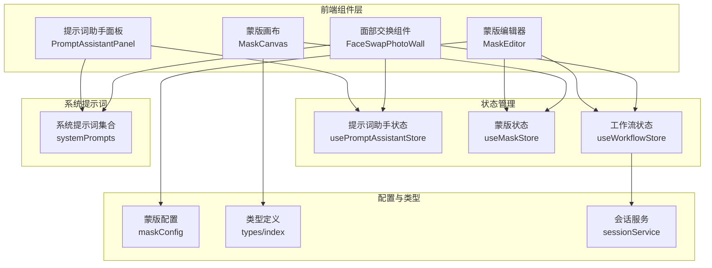
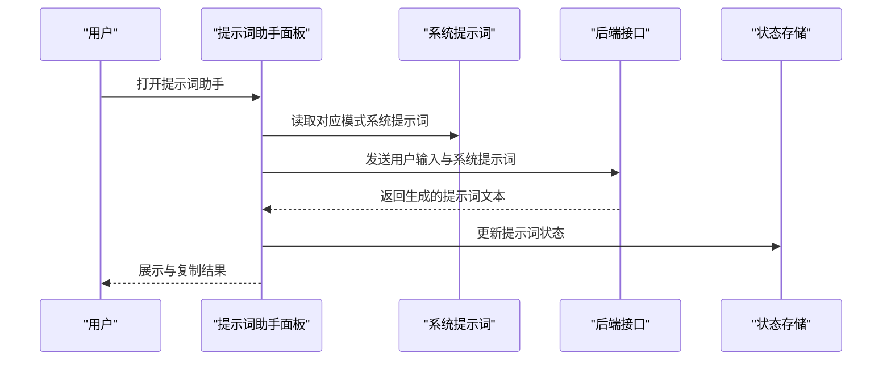
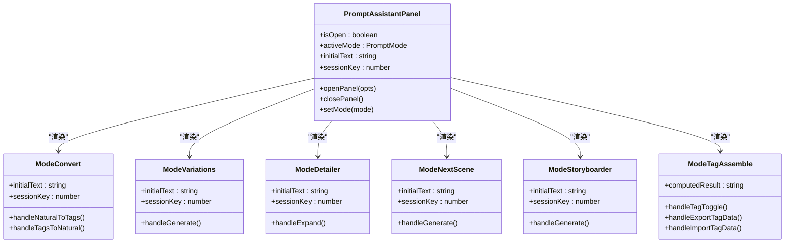
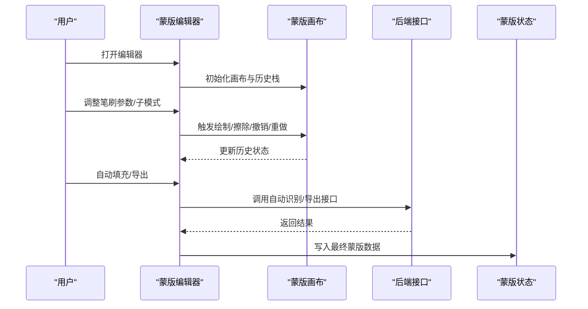
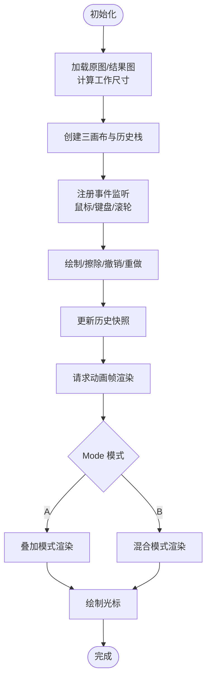
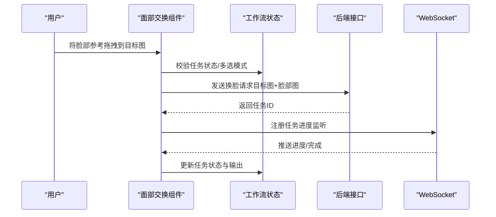
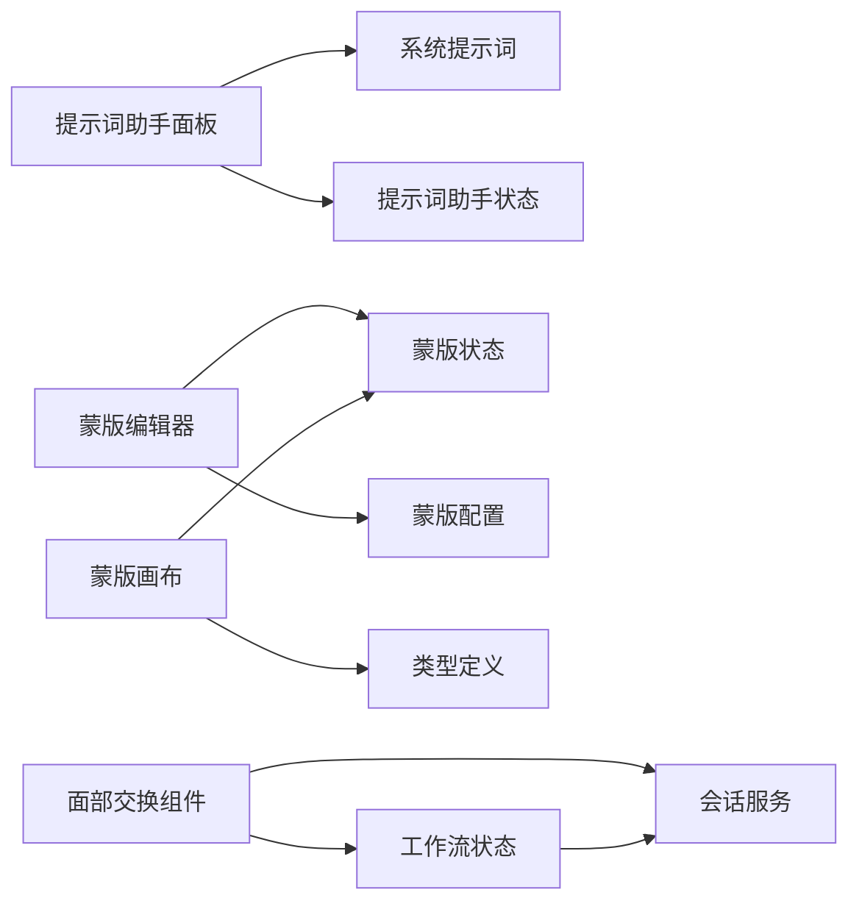

# 专业功能组件

<cite>
**本文档引用的文件**
- [PromptAssistantPanel.tsx](file://client/src/components/PromptAssistantPanel.tsx)
- [MaskEditor.tsx](file://client/src/components/MaskEditor.tsx)
- [MaskCanvas.tsx](file://client/src/components/MaskCanvas.tsx)
- [FaceSwapPhotoWall.tsx](file://client/src/components/FaceSwapPhotoWall.tsx)
- [usePromptAssistantStore.ts](file://client/src/hooks/usePromptAssistantStore.ts)
- [useMaskStore.ts](file://client/src/hooks/useMaskStore.ts)
- [useWorkflowStore.ts](file://client/src/hooks/useWorkflowStore.ts)
- [maskConfig.ts](file://client/src/config/maskConfig.ts)
- [systemPrompts.ts](file://client/src/components/prompt-assistant/systemPrompts.ts)
- [ModeConvert.tsx](file://client/src/components/prompt-assistant/ModeConvert.tsx)
- [ModeVariations.tsx](file://client/src/components/prompt-assistant/ModeVariations.tsx)
- [ModeDetailer.tsx](file://client/src/components/prompt-assistant/ModeDetailer.tsx)
- [ModeNextScene.tsx](file://client/src/components/prompt-assistant/ModeNextScene.tsx)
- [ModeStoryboarder.tsx](file://client/src/components/prompt-assistant/ModeStoryboarder.tsx)
- [ModeTagAssemble.tsx](file://client/src/components/prompt-assistant/ModeTagAssemble.tsx)
- [sessionService.ts](file://client/src/services/sessionService.ts)
- [index.ts](file://client/src/types/index.ts)
</cite>

## 目录
1. [简介](#简介)
2. [项目结构](#项目结构)
3. [核心组件](#核心组件)
4. [架构总览](#架构总览)
5. [详细组件分析](#详细组件分析)
6. [依赖关系分析](#依赖关系分析)
7. [性能考量](#性能考量)
8. [故障排除指南](#故障排除指南)
9. [结论](#结论)
10. [附录](#附录)

## 简介
本文件系统性梳理 CorineKit Pix2Real 的专业功能组件，重点覆盖提示词助手面板（PromptAssistantPanel）、蒙版编辑器（MaskEditor）、蒙版画布（MaskCanvas）、面部交换组件（FaceSwapPhotoWall）。文档从架构设计、数据流、处理逻辑、交互模式、工具集与参数配置等维度进行深入解析，并提供使用示例与最佳实践，帮助用户高效掌握 AI 提示词生成、智能蒙版绘制、面部交换等高级图像处理能力。

## 项目结构
专业功能组件主要位于客户端前端目录 client/src/components 与 client/src/hooks 中，配合服务端接口与会话持久化服务，形成完整的专业工作流闭环。

**图表来源**
- [PromptAssistantPanel.tsx:1-139](file://client/src/components/PromptAssistantPanel.tsx#L1-L139)
- [MaskEditor.tsx:1-375](file://client/src/components/MaskEditor.tsx#L1-L375)
- [MaskCanvas.tsx:1-677](file://client/src/components/MaskCanvas.tsx#L1-L677)
- [FaceSwapPhotoWall.tsx:1-861](file://client/src/components/FaceSwapPhotoWall.tsx#L1-L861)
- [usePromptAssistantStore.ts:1-33](file://client/src/hooks/usePromptAssistantStore.ts#L1-L33)
- [useMaskStore.ts:1-51](file://client/src/hooks/useMaskStore.ts#L1-L51)
- [useWorkflowStore.ts:1-645](file://client/src/hooks/useWorkflowStore.ts#L1-L645)
- [maskConfig.ts:1-20](file://client/src/config/maskConfig.ts#L1-L20)
- [systemPrompts.ts:1-145](file://client/src/components/prompt-assistant/systemPrompts.ts#L1-L145)
- [sessionService.ts:1-134](file://client/src/services/sessionService.ts#L1-L134)
- [index.ts:1-58](file://client/src/types/index.ts#L1-L58)

**章节来源**
- [PromptAssistantPanel.tsx:1-139](file://client/src/components/PromptAssistantPanel.tsx#L1-L139)
- [MaskEditor.tsx:1-375](file://client/src/components/MaskEditor.tsx#L1-L375)
- [MaskCanvas.tsx:1-677](file://client/src/components/MaskCanvas.tsx#L1-L677)
- [FaceSwapPhotoWall.tsx:1-861](file://client/src/components/FaceSwapPhotoWall.tsx#L1-L861)

## 核心组件
- 提示词助手面板（PromptAssistantPanel）：提供多模式提示词处理界面，包含标签转换、变体生成、按需扩写、后续场景脑补、分镜生成、标签合成器等模式，通过系统提示词驱动 AI 生成高质量提示词。
- 蒙版编辑器（MaskEditor）：提供智能蒙版绘制与编辑能力，支持多种笔刷参数（大小、硬度、不透明度）、撤销/重做、自动填充、导出混合结果等功能，适配 Mode A 叠加与 Mode B 实时混合两种模式。
- 蒙版画布（MaskCanvas）：高性能离屏渲染与非累积软笔刷算法实现，支持缩放平移、实时预览、历史记录、遮罩叠加显示等，确保精细蒙版绘制体验。
- 面部交换组件（FaceSwapPhotoWall）：提供拖拽式面部交换工作流，支持脸部参考与目标图分区、多选批量换脸、跨图拖拽、任务队列与进度跟踪等。

**章节来源**
- [PromptAssistantPanel.tsx:19-139](file://client/src/components/PromptAssistantPanel.tsx#L19-L139)
- [MaskEditor.tsx:141-375](file://client/src/components/MaskEditor.tsx#L141-L375)
- [MaskCanvas.tsx:39-677](file://client/src/components/MaskCanvas.tsx#L39-L677)
- [FaceSwapPhotoWall.tsx:213-861](file://client/src/components/FaceSwapPhotoWall.tsx#L213-L861)

## 架构总览
专业功能组件围绕状态管理与工作流展开，提示词助手通过系统提示词调用后端接口；蒙版编辑器与画布负责蒙版绘制与历史管理；面部交换组件负责图像拖拽与任务编排。会话服务贯穿于状态持久化与资源上传。

**图表来源**
- [PromptAssistantPanel.tsx:19-139](file://client/src/components/PromptAssistantPanel.tsx#L19-L139)
- [systemPrompts.ts:4-145](file://client/src/components/prompt-assistant/systemPrompts.ts#L4-L145)
- [ModeConvert.tsx:5-14](file://client/src/components/prompt-assistant/ModeConvert.tsx#L5-L14)
- [usePromptAssistantStore.ts:15-32](file://client/src/hooks/usePromptAssistantStore.ts#L15-L32)

## 详细组件分析

### 提示词助手面板（PromptAssistantPanel）
- 功能定位：统一入口，承载多模式提示词处理，支持标签与自然语言双向转换、提示词变体生成、按需扩写、后续场景脑补、分镜生成、标签合成器。
- 交互模式：顶部标签页切换不同模式；右侧内容区域根据激活模式加载对应子组件；支持复制结果、加载状态提示。
- 参数配置：通过系统提示词集合（systemPrompts）控制各模式的提示词模板；支持初始文本注入与会话键值更新。
- 集成方式：与工作流状态联动，便于在不同工作流中复用生成的提示词。

**图表来源**
- [PromptAssistantPanel.tsx:19-139](file://client/src/components/PromptAssistantPanel.tsx#L19-L139)
- [ModeConvert.tsx:32-195](file://client/src/components/prompt-assistant/ModeConvert.tsx#L32-L195)
- [ModeVariations.tsx:32-151](file://client/src/components/prompt-assistant/ModeVariations.tsx#L32-L151)
- [ModeDetailer.tsx:32-142](file://client/src/components/prompt-assistant/ModeDetailer.tsx#L32-L142)
- [ModeNextScene.tsx:32-142](file://client/src/components/prompt-assistant/ModeNextScene.tsx#L32-L142)
- [ModeStoryboarder.tsx:32-171](file://client/src/components/prompt-assistant/ModeStoryboarder.tsx#L32-L171)
- [ModeTagAssemble.tsx:60-805](file://client/src/components/prompt-assistant/ModeTagAssemble.tsx#L60-L805)

**章节来源**
- [PromptAssistantPanel.tsx:19-139](file://client/src/components/PromptAssistantPanel.tsx#L19-L139)
- [usePromptAssistantStore.ts:15-32](file://client/src/hooks/usePromptAssistantStore.ts#L15-L32)
- [systemPrompts.ts:4-145](file://client/src/components/prompt-assistant/systemPrompts.ts#L4-L145)

### 蒙版编辑器（MaskEditor）
- 功能定位：提供蒙版绘制与编辑的完整工作流，支持 Mode A 叠加与 Mode B 实时混合两种模式，具备撤销/重做、清空、反转、自动填充、导出混合结果等能力。
- 工具集：笔刷尺寸、硬度、不透明度调节；子模式切换（暗色叠加/高亮显示/红色叠加）；键盘快捷键（Ctrl+Z/Y 撤销/重做、Alt+滚轮调整尺寸、T+滚轮调整不透明度）。
- 参数配置：通过 maskConfig 控制不同工作流的蒙版模式；使用 useMaskStore 管理蒙版数据与编辑器状态。
- 集成方式：与 MaskCanvas 协作完成绘制与渲染；与会话服务结合实现蒙版持久化。

**图表来源**
- [MaskEditor.tsx:141-375](file://client/src/components/MaskEditor.tsx#L141-L375)
- [MaskCanvas.tsx:39-677](file://client/src/components/MaskCanvas.tsx#L39-L677)
- [useMaskStore.ts:32-50](file://client/src/hooks/useMaskStore.ts#L32-L50)
- [maskConfig.ts:5-16](file://client/src/config/maskConfig.ts#L5-L16)

**章节来源**
- [MaskEditor.tsx:141-375](file://client/src/components/MaskEditor.tsx#L141-L375)
- [useMaskStore.ts:12-50](file://client/src/hooks/useMaskStore.ts#L12-L50)
- [maskConfig.ts:3-20](file://client/src/config/maskConfig.ts#L3-L20)

### 蒙版画布（MaskCanvas）
- 设计要点：采用三画布分层渲染（底图/遮罩叠加/光标指示），离屏 Canvas 提升性能；非累积软笔刷算法避免边缘硬化；历史栈支持撤销/重做；支持 Mode A 叠加与 Mode B 混合渲染。
- 处理逻辑：初始化加载原图与结果图（Mode B），计算工作尺寸与缩放比例，建立历史快照；事件层监听鼠标/键盘操作，实时更新画布；渲染回调稳定，减少重绘开销。
- 性能特性：请求动画帧驱动渲染；仅在脏标记变化时重绘；OffscreenCanvas 避免主线程阻塞；历史栈上限控制内存占用。

**图表来源**
- [MaskCanvas.tsx:403-454](file://client/src/components/MaskCanvas.tsx#L403-L454)
- [MaskCanvas.tsx:516-613](file://client/src/components/MaskCanvas.tsx#L516-L613)
- [MaskCanvas.tsx:615-662](file://client/src/components/MaskCanvas.tsx#L615-L662)

**章节来源**
- [MaskCanvas.tsx:39-677](file://client/src/components/MaskCanvas.tsx#L39-L677)

### 面部交换组件（FaceSwapPhotoWall）
- 功能定位：提供拖拽式面部交换工作流，支持脸部参考与目标图分区、多选批量换脸、跨图拖拽、任务队列与进度跟踪。
- 交互模式：左右分区布局，左区为“脸部参考”，右区为目标图；支持长按进入多选模式；拖拽将脸部参考图到目标图上触发换脸任务；支持删除选中图片与取消选择。
- 参数配置：通过 useWorkflowStore 管理图片列表、任务状态、选择状态与换脸分区；与 WebSocket 通信接收任务进度与完成通知。
- 集成方式：调用后端接口执行换脸任务，发送注册消息以便订阅进度；支持批量队列与去重处理。

**图表来源**
- [FaceSwapPhotoWall.tsx:257-282](file://client/src/components/FaceSwapPhotoWall.tsx#L257-L282)
- [FaceSwapPhotoWall.tsx:304-333](file://client/src/components/FaceSwapPhotoWall.tsx#L304-L333)
- [useWorkflowStore.ts:377-396](file://client/src/hooks/useWorkflowStore.ts#L377-L396)

**章节来源**
- [FaceSwapPhotoWall.tsx:213-861](file://client/src/components/FaceSwapPhotoWall.tsx#L213-L861)
- [useWorkflowStore.ts:148-161](file://client/src/hooks/useWorkflowStore.ts#L148-L161)

## 依赖关系分析
- 组件耦合：提示词助手面板与系统提示词强关联；蒙版编辑器依赖蒙版状态与配置；蒙版画布依赖蒙版状态与类型定义；面部交换组件依赖工作流状态与会话服务。
- 状态管理：usePromptAssistantStore、useMaskStore、useWorkflowStore 形成独立状态域，通过组件间的数据传递与事件通信协同工作。
- 外部依赖：后端接口提供提示词生成、蒙版自动识别与导出、换脸任务执行与进度推送；会话服务负责状态持久化与资源上传。

**图表来源**
- [usePromptAssistantStore.ts:15-32](file://client/src/hooks/usePromptAssistantStore.ts#L15-L32)
- [useMaskStore.ts:32-50](file://client/src/hooks/useMaskStore.ts#L32-L50)
- [useWorkflowStore.ts:96-113](file://client/src/hooks/useWorkflowStore.ts#L96-L113)
- [maskConfig.ts:5-16](file://client/src/config/maskConfig.ts#L5-L16)
- [index.ts:1-58](file://client/src/types/index.ts#L1-L58)
- [sessionService.ts:69-134](file://client/src/services/sessionService.ts#L69-L134)

**章节来源**
- [usePromptAssistantStore.ts:15-32](file://client/src/hooks/usePromptAssistantStore.ts#L15-L32)
- [useMaskStore.ts:32-50](file://client/src/hooks/useMaskStore.ts#L32-L50)
- [useWorkflowStore.ts:96-113](file://client/src/hooks/useWorkflowStore.ts#L96-L113)
- [maskConfig.ts:5-16](file://client/src/config/maskConfig.ts#L5-L16)
- [index.ts:1-58](file://client/src/types/index.ts#L1-L58)
- [sessionService.ts:69-134](file://client/src/services/sessionService.ts#L69-L134)

## 性能考量
- 渲染性能：蒙版画布采用离屏 Canvas 与请求动画帧渲染，避免主线程阻塞；仅在脏标记变化时重绘，降低重绘频率。
- 历史管理：历史栈上限控制（默认 30 步），防止内存膨胀；撤销/重做操作基于快照数组索引移动。
- 图像处理：自动识别与导出阶段使用 OffscreenCanvas 进行像素级处理，避免 DOM 操作带来的性能损耗。
- 交互响应：键盘与滚轮事件在编辑器外层统一处理，避免重复绑定导致的性能问题；笔刷参数通过稳定回调引用更新，减少不必要的重渲染。

[本节为通用性能指导，无需特定文件引用]

## 故障排除指南
- 提示词助手报错：检查后端接口返回状态，确认系统提示词模板是否正确加载；查看网络面板与控制台错误信息。
- 蒙版自动识别失败：确认上传的原图格式与尺寸符合要求；检查后端自动识别接口返回的错误信息；尝试更换图像或调整对比度。
- 蒙版导出异常：确认导出对话框中的文件名与路径；检查后端导出接口返回的保存路径；验证浏览器跨域设置与权限。
- 面部交换任务失败：检查目标图与脸部图的尺寸与清晰度；确认 WebSocket 连接状态与任务注册；查看任务状态与错误信息。

**章节来源**
- [ModeConvert.tsx:45-69](file://client/src/components/prompt-assistant/ModeConvert.tsx#L45-L69)
- [MaskEditor.tsx:196-235](file://client/src/components/MaskEditor.tsx#L196-L235)
- [MaskEditor.tsx:363-371](file://client/src/components/MaskEditor.tsx#L363-L371)
- [FaceSwapPhotoWall.tsx:257-282](file://client/src/components/FaceSwapPhotoWall.tsx#L257-L282)

## 结论
提示词助手面板、蒙版编辑器、蒙版画布与面部交换组件共同构成了 Pix2Real 的专业功能体系。它们通过明确的职责划分、稳定的交互模式与高效的渲染机制，为用户提供从提示词生成、蒙版绘制到面部交换的完整工作流。配合状态管理与会话服务，这些组件能够满足复杂图像处理任务的专业需求，并具备良好的扩展性与维护性。

[本节为总结性内容，无需特定文件引用]

## 附录

### 使用示例与最佳实践
- 提示词优化策略
  - 标签转换：先将自然语言描述转换为纯英文标签，再进行扩写与合成，确保关键词精准且有序。
  - 变体生成：使用标记语法（如 #...@0.5）突出需要变化的部分，控制变化强度，保持基础结构一致。
  - 按需扩写：在方括号内标注需要扩展的元素，依据点数控制详细程度，避免过度冗余。
  - 分镜生成：以故事大纲为基础，生成连贯的镜头脚本，保持角色外观与环境一致性。
  - 标签合成器：利用分类与子分类组织标签，支持多选与层级结构，便于快速组装与导出。
- 蒙版精度控制
  - 笔刷参数：根据细节需求调整笔刷大小与硬度，细部使用较小且较硬的笔刷；大面积区域使用较大且较软的笔刷。
  - 不透明度：逐步增加不透明度，避免一次性覆盖导致细节丢失；必要时使用反转功能修正错误区域。
  - 自动填充：优先使用自动识别填充主体轮廓，再进行局部微调；注意确认现有蒙版内容后再进行替换。
  - 历史管理：频繁使用撤销/重做功能，保留中间状态以便回溯；合理清理历史栈，避免内存占用过高。
- 面部交换最佳实践
  - 图像质量：确保目标图与脸部参考图清晰、正面、无遮挡；避免过曝或过暗影响识别效果。
  - 区分分区：将多张脸部参考放入左区，目标图放入右区；长按进入多选模式，批量拖拽到多个目标图。
  - 任务管理：关注任务状态与进度，避免同时处理过多任务导致资源紧张；及时清理已完成的任务输出。

[本节为通用使用建议，无需特定文件引用]