# 分镜生成模式

<cite>
**本文档引用的文件**
- [ModeStoryboarder.tsx](file://client/src/components/prompt-assistant/ModeStoryboarder.tsx)
- [systemPrompts.ts](file://client/src/components/prompt-assistant/systemPrompts.ts)
- [PromptAssistantPanel.tsx](file://client/src/components/PromptAssistantPanel.tsx)
- [usePromptAssistantStore.ts](file://client/src/hooks/usePromptAssistantStore.ts)
- [workflow.ts](file://server/src/routes/workflow.ts)
- [Pix2Real-提示词助手.json](file://ComfyUI_API/Pix2Real-提示词助手.json)
- [SystemPrompt.txt](file://docs/SystemPrompt.txt)
</cite>

## 目录
1. [简介](#简介)
2. [项目结构](#项目结构)
3. [核心组件](#核心组件)
4. [架构概览](#架构概览)
5. [详细组件分析](#详细组件分析)
6. [依赖关系分析](#依赖关系分析)
7. [性能考虑](#性能考虑)
8. [故障排除指南](#故障排除指南)
9. [结论](#结论)
10. [附录](#附录)

## 简介

分镜生成模式是 CorineKit Pix2Real 项目中的一个专业功能模块，旨在将文字描述转换为专业的视觉分镜脚本。该系统通过集成大型语言模型（LLM）和专门的系统提示词，实现了从故事大纲到完整分镜脚本的自动化生成过程。

该模式的核心价值在于：
- **专业级分镜生成**：基于电影分镜设计原则，生成符合专业标准的镜头脚本
- **智能镜头语言解析**：将抽象的文字描述转化为具体的视觉元素
- **场景分割算法**：自动识别故事节点并生成相应的镜头序列
- **质量控制机制**：确保生成内容的一致性和连贯性
- **创意表达优化**：在保持技术规范的同时最大化创意表达空间

## 项目结构

分镜生成模式位于项目的前端组件系统中，采用模块化设计，与提示词助理系统的其他组件协同工作。

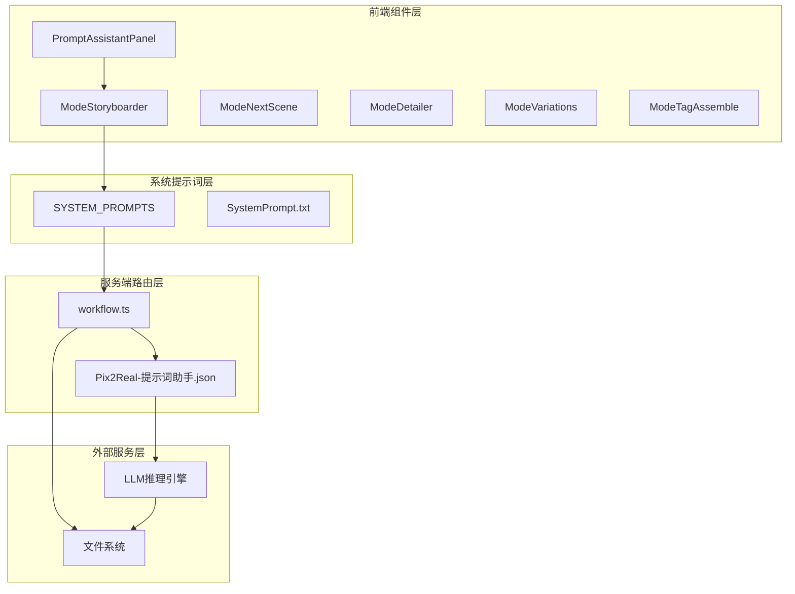

**图表来源**
- [PromptAssistantPanel.tsx:1-78](file://client/src/components/PromptAssistantPanel.tsx#L1-L78)
- [ModeStoryboarder.tsx:1-171](file://client/src/components/prompt-assistant/ModeStoryboarder.tsx#L1-L171)
- [systemPrompts.ts:1-145](file://client/src/components/prompt-assistant/systemPrompts.ts#L1-L145)
- [workflow.ts:746-800](file://server/src/routes/workflow.ts#L746-L800)

**章节来源**
- [PromptAssistantPanel.tsx:1-78](file://client/src/components/PromptAssistantPanel.tsx#L1-L78)
- [ModeStoryboarder.tsx:1-171](file://client/src/components/prompt-assistant/ModeStoryboarder.tsx#L1-L171)
- [systemPrompts.ts:1-145](file://client/src/components/prompt-assistant/systemPrompts.ts#L1-L145)

## 核心组件

分镜生成模式由多个相互协作的组件构成，每个组件都有明确的职责分工：

### 主要组件架构

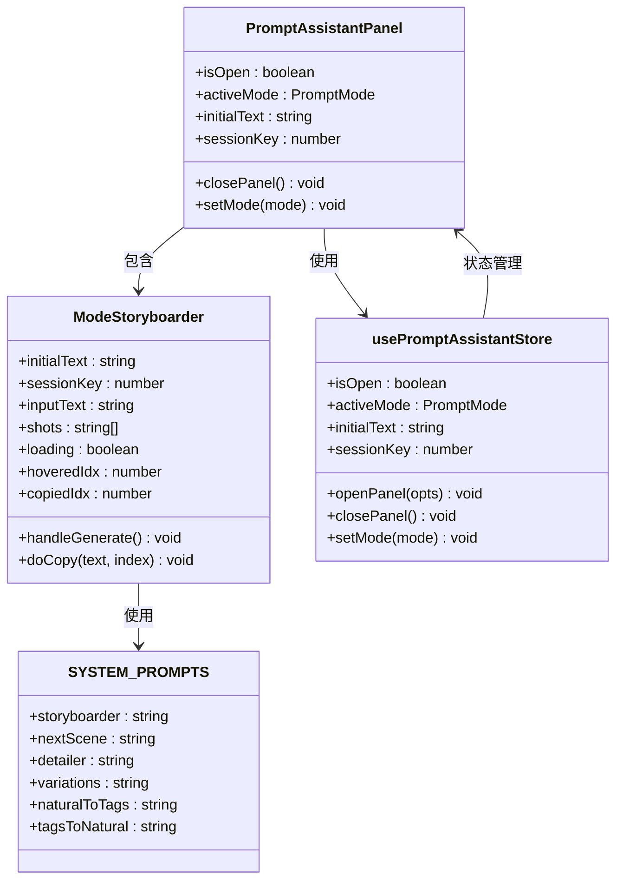

**图表来源**
- [ModeStoryboarder.tsx:32-171](file://client/src/components/prompt-assistant/ModeStoryboarder.tsx#L32-L171)
- [systemPrompts.ts:4-145](file://client/src/components/prompt-assistant/systemPrompts.ts#L4-L145)
- [PromptAssistantPanel.tsx:19-138](file://client/src/components/PromptAssistantPanel.tsx#L19-L138)
- [usePromptAssistantStore.ts:5-32](file://client/src/hooks/usePromptAssistantStore.ts#L5-L32)

### 组件交互流程

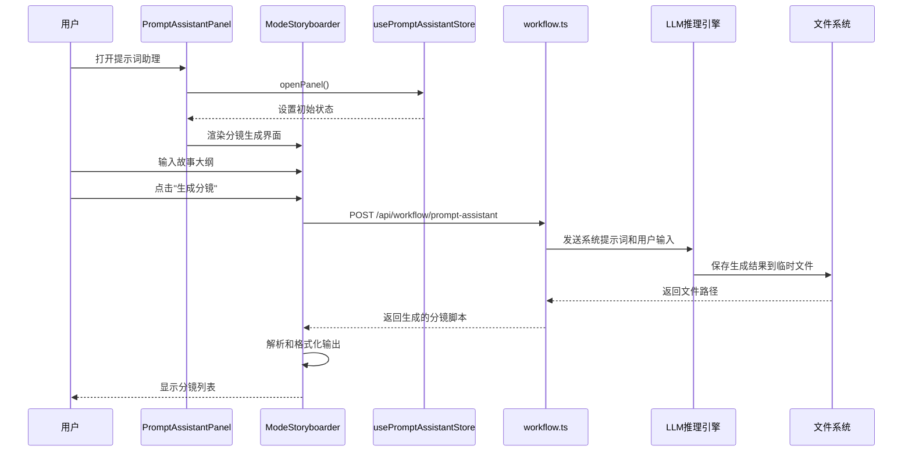

**图表来源**
- [ModeStoryboarder.tsx:43-59](file://client/src/components/prompt-assistant/ModeStoryboarder.tsx#L43-L59)
- [workflow.ts:748-800](file://server/src/routes/workflow.ts#L748-L800)

**章节来源**
- [ModeStoryboarder.tsx:32-171](file://client/src/components/prompt-assistant/ModeStoryboarder.tsx#L32-L171)
- [systemPrompts.ts:114-145](file://client/src/components/prompt-assistant/systemPrompts.ts#L114-L145)
- [PromptAssistantPanel.tsx:19-138](file://client/src/components/PromptAssistantPanel.tsx#L19-L138)
- [usePromptAssistantStore.ts:15-32](file://client/src/hooks/usePromptAssistantStore.ts#L15-L32)

## 架构概览

分镜生成模式采用前后端分离的架构设计，前端负责用户界面和交互逻辑，后端负责实际的AI推理和数据处理。

### 系统架构图

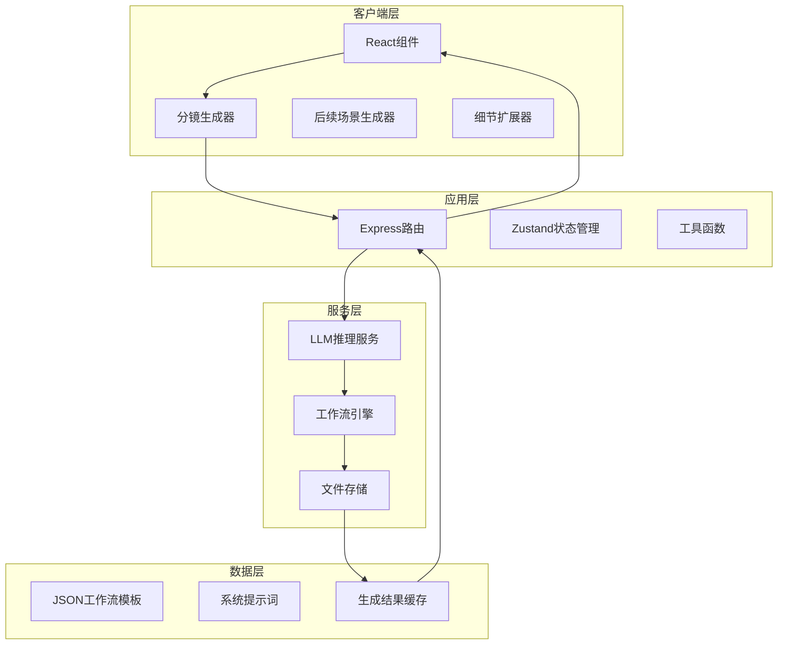

**图表来源**
- [workflow.ts:1-862](file://server/src/routes/workflow.ts#L1-L862)
- [Pix2Real-提示词助手.json:1-106](file://ComfyUI_API/Pix2Real-提示词助手.json#L1-L106)

### 数据流架构

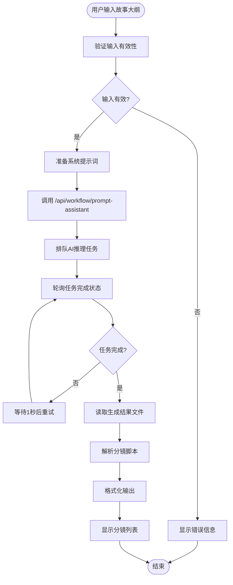

**图表来源**
- [ModeStoryboarder.tsx:43-59](file://client/src/components/prompt-assistant/ModeStoryboarder.tsx#L43-L59)
- [workflow.ts:748-800](file://server/src/routes/workflow.ts#L748-L800)

**章节来源**
- [workflow.ts:746-800](file://server/src/routes/workflow.ts#L746-L800)
- [Pix2Real-提示词助手.json:36-106](file://ComfyUI_API/Pix2Real-提示词助手.json#L36-L106)

## 详细组件分析

### ModeStoryboarder 组件深度分析

ModeStoryboarder 是分镜生成模式的核心组件，负责将用户输入的故事描述转换为专业的分镜脚本。

#### 组件结构分析

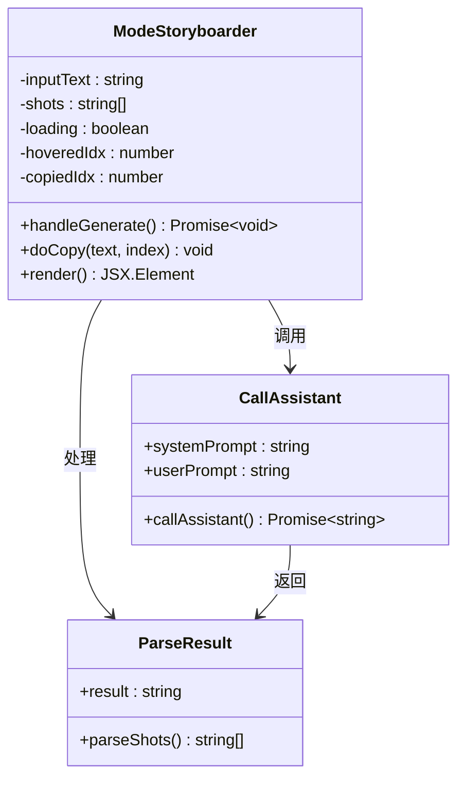

**图表来源**
- [ModeStoryboarder.tsx:32-171](file://client/src/components/prompt-assistant/ModeStoryboarder.tsx#L32-L171)

#### 核心功能实现

组件的核心功能包括输入处理、API调用、结果解析和界面渲染：

1. **输入处理**：实时响应用户输入变化，支持多行文本编辑
2. **API调用**：通过 `/api/workflow/prompt-assistant` 端点发送请求
3. **结果解析**：将LLM返回的多镜头描述解析为独立的镜头数组
4. **界面渲染**：提供复制功能和视觉反馈

#### 错误处理机制

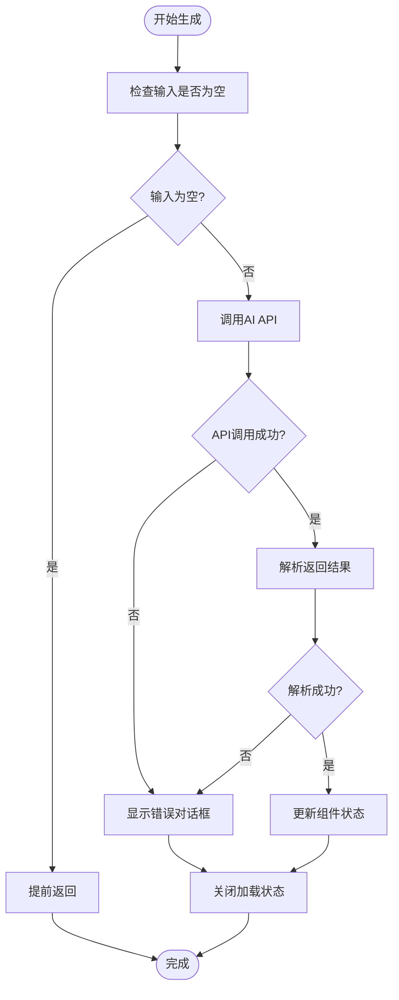

**图表来源**
- [ModeStoryboarder.tsx:43-59](file://client/src/components/prompt-assistant/ModeStoryboarder.tsx#L43-L59)

**章节来源**
- [ModeStoryboarder.tsx:32-171](file://client/src/components/prompt-assistant/ModeStoryboarder.tsx#L32-L171)

### 系统提示词设计

系统提示词是分镜生成的核心驱动力，精心设计的提示词确保了生成内容的专业性和一致性。

#### 提示词设计原则

系统提示词遵循以下设计原则：

1. **角色定义明确**：明确指定AI扮演的角色（分镜设计师、编剧）
2. **任务目标清晰**：清楚说明要完成的具体任务
3. **约束条件严格**：设定严格的输出格式和内容要求
4. **一致性保证**：确保生成内容在角色、环境等方面的一致性

#### 分镜生成提示词分析

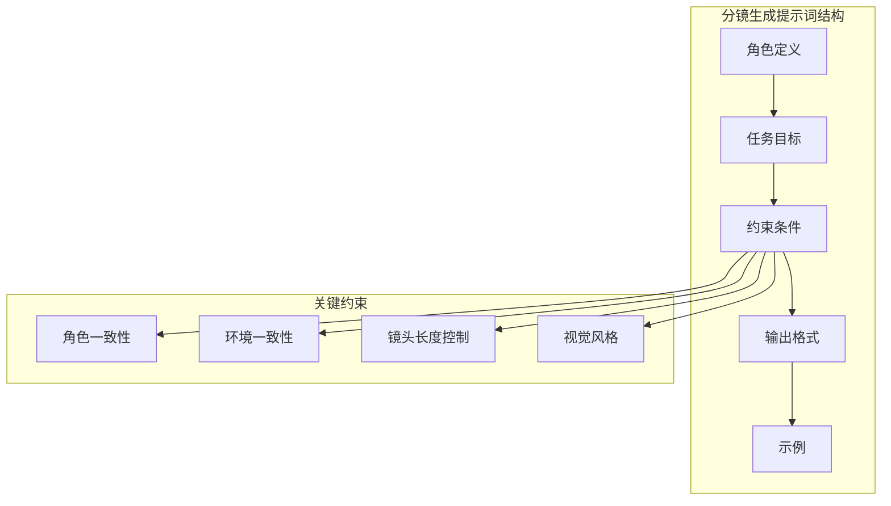

**图表来源**
- [systemPrompts.ts:114-145](file://client/src/components/prompt-assistant/systemPrompts.ts#L114-L145)
- [SystemPrompt.txt:116-146](file://docs/SystemPrompt.txt#L116-L146)

#### 输出格式规范

分镜生成的输出遵循严格的格式规范：

- **编号格式**：使用数字加冒号的格式（如 "1: ..."）
- **独立镜头**：每个镜头都是完整独立的描述
- **逻辑连接**：相邻镜头之间保持逻辑连贯性
- **数量控制**：默认生成4-8个镜头，可根据用户需求调整

**章节来源**
- [systemPrompts.ts:114-145](file://client/src/components/prompt-assistant/systemPrompts.ts#L114-L145)
- [SystemPrompt.txt:116-146](file://docs/SystemPrompt.txt#L116-L146)

### 服务端集成实现

服务端通过专用的工作流模板和API端点支持分镜生成功能。

#### 工作流模板分析

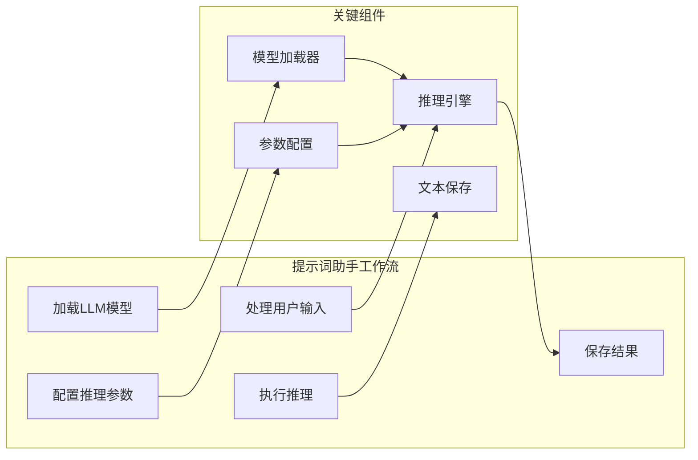

**图表来源**
- [Pix2Real-提示词助手.json:1-106](file://ComfyUI_API/Pix2Real-提示词助手.json#L1-L106)

#### API端点实现

服务端提供了专门的API端点来处理分镜生成请求：

1. **端点地址**：`/api/workflow/prompt-assistant`
2. **请求方法**：POST
3. **请求体**：包含系统提示词和用户输入
4. **响应格式**：包含生成的文本结果
5. **错误处理**：超时处理和错误状态码

**章节来源**
- [workflow.ts:746-800](file://server/src/routes/workflow.ts#L746-L800)
- [Pix2Real-提示词助手.json:36-106](file://ComfyUI_API/Pix2Real-提示词助手.json#L36-L106)

## 依赖关系分析

分镜生成模式涉及多个层面的依赖关系，包括组件间依赖、外部服务依赖和数据依赖。

### 组件依赖关系

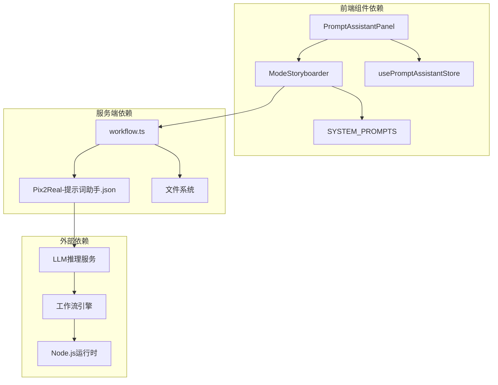

**图表来源**
- [ModeStoryboarder.tsx:1-3](file://client/src/components/prompt-assistant/ModeStoryboarder.tsx#L1-L3)
- [PromptAssistantPanel.tsx:1-8](file://client/src/components/PromptAssistantPanel.tsx#L1-L8)
- [workflow.ts:1-22](file://server/src/routes/workflow.ts#L1-L22)

### 数据流依赖

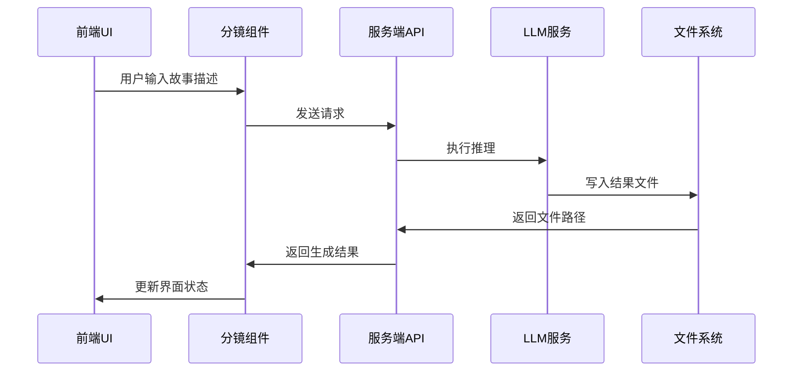

**图表来源**
- [ModeStoryboarder.tsx:5-14](file://client/src/components/prompt-assistant/ModeStoryboarder.tsx#L5-L14)
- [workflow.ts:748-800](file://server/src/routes/workflow.ts#L748-L800)

**章节来源**
- [ModeStoryboarder.tsx:1-171](file://client/src/components/prompt-assistant/ModeStoryboarder.tsx#L1-L171)
- [workflow.ts:1-862](file://server/src/routes/workflow.ts#L1-L862)

## 性能考虑

分镜生成模式在设计时充分考虑了性能优化，包括响应时间、资源使用和用户体验等方面。

### 性能优化策略

1. **异步处理**：所有AI推理操作都采用异步方式，避免阻塞UI线程
2. **结果缓存**：生成的结果通过文件系统进行缓存，减少重复计算
3. **状态管理**：使用轻量级的状态管理，避免不必要的重新渲染
4. **错误恢复**：实现超时处理和错误恢复机制，提升系统稳定性

### 资源使用优化

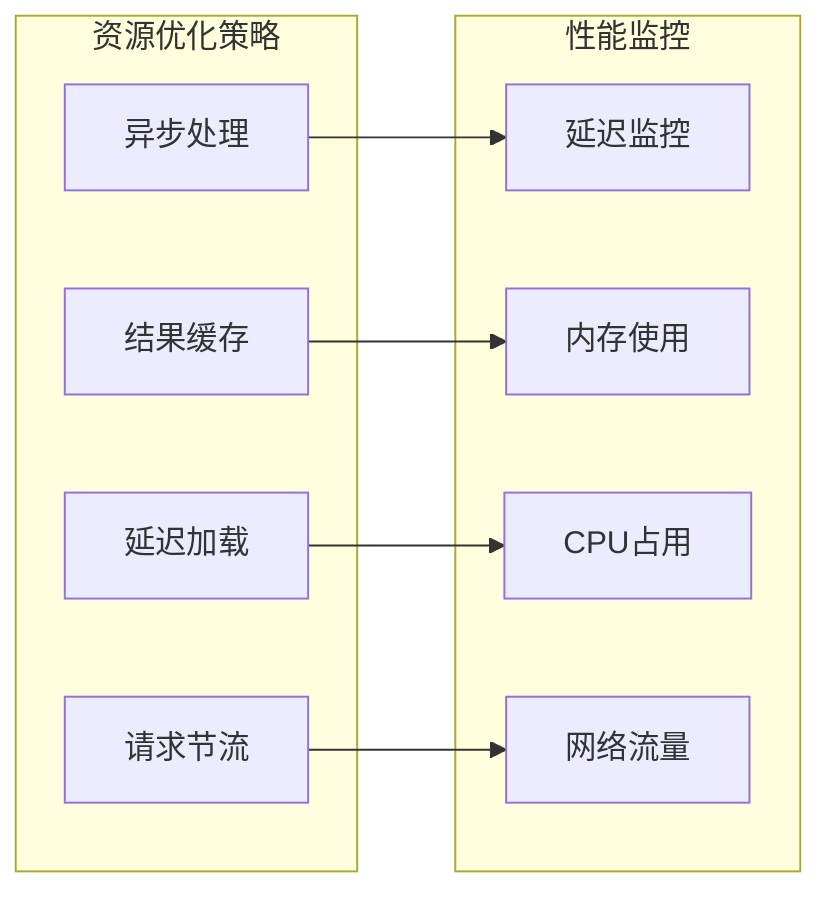

### 用户体验优化

1. **即时反馈**：提供加载状态指示和进度反馈
2. **错误友好**：显示清晰的错误信息和重试选项
3. **响应式设计**：适配不同屏幕尺寸和设备类型
4. **无障碍访问**：支持键盘导航和屏幕阅读器

## 故障排除指南

分镜生成模式可能遇到多种问题，以下是常见问题的诊断和解决方法。

### 常见问题及解决方案

#### 1. 生成超时问题

**症状**：点击"生成分镜"按钮后长时间无响应

**可能原因**：
- LLM推理服务响应缓慢
- 网络连接不稳定
- 服务器负载过高

**解决方法**：
- 检查网络连接状态
- 稍后重试生成操作
- 查看服务器日志获取更多信息

#### 2. 生成结果为空

**症状**：生成完成后显示空的分镜列表

**可能原因**：
- LLM推理失败
- 文件系统写入错误
- 系统提示词配置错误

**解决方法**：
- 验证系统提示词的有效性
- 检查文件系统权限
- 查看服务端错误日志

#### 3. UI界面异常

**症状**：界面显示异常或功能不可用

**可能原因**：
- 组件状态同步问题
- 样式冲突
- 浏览器兼容性问题

**解决方法**：
- 刷新页面重新加载
- 清除浏览器缓存
- 检查浏览器开发者工具中的错误信息

### 调试技巧

1. **启用调试模式**：在开发环境中启用详细的日志记录
2. **检查网络请求**：使用浏览器开发者工具查看API请求和响应
3. **验证数据格式**：确保输入数据符合预期格式
4. **测试独立功能**：分别测试各个组件的功能完整性

**章节来源**
- [ModeStoryboarder.tsx:54-58](file://client/src/components/prompt-assistant/ModeStoryboarder.tsx#L54-L58)
- [workflow.ts:786-789](file://server/src/routes/workflow.ts#L786-L789)

## 结论

分镜生成模式作为 CorineKit Pix2Real 的重要组成部分，展现了现代AI辅助创作工具的强大能力。通过精心设计的系统提示词、专业的组件架构和完善的错误处理机制，该模式能够稳定地将文字描述转换为专业的视觉分镜脚本。

### 主要优势

1. **专业性**：严格遵循电影分镜设计原则，确保生成内容的专业质量
2. **易用性**：简洁直观的用户界面，降低使用门槛
3. **可靠性**：完善的错误处理和超时机制，提升系统稳定性
4. **可扩展性**：模块化的架构设计，便于功能扩展和维护

### 技术亮点

- **智能解析算法**：能够准确理解用户意图并生成相应的镜头序列
- **质量控制机制**：通过系统提示词确保内容的一致性和连贯性
- **创意表达优化**：在保持技术规范的同时最大化创意表达空间
- **跨媒体支持**：适用于不同媒体形式的分镜生成需求

### 未来发展方向

随着技术的不断进步，分镜生成模式可以在以下方面进一步完善：
- 支持更多样式的分镜生成（如动画、游戏等）
- 集成更多的创意工具和效果
- 提供更丰富的自定义选项
- 增强与其他创作工具的集成能力

## 附录

### 使用指南

#### 基本使用步骤

1. **打开提示词助理面板**
   - 在侧边栏找到提示词助理图标
   - 点击打开面板

2. **选择分镜生成模式**
   - 在标签页中选择"分镜生成"
   - 确认模式切换

3. **输入故事描述**
   - 在左侧输入框中编写故事大纲
   - 可以包含角色、场景、情节等信息

4. **生成分镜脚本**
   - 点击"生成分镜"按钮
   - 等待生成完成（通常需要几秒钟）

5. **查看和编辑结果**
   - 在右侧查看生成的分镜列表
   - 可以复制单个镜头或整个脚本

#### 最佳实践建议

1. **提供详细的故事描述**
   - 包含主要角色、关键场景和重要情节转折
   - 描述角色的外观特征和服装细节

2. **明确分镜数量要求**
   - 如果有特定的镜头数量要求，可以在输入中说明
   - 默认情况下系统会生成4-8个镜头

3. **保持描述的连贯性**
   - 确保故事描述在逻辑上是连贯的
   - 避免过于复杂或相互矛盾的情节

4. **利用复制功能**
   - 生成后可以复制单个镜头或整个脚本
   - 方便在其他工具中使用

#### 不同媒体形式的分镜效果

| 媒体类型 | 分镜特点 | 制作建议 |
|---------|---------|---------|
| 传统动画 | 注重动作流畅性和表情细节 | 建议增加动作描述和表情变化 |
| 实拍电影 | 注重场景真实性和构图美感 | 强调环境细节和光线效果 |
| 游戏预告片 | 注重视觉冲击和节奏感 | 建议突出关键动作和特效 |
| 短视频 | 注重快速切换和信息密度 | 控制镜头长度和切换频率 |

### 技术规格

#### 系统要求

- **前端**：现代浏览器（Chrome 80+、Firefox 75+、Safari 13+）
- **后端**：Node.js 16+
- **存储**：足够的磁盘空间用于临时文件缓存
- **网络**：稳定的互联网连接用于AI服务访问

#### 性能指标

- **平均响应时间**：2-5秒（取决于输入复杂度）
- **并发处理能力**：支持多用户同时使用
- **内存使用**：根据输入大小动态调整
- **CPU占用**：主要集中在AI推理阶段

#### 兼容性说明

- **操作系统**：Windows、macOS、Linux
- **浏览器**：Chrome、Firefox、Safari、Edge
- **移动设备**：支持触摸操作和响应式布局
- **辅助功能**：支持键盘导航和屏幕阅读器