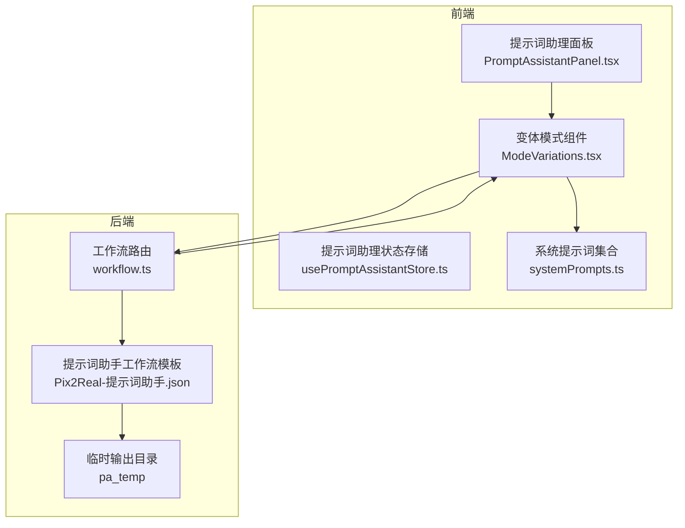
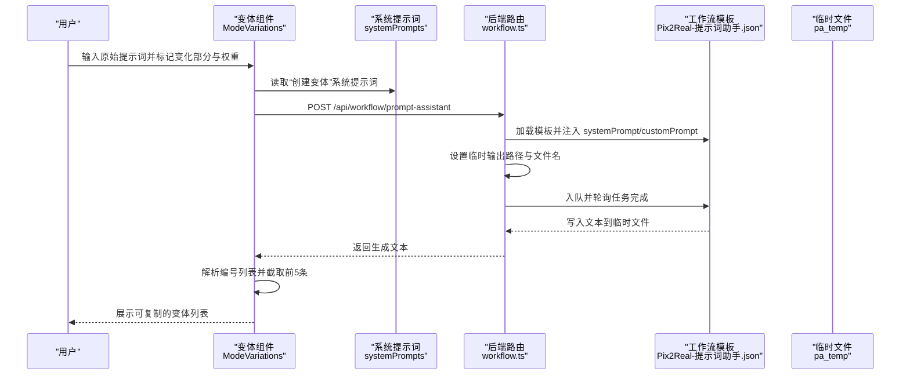
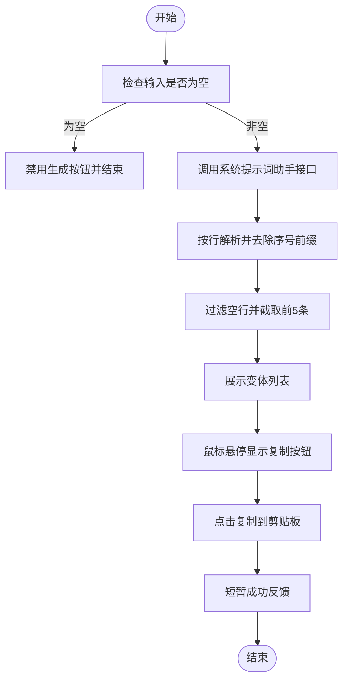
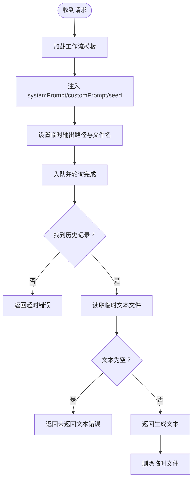
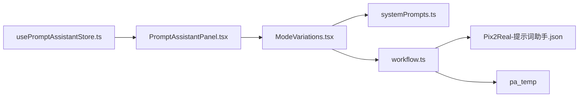

# 创建变体模式

<cite>
**本文引用的文件**
- [ModeVariations.tsx](file://client/src/components/prompt-assistant/ModeVariations.tsx)
- [systemPrompts.ts](file://client/src/components/prompt-assistant/systemPrompts.ts)
- [PromptAssistantPanel.tsx](file://client/src/components/PromptAssistantPanel.tsx)
- [usePromptAssistantStore.ts](file://client/src/hooks/usePromptAssistantStore.ts)
- [workflow.ts](file://server/src/routes/workflow.ts)
- [Pix2Real-提示词助手.json](file://ComfyUI_API/Pix2Real-提示词助手.json)
- [SystemPrompt.txt](file://docs/SystemPrompt.txt)
</cite>

## 目录
1. [简介](#简介)
2. [项目结构](#项目结构)
3. [核心组件](#核心组件)
4. [架构总览](#架构总览)
5. [详细组件分析](#详细组件分析)
6. [依赖关系分析](#依赖关系分析)
7. [性能考量](#性能考量)
8. [故障排查指南](#故障排查指南)
9. [结论](#结论)
10. [附录](#附录)

## 简介
本文件围绕“创建变体”模式进行深入技术文档化，聚焦于 ModeVariations 组件的设计与实现，阐述其如何基于用户提供的原始提示词，通过系统提示词与后端工作流，生成多个结构一致但重点不同的变体版本。文档涵盖变体生成算法要点、参数调整策略、创意扩展机制、质量控制与多样性保障、相关性优化，以及实际使用场景与操作建议。

## 项目结构
“创建变体”模式位于前端提示词助理面板中，采用多模式面板布局，变体模式作为其中一个选项卡存在。其核心交互链路如下：
- 用户在变体模式输入原始提示词，并标记需要变化的部分与强度权重；
- 前端调用后端接口，传递系统提示词与用户提示词；
- 后端加载 ComfyUI 工作流模板，注入系统提示词与用户提示词，执行推理并将结果保存为文本文件；
- 前端轮询任务完成状态，读取生成文本并解析为可复制的变体列表。

**图表来源**
- [PromptAssistantPanel.tsx:19-139](file://client/src/components/PromptAssistantPanel.tsx#L19-L139)
- [ModeVariations.tsx:32-151](file://client/src/components/prompt-assistant/ModeVariations.tsx#L32-L151)
- [usePromptAssistantStore.ts:15-33](file://client/src/hooks/usePromptAssistantStore.ts#L15-L33)
- [systemPrompts.ts:4-145](file://client/src/components/prompt-assistant/systemPrompts.ts#L4-L145)
- [workflow.ts:746-810](file://server/src/routes/workflow.ts#L746-L810)
- [Pix2Real-提示词助手.json:1-106](file://ComfyUI_API/Pix2Real-提示词助手.json#L1-L106)

**章节来源**
- [PromptAssistantPanel.tsx:19-139](file://client/src/components/PromptAssistantPanel.tsx#L19-L139)
- [ModeVariations.tsx:32-151](file://client/src/components/prompt-assistant/ModeVariations.tsx#L32-L151)
- [usePromptAssistantStore.ts:15-33](file://client/src/hooks/usePromptAssistantStore.ts#L15-L33)
- [systemPrompts.ts:4-145](file://client/src/components/prompt-assistant/systemPrompts.ts#L4-L145)
- [workflow.ts:746-810](file://server/src/routes/workflow.ts#L746-L810)
- [Pix2Real-提示词助手.json:1-106](file://ComfyUI_API/Pix2Real-提示词助手.json#L1-L106)

## 核心组件
- 变体模式组件（ModeVariations）
  - 负责接收初始提示词、触发生成、解析与展示变体、提供复制能力。
  - 关键逻辑：调用系统提示词与用户输入，解析后端返回的编号列表，限制展示数量为 5。
- 系统提示词（systemPrompts.ts）
  - 提供“创建变体”的系统规则，明确如何根据用户标记与权重生成差异化提示词。
- 提示词助理面板（PromptAssistantPanel）
  - 承载多模式切换容器，当前模式由状态管理驱动。
- 状态存储（usePromptAssistantStore）
  - 维护面板开关、活动模式、初始文本与会话键，用于驱动组件重渲染。
- 后端工作流路由（workflow.ts）
  - 处理 /api/workflow/prompt-assistant 请求，加载模板、注入参数、轮询任务、读取临时文本并返回。
- 工作流模板（Pix2Real-提示词助手.json）
  - 定义 LLM 推理节点、参数节点、文本保存节点，支撑变体生成流程。

**章节来源**
- [ModeVariations.tsx:32-151](file://client/src/components/prompt-assistant/ModeVariations.tsx#L32-L151)
- [systemPrompts.ts:51-74](file://client/src/components/prompt-assistant/systemPrompts.ts#L51-L74)
- [PromptAssistantPanel.tsx:19-139](file://client/src/components/PromptAssistantPanel.tsx#L19-L139)
- [usePromptAssistantStore.ts:15-33](file://client/src/hooks/usePromptAssistantStore.ts#L15-L33)
- [workflow.ts:746-810](file://server/src/routes/workflow.ts#L746-L810)
- [Pix2Real-提示词助手.json:1-106](file://ComfyUI_API/Pix2Real-提示词助手.json#L1-L106)

## 架构总览
变体生成的端到端流程如下：

**图表来源**
- [ModeVariations.tsx:43-58](file://client/src/components/prompt-assistant/ModeVariations.tsx#L43-L58)
- [systemPrompts.ts:51-74](file://client/src/components/prompt-assistant/systemPrompts.ts#L51-L74)
- [workflow.ts:746-810](file://server/src/routes/workflow.ts#L746-L810)
- [Pix2Real-提示词助手.json:36-106](file://ComfyUI_API/Pix2Real-提示词助手.json#L36-L106)

## 详细组件分析

### 变体模式组件（ModeVariations）
- 输入与状态
  - 接收初始文本与会话键；当会话键变化时重置输入框内容，确保每次打开面板时显示最新初始文本。
- 生成流程
  - 调用系统提示词“创建变体”，传入用户提示词；
  - 解析返回文本：按行分割、去除序号前缀、过滤空行，保留前 5 条作为最终变体。
- 交互细节
  - 生成按钮禁用条件：输入为空或正在加载；
  - 悬停显示复制按钮，点击复制对应变体，短暂反馈成功状态；
  - 错误处理：捕获异常并弹窗提示。

**图表来源**
- [ModeVariations.tsx:43-58](file://client/src/components/prompt-assistant/ModeVariations.tsx#L43-L58)
- [ModeVariations.tsx:60-64](file://client/src/components/prompt-assistant/ModeVariations.tsx#L60-L64)

**章节来源**
- [ModeVariations.tsx:32-151](file://client/src/components/prompt-assistant/ModeVariations.tsx#L32-L151)

### 系统提示词与变体规则
- 核心规则
  - 用户通过 # 标记需要变化的部分；
  - 每个 # 后跟随 @ 与 0-1 的浮点数，表示变化强度；
  - () 中包含用户对该对象的具体偏好描述；
  - 输出要求：严格编号列表（1-5），保持原提示词基本结构，仅针对 # 标注部分变化，且每条变体有明显差异。
- 文档来源
  - 系统提示词集中定义了“创建变体”的规则与格式要求；
  - 文档文件 SystemPrompt.txt 中也包含相同规则说明。

**章节来源**
- [systemPrompts.ts:51-74](file://client/src/components/prompt-assistant/systemPrompts.ts#L51-L74)
- [SystemPrompt.txt:51-75](file://docs/SystemPrompt.txt#L51-L75)

### 后端工作流与质量控制
- 参数与稳定性
  - 后端在请求中为 LLM 推理节点设置随机种子，确保可复现实验；
  - 通过模板注入 systemPrompt 与 customPrompt，保证提示词工程规则被正确应用；
  - 临时文件输出路径与文件名动态生成，避免冲突。
- 轮询与超时
  - 轮询 ComfyUI 历史记录直到任务完成，超时时间较长（约 180 秒），适应 LLM 推理耗时；
  - 若未找到临时文本文件或文本为空，返回相应错误信息。
- 文件读取与清理
  - 读取完成后删除临时文件，避免磁盘累积。

**图表来源**
- [workflow.ts:746-810](file://server/src/routes/workflow.ts#L746-L810)
- [Pix2Real-提示词助手.json:36-106](file://ComfyUI_API/Pix2Real-提示词助手.json#L36-L106)

**章节来源**
- [workflow.ts:746-810](file://server/src/routes/workflow.ts#L746-L810)
- [Pix2Real-提示词助手.json:1-106](file://ComfyUI_API/Pix2Real-提示词助手.json#L1-L106)

### 前端面板与状态联动
- 面板容器负责承载各模式组件，当前模式由状态存储决定；
- 初始文本与会话键变化会触发组件重渲染，确保输入框内容与当前会话一致；
- 变体模式在容器中以列式布局呈现左右两栏：左侧输入区，右侧结果区。

**章节来源**
- [PromptAssistantPanel.tsx:19-139](file://client/src/components/PromptAssistantPanel.tsx#L19-L139)
- [usePromptAssistantStore.ts:15-33](file://client/src/hooks/usePromptAssistantStore.ts#L15-L33)

## 依赖关系分析
- 组件耦合
  - ModeVariations 依赖 systemPrompts 的“创建变体”规则；
  - PromptAssistantPanel 通过状态存储统一调度各模式组件；
  - 后端 workflow 路由依赖 ComfyUI 工作流模板与临时目录。
- 数据流
  - 前端：输入文本 -> 系统提示词 -> 后端接口 -> 返回文本 -> 解析展示；
  - 后端：请求体 -> 模板注入 -> ComfyUI 推理 -> 临时文件 -> 读取响应 -> 清理文件。

**图表来源**
- [ModeVariations.tsx:32-151](file://client/src/components/prompt-assistant/ModeVariations.tsx#L32-L151)
- [systemPrompts.ts:4-145](file://client/src/components/prompt-assistant/systemPrompts.ts#L4-L145)
- [workflow.ts:746-810](file://server/src/routes/workflow.ts#L746-L810)
- [Pix2Real-提示词助手.json:1-106](file://ComfyUI_API/Pix2Real-提示词助手.json#L1-L106)
- [PromptAssistantPanel.tsx:19-139](file://client/src/components/PromptAssistantPanel.tsx#L19-L139)
- [usePromptAssistantStore.ts:15-33](file://client/src/hooks/usePromptAssistantStore.ts#L15-L33)

**章节来源**
- [ModeVariations.tsx:32-151](file://client/src/components/prompt-assistant/ModeVariations.tsx#L32-L151)
- [systemPrompts.ts:4-145](file://client/src/components/prompt-assistant/systemPrompts.ts#L4-L145)
- [workflow.ts:746-810](file://server/src/routes/workflow.ts#L746-L810)
- [Pix2Real-提示词助手.json:1-106](file://ComfyUI_API/Pix2Real-提示词助手.json#L1-L106)
- [PromptAssistantPanel.tsx:19-139](file://client/src/components/PromptAssistantPanel.tsx#L19-L139)
- [usePromptAssistantStore.ts:15-33](file://client/src/hooks/usePromptAssistantStore.ts#L15-L33)

## 性能考量
- LLM 推理耗时
  - 后端轮询超时设为较长时限，适配大模型推理时间；
  - 建议在 UI 上提供加载指示与取消机制（若后续扩展）。
- I/O 与临时文件
  - 临时文件读写与删除操作频繁，需确保 pa_temp 目录权限与磁盘空间充足；
  - 可考虑定期清理过期临时文件，避免占用。
- 前端解析开销
  - 解析编号列表与截取前 5 条为轻量操作，对性能影响可忽略；
  - 复制按钮的短暂反馈通过定时器实现，避免重复渲染。

[本节为通用性能讨论，不直接分析具体文件]

## 故障排查指南
- 生成超时
  - 现象：返回“提示词助理超时，请重试”；
  - 排查：确认 ComfyUI 队列运行正常、模型加载完成、网络稳定。
- 未返回文本
  - 现象：返回“ComfyUI 未返回结果文本”；
  - 排查：检查临时文件是否存在、文件是否为空、后端日志是否有异常。
- 输入为空
  - 现象：生成按钮禁用；
  - 处理：在输入框中填写有效提示词后再尝试生成。
- 复制失败
  - 现象：点击复制无反应；
  - 排查：浏览器剪贴板权限、HTTPS 环境、跨域策略。

**章节来源**
- [workflow.ts:786-810](file://server/src/routes/workflow.ts#L786-L810)
- [ModeVariations.tsx:53-57](file://client/src/components/prompt-assistant/ModeVariations.tsx#L53-L57)

## 结论
“创建变体”模式通过清晰的系统提示词规则与稳定的后端工作流，实现了对用户提示词的结构化变体生成。前端组件负责输入、生成触发与结果展示，后端负责模板注入、推理执行与文本输出。该设计在保证相关性与多样性的基础上，提供了良好的可扩展性与可维护性。

[本节为总结性内容，不直接分析具体文件]

## 附录

### 使用场景与操作指南
- 场景一：角色风格多样化
  - 在提示词中标注需要变化的角色部位与风格关键词，配合 @ 强度与偏好描述，生成不同风格的变体。
- 场景二：环境与氛围变化
  - 对背景、光照、材质等进行标记，使用较高强度权重探索更多环境组合。
- 场景三：动作与姿态扩展
  - 标注动作序列中的关键帧，使用较低强度权重生成连续变化的变体，便于后续分镜拼接。
- 操作步骤
  - 在变体模式输入区粘贴或编写提示词；
  - 使用 # 标记需要变化的部分；
  - 使用 @ 数值（0-1）表达变化强度；
  - 在 () 中补充具体偏好描述；
  - 点击“创建变体”等待生成；
  - 浏览结果并复制所需变体。

**章节来源**
- [systemPrompts.ts:51-74](file://client/src/components/prompt-assistant/systemPrompts.ts#L51-L74)
- [ModeVariations.tsx:66-107](file://client/src/components/prompt-assistant/ModeVariations.tsx#L66-L107)

### 参数调整策略与创意扩展机制
- 参数策略
  - 强度权重：0.3-0.7 适合中等变化，0.1-0.3 与 0.7-0.9 分别适合保守与激进变化；
  - 偏好描述：在 () 中给出具体方向（如“更明亮”“更柔和”“更具动感”），提升相关性。
- 创意扩展
  - 结合“按需扩写”模式对括号内的元素进行细节扩展，再回流到变体生成，形成“结构-细节-变体”的迭代流程。

**章节来源**
- [systemPrompts.ts:51-74](file://client/src/components/prompt-assistant/systemPrompts.ts#L51-L74)
- [systemPrompts.ts:75-93](file://client/src/components/prompt-assistant/systemPrompts.ts#L75-L93)