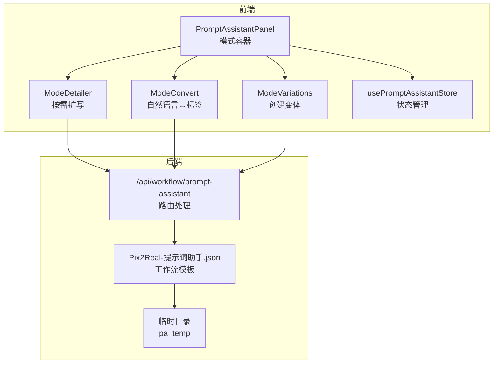
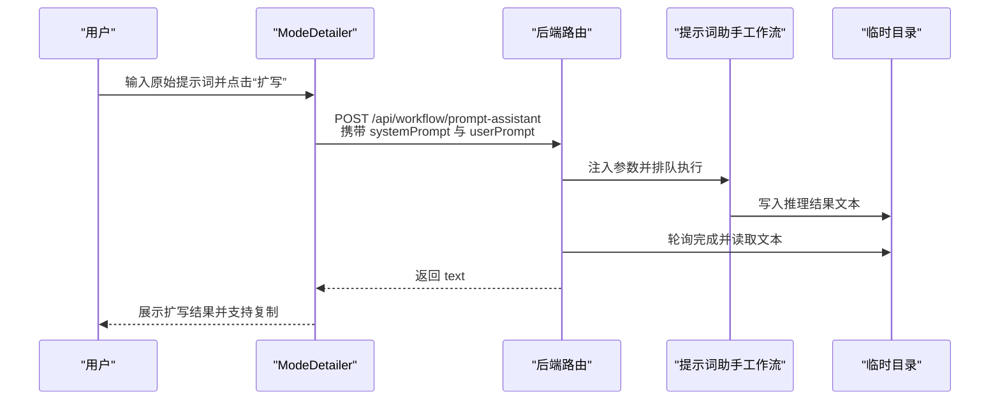
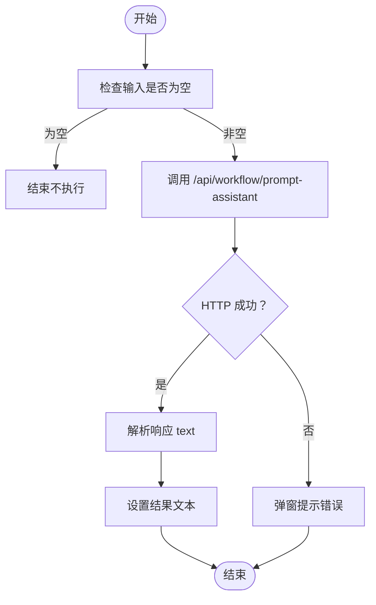
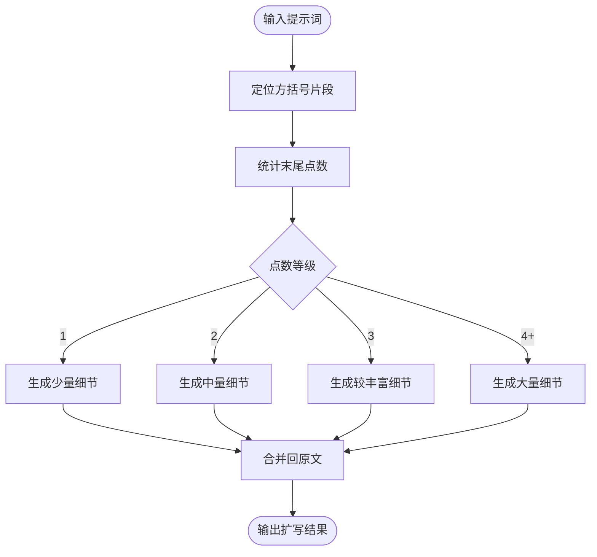
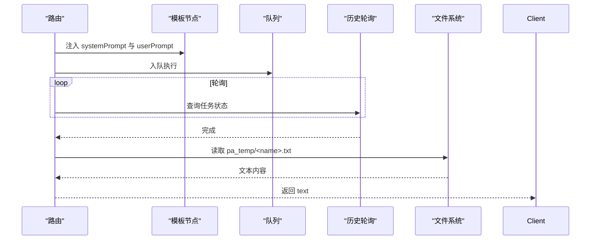
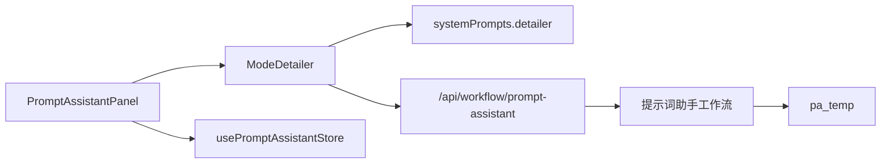

# 按需扩写模式

<cite>
**本文引用的文件**
- [ModeDetailer.tsx](file://client/src/components/prompt-assistant/ModeDetailer.tsx)
- [systemPrompts.ts](file://client/src/components/prompt-assistant/systemPrompts.ts)
- [PromptAssistantPanel.tsx](file://client/src/components/PromptAssistantPanel.tsx)
- [usePromptAssistantStore.ts](file://client/src/hooks/usePromptAssistantStore.ts)
- [workflow.ts](file://server/src/routes/workflow.ts)
- [Pix2Real-提示词助手.json](file://ComfyUI_API/Pix2Real-提示词助手.json)
- [SystemPrompt.txt](file://docs/SystemPrompt.txt)
- [ModeConvert.tsx](file://client/src/components/prompt-assistant/ModeConvert.tsx)
- [ModeVariations.tsx](file://client/src/components/prompt-assistant/ModeVariations.tsx)
</cite>

## 目录
1. [简介](#简介)
2. [项目结构](#项目结构)
3. [核心组件](#核心组件)
4. [架构总览](#架构总览)
5. [详细组件分析](#详细组件分析)
6. [依赖关系分析](#依赖关系分析)
7. [性能考量](#性能考量)
8. [故障排查指南](#故障排查指南)
9. [结论](#结论)
10. [附录](#附录)

## 简介
本文件系统性阐述“按需扩写”模式（ModeDetailer）的设计与实现，聚焦于如何基于用户标注的扩展区域，对提示词进行精细化扩写与细节补充。文档覆盖扩写算法、上下文理解、细节提取与重组、质量评估与一致性保障、创意增强策略，并提供可操作的使用技巧与优化建议。

## 项目结构
按需扩写模式位于前端提示词助理面板中，采用模块化设计：面板容器负责模式切换与布局，各模式组件负责具体交互与调用后端接口；后端通过专用工作流模板执行LLM推理并将结果持久化为文本文件供前端读取。

**图表来源**
- [PromptAssistantPanel.tsx:19-138](file://client/src/components/PromptAssistantPanel.tsx#L19-L138)
- [ModeDetailer.tsx:32-141](file://client/src/components/prompt-assistant/ModeDetailer.tsx#L32-L141)
- [ModeConvert.tsx:32-194](file://client/src/components/prompt-assistant/ModeConvert.tsx#L32-L194)
- [ModeVariations.tsx:32-150](file://client/src/components/prompt-assistant/ModeVariations.tsx#L32-L150)
- [workflow.ts:746-804](file://server/src/routes/workflow.ts#L746-L804)
- [Pix2Real-提示词助手.json:1-106](file://ComfyUI_API/Pix2Real-提示词助手.json#L1-L106)

**章节来源**
- [PromptAssistantPanel.tsx:19-138](file://client/src/components/PromptAssistantPanel.tsx#L19-L138)
- [ModeDetailer.tsx:32-141](file://client/src/components/prompt-assistant/ModeDetailer.tsx#L32-L141)
- [workflow.ts:746-804](file://server/src/routes/workflow.ts#L746-L804)

## 核心组件
- ModeDetailer：按需扩写模式的UI与逻辑核心，负责接收用户输入、触发后端推理、展示扩写结果并支持复制。
- systemPrompts：集中定义各模式的系统提示词，其中 detailer 规则明确扩写范围、细节数量与输出格式。
- PromptAssistantPanel：模式容器，承载多个提示词助理模式，含“按需扩写”标签页。
- usePromptAssistantStore：全局状态管理，维护当前激活模式、初始文本与会话键值，用于驱动组件重渲染。
- 后端路由与工作流：/api/workflow/prompt-assistant 接收系统提示词与用户提示词，注入到 Pix2Real-提示词助手.json 工作流，推理完成后从 pa_temp 读取文本并返回给前端。

**章节来源**
- [ModeDetailer.tsx:32-141](file://client/src/components/prompt-assistant/ModeDetailer.tsx#L32-L141)
- [systemPrompts.ts:75-93](file://client/src/components/prompt-assistant/systemPrompts.ts#L75-L93)
- [PromptAssistantPanel.tsx:10-17](file://client/src/components/PromptAssistantPanel.tsx#L10-L17)
- [usePromptAssistantStore.ts:3-32](file://client/src/hooks/usePromptAssistantStore.ts#L3-L32)
- [workflow.ts:746-804](file://server/src/routes/workflow.ts#L746-L804)
- [Pix2Real-提示词助手.json:36-105](file://ComfyUI_API/Pix2Real-提示词助手.json#L36-L105)

## 架构总览
按需扩写遵循“前端输入 → 后端LLM推理 → 文件落盘 → 前端读取”的闭环流程，确保结果稳定可复现且便于集成到其他工作流。

**图表来源**
- [ModeDetailer.tsx:5-14](file://client/src/components/prompt-assistant/ModeDetailer.tsx#L5-L14)
- [workflow.ts:746-804](file://server/src/routes/workflow.ts#L746-L804)
- [Pix2Real-提示词助手.json:36-105](file://ComfyUI_API/Pix2Real-提示词助手.json#L36-L105)

## 详细组件分析

### ModeDetailer 组件
- 输入与状态
  - 输入区：支持多行文本，占位符提示使用方括号标记扩写区域及详细度。
  - 结果区：只读展示扩写结果，悬浮时显示复制按钮。
  - 加载态与错误提示：禁用按钮与弹窗提示错误信息。
- 核心流程
  - handleExpand：校验输入非空后，调用 callAssistant 并更新结果。
  - callAssistant：向 /api/workflow/prompt-assistant 发送请求，解析响应文本。
  - doCopy：复制结果到剪贴板并短暂反馈。
- 与系统提示词协作
  - 使用 SYSTEM_PROMPTS.detailer 作为 systemPrompt，确保扩写行为严格遵循规则。

**图表来源**
- [ModeDetailer.tsx:43-54](file://client/src/components/prompt-assistant/ModeDetailer.tsx#L43-L54)
- [ModeDetailer.tsx:5-14](file://client/src/components/prompt-assistant/ModeDetailer.tsx#L5-L14)

**章节来源**
- [ModeDetailer.tsx:32-141](file://client/src/components/prompt-assistant/ModeDetailer.tsx#L32-L141)

### 系统提示词与扩写规则
- 扩写范围
  - 仅对被方括号包裹的内容进行扩写，其他内容保持不变。
- 详细度标记
  - 一个点：添加少量细节（1–2项）
  - 两个点：中等细节（3–5项）
  - 三个点：较丰富细节（5–8项）
  - 四个或以上点：大量细节（8项以上）
- 输出要求
  - 移除方括号
  - 将扩写内容无缝融入原句
  - 不重复或改写方括号外内容
  - 示例输入输出见系统提示词与文档。

**图表来源**
- [systemPrompts.ts:75-93](file://client/src/components/prompt-assistant/systemPrompts.ts#L75-L93)
- [SystemPrompt.txt:76-94](file://docs/SystemPrompt.txt#L76-L94)

**章节来源**
- [systemPrompts.ts:75-93](file://client/src/components/prompt-assistant/systemPrompts.ts#L75-L93)
- [SystemPrompt.txt:76-94](file://docs/SystemPrompt.txt#L76-L94)

### 后端工作流与文件读取
- 路由处理
  - 接收 systemPrompt 与 userPrompt，注入到 Pix2Real-提示词助手.json 模板节点。
  - 设置临时输出路径为 pa_temp，命名带时间戳与随机串，避免冲突。
  - 轮询任务历史直到完成，超时返回 504。
  - 从 pa_temp 读取生成的文本文件，清理文件后返回给前端。
- 工作流节点
  - llama_cpp_instruct_adv：执行指令式LLM推理。
  - easy saveText：将输出文本写入指定文件路径。
  - 可配置参数（如 max_tokens、temperature 等）影响生成稳定性与多样性。

**图表来源**
- [workflow.ts:746-804](file://server/src/routes/workflow.ts#L746-L804)
- [Pix2Real-提示词助手.json:36-105](file://ComfyUI_API/Pix2Real-提示词助手.json#L36-L105)

**章节来源**
- [workflow.ts:746-804](file://server/src/routes/workflow.ts#L746-L804)
- [Pix2Real-提示词助手.json:36-105](file://ComfyUI_API/Pix2Real-提示词助手.json#L36-L105)

### 与其他模式的关系
- 与“自然语言↔标签”模式协同
  - 先用 ModeConvert 将自然语言转为标签，再用 ModeDetailer 对特定标签片段进行扩写，最后再转回自然语言，形成“标签级精细扩写”的完整链路。
- 与“创建变体”模式互补
  - Variations 关注“整体风格/元素的差异”，Detailer 关注“局部片段的细节密度”，二者结合可同时提升局部细节与全局一致性。

**章节来源**
- [ModeConvert.tsx:32-194](file://client/src/components/prompt-assistant/ModeConvert.tsx#L32-L194)
- [ModeVariations.tsx:32-150](file://client/src/components/prompt-assistant/ModeVariations.tsx#L32-L150)

## 依赖关系分析
- 组件耦合
  - ModeDetailer 依赖 systemPrompts.detailer 与后端 /api/workflow/prompt-assistant。
  - PromptAssistantPanel 以受控方式渲染 ModeDetailer，依赖 usePromptAssistantStore 的 activeMode 与 sessionKey。
- 外部依赖
  - LLM 推理模型与参数由工作流模板定义，影响扩写质量与稳定性。
  - 临时文件系统（pa_temp）承担结果落盘职责，需确保目录存在与权限正确。

**图表来源**
- [ModeDetailer.tsx:32-141](file://client/src/components/prompt-assistant/ModeDetailer.tsx#L32-L141)
- [systemPrompts.ts:75-93](file://client/src/components/prompt-assistant/systemPrompts.ts#L75-L93)
- [PromptAssistantPanel.tsx:19-138](file://client/src/components/PromptAssistantPanel.tsx#L19-L138)
- [usePromptAssistantStore.ts:15-32](file://client/src/hooks/usePromptAssistantStore.ts#L15-L32)
- [workflow.ts:746-804](file://server/src/routes/workflow.ts#L746-L804)
- [Pix2Real-提示词助手.json:36-105](file://ComfyUI_API/Pix2Real-提示词助手.json#L36-L105)

**章节来源**
- [PromptAssistantPanel.tsx:19-138](file://client/src/components/PromptAssistantPanel.tsx#L19-L138)
- [usePromptAssistantStore.ts:15-32](file://client/src/hooks/usePromptAssistantStore.ts#L15-L32)
- [ModeDetailer.tsx:32-141](file://client/src/components/prompt-assistant/ModeDetailer.tsx#L32-L141)
- [workflow.ts:746-804](file://server/src/routes/workflow.ts#L746-L804)

## 性能考量
- 生成耗时
  - LLM 推理与文件IO存在延迟，建议在 UI 中显式展示加载态，避免重复提交。
- 资源占用
  - 工作流包含大模型加载与参数配置，注意 VRAM 与磁盘空间，必要时清理 pa_temp。
- 可靠性
  - 超时阈值为 180 秒，若长时间无响应，前端应提示重试或检查后端日志。

[本节为通用指导，无需列出具体文件来源]

## 故障排查指南
- 常见问题
  - “提示词助理超时，请重试”：后端轮询未在时限内完成，检查 ComfyUI 状态与模型加载情况。
  - “ComfyUI 未返回结果文本”：临时文件缺失或内容为空，确认工作流节点已成功写入文件。
  - “未知错误”：前端弹窗提示，查看网络请求与后端错误日志。
- 排查步骤
  - 确认 /api/workflow/prompt-assistant 请求体包含 systemPrompt 与 userPrompt。
  - 检查 pa_temp 目录是否存在与可写。
  - 查看工作流模板节点配置（如模型路径、参数）是否正确。
  - 在浏览器开发者工具中观察网络请求与响应。

**章节来源**
- [workflow.ts:775-804](file://server/src/routes/workflow.ts#L775-L804)

## 结论
按需扩写模式通过“片段标记 + 点数控制 + LLM 扩展 + 无缝融合”的机制，实现了对提示词的精细化扩写。其核心优势在于：
- 明确的扩写边界与可控的细节密度
- 与现有标签/变体模式的协同能力
- 稳定的后端工作流与文件落盘机制

建议在实际使用中结合标签转换与变体生成，形成“标签级 → 片段级 → 风格级”的多层次提示工程流程，以获得更高质量与一致性的图像生成结果。

[本节为总结性内容，无需列出具体文件来源]

## 附录

### 使用技巧与策略
- 标记策略
  - 使用方括号明确扩写目标，配合点数表达期望的细节密度。
  - 对关键主体、环境与材质分别标注，避免一次性过度扩写。
- 上下文理解
  - 在扩写前先用标签转换明确视觉要素，再针对标签片段进行扩写，提升一致性。
- 创意增强
  - 与“创建变体”结合，先生成风格差异化的提示，再对关键片段进行细节扩写，平衡多样性与稳定性。
- 质量评估
  - 关注扩写后是否与原句语义一致、是否出现重复或冗余描述。
  - 通过多次扩写与对比，选择最符合预期的版本。

[本节为通用指导，无需列出具体文件来源]