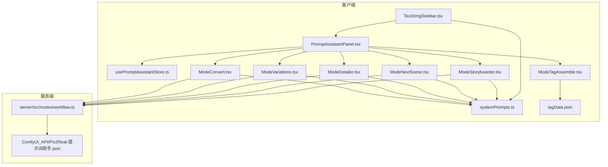
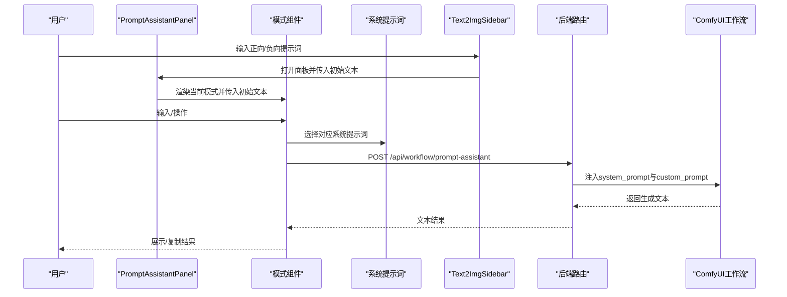
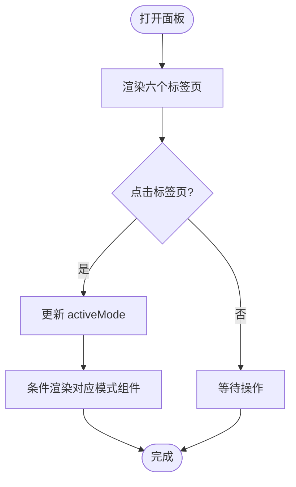
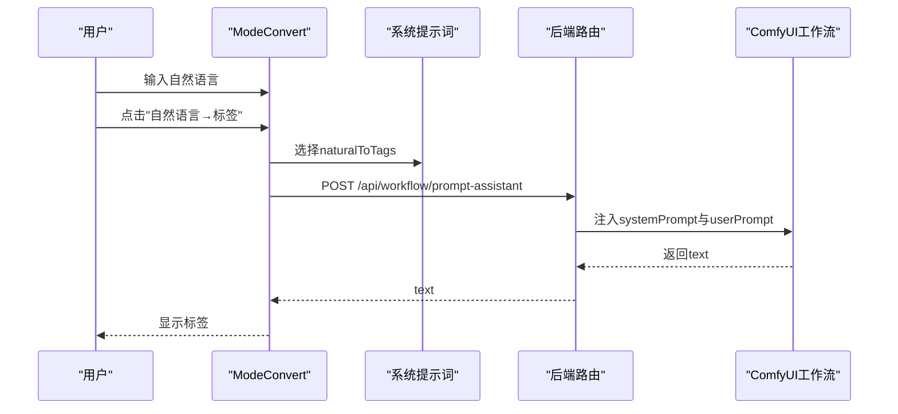
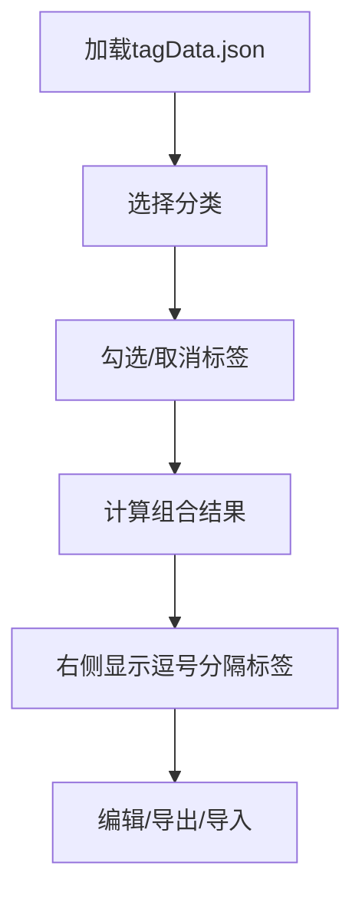
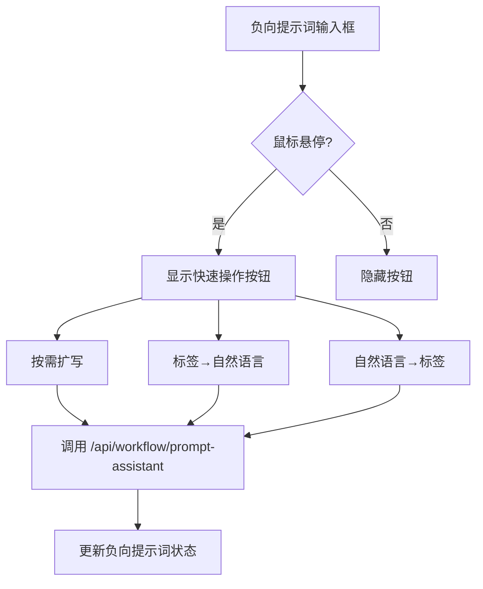
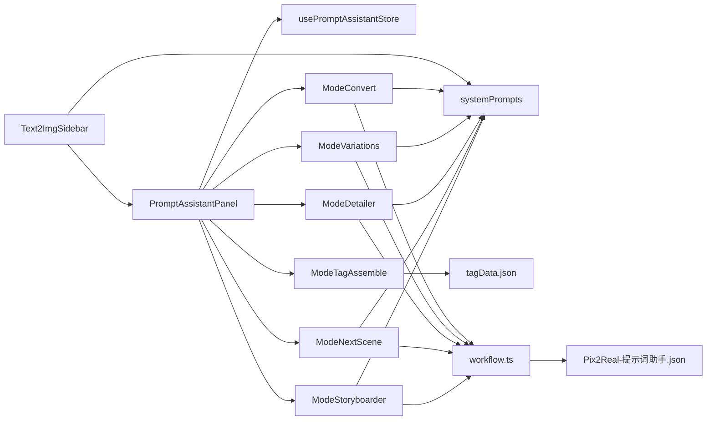

# 提示词助手面板

<cite>
**本文档引用的文件**
- [PromptAssistantPanel.tsx](file://client/src/components/PromptAssistantPanel.tsx)
- [ModeConvert.tsx](file://client/src/components/prompt-assistant/ModeConvert.tsx)
- [ModeVariations.tsx](file://client/src/components/prompt-assistant/ModeVariations.tsx)
- [ModeDetailer.tsx](file://client/src/components/prompt-assistant/ModeDetailer.tsx)
- [ModeNextScene.tsx](file://client/src/components/prompt-assistant/ModeNextScene.tsx)
- [ModeStoryboarder.tsx](file://client/src/components/prompt-assistant/ModeStoryboarder.tsx)
- [ModeTagAssemble.tsx](file://client/src/components/prompt-assistant/ModeTagAssemble.tsx)
- [systemPrompts.ts](file://client/src/components/prompt-assistant/systemPrompts.ts)
- [usePromptAssistantStore.ts](file://client/src/hooks/usePromptAssistantStore.ts)
- [Text2ImgSidebar.tsx](file://client/src/components/Text2ImgSidebar.tsx)
- [tagData.json](file://client/src/data/tagData.json)
- [workflow.ts](file://server/src/routes/workflow.ts)
- [Pix2Real-提示词助手.json](file://ComfyUI_API/Pix2Real-提示词助手.json)
- [SystemPrompt.txt](file://docs/SystemPrompt.txt)
</cite>

## 更新摘要
**所做更改**
- 新增负向提示词支持功能说明
- 添加负向提示词快速操作按钮组实现
- 更新提示词助理集成到文本生成界面
- 新增负向提示词AI转换功能
- 扩展系统提示词配置以支持负向提示词处理

## 目录
1. [简介](#简介)
2. [项目结构](#项目结构)
3. [核心组件](#核心组件)
4. [架构总览](#架构总览)
5. [详细组件分析](#详细组件分析)
6. [负向提示词功能](#负向提示词功能)
7. [依赖关系分析](#依赖关系分析)
8. [性能考虑](#性能考虑)
9. [故障排除指南](#故障排除指南)
10. [结论](#结论)
11. [附录](#附录)

## 简介
提示词助手面板是一个集成了六种工作模式的提示词工程工具，旨在帮助用户高效地进行提示词的双向转换、变体生成、按需扩写、后续场景脑补、分镜脚本生成以及标签合成。该面板通过统一的状态管理与系统提示词模板，连接前端界面与后端 ComfyUI 工作流，实现与本地大模型的实时交互。

**更新** 新增负向提示词支持功能，用户现在可以在文本生成界面中直接使用和管理负向提示词，并通过提示词助手面板对其进行智能转换和优化。

## 项目结构
提示词助手相关代码主要位于客户端的 `client/src/components/prompt-assistant` 目录，配合全局状态钩子与系统提示词定义；后端通过 `/api/workflow/prompt-assistant` 接口对接 ComfyUI 的提示词助手工作流模板。

**图表来源**
- [PromptAssistantPanel.tsx:19-138](file://client/src/components/PromptAssistantPanel.tsx#L19-L138)
- [usePromptAssistantStore.ts:15-32](file://client/src/hooks/usePromptAssistantStore.ts#L15-L32)
- [systemPrompts.ts:4-144](file://client/src/components/prompt-assistant/systemPrompts.ts#L4-L144)
- [ModeTagAssemble.tsx:61-95](file://client/src/components/prompt-assistant/ModeTagAssemble.tsx#L61-L95)
- [workflow.ts:746-766](file://server/src/routes/workflow.ts#L746-L766)
- [Pix2Real-提示词助手.json:1-106](file://ComfyUI_API/Pix2Real-提示词助手.json#L1-L106)
- [Text2ImgSidebar.tsx:225-246](file://client/src/components/Text2ImgSidebar.tsx#L225-L246)

**章节来源**
- [PromptAssistantPanel.tsx:19-138](file://client/src/components/PromptAssistantPanel.tsx#L19-L138)
- [usePromptAssistantStore.ts:15-32](file://client/src/hooks/usePromptAssistantStore.ts#L15-L32)
- [systemPrompts.ts:4-144](file://client/src/components/prompt-assistant/systemPrompts.ts#L4-L144)
- [ModeTagAssemble.tsx:61-95](file://client/src/components/prompt-assistant/ModeTagAssemble.tsx#L61-L95)
- [workflow.ts:746-766](file://server/src/routes/workflow.ts#L746-L766)
- [Pix2Real-提示词助手.json:1-106](file://ComfyUI_API/Pix2Real-提示词助手.json#L1-L106)
- [Text2ImgSidebar.tsx:225-246](file://client/src/components/Text2ImgSidebar.tsx#L225-L246)

## 核心组件
- PromptAssistantPanel：主面板容器，负责渲染标签页、切换活动模式、传递初始文本与会话键。
- 六种模式组件：分别对应"标签转换""创建变体""按需扩写""脑补后续""分镜生成""标签合成器"，每个模式独立封装交互与数据处理。
- 系统提示词：集中定义各模式的系统指令，确保前后端一致的提示词工程规则。
- 状态钩子：统一管理面板开关、活动模式、初始文本与会话键，支持跨模式共享数据。
- 标签数据：本地持久化的标签分类与默认标签集合，支持编辑、导入导出与拖拽排序。
- **新增** 负向提示词管理：在文本生成界面中提供负向提示词输入区域和快速操作按钮组。

**章节来源**
- [PromptAssistantPanel.tsx:10-17](file://client/src/components/PromptAssistantPanel.tsx#L10-L17)
- [systemPrompts.ts:4-144](file://client/src/components/prompt-assistant/systemPrompts.ts#L4-L144)
- [usePromptAssistantStore.ts:3-13](file://client/src/hooks/usePromptAssistantStore.ts#L3-L13)
- [ModeTagAssemble.tsx:61-95](file://client/src/components/prompt-assistant/ModeTagAssemble.tsx#L61-L95)
- [Text2ImgSidebar.tsx:106-122](file://client/src/components/Text2ImgSidebar.tsx#L106-L122)

## 架构总览
提示词助手采用"前端组件 + 状态管理 + 系统提示词 + 后端工作流"的分层架构。前端通过 fetch 调用后端接口，后端加载 ComfyUI 的提示词助手工作流模板，注入系统提示词与用户输入，执行推理并将结果返回给前端。

**图表来源**
- [PromptAssistantPanel.tsx:116-133](file://client/src/components/PromptAssistantPanel.tsx#L116-L133)
- [ModeConvert.tsx:45-69](file://client/src/components/prompt-assistant/ModeConvert.tsx#L45-L69)
- [ModeVariations.tsx:43-58](file://client/src/components/prompt-assistant/ModeVariations.tsx#L43-L58)
- [ModeDetailer.tsx:43-54](file://client/src/components/prompt-assistant/ModeDetailer.tsx#L43-L54)
- [ModeNextScene.tsx:43-54](file://client/src/components/prompt-assistant/ModeNextScene.tsx#L43-L54)
- [ModeStoryboarder.tsx:43-59](file://client/src/components/prompt-assistant/ModeStoryboarder.tsx#L43-L59)
- [systemPrompts.ts:4-144](file://client/src/components/prompt-assistant/systemPrompts.ts#L4-L144)
- [workflow.ts:746-766](file://server/src/routes/workflow.ts#L746-L766)
- [Pix2Real-提示词助手.json:36-60](file://ComfyUI_API/Pix2Real-提示词助手.json#L36-L60)
- [Text2ImgSidebar.tsx:225-246](file://client/src/components/Text2ImgSidebar.tsx#L225-L246)

## 详细组件分析

### PromptAssistantPanel 主面板
- 功能职责
  - 定义六个标签页（标签转换、创建变体、按需扩写、脑补后续、分镜生成、标签合成器）。
  - 使用状态钩子控制面板显示与活动模式切换。
  - 将初始文本与会话键传递给各模式组件，保证跨模式的数据一致性。
- 交互逻辑
  - 点击标签页按钮切换 activeMode。
  - 条件渲染对应模式组件，避免不必要的重渲染。
- 状态管理
  - 通过 zustand store 维护 isOpen、activeMode、initialText、sessionKey。
  - 关闭面板时仅隐藏 UI，不销毁 store 数据，便于复用。

**图表来源**
- [PromptAssistantPanel.tsx:10-17](file://client/src/components/PromptAssistantPanel.tsx#L10-L17)
- [PromptAssistantPanel.tsx:83-104](file://client/src/components/PromptAssistantPanel.tsx#L83-L104)
- [PromptAssistantPanel.tsx:116-133](file://client/src/components/PromptAssistantPanel.tsx#L116-L133)
- [usePromptAssistantStore.ts:15-32](file://client/src/hooks/usePromptAssistantStore.ts#L15-L32)

**章节来源**
- [PromptAssistantPanel.tsx:19-138](file://client/src/components/PromptAssistantPanel.tsx#L19-L138)
- [usePromptAssistantStore.ts:15-32](file://client/src/hooks/usePromptAssistantStore.ts#L15-L32)

### 标签转换（ModeConvert）
- 模式目标
  - 在"自然语言"与"英文标签"之间双向转换，严格遵循系统提示词规则。
- 交互流程
  - 左侧输入自然语言，右侧显示生成的标签；点击箭头按钮触发转换。
  - 支持复制功能与加载态反馈。
- 数据处理
  - 调用后端接口，传入对应系统提示词与用户输入。
  - 成功后将结果写入右侧文本框，失败弹出错误提示。
- 最佳实践
  - 自然语言输入应具体明确，避免抽象表达。
  - 标签输出为纯英文逗号分隔，适合直接用于图像生成模型。

**图表来源**
- [ModeConvert.tsx:45-69](file://client/src/components/prompt-assistant/ModeConvert.tsx#L45-L69)
- [systemPrompts.ts:6-25](file://client/src/components/prompt-assistant/systemPrompts.ts#L6-L25)
- [workflow.ts:746-766](file://server/src/routes/workflow.ts#L746-L766)
- [Pix2Real-提示词助手.json:36-60](file://ComfyUI_API/Pix2Real-提示词助手.json#L36-L60)

**章节来源**
- [ModeConvert.tsx:32-194](file://client/src/components/prompt-assistant/ModeConvert.tsx#L32-L194)
- [systemPrompts.ts:6-25](file://client/src/components/prompt-assistant/systemPrompts.ts#L6-L25)

### 创建变体（ModeVariations）
- 模式目标
  - 基于用户提示词生成多个变体，突出可调整区域与权重。
- 交互流程
  - 用户在输入框标记要变化的部分与强度，点击"创建变体"生成五个候选提示词。
  - 支持逐条复制与加载态反馈。
- 数据处理
  - 解析后端返回的编号列表，过滤空行与序号，取前五项。
- 最佳实践
  - 使用"#内容@权重"的语法明确变化范围与程度。
  - 权重越接近1，变化幅度越大但聚焦于标记区域。

**章节来源**
- [ModeVariations.tsx:32-151](file://client/src/components/prompt-assistant/ModeVariations.tsx#L32-L151)
- [systemPrompts.ts:51-73](file://client/src/components/prompt-assistant/systemPrompts.ts#L51-L73)

### 按需扩写（ModeDetailer）
- 模式目标
  - 对提示词中指定区域进行按点数密度的细节扩写，保持上下文连贯。
- 交互流程
  - 使用方括号或全角括号标记扩写区域，末尾点数决定扩写密度。
  - 点击"扩写"生成更丰富的描述。
- 数据处理
  - 调用后端接口，移除括号并融合到原句。
- 最佳实践
  - 区域标记清晰，避免过度扩写导致语义漂移。
  - 点数越多细节越丰富，但需平衡可读性与生成效率。

**章节来源**
- [ModeDetailer.tsx:32-142](file://client/src/components/prompt-assistant/ModeDetailer.tsx#L32-L142)
- [systemPrompts.ts:75-92](file://client/src/components/prompt-assistant/systemPrompts.ts#L75-L92)

### 脑补后续（ModeNextScene）
- 模式目标
  - 基于当前镜头提示词生成下一镜头的视觉描述，保持动作连续与角色一致。
- 交互流程
  - 输入当前镜头描述，点击"脑补后续"生成下一句提示词。
- 数据处理
  - 严格遵循视觉描述规则，输出长度与输入大致匹配。
- 最佳实践
  - 角色外观与服装保持一致，环境元素继承上一镜头。
  - 动作应自然延续，情感通过视觉元素传达。

**章节来源**
- [ModeNextScene.tsx:32-142](file://client/src/components/prompt-assistant/ModeNextScene.tsx#L32-L142)
- [systemPrompts.ts:94-111](file://client/src/components/prompt-assistant/systemPrompts.ts#L94-L111)

### 分镜生成（ModeStoryboarder）
- 模式目标
  - 根据故事大纲生成连贯的分镜脚本，控制镜头数量与角色环境一致性。
- 交互流程
  - 输入故事大纲，点击"生成分镜"得到编号镜头列表。
- 数据处理
  - 解析编号格式，过滤空行，生成若干完整镜头提示词。
- 最佳实践
  - 明确角色全称与关键特征，避免后续镜头改变外观。
  - 环境与道具应来自首镜头或前序镜头，限制新增对象。

**章节来源**
- [ModeStoryboarder.tsx:32-171](file://client/src/components/prompt-assistant/ModeStoryboarder.tsx#L32-L171)
- [systemPrompts.ts:113-143](file://client/src/components/prompt-assistant/systemPrompts.ts#L113-L143)

### 标签合成器（ModeTagAssemble）
- 模式目标
  - 通过多级分类与标签选择，实时合成英文逗号分隔的提示词字符串。
- 交互流程
  - 左侧分类导航，中间标签选择区，右侧实时结果与编辑/导出/导入控件。
  - 支持拖拽排序、批量多选、单选覆盖、标签文本编辑。
- 数据持久化
  - 分类与标签数据存储在本地，支持导入导出与自定义模板。
- 最佳实践
  - 使用层级分类组织标签，便于团队协作与复用。
  - 多选标签注意权重与冲突，必要时手动调整顺序。

**图表来源**
- [ModeTagAssemble.tsx:61-108](file://client/src/components/prompt-assistant/ModeTagAssemble.tsx#L61-L108)
- [tagData.json:1-95](file://client/src/data/tagData.json#L1-L95)

**章节来源**
- [ModeTagAssemble.tsx:60-805](file://client/src/components/prompt-assistant/ModeTagAssemble.tsx#L60-L805)
- [tagData.json:1-95](file://client/src/data/tagData.json#L1-L95)

## 负向提示词功能

### 负向提示词界面集成
Text2ImgSidebar 组件新增了完整的负向提示词支持，包括：

- **负向提示词输入区域**：位于正向提示词下方，提供独立的文本输入框
- **快速操作按钮组**：与正向提示词相同的三个快速操作按钮（按需扩写、标签→自然语言、自然语言→标签）
- **提示词助理集成**：支持通过提示词助手面板处理负向提示词
- **状态管理**：独立的状态变量和加载状态管理

### 负向提示词快速操作实现
负向提示词提供了与正向提示词完全相同的三个快速操作模式：

- **按需扩写（detailer）**：扩展负向提示词中的特定区域
- **标签→自然语言**：将负向提示词中的标签转换为自然语言描述
- **自然语言→标签**：将自然语言描述转换为标签格式

**图表来源**
- [Text2ImgSidebar.tsx:637-783](file://client/src/components/Text2ImgSidebar.tsx#L637-L783)
- [Text2ImgSidebar.tsx:225-246](file://client/src/components/Text2ImgSidebar.tsx#L225-L246)

### 负向提示词状态管理
负向提示词功能使用独立的状态管理：

- **状态变量**：`negativePrompt` 存储负向提示词内容
- **焦点状态**：`negPromptFocused` 和 `negPromptBtnHovered` 控制按钮显示
- **加载状态**：`negQuickActionLoading` 管理操作执行状态
- **持久化**：与正向提示词相同的本地存储机制

### 负向提示词与提示词助手集成
负向提示词可以直接通过提示词助手面板进行处理：

- **初始文本传递**：当用户点击提示词助理按钮时，负向提示词内容作为初始文本传入
- **模式支持**：所有六种模式都支持负向提示词处理
- **状态隔离**：负向提示词拥有独立的会话状态，不影响正向提示词

**章节来源**
- [Text2ImgSidebar.tsx:106-122](file://client/src/components/Text2ImgSidebar.tsx#L106-L122)
- [Text2ImgSidebar.tsx:225-246](file://client/src/components/Text2ImgSidebar.tsx#L225-L246)
- [Text2ImgSidebar.tsx:637-783](file://client/src/components/Text2ImgSidebar.tsx#L637-L783)
- [usePromptAssistantStore.ts:15-32](file://client/src/hooks/usePromptAssistantStore.ts#L15-L32)

## 依赖关系分析
- 组件耦合
  - PromptAssistantPanel 与各模式组件松耦合，通过 props 传递初始文本与会话键。
  - Mode* 组件均依赖 systemPrompts 与后端接口，保持行为一致性。
  - Text2ImgSidebar 与 PromptAssistantPanel 通过状态钩子进行集成。
- 状态依赖
  - usePromptAssistantStore 为全局状态源，避免重复请求与跨组件数据同步问题。
  - Text2ImgSidebar 维护独立的负向提示词状态，与正向提示词状态分离。
- 数据依赖
  - ModeTagAssemble 依赖本地 tagData.json，支持离线编辑与导入导出。
- 后端依赖
  - 所有模式组件通过统一接口调用后端路由，路由加载 ComfyUI 提示词助手工作流模板。

**图表来源**
- [PromptAssistantPanel.tsx:19-138](file://client/src/components/PromptAssistantPanel.tsx#L19-L138)
- [usePromptAssistantStore.ts:15-32](file://client/src/hooks/usePromptAssistantStore.ts#L15-L32)
- [systemPrompts.ts:4-144](file://client/src/components/prompt-assistant/systemPrompts.ts#L4-L144)
- [ModeTagAssemble.tsx:61-95](file://client/src/components/prompt-assistant/ModeTagAssemble.tsx#L61-L95)
- [workflow.ts:746-766](file://server/src/routes/workflow.ts#L746-L766)
- [Pix2Real-提示词助手.json:1-106](file://ComfyUI_API/Pix2Real-提示词助手.json#L1-L106)
- [Text2ImgSidebar.tsx:225-246](file://client/src/components/Text2ImgSidebar.tsx#L225-L246)

**章节来源**
- [PromptAssistantPanel.tsx:19-138](file://client/src/components/PromptAssistantPanel.tsx#L19-L138)
- [usePromptAssistantStore.ts:15-32](file://client/src/hooks/usePromptAssistantStore.ts#L15-L32)
- [systemPrompts.ts:4-144](file://client/src/components/prompt-assistant/systemPrompts.ts#L4-L144)
- [ModeTagAssemble.tsx:61-95](file://client/src/components/prompt-assistant/ModeTagAssemble.tsx#L61-L95)
- [workflow.ts:746-766](file://server/src/routes/workflow.ts#L746-L766)
- [Pix2Real-提示词助手.json:1-106](file://ComfyUI_API/Pix2Real-提示词助手.json#L1-L106)
- [Text2ImgSidebar.tsx:225-246](file://client/src/components/Text2ImgSidebar.tsx#L225-L246)

## 性能考虑
- 请求节流
  - 模式组件在请求期间禁用按钮与输入，避免重复提交。
  - **新增** 负向提示词操作同样具有请求节流机制，防止重复调用。
- 渲染优化
  - PromptAssistantPanel 使用条件渲染，仅渲染当前活动模式，减少 DOM 更新。
  - **新增** 负向提示词界面采用独立的状态管理，避免与正向提示词的相互影响。
- 状态缓存
  - usePromptAssistantStore 以最小状态集管理面板与模式，降低重渲染成本。
  - **新增** Text2ImgSidebar 使用独立的本地存储机制，分别缓存正向和负向提示词。
- 数据持久化
  - ModeTagAssemble 使用 localStorage 缓存分类与选择，提升二次打开体验。
  - **新增** 负向提示词同样支持本地持久化，确保用户会话的一致性。
- 后端吞吐
  - 后端路由为一次性推理流程，建议合理设置 max_tokens 与温度参数，平衡质量与速度。
  - **新增** 负向提示词处理与正向提示词共享相同的后端资源，无需额外配置。

## 故障排除指南
- 常见错误
  - 网络请求失败：检查后端服务是否启动，接口路径是否正确。
  - 系统提示词缺失：确认 systemPrompts 中对应键存在且拼写正确。
  - 标签合成器异常：检查 tagData.json 格式，确保 categories 结构完整。
  - **新增** 负向提示词操作失败：检查负向提示词输入是否为空，确认 /api/workflow/prompt-assistant 接口可用。
- 调试建议
  - 在浏览器开发者工具中查看网络面板，定位失败的 /api/workflow/prompt-assistant 请求。
  - 在后端日志中查找工作流执行错误，确认 ComfyUI 模型加载与节点连接正常。
  - 对于标签合成器，检查本地存储权限与 JSON 解析异常。
  - **新增** 负向提示词调试：检查 Text2ImgSidebar 中的负向提示词状态管理，确认按钮组事件绑定正常。

**章节来源**
- [ModeConvert.tsx:45-69](file://client/src/components/prompt-assistant/ModeConvert.tsx#L45-L69)
- [ModeVariations.tsx:43-58](file://client/src/components/prompt-assistant/ModeVariations.tsx#L43-L58)
- [ModeDetailer.tsx:43-54](file://client/src/components/prompt-assistant/ModeDetailer.tsx#L43-L54)
- [ModeNextScene.tsx:43-54](file://client/src/components/prompt-assistant/ModeNextScene.tsx#L43-L54)
- [ModeStoryboarder.tsx:43-59](file://client/src/components/prompt-assistant/ModeStoryboarder.tsx#L43-L59)
- [ModeTagAssemble.tsx:61-95](file://client/src/components/prompt-assistant/ModeTagAssemble.tsx#L61-L95)
- [workflow.ts:746-766](file://server/src/routes/workflow.ts#L746-L766)
- [Text2ImgSidebar.tsx:225-246](file://client/src/components/Text2ImgSidebar.tsx#L225-L246)

## 结论
提示词助手面板通过模块化设计与统一的状态管理，实现了从自然语言到标签、从标签到自然语言、从单一提示词到多变体与分镜脚本的全链路提示词工程能力。结合系统提示词与 ComfyUI 工作流，用户可在本地高效完成高质量提示词的创作与优化，适用于图像生成、视频分镜与标签标准化等多种场景。

**更新** 新增的负向提示词支持进一步完善了提示词工程体系，用户现在可以同时管理正向和负向提示词，通过统一的提示词助手面板进行智能转换和优化，显著提升了提示词创作的效率和质量。

## 附录
- 系统提示词来源
  - 详细规则与示例参见系统提示词文档与代码中的注释定义。
- 工作流模板
  - 提示词助手工作流模板包含推理参数与文本保存节点，确保输出稳定可复现。
- **新增** 负向提示词最佳实践
  - 负向提示词应与正向提示词保持一致的风格和结构
  - 使用明确的视觉描述，避免抽象概念
  - 定期清理和优化负向提示词，保持其有效性

**章节来源**
- [SystemPrompt.txt:1-146](file://docs/SystemPrompt.txt#L1-L146)
- [Pix2Real-提示词助手.json:1-106](file://ComfyUI_API/Pix2Real-提示词助手.json#L1-L106)
- [Text2ImgSidebar.tsx:106-122](file://client/src/components/Text2ImgSidebar.tsx#L106-L122)