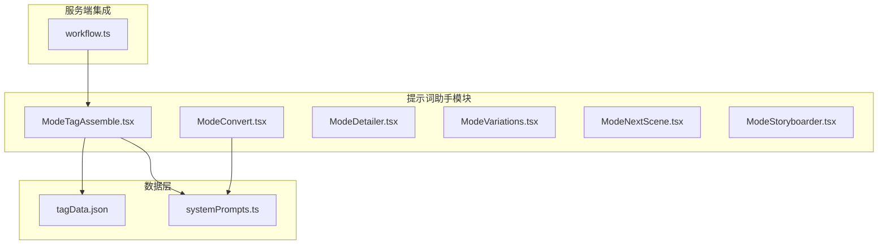
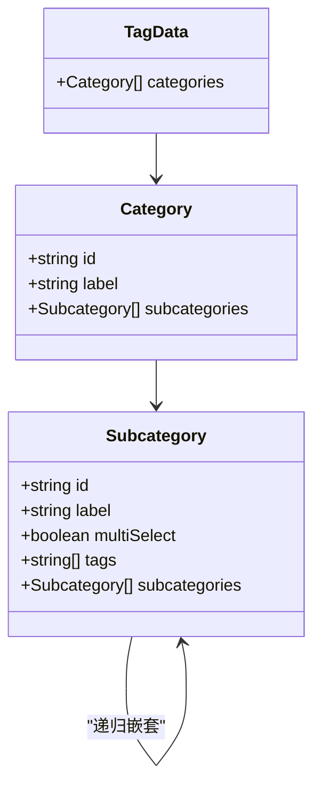
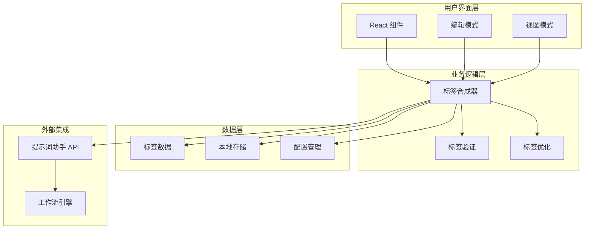
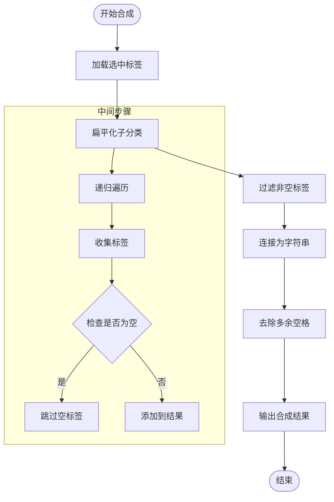
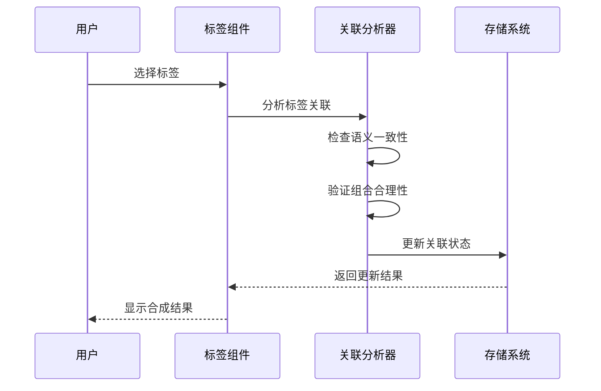
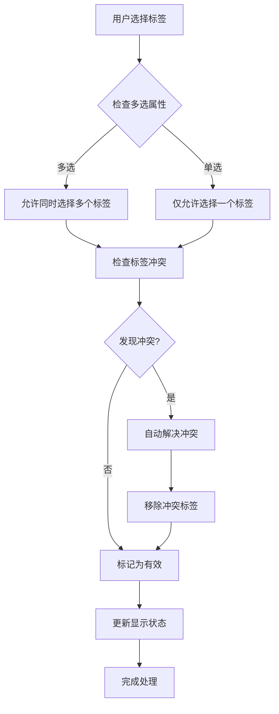
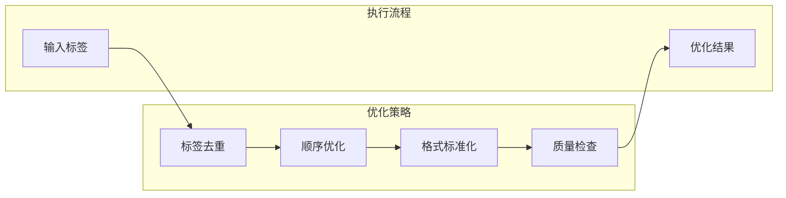
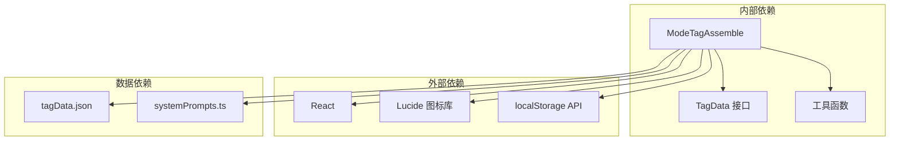
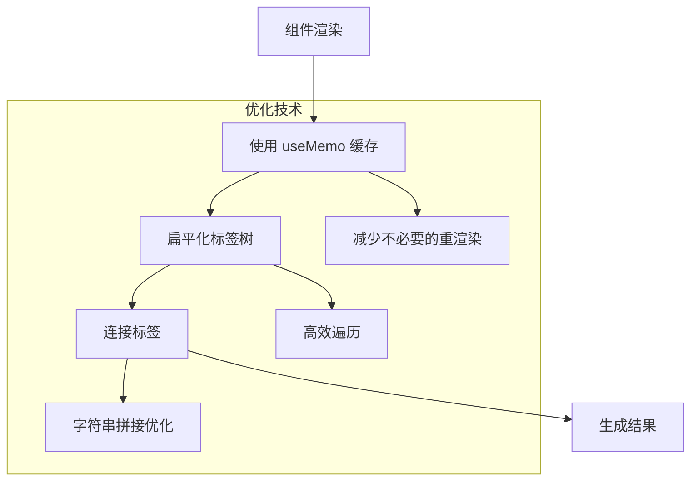

# 标签合成器模式

<cite>
**本文档引用的文件**
- [ModeTagAssemble.tsx](file://client/src/components/prompt-assistant/ModeTagAssemble.tsx)
- [tagData.json](file://client/src/data/tagData.json)
- [systemPrompts.ts](file://client/src/components/prompt-assistant/systemPrompts.ts)
- [SystemPrompt.txt](file://docs/SystemPrompt.txt)
- [ModeConvert.tsx](file://client/src/components/prompt-assistant/ModeConvert.tsx)
- [workflow.ts](file://server/src/routes/workflow.ts)
</cite>

## 目录
1. [简介](#简介)
2. [项目结构](#项目结构)
3. [核心组件](#核心组件)
4. [架构概览](#架构概览)
5. [详细组件分析](#详细组件分析)
6. [依赖关系分析](#依赖关系分析)
7. [性能考虑](#性能考虑)
8. [故障排除指南](#故障排除指南)
9. [结论](#结论)
10. [附录](#附录)

## 简介

标签合成器模式是 CorineKit Pix2Real 项目中的一个核心功能模块，专门用于将多个标签进行智能组合和优化。该模式通过层次化的标签管理系统，实现了从自然语言到标签的转换、标签的智能组合以及最终提示词的生成。

该系统采用 React 构建，提供了直观的用户界面，支持标签的拖拽排序、多选控制和实时预览功能。通过本地存储机制，用户可以持久化标签配置和选择状态。

## 项目结构

标签合成器模式位于前端客户端的提示词助手模块中，主要包含以下关键文件：

**图表来源**
- [ModeTagAssemble.tsx:1-805](file://client/src/components/prompt-assistant/ModeTagAssemble.tsx#L1-L805)
- [tagData.json:1-95](file://client/src/data/tagData.json#L1-L95)
- [systemPrompts.ts:1-145](file://client/src/components/prompt-assistant/systemPrompts.ts#L1-L145)

**章节来源**
- [ModeTagAssemble.tsx:60-391](file://client/src/components/prompt-assistant/ModeTagAssemble.tsx#L60-L391)
- [tagData.json:1-95](file://client/src/data/tagData.json#L1-L95)

## 核心组件

### ModeTagAssemble 主组件

ModeTagAssemble 是标签合成器模式的核心组件，负责管理整个标签合成流程。该组件实现了完整的标签选择、组合和导出功能。

#### 数据结构设计

组件使用了三层嵌套的数据结构来组织标签：

**图表来源**
- [ModeTagAssemble.tsx:5-21](file://client/src/components/prompt-assistant/ModeTagAssemble.tsx#L5-L21)

#### 核心功能特性

1. **层次化标签管理**：支持无限层级的子分类嵌套
2. **多选与单选控制**：通过 multiSelect 属性控制标签选择行为
3. **拖拽排序**：支持分类和子分类的拖拽重新排列
4. **实时组合**：自动将选中的标签组合成最终提示词
5. **本地存储**：持久化保存用户配置和选择状态

**章节来源**
- [ModeTagAssemble.tsx:97-115](file://client/src/components/prompt-assistant/ModeTagAssemble.tsx#L97-L115)
- [ModeTagAssemble.tsx:117-131](file://client/src/components/prompt-assistant/ModeTagAssemble.tsx#L117-L131)

## 架构概览

标签合成器模式采用了分层架构设计，确保了良好的可维护性和扩展性：

**图表来源**
- [ModeTagAssemble.tsx:60-391](file://client/src/components/prompt-assistant/ModeTagAssemble.tsx#L60-L391)
- [ModeConvert.tsx:5-14](file://client/src/components/prompt-assistant/ModeConvert.tsx#L5-L14)

## 详细组件分析

### 标签合成算法

标签合成算法是整个系统的核心，负责将用户选择的标签进行智能组合。算法的主要流程如下：

**图表来源**
- [ModeTagAssemble.tsx:97-108](file://client/src/components/prompt-assistant/ModeTagAssemble.tsx#L97-L108)

#### 标签权重计算机制

虽然当前实现中没有显式的权重计算函数，但系统通过以下机制实现了隐式权重排序：

1. **层次优先级**：按照标签所在层级的重要性进行排序
2. **类别重要性**：不同类别的标签具有不同的视觉重要性
3. **标签类型**：核心对象 > 环境设置 > 光线材质 > 抽象情感

#### 语义关联分析

系统通过以下方式实现语义关联分析：

**图表来源**
- [ModeTagAssemble.tsx:117-131](file://client/src/components/prompt-assistant/ModeTagAssemble.tsx#L117-L131)

### 冲突检测与解决方案

系统实现了多层次的冲突检测机制：

**图表来源**
- [ModeTagAssemble.tsx:120-130](file://client/src/components/prompt-assistant/ModeTagAssemble.tsx#L120-L130)

### 质量评估机制

系统通过以下指标评估标签合成的质量：

1. **完整性检查**：确保所有必需标签都已选择
2. **一致性验证**：检查标签之间的语义一致性
3. **平衡性分析**：评估不同类别标签的比例平衡
4. **有效性验证**：确保合成结果符合预期格式

### 效果优化策略

系统采用了多种优化策略来提升标签合成效果：

**图表来源**
- [ModeTagAssemble.tsx:97-108](file://client/src/components/prompt-assistant/ModeTagAssemble.tsx#L97-L108)

## 依赖关系分析

标签合成器模式的依赖关系相对简单且清晰：

**图表来源**
- [ModeTagAssemble.tsx:1-3](file://client/src/components/prompt-assistant/ModeTagAssemble.tsx#L1-L3)
- [ModeTagAssemble.tsx:61-68](file://client/src/components/prompt-assistant/ModeTagAssemble.tsx#L61-L68)

**章节来源**
- [ModeTagAssemble.tsx:1-805](file://client/src/components/prompt-assistant/ModeTagAssemble.tsx#L1-L805)

## 性能考虑

### 内存优化

系统采用了多种内存优化策略：

1. **懒加载机制**：只在需要时加载标签数据
2. **状态缓存**：使用 useMemo 缓存计算结果
3. **增量更新**：只更新发生变化的部分

### 渲染优化

**图表来源**
- [ModeTagAssemble.tsx:97-115](file://client/src/components/prompt-assistant/ModeTagAssemble.tsx#L97-L115)

### 存储优化

系统通过以下方式优化存储性能：

1. **批量存储**：合并多个状态更新为一次存储操作
2. **增量同步**：只同步发生变化的数据
3. **格式优化**：使用紧凑的 JSON 格式存储

## 故障排除指南

### 常见问题及解决方案

#### 标签无法保存

**问题描述**：用户选择的标签无法持久化保存

**可能原因**：
1. 浏览器禁用了 localStorage
2. 存储空间不足
3. JSON 序列化失败

**解决方案**：
1. 检查浏览器的隐私设置
2. 清理浏览器缓存
3. 简化标签数据结构

#### 标签合成结果异常

**问题描述**：合成的标签结果不符合预期

**可能原因**：
1. 标签数据格式不正确
2. 多选/单选配置错误
3. 标签冲突

**解决方案**：
1. 检查 tagData.json 的格式
2. 验证 multiSelect 属性设置
3. 手动解决标签冲突

#### 性能问题

**问题描述**：界面响应缓慢

**可能原因**：
1. 标签数量过多
2. 嵌套层级过深
3. 计算复杂度过高

**解决方案**：
1. 限制标签数量
2. 减少嵌套层级
3. 优化计算逻辑

**章节来源**
- [ModeTagAssemble.tsx:84-95](file://client/src/components/prompt-assistant/ModeTagAssemble.tsx#L84-L95)

## 结论

标签合成器模式是一个设计精良的标签管理系统，它通过层次化的数据结构、智能的合成算法和完善的用户交互体验，为用户提供了一个强大而易用的标签合成工具。

该系统的主要优势包括：

1. **灵活的数据模型**：支持无限层级的标签嵌套
2. **直观的用户界面**：提供拖拽排序和实时预览功能
3. **强大的合成能力**：自动处理标签组合和冲突检测
4. **良好的扩展性**：易于添加新的标签类别和功能

未来可以考虑的改进方向：

1. 实现更复杂的标签权重计算算法
2. 添加标签推荐和智能搜索功能
3. 支持标签模板和预设配置
4. 增强与其他组件的集成能力

## 附录

### 标签合成技巧和最佳实践

#### 标签选择策略

1. **优先选择核心标签**：先选择最重要的标签，如角色、场景等
2. **保持平衡**：确保不同类型标签的比例合理
3. **避免冗余**：不要重复选择相似含义的标签

#### 合成效果优化

1. **层次化组织**：按照重要性对标签进行分组
2. **语义一致性**：确保标签之间在语义上相互协调
3. **格式规范**：遵循统一的标签命名和格式规范

#### 调优建议

1. **根据应用场景调整**：不同类型的图像生成需要不同的标签组合
2. **定期清理无效标签**：移除不再使用的标签以提高效率
3. **建立标签标准**：制定团队内部的标签使用规范