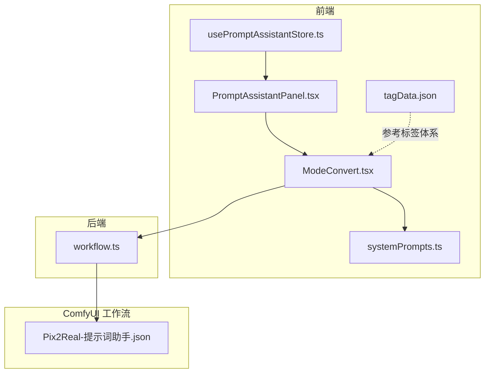
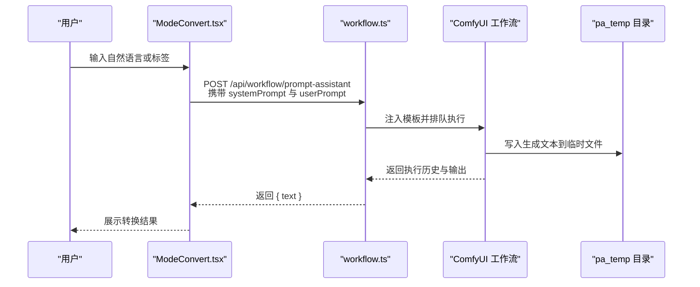
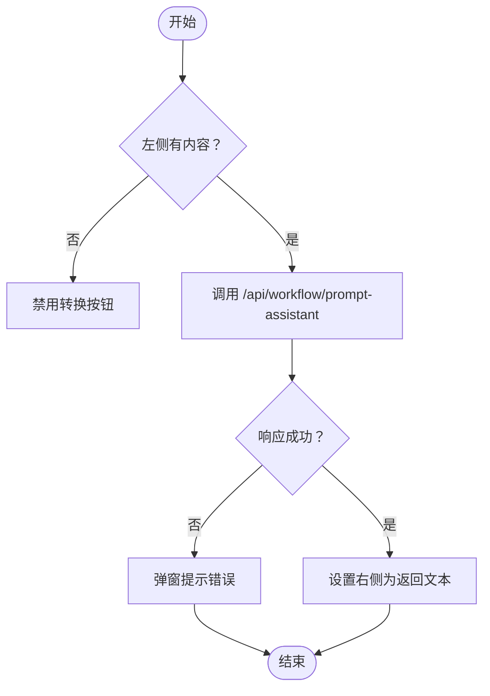
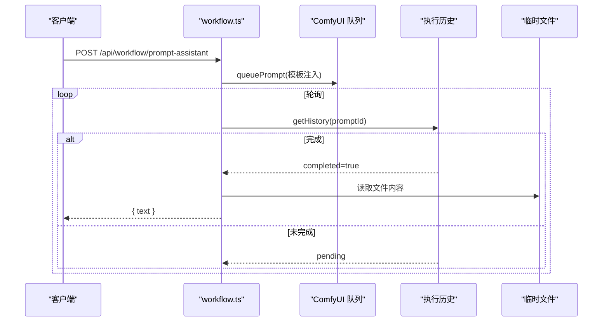
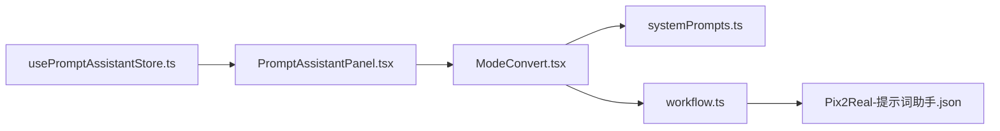

# 标签转换模式

<cite>
**本文引用的文件**
- [ModeConvert.tsx](file://client/src/components/prompt-assistant/ModeConvert.tsx)
- [systemPrompts.ts](file://client/src/components/prompt-assistant/systemPrompts.ts)
- [PromptAssistantPanel.tsx](file://client/src/components/PromptAssistantPanel.tsx)
- [usePromptAssistantStore.ts](file://client/src/hooks/usePromptAssistantStore.ts)
- [tagData.json](file://client/src/data/tagData.json)
- [workflow.ts](file://server/src/routes/workflow.ts)
- [Pix2Real-提示词助手.json](file://ComfyUI_API/Pix2Real-提示词助手.json)
- [SystemPrompt.txt](file://docs/SystemPrompt.txt)
- [SystemPrompt.txt（开发需求）](file://docs/提示词助理开发需求/SystemPrompt.txt)
</cite>

## 目录
1. [简介](#简介)
2. [项目结构](#项目结构)
3. [核心组件](#核心组件)
4. [架构总览](#架构总览)
5. [组件详解](#组件详解)
6. [依赖关系分析](#依赖关系分析)
7. [性能与优化](#性能与优化)
8. [故障排查指南](#故障排查指南)
9. [结论](#结论)
10. [附录](#附录)

## 简介
本文件聚焦“标签转换模式”，系统性阐述 ModeConvert 组件的功能实现与技术原理，涵盖从自然语言到 AI 绘画标签的转换流程、输入输出规范、转换规则、质量控制与验证机制，并提供使用示例、最佳实践与性能优化建议。该模式基于严格的系统提示词与 ComfyUI 工作流，确保转换过程可复现、可验证且高效。

## 项目结构
标签转换模式位于前端提示词助理面板中，通过一组系统提示词驱动后端 ComfyUI 工作流完成实际推理与文本生成。核心文件分布如下：
- 前端组件与状态管理：ModeConvert.tsx、PromptAssistantPanel.tsx、usePromptAssistantStore.ts、systemPrompts.ts
- 标签数据模型：tagData.json
- 后端路由与工作流：workflow.ts
- ComfyUI 工作流模板：Pix2Real-提示词助手.json
- 系统提示词文档：docs/SystemPrompt.txt 及其开发需求版本

图表来源
- [PromptAssistantPanel.tsx:1-139](file://client/src/components/PromptAssistantPanel.tsx#L1-L139)
- [ModeConvert.tsx:1-195](file://client/src/components/prompt-assistant/ModeConvert.tsx#L1-L195)
- [usePromptAssistantStore.ts:1-33](file://client/src/hooks/usePromptAssistantStore.ts#L1-L33)
- [systemPrompts.ts:1-145](file://client/src/components/prompt-assistant/systemPrompts.ts#L1-L145)
- [tagData.json:1-95](file://client/src/data/tagData.json#L1-L95)
- [workflow.ts:746-862](file://server/src/routes/workflow.ts#L746-L862)
- [Pix2Real-提示词助手.json:1-106](file://ComfyUI_API/Pix2Real-提示词助手.json#L1-L106)

章节来源
- [PromptAssistantPanel.tsx:1-139](file://client/src/components/PromptAssistantPanel.tsx#L1-L139)
- [ModeConvert.tsx:1-195](file://client/src/components/prompt-assistant/ModeConvert.tsx#L1-L195)
- [usePromptAssistantStore.ts:1-33](file://client/src/hooks/usePromptAssistantStore.ts#L1-L33)
- [systemPrompts.ts:1-145](file://client/src/components/prompt-assistant/systemPrompts.ts#L1-L145)
- [tagData.json:1-95](file://client/src/data/tagData.json#L1-L95)
- [workflow.ts:746-862](file://server/src/routes/workflow.ts#L746-L862)
- [Pix2Real-提示词助手.json:1-106](file://ComfyUI_API/Pix2Real-提示词助手.json#L1-L106)

## 核心组件
- ModeConvert 组件：提供自然语言与标签双向转换的 UI 与交互逻辑，调用后端 /api/workflow/prompt-assistant 接口获取转换结果。
- 系统提示词（SYSTEM_PROMPTS）：定义“自然语言→标签”和“标签→自然语言”的严格规则与工作流步骤。
- PromptAssistantPanel 面板：承载多个提示词助理模式（含标签转换），负责切换与渲染当前模式。
- usePromptAssistantStore 状态：维护面板开关、当前模式、初始文本与会话键等状态。
- 后端 workflow 路由：接收系统提示词与用户提示，注入到 ComfyUI 工作流模板，轮询执行结果并返回文本。
- ComfyUI 工作流模板：包含 LLM 推理节点、参数节点与文本保存节点，用于持久化生成结果。

章节来源
- [ModeConvert.tsx:32-195](file://client/src/components/prompt-assistant/ModeConvert.tsx#L32-L195)
- [systemPrompts.ts:4-49](file://client/src/components/prompt-assistant/systemPrompts.ts#L4-L49)
- [PromptAssistantPanel.tsx:19-139](file://client/src/components/PromptAssistantPanel.tsx#L19-L139)
- [usePromptAssistantStore.ts:5-32](file://client/src/hooks/usePromptAssistantStore.ts#L5-L32)
- [workflow.ts:746-862](file://server/src/routes/workflow.ts#L746-L862)
- [Pix2Real-提示词助手.json:36-106](file://ComfyUI_API/Pix2Real-提示词助手.json#L36-L106)

## 架构总览
标签转换模式采用“前端 UI + 系统提示词 + 后端路由 + ComfyUI 工作流”的分层架构。前端负责输入与展示，后端负责编排与执行，ComfyUI 负责推理与文本生成，最终将结果写入临时文件并通过接口返回。

图表来源
- [ModeConvert.tsx:5-14](file://client/src/components/prompt-assistant/ModeConvert.tsx#L5-L14)
- [workflow.ts:748-810](file://server/src/routes/workflow.ts#L748-L810)
- [Pix2Real-提示词助手.json:36-106](file://ComfyUI_API/Pix2Real-提示词助手.json#L36-L106)

## 组件详解

### ModeConvert 组件
- 功能职责
  - 提供左右两侧文本域：左侧为自然语言输入，右侧为标签输出；支持互转按钮进行双向转换。
  - 调用后端接口 /api/workflow/prompt-assistant，传入对应系统提示词与用户输入。
  - 支持复制按钮、加载态与错误提示。
- 关键交互
  - handleNaturalToTags：当左侧有内容时触发，调用 callAssistant 并将结果写入右侧。
  - handleTagsToNatural：当右侧有内容时触发，调用 callAssistant 并将结果写入左侧。
  - doCopy：复制当前文本到剪贴板，并短暂提示。
- 错误处理
  - 对后端响应非 OK 的情况统一弹窗提示错误信息。
- 状态管理
  - 使用 useState 管理左右文本、加载态与复制提示。
  - 通过 sessionKey 触发初始文本同步。

图表来源
- [ModeConvert.tsx:45-69](file://client/src/components/prompt-assistant/ModeConvert.tsx#L45-L69)
- [ModeConvert.tsx:5-14](file://client/src/components/prompt-assistant/ModeConvert.tsx#L5-L14)

章节来源
- [ModeConvert.tsx:32-195](file://client/src/components/prompt-assistant/ModeConvert.tsx#L32-L195)

### 系统提示词与转换规则
- 自然语言→标签（naturalToTags）
  - 角色定位：严格的图像提示生成器，仅输出纯英文逗号分隔标签。
  - 核心规则
    - 仅英文标签，无中文、无解释、无格式。
    - 严格一对一映射，不臆造未提及细节。
    - 抽象概念必须具象化（如“月光像刀”→“高对比光束、锐利阴影”）。
    - 禁止通用修饰词（如高质量、流行等）。
    - 标签优先级：主体/角色/核心对象 > 环境/背景/场景 > 光照/色彩/材质/细节 > 抽象/情感的具象化。
  - 工作流步骤：解析输入→抽象具象化→翻译为英文→按重要性排序→输出逗号分隔列表。
- 标签→自然语言（tagsToNatural）
  - 角色定位：专业的视觉提示工程师，将英文标签转为中文可视化段落。
  - 核心规则
    - 仅中文输出，避免隐喻、拟人与文学修辞。
    - 将抽象/比喻转化为可观测的物理状态。
    - 严格保真，包含所有标签。
    - 空间结构：主体（外观、姿态、服装、表情）→环境（背景物体、纹理、空间布置）→光照与色彩（光源方向、色调、氛围效果）。
    - 零冗余，不出现“这是一幅画”等元描述。
  - 工作流步骤：解析标签→识别抽象/比喻→映射为物理属性→按空间结构合成→输出中文段落。

章节来源
- [systemPrompts.ts:4-49](file://client/src/components/prompt-assistant/systemPrompts.ts#L4-L49)
- [SystemPrompt.txt:2-48](file://docs/SystemPrompt.txt#L2-L48)
- [SystemPrompt.txt（开发需求）:1-146](file://docs/提示词助理开发需求/SystemPrompt.txt#L1-L146)

### 后端路由与工作流执行
- 接口定义：POST /api/workflow/prompt-assistant
  - 请求体：{ systemPrompt, userPrompt }
  - 响应体：{ text }
- 执行流程
  - 解析模板（Pix2Real-提示词助手.json），注入 systemPrompt 与 userPrompt，并随机种子。
  - 配置临时文本输出路径（pa_temp），生成唯一文件名。
  - 入队 ComfyUI 提示，轮询执行历史直到完成（超时 180 秒）。
  - 读取临时文件内容作为 text 返回；若文件缺失或为空则返回错误。
- 错误处理
  - 缺少必要参数返回 400。
  - 超时返回 504。
  - 文件不存在或为空返回 500。

图表来源
- [workflow.ts:748-810](file://server/src/routes/workflow.ts#L748-L810)
- [Pix2Real-提示词助手.json:36-106](file://ComfyUI_API/Pix2Real-提示词助手.json#L36-L106)

章节来源
- [workflow.ts:746-862](file://server/src/routes/workflow.ts#L746-L862)
- [Pix2Real-提示词助手.json:1-106](file://ComfyUI_API/Pix2Real-提示词助手.json#L1-L106)

### 标签数据模型与参考体系
- tagData.json 定义了标签分类与层级，便于理解标签结构与多选/单选约束，辅助人工校验与二次编辑。
- 分类维度：人物、场景、风格、镜头等，每类包含若干子类与标签集合。
- 多选/单选标记：用于控制标签组合策略，避免冲突与冗余。

章节来源
- [tagData.json:1-95](file://client/src/data/tagData.json#L1-L95)

### 面板与状态管理
- PromptAssistantPanel：承载多个模式标签页，当前激活模式决定渲染内容。
- usePromptAssistantStore：维护 isOpen、activeMode、initialText、sessionKey 等状态，打开面板时重置 sessionKey 以触发组件更新。

章节来源
- [PromptAssistantPanel.tsx:19-139](file://client/src/components/PromptAssistantPanel.tsx#L19-L139)
- [usePromptAssistantStore.ts:5-32](file://client/src/hooks/usePromptAssistantStore.ts#L5-L32)

## 依赖关系分析
- 组件耦合
  - ModeConvert 依赖 systemPrompts 中的规则字符串与后端接口。
  - PromptAssistantPanel 通过状态选择渲染 ModeConvert。
  - usePromptAssistantStore 为面板与模式切换提供状态支撑。
- 外部依赖
  - 后端依赖 ComfyUI 工作流执行引擎与临时文件系统。
  - 工作流模板依赖特定模型与参数节点，确保推理稳定性与一致性。

图表来源
- [ModeConvert.tsx:1-145](file://client/src/components/prompt-assistant/ModeConvert.tsx#L1-L145)
- [systemPrompts.ts:1-145](file://client/src/components/prompt-assistant/systemPrompts.ts#L1-L145)
- [PromptAssistantPanel.tsx:1-139](file://client/src/components/PromptAssistantPanel.tsx#L1-L139)
- [usePromptAssistantStore.ts:1-33](file://client/src/hooks/usePromptAssistantStore.ts#L1-L33)
- [workflow.ts:746-862](file://server/src/routes/workflow.ts#L746-L862)
- [Pix2Real-提示词助手.json:1-106](file://ComfyUI_API/Pix2Real-提示词助手.json#L1-L106)

## 性能与优化
- 推理参数
  - 温度、Top-k、Top-p、典型采样等参数在工作流模板中固定，有助于稳定输出与降低漂移。
- 超时与轮询
  - 后端轮询超时设为 180 秒，避免长时间占用资源；建议前端增加取消与重试机制。
- 文本持久化
  - 通过临时文件保存生成文本，减少内存压力；注意清理策略与并发安全。
- UI 体验
  - 加载态与禁用按钮提升交互反馈；复制按钮与占位符增强可用性。
- 最佳实践
  - 输入尽量具体、明确，避免模糊表达，以提高严格映射的准确性。
  - 标签优先级与禁止修饰词规则可显著提升下游生成质量。
  - 复杂场景建议先做标签→自然语言回译，再进行二次编辑与扩写。

[本节为通用性能讨论，无需列出具体文件来源]

## 故障排查指南
- 常见错误与处理
  - 400 缺少参数：检查请求体是否包含 systemPrompt 与 userPrompt。
  - 504 超时：确认 ComfyUI 是否正常运行，适当延长超时或优化工作流。
  - 500 结果文本为空：检查临时文件是否存在与可读，确认工作流节点正确写入。
  - 前端弹窗错误：捕获异常并提示用户重试或检查网络。
- 调试建议
  - 在浏览器开发者工具中观察网络请求与响应。
  - 在后端日志中定位工作流执行历史与文件读取路径。
  - 使用标签→自然语言回译验证标签质量与一致性。

章节来源
- [workflow.ts:748-810](file://server/src/routes/workflow.ts#L748-L810)
- [ModeConvert.tsx:45-69](file://client/src/components/prompt-assistant/ModeConvert.tsx#L45-L69)

## 结论
标签转换模式通过严格的系统提示词与稳定的后端执行链路，实现了从自然语言到 AI 绘画标签的高保真映射。其设计强调“零幻觉”“具象化”“优先级排序”与“严格保真”，并在 UI 与状态层面提供了良好的交互体验。结合标签数据模型与回译验证机制，可进一步提升标签质量与一致性，满足复杂场景下的提示工程需求。

[本节为总结性内容，无需列出具体文件来源]

## 附录

### 输入输出规范
- 输入
  - 自然语言：中文描述，建议具体、可感知。
  - 标签：英文逗号分隔，遵循优先级与禁止修饰词规则。
- 输出
  - 自然语言→标签：逗号分隔英文标签列表。
  - 标签→自然语言：中文可视化段落，按空间结构组织。

章节来源
- [systemPrompts.ts:4-49](file://client/src/components/prompt-assistant/systemPrompts.ts#L4-L49)
- [SystemPrompt.txt:2-48](file://docs/SystemPrompt.txt#L2-L48)

### 使用示例与最佳实践
- 示例场景
  - 描述“一位穿着汉服的少女站在樱花树下，夕阳西下，微风拂过，裙摆飘逸”→生成标签（主体、环境、光照、细节）→回译为自然语言验证一致性。
  - 输入标签“long hair, hanfu, cherry blossoms, sunset, wind, flowing skirt”→生成中文描述→人工微调。
- 最佳实践
  - 明确主体与背景边界，避免模糊指代。
  - 将抽象情感（如“忧郁”）转化为可见状态（如“低垂的眼神、冷色调”）。
  - 控制标签数量与冗余，优先保留高重要性元素。
  - 利用回译验证与标签数据模型交叉核验，确保可复现与可维护。

[本节为概念性内容，无需列出具体文件来源]