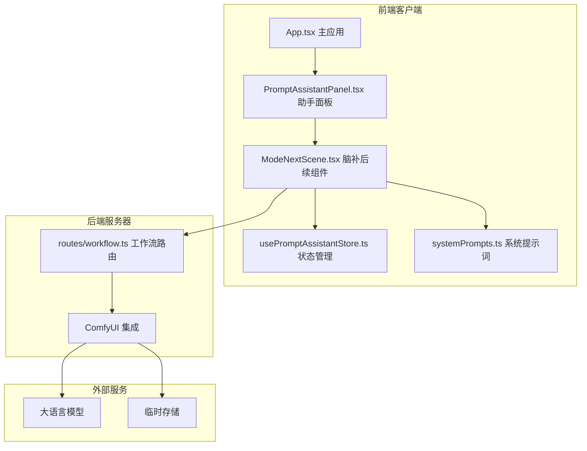
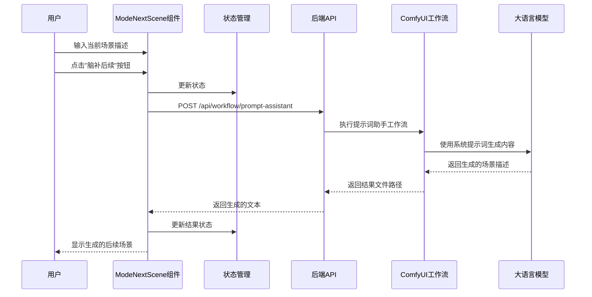
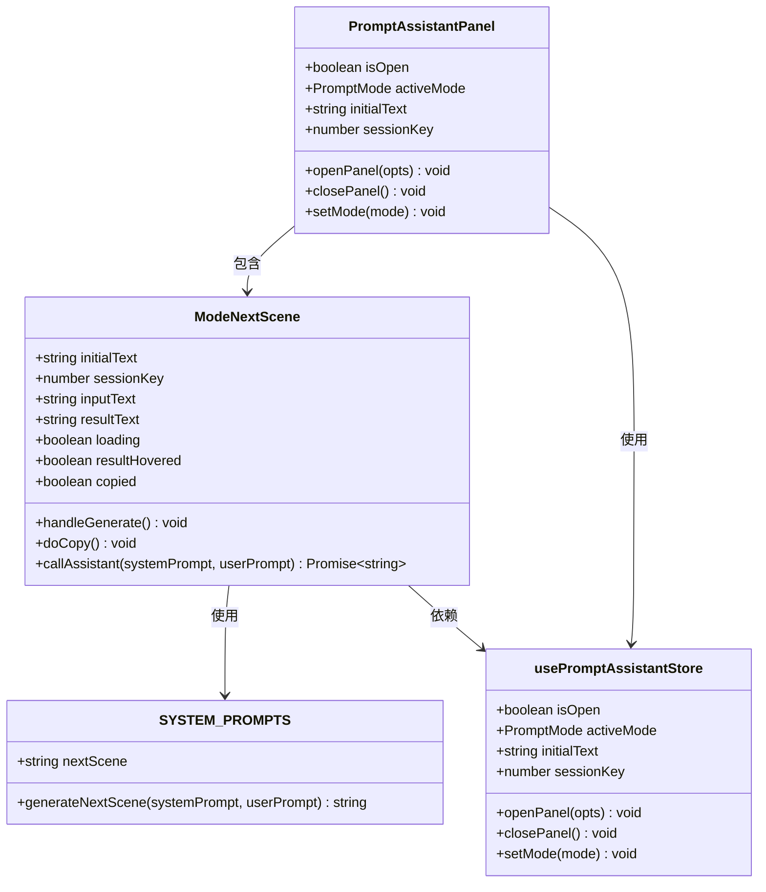
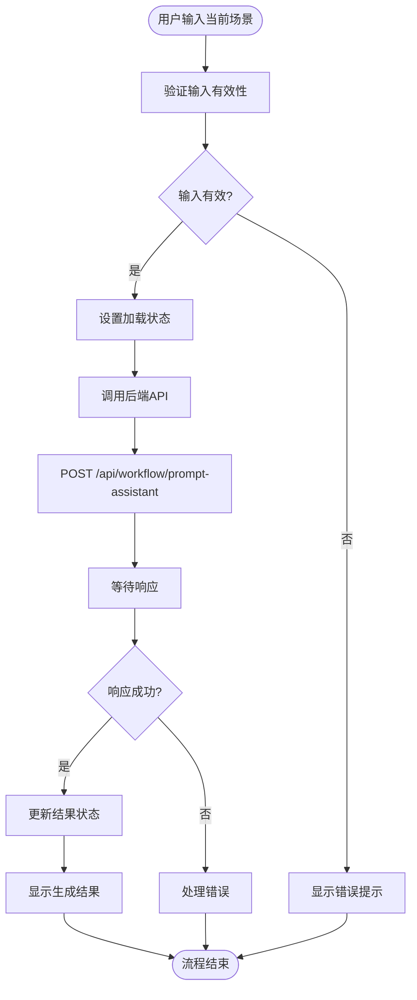
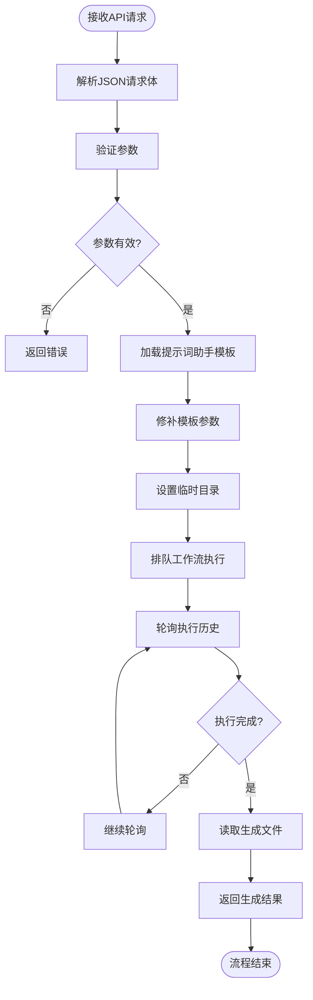
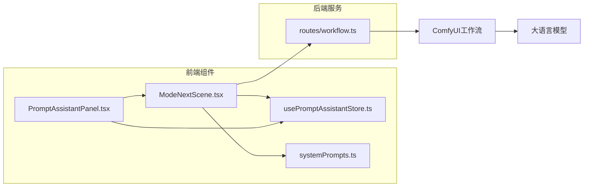

# 脑补后续模式

<cite>
**本文档引用的文件**
- [ModeNextScene.tsx](file://client/src/components/prompt-assistant/ModeNextScene.tsx)
- [systemPrompts.ts](file://client/src/components/prompt-assistant/systemPrompts.ts)
- [PromptAssistantPanel.tsx](file://client/src/components/PromptAssistantPanel.tsx)
- [usePromptAssistantStore.ts](file://client/src/hooks/usePromptAssistantStore.ts)
- [workflow.ts](file://server/src/routes/workflow.ts)
- [SystemPrompt.txt](file://docs/SystemPrompt.txt)
- [App.tsx](file://client/src/components/App.tsx)
</cite>

## 目录
1. [简介](#简介)
2. [项目结构](#项目结构)
3. [核心组件](#核心组件)
4. [架构概览](#架构概览)
5. [详细组件分析](#详细组件分析)
6. [依赖关系分析](#依赖关系分析)
7. [性能考虑](#性能考虑)
8. [故障排除指南](#故障排除指南)
9. [结论](#结论)
10. [附录](#附录)

## 简介

"脑补后续模式"是Pix2Real项目中的一个创新功能模块，旨在为用户提供智能的场景续写和故事发展建议。该模式通过AI创意生成算法，基于当前场景描述自动生成合理的后续发展，帮助创作者保持故事连贯性和情节推进的自然性。

该功能的核心价值在于：
- **智能场景续写**：基于当前镜头描述生成下一个合理场景
- **故事连贯性保持**：确保角色外观、环境设置和动作逻辑的一致性
- **创造性思维模拟**：模拟人类编剧的创造性思维过程
- **高效内容创作**：显著提升内容创作的效率和质量

## 项目结构

Pix2Real项目采用前后端分离的架构设计，"脑补后续模式"作为前端提示词助理功能的一部分，与整个系统的其他组件紧密集成。

**图表来源**
- [App.tsx:54-335](file://client/src/components/App.tsx#L54-L335)
- [PromptAssistantPanel.tsx:19-139](file://client/src/components/PromptAssistantPanel.tsx#L19-L139)
- [ModeNextScene.tsx:32-142](file://client/src/components/prompt-assistant/ModeNextScene.tsx#L32-L142)
- [workflow.ts:746-810](file://server/src/routes/workflow.ts#L746-L810)

**章节来源**
- [App.tsx:54-335](file://client/src/components/App.tsx#L54-L335)
- [PromptAssistantPanel.tsx:19-139](file://client/src/components/PromptAssistantPanel.tsx#L19-L139)

## 核心组件

### ModeNextScene 组件

ModeNextScene是"脑补后续模式"的核心实现组件，负责处理用户输入并生成相应的场景续写。

#### 主要功能特性

1. **双面板界面设计**：左侧显示当前场景，右侧显示生成的后续场景
2. **实时状态管理**：支持加载状态、复制状态和悬停状态的实时反馈
3. **系统提示词集成**：使用专门设计的系统提示词来指导AI生成
4. **错误处理机制**：完善的错误捕获和用户友好的错误提示

#### 核心状态管理

组件维护以下关键状态：
- `inputText`: 用户输入的当前场景描述
- `resultText`: AI生成的后续场景描述
- `loading`: 加载状态指示
- `resultHovered`: 结果区域悬停状态
- `copied`: 复制操作状态

**章节来源**
- [ModeNextScene.tsx:32-142](file://client/src/components/prompt-assistant/ModeNextScene.tsx#L32-L142)

### 系统提示词配置

系统提示词是AI创意生成算法的核心指导原则，专门为"脑补后续模式"设计。

#### 关键约束条件

1. **纯视觉描述**：仅允许视觉元素描述，禁止心理描述和抽象情感
2. **角色一致性**：角色外观和服装必须与前一镜头保持一致
3. **空间逻辑**：场景中的物体描述必须保持空间逻辑性
4. **动作连续性**：动作必须保持连续性
5. **情感表达**：通过视觉元素（表情、姿态、光线变化）自然传达情感
6. **输出长度匹配**：输出细节水平必须大致匹配输入

**章节来源**
- [systemPrompts.ts:94-111](file://client/src/components/prompt-assistant/systemPrompts.ts#L94-L111)
- [SystemPrompt.txt:96-114](file://docs/SystemPrompt.txt#L96-L114)

## 架构概览

"脑补后续模式"的完整架构包含前端组件、状态管理和后端服务三个主要层次。

**图表来源**
- [ModeNextScene.tsx:43-54](file://client/src/components/prompt-assistant/ModeNextScene.tsx#L43-L54)
- [workflow.ts:746-810](file://server/src/routes/workflow.ts#L746-L810)

## 详细组件分析

### 组件类图

**图表来源**
- [ModeNextScene.tsx:32-142](file://client/src/components/prompt-assistant/ModeNextScene.tsx#L32-L142)
- [PromptAssistantPanel.tsx:19-139](file://client/src/components/PromptAssistantPanel.tsx#L19-L139)
- [usePromptAssistantStore.ts:15-32](file://client/src/hooks/usePromptAssistantStore.ts#L15-L32)
- [systemPrompts.ts:4-144](file://client/src/components/prompt-assistant/systemPrompts.ts#L4-L144)

### 数据流分析

#### 前端数据流

**图表来源**
- [ModeNextScene.tsx:43-54](file://client/src/components/prompt-assistant/ModeNextScene.tsx#L43-L54)
- [ModeNextScene.tsx:56-60](file://client/src/components/prompt-assistant/ModeNextScene.tsx#L56-L60)

#### 后端处理流程

**图表来源**
- [workflow.ts:748-810](file://server/src/routes/workflow.ts#L748-L810)

**章节来源**
- [ModeNextScene.tsx:43-60](file://client/src/components/prompt-assistant/ModeNextScene.tsx#L43-L60)
- [workflow.ts:748-810](file://server/src/routes/workflow.ts#L748-L810)

### AI创意生成算法

#### 上下文记忆机制

系统通过以下方式实现上下文记忆：

1. **角色一致性保持**：系统提示词明确规定角色外观和服装必须与前一镜头保持一致
2. **环境继承规则**：每个镜头必须继承前一镜头的所有环境特征
3. **动作连续性约束**：动作必须保持连续性，确保故事发展的自然性
4. **情感表达机制**：通过视觉元素（表情、姿态、光线变化）自然传达情感

#### 创造性思维模拟

系统通过以下方式模拟创造性思维：

1. **多维度思考**：同时考虑角色、环境、动作和情感四个维度
2. **逻辑推理**：基于当前场景的逻辑推导下一个合理场景
3. **细节丰富化**：在保持一致性的同时增加适当的细节
4. **创新元素融入**：在符合逻辑的前提下引入创新元素

**章节来源**
- [systemPrompts.ts:94-111](file://client/src/components/prompt-assistant/systemPrompts.ts#L94-L111)
- [SystemPrompt.txt:96-114](file://docs/SystemPrompt.txt#L96-L114)

## 依赖关系分析

### 组件耦合度分析

**图表来源**
- [ModeNextScene.tsx:32-142](file://client/src/components/prompt-assistant/ModeNextScene.tsx#L32-L142)
- [PromptAssistantPanel.tsx:19-139](file://client/src/components/PromptAssistantPanel.tsx#L19-L139)
- [usePromptAssistantStore.ts:15-32](file://client/src/hooks/usePromptAssistantStore.ts#L15-L32)
- [workflow.ts:746-810](file://server/src/routes/workflow.ts#L746-L810)

### 外部依赖

系统对外部依赖主要包括：

1. **ComfyUI工作流引擎**：提供AI创意生成能力
2. **大语言模型**：执行具体的创意生成任务
3. **临时文件存储**：存储中间生成结果
4. **浏览器API**：剪贴板操作和网络请求

**章节来源**
- [workflow.ts:746-810](file://server/src/routes/workflow.ts#L746-L810)

## 性能考虑

### 前端性能优化

1. **状态最小化**：仅维护必要的组件状态，避免不必要的重新渲染
2. **异步处理**：所有网络请求都采用异步处理，不阻塞UI线程
3. **内存管理**：及时清理临时状态和事件监听器
4. **用户体验优化**：提供加载指示器和即时反馈

### 后端性能优化

1. **工作流队列管理**：通过ComfyUI的队列系统管理并发请求
2. **资源池管理**：合理管理GPU和CPU资源
3. **缓存策略**：对频繁使用的模板进行缓存
4. **超时控制**：设置合理的超时时间防止资源泄露

## 故障排除指南

### 常见问题及解决方案

#### 1. 生成超时问题

**症状**：点击"脑补后续"按钮后长时间无响应

**可能原因**：
- 大语言模型响应超时
- 网络连接不稳定
- ComfyUI工作流执行缓慢

**解决方法**：
- 检查网络连接稳定性
- 查看ComfyUI服务状态
- 适当调整系统提示词复杂度

#### 2. 生成结果不符合预期

**症状**：生成的后续场景与当前场景关联度不高

**可能原因**：
- 输入描述不够具体
- 系统提示词约束过严
- 角色或环境描述不一致

**解决方法**：
- 提供更详细的场景描述
- 调整输入中的关键元素
- 确保角色外观和环境设置的一致性

#### 3. 复制功能异常

**症状**：点击复制按钮后无法复制到剪贴板

**可能原因**：
- 浏览器安全策略限制
- 权限不足
- 兼容性问题

**解决方法**：
- 检查浏览器权限设置
- 尝试手动选择复制
- 更换浏览器测试

**章节来源**
- [ModeNextScene.tsx:49-50](file://client/src/components/prompt-assistant/ModeNextScene.tsx#L49-L50)
- [workflow.ts:786-789](file://server/src/routes/workflow.ts#L786-L789)

## 结论

"脑补后续模式"作为Pix2Real项目中的创新功能，成功地将AI创意生成技术与故事创作实践相结合。通过精心设计的系统提示词、严格的上下文记忆机制和高效的前后端架构，该模式能够为用户提供高质量的场景续写建议。

### 主要优势

1. **技术创新性**：首次在图像生成领域实现智能场景续写
2. **实用性**：直接服务于内容创作者的实际需求
3. **可扩展性**：模块化设计便于功能扩展和改进
4. **用户体验**：简洁直观的操作界面和流畅的交互体验

### 应用前景

该模式不仅适用于当前的图像生成场景，还可以扩展到：
- 视频内容创作
- 游戏场景设计
- 动漫制作流程
- 影视剧本创作

## 附录

### 使用场景和创作指导

#### 1. 分镜脚本创作

**适用场景**：需要快速生成连续分镜的动画或视频制作

**创作步骤**：
1. 描述当前镜头的关键元素
2. 点击"脑补后续"生成下一个镜头
3. 根据生成结果调整和完善
4. 重复此过程直到完成整个故事线

#### 2. 故事板设计

**适用场景**：需要创建详细视觉故事板的项目

**设计要点**：
- 保持角色外观的一致性
- 维护场景环境的连续性
- 确保动作逻辑的合理性
- 注重情感表达的自然性

#### 3. 内容创作效率提升

**实用技巧**：
- 提供具体而详细的场景描述
- 明确角色的关键特征和服装
- 保持环境设置的基本一致性
- 利用生成结果作为灵感起点

### 最佳实践建议

1. **输入质量优先**：提供清晰、具体的场景描述
2. **迭代优化**：根据生成结果进行微调和优化
3. **创意结合**：将AI生成结果与个人创意相结合
4. **持续改进**：根据使用经验不断优化输入方式