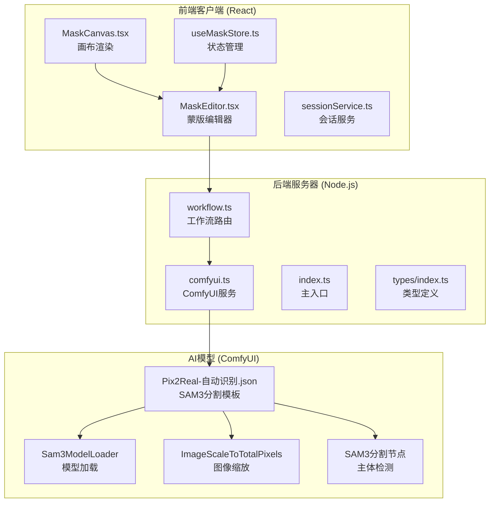
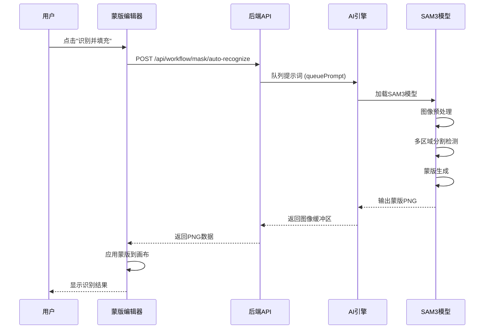
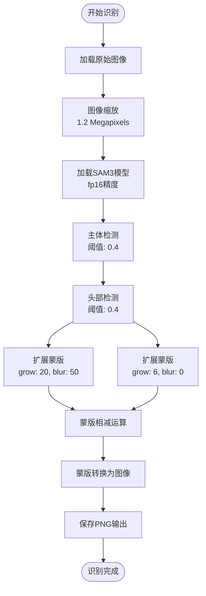
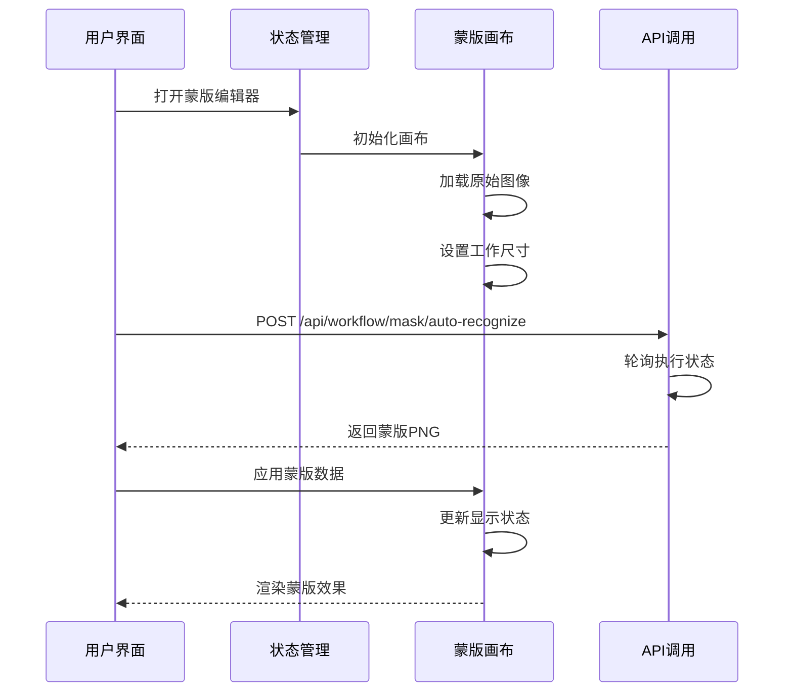
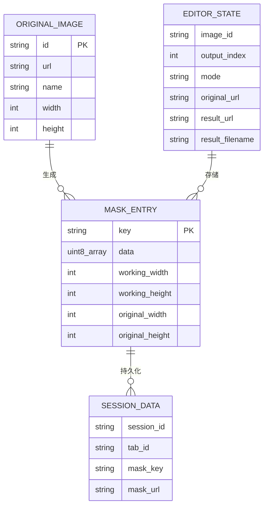
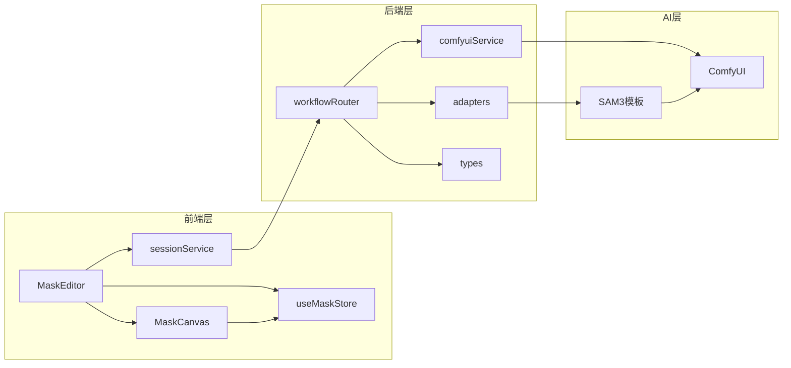

# AI自动识别功能

<cite>
**本文档引用的文件**
- [MaskEditor.tsx](file://client/src/components/MaskEditor.tsx)
- [MaskCanvas.tsx](file://client/src/components/MaskCanvas.tsx)
- [useMaskStore.ts](file://client/src/hooks/useMaskStore.ts)
- [maskConfig.ts](file://client/src/config/maskConfig.ts)
- [sessionService.ts](file://client/src/services/sessionService.ts)
- [workflow.ts](file://server/src/routes/workflow.ts)
- [comfyui.ts](file://server/src/services/comfyui.ts)
- [index.ts](file://server/src/index.ts)
- [Pix2Real-自动识别.json](file://ComfyUI_API/Pix2Real-自动识别.json)
- [Pix2Real-自动识别Fixed.json](file://ComfyUI_API/Pix2Real-自动识别Fixed.json)
- [Workflow0Adapter.ts](file://server/src/adapters/Workflow0Adapter.ts)
- [index.ts](file://server/src/types/index.ts)
- [useWorkflowStore.ts](file://client/src/hooks/useWorkflowStore.ts)
</cite>

## 目录
1. [简介](#简介)
2. [项目结构](#项目结构)
3. [核心组件](#核心组件)
4. [架构概览](#架构概览)
5. [详细组件分析](#详细组件分析)
6. [依赖关系分析](#依赖关系分析)
7. [性能考虑](#性能考虑)
8. [故障排除指南](#故障排除指南)
9. [结论](#结论)
10. [附录](#附录)

## 简介

AI自动识别功能是CorineKit Pix2Real项目中的核心智能化组件，基于SAM3（Segment Anything Model 3）图像分割技术，为用户提供智能的蒙版生成能力。该功能通过深度学习算法自动识别人物主体、头部、手部、衣物等关键区域，生成精确的二值蒙版，显著提升后续图像处理工作的效率和质量。

本功能采用前后端分离架构，前端负责用户交互和蒙版编辑，后端通过ComfyUI执行AI模型推理，实现了从图像上传、AI识别、蒙版生成到结果展示的完整工作流程。

## 项目结构

项目采用模块化设计，主要分为三个层次：

**图表来源**
- [MaskEditor.tsx:1-375](file://client/src/components/MaskEditor.tsx#L1-L375)
- [workflow.ts:1-862](file://server/src/routes/workflow.ts#L1-L862)
- [comfyui.ts:1-285](file://server/src/services/comfyui.ts#L1-L285)

**章节来源**
- [MaskEditor.tsx:1-375](file://client/src/components/MaskEditor.tsx#L1-L375)
- [workflow.ts:1-862](file://server/src/routes/workflow.ts#L1-L862)
- [comfyui.ts:1-285](file://server/src/services/comfyui.ts#L1-L285)

## 核心组件

### 蒙版编辑器 (MaskEditor)

蒙版编辑器是用户交互的核心界面，提供了完整的蒙版编辑功能：

- **自动识别按钮**：一键触发AI图像分割
- **画笔工具**：支持多种画笔参数调节
- **历史记录**：撤销/重做功能
- **蒙版叠加**：实时预览蒙版效果
- **导出功能**：支持混合结果导出

### 蒙版画布 (MaskCanvas)

画布组件负责蒙版的可视化渲染和交互操作：

- **双缓冲渲染**：优化绘制性能
- **非累积软笔刷**：防止边缘硬化
- **多模式显示**：支持不同叠加模式
- **响应式缩放**：适配不同屏幕尺寸

### 状态管理 (useMaskStore)

集中管理蒙版相关状态：

- **蒙版数据存储**：RGBA像素数据
- **编辑器状态**：打开/关闭状态
- **工作尺寸限制**：最大2048像素
- **历史栈管理**：最多30步历史记录

**章节来源**
- [MaskEditor.tsx:141-375](file://client/src/components/MaskEditor.tsx#L141-L375)
- [MaskCanvas.tsx:39-677](file://client/src/components/MaskCanvas.tsx#L39-L677)
- [useMaskStore.ts:21-51](file://client/src/hooks/useMaskStore.ts#L21-L51)

## 架构概览

AI自动识别功能采用三层架构设计，实现了清晰的职责分离：

**图表来源**
- [MaskEditor.tsx:196-235](file://client/src/components/MaskEditor.tsx#L196-L235)
- [workflow.ts:812-859](file://server/src/routes/workflow.ts#L812-L859)
- [comfyui.ts:47-60](file://server/src/services/comfyui.ts#L47-L60)

系统架构的关键特点：

1. **异步处理**：使用轮询机制等待AI模型完成
2. **错误处理**：超时和错误情况的优雅降级
3. **资源管理**：及时清理临时文件和内存
4. **性能优化**：图像缩放和缓存策略

## 详细组件分析

### 自动识别工作流程

#### 图像预处理阶段

**图表来源**
- [Pix2Real-自动识别.json:1-161](file://ComfyUI_API/Pix2Real-自动识别.json#L1-L161)
- [Pix2Real-自动识别Fixed.json:1-149](file://ComfyUI_API/Pix2Real-自动识别Fixed.json#L1-L149)

#### AI模型调用机制

后端通过以下步骤执行AI模型：

1. **文件上传**：将用户图像上传到ComfyUI
2. **模板构建**：动态修改SAM3分割模板
3. **队列提交**：将任务加入ComfyUI执行队列
4. **状态轮询**：每800ms检查执行状态
5. **结果获取**：下载生成的蒙版图像

#### 蒙版生成算法

蒙版生成采用多阶段算法：

1. **主体分割**：使用"Body"提示词检测人体主体
2. **头部分割**：使用"Head"提示词检测头部区域  
3. **蒙版相减**：主体蒙版减去头部蒙版得到身体部分
4. **边界扩展**：对蒙版进行膨胀和模糊处理
5. **最终输出**：生成可用于图像处理的PNG格式蒙版

**章节来源**
- [workflow.ts:812-859](file://server/src/routes/workflow.ts#L812-L859)
- [comfyui.ts:9-25](file://server/src/services/comfyui.ts#L9-L25)

### 前端交互流程

**图表来源**
- [MaskEditor.tsx:196-235](file://client/src/components/MaskEditor.tsx#L196-L235)
- [MaskCanvas.tsx:124-150](file://client/src/components/MaskCanvas.tsx#L124-L150)

### 数据流处理

蒙版数据在系统中的流转过程：

**图表来源**
- [useMaskStore.ts:4-19](file://client/src/hooks/useMaskStore.ts#L4-L19)
- [maskConfig.ts:18-20](file://client/src/config/maskConfig.ts#L18-L20)

**章节来源**
- [useMaskStore.ts:1-51](file://client/src/hooks/useMaskStore.ts#L1-L51)
- [maskConfig.ts:1-20](file://client/src/config/maskConfig.ts#L1-L20)

## 依赖关系分析

### 组件耦合度

**图表来源**
- [MaskEditor.tsx:1-375](file://client/src/components/MaskEditor.tsx#L1-L375)
- [workflow.ts:1-862](file://server/src/routes/workflow.ts#L1-L862)
- [comfyui.ts:1-285](file://server/src/services/comfyui.ts#L1-L285)

### 关键依赖关系

1. **前端依赖**：React Hooks、Zustand状态管理
2. **后端依赖**：Express、Multer文件上传、WebSocket通信
3. **AI依赖**：ComfyUI、SAM3模型、node-fetch网络请求
4. **类型安全**：TypeScript接口定义确保数据一致性

**章节来源**
- [workflow.ts:1-28](file://server/src/routes/workflow.ts#L1-L28)
- [comfyui.ts:1-8](file://server/src/services/comfyui.ts#L1-L8)

## 性能考虑

### 内存优化策略

1. **工作尺寸限制**：最大2048像素，避免内存溢出
2. **OffscreenCanvas**：利用Web Workers进行离屏渲染
3. **增量更新**：只在必要时重新计算蒙版
4. **资源清理**：及时释放Object URLs和图像缓冲区

### 并发处理

1. **异步轮询**：避免阻塞主线程
2. **超时控制**：120秒超时防止无限等待
3. **错误恢复**：网络异常时的重试机制
4. **进度反馈**：实时显示识别进度

### 缓存机制

1. **模型缓存**：SAM3模型加载后缓存
2. **图像缓存**：缩放后的图像临时存储
3. **结果缓存**：最近生成的蒙版数据缓存

## 故障排除指南

### 常见问题及解决方案

#### 1. AI识别超时

**症状**：点击"识别并填充"后出现超时错误

**可能原因**：
- ComfyUI服务未启动
- SAM3模型加载失败
- GPU内存不足
- 网络连接异常

**解决步骤**：
1. 检查ComfyUI服务状态
2. 验证GPU可用性
3. 重启AI服务进程
4. 清理GPU缓存

#### 2. 蒙版显示异常

**症状**：识别结果不准确或显示错误

**可能原因**：
- 图像分辨率过高
- SAM3模型版本不兼容
- 分割阈值设置不当

**解决步骤**：
1. 降低图像分辨率
2. 更新SAM3模型
3. 调整阈值参数
4. 重新训练模型

#### 3. 性能问题

**症状**：识别速度慢或界面卡顿

**优化建议**：
1. 使用更高性能的GPU
2. 减少同时运行的任务数
3. 清理浏览器缓存
4. 关闭不必要的应用程序

### 替代方案

当AI识别功能不可用时，可以使用以下替代方案：

1. **手动绘制蒙版**：使用画笔工具手动创建
2. **导入现有蒙版**：支持PNG格式文件导入
3. **基础蒙版生成**：使用简单的阈值分割
4. **外部工具处理**：使用专业图像编辑软件

**章节来源**
- [workflow.ts:830-844](file://server/src/routes/workflow.ts#L830-L844)
- [MaskEditor.tsx:230-235](file://client/src/components/MaskEditor.tsx#L230-L235)

## 结论

AI自动识别功能通过集成SAM3图像分割技术，为用户提供了智能化的蒙版生成解决方案。该功能具有以下优势：

1. **高精度识别**：基于深度学习的多区域分割算法
2. **用户友好**：直观的图形界面和实时预览
3. **性能优化**：异步处理和资源管理策略
4. **可扩展性**：模块化设计便于功能扩展

未来改进方向包括：
- 支持更多AI模型和分割算法
- 增强用户自定义选项
- 优化移动端用户体验
- 集成更多图像处理功能

## 附录

### API接口定义

| 接口 | 方法 | 路径 | 功能描述 |
|------|------|------|----------|
| 自动识别 | POST | `/api/workflow/mask/auto-recognize` | 执行SAM3图像分割 |
| 导出混合 | POST | `/api/workflow/export-blend` | 保存混合结果 |

### 配置参数

| 参数名 | 类型 | 默认值 | 描述 |
|--------|------|--------|------|
| grow | number | 20/6 | 蒙版膨胀像素数 |
| blur | number | 50/0 | 蒙版模糊半径 |
| threshold | number | 0.4 | 分割阈值 |
| precision | string | fp16 | 模型精度 |

### 错误码对照表

| 错误码 | 描述 | 处理建议 |
|--------|------|----------|
| 504 | 超时 | 检查网络连接，重试操作 |
| 500 | 服务器错误 | 查看日志，重启服务 |
| 400 | 参数错误 | 验证输入参数有效性 |
| 404 | 资源不存在 | 检查文件路径和权限 |