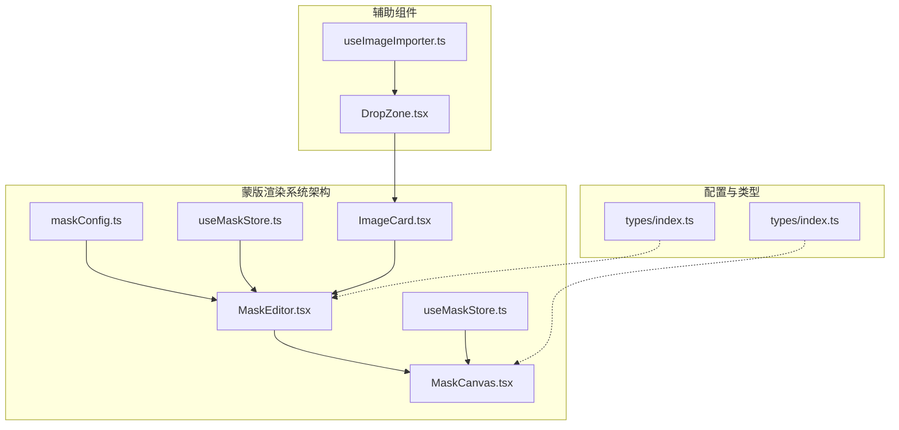
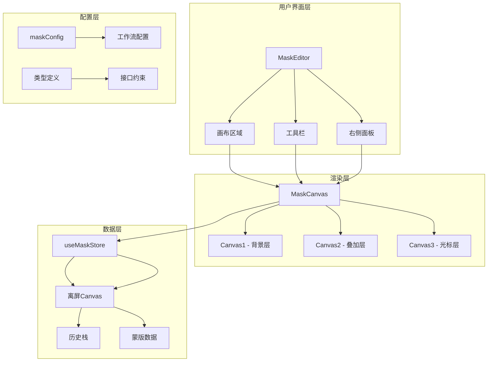
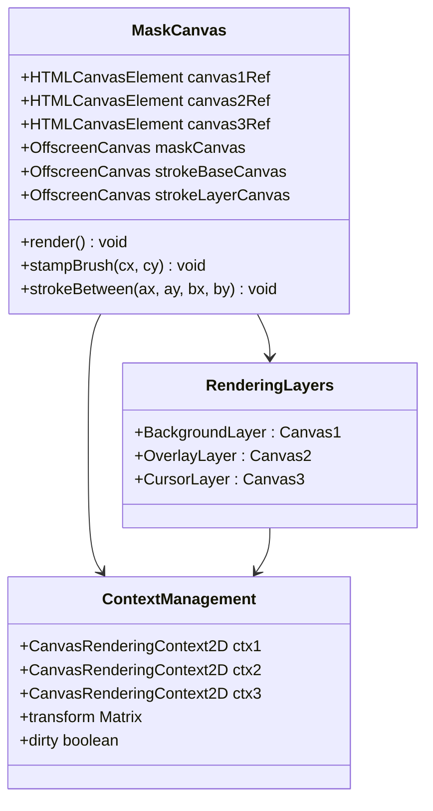
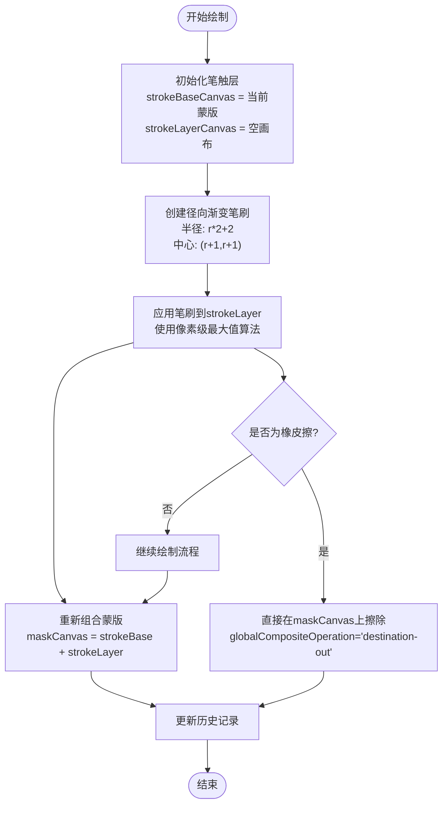
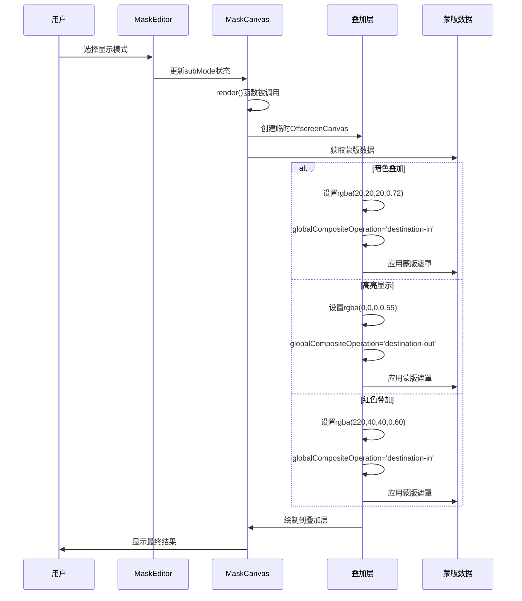
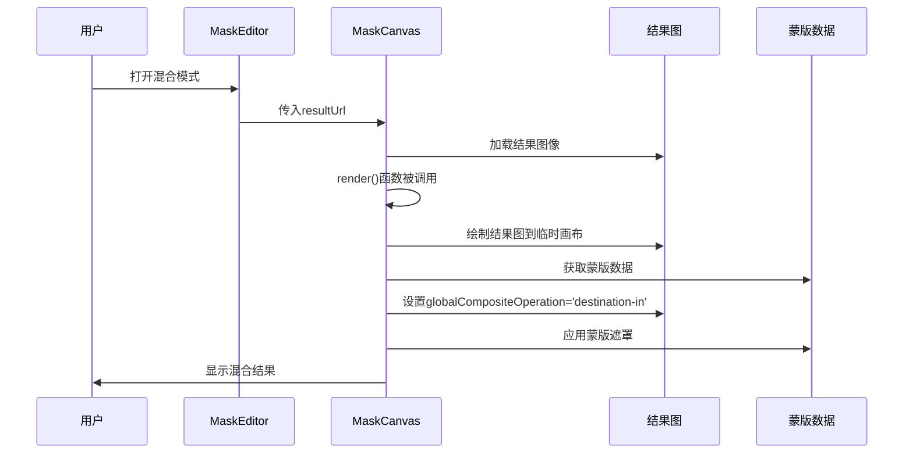
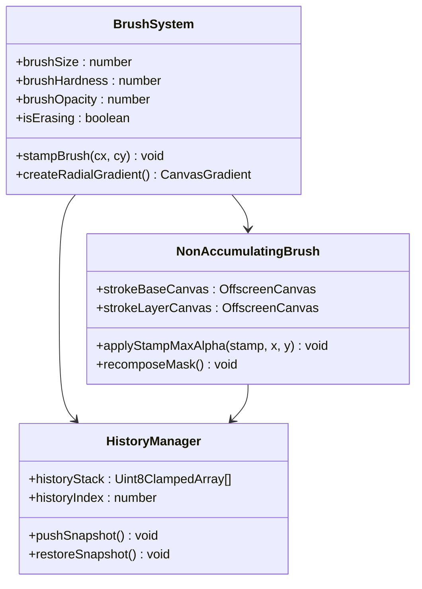
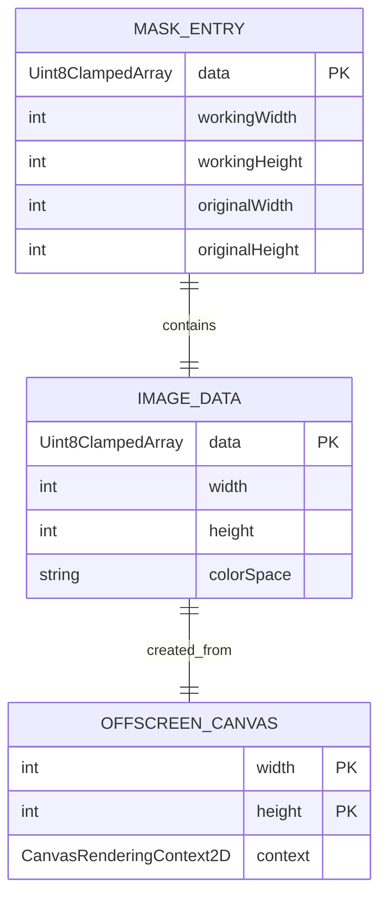
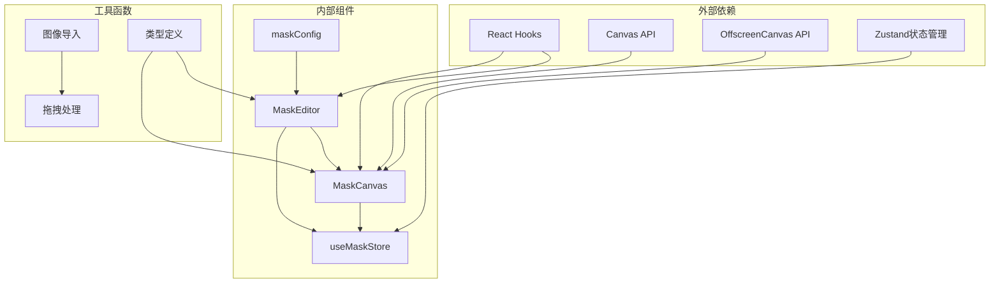
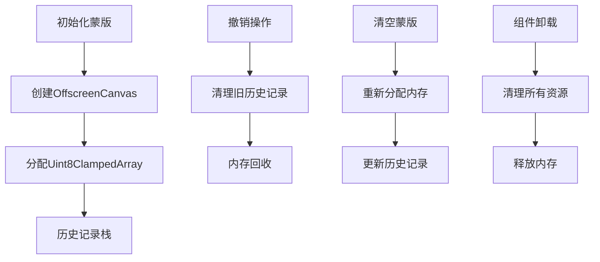

# 蒙版画布渲染系统

<cite>
**本文档引用的文件**
- [MaskCanvas.tsx](file://client/src/components/MaskCanvas.tsx)
- [MaskEditor.tsx](file://client/src/components/MaskEditor.tsx)
- [maskConfig.ts](file://client/src/config/maskConfig.ts)
- [useMaskStore.ts](file://client/src/hooks/useMaskStore.ts)
- [ImageCard.tsx](file://client/src/components/ImageCard.tsx)
- [DropZone.tsx](file://client/src/components/DropZone.tsx)
- [useImageImporter.ts](file://client/src/hooks/useImageImporter.ts)
</cite>

## 目录
1. [简介](#简介)
2. [项目结构](#项目结构)
3. [核心组件](#核心组件)
4. [架构概览](#架构概览)
5. [详细组件分析](#详细组件分析)
6. [依赖关系分析](#依赖关系分析)
7. [性能考虑](#性能考虑)
8. [故障排除指南](#故障排除指南)
9. [结论](#结论)

## 简介

蒙版画布渲染系统是 CorineKit Pix2Real 项目中的核心组件，负责提供高质量的图像蒙版编辑功能。该系统实现了复杂的 Canvas 2D 上下文管理、蒙版绘制算法、多种显示模式以及先进的笔刷系统。

系统支持两种主要的工作流程模式：
- **模式 A（叠加模式）**：用于解除装备等场景，提供暗色叠加、高亮显示、红色叠加等多种视觉效果
- **模式 B（混合模式）**：用于真人精修等场景，实现实时的原图与结果图混合渲染

该系统采用离屏 Canvas 技术，通过像素级操作实现精确的蒙版控制，并提供了完整的历史记录管理、撤销重做功能。

## 项目结构

蒙版渲染系统位于客户端项目的组件目录中，主要包含以下关键文件：



**图表来源**
- [MaskEditor.tsx:1-375](file://client/src/components/MaskEditor.tsx#L1-L375)
- [MaskCanvas.tsx:1-677](file://client/src/components/MaskCanvas.tsx#L1-L677)

**章节来源**
- [MaskEditor.tsx:1-375](file://client/src/components/MaskEditor.tsx#L1-L375)
- [MaskCanvas.tsx:1-677](file://client/src/components/MaskCanvas.tsx#L1-L677)

## 核心组件

### MaskCanvas 组件

MaskCanvas 是整个蒙版渲染系统的核心组件，负责实际的画布渲染和用户交互处理。

**主要特性**：
- 多层 Canvas 渲染架构（背景层、蒙版叠加层、笔刷光标层）
- 离屏 Canvas 技术实现高性能像素操作
- 非累积软笔刷算法防止边缘硬化
- 完整的历史记录管理系统
- 实时缩放和平移功能

**关键接口**：
```typescript
export interface MaskCanvasHandle {
  getMaskEntry: () => MaskEntry | null;
  applyMaskFromUrl: (url: string) => Promise<void>;
}
```

**章节来源**
- [MaskCanvas.tsx:17-150](file://client/src/components/MaskCanvas.tsx#L17-L150)

### MaskEditor 组件

MaskEditor 作为蒙版编辑器的容器组件，提供用户界面和工具栏控制。

**主要功能**：
- 刷子参数调节（大小、硬度、不透明度）
- 显示模式切换（暗色叠加、高亮显示、红色叠加）
- 历史记录管理（撤销、重做、清空、反转）
- 自动识别填充功能
- 导出混合结果功能

**章节来源**
- [MaskEditor.tsx:141-375](file://client/src/components/MaskEditor.tsx#L141-L375)

### 蒙版存储系统

使用 Zustand 状态管理库实现的轻量级存储系统：

```typescript
export interface MaskEntry {
  data: Uint8ClampedArray; // raw RGBA pixels at working resolution
  workingWidth: number;
  workingHeight: number;
  originalWidth: number;
  originalHeight: number;
}
```

**章节来源**
- [useMaskStore.ts:4-10](file://client/src/hooks/useMaskStore.ts#L4-L10)

## 架构概览

蒙版渲染系统采用分层架构设计，确保了良好的模块化和可维护性：



**图表来源**
- [MaskEditor.tsx:329-344](file://client/src/components/MaskEditor.tsx#L329-L344)
- [MaskCanvas.tsx:311-315](file://client/src/components/MaskCanvas.tsx#L311-L315)

## 详细组件分析

### Canvas 2D 上下文管理

系统使用三个独立的 Canvas 元素实现分层渲染：



**图表来源**
- [MaskCanvas.tsx:55-67](file://client/src/components/MaskCanvas.tsx#L55-L67)
- [MaskCanvas.tsx:311-320](file://client/src/components/MaskCanvas.tsx#L311-L320)

**章节来源**
- [MaskCanvas.tsx:306-401](file://client/src/components/MaskCanvas.tsx#L306-L401)

### 蒙版绘制算法

系统实现了先进的非累积软笔刷算法，防止边缘硬化问题：



**图表来源**
- [MaskCanvas.tsx:234-276](file://client/src/components/MaskCanvas.tsx#L234-L276)
- [MaskCanvas.tsx:207-230](file://client/src/components/MaskCanvas.tsx#L207-L230)

**章节来源**
- [MaskCanvas.tsx:203-276](file://client/src/components/MaskCanvas.tsx#L203-L276)

### 多种显示模式实现

系统支持三种不同的显示模式：

#### 模式 A（叠加模式）



**图表来源**
- [MaskCanvas.tsx:344-360](file://client/src/components/MaskCanvas.tsx#L344-L360)
- [MaskCanvas.tsx:362-384](file://client/src/components/MaskCanvas.tsx#L362-L384)

#### 模式 B（混合模式）



**图表来源**
- [MaskCanvas.tsx:288-302](file://client/src/components/MaskCanvas.tsx#L288-L302)
- [MaskCanvas.tsx:413-416](file://client/src/components/MaskCanvas.tsx#L413-L416)

**章节来源**
- [MaskCanvas.tsx:288-384](file://client/src/components/MaskCanvas.tsx#L288-L384)

### 笔刷系统实现

笔刷系统采用了高级的径向渐变技术和非累积算法：



**图表来源**
- [MaskCanvas.tsx:234-276](file://client/src/components/MaskCanvas.tsx#L234-L276)
- [MaskCanvas.tsx:180-201](file://client/src/components/MaskCanvas.tsx#L180-L201)

**章节来源**
- [MaskCanvas.tsx:234-286](file://client/src/components/MaskCanvas.tsx#L234-L286)

### 蒙版数据结构与像素级操作

蒙版数据采用 RGBA 像素格式存储，其中 Alpha 通道表示蒙版强度：



**图表来源**
- [useMaskStore.ts:4-10](file://client/src/hooks/useMaskStore.ts#L4-L10)
- [MaskCanvas.tsx:114-122](file://client/src/components/MaskCanvas.tsx#L114-L122)

**章节来源**
- [useMaskStore.ts:4-10](file://client/src/hooks/useMaskStore.ts#L4-L10)
- [MaskCanvas.tsx:114-149](file://client/src/components/MaskCanvas.tsx#L114-L149)

### 离屏 Canvas 技术

系统广泛使用离屏 Canvas 进行高效的像素操作：

```mermaid
flowchart LR
subgraph "离屏Canvas流程"
A[创建OffscreenCanvas] --> B[获取2D上下文]
B --> C[执行像素操作]
C --> D[getImageData()]
D --> E[Uint8ClampedArray]
E --> F[putImageData()]
F --> G[drawImage到主画布]
end
subgraph "性能优势"
H[避免主线程阻塞]
I[批量像素操作]
J[减少重绘次数]
end
A --> H
C --> I
F --> J
```

**图表来源**
- [MaskCanvas.tsx:134-146](file://client/src/components/MaskCanvas.tsx#L134-L146)
- [MaskCanvas.tsx:180-190](file://client/src/components/MaskCanvas.tsx#L180-L190)

**章节来源**
- [MaskCanvas.tsx:67-92](file://client/src/components/MaskCanvas.tsx#L67-L92)
- [MaskCanvas.tsx:134-149](file://client/src/components/MaskCanvas.tsx#L134-L149)

## 依赖关系分析

蒙版渲染系统具有清晰的依赖层次结构：



**图表来源**
- [MaskEditor.tsx:2-8](file://client/src/components/MaskEditor.tsx#L2-L8)
- [useMaskStore.ts:2](file://client/src/hooks/useMaskStore.ts#L2)

**章节来源**
- [MaskEditor.tsx:2-8](file://client/src/components/MaskEditor.tsx#L2-L8)
- [useMaskStore.ts:2](file://client/src/hooks/useMaskStore.ts#L2)

## 性能考虑

### 渲染优化策略

系统采用了多项性能优化技术：

1. **requestAnimationFrame 优化**
   - 使用单一的动画循环避免重复渲染
   - 仅在必要时标记脏状态

2. **离屏 Canvas 缓存**
   - 避免频繁的 DOM 操作
   - 减少主线程阻塞时间

3. **像素级操作批处理**
   - 使用 Uint8ClampedArray 进行高效像素访问
   - 避免 JavaScript 对象的逐像素操作

4. **历史记录优化**
   - 限制历史记录数量（默认 30 步）
   - 智能内存管理

### 内存管理



**图表来源**
- [MaskCanvas.tsx:180-190](file://client/src/components/MaskCanvas.tsx#L180-L190)
- [MaskCanvas.tsx:631-638](file://client/src/components/MaskCanvas.tsx#L631-L638)

**章节来源**
- [MaskCanvas.tsx:7-15](file://client/src/components/MaskCanvas.tsx#L7-L15)
- [MaskCanvas.tsx:180-190](file://client/src/components/MaskCanvas.tsx#L180-L190)

## 故障排除指南

### 常见问题及解决方案

#### 1. 蒙版数据不匹配问题

**症状**：蒙版与原图尺寸不一致导致显示异常

**解决方案**：
- 检查蒙版数据的 workingWidth/workingHeight 属性
- 确保在加载时进行正确的缩放处理
- 验证原始图像尺寸与工作尺寸的比例

#### 2. 笔刷边缘硬化问题

**症状**：多次重叠绘制后边缘出现硬化现象

**解决方案**：
- 确保使用非累积软笔刷算法
- 检查 strokeBaseCanvas 和 strokeLayerCanvas 的正确初始化
- 验证 applyStampMaxAlpha 方法的实现

#### 3. 性能问题

**症状**：渲染卡顿或响应迟缓

**解决方案**：
- 检查 requestAnimationFrame 的使用是否正确
- 确认 dirty 标志的合理设置
- 优化历史记录栈的内存使用

#### 4. 跨域图像加载问题

**症状**：从外部 URL 加载图像时出现安全错误

**解决方案**：
- 确保图像设置了适当的 CORS 头部
- 检查 crossOrigin 属性的设置
- 验证服务器的跨域配置

**章节来源**
- [MaskCanvas.tsx:124-149](file://client/src/components/MaskCanvas.tsx#L124-L149)
- [MaskCanvas.tsx:152-159](file://client/src/components/MaskCanvas.tsx#L152-L159)

### 调试方法

#### 1. 开发者工具调试

- 使用浏览器开发者工具检查 Canvas 渲染性能
- 监控内存使用情况，特别是 OffscreenCanvas 的内存占用
- 检查事件监听器的注册和注销情况

#### 2. 日志记录

- 在关键渲染步骤添加日志输出
- 监控历史记录栈的状态变化
- 跟踪笔刷操作的像素级变化

#### 3. 性能分析

- 使用 Chrome DevTools 的 Performance 面板分析渲染性能
- 监控 requestAnimationFrame 的执行时间
- 分析内存泄漏和垃圾回收情况

## 结论

蒙版画布渲染系统是一个高度优化的图像编辑组件，具有以下显著特点：

1. **架构设计优秀**：采用分层架构，职责分离明确，便于维护和扩展

2. **性能表现卓越**：通过离屏 Canvas、像素级操作和智能缓存机制，实现了流畅的用户体验

3. **功能完整丰富**：支持多种显示模式、高级笔刷算法、完整的编辑工具集

4. **用户体验友好**：提供直观的界面、实时预览和丰富的交互功能

该系统为 CorineKit Pix2Real 项目提供了强大的蒙版编辑能力，支持从简单的图像修饰到复杂的艺术创作等各种应用场景。其模块化的架构设计也为未来的功能扩展奠定了良好的基础。