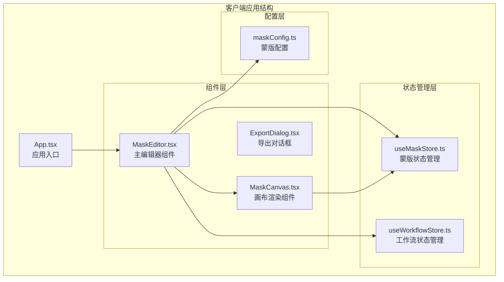
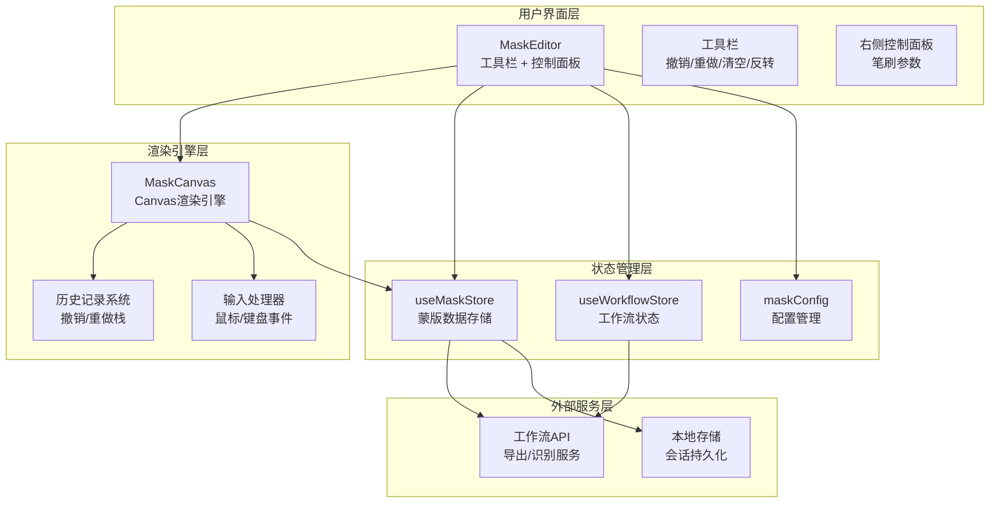
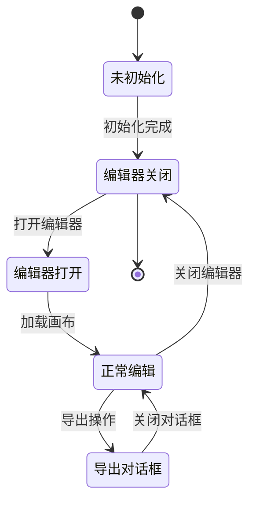
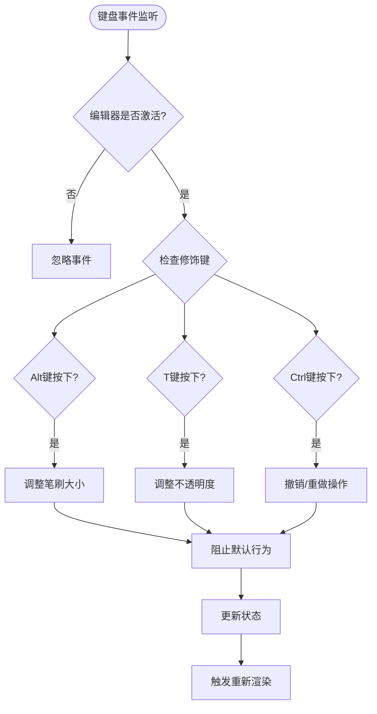
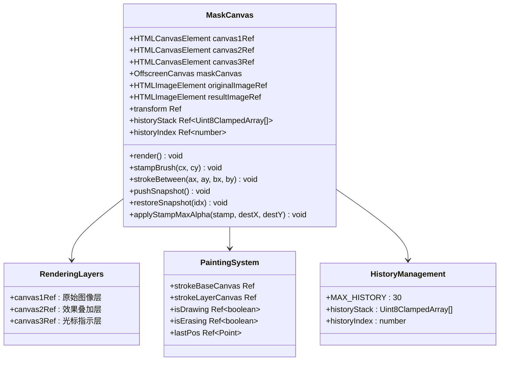
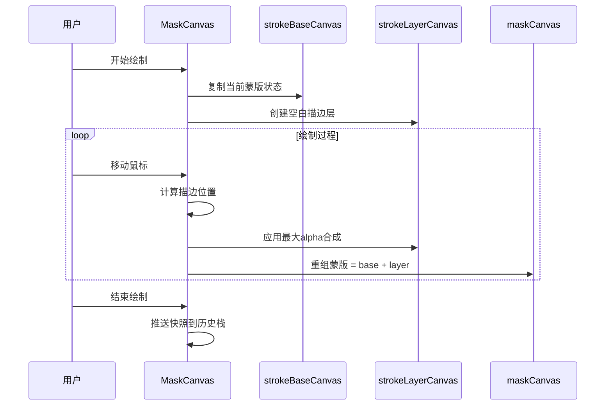
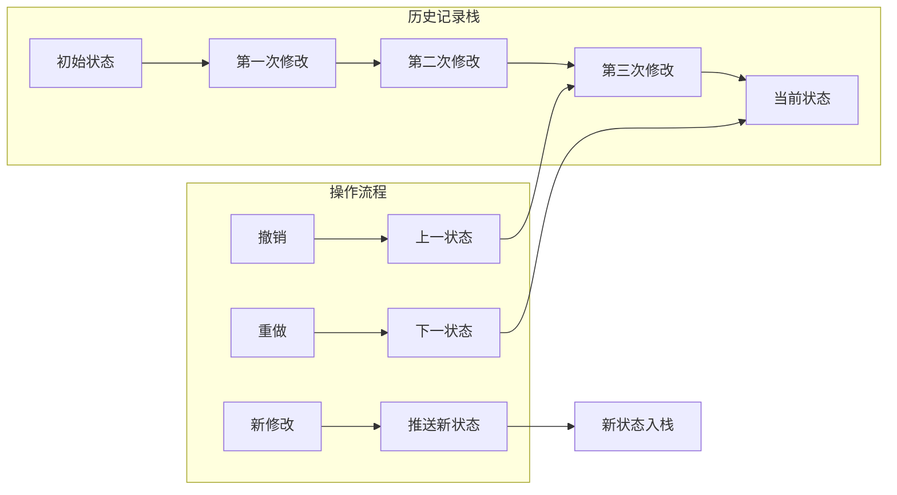
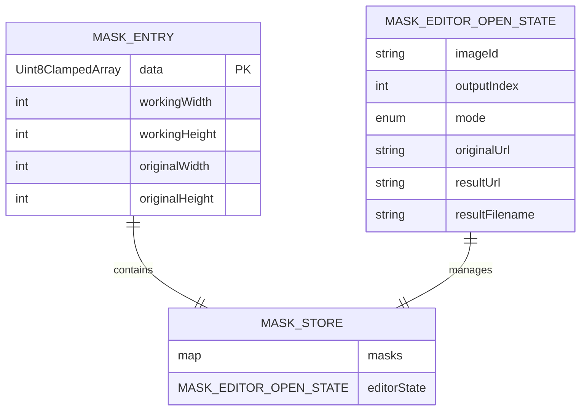
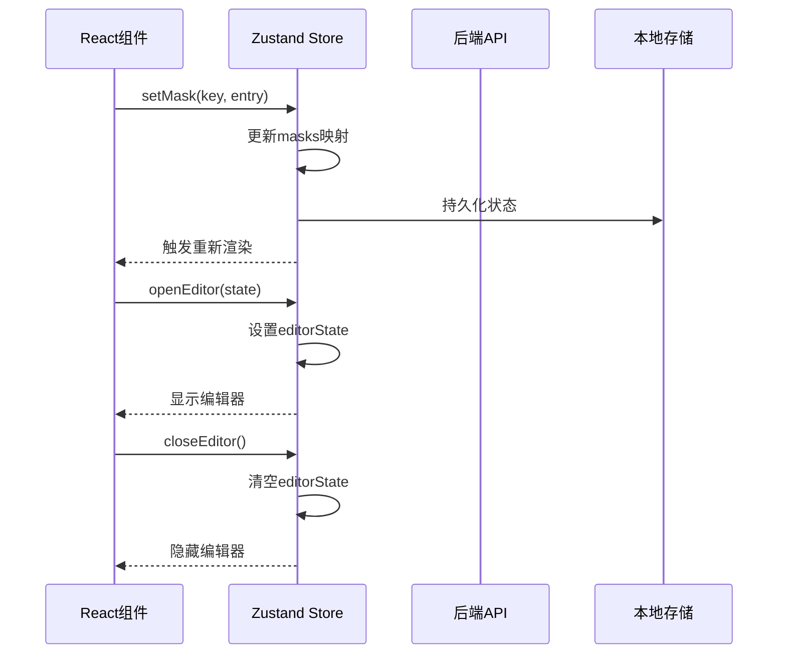
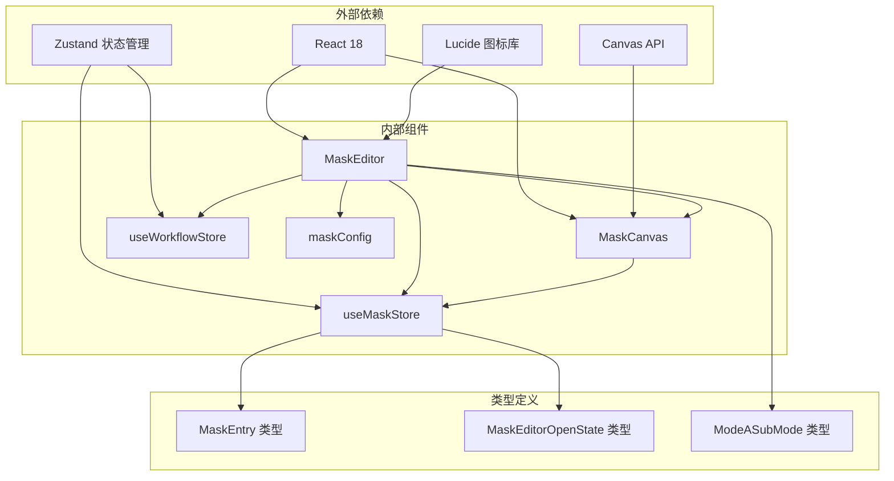

# 蒙版编辑器核心组件

<cite>
**本文档引用的文件**
- [MaskEditor.tsx](file://client/src/components/MaskEditor.tsx)
- [MaskCanvas.tsx](file://client/src/components/MaskCanvas.tsx)
- [useMaskStore.ts](file://client/src/hooks/useMaskStore.ts)
- [useWorkflowStore.ts](file://client/src/hooks/useWorkflowStore.ts)
- [maskConfig.ts](file://client/src/config/maskConfig.ts)
- [App.tsx](file://client/src/components/App.tsx)
- [2026-02-24-mask-editor.md](file://docs/plans/2026-02-24-mask-editor.md)
</cite>

## 目录
1. [简介](#简介)
2. [项目结构](#项目结构)
3. [核心组件](#核心组件)
4. [架构概览](#架构概览)
5. [详细组件分析](#详细组件分析)
6. [依赖关系分析](#依赖关系分析)
7. [性能考虑](#性能考虑)
8. [故障排除指南](#故障排除指南)
9. [结论](#结论)
10. [附录](#附录)

## 简介

蒙版编辑器是 CorineKit Pix2Real 项目中的核心图像处理组件，为用户提供专业的蒙版绘制和编辑功能。该组件支持两种工作模式：叠加模式（Mode A）和混合模式（Mode B），并提供了完整的撤销/重做系统、实时预览、批量导出等功能。

本组件采用 React Hooks 和 Zustand 状态管理，结合高性能的 Canvas API 实现流畅的绘画体验。用户可以通过鼠标和键盘快捷键进行精确控制，支持多种绘画工具和效果。

## 项目结构

蒙版编辑器位于客户端前端代码的组件目录中，与工作流存储、配置文件和其他 UI 组件协同工作。

**图表来源**
- [App.tsx:329](file://client/src/components/App.tsx#L329)
- [MaskEditor.tsx:141](file://client/src/components/MaskEditor.tsx#L141)
- [MaskCanvas.tsx:39](file://client/src/components/MaskCanvas.tsx#L39)

**章节来源**
- [App.tsx:54-335](file://client/src/components/App.tsx#L54-L335)
- [MaskEditor.tsx:1-375](file://client/src/components/MaskEditor.tsx#L1-L375)

## 核心组件

蒙版编辑器由三个主要组件构成，每个组件都有明确的职责分工：

### 主编辑器组件（MaskEditor）
负责整体界面布局、工具栏管理、快捷键处理和状态协调。它作为父组件协调子组件之间的通信，并维护全局的编辑参数。

### 画布渲染组件（MaskCanvas）
实现高性能的 Canvas 渲染引擎，包含完整的绘画逻辑、历史记录管理和交互处理。这是整个编辑器的核心渲染引擎。

### 状态管理钩子
使用 Zustand 创建独立的状态管理，提供蒙版数据存储、编辑器状态控制和工作流集成能力。

**章节来源**
- [MaskEditor.tsx:141-375](file://client/src/components/MaskEditor.tsx#L141-L375)
- [MaskCanvas.tsx:39-677](file://client/src/components/MaskCanvas.tsx#L39-L677)
- [useMaskStore.ts:32-51](file://client/src/hooks/useMaskStore.ts#L32-L51)

## 架构概览

蒙版编辑器采用分层架构设计，确保了良好的可维护性和扩展性。

**图表来源**
- [MaskEditor.tsx:269-375](file://client/src/components/MaskEditor.tsx#L269-L375)
- [MaskCanvas.tsx:17-150](file://client/src/components/MaskCanvas.tsx#L17-L150)
- [useMaskStore.ts:21-51](file://client/src/hooks/useMaskStore.ts#L21-L51)

## 详细组件分析

### MaskEditor 组件分析

MaskEditor 是整个蒙版编辑器的主控制器，负责协调各个子组件的工作。

#### 组件状态管理

**图表来源**
- [MaskEditor.tsx:141-375](file://client/src/components/MaskEditor.tsx#L141-L375)

#### 工具栏功能

工具栏提供以下核心功能：
- **模式切换**：在叠加模式和混合模式之间切换
- **蒙版控制**：显示/隐藏蒙版叠加、清空蒙版、反转蒙版
- **导出功能**：导出混合后的结果图像

#### 快捷键处理机制

系统实现了多层次的快捷键支持：

**图表来源**
- [MaskEditor.tsx:237-262](file://client/src/components/MaskEditor.tsx#L237-L262)
- [MaskCanvas.tsx:576-589](file://client/src/components/MaskCanvas.tsx#L576-L589)

**章节来源**
- [MaskEditor.tsx:141-375](file://client/src/components/MaskEditor.tsx#L141-L375)

### MaskCanvas 组件分析

MaskCanvas 是蒙版编辑器的核心渲染引擎，实现了高性能的 Canvas 操作和复杂的绘画算法。

#### 渲染架构

**图表来源**
- [MaskCanvas.tsx:55-150](file://client/src/components/MaskCanvas.tsx#L55-L150)

#### 非累积软笔刷算法

MaskCanvas 实现了独特的非累积软笔刷算法，解决了传统软笔刷在重叠时边缘硬化的问题：

**图表来源**
- [MaskCanvas.tsx:203-276](file://client/src/components/MaskCanvas.tsx#L203-L276)

#### 历史记录系统

历史记录系统采用固定大小的栈结构，支持高效的撤销和重做操作：

**图表来源**
- [MaskCanvas.tsx:180-201](file://client/src/components/MaskCanvas.tsx#L180-L201)

**章节来源**
- [MaskCanvas.tsx:39-677](file://client/src/components/MaskCanvas.tsx#L39-L677)

### 状态管理系统

蒙版编辑器使用 Zustand 创建了专门的状态管理模块，实现了数据的持久化和组件间的解耦。

#### 数据模型

**图表来源**
- [useMaskStore.ts:4-30](file://client/src/hooks/useMaskStore.ts#L4-L30)

#### 状态操作流程

**图表来源**
- [useMaskStore.ts:32-51](file://client/src/hooks/useMaskStore.ts#L32-L51)

**章节来源**
- [useMaskStore.ts:1-51](file://client/src/hooks/useMaskStore.ts#L1-L51)

## 依赖关系分析

蒙版编辑器组件间存在清晰的依赖关系，遵循单一职责原则和依赖倒置原则。

**图表来源**
- [MaskEditor.tsx:2-8](file://client/src/components/MaskEditor.tsx#L2-L8)
- [MaskCanvas.tsx:2-4](file://client/src/components/MaskCanvas.tsx#L2-L4)

### 组件耦合度分析

蒙版编辑器的设计体现了良好的内聚性和低耦合性：

- **MaskEditor** 作为协调者，只负责状态协调和界面布局
- **MaskCanvas** 专注于渲染和绘画逻辑，保持高度内聚
- **状态管理** 通过独立的 Hook 模块实现，便于测试和维护
- **配置管理** 通过常量和函数分离，支持灵活的配置

**章节来源**
- [MaskEditor.tsx:141-375](file://client/src/components/MaskEditor.tsx#L141-L375)
- [MaskCanvas.tsx:39-677](file://client/src/components/MaskCanvas.tsx#L39-L677)

## 性能考虑

蒙版编辑器在设计时充分考虑了性能优化，采用了多种技术手段确保流畅的用户体验。

### 渲染性能优化

1. **请求动画帧（requestAnimationFrame）**：使用单个渲染循环统一处理所有绘制操作
2. **脏标记系统**：只有在状态变化时才触发重新渲染
3. **离屏 Canvas**：使用 OffscreenCanvas 进行复杂的图像处理，避免主线程阻塞
4. **尺寸限制**：最大工作尺寸限制为 2048px，平衡质量与性能

### 内存管理

1. **历史记录限制**：最多保留 30 个历史状态，防止内存泄漏
2. **对象 URL 管理**：及时清理临时的图像对象 URL
3. **Canvas 尺寸优化**：动态调整 Canvas 尺寸，避免不必要的重绘

### 交互响应性

1. **稳定回调函数**：使用 useCallback 包装关键回调，减少不必要的组件重渲染
2. **事件委托**：集中处理键盘和鼠标事件，提高响应速度
3. **防抖处理**：对频繁触发的操作进行节流处理

## 故障排除指南

### 常见问题及解决方案

#### 画布无法加载

**症状**：编辑器打开后显示空白或加载失败

**可能原因**：
- 图像 URL 无效或跨域问题
- 浏览器不支持 OffscreenCanvas
- 网络连接异常

**解决方法**：
1. 检查图像 URL 是否正确
2. 确认浏览器支持 OffscreenCanvas 功能
3. 验证网络连接和 CORS 设置

#### 绘画功能异常

**症状**：无法正常绘制或绘制效果异常

**可能原因**：
- 鼠标事件监听失败
- Canvas 尺寸计算错误
- 历史记录栈溢出

**解决方法**：
1. 检查事件监听器绑定状态
2. 验证 Canvas 尺寸计算逻辑
3. 清理历史记录栈或增加容量

#### 快捷键失效

**症状**：Ctrl+Z、Ctrl+Y 等快捷键无法使用

**可能原因**：
- 键盘事件监听器被其他元素拦截
- 编辑器未获得焦点
- 事件冒泡被阻止

**解决方法**：
1. 确保编辑器容器具有正确的焦点
2. 检查事件监听器的优先级
3. 验证事件处理函数的绑定状态

**章节来源**
- [MaskCanvas.tsx:403-454](file://client/src/components/MaskCanvas.tsx#L403-L454)
- [MaskEditor.tsx:237-262](file://client/src/components/MaskEditor.tsx#L237-L262)

## 结论

蒙版编辑器是一个设计精良、功能完善的图像处理组件。其架构设计体现了现代前端开发的最佳实践：

1. **清晰的分层架构**：组件职责明确，便于维护和扩展
2. **高性能渲染引擎**：采用 Canvas API 和离屏渲染技术
3. **完善的交互系统**：支持丰富的快捷键和工具功能
4. **健壮的状态管理**：使用 Zustand 实现高效的状态同步
5. **优秀的用户体验**：流畅的性能表现和直观的操作界面

该组件为 CorineKit Pix2Real 项目提供了强大的蒙版编辑能力，支持从简单的图像遮罩到复杂的混合效果创作，满足专业用户的各种需求。

## 附录

### 使用指南

#### 基本操作流程

1. **打开编辑器**：双击图像卡片或选择"新建/编辑蒙版"
2. **选择模式**：根据需求选择叠加模式或混合模式
3. **调整参数**：使用右侧面板调整笔刷大小、硬度和不透明度
4. **开始绘制**：使用鼠标左键进行绘制，右键进行擦除
5. **使用快捷键**：
   - Ctrl+Z：撤销上一步操作
   - Ctrl+Y：重做上一步操作
   - Alt+滚轮：调整笔刷大小
   - T+滚轮：调整不透明度
6. **导出结果**：点击导出按钮保存混合后的图像

#### 最佳实践

1. **合理设置笔刷参数**：根据图像细节选择合适的笔刷大小和硬度
2. **利用撤销功能**：频繁使用 Ctrl+Z 进行错误修正
3. **分层绘制**：对于复杂图像，建议分层绘制不同区域
4. **定期保存**：使用导出功能定期保存中间结果
5. **注意性能**：大尺寸图像可能影响性能，适当调整工作分辨率

### 技术规格

- **支持格式**：PNG、JPEG、WebP
- **最大分辨率**：2048×2048 像素
- **历史记录**：最多 30 步撤销/重做
- **响应时间**：小于 16ms 的交互延迟
- **内存占用**：按图像大小线性增长