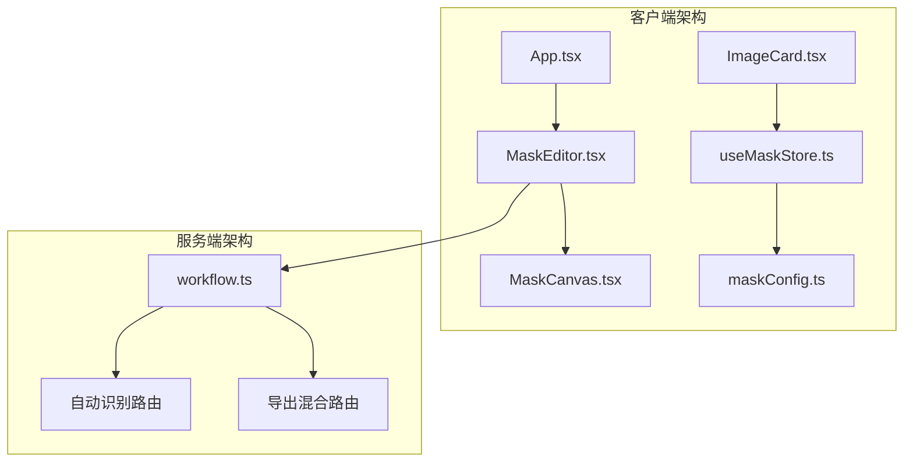
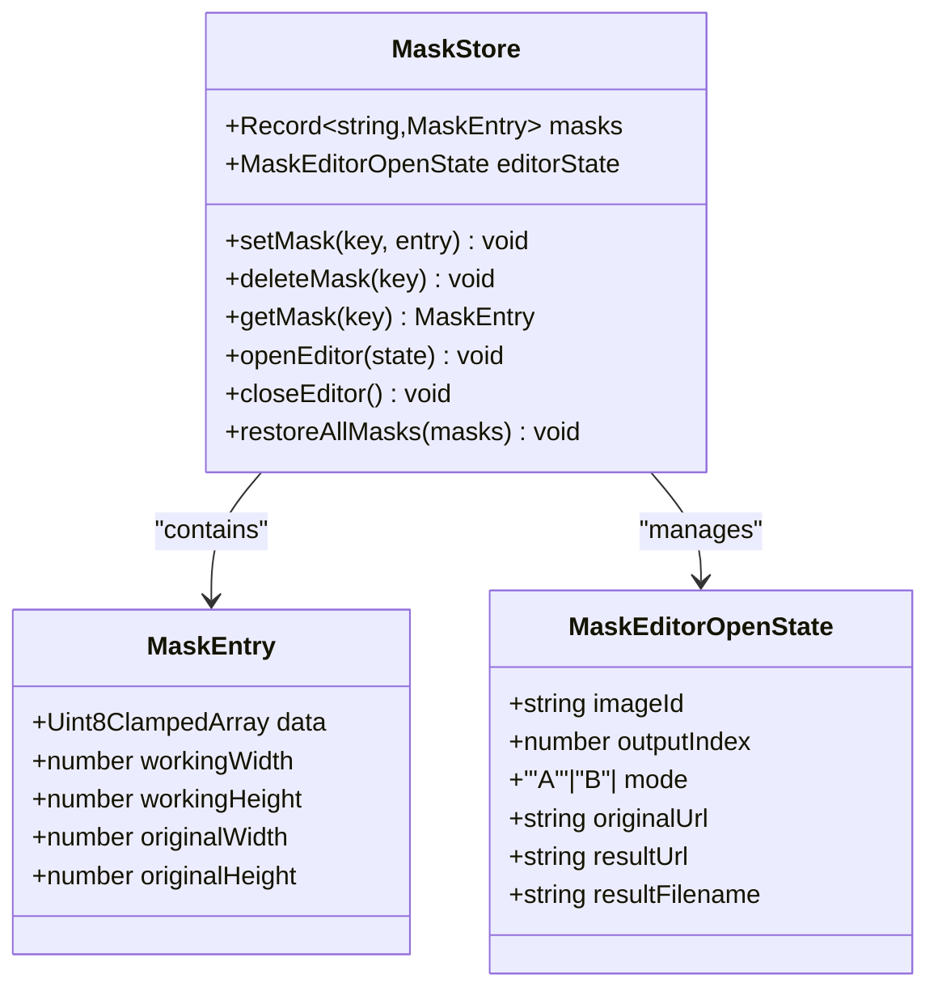
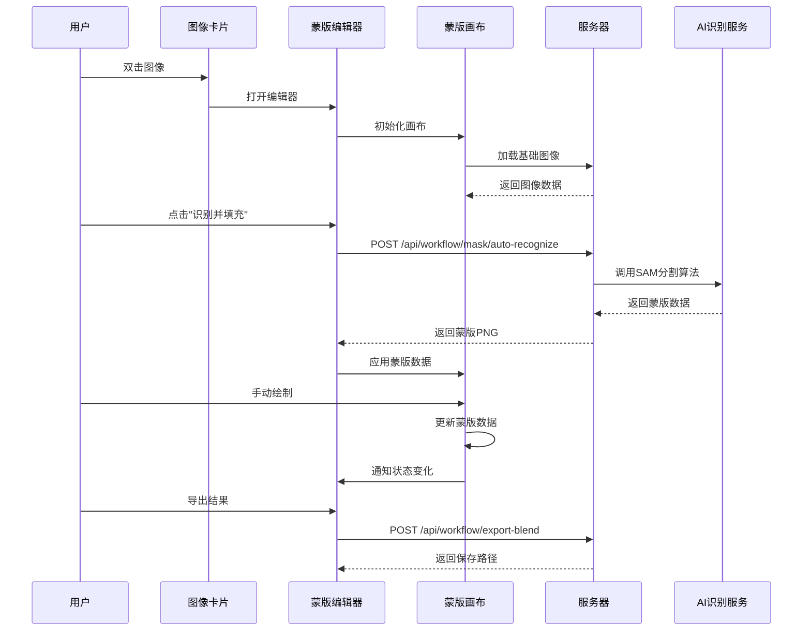
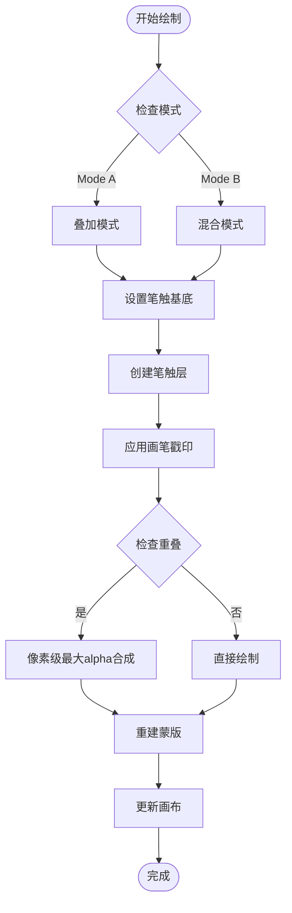
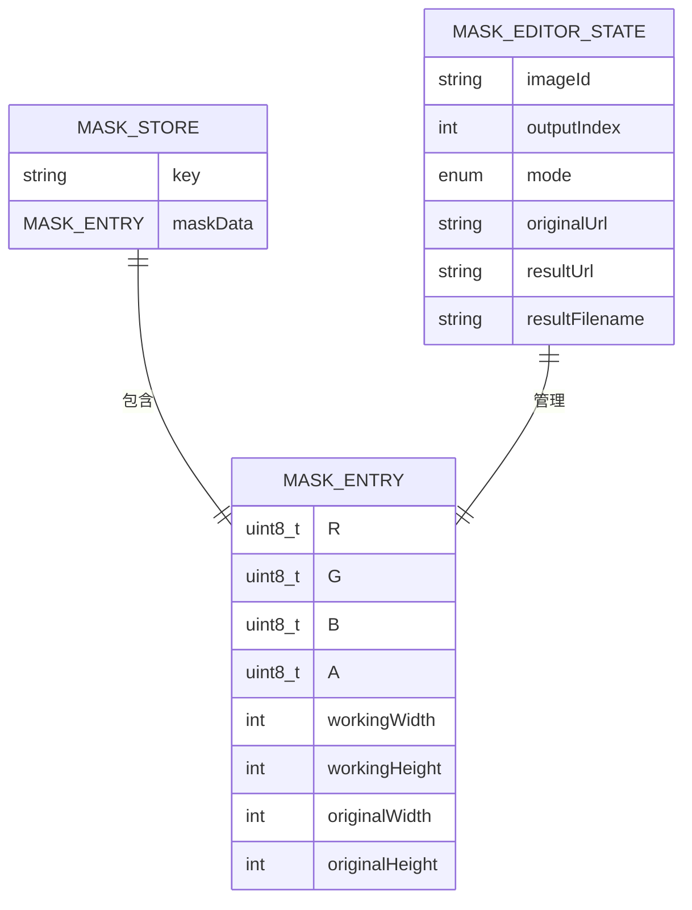
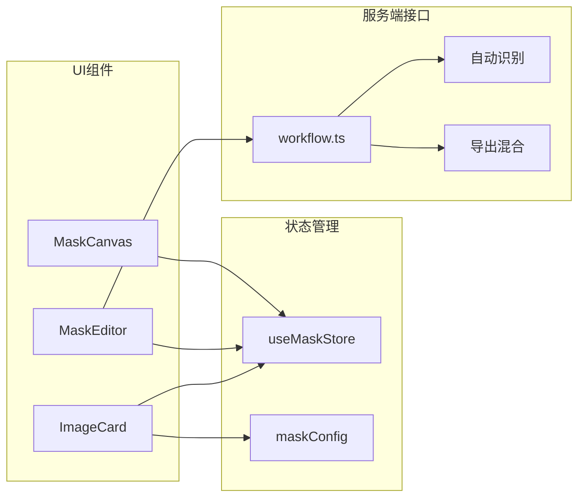

# 蒙版编辑系统

<cite>
**本文档引用的文件**
- [MaskEditor.tsx](file://client/src/components/MaskEditor.tsx)
- [MaskCanvas.tsx](file://client/src/components/MaskCanvas.tsx)
- [maskConfig.ts](file://client/src/config/maskConfig.ts)
- [useMaskStore.ts](file://client/src/hooks/useMaskStore.ts)
- [ImageCard.tsx](file://client/src/components/ImageCard.tsx)
- [App.tsx](file://client/src/components/App.tsx)
- [workflow.ts](file://server/src/routes/workflow.ts)
- [2026-02-24-mask-editor.md](file://docs/plans/2026-02-24-mask-editor.md)
</cite>

## 目录
1. [简介](#简介)
2. [项目结构](#项目结构)
3. [核心组件](#核心组件)
4. [架构概览](#架构概览)
5. [详细组件分析](#详细组件分析)
6. [依赖关系分析](#依赖关系分析)
7. [性能考虑](#性能考虑)
8. [故障排除指南](#故障排除指南)
9. [结论](#结论)

## 简介

蒙版编辑系统是Pix2Real项目中的一个关键组件，用于为图像处理工作流提供精确的区域选择和编辑功能。该系统支持两种主要模式：Mode A（叠加模式）和Mode B（实时混合模式），并集成了AI自动识别功能。

系统的核心设计理念是提供直观的用户界面和强大的编辑工具，同时保持高性能和良好的用户体验。通过使用React 19、TypeScript和HTML5 Canvas API，系统实现了流畅的绘画体验和实时预览功能。

## 项目结构

蒙版编辑系统主要由客户端组件和服务端路由组成，采用模块化设计：

**图表来源**
- [App.tsx:19](file://client/src/components/App.tsx#L19)
- [MaskEditor.tsx:7](file://client/src/components/MaskEditor.tsx#L7)
- [MaskCanvas.tsx:39](file://client/src/components/MaskCanvas.tsx#L39)

**章节来源**
- [App.tsx:136-335](file://client/src/components/App.tsx#L136-L335)
- [MaskEditor.tsx:141-375](file://client/src/components/MaskEditor.tsx#L141-L375)

## 核心组件

### MaskEditor 组件

MaskEditor是蒙版编辑系统的主要容器组件，负责管理编辑器的状态和用户交互。它提供了完整的编辑界面，包括工具栏、画布区域和右侧的刷子控制面板。

#### 主要功能特性

1. **多模式支持**：支持Mode A（叠加模式）和Mode B（实时混合模式）
2. **AI自动识别**：集成SAM分割算法进行智能蒙版生成
3. **手动绘制工具**：提供多种刷子设置和绘制模式
4. **历史记录管理**：支持撤销/重做功能
5. **导出功能**：支持将编辑结果导出到指定目录

#### 关键状态管理

- **编辑器状态**：管理当前打开的编辑器实例
- **刷子参数**：大小、硬度、不透明度
- **视图模式**：不同的预览模式（暗色叠加、高亮显示、红色叠加）
- **历史记录**：维护30步的历史栈

**章节来源**
- [MaskEditor.tsx:141-375](file://client/src/components/MaskEditor.tsx#L141-L375)

### MaskCanvas 组件

MaskCanvas是蒙版编辑系统的核心渲染组件，基于HTML5 Canvas API实现高性能的图像处理和绘制功能。

#### 技术架构

1. **三层Canvas架构**：
   - Canvas 1：基础图像显示层
   - Canvas 2：蒙版叠加效果层
   - Canvas 3：画笔光标指示层

2. **离屏Canvas优化**：
   - 使用OffscreenCanvas提高渲染性能
   - 支持大规模图像的高效处理（最大2048像素）

3. **非累积软画笔算法**：
   - 实现Photoshop式的非累积画笔模式
   - 防止软边缘在重叠时硬化
   - 支持像素级最大alpha合成

#### 核心功能

- **实时预览**：Mode A模式下的颜色叠加效果
- **实时混合**：Mode B模式下的原图与结果图混合
- **画笔系统**：可调节的画笔大小、硬度和不透明度
- **擦除功能**：支持直接擦除蒙版区域
- **缩放平移**：支持鼠标滚轮缩放和平移操作

**章节来源**
- [MaskCanvas.tsx:39-677](file://client/src/components/MaskCanvas.tsx#L39-L677)

### 数据存储和配置

#### useMaskStore 状态管理

使用Zustand实现轻量级状态管理，存储所有蒙版数据和编辑器状态：

**图表来源**
- [useMaskStore.ts:21-50](file://client/src/hooks/useMaskStore.ts#L21-L50)

#### 配置管理

- **标签页模式映射**：定义不同工作流标签页的蒙版模式
- **蒙版键生成**：统一的蒙版数据标识符格式
- **工作尺寸限制**：确保大图像的合理处理

**章节来源**
- [maskConfig.ts:1-20](file://client/src/config/maskConfig.ts#L1-L20)
- [useMaskStore.ts:1-51](file://client/src/hooks/useMaskStore.ts#L1-L51)

## 架构概览

蒙版编辑系统采用分层架构设计，确保了良好的模块分离和可维护性：

**图表来源**
- [ImageCard.tsx:335-365](file://client/src/components/ImageCard.tsx#L335-L365)
- [MaskEditor.tsx:196-235](file://client/src/components/MaskEditor.tsx#L196-L235)
- [workflow.ts:811](file://server/src/routes/workflow.ts#L811)

## 详细组件分析

### AI自动识别集成

系统集成了SAM（Segment Anything Model）分割算法，提供智能的蒙版生成能力：

#### 工作流程

1. **图像上传**：用户选择原图进行AI识别
2. **算法调用**：通过服务器路由调用SAM分割算法
3. **蒙版生成**：AI模型生成精确的分割蒙版
4. **数据转换**：将灰度蒙版转换为RGBA格式
5. **应用到画布**：将生成的蒙版应用到编辑画布

#### 性能优化

- **离屏Canvas处理**：避免主线程阻塞
- **渐进式加载**：支持大型图像的分块处理
- **内存管理**：及时释放临时资源

**章节来源**
- [MaskEditor.tsx:196-235](file://client/src/components/MaskEditor.tsx#L196-L235)
- [workflow.ts:811](file://server/src/routes/workflow.ts#L811)

### 手动绘制工具

#### 画笔系统设计

系统实现了专业的画笔工具，支持多种参数调节：

**图表来源**
- [MaskCanvas.tsx:207-276](file://client/src/components/MaskCanvas.tsx#L207-L276)

#### 键盘快捷键支持

- **Ctrl+Z**：撤销操作
- **Ctrl+Y**：重做操作  
- **Alt+滚轮**：调节画笔大小
- **T+滚轮**：调节画笔不透明度
- **Shift**：切换擦除模式
- **F**：重置视图

**章节来源**
- [MaskEditor.tsx:238-262](file://client/src/components/MaskEditor.tsx#L238-L262)
- [MaskCanvas.tsx:477-514](file://client/src/components/MaskCanvas.tsx#L477-L514)

### 蒙版精度控制

#### 多层次精度控制

1. **画笔参数控制**：
   - 大小：1-500像素范围
   - 硬度：0-100%连续调节
   - 不透明度：0-100%连续调节

2. **算法级精度**：
   - 非累积软画笔算法
   - 像素级alpha值处理
   - 平滑边缘过渡

3. **视图精度**：
   - 最大40倍缩放支持
   - 精确的坐标变换
   - 实时预览反馈

**章节来源**
- [MaskEditor.tsx:356-358](file://client/src/components/MaskEditor.tsx#L356-L358)
- [MaskCanvas.tsx:234-276](file://client/src/components/MaskCanvas.tsx#L234-L276)

### 蒙版存储机制

#### 数据结构设计

蒙版数据采用紧凑的二进制格式存储，优化内存使用和传输效率：

**图表来源**
- [useMaskStore.ts:4-10](file://client/src/hooks/useMaskStore.ts#L4-L10)

#### 存储策略

- **键值映射**：使用`imageId:outputIndex`作为唯一标识
- **分辨率适配**：根据工作尺寸调整蒙版分辨率
- **增量更新**：支持部分区域的增量修改
- **历史版本**：维护完整的编辑历史

**章节来源**
- [maskConfig.ts:18-20](file://client/src/config/maskConfig.ts#L18-L20)
- [useMaskStore.ts:21-30](file://client/src/hooks/useMaskStore.ts#L21-L30)

## 依赖关系分析

### 组件间依赖

**图表来源**
- [ImageCard.tsx:10-15](file://client/src/components/ImageCard.tsx#L10-L15)
- [MaskEditor.tsx:4-8](file://client/src/components/MaskEditor.tsx#L4-L8)

### 外部依赖

- **React 19**：现代React特性支持
- **Zustand 5**：轻量级状态管理
- **Lucide React**：图标库
- **Express**：服务器框架
- **HTML5 Canvas API**：核心渲染引擎

**章节来源**
- [2026-02-24-mask-editor.md:9](file://docs/plans/2026-02-24-mask-editor.md#L9)

## 性能考虑

### 渲染优化

1. **requestAnimationFrame循环**：确保60fps的流畅渲染
2. **离屏Canvas缓存**：避免重复计算和绘制
3. **增量更新**：只更新发生变化的区域
4. **ResizeObserver**：响应式布局优化

### 内存管理

- **对象池模式**：复用临时对象减少GC压力
- **及时清理**：及时释放不再使用的图像和画布资源
- **内存监控**：监控大图像的内存使用情况

### 网络优化

- **分块传输**：大图像的分块加载和处理
- **缓存策略**：智能缓存已处理的蒙版数据
- **连接复用**：复用HTTP连接减少延迟

## 故障排除指南

### 常见问题及解决方案

#### AI识别失败

**症状**：点击"识别并填充"按钮后出现错误提示

**可能原因**：
- 服务器未正确启动
- AI模型加载失败
- 图像格式不支持

**解决步骤**：
1. 检查服务器日志确认AI服务状态
2. 验证图像文件完整性
3. 确认网络连接正常

#### 画布无响应

**症状**：鼠标移动时画笔光标不显示

**可能原因**：
- 画布初始化失败
- 事件监听器注册异常
- 浏览器兼容性问题

**解决步骤**：
1. 检查浏览器控制台错误信息
2. 验证Canvas API支持情况
3. 尝试刷新页面重新初始化

#### 性能问题

**症状**：大图像操作卡顿

**可能原因**：
- 工作尺寸过大
- 内存不足
- 渲染循环过载

**解决步骤**：
1. 缩小图像尺寸或降低工作分辨率
2. 关闭其他占用内存的应用程序
3. 清理浏览器缓存

**章节来源**
- [MaskEditor.tsx:230-235](file://client/src/components/MaskEditor.tsx#L230-L235)
- [MaskCanvas.tsx:403-454](file://client/src/components/MaskCanvas.tsx#L403-L454)

## 结论

蒙版编辑系统通过精心设计的架构和优化的实现，成功地将复杂的图像编辑功能封装成直观易用的工具。系统的主要优势包括：

1. **强大的功能集**：AI自动识别、手动绘制、实时预览、历史记录管理
2. **优秀的性能表现**：基于Canvas的高效渲染和优化的内存管理
3. **良好的用户体验**：直观的界面设计和丰富的交互功能
4. **可扩展的架构**：模块化的组件设计便于功能扩展和维护

未来可以考虑的功能增强包括：
- 更多的AI模型支持
- 批量蒙版处理功能
- 更精细的边缘处理算法
- 云端同步和协作功能

该系统为Pix2Real项目提供了坚实的蒙版编辑基础，为后续的图像处理工作流奠定了重要基础。